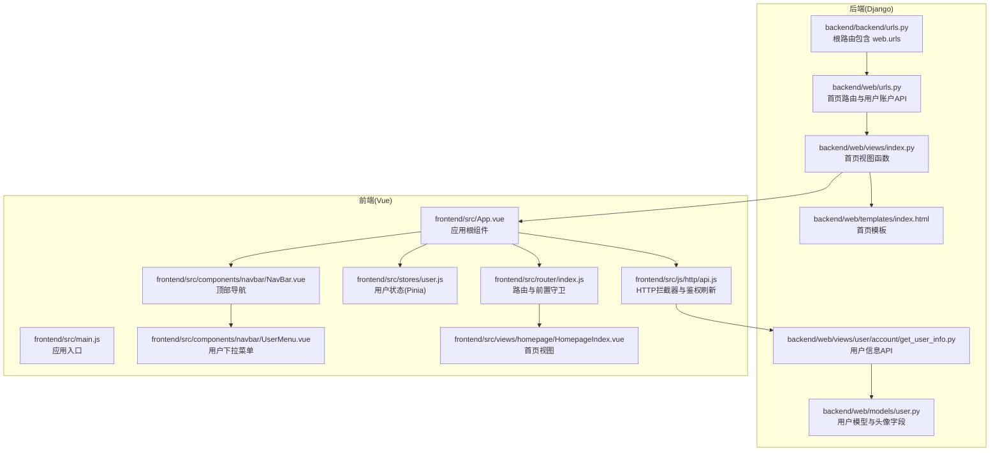
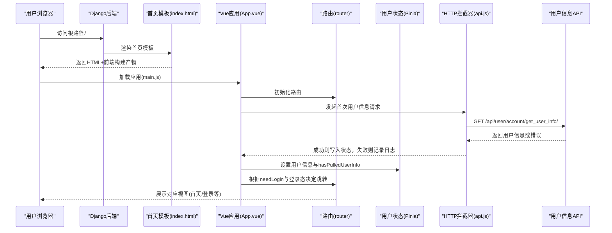
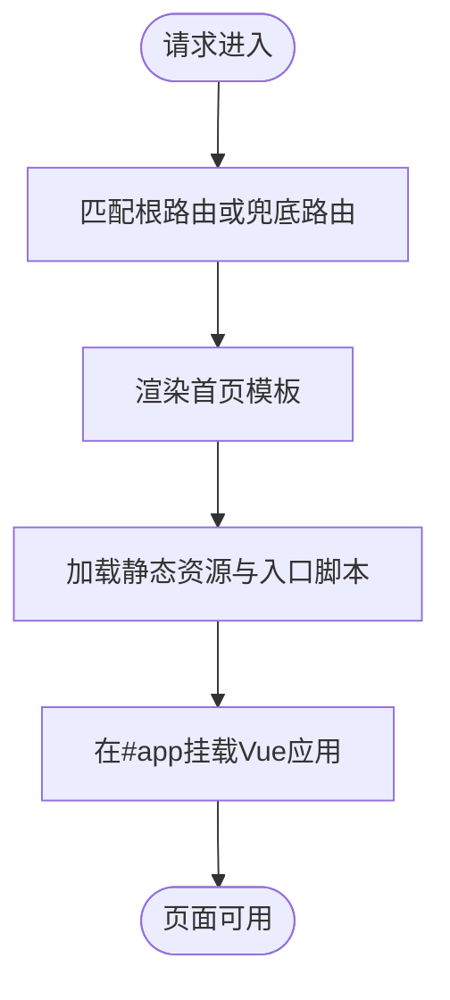
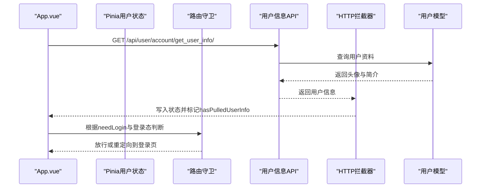
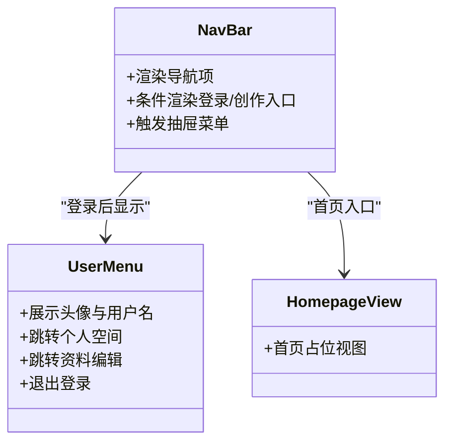
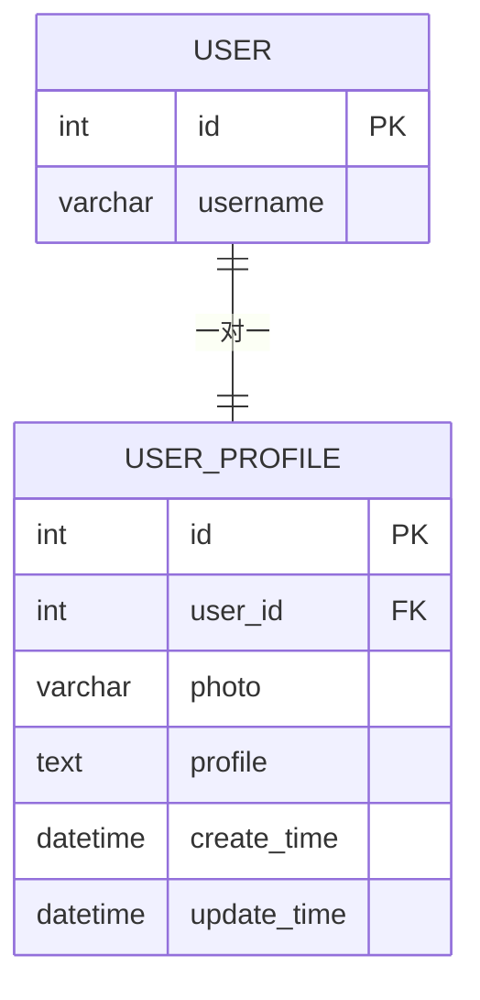
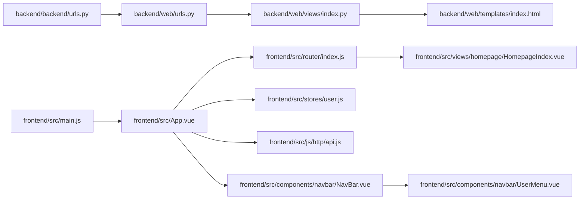

# 首页视图

<cite>
**本文引用的文件**
- [backend/web/views/index.py](file://backend/web/views/index.py)
- [backend/web/templates/index.html](file://backend/web/templates/index.html)
- [backend/web/urls.py](file://backend/web/urls.py)
- [backend/backend/urls.py](file://backend/backend/urls.py)
- [backend/web/views/user/account/get_user_info.py](file://backend/web/views/user/account/get_user_info.py)
- [backend/web/models/user.py](file://backend/web/models/user.py)
- [frontend/src/App.vue](file://frontend/src/App.vue)
- [frontend/src/main.js](file://frontend/src/main.js)
- [frontend/src/stores/user.js](file://frontend/src/stores/user.js)
- [frontend/src/router/index.js](file://frontend/src/router/index.js)
- [frontend/src/js/http/api.js](file://frontend/src/js/http/api.js)
- [frontend/src/components/navbar/NavBar.vue](file://frontend/src/components/navbar/NavBar.vue)
- [frontend/src/components/navbar/UserMenu.vue](file://frontend/src/components/navbar/UserMenu.vue)
- [frontend/src/views/homepage/HomepageIndex.vue](file://frontend/src/views/homepage/HomepageIndex.vue)
</cite>

## 目录
1. [简介](#简介)
2. [项目结构](#项目结构)
3. [核心组件](#核心组件)
4. [架构总览](#架构总览)
5. [详细组件分析](#详细组件分析)
6. [依赖分析](#依赖分析)
7. [性能考虑](#性能考虑)
8. [故障排查指南](#故障排查指南)
9. [结论](#结论)
10. [附录](#附录)

## 简介
本文件面向 LLM_AIfriends 项目的“首页视图”，系统性阐述其从 Django 后端到 Vue 前端的完整实现路径与交互流程。重点包括：
- 首页视图的后端渲染与模板组织
- 用户信息拉取与权限控制
- 导航结构与用户信息展示
- 权限控制、鉴权刷新与前端路由守卫
- 性能优化与缓存策略建议
- 定制化扩展指南与常见问题解决方案

## 项目结构
首页视图由后端 Django 视图负责渲染前端打包产物，前端通过路由与状态管理完成用户信息拉取、权限控制与导航展示。

图表来源
- [backend/backend/urls.py:23-26](file://backend/backend/urls.py#L23-L26)
- [backend/web/urls.py:10-23](file://backend/web/urls.py#L10-L23)
- [backend/web/views/index.py:1-4](file://backend/web/views/index.py#L1-L4)
- [backend/web/templates/index.html:1-17](file://backend/web/templates/index.html#L1-L17)
- [backend/web/views/user/account/get_user_info.py:8-25](file://backend/web/views/user/account/get_user_info.py#L8-L25)
- [backend/web/models/user.py:15-23](file://backend/web/models/user.py#L15-L23)
- [frontend/src/main.js:1-15](file://frontend/src/main.js#L1-L15)
- [frontend/src/App.vue:13-31](file://frontend/src/App.vue#L13-L31)
- [frontend/src/router/index.js:12-101](file://frontend/src/router/index.js#L12-L101)
- [frontend/src/stores/user.js:4-59](file://frontend/src/stores/user.js#L4-L59)
- [frontend/src/js/http/api.js:16-92](file://frontend/src/js/http/api.js#L16-L92)
- [frontend/src/components/navbar/NavBar.vue:15-79](file://frontend/src/components/navbar/NavBar.vue#L15-L79)
- [frontend/src/components/navbar/UserMenu.vue:36-77](file://frontend/src/components/navbar/UserMenu.vue#L36-L77)
- [frontend/src/views/homepage/HomepageIndex.vue:5-7](file://frontend/src/views/homepage/HomepageIndex.vue#L5-L7)

章节来源
- [backend/backend/urls.py:23-26](file://backend/backend/urls.py#L23-L26)
- [backend/web/urls.py:10-23](file://backend/web/urls.py#L10-L23)
- [backend/web/views/index.py:1-4](file://backend/web/views/index.py#L1-L4)
- [backend/web/templates/index.html:1-17](file://backend/web/templates/index.html#L1-L17)
- [frontend/src/main.js:1-15](file://frontend/src/main.js#L1-L15)
- [frontend/src/App.vue:13-31](file://frontend/src/App.vue#L13-L31)
- [frontend/src/router/index.js:12-101](file://frontend/src/router/index.js#L12-L101)
- [frontend/src/stores/user.js:4-59](file://frontend/src/stores/user.js#L4-L59)
- [frontend/src/js/http/api.js:16-92](file://frontend/src/js/http/api.js#L16-L92)
- [frontend/src/components/navbar/NavBar.vue:15-79](file://frontend/src/components/navbar/NavBar.vue#L15-L79)
- [frontend/src/components/navbar/UserMenu.vue:36-77](file://frontend/src/components/navbar/UserMenu.vue#L36-L77)
- [frontend/src/views/homepage/HomepageIndex.vue:5-7](file://frontend/src/views/homepage/HomepageIndex.vue#L5-L7)

## 核心组件
- 后端首页视图函数：负责渲染首页模板，模板内加载前端构建产物并挂载到容器节点。
- 首页模板：引入静态资源、favicon、入口脚本与样式，并提供应用挂载点。
- 路由与兜底：根路由与兜底路由均指向首页视图，确保 SPA 正常运行。
- 用户信息 API：基于 DRF 的类视图，要求已认证用户访问，返回用户基本信息与头像链接。
- 应用根组件：在挂载时拉取用户信息，设置登录状态与用户资料，并根据路由元信息进行登录校验。
- 前端状态与拦截器：Pinia 管理用户状态；Axios 拦截器统一注入 Bearer Token 并处理 401 刷新。
- 导航与用户菜单：顶部导航根据登录态显示不同入口；用户菜单展示头像、用户名并提供登出操作。

章节来源
- [backend/web/views/index.py:1-4](file://backend/web/views/index.py#L1-L4)
- [backend/web/templates/index.html:1-17](file://backend/web/templates/index.html#L1-L17)
- [backend/web/urls.py:19-22](file://backend/web/urls.py#L19-L22)
- [backend/web/views/user/account/get_user_info.py:8-25](file://backend/web/views/user/account/get_user_info.py#L8-L25)
- [frontend/src/App.vue:13-31](file://frontend/src/App.vue#L13-L31)
- [frontend/src/stores/user.js:4-59](file://frontend/src/stores/user.js#L4-L59)
- [frontend/src/js/http/api.js:16-92](file://frontend/src/js/http/api.js#L16-L92)
- [frontend/src/components/navbar/NavBar.vue:15-79](file://frontend/src/components/navbar/NavBar.vue#L15-L79)
- [frontend/src/components/navbar/UserMenu.vue:36-77](file://frontend/src/components/navbar/UserMenu.vue#L36-L77)

## 架构总览
首页视图采用“后端模板渲染 + 前端单页应用”的混合架构：
- 后端负责提供首页 HTML 与静态资源服务，模板中直接加载前端构建产物。
- 前端在运行时通过路由与状态管理完成用户信息拉取、权限控制与导航展示。
- 用户信息 API 采用 DRF 的认证机制，确保仅登录用户可访问。

图表来源
- [backend/web/views/index.py:1-4](file://backend/web/views/index.py#L1-L4)
- [backend/web/templates/index.html:1-17](file://backend/web/templates/index.html#L1-L17)
- [frontend/src/main.js:1-15](file://frontend/src/main.js#L1-L15)
- [frontend/src/App.vue:13-31](file://frontend/src/App.vue#L13-L31)
- [frontend/src/router/index.js:92-101](file://frontend/src/router/index.js#L92-L101)
- [frontend/src/stores/user.js:26-43](file://frontend/src/stores/user.js#L26-L43)
- [frontend/src/js/http/api.js:16-92](file://frontend/src/js/http/api.js#L16-L92)
- [backend/web/views/user/account/get_user_info.py:8-25](file://backend/web/views/user/account/get_user_info.py#L8-L25)

## 详细组件分析

### 后端首页视图与模板
- 视图函数职责：接收请求并渲染首页模板，不传递额外上下文。
- 模板职责：引入静态资源、favicon、入口脚本与样式，提供应用挂载点。
- 路由策略：根路由与兜底路由均指向首页视图，保证 SPA 在任意路径下都能正确加载。

图表来源
- [backend/web/urls.py:19-22](file://backend/web/urls.py#L19-L22)
- [backend/web/views/index.py:1-4](file://backend/web/views/index.py#L1-L4)
- [backend/web/templates/index.html:1-17](file://backend/web/templates/index.html#L1-L17)

章节来源
- [backend/web/views/index.py:1-4](file://backend/web/views/index.py#L1-L4)
- [backend/web/templates/index.html:1-17](file://backend/web/templates/index.html#L1-L17)
- [backend/web/urls.py:19-22](file://backend/web/urls.py#L19-L22)

### 用户信息拉取与权限控制
- 前端在应用挂载时发起用户信息请求，成功后写入 Pinia 状态，并标记已拉取用户信息。
- 若目标路由声明需登录且当前未登录，路由前置守卫会重定向至登录页。
- 后端用户信息 API 使用 DRF 的认证类，仅允许已认证用户访问。
- HTTP 拦截器统一注入 Bearer Token；当返回 401 时尝试使用刷新令牌刷新访问令牌，失败则清除本地登录状态。

图表来源
- [frontend/src/App.vue:13-31](file://frontend/src/App.vue#L13-L31)
- [frontend/src/stores/user.js:26-43](file://frontend/src/stores/user.js#L26-L43)
- [frontend/src/router/index.js:92-101](file://frontend/src/router/index.js#L92-L101)
- [frontend/src/js/http/api.js:16-92](file://frontend/src/js/http/api.js#L16-L92)
- [backend/web/views/user/account/get_user_info.py:8-25](file://backend/web/views/user/account/get_user_info.py#L8-L25)
- [backend/web/models/user.py:15-23](file://backend/web/models/user.py#L15-L23)

章节来源
- [frontend/src/App.vue:13-31](file://frontend/src/App.vue#L13-L31)
- [frontend/src/router/index.js:92-101](file://frontend/src/router/index.js#L92-L101)
- [frontend/src/js/http/api.js:16-92](file://frontend/src/js/http/api.js#L16-L92)
- [backend/web/views/user/account/get_user_info.py:8-25](file://backend/web/views/user/account/get_user_info.py#L8-L25)
- [backend/web/models/user.py:15-23](file://backend/web/models/user.py#L15-L23)

### 导航结构与用户信息展示
- 顶部导航根据登录态显示“创作”、“登录”或用户菜单；左侧抽屉式导航提供首页、好友、创作入口。
- 用户菜单展示头像与用户名，支持跳转个人空间与编辑资料，并提供退出登录操作。
- 首页视图为占位组件，实际内容由前端路由与视图组件组合呈现。

图表来源
- [frontend/src/components/navbar/NavBar.vue:15-79](file://frontend/src/components/navbar/NavBar.vue#L15-L79)
- [frontend/src/components/navbar/UserMenu.vue:36-77](file://frontend/src/components/navbar/UserMenu.vue#L36-L77)
- [frontend/src/views/homepage/HomepageIndex.vue:5-7](file://frontend/src/views/homepage/HomepageIndex.vue#L5-L7)

章节来源
- [frontend/src/components/navbar/NavBar.vue:15-79](file://frontend/src/components/navbar/NavBar.vue#L15-L79)
- [frontend/src/components/navbar/UserMenu.vue:36-77](file://frontend/src/components/navbar/UserMenu.vue#L36-L77)
- [frontend/src/views/homepage/HomepageIndex.vue:5-7](file://frontend/src/views/homepage/HomepageIndex.vue#L5-L7)

### 数据模型与字段
用户资料模型包含一对一关联的用户对象、头像图片字段与简介文本，用于首页与用户菜单的信息展示。

图表来源
- [backend/web/models/user.py:15-23](file://backend/web/models/user.py#L15-L23)

章节来源
- [backend/web/models/user.py:15-23](file://backend/web/models/user.py#L15-L23)

## 依赖分析
- 后端路由依赖：根路由包含 web 子路由，首页视图与用户账户 API 均在此注册。
- 前端应用依赖：main.js 创建应用并挂载；App.vue 作为根组件，负责用户信息拉取与路由守卫联动。
- 前端状态与拦截器：Pinia 提供用户状态；api.js 统一处理鉴权与刷新。
- 导航组件依赖：NavBar 依赖用户状态与路由；UserMenu 依赖用户状态与路由跳转。

图表来源
- [backend/backend/urls.py:23-26](file://backend/backend/urls.py#L23-L26)
- [backend/web/urls.py:10-23](file://backend/web/urls.py#L10-L23)
- [backend/web/views/index.py:1-4](file://backend/web/views/index.py#L1-L4)
- [backend/web/templates/index.html:1-17](file://backend/web/templates/index.html#L1-L17)
- [frontend/src/main.js:1-15](file://frontend/src/main.js#L1-L15)
- [frontend/src/App.vue:13-31](file://frontend/src/App.vue#L13-L31)
- [frontend/src/router/index.js:12-101](file://frontend/src/router/index.js#L12-L101)
- [frontend/src/stores/user.js:4-59](file://frontend/src/stores/user.js#L4-L59)
- [frontend/src/js/http/api.js:16-92](file://frontend/src/js/http/api.js#L16-L92)
- [frontend/src/components/navbar/NavBar.vue:15-79](file://frontend/src/components/navbar/NavBar.vue#L15-L79)
- [frontend/src/components/navbar/UserMenu.vue:36-77](file://frontend/src/components/navbar/UserMenu.vue#L36-L77)
- [frontend/src/views/homepage/HomepageIndex.vue:5-7](file://frontend/src/views/homepage/HomepageIndex.vue#L5-L7)

章节来源
- [backend/backend/urls.py:23-26](file://backend/backend/urls.py#L23-L26)
- [backend/web/urls.py:10-23](file://backend/web/urls.py#L10-L23)
- [frontend/src/main.js:1-15](file://frontend/src/main.js#L1-L15)
- [frontend/src/App.vue:13-31](file://frontend/src/App.vue#L13-L31)
- [frontend/src/router/index.js:12-101](file://frontend/src/router/index.js#L12-L101)
- [frontend/src/stores/user.js:4-59](file://frontend/src/stores/user.js#L4-L59)
- [frontend/src/js/http/api.js:16-92](file://frontend/src/js/http/api.js#L16-L92)
- [frontend/src/components/navbar/NavBar.vue:15-79](file://frontend/src/components/navbar/NavBar.vue#L15-L79)
- [frontend/src/components/navbar/UserMenu.vue:36-77](file://frontend/src/components/navbar/UserMenu.vue#L36-L77)
- [frontend/src/views/homepage/HomepageIndex.vue:5-7](file://frontend/src/views/homepage/HomepageIndex.vue#L5-L7)

## 性能考虑
- 静态资源优化：模板直接加载构建后的入口脚本与样式，减少运行时拼接成本。
- 首屏渲染：后端一次性输出完整 HTML，避免首屏空白。
- 请求去重与并发：HTTP 拦截器对刷新流程使用互斥标志，避免重复刷新请求。
- 路由守卫：前置守卫在已拉取用户信息后再判断登录态，减少不必要的跳转。
- 建议优化点（通用实践）：
  - 对用户头像与简介进行本地缓存，降低重复请求频率。
  - 在用户信息变更时再触发刷新，避免每次进入页面都拉取。
  - 对静态资源启用 CDN 与压缩，结合浏览器缓存策略提升二次加载速度。

[本节为通用性能讨论，无需特定文件来源]

## 故障排查指南
- 页面空白或白屏
  - 检查后端静态资源映射与模板资源路径是否正确。
  - 确认前端构建产物存在且路径一致。
- 登录后仍被重定向到登录页
  - 检查路由守卫逻辑与用户状态标记是否正确。
  - 确认 hasPulledUserInfo 是否在用户信息拉取完成后置位。
- 401 未授权频繁出现
  - 检查 Bearer Token 注入是否生效。
  - 确认刷新令牌接口可用且响应格式正确。
  - 查看刷新流程互斥标志是否被正确释放。
- 头像或简介未显示
  - 检查用户信息 API 返回字段是否完整。
  - 确认用户模型中头像字段默认值与上传路径配置。

章节来源
- [backend/backend/urls.py:28-37](file://backend/backend/urls.py#L28-L37)
- [backend/web/templates/index.html:7-11](file://backend/web/templates/index.html#L7-L11)
- [frontend/src/App.vue:13-31](file://frontend/src/App.vue#L13-L31)
- [frontend/src/router/index.js:92-101](file://frontend/src/router/index.js#L92-L101)
- [frontend/src/js/http/api.js:46-90](file://frontend/src/js/http/api.js#L46-L90)
- [backend/web/views/user/account/get_user_info.py:10-24](file://backend/web/views/user/account/get_user_info.py#L10-L24)
- [backend/web/models/user.py:17](file://backend/web/models/user.py#L17)

## 结论
首页视图通过后端模板渲染与前端 SPA 的协作，实现了简洁高效的首屏体验。后端提供稳定的 HTML 输出与静态资源服务，前端负责用户信息拉取、权限控制与导航展示。配合路由守卫与 HTTP 拦截器，系统在保证安全性的同时提升了用户体验。后续可在缓存策略与静态资源优化方面进一步增强性能。

[本节为总结性内容，无需特定文件来源]

## 附录
- 定制化扩展指南
  - 新增首页内容：在首页视图组件中添加业务模块，或通过路由扩展新的子页面。
  - 用户信息扩展：在用户模型中新增字段并在 API 中返回，前端相应更新状态与展示组件。
  - 导航扩展：在导航组件中增加新入口，并在路由中配置对应视图与权限元信息。
  - 静态资源：如需自定义 favicon 或构建产物路径，调整模板中的静态资源引用与后端静态映射。

[本节为通用指导，无需特定文件来源]