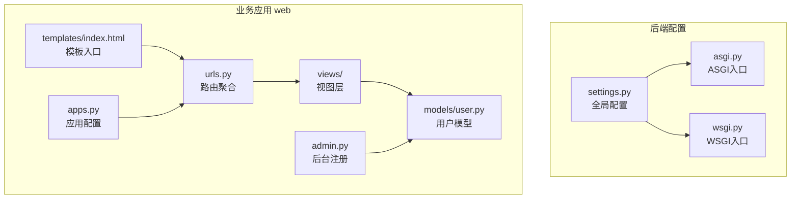
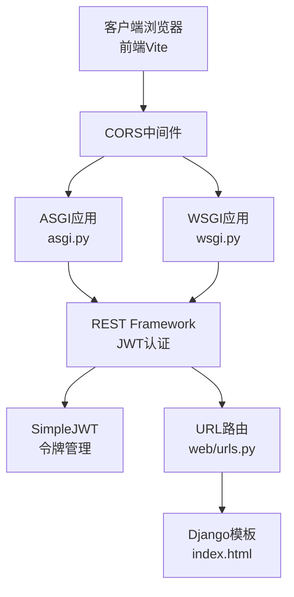
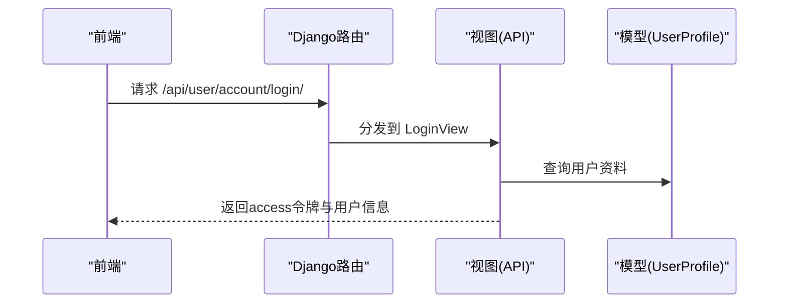
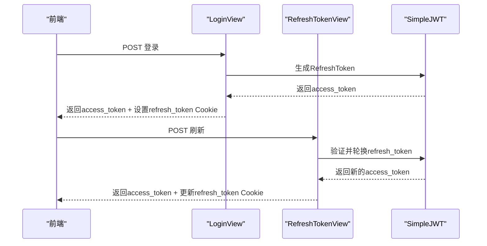
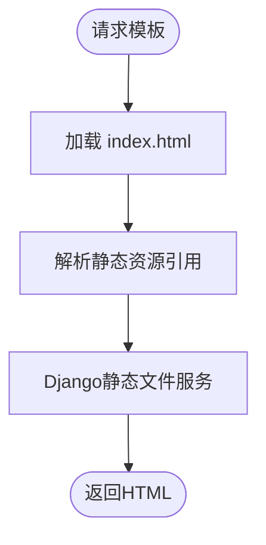
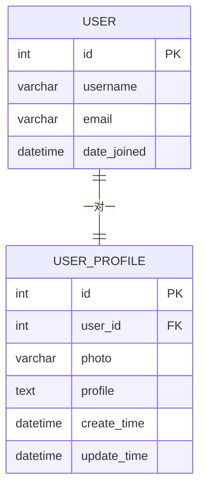
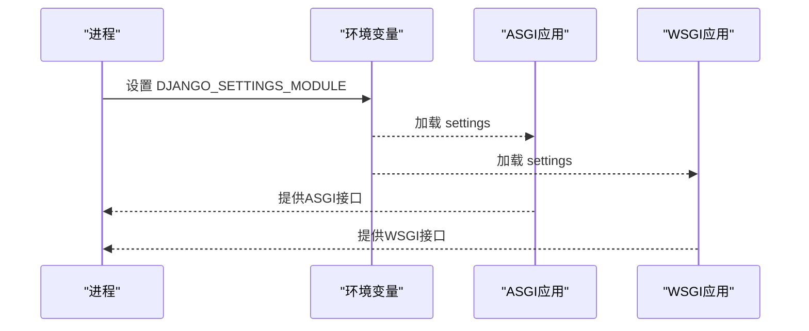
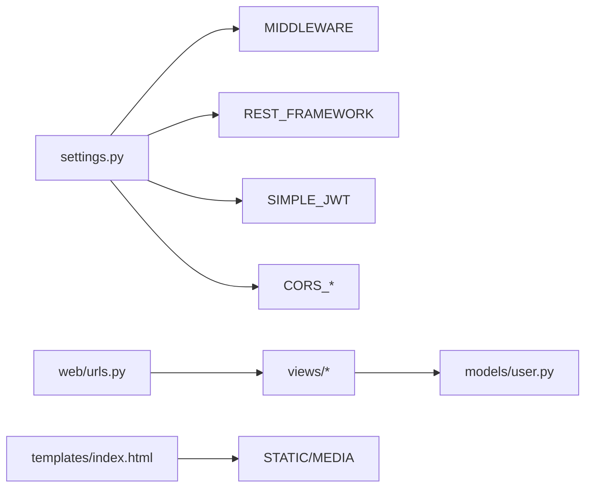

# Django项目配置

<cite>
**本文引用的文件**
- [settings.py](file://backend/backend/settings.py)
- [asgi.py](file://backend/backend/asgi.py)
- [wsgi.py](file://backend/backend/wsgi.py)
- [apps.py](file://backend/web/apps.py)
- [admin.py](file://backend/web/admin.py)
- [index.html](file://backend/web/templates/index.html)
- [index.py](file://backend/web/views/index.py)
- [urls.py](file://backend/web/urls.py)
- [user.py](file://backend/web/models/user.py)
- [login.py](file://backend/web/views/user/account/login.py)
- [register.py](file://backend/web/views/user/account/register.py)
- [get_user_info.py](file://backend/web/views/user/account/get_user_info.py)
- [logout.py](file://backend/web/views/user/account/logout.py)
- [refresh_token.py](file://backend/web/views/user/account/refresh_token.py)
</cite>

## 目录
1. [简介](#简介)
2. [项目结构](#项目结构)
3. [核心组件](#核心组件)
4. [架构总览](#架构总览)
5. [详细组件分析](#详细组件分析)
6. [依赖分析](#依赖分析)
7. [性能考虑](#性能考虑)
8. [故障排查指南](#故障排查指南)
9. [结论](#结论)
10. [附录](#附录)

## 简介
本文件面向LLM_AIfriends项目的Django后端，系统化梳理项目配置与运行机制，覆盖应用安装、中间件、模板与静态文件、REST Framework集成、JWT认证、CORS跨域、数据库、国际化与时区、ASGI与WSGI差异、开发与生产配置差异及安全最佳实践，并给出配置组织结构与扩展性建议。

## 项目结构
后端采用标准Django项目布局，核心配置位于backend/backend目录，业务应用web位于backend/web目录。前端构建产物通过Django模板渲染接入，路由通过web/urls.py统一管理，用户相关API集中在web/views/user/account下。

图表来源
- [settings.py:1-158](file://backend/backend/settings.py#L1-L158)
- [asgi.py:1-17](file://backend/backend/asgi.py#L1-L17)
- [wsgi.py:1-17](file://backend/backend/wsgi.py#L1-L17)
- [urls.py:1-24](file://backend/web/urls.py#L1-L24)
- [index.html:1-17](file://backend/web/templates/index.html#L1-L17)
- [apps.py:1-6](file://backend/web/apps.py#L1-L6)
- [admin.py:1-9](file://backend/web/admin.py#L1-L9)
- [user.py:1-23](file://backend/web/models/user.py#L1-L23)

章节来源
- [settings.py:1-158](file://backend/backend/settings.py#L1-L158)
- [urls.py:1-24](file://backend/web/urls.py#L1-L24)

## 核心组件
- 应用安装：内置应用与第三方应用（如REST Framework、CORS）均已启用，业务应用web按约定注册。
- 中间件：CORS中间件置于首位，确保跨域头优先处理；随后是安全、会话、CSRF、认证、消息与点击劫持保护。
- 模板：启用Django模板引擎，APP_DIRS为True，便于应用内模板查找。
- 静态文件：开发阶段通过STATICFILES_DIRS添加额外目录，媒体文件通过MEDIA_URL/MEDIA_ROOT指向本地目录。
- 数据库：默认SQLite，适合开发与小规模测试。
- 国际化与时区：语言设为英文，时区为中国标准时间，支持国际化开关。
- 认证与权限：REST Framework默认使用JWT认证，配合SimpleJWT令牌生命周期与刷新策略。
- CORS：允许凭据，限定特定前端源。

章节来源
- [settings.py:33-43](file://backend/backend/settings.py#L33-L43)
- [settings.py:45-54](file://backend/backend/settings.py#L45-L54)
- [settings.py:58-71](file://backend/backend/settings.py#L58-L71)
- [settings.py:79-84](file://backend/backend/settings.py#L79-L84)
- [settings.py:109-116](file://backend/backend/settings.py#L109-L116)
- [settings.py:122-131](file://backend/backend/settings.py#L122-L131)
- [settings.py:136-151](file://backend/backend/settings.py#L136-L151)
- [settings.py:153-158](file://backend/backend/settings.py#L153-L158)

## 架构总览
Django后端通过ASGI/WSGI适配器对外提供服务，REST Framework承载API，SimpleJWT负责认证，CORS处理跨域，模板用于前端静态资源的统一渲染入口。

图表来源
- [asgi.py:1-17](file://backend/backend/asgi.py#L1-L17)
- [wsgi.py:1-17](file://backend/backend/wsgi.py#L1-L17)
- [settings.py:45-54](file://backend/backend/settings.py#L45-L54)
- [settings.py:136-151](file://backend/backend/settings.py#L136-L151)
- [urls.py:1-24](file://backend/web/urls.py#L1-L24)
- [index.html:1-17](file://backend/web/templates/index.html#L1-L17)

## 详细组件分析

### 应用与路由配置
- 应用安装：内置应用与第三方应用均启用，业务应用web通过apps.py注册。
- 路由：web/urls.py集中定义用户账户与资料相关API，末尾兜底路由将未匹配请求交由前端单页应用处理。
- 模板入口：index.html加载静态资源并挂载前端应用容器。

图表来源
- [urls.py:10-17](file://backend/web/urls.py#L10-L17)
- [login.py:9-46](file://backend/web/views/user/account/login.py#L9-L46)
- [user.py:15-23](file://backend/web/models/user.py#L15-L23)

章节来源
- [apps.py:1-6](file://backend/web/apps.py#L1-L6)
- [urls.py:1-24](file://backend/web/urls.py#L1-L24)
- [index.html:1-17](file://backend/web/templates/index.html#L1-L17)

### 认证与权限（JWT）
- 默认认证：REST Framework使用JWTAuthentication。
- SimpleJWT配置：访问令牌有效期、刷新令牌有效期、轮换与黑名单、请求头类型等。
- 登录流程：校验凭据，签发JWT，设置HTTP-only Cookie保存refresh_token。
- 注册流程：创建用户与用户资料，签发JWT并设置refresh_token。
- 刷新流程：从Cookie读取refresh_token，必要时轮换并更新Cookie。
- 获取用户信息：基于IsAuthenticated权限类，要求携带有效JWT。
- 退出登录：删除refresh_token Cookie。

图表来源
- [settings.py:136-151](file://backend/backend/settings.py#L136-L151)
- [login.py:9-46](file://backend/web/views/user/account/login.py#L9-L46)
- [register.py:9-46](file://backend/web/views/user/account/register.py#L9-L46)
- [refresh_token.py:7-41](file://backend/web/views/user/account/refresh_token.py#L7-L41)

章节来源
- [settings.py:136-151](file://backend/backend/settings.py#L136-L151)
- [login.py:1-92](file://backend/web/views/user/account/login.py#L1-L92)
- [register.py:1-46](file://backend/web/views/user/account/register.py#L1-L46)
- [get_user_info.py:1-25](file://backend/web/views/user/account/get_user_info.py#L1-L25)
- [logout.py:1-16](file://backend/web/views/user/account/logout.py#L1-L16)
- [refresh_token.py:1-41](file://backend/web/views/user/account/refresh_token.py#L1-L41)

### 模板与静态文件
- 模板：启用APP_DIRS，模板index.html加载静态资源入口。
- 静态文件：开发阶段通过STATICFILES_DIRS添加目录，媒体文件通过MEDIA_URL/MEDIA_ROOT指向本地目录。
- 媒体资源：用户头像等上传至MEDIA_ROOT下的子目录，通过模型ImageField与自定义upload_to逻辑管理。

图表来源
- [index.html:1-17](file://backend/web/templates/index.html#L1-L17)
- [settings.py:122-131](file://backend/backend/settings.py#L122-L131)
- [user.py:9-13](file://backend/web/models/user.py#L9-L13)

章节来源
- [index.html:1-17](file://backend/web/templates/index.html#L1-L17)
- [settings.py:122-131](file://backend/backend/settings.py#L122-L131)
- [user.py:9-13](file://backend/web/models/user.py#L9-L13)

### 数据库与模型
- 数据库：默认SQLite，适合开发与测试。
- 用户模型：UserProfile一对一关联Django内置User，扩展头像、简介与时间戳字段；上传路径通过自定义函数生成。

图表来源
- [user.py:15-23](file://backend/web/models/user.py#L15-L23)

章节来源
- [user.py:1-23](file://backend/web/models/user.py#L1-L23)

### ASGI与WSGI应用
- ASGI：用于异步协议（如HTTP/2、WebSocket），适合高并发与实时场景。
- WSGI：用于同步协议，兼容传统Web服务器。
- 两者均通过django.core.*_application加载settings模块，部署时选择其一。

图表来源
- [asgi.py:10-16](file://backend/backend/asgi.py#L10-L16)
- [wsgi.py:10-16](file://backend/backend/wsgi.py#L10-L16)

章节来源
- [asgi.py:1-17](file://backend/backend/asgi.py#L1-L17)
- [wsgi.py:1-17](file://backend/backend/wsgi.py#L1-L17)

## 依赖分析
- 组件耦合：视图依赖模型与认证配置；路由依赖视图；模板依赖静态文件配置。
- 外部依赖：REST Framework、SimpleJWT、CORS中间件。
- 安全依赖：CSRF、安全中间件、HTTPS与Cookie属性（secure、httponly、sameSite）。

图表来源
- [settings.py:45-54](file://backend/backend/settings.py#L45-L54)
- [settings.py:136-151](file://backend/backend/settings.py#L136-L151)
- [urls.py:1-24](file://backend/web/urls.py#L1-L24)
- [index.html:1-17](file://backend/web/templates/index.html#L1-L17)

章节来源
- [settings.py:45-54](file://backend/backend/settings.py#L45-L54)
- [urls.py:1-24](file://backend/web/urls.py#L1-L24)

## 性能考虑
- 静态文件：开发阶段使用STATICFILES_DIRS，生产阶段建议收集至STATIC_ROOT并通过CDN分发。
- 数据库：SQLite适合开发，生产建议迁移到PostgreSQL/MySQL；对常用查询建立索引。
- 缓存：结合Django缓存框架与Redis提升热点数据访问速度。
- 并发：根据部署场景选择ASGI或WSGI；ASGI更利于高并发与长连接。
- 日志：合理配置日志级别与输出位置，避免I/O瓶颈。

## 故障排查指南
- 登录失败：检查用户名密码非空、authenticate返回值、UserProfile是否存在。
- 令牌无效：确认请求头类型与值（Bearer）、Cookie是否携带refresh_token且未过期。
- 跨域问题：核对CORS_ALLOWED_ORIGINS与CORS_ALLOW_CREDENTIALS配置。
- 静态资源404：确认STATIC_URL与STATICFILES_DIRS/MEDIA配置，开发模式下确保静态文件服务开启。
- 权限拒绝：检查IsAuthenticated权限类与JWT是否正确传递。

章节来源
- [login.py:10-46](file://backend/web/views/user/account/login.py#L10-L46)
- [refresh_token.py:8-41](file://backend/web/views/user/account/refresh_token.py#L8-L41)
- [settings.py:153-158](file://backend/backend/settings.py#L153-L158)
- [settings.py:122-131](file://backend/backend/settings.py#L122-L131)
- [get_user_info.py:8-25](file://backend/web/views/user/account/get_user_info.py#L8-L25)

## 结论
本配置以最小可行集实现了前后端分离的认证体系：REST Framework + SimpleJWT + CORS，辅以Django模板与静态文件服务，满足开发与演示需求。生产部署需完善数据库、静态文件、跨域与安全策略，并评估并发与缓存方案。

## 附录

### 开发与生产配置差异建议
- SECRET_KEY：生产环境使用强随机值并严格保密。
- DEBUG：开发为True，生产必须为False。
- ALLOWED_HOSTS：生产环境显式指定域名。
- 静态文件：生产使用STATIC_ROOT并配合CDN。
- 媒体文件：生产使用独立存储与CDN加速。
- 数据库：生产迁移至高性能数据库并启用连接池。
- HTTPS：生产启用TLS，Cookie设置secure=True。
- 日志：生产记录错误日志并接入集中日志系统。

### 安全最佳实践
- CSRF防护：保持CSRF中间件启用，AJAX请求携带CSRF Token。
- 会话安全：设置安全Cookie属性（secure、httponly、sameSite）。
- CORS限制：仅允许受信源，谨慎开放凭据。
- 密码策略：遵循Django默认密码验证器，定期轮换密钥。
- 输入校验：对敏感输入进行长度与格式校验，避免注入攻击。