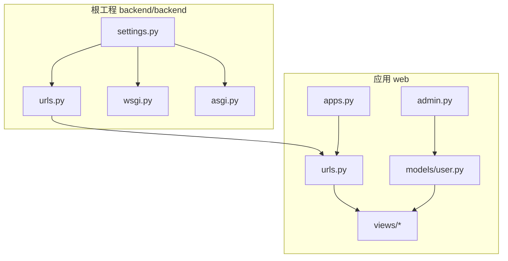
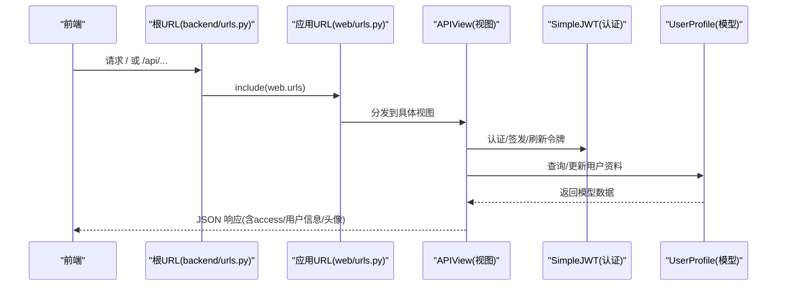
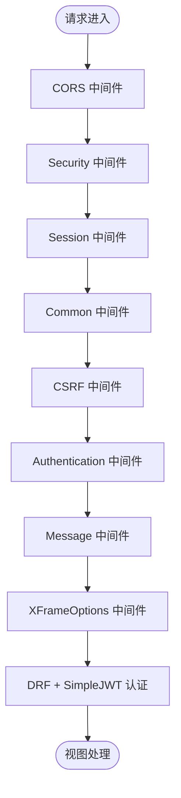
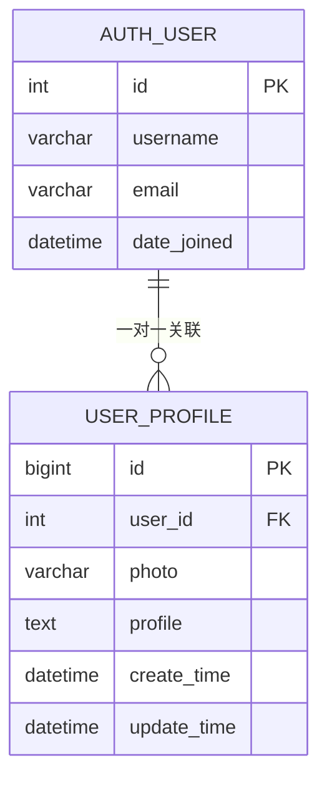
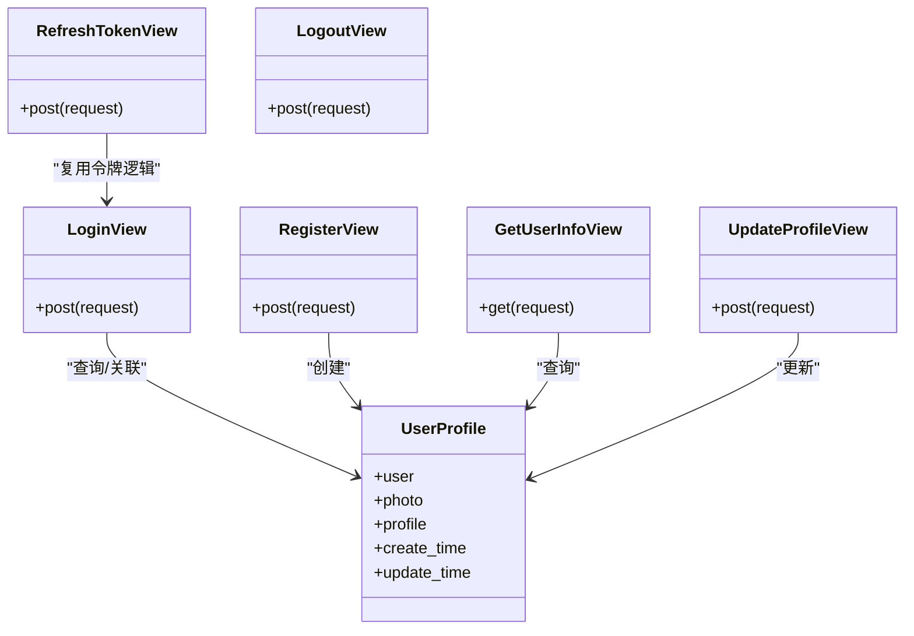
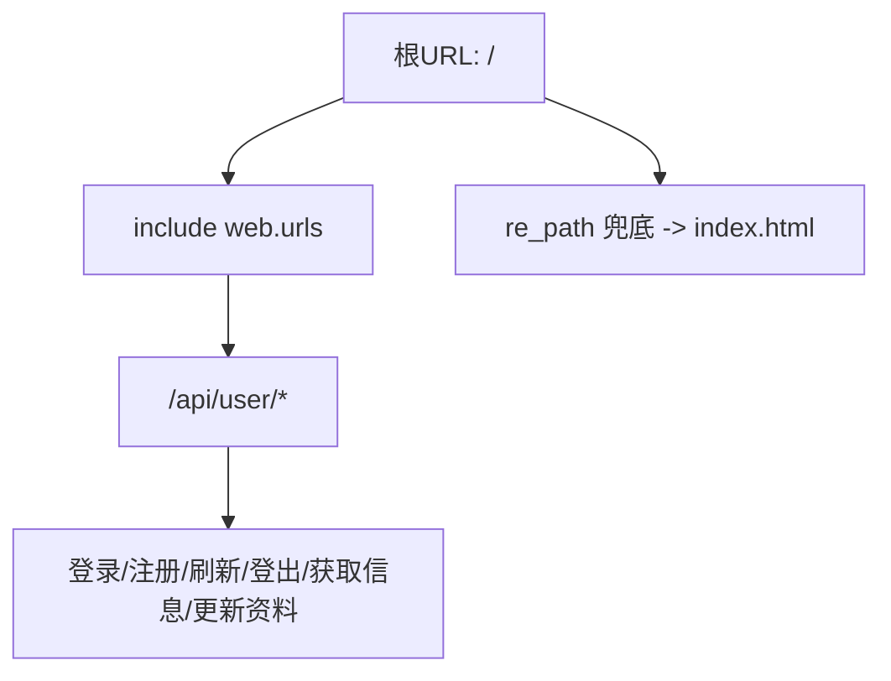
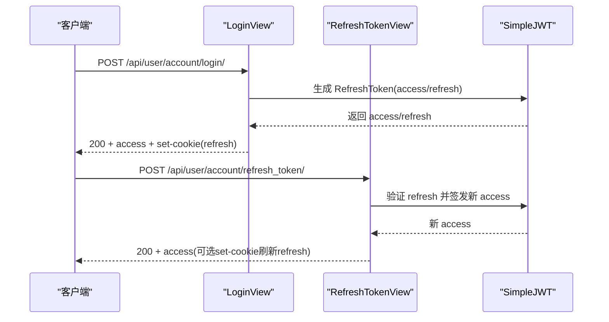
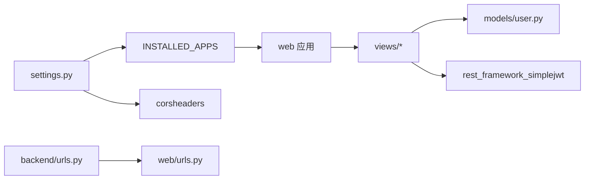

# 后端架构

<cite>
**本文引用的文件**
- [settings.py](file://backend/backend/settings.py)
- [urls.py](file://backend/backend/urls.py)
- [wsgi.py](file://backend/backend/wsgi.py)
- [asgi.py](file://backend/backend/asgi.py)
- [apps.py](file://backend/web/apps.py)
- [urls.py](file://backend/web/urls.py)
- [user.py](file://backend/web/models/user.py)
- [0001_initial.py](file://backend/web/migrations/0001_initial.py)
- [index.py](file://backend/web/views/index.py)
- [login.py](file://backend/web/views/user/account/login.py)
- [register.py](file://backend/web/views/user/account/register.py)
- [get_user_info.py](file://backend/web/views/user/account/get_user_info.py)
- [logout.py](file://backend/web/views/user/account/logout.py)
- [refresh_token.py](file://backend/web/views/user/account/refresh_token.py)
- [update.py](file://backend/web/views/user/profile/update.py)
- [photo.py](file://backend/web/views/utils/photo.py)
- [admin.py](file://backend/web/admin.py)
</cite>

## 目录
1. [引言](#引言)
2. [项目结构](#项目结构)
3. [核心组件](#核心组件)
4. [架构总览](#架构总览)
5. [详细组件分析](#详细组件分析)
6. [依赖分析](#依赖分析)
7. [性能考量](#性能考量)
8. [故障排查指南](#故障排查指南)
9. [结论](#结论)
10. [附录](#附录)

## 引言
本文件面向 LLM_AIfriends 项目的后端团队与维护者，系统化阐述基于 Django REST Framework 的 MVC 架构设计与实现细节。内容覆盖项目配置、应用结构、中间件体系、用户认证与 JWT 策略、数据库模型、视图与 URL 路由、CORS 与静态文件服务、API 设计原则、错误处理与性能优化，并给出可扩展性与微服务演进建议。

## 项目结构
后端采用“根工程 + 应用模块”的分层组织方式：
- 根工程 backend/backend：Django 配置入口（设置、URL、WSGI/ASGI）
- 应用 web：业务域实现（模型、视图、URL、管理后台、模板等）
- 前端位于独立目录，后端通过静态/媒体文件服务在开发阶段提供资源

图表来源
- [settings.py:1-158](file://backend/backend/settings.py#L1-L158)
- [urls.py:1-38](file://backend/backend/urls.py#L1-L38)
- [wsgi.py:1-200](file://backend/backend/wsgi.py#L1-L200)
- [asgi.py:1-200](file://backend/backend/asgi.py#L1-L200)
- [apps.py:1-6](file://backend/web/apps.py#L1-L6)
- [urls.py:1-24](file://backend/web/urls.py#L1-L24)
- [user.py:1-23](file://backend/web/models/user.py#L1-L23)
- [admin.py:1-9](file://backend/web/admin.py#L1-L9)

章节来源
- [settings.py:1-158](file://backend/backend/settings.py#L1-L158)
- [urls.py:1-38](file://backend/backend/urls.py#L1-L38)
- [apps.py:1-6](file://backend/web/apps.py#L1-L6)

## 核心组件
- 配置层：Django 设置集中于 settings.py，启用 DRF、CORS、JWT、时区与静态/媒体路径
- 中间件层：CORS、安全、会话、CSRF、认证、消息、点击劫持防护
- 应用层：web 应用注册 INSTALLED_APPS，提供用户账户与资料相关接口
- 视图层：基于 DRF 的 APIView 实现登录、注册、刷新、登出、获取用户信息、更新资料
- 模型层：用户资料模型 UserProfile 关联 Django 内置 User，支持头像上传与简介
- 路由层：根 URL 包含 admin 与 web 应用；web 应用内部以 /api/user 前缀划分功能域

章节来源
- [settings.py:33-54](file://backend/backend/settings.py#L33-L54)
- [urls.py:1-24](file://backend/web/urls.py#L1-L24)
- [user.py:15-23](file://backend/web/models/user.py#L15-L23)

## 架构总览
下图展示从请求到响应的关键流转：浏览器/前端 -> 根 URL -> 应用 URL -> 视图 -> 模型 -> 返回 JSON 响应；CORS 与 JWT 在中间件与认证层协同工作。

图表来源
- [urls.py:23-26](file://backend/backend/urls.py#L23-L26)
- [urls.py:10-23](file://backend/web/urls.py#L10-L23)
- [login.py:9-46](file://backend/web/views/user/account/login.py#L9-L46)
- [register.py:9-42](file://backend/web/views/user/account/register.py#L9-L42)
- [refresh_token.py:7-36](file://backend/web/views/user/account/refresh_token.py#L7-L36)
- [get_user_info.py:8-24](file://backend/web/views/user/account/get_user_info.py#L8-L24)
- [update.py:12-57](file://backend/web/views/user/profile/update.py#L12-L57)
- [user.py:15-23](file://backend/web/models/user.py#L15-L23)

## 详细组件分析

### 配置与中间件体系
- 安全与调试：DEBUG 默认开启，SECRET_KEY 用于开发环境
- 应用注册：django.contrib.*、rest_framework、web、corsheaders
- 中间件顺序：CORS 放置靠前，确保跨域头尽早注入；随后安全、会话、CSRF、认证、消息、点击劫持
- 认证与令牌：DRF 使用 JWTAuthentication；SimpleJWT 配置 ACCESS/REFRESH 生命周期、轮换与黑名单
- CORS：允许凭据、指定前端源 localhost:5173
- 静态与媒体：开发阶段通过根 URL 配置静态/媒体映射；生产环境建议由 Nginx 提供

图表来源
- [settings.py:45-54](file://backend/backend/settings.py#L45-L54)
- [settings.py:136-151](file://backend/backend/settings.py#L136-L151)
- [settings.py:153-158](file://backend/backend/settings.py#L153-L158)

章节来源
- [settings.py:22-28](file://backend/backend/settings.py#L22-L28)
- [settings.py:33-54](file://backend/backend/settings.py#L33-L54)
- [settings.py:136-158](file://backend/backend/settings.py#L136-L158)

### 数据库模型设计
- 用户资料模型 UserProfile 与内置 User 一对一关联
- 字段：头像 ImageField（默认值与上传路径）、简介 TextField（最大长度约束）、创建/更新时间
- 迁移文件定义初始表结构，包含字段与外键约束

图表来源
- [user.py:15-23](file://backend/web/models/user.py#L15-L23)
- [0001_initial.py:18-29](file://backend/web/migrations/0001_initial.py#L18-L29)

章节来源
- [user.py:15-23](file://backend/web/models/user.py#L15-L23)
- [0001_initial.py:1-30](file://backend/web/migrations/0001_initial.py#L1-L30)

### 视图与权限控制
- 登录/注册：生成 RefreshToken 并下发 access；同时写入 HttpOnly、SameSite=Lax、Secure 的 refresh cookie
- 刷新：从 Cookie 读取 refresh_token，校验后签发新的 access，并按配置轮换 refresh
- 登出：删除 refresh cookie
- 获取用户信息：基于 IsAuthenticated 权限，返回用户基础信息与头像 URL
- 更新资料：鉴权 + 参数校验 + 唯一性校验 + 头像替换与旧图清理 + 时间戳更新

图表来源
- [login.py:9-46](file://backend/web/views/user/account/login.py#L9-L46)
- [register.py:9-42](file://backend/web/views/user/account/register.py#L9-L42)
- [refresh_token.py:7-36](file://backend/web/views/user/account/refresh_token.py#L7-L36)
- [logout.py:7-16](file://backend/web/views/user/account/logout.py#L7-L16)
- [get_user_info.py:8-24](file://backend/web/views/user/account/get_user_info.py#L8-L24)
- [update.py:12-57](file://backend/web/views/user/profile/update.py#L12-L57)
- [user.py:15-23](file://backend/web/models/user.py#L15-L23)

章节来源
- [login.py:9-46](file://backend/web/views/user/account/login.py#L9-L46)
- [register.py:9-42](file://backend/web/views/user/account/register.py#L9-L42)
- [refresh_token.py:7-36](file://backend/web/views/user/account/refresh_token.py#L7-L36)
- [logout.py:7-16](file://backend/web/views/user/account/logout.py#L7-L16)
- [get_user_info.py:8-24](file://backend/web/views/user/account/get_user_info.py#L8-L24)
- [update.py:12-57](file://backend/web/views/user/profile/update.py#L12-L57)

### URL 路由与前端兜底
- 根 URL 将 / 映射到 web 应用；web 应用以 /api/user 前缀组织账户与资料接口
- 未命中 API 的请求通过正则兜底路由交由 index 视图渲染模板，便于 SPA 前端接管

图表来源
- [urls.py:23-26](file://backend/backend/urls.py#L23-L26)
- [urls.py:10-23](file://backend/web/urls.py#L10-L23)
- [index.py:1-4](file://backend/web/views/index.py#L1-L4)

章节来源
- [urls.py:23-38](file://backend/backend/urls.py#L23-L38)
- [urls.py:10-23](file://backend/web/urls.py#L10-L23)
- [index.py:1-4](file://backend/web/views/index.py#L1-L4)

### 认证系统与 JWT 令牌管理
- 认证类：DRF 使用 JWTAuthentication
- 令牌生命周期：ACCESS 2 小时、REFRESH 7 天；支持轮换与黑名单
- 会话处理：登录/注册成功后下发 access 与 refresh cookie；刷新接口按需轮换 refresh；登出删除 cookie
- 前端交互：前端在登录成功后缓存 access，刷新接口在 Cookie 中携带 refresh 以换取新 access

图表来源
- [settings.py:136-151](file://backend/backend/settings.py#L136-L151)
- [login.py:22-38](file://backend/web/views/user/account/login.py#L22-L38)
- [refresh_token.py:15-31](file://backend/web/views/user/account/refresh_token.py#L15-L31)

章节来源
- [settings.py:136-151](file://backend/backend/settings.py#L136-L151)
- [login.py:9-46](file://backend/web/views/user/account/login.py#L9-L46)
- [refresh_token.py:7-36](file://backend/web/views/user/account/refresh_token.py#L7-L36)

### CORS 跨域与静态/媒体文件
- CORS：允许凭据、白名单前端源 localhost:5173
- 静态资源：开发阶段通过根 URL 静态映射 /assets/；媒体文件映射 /media/
- 生产部署：建议由 Nginx 提供静态/媒体文件服务，根 URL 不再处理静态

章节来源
- [settings.py:153-158](file://backend/backend/settings.py#L153-L158)
- [urls.py:29-37](file://backend/backend/urls.py#L29-L37)

### API 设计原则与错误处理
- 统一响应结构：各视图返回包含 result 字段的 JSON；错误场景返回提示信息
- 权限控制：受保护接口使用 IsAuthenticated；未登录访问刷新接口返回 401
- 输入校验：后端对必填项、唯一性、格式进行二次校验，不信任前端输入
- 异常兜底：统一 try/except 捕获未知异常并返回通用提示

章节来源
- [login.py:14-17](file://backend/web/views/user/account/login.py#L14-L17)
- [register.py:12-17](file://backend/web/views/user/account/register.py#L12-L17)
- [get_user_info.py:11-23](file://backend/web/views/user/account/get_user_info.py#L11-L23)
- [update.py:27-38](file://backend/web/views/user/profile/update.py#L27-L38)
- [refresh_token.py:10-14](file://backend/web/views/user/account/refresh_token.py#L10-L14)

## 依赖分析
- 应用耦合：web 应用依赖 Django 内置 User 与 DRF；视图依赖模型与 SimpleJWT；URL 层负责路由聚合
- 外部依赖：Django、DRF、SimpleJWT、CORSHeaders、SQLite（开发）

图表来源
- [settings.py:33-43](file://backend/backend/settings.py#L33-L43)
- [urls.py:23-26](file://backend/backend/urls.py#L23-L26)
- [urls.py:1-24](file://backend/web/urls.py#L1-L24)
- [user.py:1-23](file://backend/web/models/user.py#L1-L23)

章节来源
- [settings.py:33-43](file://backend/backend/settings.py#L33-L43)
- [urls.py:23-26](file://backend/backend/urls.py#L23-L26)
- [urls.py:1-24](file://backend/web/urls.py#L1-L24)

## 性能考量
- 数据库访问：UserProfile 查询使用 get(user=user)，注意外键索引与 raw_id_fields 优化
- 文件存储：头像上传采用 UUID 命名与旧图清理，减少冗余；建议生产使用对象存储并开启 CDN
- 令牌轮换：开启 ROTATE_REFRESH_TOKENS 可提升安全性，但需评估刷新频率与数据库压力
- 静态资源：开发阶段静态映射简单高效；生产建议由反向代理统一缓存与压缩
- 会话与 Cookie：HttpOnly + SameSite + Secure 提升安全，减少 XSS 风险

## 故障排查指南
- 登录失败：检查用户名/密码非空、authenticate 是否返回用户对象、Cookie 是否正确下发
- 刷新失败：确认 Cookie 中 refresh_token 存在且未过期；核对 SIMPLE_JWT 配置
- 获取信息失败：确认请求已携带有效 access；检查 IsAuthenticated 权限
- 更新资料失败：确认必填项与唯一性校验、文件上传与旧图清理逻辑
- CORS 错误：确认前端源在 CORS_ALLOWED_ORIGINS，且允许凭据

章节来源
- [login.py:14-17](file://backend/web/views/user/account/login.py#L14-L17)
- [refresh_token.py:10-14](file://backend/web/views/user/account/refresh_token.py#L10-L14)
- [get_user_info.py:9-10](file://backend/web/views/user/account/get_user_info.py#L9-L10)
- [update.py:27-38](file://backend/web/views/user/profile/update.py#L27-L38)
- [settings.py:153-158](file://backend/backend/settings.py#L153-L158)

## 结论
本后端以 Django + DRF + SimpleJWT 为核心，结合 CORS 与 Cookie 会话策略，实现了清晰的 MVC 分层与可扩展的用户体系。通过统一的响应结构、严格的输入校验与权限控制，保障了接口一致性与安全性。建议在生产环境完善静态资源托管、引入缓存与对象存储，并持续评估令牌轮换策略与数据库索引优化。

## 附录
- 扩展性与微服务演进
  - 按领域拆分：将用户、社交、内容等子域进一步拆分为独立服务
  - 引入 API 网关：统一鉴权、限流、监控与路由
  - 数据库读写分离与分库分表：针对用户资料与高并发接口
  - 对象存储与 CDN：头像与静态资源独立服务化
  - 消息队列：异步任务（如头像缩略、通知）
  - 容器化与可观测性：日志、指标、追踪与弹性伸缩