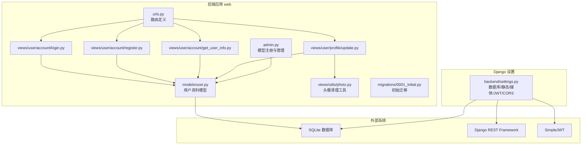
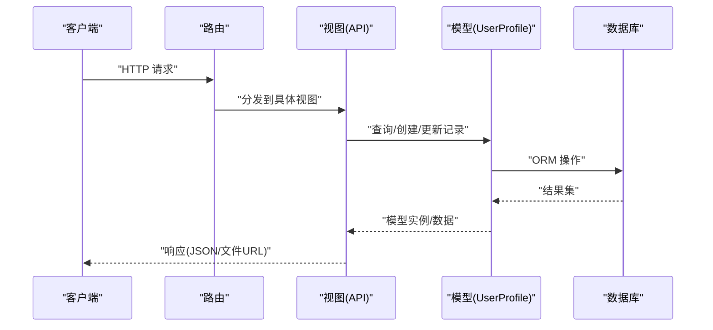
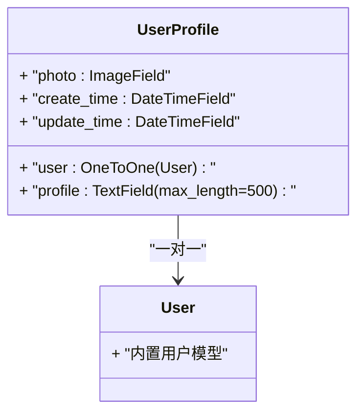
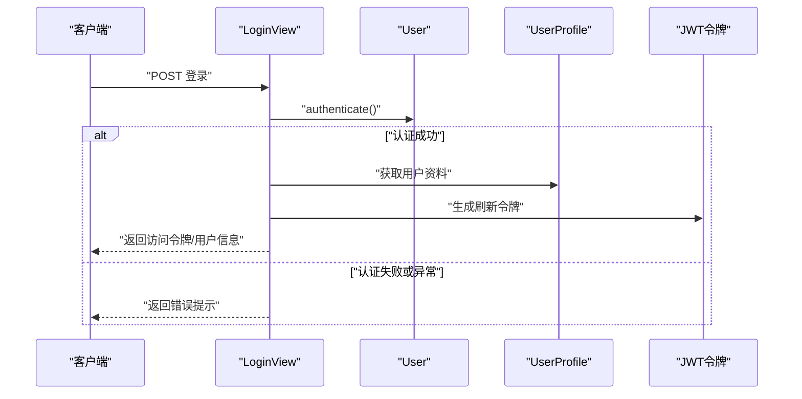
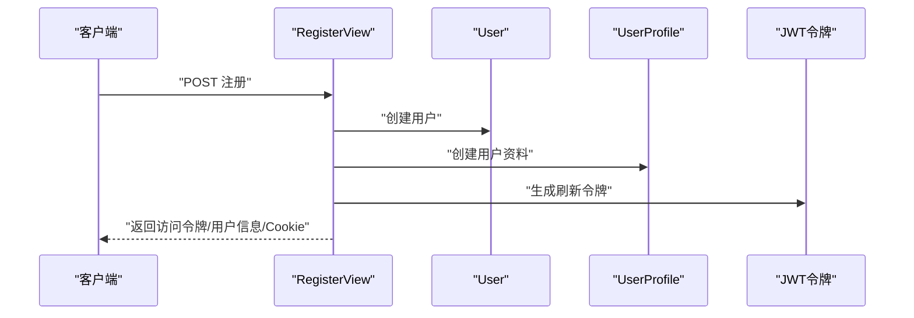
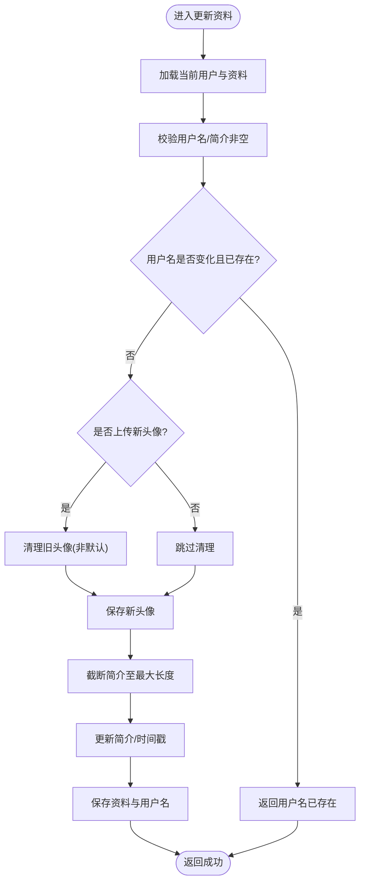
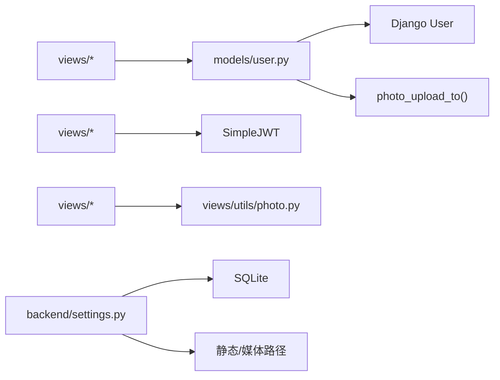

# 数据模型设计

<cite>
**本文引用的文件**
- [backend/web/models/user.py](file://backend/web/models/user.py)
- [backend/web/migrations/0001_initial.py](file://backend/web/migrations/0001_initial.py)
- [backend/web/admin.py](file://backend/web/admin.py)
- [backend/backend/settings.py](file://backend/backend/settings.py)
- [backend/web/views/user/account/get_user_info.py](file://backend/web/views/user/account/get_user_info.py)
- [backend/web/views/user/account/register.py](file://backend/web/views/user/account/register.py)
- [backend/web/views/user/account/login.py](file://backend/web/views/user/account/login.py)
- [backend/web/views/user/profile/update.py](file://backend/web/views/user/profile/update.py)
- [backend/web/views/utils/photo.py](file://backend/web/views/utils/photo.py)
- [backend/web/urls.py](file://backend/web/urls.py)
- [backend/manage.py](file://backend/manage.py)
</cite>

## 目录
1. [引言](#引言)
2. [项目结构](#项目结构)
3. [核心组件](#核心组件)
4. [架构总览](#架构总览)
5. [详细组件分析](#详细组件分析)
6. [依赖分析](#依赖分析)
7. [性能考量](#性能考量)
8. [故障排查指南](#故障排查指南)
9. [结论](#结论)
10. [附录](#附录)

## 引言
本文件面向 LLM_AIfriends 项目的后端数据模型设计，聚焦用户相关的核心数据结构与关系映射，覆盖字段定义、数据类型、约束条件、模型间关系（一对一、一对多/多对一）、数据库迁移生成与管理、验证规则、索引与性能优化策略，并给出扩展性与演进路径建议及最佳实践与常见问题解决方案。

## 项目结构
后端采用 Django 应用“web”，用户相关模型位于 models/user.py，初始迁移位于 web/migrations/0001_initial.py；用户账户与资料相关接口位于 web/views/user/account 与 web/views/user/profile；管理员后台注册了用户资料模型以提升管理体验；设置文件 backend/backend/settings.py 定义了数据库、静态/媒体文件、JWT 认证等全局配置。

图表来源
- [backend/web/urls.py:10-23](file://backend/web/urls.py#L10-L23)
- [backend/web/models/user.py:15-23](file://backend/web/models/user.py#L15-L23)
- [backend/web/migrations/0001_initial.py:17-29](file://backend/web/migrations/0001_initial.py#L17-L29)
- [backend/web/admin.py:6-9](file://backend/web/admin.py#L6-L9)
- [backend/backend/settings.py:79-84](file://backend/backend/settings.py#L79-L84)
- [backend/web/views/user/account/login.py:9-46](file://backend/web/views/user/account/login.py#L9-L46)
- [backend/web/views/user/account/register.py:9-46](file://backend/web/views/user/account/register.py#L9-L46)
- [backend/web/views/user/account/get_user_info.py:8-25](file://backend/web/views/user/account/get_user_info.py#L8-L25)
- [backend/web/views/user/profile/update.py:12-63](file://backend/web/views/user/profile/update.py#L12-L63)
- [backend/web/views/utils/photo.py:9-13](file://backend/web/views/utils/photo.py#L9-L13)

章节来源
- [backend/web/urls.py:10-23](file://backend/web/urls.py#L10-L23)
- [backend/web/models/user.py:15-23](file://backend/web/models/user.py#L15-L23)
- [backend/web/migrations/0001_initial.py:17-29](file://backend/web/migrations/0001_initial.py#L17-L29)
- [backend/web/admin.py:6-9](file://backend/web/admin.py#L6-L9)
- [backend/backend/settings.py:79-84](file://backend/backend/settings.py#L79-L84)

## 核心组件
本项目当前仅包含一个核心用户资料模型：UserProfile。它与 Django 内置 User 通过一对一关系关联，承载头像、个人简介、创建与更新时间等信息。

- 模型名称：UserProfile
- 关系：与内置 User 为一对一关系（OneToOneField）
- 字段概览（字段名、类型、默认值/约束、用途）：
  - user: OneToOneField，级联删除，连接到内置 User
  - photo: ImageField，默认头像路径，上传目录由自定义函数决定
  - profile: TextField，默认文本，最大长度 500
  - create_time: DateTimeField，默认当前时间
  - update_time: DateTimeField，默认当前时间
- 约束与校验：
  - 通过视图层进行输入校验（如用户名非空、简介非空、用户名唯一等）
  - profile 长度在更新接口中被截断至最大长度
  - 头像上传时会清理旧头像（非默认头像）

章节来源
- [backend/web/models/user.py:15-23](file://backend/web/models/user.py#L15-L23)
- [backend/web/migrations/0001_initial.py:18-28](file://backend/web/migrations/0001_initial.py#L18-L28)
- [backend/web/views/user/profile/update.py:20-48](file://backend/web/views/user/profile/update.py#L20-L48)
- [backend/web/views/utils/photo.py:9-13](file://backend/web/views/utils/photo.py#L9-L13)

## 架构总览
下图展示用户资料模型在系统中的位置与交互流程：视图层负责接收请求、执行业务逻辑与校验、调用模型读写；模型层负责数据持久化；迁移文件确保数据库结构随模型变更同步；设置文件提供数据库与静态/媒体资源配置。

图表来源
- [backend/web/urls.py:10-23](file://backend/web/urls.py#L10-L23)
- [backend/web/views/user/account/login.py:9-46](file://backend/web/views/user/account/login.py#L9-L46)
- [backend/web/views/user/account/register.py:9-46](file://backend/web/views/user/account/register.py#L9-L46)
- [backend/web/views/user/account/get_user_info.py:8-25](file://backend/web/views/user/account/get_user_info.py#L8-L25)
- [backend/web/views/user/profile/update.py:12-63](file://backend/web/views/user/profile/update.py#L12-L63)
- [backend/web/models/user.py:15-23](file://backend/web/models/user.py#L15-L23)

## 详细组件分析

### 用户资料模型 UserProfile
- 类型与关系
  - 一对一关系：UserProfile.user -> User
  - 级联删除：当 User 被删除时，对应的 UserProfile 同步删除
- 字段定义与约束
  - photo: 图片字段，上传路径由自定义函数生成，包含用户标识与随机片段，避免命名冲突
  - profile: 文本字段，最大长度 500，提供默认描述
  - create_time/update_time: 时间戳字段，默认值为当前时间
- 管理后台优化
  - 管理后台使用 raw_id_fields 提升大列表页加载性能，避免全量渲染外键对象

图表来源
- [backend/web/models/user.py:15-23](file://backend/web/models/user.py#L15-L23)
- [backend/web/admin.py:6-9](file://backend/web/admin.py#L6-L9)

章节来源
- [backend/web/models/user.py:15-23](file://backend/web/models/user.py#L15-L23)
- [backend/web/admin.py:6-9](file://backend/web/admin.py#L6-L9)

### 登录接口（LoginView）
- 功能要点
  - 校验用户名与密码，认证成功后获取用户资料并签发 JWT
  - 返回用户基本信息、头像 URL 与简介
- 错误处理
  - 输入为空、认证失败、系统异常均返回统一格式的结果提示

图表来源
- [backend/web/views/user/account/login.py:9-46](file://backend/web/views/user/account/login.py#L9-L46)
- [backend/web/models/user.py:15-23](file://backend/web/models/user.py#L15-L23)

章节来源
- [backend/web/views/user/account/login.py:9-46](file://backend/web/views/user/account/login.py#L9-L46)

### 注册接口（RegisterView）
- 功能要点
  - 校验用户名与密码非空，检查用户名唯一性
  - 创建内置 User，同时创建 UserProfile 并签发 JWT
  - 将刷新令牌写入 Cookie，设置安全属性与有效期
- 错误处理
  - 输入校验失败、用户名重复、系统异常均返回统一格式的结果提示

图表来源
- [backend/web/views/user/account/register.py:9-46](file://backend/web/views/user/account/register.py#L9-L46)
- [backend/web/models/user.py:15-23](file://backend/web/models/user.py#L15-L23)

章节来源
- [backend/web/views/user/account/register.py:9-46](file://backend/web/views/user/account/register.py#L9-L46)

### 获取用户信息接口（GetUserInfoView）
- 功能要点
  - 基于已认证用户身份，查询其 UserProfile 并返回必要字段
- 权限控制
  - 使用 IsAuthenticated 保证仅登录用户可访问

章节来源
- [backend/web/views/user/account/get_user_info.py:8-25](file://backend/web/views/user/account/get_user_info.py#L8-L25)

### 更新资料接口（UpdateProfileView）
- 功能要点
  - 支持更新用户名、简介与头像
  - 对用户名唯一性进行二次校验
  - 截断简介长度至最大值
  - 上传新头像时清理旧头像（非默认头像）
  - 更新时间戳并保存
- 错误处理
  - 输入校验失败、系统异常均返回统一格式的结果提示

图表来源
- [backend/web/views/user/profile/update.py:12-63](file://backend/web/views/user/profile/update.py#L12-L63)
- [backend/web/views/utils/photo.py:9-13](file://backend/web/views/utils/photo.py#L9-L13)

章节来源
- [backend/web/views/user/profile/update.py:12-63](file://backend/web/views/user/profile/update.py#L12-L63)
- [backend/web/views/utils/photo.py:9-13](file://backend/web/views/utils/photo.py#L9-L13)

## 依赖分析
- 模型依赖
  - UserProfile 依赖 Django 内置 User（一对一）
  - 上传路径函数 photo_upload_to 依赖 uuid 与时间工具
- 视图依赖
  - 所有用户相关视图依赖 UserProfile 模型
  - 登录/注册视图依赖 JWT 令牌生成
  - 更新资料视图依赖头像清理工具
- 配置依赖
  - 数据库使用 SQLite（开发环境）
  - 静态与媒体文件路径由设置文件定义
  - REST Framework 与 SimpleJWT 提供认证与序列化支持

图表来源
- [backend/web/models/user.py:10-13](file://backend/web/models/user.py#L10-L13)
- [backend/web/views/user/account/login.py:4-6](file://backend/web/views/user/account/login.py#L4-L6)
- [backend/web/views/user/account/register.py:4-6](file://backend/web/views/user/account/register.py#L4-L6)
- [backend/web/views/user/profile/update.py:8-9](file://backend/web/views/user/profile/update.py#L8-L9)
- [backend/web/views/utils/photo.py:9-13](file://backend/web/views/utils/photo.py#L9-L13)
- [backend/backend/settings.py:79-84](file://backend/backend/settings.py#L79-L84)
- [backend/backend/settings.py:122-132](file://backend/backend/settings.py#L122-L132)

章节来源
- [backend/web/models/user.py:10-13](file://backend/web/models/user.py#L10-L13)
- [backend/web/views/user/account/login.py:4-6](file://backend/web/views/user/account/login.py#L4-L6)
- [backend/web/views/user/account/register.py:4-6](file://backend/web/views/user/account/register.py#L4-L6)
- [backend/web/views/user/profile/update.py:8-9](file://backend/web/views/user/profile/update.py#L8-L9)
- [backend/backend/settings.py:79-84](file://backend/backend/settings.py#L79-L84)

## 性能考量
- 查询性能
  - 管理后台对 user 字段使用 raw_id_fields，减少外键渲染开销
  - 建议在高频查询场景为 user 字段添加数据库索引（迁移中可添加）
- 文件存储
  - 头像上传采用随机文件名与按用户分目录，避免命名冲突与目录膨胀
  - 更新头像时清理旧文件，避免磁盘空间浪费
- 认证与缓存
  - 使用 JWT 减少会话状态存储压力；建议结合 Redis 实现令牌黑名单与刷新令牌轮换
- 数据库
  - 当前使用 SQLite，适合开发测试；生产建议迁移到 PostgreSQL/MySQL，并启用连接池与慢查询日志

章节来源
- [backend/web/admin.py:6-9](file://backend/web/admin.py#L6-L9)
- [backend/web/views/utils/photo.py:9-13](file://backend/web/views/utils/photo.py#L9-L13)
- [backend/backend/settings.py:79-84](file://backend/backend/settings.py#L79-L84)

## 故障排查指南
- 常见问题与定位
  - 用户名为空或重复：注册/更新接口会返回明确提示，检查前端输入与后端校验
  - 认证失败：确认用户名/密码正确、用户存在、UserProfile 已创建
  - 头像未显示：确认 MEDIA_URL/MEDIA_ROOT 配置正确，文件路径包含 url 属性
  - 刷新令牌无效：检查 SIMPLE_JWT 配置与 Cookie 安全属性（httponly、secure、sameSite）
- 日志与调试
  - 使用 Django 的日志配置输出 SQL 与异常堆栈
  - 在视图层捕获异常并返回统一格式的错误信息，便于前端提示

章节来源
- [backend/web/views/user/account/register.py:14-22](file://backend/web/views/user/account/register.py#L14-L22)
- [backend/web/views/user/profile/update.py:27-38](file://backend/web/views/user/profile/update.py#L27-L38)
- [backend/web/views/user/account/login.py:18-20](file://backend/web/views/user/account/login.py#L18-L20)
- [backend/backend/settings.py:136-151](file://backend/backend/settings.py#L136-L151)

## 结论
当前数据模型围绕 UserProfile 与内置 User 的一对一关系展开，满足基本的用户资料与头像管理需求。通过视图层的输入校验、简介长度限制与头像清理机制，保障了数据一致性与资源占用的可控。建议在后续版本中引入数据库索引、完善字段验证与国际化支持，并评估迁移至生产数据库与引入缓存/CDN 的可行性。

## 附录

### 数据库迁移与管理
- 初始迁移
  - 生成：基于模型定义自动生成，包含 UserProfile 表与字段定义
  - 依赖：依赖内置 User 模型
- 后续迁移
  - 新增字段：建议通过新增迁移文件，避免直接修改初始迁移
  - 索引与约束：可在迁移中添加数据库索引与唯一/外键约束
  - 迁移执行：使用命令行工具执行迁移，确保数据库结构与模型一致

章节来源
- [backend/web/migrations/0001_initial.py:17-29](file://backend/web/migrations/0001_initial.py#L17-L29)
- [backend/manage.py:7-18](file://backend/manage.py#L7-L18)

### 模型验证规则与索引设计
- 验证规则
  - 用户名校验：非空、唯一（注册/更新）
  - 简介校验：非空、最大长度 500（更新时截断）
  - 头像校验：非默认头像时清理旧文件
- 索引设计
  - 建议为 user 字段添加数据库索引，提升查询性能
  - 可根据业务需要为 profile 或其他常用查询字段添加索引

章节来源
- [backend/web/views/user/account/register.py:14-22](file://backend/web/views/user/account/register.py#L14-L22)
- [backend/web/views/user/profile/update.py:20-38](file://backend/web/views/user/profile/update.py#L20-L38)
- [backend/web/admin.py:6-9](file://backend/web/admin.py#L6-L9)

### 扩展性与演进路径
- 字段扩展
  - 新增字段建议通过独立迁移文件实现，保持初始迁移稳定
- 关系扩展
  - 若需一对多或多对多关系，建议引入中间表或第三方关系模型库
- 性能扩展
  - 引入缓存（Redis）与 CDN 存储头像
  - 生产数据库迁移至 PostgreSQL/MySQL
- 安全与合规
  - 引入更严格的密码策略与审计日志
  - 对敏感字段进行脱敏与加密存储

[本节为概念性建议，无需列出章节来源]