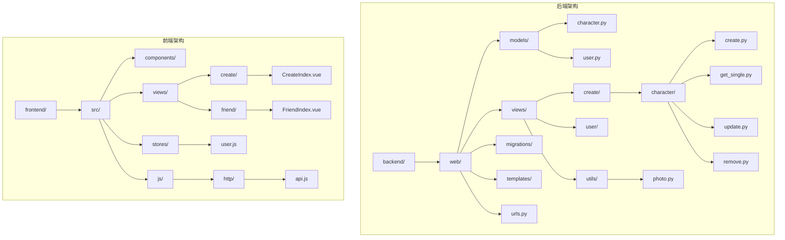
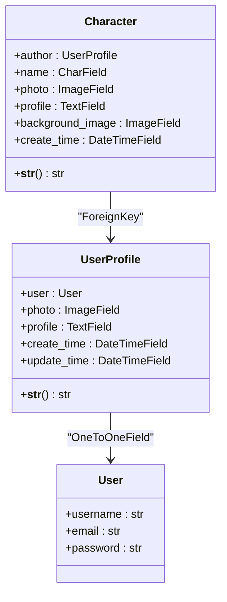
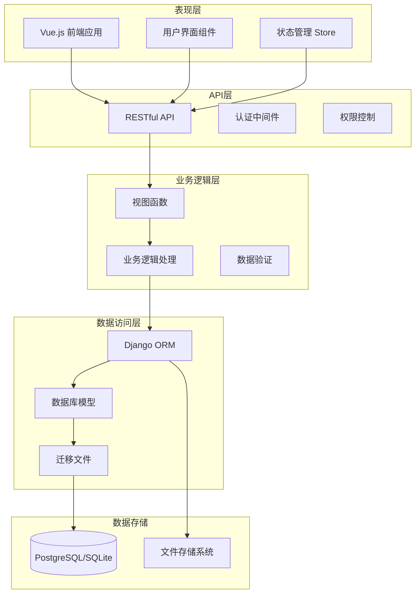
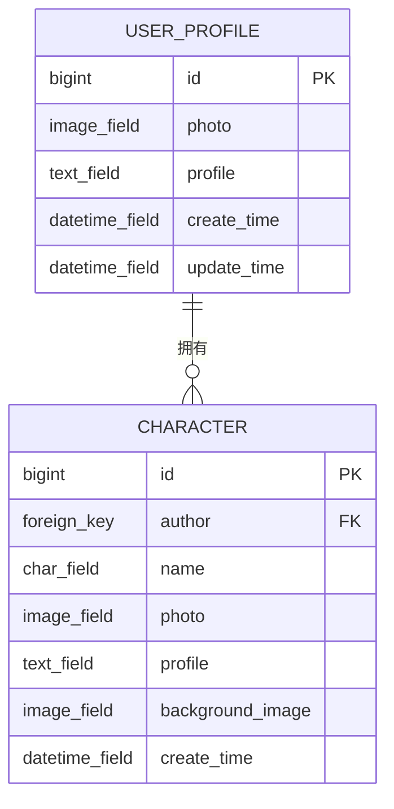
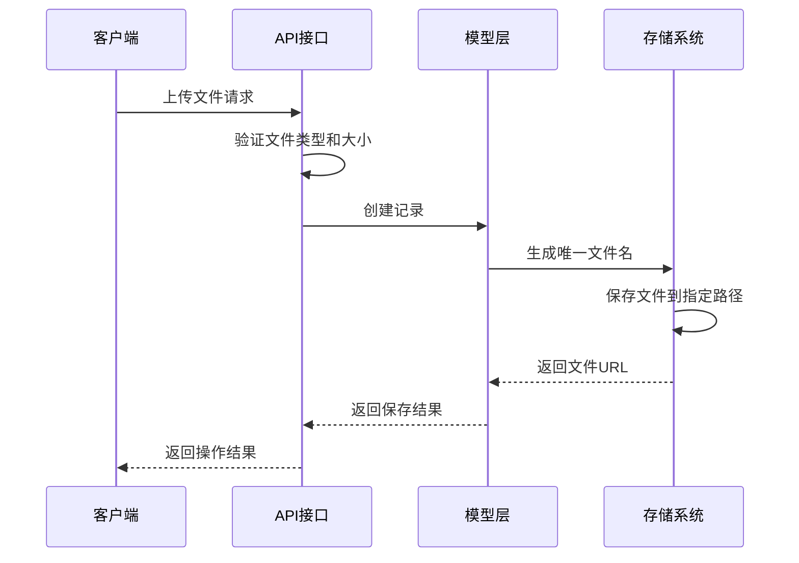
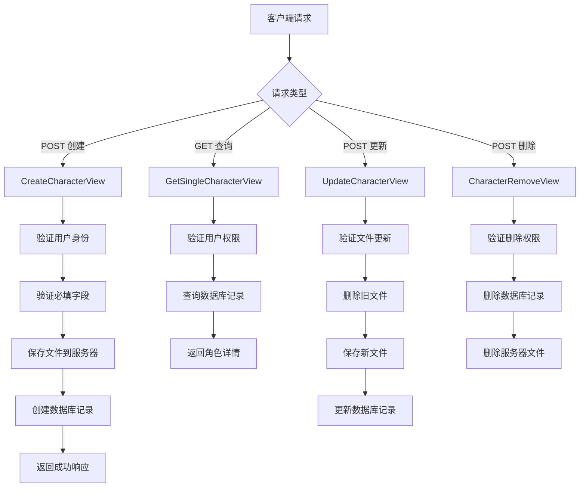
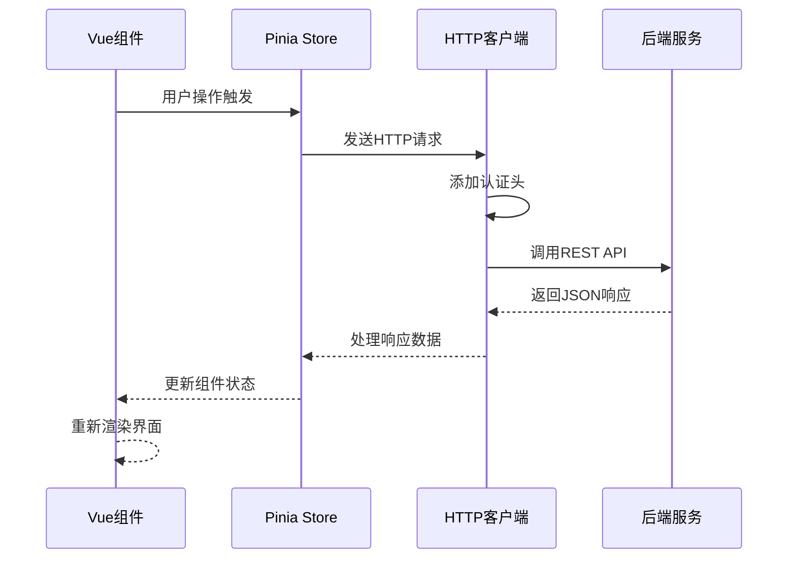
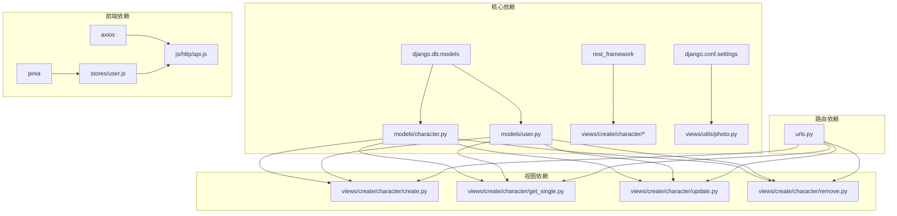
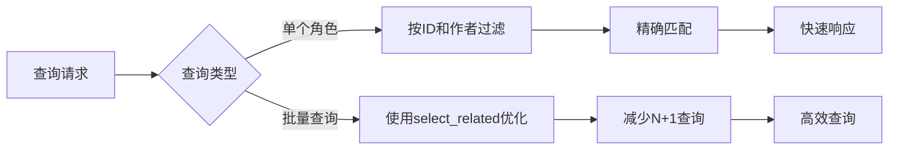

# 角色模型设计

<cite>
**本文档引用的文件**
- [character.py](file://backend/web/models/character.py)
- [user.py](file://backend/web/models/user.py)
- [create.py](file://backend/web/views/create/character/create.py)
- [get_single.py](file://backend/web/views/create/character/get_single.py)
- [update.py](file://backend/web/views/create/character/update.py)
- [remove.py](file://backend/web/views/create/character/remove.py)
- [photo.py](file://backend/web/views/utils/photo.py)
- [0001_initial.py](file://backend/web/migrations/0001_initial.py)
- [0002_alter_userprofile_photo_character.py](file://backend/web/migrations/0002_alter_userprofile_photo_character.py)
- [0003_rename_background_character_background_image.py](file://backend/web/migrations/0003_rename_background_character_background_image.py)
- [urls.py](file://backend/web/urls.py)
- [user.js](file://frontend/src/stores/user.js)
- [api.js](file://frontend/src/js/http/api.js)
- [CreateIndex.vue](file://frontend/src/views/create/CreateIndex.vue)
- [FriendIndex.vue](file://frontend/src/views/friend/FriendIndex.vue)
</cite>

## 目录
1. [简介](#简介)
2. [项目结构](#项目结构)
3. [核心组件](#核心组件)
4. [架构概览](#架构概览)
5. [详细组件分析](#详细组件分析)
6. [依赖关系分析](#依赖关系分析)
7. [性能考虑](#性能考虑)
8. [故障排除指南](#故障排除指南)
9. [结论](#结论)

## 简介

本项目是一个基于Django和Vue.js构建的AI朋友社交平台，专注于角色模型的设计与实现。角色模型允许用户创建、管理和自定义自己的AI角色，包括角色头像、背景图片和角色描述等个性化设置。

该项目采用前后端分离架构，后端使用Django框架提供RESTful API服务，前端使用Vue.js构建用户界面。角色模型作为核心业务实体，通过外键关联到用户模型，实现了用户与角色的一对多关系。

## 项目结构

项目采用标准的Django项目结构，主要分为后端和前端两个部分：

**图表来源**
- [urls.py:1-32](file://backend/web/urls.py#L1-L32)
- [character.py:1-27](file://backend/web/models/character.py#L1-L27)
- [user.py:1-23](file://backend/web/models/user.py#L1-L23)

**章节来源**
- [urls.py:1-32](file://backend/web/urls.py#L1-L32)
- [character.py:1-27](file://backend/web/models/character.py#L1-L27)
- [user.py:1-23](file://backend/web/models/user.py#L1-L23)

## 核心组件

### 数据模型层

角色模型和用户模型构成了系统的核心数据结构。角色模型通过外键关联到用户模型，实现了用户与角色的关联关系。

**图表来源**
- [character.py:18-27](file://backend/web/models/character.py#L18-L27)
- [user.py:15-23](file://backend/web/models/user.py#L15-L23)

### 视图层

系统提供了完整的角色管理API接口，包括创建、查询、更新和删除功能：

| 接口 | 方法 | 路径 | 功能 |
|------|------|------|------|
| CreateCharacterView | POST | /api/create/character/create/ | 创建新角色 |
| GetSingleCharacterView | GET | /api/create/character/get_single/ | 获取单个角色详情 |
| UpdateCharacterView | POST | /api/create/character/update/ | 更新角色信息 |
| CharacterRemoveView | POST | /api/create/character/remove/ | 删除角色 |

**章节来源**
- [create.py:10-51](file://backend/web/views/create/character/create.py#L10-L51)
- [get_single.py:8-30](file://backend/web/views/create/character/get_single.py#L8-L30)
- [update.py:10-46](file://backend/web/views/create/character/update.py#L10-L46)
- [remove.py:8-18](file://backend/web/views/create/character/remove.py#L8-L18)

## 架构概览

系统采用分层架构设计，实现了清晰的关注点分离：

**图表来源**
- [urls.py:15-27](file://backend/web/urls.py#L15-L27)
- [api.js:14-92](file://frontend/src/js/http/api.js#L14-L92)

## 详细组件分析

### 角色模型设计

角色模型设计充分考虑了AI角色的特性需求，提供了灵活的配置选项：

**图表来源**
- [character.py:18-27](file://backend/web/models/character.py#L18-L27)
- [user.py:15-23](file://backend/web/models/user.py#L15-L23)

#### 字段设计分析

| 字段名 | 类型 | 约束 | 描述 |
|--------|------|------|------|
| id | BigAutoField | 主键 | 角色唯一标识符 |
| author | ForeignKey | 外键约束 | 关联到用户档案 |
| name | CharField | max_length=50 | 角色名称 |
| photo | ImageField | 图片上传 | 角色头像 |
| profile | TextField | max_length=100000 | 角色描述信息 |
| background_image | ImageField | 图片上传 | 聊天背景图片 |
| create_time | DateTimeField | default=now | 创建时间 |

**章节来源**
- [character.py:18-27](file://backend/web/models/character.py#L18-L27)

### 文件上传机制

系统实现了智能的文件上传和管理机制：

**图表来源**
- [create.py:12-48](file://backend/web/views/create/character/create.py#L12-L48)
- [photo.py:9-13](file://backend/web/views/utils/photo.py#L9-L13)

#### 文件命名策略

系统采用UUID生成器确保文件名的唯一性，避免文件冲突：

- **头像文件路径**: `charactor/photos/{用户ID}/{UUID}.扩展名`
- **背景图片路径**: `charactor/background_images/{用户ID}/{UUID}.扩展名`

**章节来源**
- [character.py:8-16](file://backend/web/models/character.py#L8-L16)
- [photo.py:9-13](file://backend/web/views/utils/photo.py#L9-L13)

### API接口设计

系统提供了完整的角色管理API，支持RESTful设计原则：

**图表来源**
- [create.py:12-48](file://backend/web/views/create/character/create.py#L12-L48)
- [get_single.py:11-26](file://backend/web/views/create/character/get_single.py#L11-L26)
- [update.py:13-39](file://backend/web/views/create/character/update.py#L13-L39)
- [remove.py:11-14](file://backend/web/views/create/character/remove.py#L11-L14)

**章节来源**
- [create.py:10-51](file://backend/web/views/create/character/create.py#L10-L51)
- [get_single.py:8-30](file://backend/web/views/create/character/get_single.py#L8-L30)
- [update.py:10-46](file://backend/web/views/create/character/update.py#L10-L46)
- [remove.py:8-18](file://backend/web/views/create/character/remove.py#L8-L18)

### 前端集成

前端使用Vue.js和Pinia进行状态管理，实现了与后端API的无缝集成：

**图表来源**
- [user.js:4-59](file://frontend/src/stores/user.js#L4-L59)
- [api.js:21-89](file://frontend/src/js/http/api.js#L21-L89)

**章节来源**
- [user.js:4-59](file://frontend/src/stores/user.js#L4-L59)
- [api.js:14-92](file://frontend/src/js/http/api.js#L14-L92)

## 依赖关系分析

系统各组件之间的依赖关系清晰明确，遵循了良好的软件工程原则：

**图表来源**
- [character.py:1-3](file://backend/web/models/character.py#L1-L3)
- [user.py:1-6](file://backend/web/models/user.py#L1-L6)
- [urls.py:1-14](file://backend/web/urls.py#L1-L14)

### 数据库迁移历史

系统通过迁移文件管理数据库结构变更：

| 迁移文件 | 变更内容 | 时间 |
|----------|----------|------|
| 0001_initial.py | 创建UserProfile模型 | 2026-03-06 |
| 0002_alter_userprofile_photo_character.py | 修改头像字段和创建Character模型 | 2026-03-12 |
| 0003_rename_background_character_background_image.py | 重命名背景字段 | 2026-03-12 |

**章节来源**
- [0001_initial.py:9-29](file://backend/web/migrations/0001_initial.py#L9-L29)
- [0002_alter_userprofile_photo_character.py:10-34](file://backend/web/migrations/0002_alter_userprofile_photo_character.py#L10-L34)
- [0003_rename_background_character_background_image.py:6-18](file://backend/web/migrations/0003_rename_background_character_background_image.py#L6-L18)

## 性能考虑

### 文件存储优化

系统采用了智能的文件存储策略来优化性能：

1. **UUID文件命名**: 使用随机UUID确保文件名唯一性，避免文件覆盖问题
2. **目录结构优化**: 按用户ID组织文件目录，便于文件管理和清理
3. **默认文件处理**: 特殊处理默认头像文件，避免不必要的文件删除操作

### 数据库查询优化

**图表来源**
- [get_single.py](file://backend/web/views/create/character/get_single.py#L16)
- [update.py](file://backend/web/views/create/character/update.py#L16)

### 缓存策略

建议实施以下缓存策略以提升系统性能：

1. **用户会话缓存**: 缓存用户认证信息，减少数据库查询
2. **角色列表缓存**: 对常用角色查询结果进行缓存
3. **静态文件缓存**: 利用CDN缓存图片等静态资源

## 故障排除指南

### 常见问题及解决方案

| 问题类型 | 症状 | 可能原因 | 解决方案 |
|----------|------|----------|----------|
| 文件上传失败 | 400 Bad Request | 文件格式不支持或大小超限 | 检查文件类型和大小限制 |
| 权限错误 | 401 Unauthorized | 访问令牌过期或无效 | 调用刷新令牌接口重新获取 |
| 数据库连接错误 | 500 Internal Server Error | 数据库连接池耗尽 | 检查数据库连接配置 |
| 文件删除失败 | 500 Internal Server Error | 文件不存在或权限不足 | 验证文件路径和权限设置 |

### 调试技巧

1. **后端调试**: 使用Django调试模式查看详细错误信息
2. **前端调试**: 在浏览器开发者工具中检查网络请求和响应
3. **日志监控**: 配置系统日志记录关键操作和错误信息

**章节来源**
- [create.py:48-51](file://backend/web/views/create/character/create.py#L48-L51)
- [get_single.py:27-30](file://backend/web/views/create/character/get_single.py#L27-L30)
- [update.py:43-46](file://backend/web/views/create/character/update.py#L43-L46)
- [remove.py:15-18](file://backend/web/views/create/character/remove.py#L15-L18)

## 结论

本项目的角色模型设计体现了现代Web应用的最佳实践，通过清晰的分层架构、完善的API设计和智能的文件管理机制，为AI角色的创建和管理提供了强大的技术支持。

### 设计亮点

1. **模块化设计**: 清晰的组件划分和职责分离
2. **可扩展性**: 支持未来功能扩展和性能优化
3. **用户体验**: 提供直观的用户界面和流畅的操作体验
4. **安全性**: 实现了完善的认证授权机制

### 改进建议

1. **增加角色模板功能**: 提供预设的角色模板供用户选择
2. **实现角色分享机制**: 允许用户分享和发现优秀的AI角色
3. **增强搜索功能**: 提供基于关键词和标签的角色搜索
4. **优化移动端体验**: 针对移动设备进行界面和交互优化

该角色模型设计为AI社交应用的发展奠定了坚实的基础，通过持续的迭代和优化，有望成为AI角色管理领域的优秀解决方案。