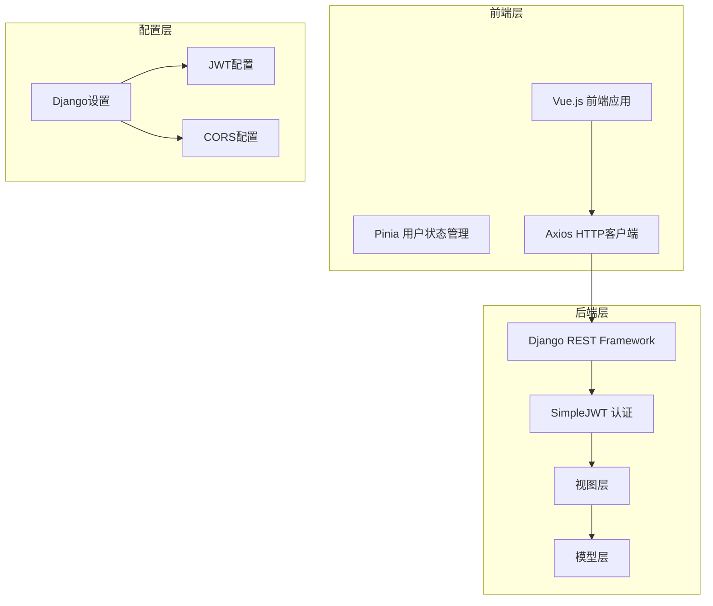
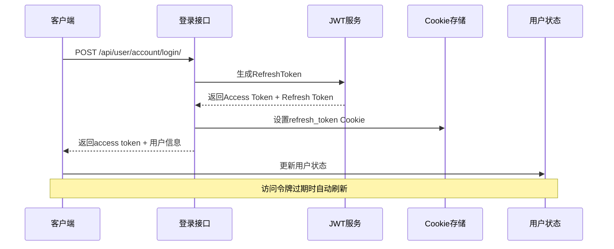
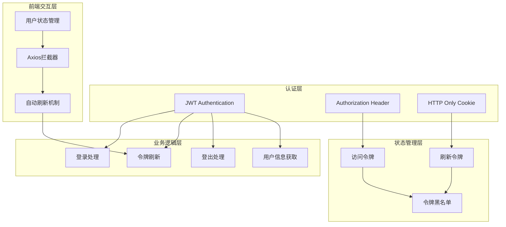
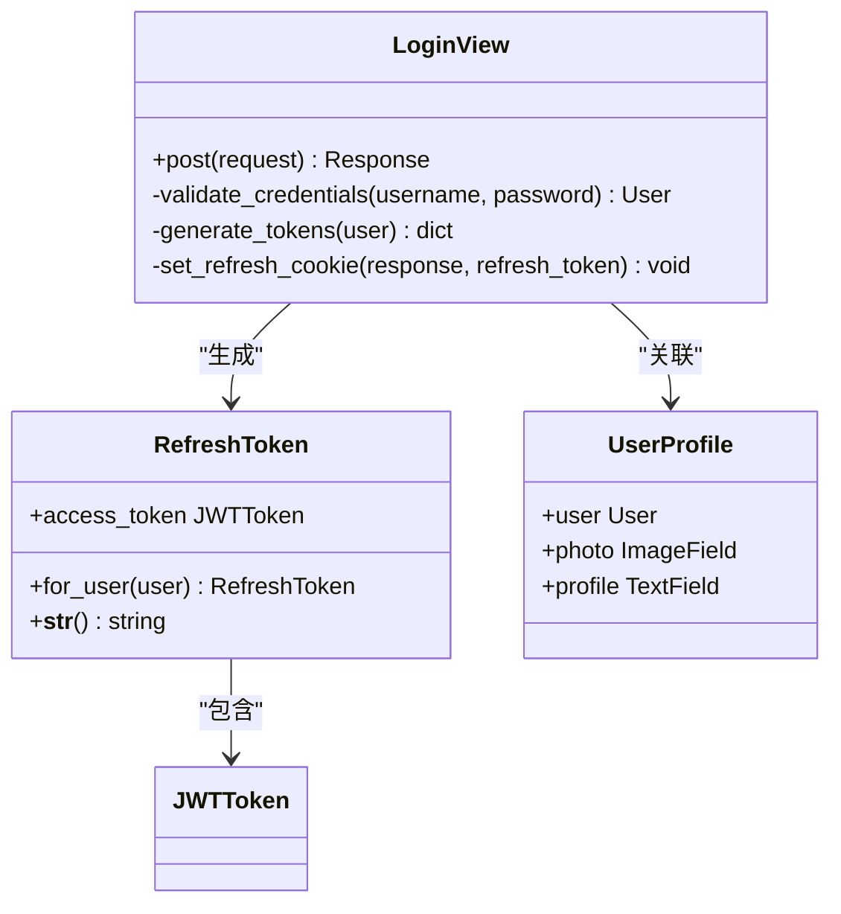
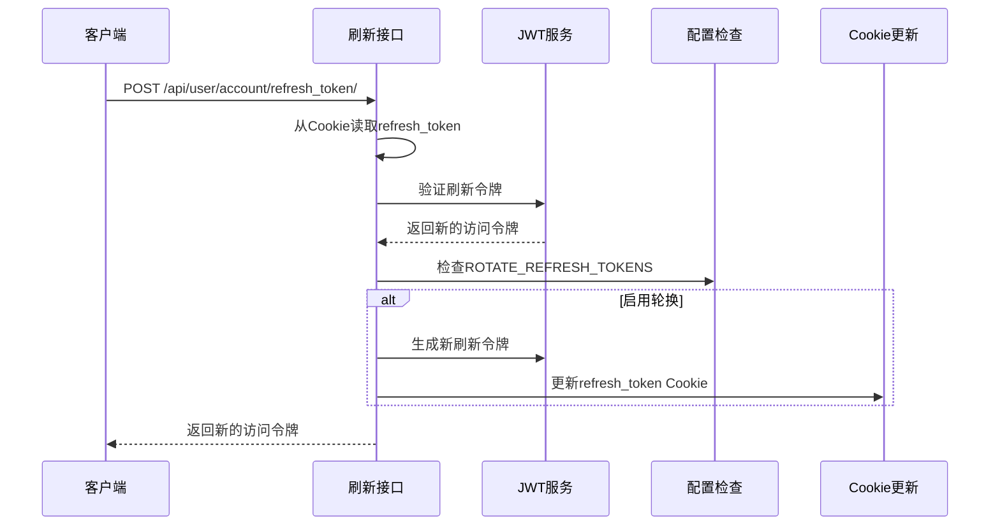
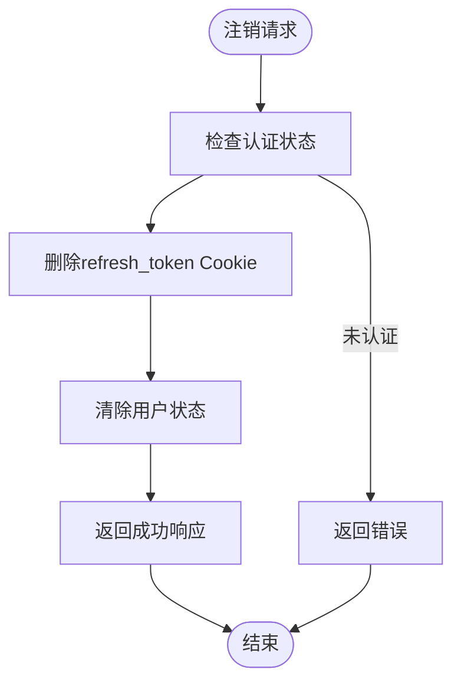
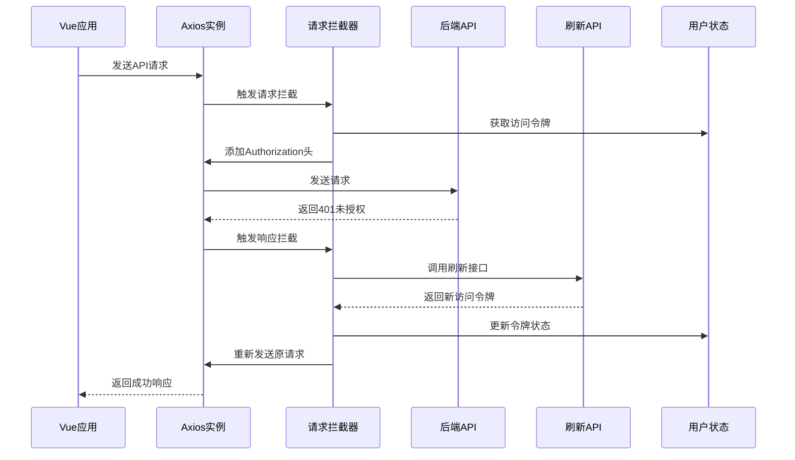
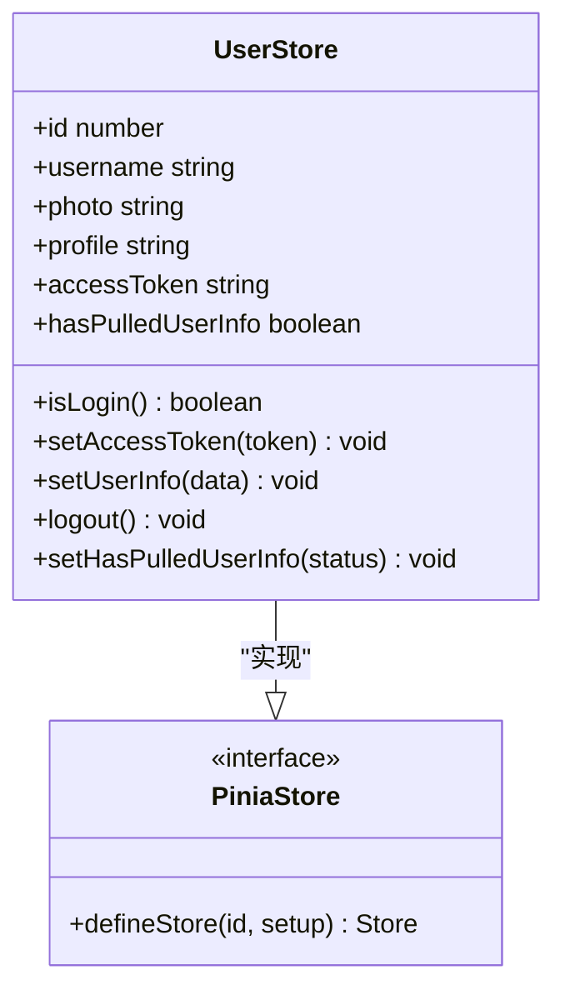
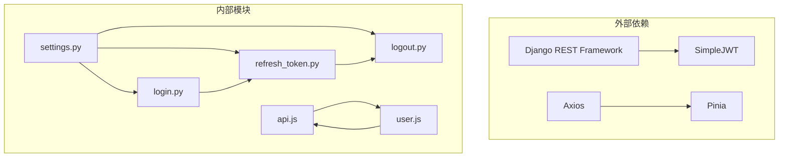

# JWT令牌管理

<cite>
**本文档引用的文件**
- [settings.py](file://backend/backend/settings.py)
- [urls.py](file://backend/web/urls.py)
- [login.py](file://backend/web/views/user/account/login.py)
- [refresh_token.py](file://backend/web/views/user/account/refresh_token.py)
- [logout.py](file://backend/web/views/user/account/logout.py)
- [register.py](file://backend/web/views/user/account/register.py)
- [user.js](file://frontend/src/stores/user.js)
- [api.js](file://frontend/src/js/http/api.js)
</cite>

## 目录
1. [简介](#简介)
2. [项目结构](#项目结构)
3. [核心组件](#核心组件)
4. [架构概览](#架构概览)
5. [详细组件分析](#详细组件分析)
6. [依赖关系分析](#依赖关系分析)
7. [性能考虑](#性能考虑)
8. [故障排除指南](#故障排除指南)
9. [结论](#结论)

## 简介

LLM_AIfriends项目采用Django REST Framework SimpleJWT实现JWT令牌管理，提供完整的用户认证和授权机制。本项目实现了基于Cookie的JWT令牌管理方案，包括访问令牌(Access Token)和刷新令牌(Refresh Token)的完整生命周期管理。

## 项目结构

项目采用前后端分离架构，JWT令牌管理主要集中在后端Django应用中，前端通过Axios拦截器实现自动令牌刷新机制。



**图表来源**
- [settings.py:133-158](file://backend/backend/settings.py#L133-L158)
- [urls.py:1-24](file://backend/web/urls.py#L1-L24)

**章节来源**
- [settings.py:1-158](file://backend/backend/settings.py#L1-L158)
- [urls.py:1-24](file://backend/web/urls.py#L1-L24)

## 核心组件

### JWT配置参数

项目使用以下JWT配置参数：

| 参数名称 | 值 | 描述 |
|---------|-----|------|
| ACCESS_TOKEN_LIFETIME | 2小时 | 访问令牌有效期 |
| REFRESH_TOKEN_LIFETIME | 7天 | 刷新令牌有效期 |
| ROTATE_REFRESH_TOKENS | True | 启用刷新令牌轮换 |
| BLACKLIST_AFTER_ROTATION | True | 轮换后加入黑名单 |
| AUTH_HEADER_TYPES | ('Bearer',) | 认证头类型 |

### 认证流程



**图表来源**
- [login.py:22-38](file://backend/web/views/user/account/login.py#L22-L38)
- [settings.py:142-151](file://backend/backend/settings.py#L142-L151)

**章节来源**
- [settings.py:142-151](file://backend/backend/settings.py#L142-L151)
- [login.py:22-38](file://backend/web/views/user/account/login.py#L22-L38)

## 架构概览

JWT令牌管理系统采用分层架构设计，确保安全性、可维护性和用户体验。



**图表来源**
- [settings.py:136-151](file://backend/backend/settings.py#L136-L151)
- [api.js:21-90](file://frontend/src/js/http/api.js#L21-L90)

## 详细组件分析

### 登录组件 (LoginView)

登录组件负责用户身份验证和JWT令牌生成：



**图表来源**
- [login.py:9-46](file://backend/web/views/user/account/login.py#L9-L46)

登录流程特点：
- 用户名密码验证
- 生成JWT令牌对
- 设置HTTP Only Cookie存储刷新令牌
- 返回访问令牌和用户信息

**章节来源**
- [login.py:9-46](file://backend/web/views/user/account/login.py#L9-L46)

### 令牌刷新组件 (RefreshTokenView)

刷新组件实现访问令牌的自动更新机制：



**图表来源**
- [refresh_token.py:7-36](file://backend/web/views/user/account/refresh_token.py#L7-L36)

刷新策略特点：
- 从Cookie读取刷新令牌
- 自动验证令牌有效性
- 支持刷新令牌轮换
- 维持用户会话连续性

**章节来源**
- [refresh_token.py:7-36](file://backend/web/views/user/account/refresh_token.py#L7-L36)

### 注销组件 (LogoutView)

注销组件负责清理用户会话状态：



**图表来源**
- [logout.py:7-16](file://backend/web/views/user/account/logout.py#L7-L16)

**章节来源**
- [logout.py:7-16](file://backend/web/views/user/account/logout.py#L7-L16)

### 前端自动刷新机制

前端使用Axios拦截器实现智能令牌刷新：



**图表来源**
- [api.js:46-90](file://frontend/src/js/http/api.js#L46-L90)

**章节来源**
- [api.js:46-90](file://frontend/src/js/http/api.js#L46-L90)

### 用户状态管理

用户状态管理组件负责前端令牌和用户信息的持久化：



**图表来源**
- [user.js:4-59](file://frontend/src/stores/user.js#L4-L59)

**章节来源**
- [user.js:4-59](file://frontend/src/stores/user.js#L4-L59)

## 依赖关系分析

JWT令牌管理系统的关键依赖关系如下：



**图表来源**
- [settings.py:40-43](file://backend/backend/settings.py#L40-L43)
- [api.js:11-19](file://frontend/src/js/http/api.js#L11-L19)

**章节来源**
- [settings.py:40-43](file://backend/backend/settings.py#L40-L43)
- [api.js:11-19](file://frontend/src/js/http/api.js#L11-L19)

## 性能考虑

### 令牌生命周期优化

1. **访问令牌短生命周期**：2小时的有效期平衡了安全性与用户体验
2. **刷新令牌长生命周期**：7天的有效期支持长时间会话保持
3. **智能刷新策略**：仅在必要时刷新，避免频繁网络请求

### 前端性能优化

1. **并发请求处理**：使用`isRefreshing`标志防止重复刷新请求
2. **请求队列管理**：通过订阅者模式管理并发刷新请求
3. **本地状态缓存**：使用Pinia进行状态管理，减少DOM操作

### 安全性能平衡

1. **Cookie安全属性**：启用`HttpOnly`和`Secure`属性
2. **SameSite策略**：使用`Lax`策略平衡安全性与可用性
3. **令牌轮换**：定期轮换刷新令牌，增强安全性

## 故障排除指南

### 常见问题及解决方案

#### 1. 访问令牌过期问题

**症状**：API请求返回401未授权错误

**诊断步骤**：
1. 检查前端是否正确设置Authorization头
2. 验证后端JWT配置是否正确
3. 确认刷新令牌是否仍然有效

**解决方案**：
- 实现自动刷新机制
- 检查网络请求拦截器配置
- 验证令牌格式和有效期

#### 2. 刷新令牌无效问题

**症状**：刷新接口返回401错误

**诊断步骤**：
1. 检查Cookie中refresh_token是否存在
2. 验证刷新令牌是否在有效期内
3. 确认ROTATE_REFRESH_TOKENS配置

**解决方案**：
- 重新登录获取新的刷新令牌
- 检查服务器时间同步
- 验证JWT配置参数

#### 3. 跨域问题

**症状**：前端无法接收Cookie或出现跨域错误

**诊断步骤**：
1. 检查CORS配置
2. 验证withCredentials设置
3. 确认Cookie域名和路径配置

**解决方案**：
- 配置正确的CORS_ALLOWED_ORIGINS
- 设置CORS_ALLOW_CREDENTIALS为True
- 确保Cookie的secure属性与HTTPS配置一致

#### 4. 令牌轮换问题

**症状**：用户登出后仍能访问受保护资源

**诊断步骤**：
1. 检查BLACKLIST_AFTER_ROTATION配置
2. 验证令牌黑名单功能
3. 确认刷新令牌轮换逻辑

**解决方案**：
- 启用BLACKLIST_AFTER_ROTATION
- 实现令牌黑名单管理
- 清理过期令牌

### 调试技巧

1. **后端调试**：
   ```python
   # 在settings.py中启用调试
   DEBUG = True
   ```

2. **前端调试**：
   ```javascript
   // 在api.js中添加调试日志
   console.log('Access Token:', user.accessToken);
   console.log('Refresh Token:', document.cookie);
   ```

3. **网络调试**：
   - 使用浏览器开发者工具查看请求头
   - 检查Cookie设置情况
   - 监控网络请求响应状态

**章节来源**
- [settings.py:154-158](file://backend/backend/settings.py#L154-L158)
- [api.js:46-90](file://frontend/src/js/http/api.js#L46-L90)

## 结论

LLM_AIfriends项目的JWT令牌管理系统实现了完整的认证和授权机制，具有以下特点：

### 优势

1. **安全性**：采用HTTP Only Cookie存储刷新令牌，防止XSS攻击
2. **用户体验**：智能自动刷新机制，无需频繁重新登录
3. **可维护性**：清晰的代码结构和配置分离
4. **扩展性**：模块化设计便于功能扩展

### 最佳实践建议

1. **生产环境配置**：
   - 设置更严格的CORS配置
   - 启用HTTPS和安全Cookie属性
   - 调整令牌有效期参数

2. **监控和日志**：
   - 添加JWT相关的日志记录
   - 监控令牌使用统计
   - 实现异常告警机制

3. **性能优化**：
   - 实现令牌预刷新机制
   - 优化并发请求处理
   - 添加令牌缓存策略

4. **安全加固**：
   - 实现IP绑定和设备绑定
   - 添加多因素认证支持
   - 定期审计令牌使用情况

该JWT令牌管理系统为LLM_AIfriends项目提供了可靠的身份认证基础，通过合理的配置和实现，能够满足现代Web应用的安全性和可用性要求。