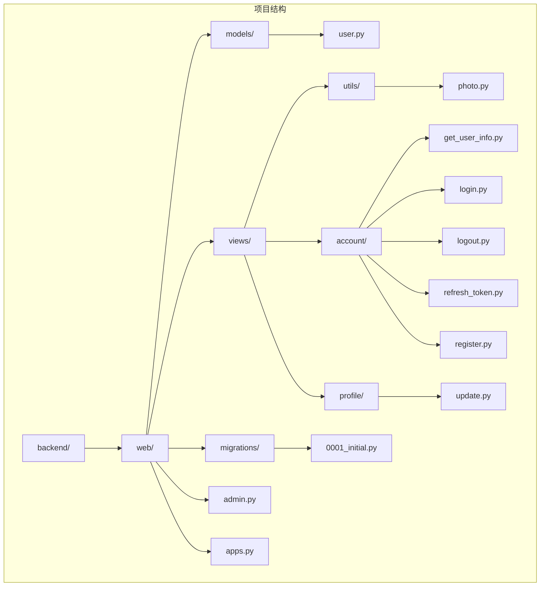
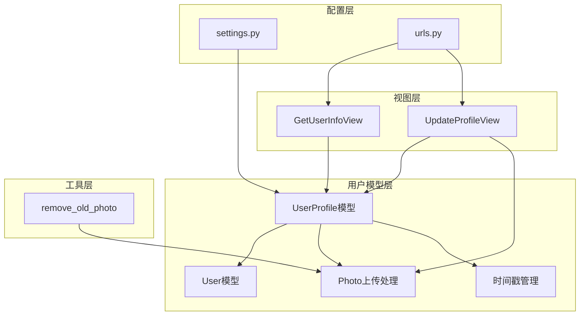
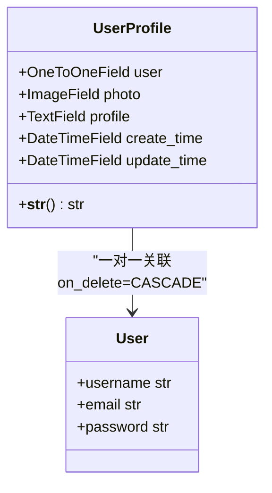
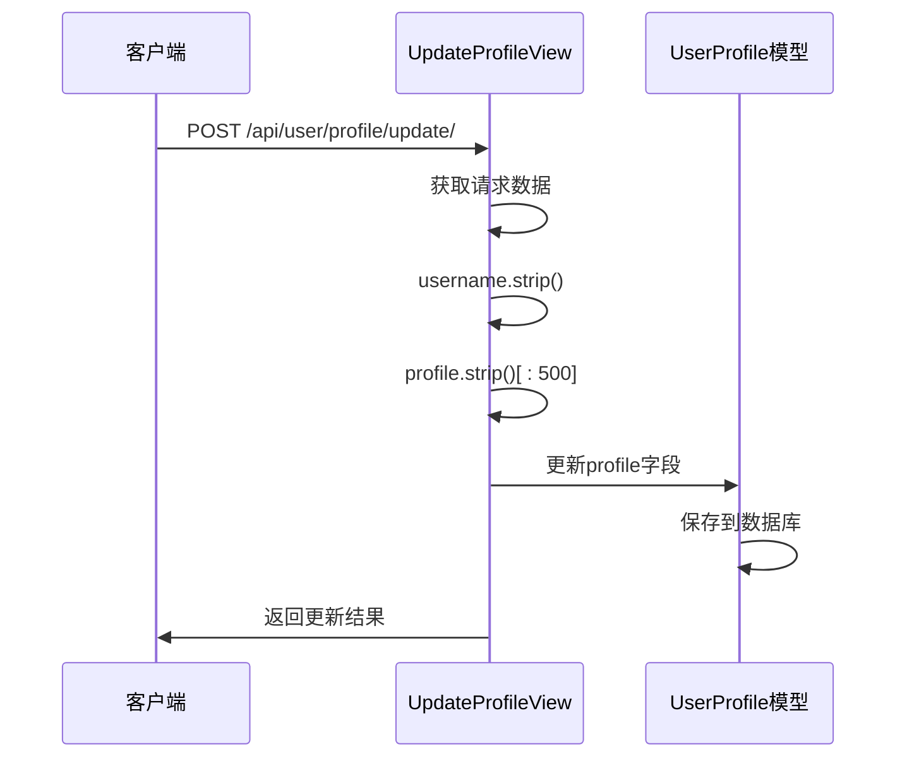
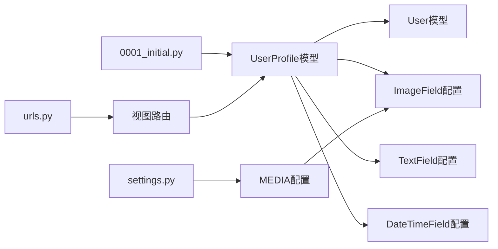

# 用户模型设计

<cite>
**本文档引用的文件**
- [backend/web/models/user.py](file://backend/web/models/user.py)
- [backend/web/migrations/0001_initial.py](file://backend/web/migrations/0001_initial.py)
- [backend/web/views/utils/photo.py](file://backend/web/views/utils/photo.py)
- [backend/web/views/user/account/get_user_info.py](file://backend/web/views/user/account/get_user_info.py)
- [backend/web/views/user/profile/update.py](file://backend/web/views/user/profile/update.py)
- [backend/web/admin.py](file://backend/web/admin.py)
- [backend/backend/settings.py](file://backend/backend/settings.py)
- [backend/web/urls.py](file://backend/web/urls.py)
</cite>

## 目录
1. [引言](#引言)
2. [项目结构](#项目结构)
3. [核心组件](#核心组件)
4. [架构概览](#架构概览)
5. [详细组件分析](#详细组件分析)
6. [依赖关系分析](#依赖关系分析)
7. [性能考虑](#性能考虑)
8. [故障排除指南](#故障排除指南)
9. [结论](#结论)

## 引言

本文件为LLM_AIfriends项目的用户模型设计文档，专注于UserProfile模型的数据库结构设计。该模型采用OneToOneField与Django内置的User模型建立一对一关联关系，实现了用户个人资料的扩展存储。文档详细说明了头像字段photo的ImageField配置、上传路径策略和文件命名规则，解释了用户简介profile字段的文本限制和默认值设置，以及时间戳字段create_time和update_time的数据类型和默认行为。同时包含了模型的__str__方法实现和本地化时间格式化，以及模型扩展的最佳实践和数据库迁移注意事项。

## 项目结构

LLM_AIfriends项目采用标准的Django应用结构，用户模型位于web应用的models目录下，相关的视图、工具函数和管理界面分别分布在不同的模块中。



**图表来源**
- [backend/web/models/user.py:1-23](file://backend/web/models/user.py#L1-L23)
- [backend/web/migrations/0001_initial.py:1-30](file://backend/web/migrations/0001_initial.py#L1-L30)

**章节来源**
- [backend/web/models/user.py:1-23](file://backend/web/models/user.py#L1-L23)
- [backend/web/migrations/0001_initial.py:1-30](file://backend/web/migrations/0001_initial.py#L1-L30)

## 核心组件

### UserProfile模型概述

UserProfile模型是用户系统的扩展模型，通过OneToOneField与Django的User模型建立一对一关联关系。该模型继承自django.db.models.Model基类，提供了用户个人资料的核心功能。

### 数据库字段设计

模型包含以下核心字段：

1. **user字段**：一对一关联到Django内置的User模型
2. **photo字段**：用户头像，使用ImageField存储
3. **profile字段**：用户简介，使用TextField存储
4. **create_time字段**：记录创建时间
5. **update_time字段**：记录更新时间

**章节来源**
- [backend/web/models/user.py:15-23](file://backend/web/models/user.py#L15-L23)

## 架构概览

用户模型在整个系统中的架构位置如下：



**图表来源**
- [backend/web/models/user.py:15-23](file://backend/web/models/user.py#L15-L23)
- [backend/web/views/user/account/get_user_info.py:8-25](file://backend/web/views/user/account/get_user_info.py#L8-L25)
- [backend/web/views/user/profile/update.py:12-63](file://backend/web/views/user/profile/update.py#L12-L63)
- [backend/web/views/utils/photo.py:9-13](file://backend/web/views/utils/photo.py#L9-L13)

## 详细组件分析

### OneToOneField关联设计

UserProfile模型通过OneToOneField与User模型建立了强关联关系：



**图表来源**
- [backend/web/models/user.py:15-23](file://backend/web/models/user.py#L15-L23)

这种设计确保了每个用户都有且仅有一个对应的用户档案，当用户被删除时，相关的用户档案也会自动删除。

**章节来源**
- [backend/web/models/user.py:15-23](file://backend/web/models/user.py#L15-L23)

### 头像字段Photo配置

#### ImageField配置

头像字段photo使用ImageField进行配置，具有以下特点：

- **默认值**：设置为'default.png'，确保用户首次注册时有默认头像
- **上传路径**：通过自定义upload_to函数实现动态路径生成
- **文件命名**：使用UUID生成唯一文件名，避免文件冲突

#### 上传路径策略

```mermaid
flowchart TD
A[文件上传请求] --> B[调用photo_upload_to函数]
B --> C[提取文件扩展名]
C --> D[生成UUID十六进制字符串]
D --> E[组合最终文件名]
E --> F[返回路径: user/photos/{user_id}_{filename}]
F --> G[保存到MEDIA_ROOT下的指定目录]
```

**图表来源**
- [backend/web/models/user.py:10-13](file://backend/web/models/user.py#L10-L13)

#### 文件命名规则

文件命名采用UUID + 扩展名的策略：
- 使用uuid.uuid4().hex[:10]生成10位十六进制字符串
- 保留原始文件扩展名
- 结合user_id形成唯一标识

**章节来源**
- [backend/web/models/user.py:10-13](file://backend/web/models/user.py#L10-L13)

### 简介字段Profile设计

#### 文本限制

简介字段profile采用TextField配置：
- **默认值**：设置为"谢谢你的关注"，提供友好的默认欢迎语
- **最大长度**：限制为500字符，防止过长的简介影响数据库性能
- **数据类型**：TextField支持较长的文本内容

#### 前端验证流程



**图表来源**
- [backend/web/views/user/profile/update.py:20-22](file://backend/web/views/user/profile/update.py#L20-L22)

**章节来源**
- [backend/web/models/user.py](file://backend/web/models/user.py#L18)
- [backend/web/views/user/profile/update.py:20-22](file://backend/web/views/user/profile/update.py#L20-L22)

### 时间戳字段设计

#### 字段配置

时间戳字段采用DateTimeField配置：

- **create_time**：记录用户档案创建时间，默认使用当前时间
- **update_time**：记录用户档案最后更新时间，默认使用当前时间
- **默认值**：都设置为now函数，确保每次实例化时自动获取当前时间

#### 本地化时间格式化

模型的__str__方法实现了本地化时间格式化：
- 使用localtime函数将UTC时间转换为本地时间
- 采用"%Y-%m-%d %H:%M:%S"格式输出
- 提供可读性强的时间显示格式

**章节来源**
- [backend/web/models/user.py:19-20](file://backend/web/models/user.py#L19-L20)
- [backend/web/models/user.py:22-23](file://backend/web/models/user.py#L22-L23)

### 模型扩展最佳实践

#### 管理员界面优化

管理员界面通过raw_id_fields优化大字段显示：
- 对user字段使用raw_id_fields避免页面加载卡顿
- 适用于大量用户数据的管理场景

#### 视图层集成

用户信息获取和更新通过专门的视图类实现：
- GetUserInfoView：提供用户信息查询接口
- UpdateProfileView：处理用户信息更新逻辑
- 都使用IsAuthenticated权限类确保安全性

**章节来源**
- [backend/web/admin.py:7-9](file://backend/web/admin.py#L7-L9)
- [backend/web/views/user/account/get_user_info.py:8-25](file://backend/web/views/user/account/get_user_info.py#L8-L25)
- [backend/web/views/user/profile/update.py:12-63](file://backend/web/views/user/profile/update.py#L12-L63)

## 依赖关系分析

### 数据库迁移关系



**图表来源**
- [backend/web/migrations/0001_initial.py:18-27](file://backend/web/migrations/0001_initial.py#L18-L27)
- [backend/backend/settings.py:130-131](file://backend/backend/settings.py#L130-L131)

### 外部依赖关系

- **Django内置User模型**：通过OneToOneField关联
- **Django REST Framework**：用于API视图开发
- **Django SimpleJWT**：提供JWT认证支持
- **Django CORS Headers**：处理跨域请求

**章节来源**
- [backend/web/migrations/0001_initial.py:13-15](file://backend/web/migrations/0001_initial.py#L13-L15)
- [backend/backend/settings.py:40-43](file://backend/backend/settings.py#L40-L43)
- [backend/backend/settings.py:136-151](file://backend/backend/settings.py#L136-L151)

## 性能考虑

### 文件存储优化

1. **文件命名策略**：使用UUID确保文件唯一性，避免重复覆盖
2. **路径组织**：按用户ID组织文件夹，便于管理和清理
3. **默认头像**：减少数据库存储压力，提高加载速度

### 数据库查询优化

1. **raw_id_fields**：管理员界面使用raw_id_fields避免大字段渲染
2. **索引设计**：OneToOneField自动创建索引，提高查询效率
3. **批量操作**：视图层使用单次查询获取用户档案

### 缓存策略

虽然当前实现未包含缓存机制，但建议：
- 用户信息可以考虑短期缓存
- 头像URL可以使用浏览器缓存
- 频繁访问的用户数据可以使用Redis缓存

## 故障排除指南

### 常见问题及解决方案

#### 头像上传失败

**问题描述**：用户上传头像时出现错误

**可能原因**：
1. 文件类型不支持
2. 文件大小超出限制
3. 权限不足导致文件写入失败

**解决步骤**：
1. 检查MEDIA_ROOT目录权限
2. 验证文件类型和大小限制
3. 查看服务器磁盘空间

#### 默认头像显示问题

**问题描述**：用户看不到默认头像

**检查清单**：
1. 确认default.png文件存在于正确路径
2. 检查MEDIA_URL配置是否正确
3. 验证文件权限设置

#### 时间显示异常

**问题描述**：时间显示不符合预期

**排查要点**：
1. 检查TIME_ZONE设置
2. 验证localtime函数使用
3. 确认__str__方法实现

**章节来源**
- [backend/web/views/utils/photo.py:9-13](file://backend/web/views/utils/photo.py#L9-L13)
- [backend/backend/settings.py:111-112](file://backend/backend/settings.py#L111-L112)

### 调试技巧

1. **日志记录**：在关键操作点添加日志
2. **单元测试**：为模型方法编写测试用例
3. **数据库监控**：定期检查数据库性能指标

## 结论

LLM_AIfriends项目的UserProfile模型设计体现了良好的软件工程实践：

1. **清晰的架构设计**：通过OneToOneField实现用户扩展信息存储
2. **合理的数据类型选择**：根据业务需求选择合适的字段类型
3. **完善的文件管理**：实现了安全的文件上传和清理机制
4. **用户友好的默认值**：提供默认头像和欢迎语提升用户体验
5. **性能优化考虑**：通过raw_id_fields等技术优化数据库查询

该模型为用户系统提供了坚实的基础，支持后续的功能扩展和性能优化。建议在未来版本中考虑添加更多的用户偏好设置、隐私控制选项和更完善的文件管理功能。