# 用户认证系统

<cite>
**本文引用的文件**
- [backend/web/models/user.py](file://backend/web/models/user.py)
- [backend/web/views/user/account/register.py](file://backend/web/views/user/account/register.py)
- [backend/web/views/user/account/login.py](file://backend/web/views/user/account/login.py)
- [backend/web/views/user/account/get_user_info.py](file://backend/web/views/user/account/get_user_info.py)
- [backend/web/views/user/account/logout.py](file://backend/web/views/user/account/logout.py)
- [backend/web/views/user/account/refresh_token.py](file://backend/web/views/user/account/refresh_token.py)
- [backend/web/views/user/profile/update.py](file://backend/web/views/user/profile/update.py)
- [backend/web/urls.py](file://backend/web/urls.py)
- [backend/backend/settings.py](file://backend/backend/settings.py)
- [backend/web/migrations/0001_initial.py](file://backend/web/migrations/0001_initial.py)
- [backend/web/views/index.py](file://backend/web/views/index.py)
- [frontend/src/js/http/api.js](file://frontend/src/js/http/api.js)
- [frontend/src/stores/user.js](file://frontend/src/stores/user.js)
- [frontend/src/views/user/account/LoginIndex.vue](file://frontend/src/views/user/account/LoginIndex.vue)
- [frontend/src/views/user/account/RegisterIndex.vue](file://frontend/src/views/user/account/RegisterIndex.vue)
</cite>

## 目录
1. [引言](#引言)
2. [项目结构](#项目结构)
3. [核心组件](#核心组件)
4. [架构总览](#架构总览)
5. [详细组件分析](#详细组件分析)
6. [依赖分析](#依赖分析)
7. [性能考虑](#性能考虑)
8. [故障排查指南](#故障排查指南)
9. [结论](#结论)
10. [附录](#附录)

## 引言
本文件面向 LLM_AIfriends 项目的用户认证系统，围绕基于 JWT 的认证机制进行系统化文档化，涵盖用户模型设计、认证视图函数、令牌管理、注册与登录流程、会话管理、令牌刷新策略、黑名单机制、安全配置、认证中间件与权限控制、错误处理以及前后端集成的最佳实践。文档旨在帮助开发者快速理解并维护认证子系统。

## 项目结构
认证系统由后端 Django 应用与前端 Vue 应用协同完成，后端提供 REST API 与 JWT 配置，前端通过 Axios 拦截器统一注入 Authorization 头并在 401 时自动刷新令牌。

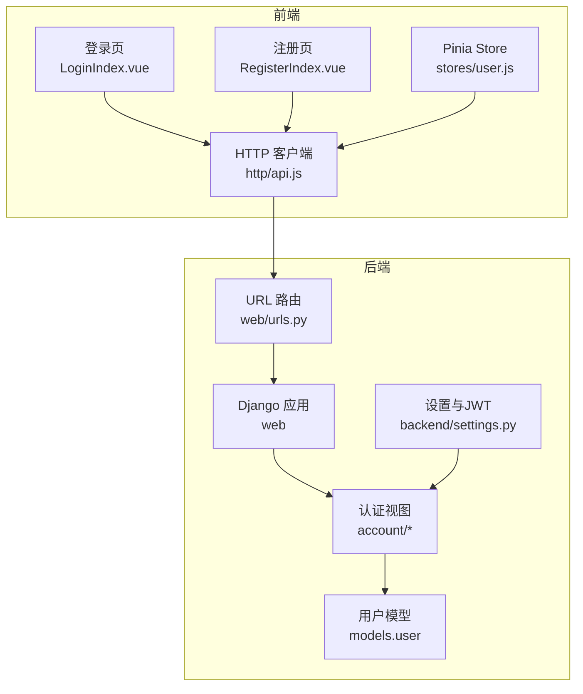

图表来源
- [backend/web/urls.py:10-23](file://backend/web/urls.py#L10-L23)
- [backend/backend/settings.py:136-151](file://backend/backend/settings.py#L136-L151)
- [frontend/src/js/http/api.js:16-27](file://frontend/src/js/http/api.js#L16-L27)
- [frontend/src/stores/user.js:4-24](file://frontend/src/stores/user.js#L4-L24)

章节来源
- [backend/web/urls.py:10-23](file://backend/web/urls.py#L10-L23)
- [backend/backend/settings.py:136-151](file://backend/backend/settings.py#L136-L151)
- [frontend/src/js/http/api.js:16-27](file://frontend/src/js/http/api.js#L16-L27)
- [frontend/src/stores/user.js:4-24](file://frontend/src/stores/user.js#L4-L24)

## 核心组件
- 用户模型与资料扩展：后端使用 Django 内置 User，并通过一对一扩展表存储头像、简介等资料。
- 认证视图：提供注册、登录、获取当前用户信息、退出登录、刷新令牌等接口。
- 前端拦截器：统一注入 Bearer Token，拦截 401 并自动刷新 access_token。
- JWT 配置：设置 access/refresh 生命周期、轮换与黑名单策略、跨域与认证类。

章节来源
- [backend/web/models/user.py:15-23](file://backend/web/models/user.py#L15-L23)
- [backend/web/views/user/account/register.py:9-46](file://backend/web/views/user/account/register.py#L9-L46)
- [backend/web/views/user/account/login.py:9-46](file://backend/web/views/user/account/login.py#L9-L46)
- [backend/web/views/user/account/get_user_info.py:8-25](file://backend/web/views/user/account/get_user_info.py#L8-L25)
- [backend/web/views/user/account/logout.py:7-16](file://backend/web/views/user/account/logout.py#L7-L16)
- [backend/web/views/user/account/refresh_token.py:7-41](file://backend/web/views/user/account/refresh_token.py#L7-L41)
- [frontend/src/js/http/api.js:46-90](file://frontend/src/js/http/api.js#L46-L90)

## 架构总览
下图展示从用户操作到后端认证与前端状态更新的整体流程。

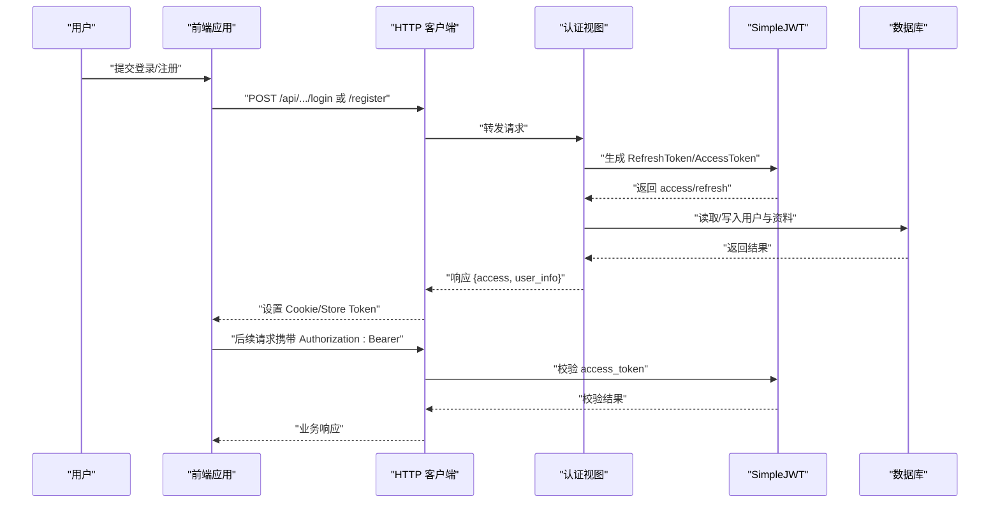

图表来源
- [backend/web/views/user/account/login.py:9-46](file://backend/web/views/user/account/login.py#L9-L46)
- [backend/web/views/user/account/register.py:9-46](file://backend/web/views/user/account/register.py#L9-L46)
- [backend/web/views/user/account/refresh_token.py:7-41](file://backend/web/views/user/account/refresh_token.py#L7-L41)
- [frontend/src/js/http/api.js:46-90](file://frontend/src/js/http/api.js#L46-L90)

## 详细组件分析

### 用户模型与资料扩展
- 用户模型：继承 Django 内置 User，确保认证与权限体系复用。
- 资料扩展：UserProfile 一对一关联 User，包含头像、简介、创建/更新时间。
- 文件映射：模型定义与迁移脚本。

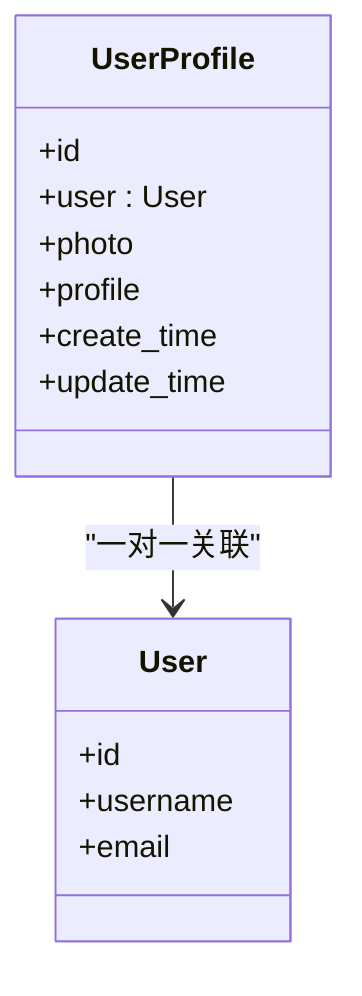

图表来源
- [backend/web/models/user.py:15-23](file://backend/web/models/user.py#L15-L23)
- [backend/web/migrations/0001_initial.py:18-29](file://backend/web/migrations/0001_initial.py#L18-L29)

章节来源
- [backend/web/models/user.py:15-23](file://backend/web/models/user.py#L15-L23)
- [backend/web/migrations/0001_initial.py:18-29](file://backend/web/migrations/0001_initial.py#L18-L29)

### 注册流程
- 输入校验：用户名/密码非空。
- 去重校验：用户名唯一。
- 创建用户：使用 Django 内置 create_user。
- 初始化资料：创建 UserProfile。
- 令牌发放：生成 RefreshToken，返回 access_token，并设置 refresh_token Cookie（httponly、sameSite、secure、7 天）。
- 返回用户资料：包含头像 URL、简介等。

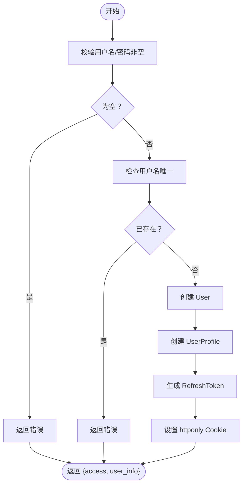

图表来源
- [backend/web/views/user/account/register.py:9-46](file://backend/web/views/user/account/register.py#L9-L46)

章节来源
- [backend/web/views/user/account/register.py:9-46](file://backend/web/views/user/account/register.py#L9-L46)

### 登录验证
- 输入校验：用户名/密码非空。
- 认证：authenticate 校验凭据。
- 成功：生成 RefreshToken，返回 access_token，并设置 refresh_token Cookie。
- 失败：返回错误提示。
- 异常：捕获系统异常并返回统一错误。

```mermaid
flowchart TD
S(["开始"]) --> V["校验输入"]
V --> VOK{"合法？"}
VOK -- 否 --> E1["返回参数错误"]
VOK -- 是 --> A["authenticate 校验"]
A --> OK{"认证通过？"}
OK -- 否 --> E2["返回凭据错误"]
OK -- 是 --> T["生成 RefreshToken"]
T --> C["设置 Cookie"]
C --> R(["返回 {access, user_info}"])
E1 --> R
E2 --> R
```

图表来源
- [backend/web/views/user/account/login.py:9-46](file://backend/web/views/user/account/login.py#L9-L46)

章节来源
- [backend/web/views/user/account/login.py:9-46](file://backend/web/views/user/account/login.py#L9-L46)

### 获取当前用户信息
- 权限：IsAuthenticated，要求已登录。
- 查询：根据 request.user 获取用户与资料。
- 返回：用户 ID、用户名、头像 URL、简介。

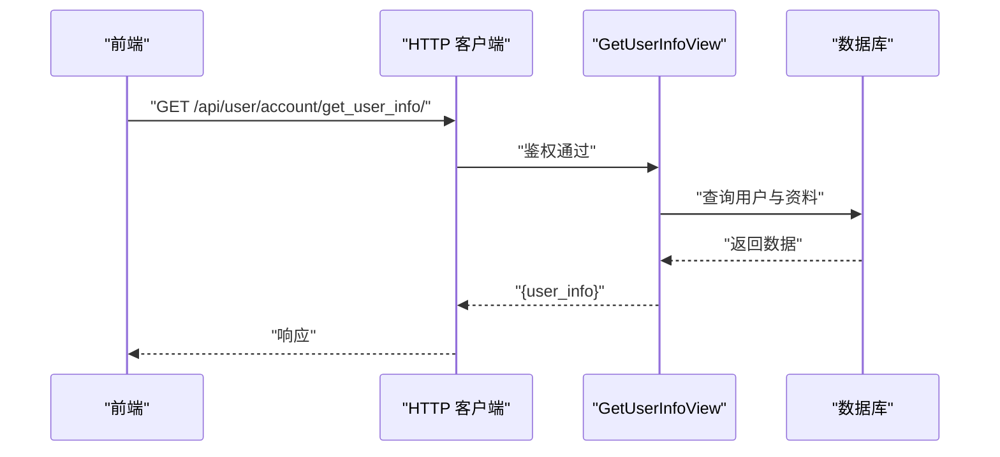

图表来源
- [backend/web/views/user/account/get_user_info.py:8-25](file://backend/web/views/user/account/get_user_info.py#L8-L25)

章节来源
- [backend/web/views/user/account/get_user_info.py:8-25](file://backend/web/views/user/account/get_user_info.py#L8-L25)

### 退出登录
- 权限：IsAuthenticated。
- 行为：清除 refresh_token Cookie，返回成功。

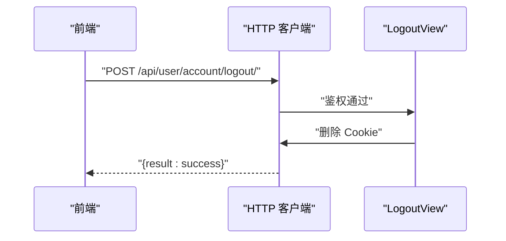

图表来源
- [backend/web/views/user/account/logout.py:7-16](file://backend/web/views/user/account/logout.py#L7-L16)

章节来源
- [backend/web/views/user/account/logout.py:7-16](file://backend/web/views/user/account/logout.py#L7-L16)

### 令牌刷新策略
- 触发条件：前端请求返回 401 且 access_token 过期。
- 刷新逻辑：从前端 Cookie 读取 refresh_token，调用刷新接口。
- 服务端行为：校验 refresh_token 是否存在与有效；若开启 ROTATE_REFRESH_TOKENS，则刷新 refresh_token 并回写 Cookie；始终返回新的 access_token。
- 异常处理：未携带或无效 refresh_token 返回 401。

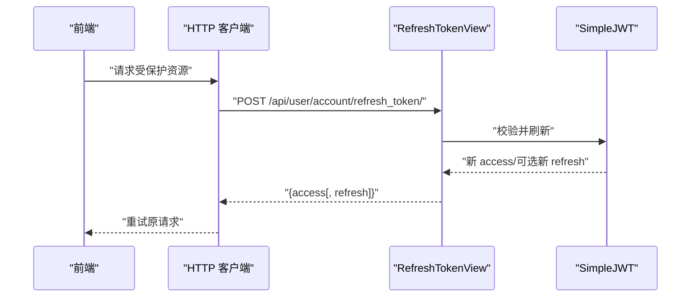

图表来源
- [backend/web/views/user/account/refresh_token.py:7-41](file://backend/web/views/user/account/refresh_token.py#L7-L41)
- [frontend/src/js/http/api.js:46-90](file://frontend/src/js/http/api.js#L46-L90)

章节来源
- [backend/web/views/user/account/refresh_token.py:7-41](file://backend/web/views/user/account/refresh_token.py#L7-L41)
- [frontend/src/js/http/api.js:46-90](file://frontend/src/js/http/api.js#L46-L90)

### 用户资料更新
- 权限：IsAuthenticated。
- 校验：用户名与简介非空；用户名唯一性。
- 可选：上传头像，旧头像清理。
- 更新：保存用户名、简介、更新时间，必要时更新头像文件。
- 返回：最新用户信息。

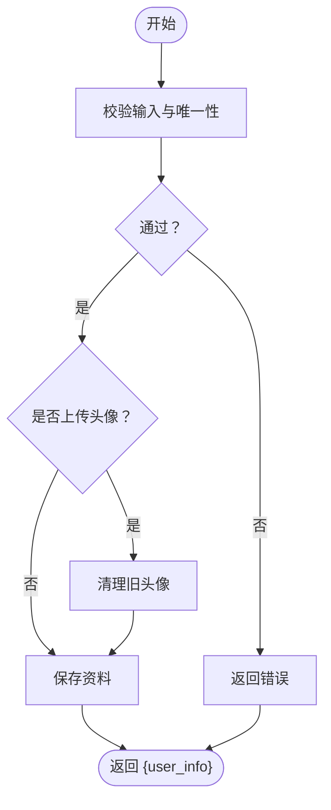

图表来源
- [backend/web/views/user/profile/update.py:12-63](file://backend/web/views/user/profile/update.py#L12-L63)

章节来源
- [backend/web/views/user/profile/update.py:12-63](file://backend/web/views/user/profile/update.py#L12-L63)

### 前端集成与拦截器
- 请求拦截：在有 access_token 时自动注入 Authorization: Bearer。
- 响应拦截：捕获 401，串行刷新 access_token，成功后重试原请求。
- 状态管理：Pinia Store 统一维护用户登录态与令牌。

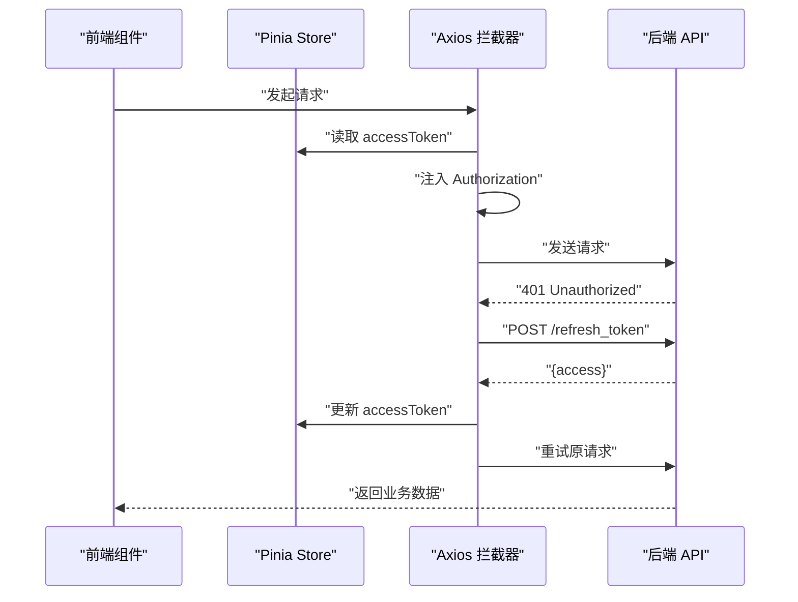

图表来源
- [frontend/src/js/http/api.js:46-90](file://frontend/src/js/http/api.js#L46-L90)
- [frontend/src/stores/user.js:4-24](file://frontend/src/stores/user.js#L4-L24)

章节来源
- [frontend/src/js/http/api.js:46-90](file://frontend/src/js/http/api.js#L46-L90)
- [frontend/src/stores/user.js:4-24](file://frontend/src/stores/user.js#L4-L24)

### 认证中间件与权限控制
- 中间件链：CORS、会话、CSRF、认证、消息、点击劫持防护。
- 认证类：REST Framework 使用 JWTAuthentication，默认认证类。
- 权限：IsAuthenticated 控制受保护接口访问。

章节来源
- [backend/backend/settings.py:45-54](file://backend/backend/settings.py#L45-L54)
- [backend/backend/settings.py:136-140](file://backend/backend/settings.py#L136-L140)
- [backend/web/views/user/account/get_user_info.py:8-10](file://backend/web/views/user/account/get_user_info.py#L8-L10)
- [backend/web/views/user/profile/update.py:12-14](file://backend/web/views/user/profile/update.py#L12-L14)

### 安全配置与黑名单机制
- JWT 生命周期：ACCESS_TOKEN_LIFETIME 2 小时，REFRESH_TOKEN_LIFETIME 7 天。
- 轮换与黑名单：开启 ROTATE_REFRESH_TOKENS 与 BLACKLIST_AFTER_ROTATION，每次刷新后使旧 refresh 失效。
- Cookie 安全：httponly、sameSite=Lax、secure（生产环境建议 HTTPS）。
- 跨域：CORS_ALLOW_CREDENTIALS 与 CORS_ALLOWED_ORIGINS。

章节来源
- [backend/backend/settings.py:142-151](file://backend/backend/settings.py#L142-L151)
- [backend/web/views/user/account/login.py:31-38](file://backend/web/views/user/account/login.py#L31-L38)
- [backend/web/views/user/account/register.py:35-41](file://backend/web/views/user/account/register.py#L35-L41)
- [backend/backend/settings.py:153-158](file://backend/backend/settings.py#L153-L158)

## 依赖分析
- 后端依赖：Django、Django REST Framework、djangorestframework-simplejwt、CORS 头部支持。
- 前端依赖：Axios、Pinia、Vue Router。
- 关键耦合点：HTTP 拦截器依赖后端路由与 Cookie；后端视图依赖 JWT 配置与模型。

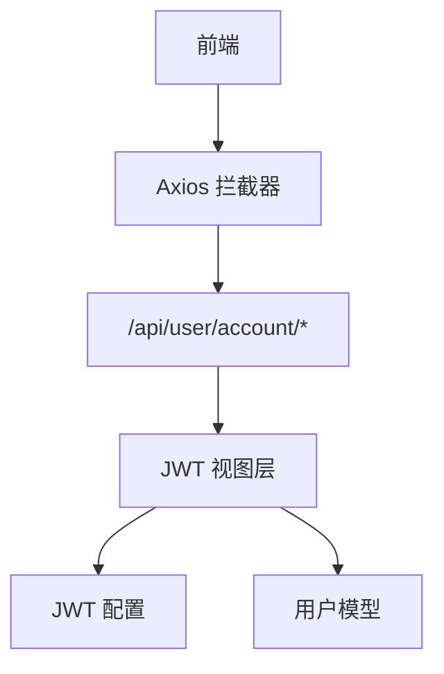

图表来源
- [frontend/src/js/http/api.js:16-27](file://frontend/src/js/http/api.js#L16-L27)
- [backend/web/urls.py:10-17](file://backend/web/urls.py#L10-L17)
- [backend/backend/settings.py:136-151](file://backend/backend/settings.py#L136-L151)
- [backend/web/models/user.py:15-23](file://backend/web/models/user.py#L15-L23)

章节来源
- [frontend/src/js/http/api.js:16-27](file://frontend/src/js/http/api.js#L16-L27)
- [backend/web/urls.py:10-17](file://backend/web/urls.py#L10-L17)
- [backend/backend/settings.py:136-151](file://backend/backend/settings.py#L136-L151)
- [backend/web/models/user.py:15-23](file://backend/web/models/user.py#L15-L23)

## 性能考虑
- 令牌生命周期：合理设置 ACCESS/REFRESH 过期时间，平衡安全性与用户体验。
- 刷新策略：启用 ROTATE_REFRESH_TOKENS 可降低长期暴露风险，但需注意并发刷新的幂等性与队列化处理。
- 前端缓存：在本地仅缓存必要信息，避免敏感数据泄露。
- 数据库访问：用户资料查询尽量一次性完成，减少 N+1 查询。

## 故障排查指南
- 401 未授权
  - 检查前端是否正确注入 Authorization 头。
  - 确认 access_token 未过期；如过期，触发刷新流程。
  - 若刷新失败，确认 refresh_token Cookie 是否存在且未过期。
- 注册/登录失败
  - 校验用户名/密码非空与唯一性。
  - 查看后端异常捕获分支，定位具体错误。
- 退出登录无效
  - 确认后端已删除 refresh_token Cookie。
  - 前端 Store 是否同步清空 accessToken。
- 资料更新异常
  - 校验用户名唯一性与简介长度限制。
  - 上传头像时检查旧头像清理逻辑。

章节来源
- [backend/web/views/user/account/login.py:14-17](file://backend/web/views/user/account/login.py#L14-L17)
- [backend/web/views/user/account/register.py:14-22](file://backend/web/views/user/account/register.py#L14-L22)
- [backend/web/views/user/account/refresh_token.py:10-14](file://backend/web/views/user/account/refresh_token.py#L10-L14)
- [frontend/src/js/http/api.js:46-90](file://frontend/src/js/http/api.js#L46-L90)

## 结论
本认证系统采用标准 JWT 流程，结合 Cookie 存储 refresh_token 与前端拦截器自动刷新 access_token，形成闭环的安全登录体验。通过模型扩展与权限控制，系统具备良好的可扩展性与安全性。建议在生产环境进一步强化 HTTPS、CSP、速率限制与审计日志。

## 附录

### 认证流程完整示例（注册）
- 前端提交注册表单，调用注册接口。
- 后端校验参数与唯一性，创建用户与资料，生成并下发 access/refresh。
- 前端保存 access_token 与用户信息，跳转首页。

章节来源
- [frontend/src/views/user/account/RegisterIndex.vue:16-45](file://frontend/src/views/user/account/RegisterIndex.vue#L16-L45)
- [backend/web/views/user/account/register.py:9-46](file://backend/web/views/user/account/register.py#L9-L46)
- [frontend/src/js/http/api.js:16-27](file://frontend/src/js/http/api.js#L16-L27)

### 认证流程完整示例（登录）
- 前端提交登录表单，调用登录接口。
- 后端校验凭据，生成并下发 access/refresh。
- 前端保存 access_token 与用户信息，跳转首页。

章节来源
- [frontend/src/views/user/account/LoginIndex.vue:15-41](file://frontend/src/views/user/account/LoginIndex.vue#L15-L41)
- [backend/web/views/user/account/login.py:9-46](file://backend/web/views/user/account/login.py#L9-L46)
- [frontend/src/js/http/api.js:16-27](file://frontend/src/js/http/api.js#L16-L27)

### 最佳实践
- 前端：始终通过拦截器注入 Authorization；对 401 进行统一刷新与重试。
- 后端：严格参数校验与异常捕获；开启 ROTATE_REFRESH_TOKENS 与 BLACKLIST_AFTER_ROTATION；使用 httponly/sameSite/secure Cookie。
- 安全：生产环境启用 HTTPS；限制 CORS 源；定期轮换密钥；记录审计日志。