# 令牌刷新视图

<cite>
**本文档引用的文件**
- [refresh_token.py](file://backend/web/views/user/account/refresh_token.py)
- [login.py](file://backend/web/views/user/account/login.py)
- [logout.py](file://backend/web/views/user/account/logout.py)
- [register.py](file://backend/web/views/user/account/register.py)
- [settings.py](file://backend/backend/settings.py)
- [urls.py](file://backend/web/urls.py)
- [api.js](file://frontend/src/js/http/api.js)
- [user.js](file://frontend/src/stores/user.js)
- [LoginIndex.vue](file://frontend/src/views/user/account/LoginIndex.vue)
- [UserMenu.vue](file://frontend/src/components/navbar/UserMenu.vue)
- [index.html](file://backend/web/templates/index.html)
</cite>

## 目录
1. [简介](#简介)
2. [项目结构](#项目结构)
3. [核心组件](#核心组件)
4. [架构概览](#架构概览)
5. [详细组件分析](#详细组件分析)
6. [依赖关系分析](#依赖关系分析)
7. [性能考虑](#性能考虑)
8. [故障排除指南](#故障排除指南)
9. [结论](#结论)
10. [附录](#附录)

## 简介

LLM_AIfriends项目的令牌刷新视图实现了基于JWT的完整认证机制，包括访问令牌和刷新令牌的管理。该系统通过Cookie存储刷新令牌，实现了透明的令牌续期功能，确保用户在7天内无需重新登录即可继续使用应用。

## 项目结构

该项目采用前后端分离架构，后端使用Django框架和Django REST Framework，前端使用Vue.js和Vite构建工具。

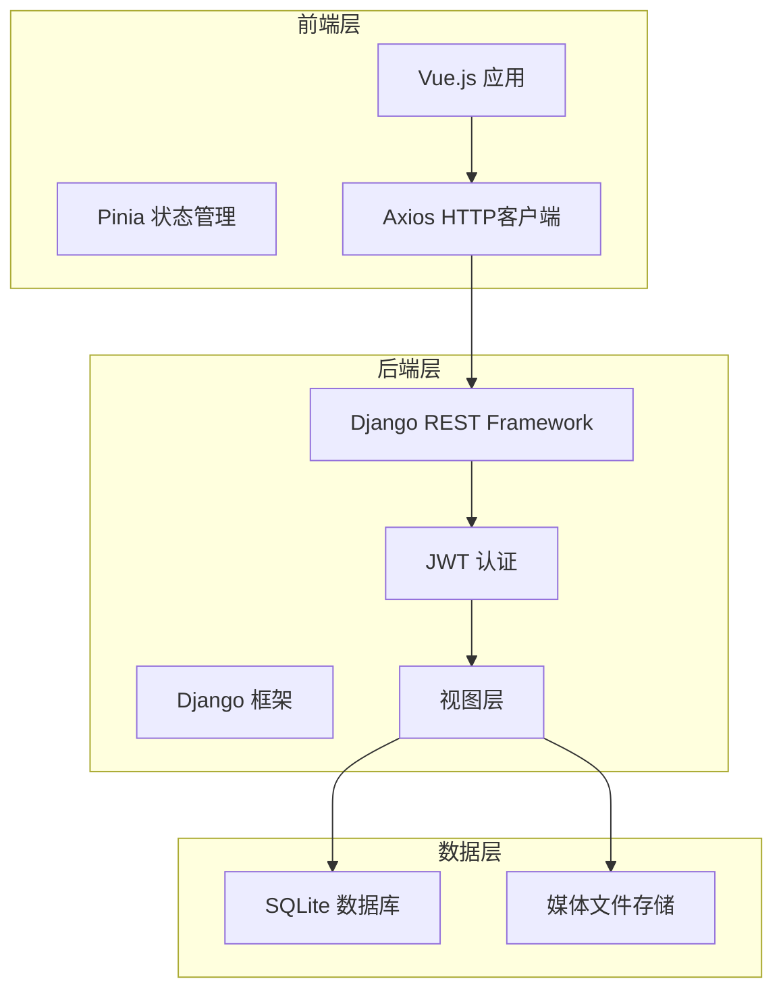

**图表来源**
- [settings.py:136-151](file://backend/backend/settings.py#L136-L151)
- [urls.py:10-23](file://backend/web/urls.py#L10-L23)

**章节来源**
- [settings.py:1-158](file://backend/backend/settings.py#L1-L158)
- [urls.py:1-24](file://backend/web/urls.py#L1-L24)

## 核心组件

### 令牌刷新视图 (RefreshTokenView)

RefreshTokenView是令牌刷新机制的核心组件，负责处理刷新令牌的验证和新访问令牌的生成。

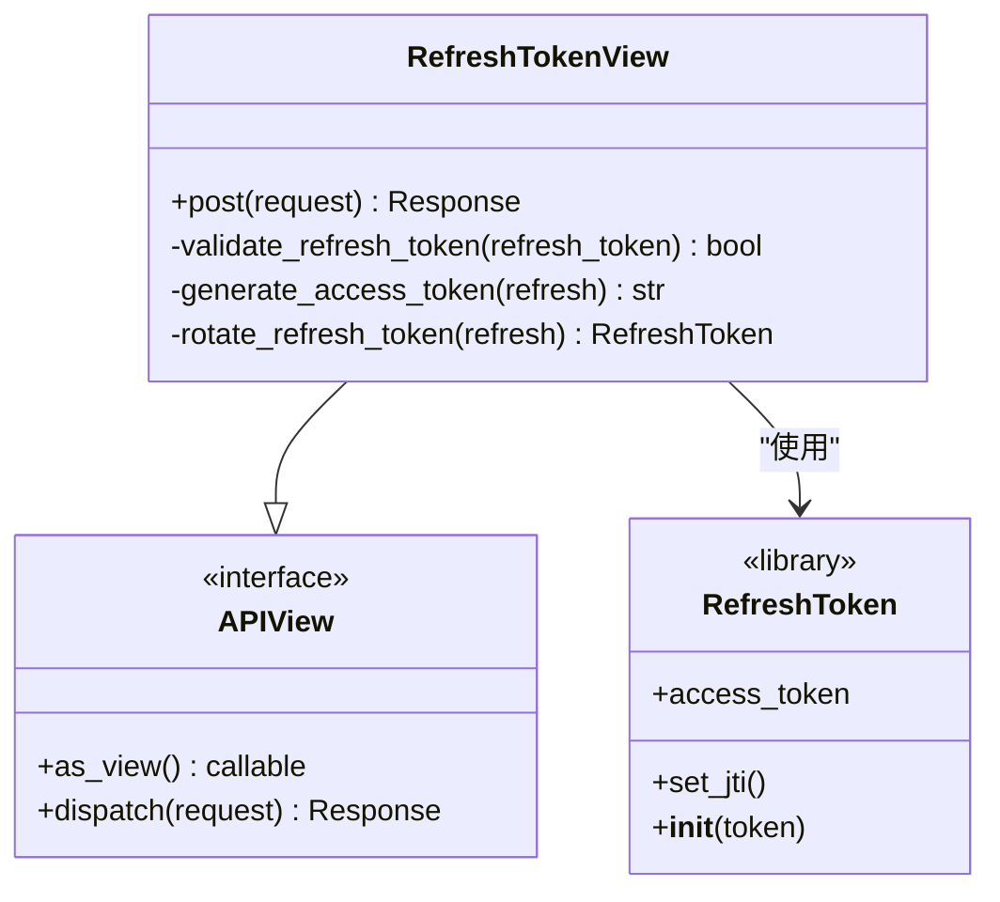

**图表来源**
- [refresh_token.py:7-41](file://backend/web/views/user/account/refresh_token.py#L7-L41)

### 前端令牌管理

前端通过Axios拦截器实现自动令牌刷新，确保用户在令牌过期时获得无缝体验。

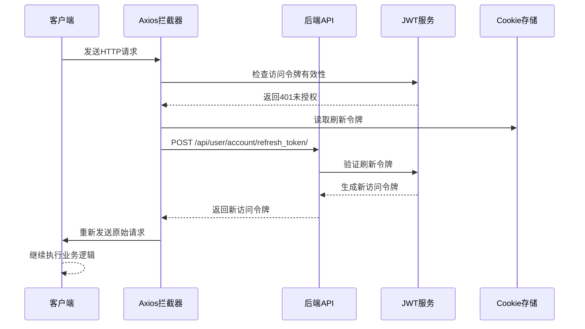

**图表来源**
- [api.js:46-90](file://frontend/src/js/http/api.js#L46-L90)
- [refresh_token.py:8-41](file://backend/web/views/user/account/refresh_token.py#L8-L41)

**章节来源**
- [refresh_token.py:1-41](file://backend/web/views/user/account/refresh_token.py#L1-L41)
- [api.js:1-92](file://frontend/src/js/http/api.js#L1-L92)

## 架构概览

系统采用分层架构设计，实现了清晰的关注点分离：

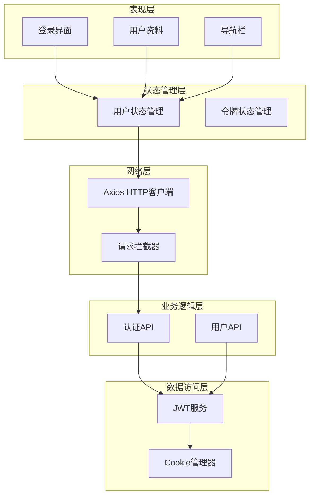

**图表来源**
- [user.js:4-59](file://frontend/src/stores/user.js#L4-L59)
- [api.js:16-27](file://frontend/src/js/http/api.js#L16-L27)

## 详细组件分析

### 令牌刷新机制实现

#### 旧令牌验证流程

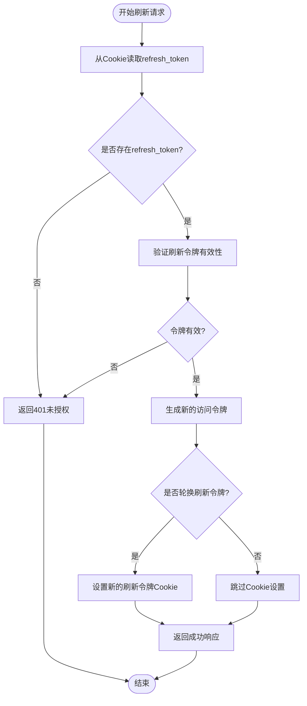

**图表来源**
- [refresh_token.py:8-41](file://backend/web/views/user/account/refresh_token.py#L8-L41)

#### 新令牌生成过程

刷新令牌验证通过后，系统会生成新的访问令牌并根据配置决定是否轮换刷新令牌：

1. **访问令牌生成**: 使用JWT库生成新的2小时有效期访问令牌
2. **刷新令牌轮换**: 当启用轮换功能时，生成新的刷新令牌并更新Cookie
3. **Cookie设置**: 设置安全的HttpOnly Cookie，防止XSS攻击

**章节来源**
- [refresh_token.py:15-36](file://backend/web/views/user/account/refresh_token.py#L15-L36)

### Cookie中refresh_token的读取和验证

#### Cookie读取机制

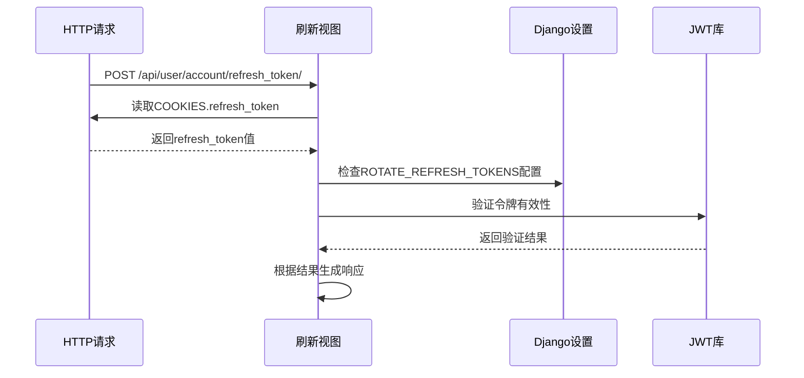

**图表来源**
- [refresh_token.py:10-15](file://backend/web/views/user/account/refresh_token.py#L10-L15)
- [settings.py:147-148](file://backend/backend/settings.py#L147-L148)

#### 验证方法详解

系统使用Django REST Framework SimpleJWT库进行令牌验证，具备以下特性：
- 自动检查令牌过期时间
- 验证令牌签名完整性
- 支持黑名单机制（当启用时）

**章节来源**
- [refresh_token.py:15-15](file://backend/web/views/user/account/refresh_token.py#L15-L15)

### RefreshToken的使用和access_token重新生成流程

#### 完整刷新流程

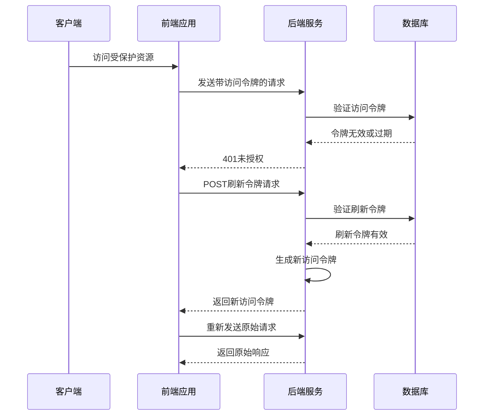

**图表来源**
- [api.js:46-90](file://frontend/src/js/http/api.js#L46-L90)
- [refresh_token.py:8-41](file://backend/web/views/user/account/refresh_token.py#L8-L41)

**章节来源**
- [api.js:46-90](file://frontend/src/js/http/api.js#L46-L90)
- [refresh_token.py:8-41](file://backend/web/views/user/account/refresh_token.py#L8-L41)

### 令牌刷新的安全机制和过期处理策略

#### 安全配置分析

系统采用了多层安全防护措施：

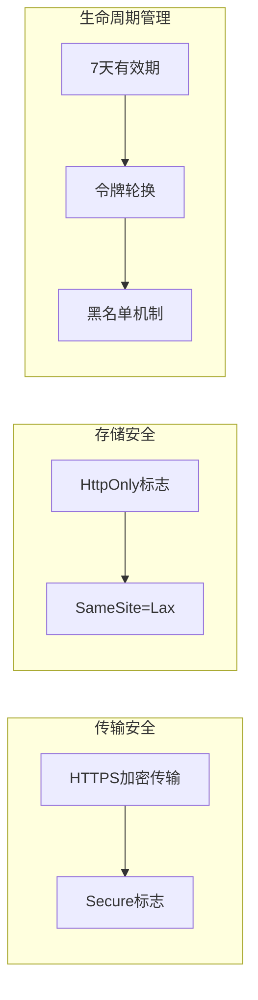

**图表来源**
- [settings.py:143-151](file://backend/backend/settings.py#L143-L151)
- [login.py:31-38](file://backend/web/views/user/account/login.py#L31-L38)

#### 过期处理策略

1. **访问令牌过期**: 2小时自动过期，触发前端自动刷新机制
2. **刷新令牌过期**: 7天有效期，支持自动续期
3. **黑名单机制**: 轮换刷新令牌时自动加入黑名单，防止重放攻击

**章节来源**
- [settings.py:144-148](file://backend/backend/settings.py#L144-L148)

### 刷新失败时的错误处理和用户体验优化

#### 错误处理流程

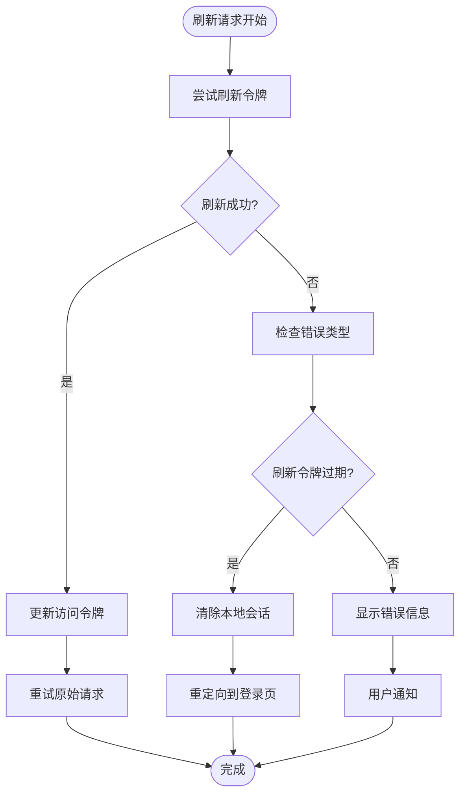

**图表来源**
- [api.js:74-84](file://frontend/src/js/http/api.js#L74-L84)

#### 用户体验优化

前端实现了智能的错误处理机制：
- **自动重试**: 成功刷新后自动重试原始请求
- **防抖处理**: 防止并发刷新请求
- **状态保持**: 刷新过程中保持用户界面响应
- **优雅降级**: 刷新失败时提供清晰的错误提示

**章节来源**
- [api.js:29-44](file://frontend/src/js/http/api.js#L29-L44)
- [api.js:74-84](file://frontend/src/js/http/api.js#L74-L84)

## 依赖关系分析

### 后端依赖关系

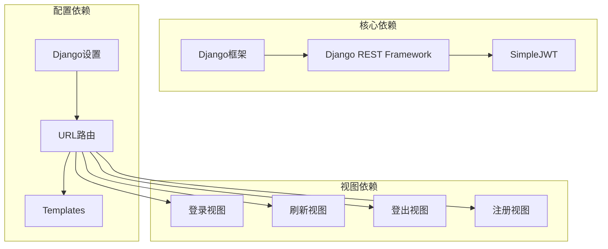

**图表来源**
- [urls.py:10-17](file://backend/web/urls.py#L10-L17)
- [settings.py:40-43](file://backend/backend/settings.py#L40-L43)

### 前端依赖关系

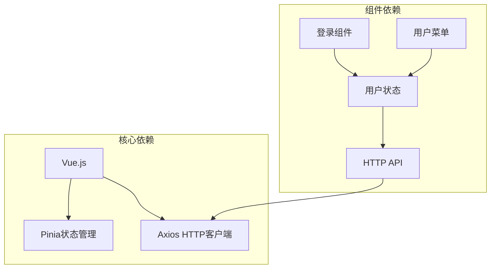

**图表来源**
- [user.js:1-59](file://frontend/src/stores/user.js#L1-L59)
- [api.js:11-19](file://frontend/src/js/http/api.js#L11-L19)

**章节来源**
- [urls.py:1-24](file://backend/web/urls.py#L1-L24)
- [user.js:1-59](file://frontend/src/stores/user.js#L1-L59)

## 性能考虑

### 令牌管理性能优化

1. **内存缓存**: 前端仅在内存中存储访问令牌，避免不必要的磁盘I/O
2. **批量处理**: 并发请求时只发起一次刷新请求，其他请求等待刷新完成
3. **延迟加载**: 仅在首次访问受保护资源时才触发刷新机制
4. **连接复用**: Axios实例复用，减少TCP连接开销

### 网络性能优化

- **Cookie传输**: 刷新令牌通过Cookie传输，避免在URL中暴露
- **请求压缩**: 启用Gzip压缩减少传输数据量
- **超时控制**: 5秒超时防止长时间阻塞

## 故障排除指南

### 常见问题及解决方案

#### 问题1: 刷新令牌不存在

**症状**: 返回401未授权，提示refresh token不存在

**原因分析**:
- 用户未登录或会话已过期
- 浏览器禁用了Cookie
- 网络代理修改了请求头

**解决方案**:
1. 确认用户已成功登录
2. 检查浏览器Cookie设置
3. 清除浏览器缓存后重试

#### 问题2: 刷新令牌过期

**症状**: 刷新请求返回401，需要重新登录

**原因分析**:
- 刷新令牌7天有效期已过
- 用户长时间未使用应用
- 服务器时间不同步

**解决方案**:
1. 引导用户重新登录
2. 检查服务器时间配置
3. 调整刷新令牌有效期设置

#### 问题3: CORS跨域问题

**症状**: 刷新请求被浏览器阻止

**原因分析**:
- 前端域名与后端配置不匹配
- CORS配置不正确
- 证书或SSL问题

**解决方案**:
1. 确认CORS_ALLOWED_ORIGINS配置
2. 检查HTTPS证书有效性
3. 验证withCredentials设置

**章节来源**
- [refresh_token.py:11-14](file://backend/web/views/user/account/refresh_token.py#L11-L14)
- [settings.py:154-158](file://backend/backend/settings.py#L154-L158)

### 调试技巧

1. **浏览器开发者工具**: 检查Network标签页中的Cookie和请求头
2. **后端日志**: 查看Django日志中的认证相关信息
3. **令牌验证**: 使用在线JWT解码工具验证令牌格式
4. **时间同步**: 确保服务器和客户端时间同步

## 结论

LLM_AIfriends项目的令牌刷新视图实现了一个健壮、安全且用户友好的认证系统。通过合理的令牌生命周期管理和智能的错误处理机制，系统能够在保证安全性的同时提供流畅的用户体验。

关键优势包括：
- **安全性**: 多层安全防护，包括HttpOnly Cookie、SameSite策略和黑名单机制
- **可用性**: 透明的令牌续期，用户无需频繁重新登录
- **可维护性**: 清晰的代码结构和完善的错误处理
- **性能**: 优化的网络请求和内存使用

## 附录

### 完整刷新请求示例

#### 请求格式
- **URL**: `/api/user/account/refresh_token/`
- **方法**: POST
- **头部**: `Content-Type: application/json`
- **Cookie**: `refresh_token=<令牌值>`
- **Body**: `{}`

#### 响应格式
- **成功响应**:
  ```json
  {
    "result": "success",
    "access": "<新的访问令牌>"
  }
  ```

- **失败响应**:
  ```json
  {
    "result": "系统异常，请稍后重试"
  }
  ```

### 最佳实践和安全考虑

#### 安全最佳实践
1. **令牌存储**: 始终使用HttpOnly Cookie存储刷新令牌
2. **传输安全**: 在生产环境中启用HTTPS和Secure标志
3. **权限控制**: 实施最小权限原则，定期轮换令牌
4. **监控告警**: 建立令牌使用监控和异常检测机制

#### 性能优化建议
1. **缓存策略**: 合理设置令牌有效期平衡安全性和性能
2. **连接池**: 配置适当的连接池大小
3. **异步处理**: 对于耗时操作使用异步处理
4. **CDN加速**: 对静态资源使用CDN加速

#### 用户体验优化
1. **加载指示**: 提供清晰的加载状态反馈
2. **错误提示**: 给用户提供明确的错误信息和解决方案
3. **自动恢复**: 实现自动重试和错误恢复机制
4. **离线支持**: 考虑离线场景下的令牌管理策略