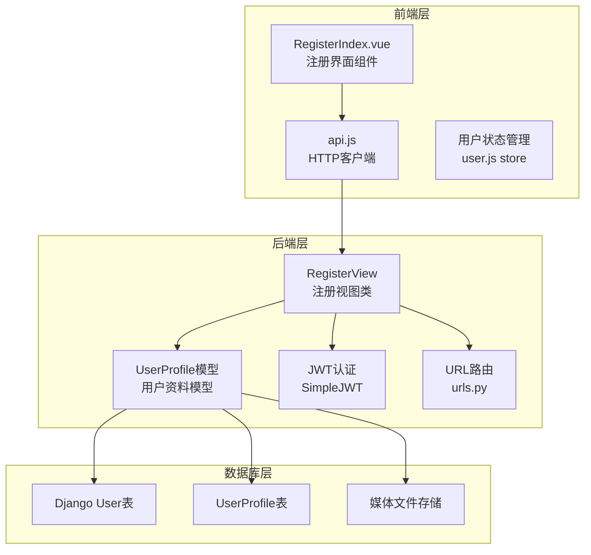
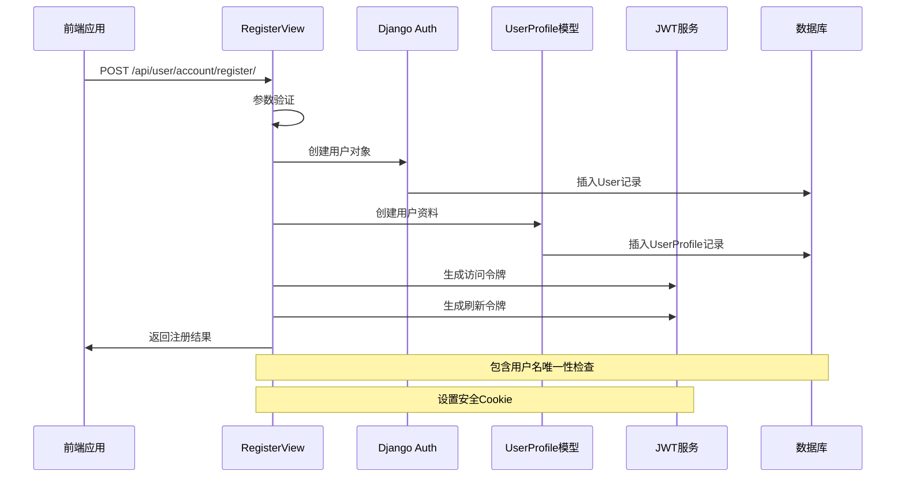
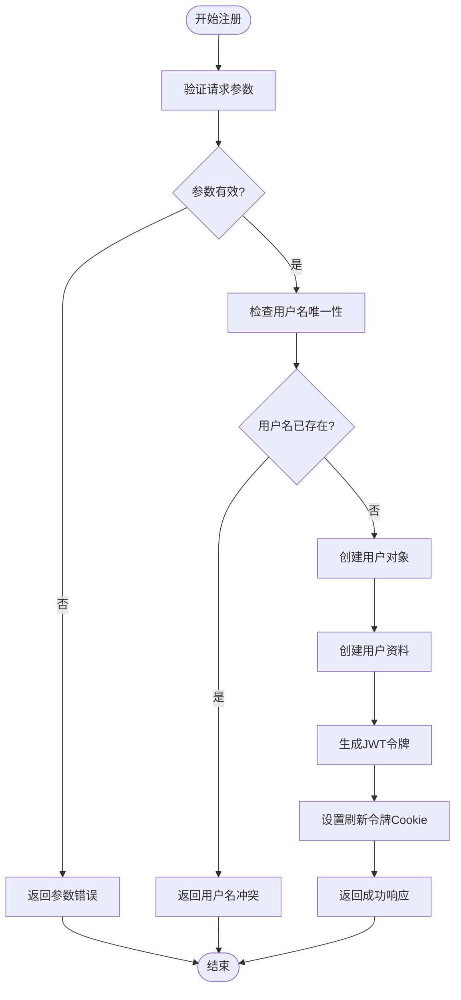
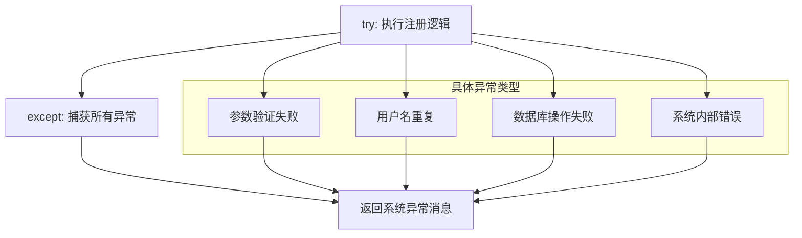
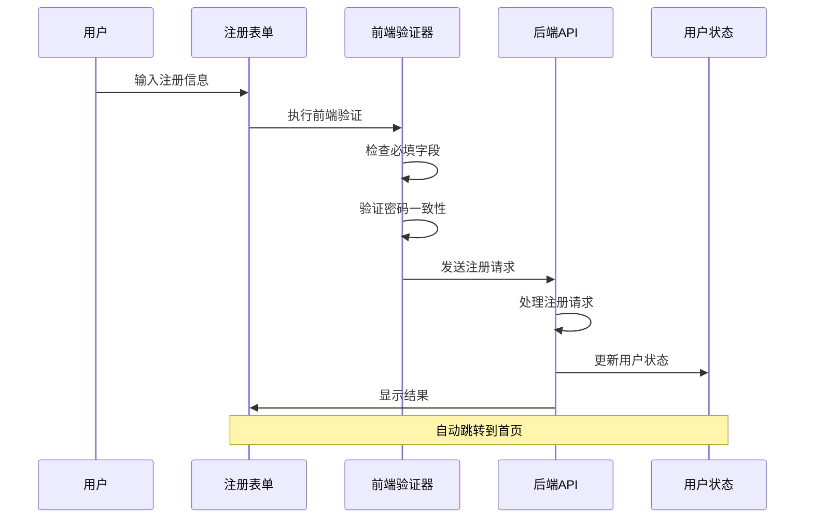
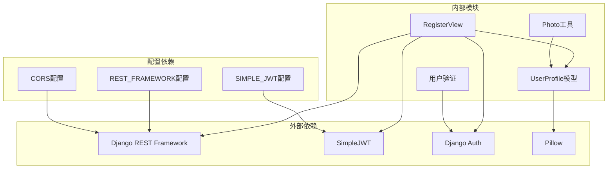
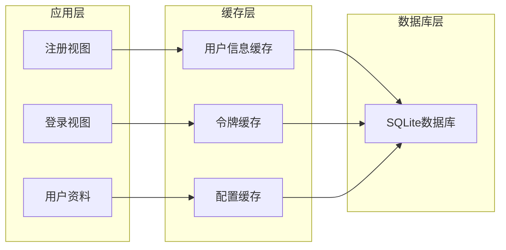
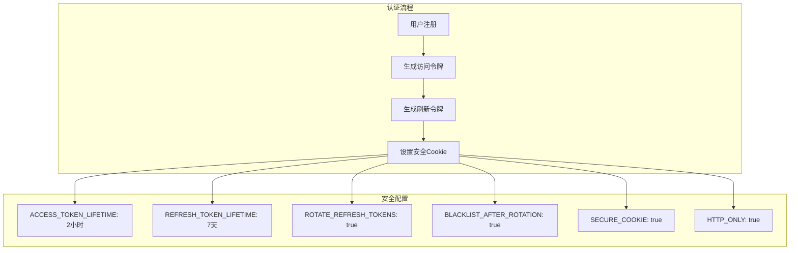

# 用户注册视图

<cite>
**本文档引用的文件**
- [register.py](file://backend/web/views/user/account/register.py)
- [user.py](file://backend/web/models/user.py)
- [login.py](file://backend/web/views/user/account/login.py)
- [RegisterIndex.vue](file://frontend/src/views/user/account/RegisterIndex.vue)
- [urls.py](file://backend/web/urls.py)
- [settings.py](file://backend/backend/settings.py)
- [get_user_info.py](file://backend/web/views/user/account/get_user_info.py)
- [update.py](file://backend/web/views/user/profile/update.py)
- [photo.py](file://backend/web/views/utils/photo.py)
- [index.html](file://backend/web/templates/index.html)
</cite>

## 目录
1. [简介](#简介)
2. [项目结构](#项目结构)
3. [核心组件](#核心组件)
4. [架构概览](#架构概览)
5. [详细组件分析](#详细组件分析)
6. [依赖关系分析](#依赖关系分析)
7. [性能考虑](#性能考虑)
8. [故障排除指南](#故障排除指南)
9. [安全考虑与最佳实践](#安全考虑与最佳实践)
10. [结论](#结论)

## 简介

LLM_AIfriends项目的用户注册视图是一个基于Django REST Framework构建的API接口，负责处理新用户的注册请求。该组件实现了完整的用户注册流程，包括用户创建、密码加密、默认资料初始化、数据验证和异常处理等功能。注册成功后，系统会返回JWT访问令牌和用户基本信息，并通过HTTP Cookie存储刷新令牌。

## 项目结构

用户注册功能涉及前后端分离的架构设计，主要包含以下关键组件：



**图表来源**
- [register.py:9-46](file://backend/web/views/user/account/register.py#L9-L46)
- [user.py:15-23](file://backend/web/models/user.py#L15-L23)
- [urls.py:10-23](file://backend/web/urls.py#L10-L23)

**章节来源**
- [register.py:1-46](file://backend/web/views/user/account/register.py#L1-L46)
- [user.py:1-23](file://backend/web/models/user.py#L1-L23)
- [urls.py:1-24](file://backend/web/urls.py#L1-L24)

## 核心组件

### 注册视图类 (RegisterView)

注册视图类是整个注册流程的核心控制器，继承自Django REST Framework的APIView基类。该类实现了POST方法来处理注册请求，包含完整的业务逻辑和错误处理机制。

**主要职责：**
- 接收和验证注册请求参数
- 创建Django User对象
- 初始化用户资料模型
- 生成JWT访问令牌
- 设置安全的HTTP Cookie

### 用户资料模型 (UserProfile)

用户资料模型是用户注册后自动创建的关联模型，包含用户的基本信息和配置选项。该模型与Django内置的User模型建立一对一关系。

**核心字段：**
- `user`: 外键关联到Django User模型
- `photo`: 用户头像，默认使用默认头像
- `profile`: 用户简介，默认值为"谢谢你的关注"
- `create_time`: 创建时间，默认为当前时间
- `update_time`: 更新时间，默认为当前时间

**章节来源**
- [register.py:9-46](file://backend/web/views/user/account/register.py#L9-L46)
- [user.py:15-23](file://backend/web/models/user.py#L15-L23)

## 架构概览

用户注册系统的整体架构采用分层设计，确保了良好的可维护性和扩展性：



**图表来源**
- [register.py:10-42](file://backend/web/views/user/account/register.py#L10-L42)
- [login.py:20-39](file://backend/web/views/user/account/login.py#L20-L39)

## 详细组件分析

### 注册流程实现

注册流程严格按照预定义的步骤执行，确保每个环节都有适当的验证和错误处理：



**图表来源**
- [register.py:11-42](file://backend/web/views/user/account/register.py#L11-L42)

#### 参数验证机制

注册视图实现了多层次的参数验证：

1. **基本参数检查**：确保用户名和密码都不为空
2. **唯一性检查**：验证用户名在数据库中不存在
3. **类型安全**：对输入进行字符串处理和清理

#### 密码加密处理

系统使用Django内置的用户认证框架自动处理密码加密。当调用`create_user`方法时，Django会自动：
- 生成随机盐值
- 应用哈希算法
- 存储加密后的密码

#### 默认资料初始化

用户注册后，系统会自动创建对应的用户资料记录，包含以下默认值：
- 头像：`user/photos/default.png`
- 简介：`谢谢你的关注`
- 创建时间：当前时间
- 更新时间：当前时间

**章节来源**
- [register.py:10-46](file://backend/web/views/user/account/register.py#L10-L46)
- [user.py:15-23](file://backend/web/models/user.py#L15-L23)

### 响应格式设计

注册成功后的响应包含以下关键信息：

| 字段 | 类型 | 描述 | 示例值 |
|------|------|------|--------|
| `result` | string | 操作结果状态 | `"success"` |
| `access` | string | JWT访问令牌 | `"eyJhbGciOiJI..."` |
| `user_id` | integer | 用户唯一标识符 | `123` |
| `username` | string | 用户名 | `"john_doe"` |
| `photo` | string | 用户头像URL | `"http://127.0.0.1:8000/media/user/photos/default.png"` |
| `profile` | string | 用户简介 | `"谢谢你的关注"` |

#### 错误响应格式

系统支持多种错误场景，统一使用以下格式：
```json
{
    "result": "具体的错误描述信息"
}
```

**章节来源**
- [register.py:27-34](file://backend/web/views/user/account/register.py#L27-L34)

### 异常处理策略

注册视图采用了全面的异常处理机制：



**图表来源**
- [register.py:43-46](file://backend/web/views/user/account/register.py#L43-L46)

**章节来源**
- [register.py:14-17](file://backend/web/views/user/account/register.py#L14-L17)
- [register.py:19-22](file://backend/web/views/user/account/register.py#L19-L22)
- [register.py:43-46](file://backend/web/views/user/account/register.py#L43-L46)

### 前端集成实现

前端注册界面提供了完整的用户交互体验：



**图表来源**
- [RegisterIndex.vue:16-45](file://frontend/src/views/user/account/RegisterIndex.vue#L16-L45)

**章节来源**
- [RegisterIndex.vue:16-45](file://frontend/src/views/user/account/RegisterIndex.vue#L16-L45)

## 依赖关系分析

用户注册功能涉及多个组件之间的复杂依赖关系：



**图表来源**
- [settings.py:136-151](file://backend/backend/settings.py#L136-L151)
- [register.py:1-6](file://backend/web/views/user/account/register.py#L1-L6)

**章节来源**
- [settings.py:136-151](file://backend/backend/settings.py#L136-L151)
- [register.py:1-6](file://backend/web/views/user/account/register.py#L1-L6)

## 性能考虑

### 数据库优化

1. **索引策略**：用户名字段应该建立唯一索引以提高查询性能
2. **批量操作**：注册流程包含两次数据库写入操作，需要考虑事务处理
3. **缓存策略**：可以考虑缓存热门用户信息减少数据库压力

### 缓存机制



### 并发处理

系统需要考虑并发注册场景：
- 使用数据库事务确保数据一致性
- 实现乐观锁避免竞态条件
- 考虑分布式锁解决高并发问题

## 故障排除指南

### 常见错误及解决方案

| 错误类型 | 错误代码 | 可能原因 | 解决方案 |
|----------|----------|----------|----------|
| 参数验证失败 | 400 Bad Request | 用户名或密码为空 | 检查前端表单验证 |
| 用户名重复 | 409 Conflict | 用户名已被占用 | 提示用户更换用户名 |
| 数据库连接失败 | 500 Internal Server Error | 数据库服务不可用 | 检查数据库连接配置 |
| JWT生成失败 | 500 Internal Server Error | JWT配置错误 | 验证JWT密钥和算法 |
| 文件上传失败 | 413 Payload Too Large | 头像文件过大 | 检查文件大小限制 |

### 调试技巧

1. **日志记录**：启用详细的服务器日志输出
2. **网络监控**：使用浏览器开发者工具监控API请求
3. **数据库调试**：通过Django shell验证数据完整性
4. **配置验证**：定期检查JWT和CORS配置

**章节来源**
- [register.py:14-17](file://backend/web/views/user/account/register.py#L14-L17)
- [register.py:19-22](file://backend/web/views/user/account/register.py#L19-L22)
- [register.py:43-46](file://backend/web/views/user/account/register.py#L43-L46)

## 安全考虑与最佳实践

### 认证与授权

系统采用JWT（JSON Web Token）进行身份认证，具有以下安全特性：



**图表来源**
- [settings.py:143-151](file://backend/backend/settings.py#L143-L151)

### 最佳实践建议

1. **密码安全**
   - 使用强密码策略
   - 定期更新密码
   - 实施密码复杂度要求

2. **会话管理**
   - 合理设置令牌有效期
   - 实施令牌轮换机制
   - 建立令牌黑名单

3. **输入验证**
   - 前后端双重验证
   - SQL注入防护
   - XSS攻击防护

4. **文件上传安全**
   - 限制文件类型和大小
   - 实施文件扫描
   - 清理临时文件

5. **日志审计**
   - 记录重要操作
   - 监控异常行为
   - 定期安全审查

### CORS配置

系统配置了严格的跨域策略：
- 允许特定源访问
- 支持凭据传输
- 限制HTTP方法
- 控制暴露头部

**章节来源**
- [settings.py:154-158](file://backend/backend/settings.py#L154-L158)
- [register.py:35-41](file://backend/web/views/user/account/register.py#L35-L41)

## 结论

LLM_AIfriends项目的用户注册视图实现了一个完整、安全且高效的用户注册系统。该系统具备以下特点：

1. **完整的功能实现**：从参数验证到数据持久化，覆盖了注册流程的所有环节
2. **强大的安全保障**：采用JWT认证、HTTPS传输和严格的数据验证
3. **良好的用户体验**：前后端分离的设计提供了流畅的交互体验
4. **可扩展的架构**：模块化的组件设计便于后续功能扩展

通过遵循本文档的安全建议和最佳实践，可以进一步提升系统的安全性、性能和可靠性。建议在生产环境中实施更严格的输入验证、增加速率限制、部署监控系统，并定期进行安全审计。