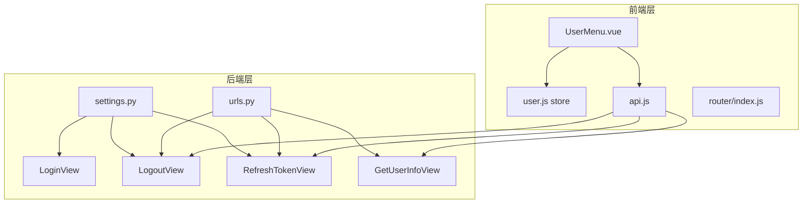
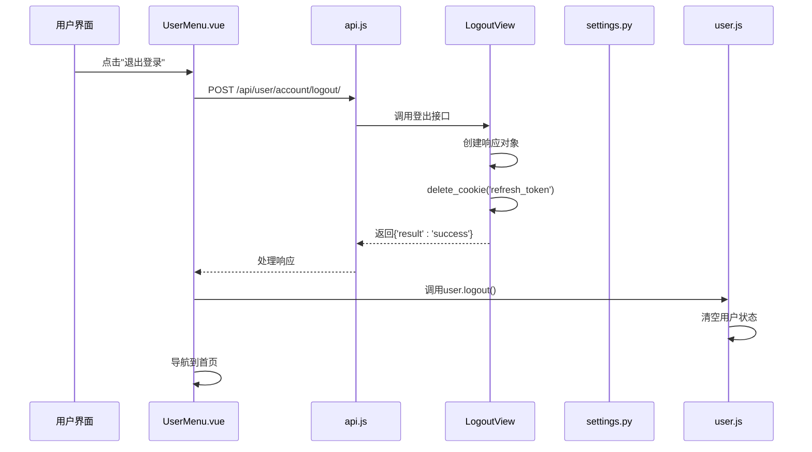
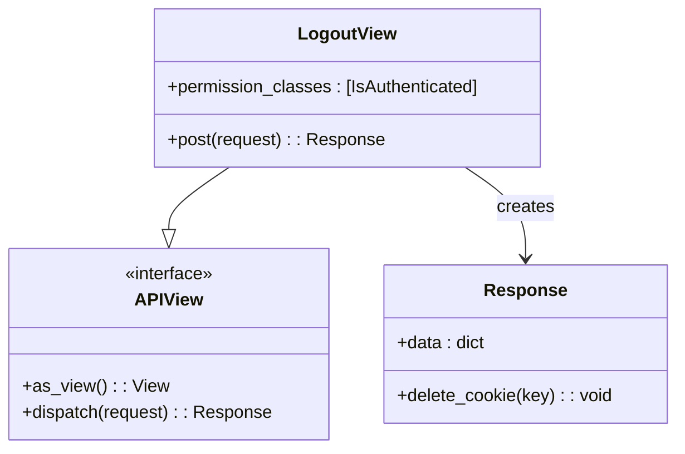
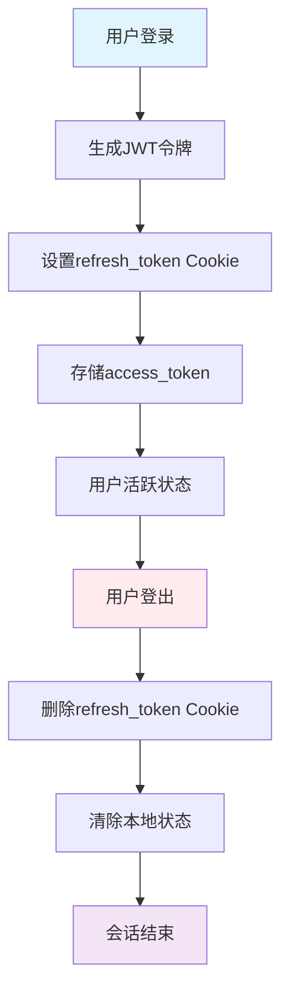
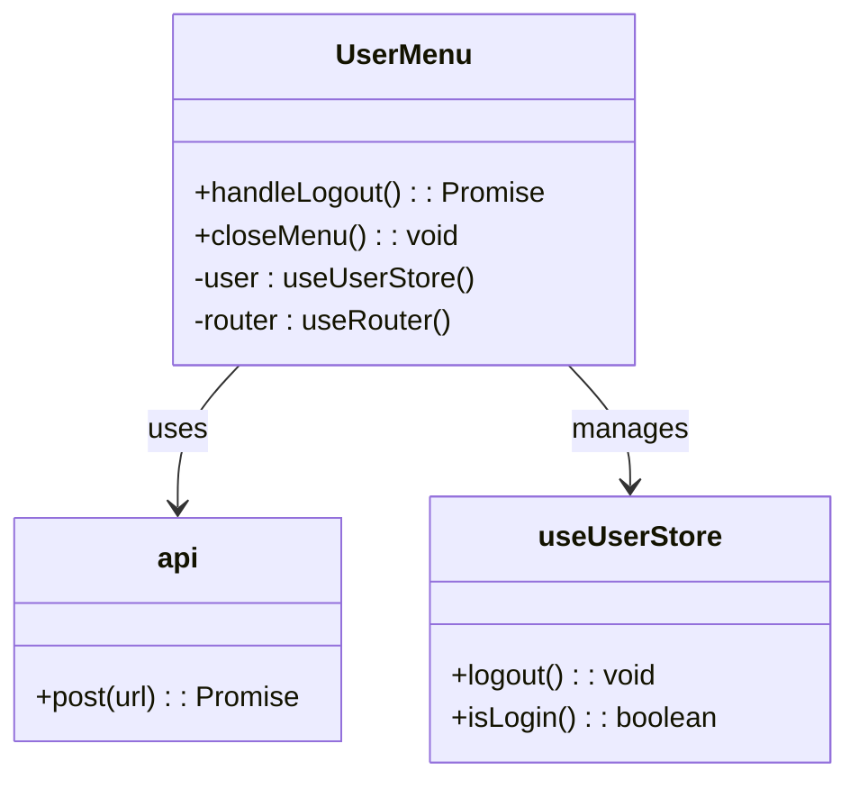
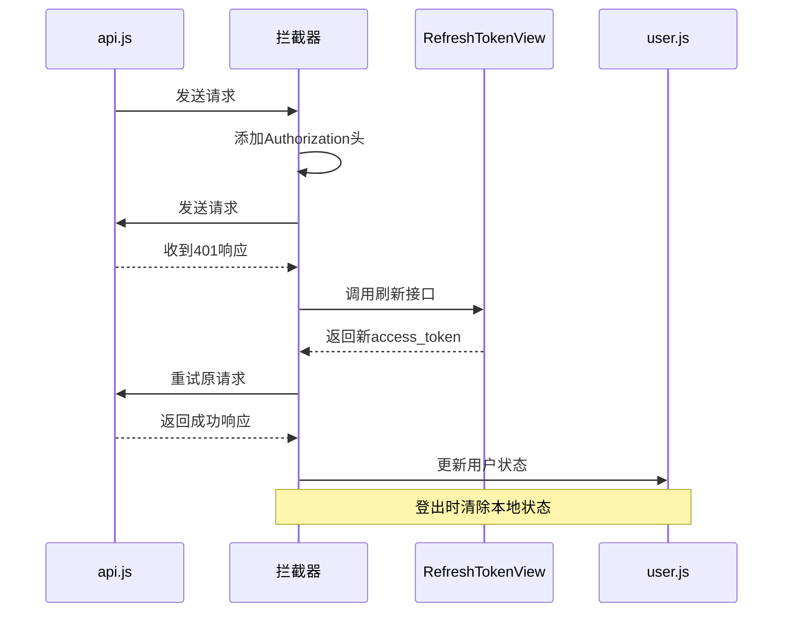
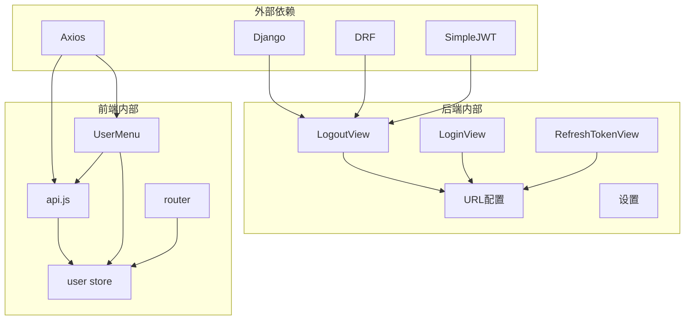

# 用户登出视图

<cite>
**本文档引用的文件**
- [logout.py](file://backend/web/views/user/account/logout.py)
- [login.py](file://backend/web/views/user/account/login.py)
- [refresh_token.py](file://backend/web/views/user/account/refresh_token.py)
- [get_user_info.py](file://backend/web/views/user/account/get_user_info.py)
- [urls.py](file://backend/web/urls.py)
- [settings.py](file://backend/backend/settings.py)
- [user.js](file://frontend/src/stores/user.js)
- [UserMenu.vue](file://frontend/src/components/navbar/UserMenu.vue)
- [api.js](file://frontend/src/js/http/api.js)
- [index.js](file://frontend/src/router/index.js)
</cite>

## 目录
1. [简介](#简介)
2. [项目结构](#项目结构)
3. [核心组件](#核心组件)
4. [架构概览](#架构概览)
5. [详细组件分析](#详细组件分析)
6. [依赖关系分析](#依赖关系分析)
7. [性能考虑](#性能考虑)
8. [故障排除指南](#故障排除指南)
9. [结论](#结论)

## 简介

用户登出视图是LLM_AIfriends项目中负责处理用户会话终止的核心功能模块。该功能实现了基于JWT令牌的完整登出流程，包括会话清理、令牌失效处理、Cookie清除策略以及安全配置。本文档将深入分析登出功能的实现细节，解释其与认证系统的协调工作机制，并提供完整的使用指南和最佳实践建议。

## 项目结构

LLM_AIfriends项目采用前后端分离架构，用户登出功能涉及以下关键组件：

**图表来源**
- [UserMenu.vue:1-81](file://frontend/src/components/navbar/UserMenu.vue#L1-L81)
- [logout.py:1-16](file://backend/web/views/user/account/logout.py#L1-L16)
- [urls.py:1-24](file://backend/web/urls.py#L1-L24)

**章节来源**
- [urls.py:1-24](file://backend/web/urls.py#L1-L24)
- [settings.py:133-151](file://backend/backend/settings.py#L133-L151)

## 核心组件

用户登出功能由多个核心组件协同工作，形成完整的会话管理解决方案：

### 后端组件

1. **LogoutView** - 登出视图类，继承自APIView
2. **LoginView** - 登录视图类，负责生成JWT令牌和设置Cookie
3. **RefreshTokenView** - 令牌刷新视图类，处理访问令牌续期
4. **GetUserInfoView** - 用户信息获取视图类，验证用户身份

### 前端组件

1. **UserMenu.vue** - 用户菜单组件，提供登出按钮
2. **user.js** - Pinia状态管理store，管理用户登录状态
3. **api.js** - Axios封装，处理HTTP请求和认证拦截器
4. **router/index.js** - Vue Router配置，实现路由守卫

**章节来源**
- [logout.py:7-16](file://backend/web/views/user/account/logout.py#L7-L16)
- [login.py:9-46](file://backend/web/views/user/account/login.py#L9-L46)
- [refresh_token.py:7-41](file://backend/web/views/user/account/refresh_token.py#L7-L41)
- [user.js:1-59](file://frontend/src/stores/user.js#L1-L59)

## 架构概览

用户登出系统采用JWT（JSON Web Token）认证机制，结合Cookie存储刷新令牌，实现安全的会话管理：

**图表来源**
- [UserMenu.vue:18-31](file://frontend/src/components/navbar/UserMenu.vue#L18-L31)
- [logout.py:10-16](file://backend/web/views/user/account/logout.py#L10-L16)
- [user.js:33-39](file://frontend/src/stores/user.js#L33-L39)

## 详细组件分析

### LogoutView 组件分析

LogoutView是登出功能的核心实现，采用简洁而高效的设计模式：

**图表来源**
- [logout.py:7-16](file://backend/web/views/user/account/logout.py#L7-L16)

#### 登出流程实现

LogoutView的实现遵循最小化原则，仅包含必要的逻辑：

1. **权限验证**：强制要求用户已登录（IsAuthenticated）
2. **响应构建**：创建标准响应格式
3. **Cookie清理**：删除refresh_token Cookie
4. **状态返回**：返回成功状态

#### 安全配置分析

登出过程中的安全考虑体现在多个层面：

- **权限控制**：通过IsAuthenticated确保只有已认证用户可以执行登出操作
- **Cookie策略**：删除refresh_token Cookie，使后续访问令牌失效
- **响应格式**：标准化的JSON响应格式，便于前端处理

**章节来源**
- [logout.py:7-16](file://backend/web/views/user/account/logout.py#L7-L16)

### 登录与登出的协调机制

登录和登出功能形成了完整的会话生命周期管理：

**图表来源**
- [login.py:31-38](file://backend/web/views/user/account/login.py#L31-L38)
- [logout.py:14-16](file://backend/web/views/user/account/logout.py#L14-L16)

#### Cookie管理策略

系统采用分层的Cookie管理策略：

1. **refresh_token Cookie**：
   - httponly: True（防止XSS攻击）
   - secure: True（HTTPS传输）
   - samesite: 'Lax'（跨站请求保护）
   - max_age: 7天（长期有效）

2. **登出时的Cookie处理**：
   - 删除refresh_token Cookie
   - 使所有关联的访问令牌失效

**章节来源**
- [login.py:31-38](file://backend/web/views/user/account/login.py#L31-L38)
- [refresh_token.py:25-31](file://backend/web/views/user/account/refresh_token.py#L25-L31)

### 前端集成组件

#### UserMenu.vue 组件

UserMenu.vue提供了直观的用户界面，集成了登出功能：

**图表来源**
- [UserMenu.vue:1-81](file://frontend/src/components/navbar/UserMenu.vue#L1-L81)

#### 用户状态管理

user.js store负责管理用户登录状态：

- **状态属性**：id、username、photo、profile、accessToken
- **方法**：isLogin()、setAccessToken()、setUserInfo()、logout()
- **登录状态检测**：基于accessToken的存在性判断

**章节来源**
- [UserMenu.vue:18-31](file://frontend/src/components/navbar/UserMenu.vue#L18-L31)
- [user.js:33-39](file://frontend/src/stores/user.js#L33-L39)

### 认证拦截器机制

api.js中的Axios拦截器提供了完整的认证管理：

**图表来源**
- [api.js:46-89](file://frontend/src/js/http/api.js#L46-L89)
- [refresh_token.py:8-41](file://backend/web/views/user/account/refresh_token.py#L8-L41)

**章节来源**
- [api.js:1-92](file://frontend/src/js/http/api.js#L1-L92)

## 依赖关系分析

用户登出功能的依赖关系体现了清晰的分层架构：

**图表来源**
- [settings.py:133-151](file://backend/backend/settings.py#L133-L151)
- [urls.py:1-24](file://backend/web/urls.py#L1-L24)

### 关键依赖关系

1. **认证依赖**：LogoutView依赖IsAuthenticated权限类
2. **Cookie依赖**：依赖Django的Response.delete_cookie方法
3. **前端状态依赖**：依赖Pinia状态管理
4. **路由依赖**：依赖Vue Router进行页面导航

**章节来源**
- [settings.py:133-151](file://backend/backend/settings.py#L133-L151)
- [urls.py:10-16](file://backend/web/urls.py#L10-L16)

## 性能考虑

用户登出功能在设计时充分考虑了性能和用户体验：

### 会话清理效率

- **即时生效**：登出操作立即删除refresh_token Cookie
- **内存清理**：前端store同步清除用户状态
- **资源释放**：避免内存泄漏和不必要的资源占用

### 缓存策略

- **短期缓存**：access_token具有2小时有效期
- **长期存储**：refresh_token具有7天有效期
- **自动续期**：用户在7天内活动可自动延长有效期

### 错误处理优化

- **快速失败**：登出操作失败时立即返回错误
- **状态回滚**：确保登出失败时不影响现有状态
- **用户反馈**：提供清晰的错误信息和处理建议

## 故障排除指南

### 常见问题及解决方案

#### 登出后仍显示登录状态

**问题描述**：用户点击登出后，界面仍显示已登录状态

**可能原因**：
1. 前端store未正确更新
2. Cookie未被删除
3. 页面未正确刷新

**解决方案**：
1. 检查user.js中的logout()方法
2. 验证Cookie删除操作
3. 确保页面导航到首页

#### 登出接口返回错误

**问题描述**：POST /api/user/account/logout/ 返回错误

**可能原因**：
1. 用户未登录
2. 权限配置问题
3. 服务器异常

**解决方案**：
1. 确认用户已登录状态
2. 检查IsAuthenticated权限设置
3. 查看服务器日志

#### Cookie删除失败

**问题描述**：refresh_token Cookie未被删除

**可能原因**：
1. Cookie域设置问题
2. 跨域配置问题
3. 浏览器安全策略

**解决方案**：
1. 检查CORS配置
2. 验证Cookie域设置
3. 测试不同浏览器兼容性

**章节来源**
- [logout.py:10-16](file://backend/web/views/user/account/logout.py#L10-L16)
- [user.js:33-39](file://frontend/src/stores/user.js#L33-L39)

### 用户体验优化建议

1. **加载指示器**：在登出过程中显示加载状态
2. **确认对话框**：提供登出确认功能
3. **自动重定向**：登出后自动跳转到首页
4. **错误提示**：提供友好的错误信息
5. **状态保持**：在登出前保存重要用户数据

## 结论

LLM_AIfriends项目的用户登出视图功能展现了现代Web应用会话管理的最佳实践。通过JWT认证、Cookie管理、前端状态同步和完善的错误处理机制，系统实现了安全、高效的用户登出流程。

### 主要优势

1. **安全性**：采用httonly、secure等安全配置
2. **易用性**：简洁的API接口和标准响应格式
3. **可靠性**：完善的错误处理和状态管理
4. **扩展性**：模块化的架构设计便于功能扩展

### 技术亮点

- 基于JWT的无状态认证机制
- 分层的Cookie管理策略
- 前后端协同的状态同步
- 完善的路由守卫机制

该实现为类似项目提供了优秀的参考模板，展示了如何在保证安全性的前提下，提供流畅的用户体验。