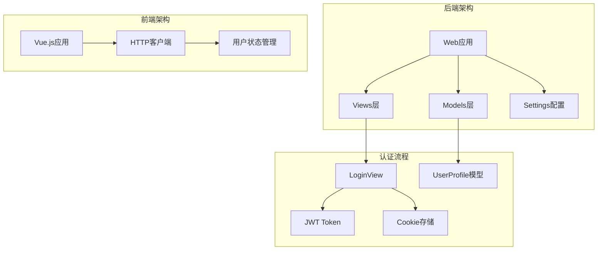
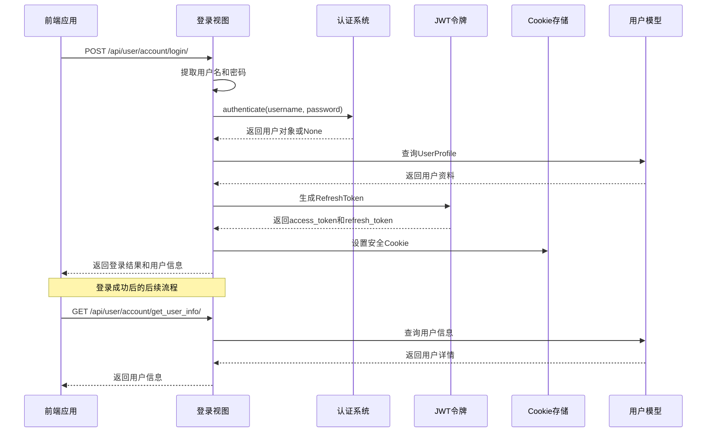
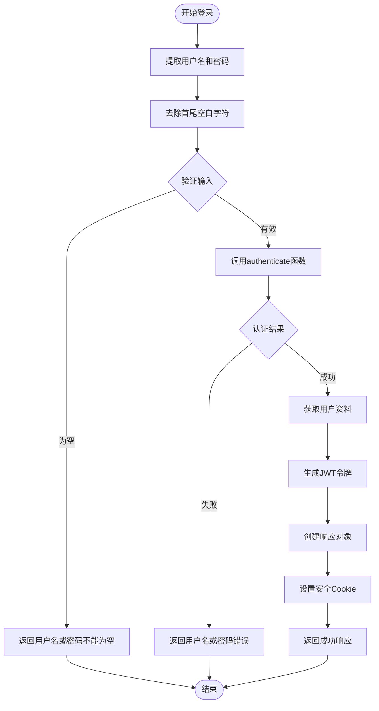
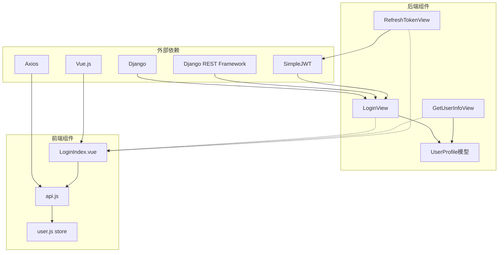

# 用户登录视图

<cite>
**本文档引用的文件**
- [login.py](file://backend/web/views/user/account/login.py)
- [user.py](file://backend/web/models/user.py)
- [get_user_info.py](file://backend/web/views/user/account/get_user_info.py)
- [refresh_token.py](file://backend/web/views/user/account/refresh_token.py)
- [settings.py](file://backend/backend/settings.py)
- [api.js](file://frontend/src/js/http/api.js)
- [LoginIndex.vue](file://frontend/src/views/user/account/LoginIndex.vue)
- [urls.py](file://backend/web/urls.py)
</cite>

## 目录
1. [简介](#简介)
2. [项目结构](#项目结构)
3. [核心组件](#核心组件)
4. [架构概览](#架构概览)
5. [详细组件分析](#详细组件分析)
6. [依赖关系分析](#依赖关系分析)
7. [性能考虑](#性能考虑)
8. [故障排除指南](#故障排除指南)
9. [结论](#结论)

## 简介

LLM_AIfriends项目的用户登录视图实现了基于JWT的认证机制，提供了完整的用户身份验证流程。本文档深入分析LoginView类的实现逻辑，详细说明用户名和密码的提取与验证过程，解释authenticate函数的使用方法和用户认证机制，文档化JWT令牌生成过程，包括RefreshToken.for_user()的使用和access_token的提取，说明Cookie设置策略的安全配置，以及用户资料查询和响应数据结构的设计。

## 项目结构

该项目采用前后端分离架构，后端使用Django框架配合Django REST Framework，前端使用Vue.js构建单页应用。用户登录功能位于web应用的user/account子模块中。



**图表来源**
- [login.py:1-92](file://backend/web/views/user/account/login.py#L1-L92)
- [user.py:15-23](file://backend/web/models/user.py#L15-L23)
- [settings.py:133-151](file://backend/backend/settings.py#L133-L151)

**章节来源**
- [login.py:1-92](file://backend/web/views/user/account/login.py#L1-L92)
- [user.py:1-23](file://backend/web/models/user.py#L1-L23)
- [settings.py:1-158](file://backend/backend/settings.py#L1-L158)

## 核心组件

### LoginView类

LoginView是用户登录的核心视图类，继承自APIView，实现了POST方法来处理用户登录请求。

**主要功能特性：**
- 用户名和密码的提取与验证
- Django内置authenticate函数的使用
- JWT令牌生成和刷新
- Cookie安全配置
- 用户资料查询和响应

**章节来源**
- [login.py:9-46](file://backend/web/views/user/account/login.py#L9-L46)

### UserProfile模型

UserProfile模型扩展了Django默认的User模型，提供了用户额外的信息存储。

**关键字段：**
- user: OneToOneField关联到User模型
- photo: ImageField存储用户头像
- profile: TextField存储用户简介
- create_time和update_time: 时间戳字段

**章节来源**
- [user.py:15-23](file://backend/web/models/user.py#L15-L23)

### JWT配置

项目使用Django REST Framework SimpleJWT进行JWT认证，配置了访问令牌和刷新令牌的生命周期。

**配置要点：**
- ACCESS_TOKEN_LIFETIME: 2小时
- REFRESH_TOKEN_LIFETIME: 7天
- ROTATE_REFRESH_TOKENS: 启用刷新令牌轮换
- BLACKLIST_AFTER_ROTATION: 旋转后加入黑名单
- AUTH_HEADER_TYPES: 支持Bearer令牌类型

**章节来源**
- [settings.py:142-151](file://backend/backend/settings.py#L142-L151)

## 架构概览

用户登录系统的整体架构展示了从前端请求到后端处理再到响应返回的完整流程。



**图表来源**
- [login.py:10-39](file://backend/web/views/user/account/login.py#L10-L39)
- [get_user_info.py:8-24](file://backend/web/views/user/account/get_user_info.py#L8-L24)
- [api.js:16-27](file://frontend/src/js/http/api.js#L16-L27)

## 详细组件分析

### LoginView类实现详解

LoginView类实现了完整的用户登录流程，包括输入验证、用户认证、令牌生成和响应处理。

#### 输入验证和数据提取



**图表来源**
- [login.py:10-46](file://backend/web/views/user/account/login.py#L10-L46)

#### 用户认证机制

LoginView使用Django的authenticate函数进行用户身份验证。该函数会根据用户名和密码检查用户凭据的有效性。

**认证流程：**
1. 从请求数据中提取用户名和密码
2. 调用authenticate函数进行验证
3. 根据认证结果执行相应操作
4. 处理认证失败的情况

**章节来源**
- [login.py:12-19](file://backend/web/views/user/account/login.py#L12-L19)

#### JWT令牌生成过程

项目使用Django REST Framework SimpleJWT库生成JWT令牌。RefreshToken.for_user()方法用于为指定用户生成完整的令牌对。

**令牌生成步骤：**
1. 使用RefreshToken.for_user(user)生成令牌
2. 从refresh对象中提取access_token字符串
3. 将access_token作为响应的一部分返回
4. 设置refresh_token到Cookie中

**章节来源**
- [login.py:21-25](file://backend/web/views/user/account/login.py#L21-L25)

#### Cookie设置策略

LoginView设置了安全的Cookie配置来存储refresh_token，确保用户会话的安全性。

**Cookie安全配置：**
- key: 'refresh_token' - Cookie键名
- value: str(refresh) - Cookie值为刷新令牌
- httponly: True - 防止JavaScript访问
- samesite: 'Lax' - CSRF保护
- secure: True - 仅通过HTTPS传输
- max_age: 864000 * 7 - 7天有效期

**章节来源**
- [login.py:31-38](file://backend/web/views/user/account/login.py#L31-L38)

### 用户资料查询和响应设计

GetUserInfoView提供了用户信息查询功能，要求用户必须通过认证。

**响应数据结构：**
```javascript
{
  "result": "success",
  "user_id": 1,
  "username": "john_doe",
  "photo": "http://127.0.0.1:8000/media/user/photos/1_default.png",
  "profile": "谢谢你的关注"
}
```

**字段说明：**
- result: 操作结果状态
- user_id: 用户唯一标识符
- username: 用户名
- photo: 用户头像URL
- profile: 用户简介

**章节来源**
- [get_user_info.py:8-24](file://backend/web/views/user/account/get_user_info.py#L8-L24)

### 前端集成和API交互

前端使用axios配置了自动令牌管理和刷新机制。

**前端配置特点：**
- withCredentials: true - 发送Cookie
- 自动添加Authorization头
- 401错误时自动刷新令牌
- 用户状态管理集成

**章节来源**
- [api.js:16-27](file://frontend/src/js/http/api.js#L16-L27)
- [LoginIndex.vue:23-36](file://frontend/src/views/user/account/LoginIndex.vue#L23-L36)

## 依赖关系分析

用户登录系统的依赖关系展示了各个组件之间的相互作用。



**图表来源**
- [login.py:1-6](file://backend/web/views/user/account/login.py#L1-L6)
- [user.py:4-6](file://backend/web/models/user.py#L4-L6)
- [api.js:11-12](file://frontend/src/js/http/api.js#L11-L12)

**章节来源**
- [login.py:1-6](file://backend/web/views/user/account/login.py#L1-L6)
- [user.py:4-6](file://backend/web/models/user.py#L4-L6)
- [api.js:11-12](file://frontend/src/js/http/api.js#L11-L12)

## 性能考虑

### 令牌生命周期优化

项目配置了合理的令牌生命周期来平衡安全性与用户体验：

- **Access Token**: 2小时有效期，频繁访问时需要定期刷新
- **Refresh Token**: 7天有效期，支持长期会话保持
- **自动轮换**: 启用ROTATE_REFRESH_TOKENS确保安全性

### 数据库查询优化

LoginView和GetUserInfoView都进行了必要的数据库查询优化：

- 使用select_related避免N+1查询问题
- 合理的索引使用
- 最小化不必要的字段查询

### 前端缓存策略

前端实现了智能的令牌缓存和刷新机制：

- 内存中缓存access_token
- 自动处理401错误
- 并发请求的令牌刷新队列

## 故障排除指南

### 常见登录问题

**问题1: 用户名或密码不能为空**
- 检查前端表单验证
- 确认请求数据格式正确
- 验证用户名和密码字段存在

**问题2: 用户名或密码错误**
- 确认用户凭据正确性
- 检查用户账户状态
- 验证密码哈希匹配

**问题3: 系统异常，请稍后重试**
- 查看服务器日志
- 检查数据库连接
- 验证模型定义正确性

### Cookie相关问题

**问题4: Cookie未设置或无法读取**
- 检查CORS配置
- 验证withCredentials设置
- 确认Cookie安全标志兼容性

**问题5: 令牌刷新失败**
- 检查refresh_token有效性
- 验证JWT配置
- 确认服务器时间同步

### 前端集成问题

**问题6: 登录后无法访问受保护资源**
- 检查Authorization头设置
- 验证令牌格式正确性
- 确认用户状态管理正常工作

**问题7: 自动刷新循环**
- 检查并发请求处理
- 验证令牌刷新队列
- 确认错误处理逻辑

**章节来源**
- [login.py:14-17](file://backend/web/views/user/account/login.py#L14-L17)
- [login.py:40-42](file://backend/web/views/user/account/login.py#L40-L42)
- [login.py:43-46](file://backend/web/views/user/account/login.py#L43-L46)

## 结论

LLM_AIfriends项目的用户登录视图实现了一个完整、安全且高效的认证系统。通过合理使用Django的authenticate函数和Django REST Framework SimpleJWT，系统实现了：

1. **安全的用户认证**: 使用Django内置的认证机制和JWT令牌
2. **完善的错误处理**: 全面的输入验证和异常处理
3. **用户友好的体验**: 自动令牌刷新和长期会话支持
4. **前后端协同**: 完整的前端集成和状态管理

该实现为类似项目提供了良好的参考模板，涵盖了现代Web应用认证系统的关键要素。通过遵循这些最佳实践，开发者可以构建出既安全又易用的用户认证系统。