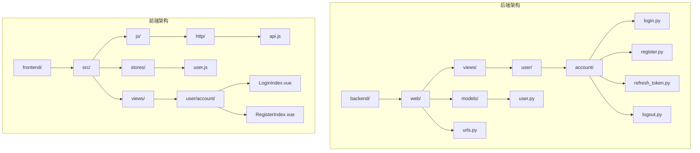
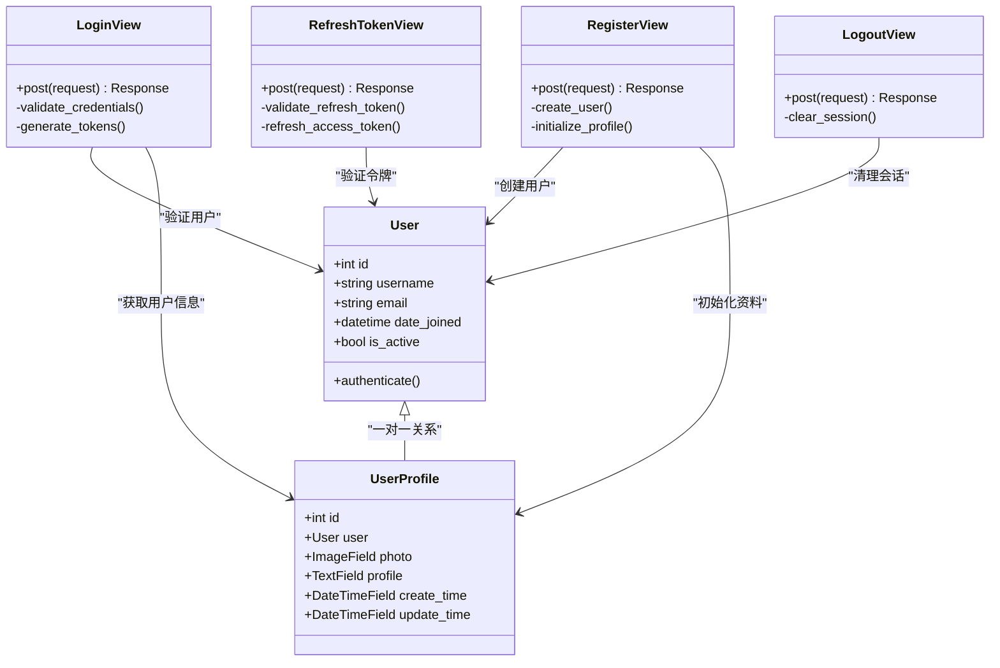
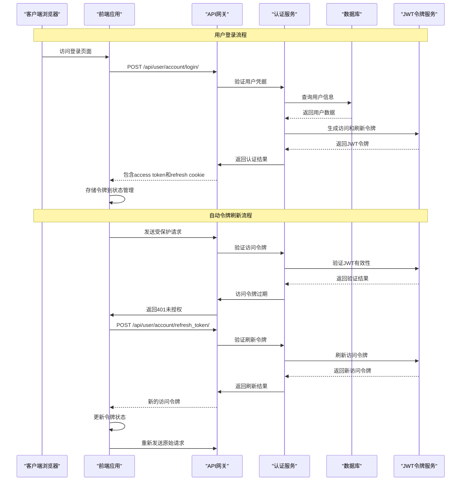
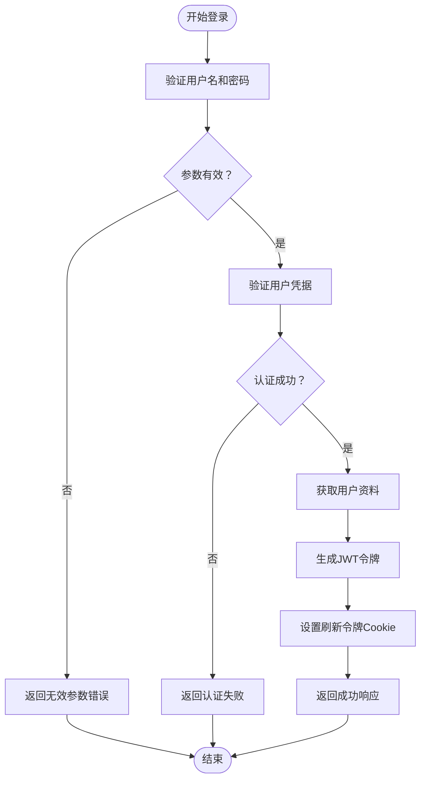
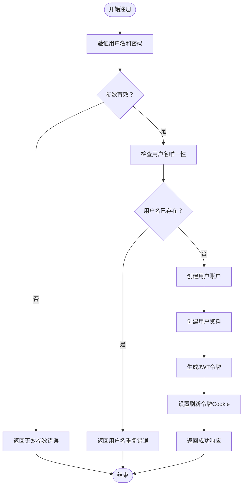
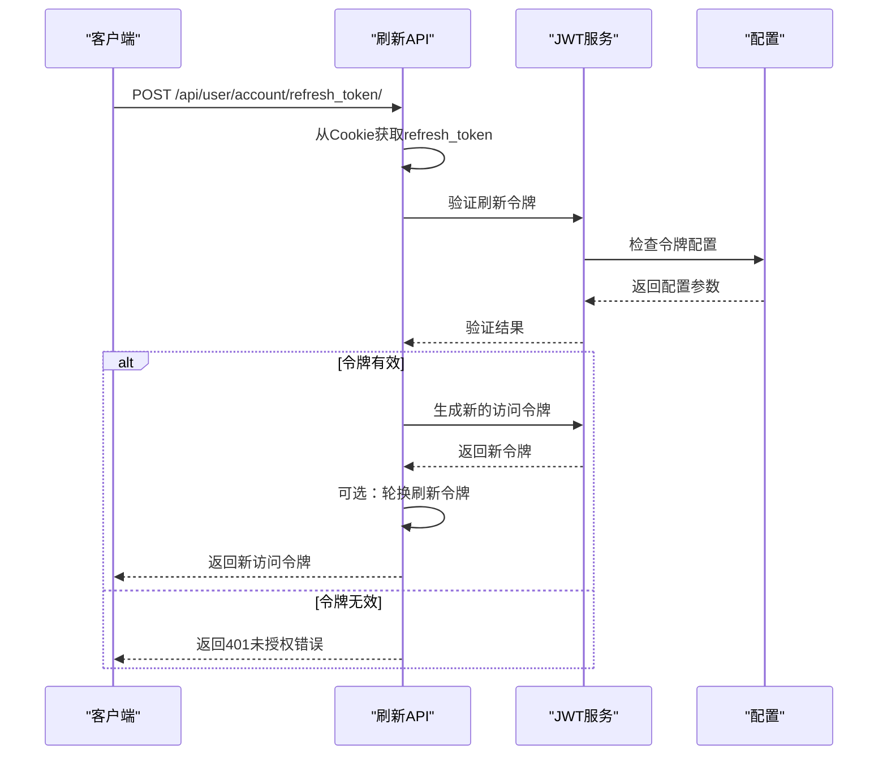
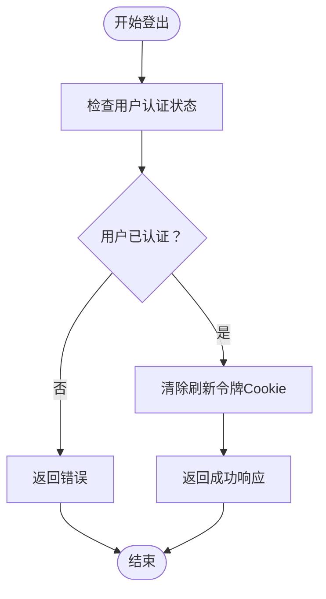
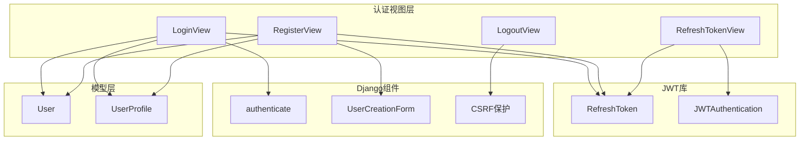
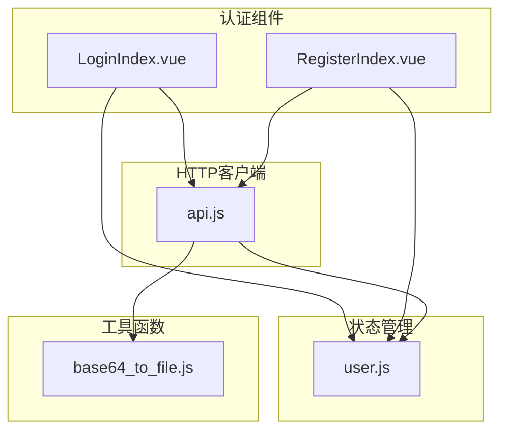

# 认证视图实现

<cite>
**本文档引用的文件**
- [login.py](file://backend/web/views/user/account/login.py)
- [register.py](file://backend/web/views/user/account/register.py)
- [refresh_token.py](file://backend/web/views/user/account/refresh_token.py)
- [logout.py](file://backend/web/views/user/account/logout.py)
- [user.py](file://backend/web/models/user.py)
- [urls.py](file://backend/web/urls.py)
- [settings.py](file://backend/backend/settings.py)
- [api.js](file://frontend/src/js/http/api.js)
- [user.js](file://frontend/src/stores/user.js)
- [LoginIndex.vue](file://frontend/src/views/user/account/LoginIndex.vue)
- [RegisterIndex.vue](file://frontend/src/views/user/account/RegisterIndex.vue)
</cite>

## 目录
1. [简介](#简介)
2. [项目结构](#项目结构)
3. [核心组件](#核心组件)
4. [架构概览](#架构概览)
5. [详细组件分析](#详细组件分析)
6. [依赖关系分析](#依赖关系分析)
7. [性能考虑](#性能考虑)
8. [故障排除指南](#故障排除指南)
9. [结论](#结论)

## 简介

LLM_AIfriends项目采用JWT（JSON Web Token）认证机制实现用户身份验证。本项目实现了完整的认证体系，包括用户登录、注册、令牌刷新和登出功能。系统基于Django框架构建，使用Django REST Framework和Django REST Framework SimpleJWT库来处理JWT令牌的生成、验证和刷新。

认证系统的核心特点：
- 基于JWT的无状态认证
- 使用Cookie存储刷新令牌
- 自动令牌刷新机制
- 完整的错误处理和安全措施
- 前后端分离的架构设计

## 项目结构

认证相关文件主要分布在以下目录结构中：

**图表来源**
- [urls.py:1-24](file://backend/web/urls.py#L1-L24)
- [login.py:1-92](file://backend/web/views/user/account/login.py#L1-L92)
- [register.py:1-46](file://backend/web/views/user/account/register.py#L1-L46)
- [refresh_token.py:1-41](file://backend/web/views/user/account/refresh_token.py#L1-L41)
- [logout.py:1-16](file://backend/web/views/user/account/logout.py#L1-L16)

**章节来源**
- [urls.py:1-24](file://backend/web/urls.py#L1-L24)
- [settings.py:133-151](file://backend/backend/settings.py#L133-L151)

## 核心组件

### JWT配置和设置

系统使用Django REST Framework SimpleJWT进行JWT认证配置：

| 配置项 | 值 | 描述 |
|--------|-----|------|
| ACCESS_TOKEN_LIFETIME | 2小时 | 访问令牌有效期 |
| REFRESH_TOKEN_LIFETIME | 7天 | 刷新令牌有效期 |
| ROTATE_REFRESH_TOKENS | True | 启用刷新令牌轮换 |
| BLACKLIST_AFTER_ROTATION | True | 旋转后加入黑名单 |
| AUTH_HEADER_TYPES | ('Bearer',) | 认证头类型 |

### 用户模型设计

用户认证系统基于Django内置的User模型和自定义的UserProfile模型：

**图表来源**
- [user.py:15-23](file://backend/web/models/user.py#L15-L23)
- [login.py:9-46](file://backend/web/views/user/account/login.py#L9-L46)
- [register.py:9-46](file://backend/web/views/user/account/register.py#L9-L46)
- [refresh_token.py:7-41](file://backend/web/views/user/account/refresh_token.py#L7-L41)
- [logout.py:7-16](file://backend/web/views/user/account/logout.py#L7-L16)

**章节来源**
- [user.py:15-23](file://backend/web/models/user.py#L15-L23)
- [settings.py:142-151](file://backend/backend/settings.py#L142-L151)

## 架构概览

认证系统的整体架构采用前后端分离设计，通过HTTP API进行通信：

**图表来源**
- [api.js:46-89](file://frontend/src/js/http/api.js#L46-L89)
- [login.py:9-46](file://backend/web/views/user/account/login.py#L9-L46)
- [refresh_token.py:7-41](file://backend/web/views/user/account/refresh_token.py#L7-L41)

## 详细组件分析

### 登录视图实现

登录视图负责处理用户身份验证和令牌生成：

#### 请求参数验证

| 参数名称 | 类型 | 必填 | 验证规则 | 错误消息 |
|----------|------|------|----------|----------|
| username | string | 是 | 非空且去除空白字符 | 用户名或密码不能为空 |
| password | string | 是 | 非空且去除空白字符 | 用户名或密码不能为空 |

#### 处理流程

**图表来源**
- [login.py:10-46](file://backend/web/views/user/account/login.py#L10-L46)

#### 响应格式

成功的登录响应包含以下字段：

| 字段名称 | 类型 | 描述 |
|----------|------|------|
| result | string | 操作结果状态，成功时为'success' |
| access | string | JWT访问令牌 |
| user_id | integer | 用户唯一标识符 |
| username | string | 用户名 |
| photo | string | 用户头像URL |
| profile | string | 用户个人简介 |

#### 密码验证机制

系统使用Django的`authenticate()`函数进行密码验证，该函数会：
1. 通过用户名查找用户
2. 验证提供的密码与存储的哈希值
3. 返回用户对象或None

#### 令牌生成和存储

登录成功后，系统生成并存储：
- **访问令牌**：短期有效的JWT令牌，用于API访问
- **刷新令牌Cookie**：长期有效的刷新令牌，存储在HTTP-only Cookie中

**章节来源**
- [login.py:10-46](file://backend/web/views/user/account/login.py#L10-L46)

### 注册视图实现

注册视图负责创建新用户账户和初始化用户资料：

#### 请求参数验证

| 参数名称 | 类型 | 必填 | 验证规则 | 错误消息 |
|----------|------|------|----------|----------|
| username | string | 是 | 非空且去除空白字符 | 用户名或密码不能为空 |
| password | string | 是 | 非空且去除空白字符 | 用户名或密码不能为空 |

#### 处理流程

**图表来源**
- [register.py:10-46](file://backend/web/views/user/account/register.py#L10-L46)

#### 默认资料初始化

新用户注册时，系统自动创建以下默认资料：
- **头像**：使用默认头像路径
- **个人简介**：默认文本"谢谢你的关注"
- **创建时间**：当前时间戳
- **更新时间**：当前时间戳

#### 用户名唯一性检查

注册过程中，系统会检查用户名是否已被使用：
1. 查询User表中是否存在相同用户名
2. 如果存在，返回"用户名已存在"错误
3. 如果不存在，继续创建流程

**章节来源**
- [register.py:10-46](file://backend/web/views/user/account/register.py#L10-L46)
- [user.py:15-23](file://backend/web/models/user.py#L15-L23)

### 令牌刷新视图实现

令牌刷新视图处理访问令牌的自动续期：

#### 刷新令牌验证

**图表来源**
- [refresh_token.py:8-41](file://backend/web/views/user/account/refresh_token.py#L8-L41)

#### 刷新策略

系统支持两种刷新策略：
1. **标准刷新**：仅生成新的访问令牌
2. **轮换刷新**：生成新的访问令牌和新的刷新令牌

轮换刷新启用条件：
- `ROTATE_REFRESH_TOKENS = True`
- `BLACKLIST_AFTER_ROTATION = True`

#### 响应格式

刷新成功响应包含：
- **result**：'success'
- **access**：新的访问令牌字符串

**章节来源**
- [refresh_token.py:8-41](file://backend/web/views/user/account/refresh_token.py#L8-L41)
- [settings.py:147-148](file://backend/backend/settings.py#L147-L148)

### 登出视图实现

登出视图负责清理用户会话和令牌：

#### 会话清理流程

**图表来源**
- [logout.py:10-16](file://backend/web/views/user/account/logout.py#L10-L16)

#### 权限控制

登出视图强制要求用户必须已认证：
- 使用`IsAuthenticated`权限类
- 未认证用户无法访问登出功能

#### 令牌失效处理

登出操作会：
1. 清除浏览器中的刷新令牌Cookie
2. 使当前会话失效
3. 需要重新登录才能访问受保护资源

**章节来源**
- [logout.py:7-16](file://backend/web/views/user/account/logout.py#L7-L16)

## 依赖关系分析

### 后端依赖关系

**图表来源**
- [login.py:1-6](file://backend/web/views/user/account/login.py#L1-L6)
- [register.py:1-6](file://backend/web/views/user/account/register.py#L1-L6)
- [refresh_token.py:1-4](file://backend/web/views/user/account/refresh_token.py#L1-L4)
- [logout.py:4-5](file://backend/web/views/user/account/logout.py#L4-L5)

### 前端依赖关系

**图表来源**
- [LoginIndex.vue:1-69](file://frontend/src/views/user/account/LoginIndex.vue#L1-L69)
- [RegisterIndex.vue:1-76](file://frontend/src/views/user/account/RegisterIndex.vue#L1-L76)
- [user.js:1-59](file://frontend/src/stores/user.js#L1-L59)
- [api.js:1-92](file://frontend/src/js/http/api.js#L1-L92)

**章节来源**
- [urls.py:10-17](file://backend/web/urls.py#L10-L17)
- [settings.py:133-151](file://backend/backend/settings.py#L133-L151)

## 性能考虑

### 令牌生命周期优化

1. **访问令牌短生命周期**：2小时有效期，减少令牌泄露风险
2. **刷新令牌长生命周期**：7天有效期，提升用户体验
3. **智能刷新机制**：仅在必要时刷新令牌，避免频繁网络请求

### 数据库查询优化

1. **用户资料预加载**：登录时一次性获取用户资料，避免后续查询
2. **索引优化**：用户名字段建立唯一索引，加速用户查找
3. **批量操作**：注册时用户和资料创建使用事务，确保数据一致性

### 前端性能优化

1. **令牌缓存**：在内存中缓存访问令牌，避免重复计算
2. **请求去重**：防止并发刷新请求导致的重复刷新
3. **错误重试**：智能的错误重试机制，提升用户体验

## 故障排除指南

### 常见错误及解决方案

| 错误类型 | 错误代码 | 可能原因 | 解决方案 |
|----------|----------|----------|----------|
| 认证失败 | 401 | 用户名或密码错误 | 检查凭据正确性，确认用户存在 |
| 参数无效 | 400 | 请求参数缺失或格式错误 | 验证前端表单数据，检查API调用 |
| 用户名重复 | 400 | 用户名已被使用 | 提示用户选择其他用户名 |
| 令牌过期 | 401 | 访问令牌已过期 | 调用刷新令牌接口获取新令牌 |
| 刷新失败 | 401 | 刷新令牌无效或过期 | 用户重新登录获取新令牌 |

### 调试技巧

1. **浏览器开发者工具**：检查网络请求和响应
2. **Django日志**：查看服务器端错误日志
3. **令牌验证**：使用JWT调试工具验证令牌有效性
4. **Cookie检查**：确认刷新令牌Cookie正确设置

### 安全注意事项

1. **HTTPS强制**：生产环境必须使用HTTPS
2. **Cookie安全**：设置`HttpOnly`和`Secure`标志
3. **CSRF保护**：启用Django CSRF中间件
4. **令牌轮换**：定期轮换刷新令牌，防止长期有效令牌被滥用

**章节来源**
- [login.py:43-46](file://backend/web/views/user/account/login.py#L43-L46)
- [register.py:43-46](file://backend/web/views/user/account/register.py#L43-L46)
- [refresh_token.py:38-41](file://backend/web/views/user/account/refresh_token.py#L38-L41)

## 结论

LLM_AIfriends项目的认证系统实现了完整的JWT认证流程，具有以下优势：

### 技术优势
- **安全性**：基于JWT的无状态认证，配合Cookie存储刷新令牌
- **用户体验**：自动令牌刷新机制，减少用户重新登录频率
- **可扩展性**：模块化的认证组件设计，便于功能扩展
- **可靠性**：完善的错误处理和异常恢复机制

### 架构特点
- **前后端分离**：清晰的职责划分，便于维护和测试
- **配置驱动**：通过配置文件管理认证参数，灵活调整
- **标准化**：遵循RESTful API设计原则，易于集成第三方系统

### 改进建议
1. **增强密码策略**：添加密码强度验证和复杂度要求
2. **多因素认证**：考虑添加邮箱验证或短信验证码
3. **审计日志**：记录重要的认证事件，便于安全审计
4. **速率限制**：添加登录尝试次数限制，防止暴力破解

该认证系统为LLM_AIfriends项目提供了坚实的安全基础，支持项目的长期发展和用户增长需求。