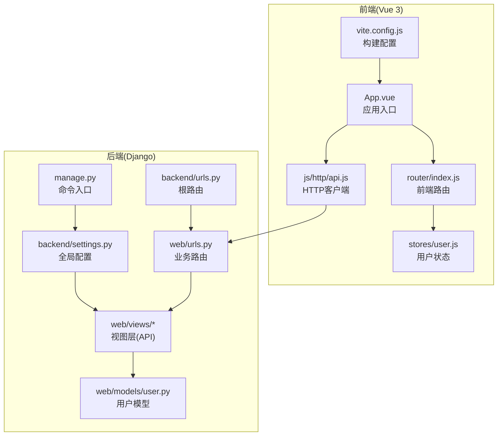
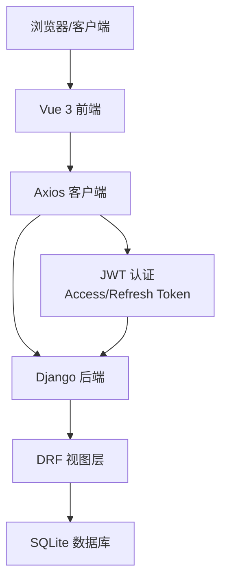
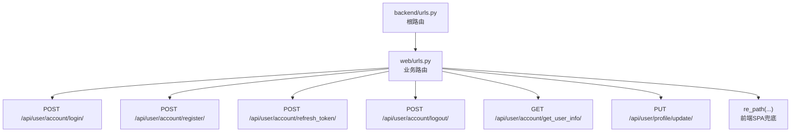
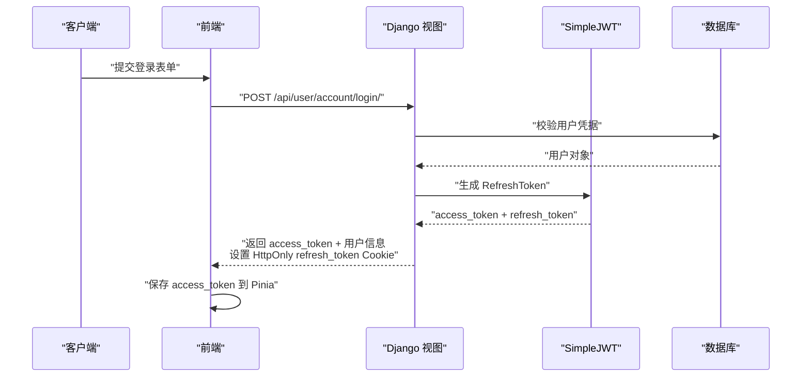
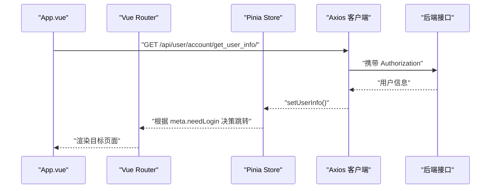
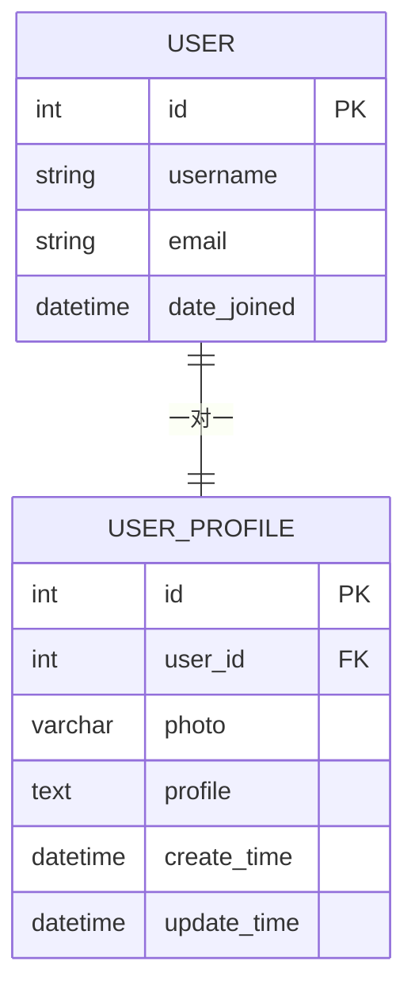
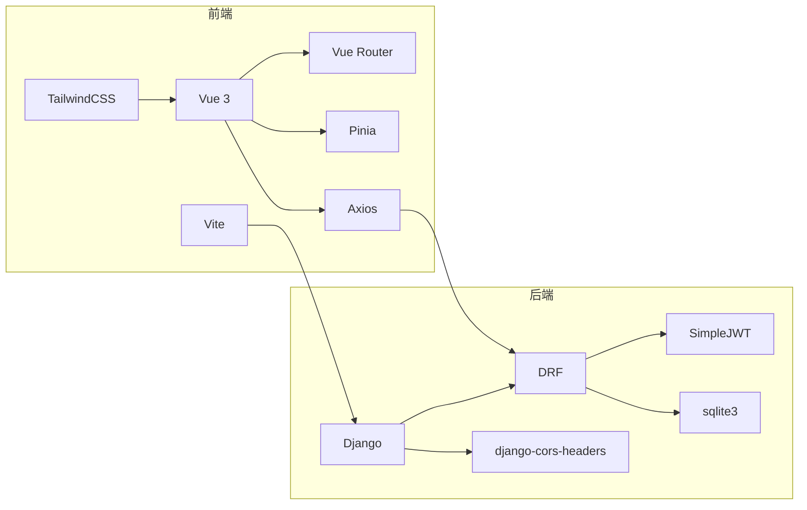

# 技术架构

<cite>
**本文引用的文件**
- [settings.py](file://backend/backend/settings.py)
- [urls.py](file://backend/backend/urls.py)
- [urls.py](file://backend/web/urls.py)
- [index.js](file://frontend/src/router/index.js)
- [user.js](file://frontend/src/stores/user.js)
- [login.py](file://backend/web/views/user/account/login.py)
- [register.py](file://backend/web/views/user/account/register.py)
- [refresh_token.py](file://backend/web/views/user/account/refresh_token.py)
- [api.js](file://frontend/src/js/http/api.js)
- [user.py](file://backend/web/models/user.py)
- [App.vue](file://frontend/src/App.vue)
- [package.json](file://frontend/package.json)
- [vite.config.js](file://frontend/vite.config.js)
- [manage.py](file://backend/manage.py)
</cite>

## 目录
1. [引言](#引言)
2. [项目结构](#项目结构)
3. [核心组件](#核心组件)
4. [架构总览](#架构总览)
5. [详细组件分析](#详细组件分析)
6. [依赖分析](#依赖分析)
7. [性能考虑](#性能考虑)
8. [故障排查指南](#故障排查指南)
9. [结论](#结论)
10. [附录](#附录)

## 引言
本技术架构文档面向 LLM_AIfriends 项目，系统性阐述其前后端分离架构、Django 后端的配置与中间件、URL 路由体系、Vue 3 前端应用结构、路由与状态管理、数据流与 API 交互模式，以及 JWT 认证机制。文档还给出系统边界、组件交互关系、集成模式、架构决策的技术考量与性能优化策略，帮助开发者快速理解并高效迭代。

## 项目结构
项目采用典型的前后端分离模式：
- 后端：Django + Django REST Framework，提供 REST API 与静态资源服务，使用 SQLite 作为默认数据库，SimpleJWT 实现令牌认证。
- 前端：Vue 3 + Vite，使用 Vue Router 进行前端路由，Pinia 进行状态管理，Axios 封装统一 HTTP 客户端并内置令牌刷新逻辑。

图表来源
- [settings.py:33-54](file://backend/backend/settings.py#L33-L54)
- [urls.py:23-26](file://backend/backend/urls.py#L23-L26)
- [urls.py:10-23](file://backend/web/urls.py#L10-L23)
- [index.js:12-90](file://frontend/src/router/index.js#L12-L90)
- [user.js:4-59](file://frontend/src/stores/user.js#L4-L59)
- [api.js:16-92](file://frontend/src/js/http/api.js#L16-L92)
- [user.py:15-23](file://backend/web/models/user.py#L15-L23)
- [manage.py:7-18](file://backend/manage.py#L7-L18)
- [vite.config.js:10-25](file://frontend/vite.config.js#L10-L25)

章节来源
- [settings.py:33-54](file://backend/backend/settings.py#L33-L54)
- [urls.py:23-26](file://backend/backend/urls.py#L23-L26)
- [urls.py:10-23](file://backend/web/urls.py#L10-L23)
- [index.js:12-90](file://frontend/src/router/index.js#L12-L90)
- [user.js:4-59](file://frontend/src/stores/user.js#L4-L59)
- [api.js:16-92](file://frontend/src/js/http/api.js#L16-L92)
- [user.py:15-23](file://backend/web/models/user.py#L15-L23)
- [manage.py:7-18](file://backend/manage.py#L7-L18)
- [vite.config.js:10-25](file://frontend/vite.config.js#L10-L25)

## 核心组件
- Django 后端
  - 应用与中间件：启用 CORS、会话、CSRF、安全、消息等中间件，安装 DRF、web 应用与 corsheaders。
  - 认证与令牌：使用 SimpleJWT，默认认证类为 JWTAuthentication，配置 ACCESS/REFRESH 生命周期、轮换与黑名单。
  - 跨域与静态资源：允许凭据，限定前端源，开发阶段通过 Django 提供静态与媒体文件。
- Vue 3 前端
  - 路由系统：基于 Vue Router 的 history 模式，定义多页面路由与登录守卫。
  - 状态管理：Pinia Store 维护用户信息、访问令牌与登录态。
  - HTTP 客户端：Axios 封装，自动注入 Authorization 头，拦截 401 并通过 Cookie 中的 refresh_token 刷新 access_token。
- 数据模型
  - 用户资料模型：一对一关联 Django 内置 User，支持头像上传与简介字段。

章节来源
- [settings.py:33-54](file://backend/backend/settings.py#L33-L54)
- [settings.py:136-151](file://backend/backend/settings.py#L136-L151)
- [settings.py:153-158](file://backend/backend/settings.py#L153-L158)
- [index.js:12-90](file://frontend/src/router/index.js#L12-L90)
- [user.js:4-59](file://frontend/src/stores/user.js#L4-L59)
- [api.js:16-92](file://frontend/src/js/http/api.js#L16-L92)
- [user.py:15-23](file://backend/web/models/user.py#L15-L23)

## 架构总览
系统边界与集成点：
- 前端通过 Axios 发起 API 请求，后端通过 Django REST Framework 提供接口。
- 前端路由与后端路由解耦，后端提供以 /api/ 开头的 REST 接口，前端路由负责 SPA 页面导航。
- 认证采用 JWT，访问令牌随请求头携带，刷新令牌通过 HttpOnly Cookie 存储并在后端校验。

图表来源
- [api.js:16-92](file://frontend/src/js/http/api.js#L16-L92)
- [settings.py:136-151](file://backend/backend/settings.py#L136-L151)
- [urls.py:10-23](file://backend/web/urls.py#L10-L23)
- [user.py:15-23](file://backend/web/models/user.py#L15-L23)

## 详细组件分析

### Django 后端配置与中间件
- 应用与中间件
  - INSTALLED_APPS 包含 django.contrib.*、rest_framework、web 应用与 corsheaders。
  - MIDDLEWARE 顺序强调 corsheaders 在前，确保跨域优先处理。
- 认证与令牌
  - DEFAULT_AUTHENTICATION_CLASSES 指定 JWTAuthentication。
  - SIMPLE_JWT 配置 ACCESS_TOKEN_LIFETIME、REFRESH_TOKEN_LIFETIME、ROTATE_REFRESH_TOKENS、BLACKLIST_AFTER_ROTATION、AUTH_HEADER_TYPES。
- 跨域与静态资源
  - CORS_ALLOW_CREDENTIALS 与 CORS_ALLOWED_ORIGINS 限定前端域名。
  - 开发阶段通过 Django 提供静态与媒体文件。

章节来源
- [settings.py:33-54](file://backend/backend/settings.py#L33-L54)
- [settings.py:136-151](file://backend/backend/settings.py#L136-L151)
- [settings.py:153-158](file://backend/backend/settings.py#L153-L158)

### URL 路由结构（Django）
- 根路由
  - backend/urls.py 将 / 映射到 web 应用，并提供开发阶段静态/媒体文件服务。
- 业务路由
  - web/urls.py 定义以 /api/user/account/* 和 /api/user/profile/* 开头的 REST 接口，末尾兜底路由指向前端单页应用，避免与后端 API 冲突。

图表来源
- [urls.py:23-26](file://backend/backend/urls.py#L23-L26)
- [urls.py:10-23](file://backend/web/urls.py#L10-L23)

章节来源
- [urls.py:23-26](file://backend/backend/urls.py#L23-L26)
- [urls.py:10-23](file://backend/web/urls.py#L10-L23)

### 视图层（Django REST API）
- 登录接口
  - 校验用户名与密码，成功后生成 RefreshToken 并下发 access_token，同时设置 HttpOnly refresh_token Cookie。
- 注册接口
  - 校验用户名唯一性，创建 User 与 UserProfile，随后发放令牌并设置 Cookie。
- 刷新令牌接口
  - 从 Cookie 读取 refresh_token，验证有效性并刷新 access_token，必要时轮换 refresh_token 并更新 Cookie。
- 获取用户信息接口
  - 由前端在挂载时调用，返回当前用户基本信息。

图表来源
- [login.py:9-46](file://backend/web/views/user/account/login.py#L9-L46)
- [register.py:9-46](file://backend/web/views/user/account/register.py#L9-L46)
- [refresh_token.py:7-41](file://backend/web/views/user/account/refresh_token.py#L7-L41)
- [api.js:16-92](file://frontend/src/js/http/api.js#L16-L92)

章节来源
- [login.py:9-46](file://backend/web/views/user/account/login.py#L9-L46)
- [register.py:9-46](file://backend/web/views/user/account/register.py#L9-L46)
- [refresh_token.py:7-41](file://backend/web/views/user/account/refresh_token.py#L7-L41)

### Vue 3 前端应用结构
- 应用入口与初始化
  - App.vue 在挂载时拉取用户信息并设置登录态，随后根据路由元信息决定是否跳转至登录页。
- 路由系统
  - 基于 history 模式的多页面路由，包含首页、好友、创作、用户空间、个人资料、登录与注册等页面。
  - 路由守卫对需要登录的页面进行前置校验。
- 状态管理
  - Pinia Store 维护用户 ID、用户名、头像、简介、访问令牌与“是否已拉取用户信息”标志位。
- HTTP 客户端
  - Axios 实例自动注入 Authorization 头，拦截 401 错误，使用 Cookie 中的 refresh_token 调用刷新接口，成功后重试原请求。

图表来源
- [App.vue:13-31](file://frontend/src/App.vue#L13-L31)
- [index.js:92-101](file://frontend/src/router/index.js#L92-L101)
- [user.js:26-31](file://frontend/src/stores/user.js#L26-L31)
- [api.js:16-92](file://frontend/src/js/http/api.js#L16-L92)

章节来源
- [App.vue:13-31](file://frontend/src/App.vue#L13-L31)
- [index.js:92-101](file://frontend/src/router/index.js#L92-L101)
- [user.js:4-59](file://frontend/src/stores/user.js#L4-L59)
- [api.js:16-92](file://frontend/src/js/http/api.js#L16-L92)

### 数据模型与媒体资源
- 用户资料模型
  - 一对一关联 Django User，提供头像上传路径与简介字段，头像上传使用自定义命名规则。
- 媒体与静态资源
  - 前端构建产物输出到 Django static 目录，开发阶段由 Django 提供静态与媒体文件。

图表来源
- [user.py:15-23](file://backend/web/models/user.py#L15-L23)

章节来源
- [user.py:15-23](file://backend/web/models/user.py#L15-L23)
- [vite.config.js:16-19](file://frontend/vite.config.js#L16-L19)

## 依赖分析
- 前端依赖
  - Vue 3、Vue Router、Pinia、Axios、TailwindCSS、Vite 插件生态。
- 后端依赖
  - Django、Django REST Framework、djangorestframework-simplejwt、django-cors-headers、sqlite3。
- 构建与运行
  - 前端通过 Vite 构建并将产物置于 Django static 目录，开发阶段由 Django 提供静态与媒体文件。

图表来源
- [package.json:11-25](file://frontend/package.json#L11-L25)
- [settings.py:33-54](file://backend/backend/settings.py#L33-L54)
- [vite.config.js:10-25](file://frontend/vite.config.js#L10-L25)

章节来源
- [package.json:11-25](file://frontend/package.json#L11-L25)
- [settings.py:33-54](file://backend/backend/settings.py#L33-L54)
- [vite.config.js:10-25](file://frontend/vite.config.js#L10-L25)

## 性能考虑
- 令牌生命周期
  - Access Token 有效期短、Refresh Token 有效期长，结合轮换与黑名单策略提升安全性与可用性。
- 前端缓存与重试
  - Axios 拦截器在 401 时自动刷新令牌并重试，减少用户感知的认证抖动。
- 静态资源分发
  - 前端构建产物直接进入 Django static 目录，开发阶段由 Django 提供静态与媒体文件，简化部署与调试。
- 数据库与模型
  - 使用 SQLite 适配开发环境，模型字段合理，避免冗余查询；头像上传路径可按需引入 CDN。

章节来源
- [settings.py:143-151](file://backend/backend/settings.py#L143-L151)
- [api.js:46-90](file://frontend/src/js/http/api.js#L46-L90)
- [vite.config.js:16-19](file://frontend/vite.config.js#L16-L19)
- [user.py:15-23](file://backend/web/models/user.py#L15-L23)

## 故障排查指南
- 登录后仍提示未登录
  - 检查前端是否正确接收并保存 access_token；确认后端是否设置 HttpOnly refresh_token Cookie。
- 401 未授权
  - 确认请求头是否包含 Authorization；若 access_token 过期，检查刷新流程是否成功；核对 SIMPLE_JWT 配置。
- 跨域问题
  - 确认 CORS_ALLOWED_ORIGINS 是否包含前端地址，且 CORS_ALLOW_CREDENTIALS 已开启。
- 媒体资源无法加载
  - 确认 MEDIA_URL 与 MEDIA_ROOT 配置，开发阶段静态/媒体服务是否启用。
- 刷新令牌无效
  - 检查 Cookie 中 refresh_token 是否存在且未过期；核对后端刷新接口返回状态码。

章节来源
- [login.py:31-38](file://backend/web/views/user/account/login.py#L31-L38)
- [refresh_token.py:8-14](file://backend/web/views/user/account/refresh_token.py#L8-L14)
- [settings.py:153-158](file://backend/backend/settings.py#L153-L158)
- [api.js:46-90](file://frontend/src/js/http/api.js#L46-L90)

## 结论
本项目采用清晰的前后端分离架构：Django 提供 REST API 与静态资源服务，Vue 3 负责前端路由与状态管理，Axios 封装统一 HTTP 客户端并内置令牌刷新机制。JWT 认证结合短期访问令牌与长期刷新令牌，配合前端路由守卫与 Pinia 状态管理，形成完整的认证与用户体验闭环。建议在生产环境中引入更严格的 CORS 策略、CDN 分发静态资源与媒体文件，并考虑将数据库替换为生产级数据库以满足扩展需求。

## 附录
- 命令入口
  - 后端通过 manage.py 启动 Django 管理命令，设置 DJANGO_SETTINGS_MODULE 指向 backend.settings。
- 版本与工具链
  - 前端使用 Vite 构建，Node 版本要求较高；Vue 3、Vue Router、Pinia、Axios、TailwindCSS 组成前端技术栈。

章节来源
- [manage.py:7-18](file://backend/manage.py#L7-L18)
- [package.json:26-28](file://frontend/package.json#L26-L28)
- [vite.config.js:10-25](file://frontend/vite.config.js#L10-L25)