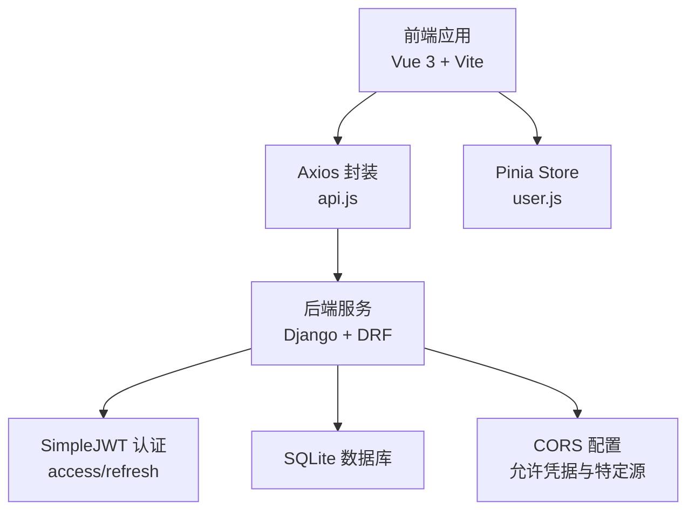
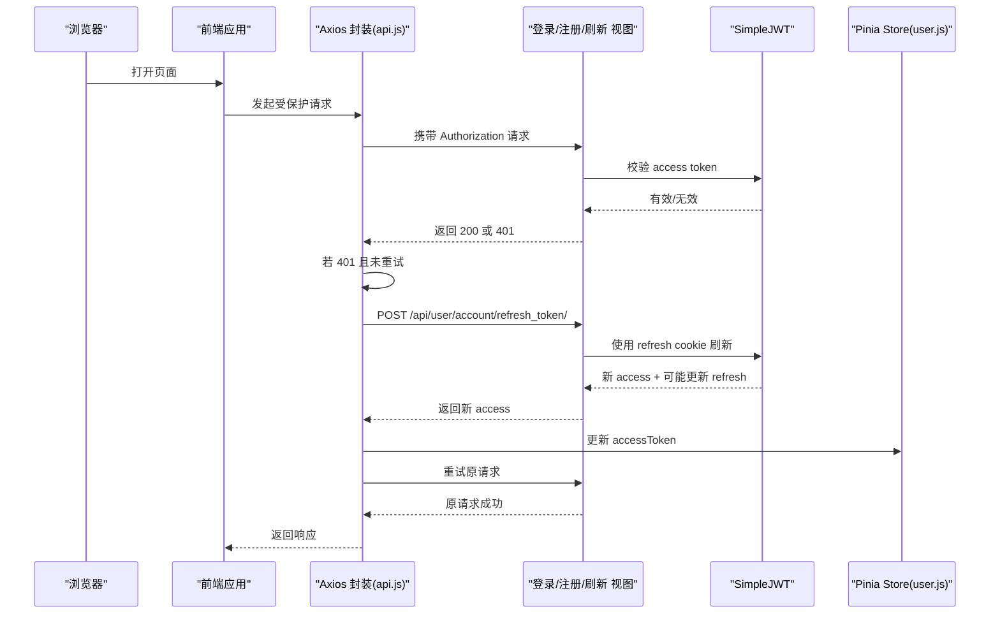
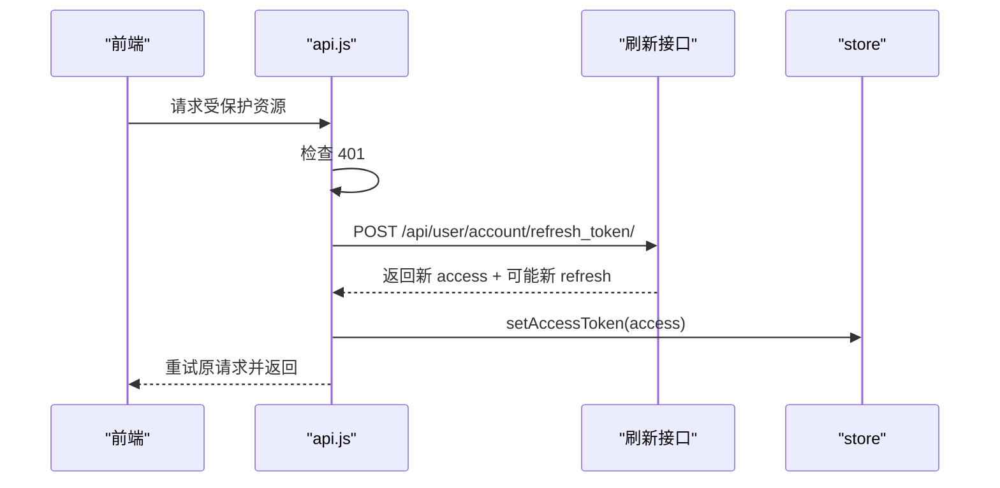
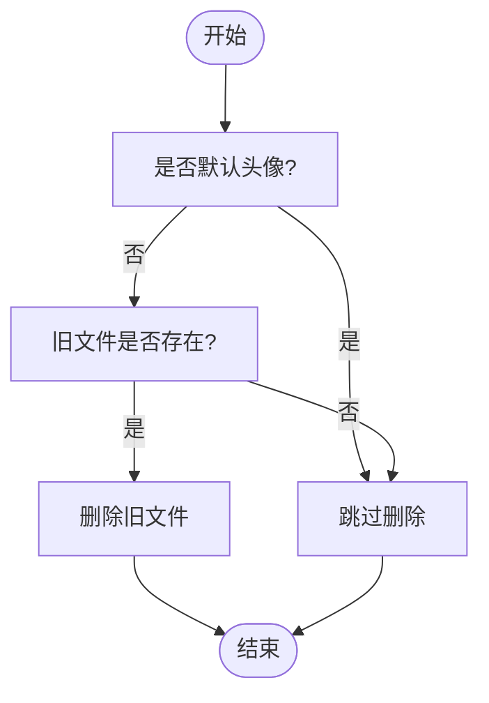
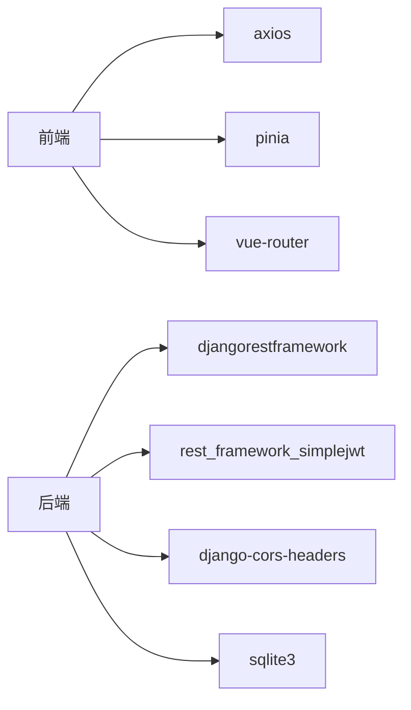

# 故障排除

<cite>
**本文引用的文件**
- [settings.py](file://backend/backend/settings.py)
- [urls.py](file://backend/web/urls.py)
- [login.py](file://backend/web/views/user/account/login.py)
- [register.py](file://backend/web/views/user/account/register.py)
- [refresh_token.py](file://backend/web/views/user/account/refresh_token.py)
- [logout.py](file://backend/web/views/user/account/logout.py)
- [get_user_info.py](file://backend/web/views/user/account/get_user_info.py)
- [user.py](file://backend/web/models/user.py)
- [photo.py](file://backend/web/views/utils/photo.py)
- [api.js](file://frontend/src/js/http/api.js)
- [user.js](file://frontend/src/stores/user.js)
- [LoginIndex.vue](file://frontend/src/views/user/account/LoginIndex.vue)
- [RegisterIndex.vue](file://frontend/src/views/user/account/RegisterIndex.vue)
</cite>

## 目录
1. [简介](#简介)
2. [项目结构](#项目结构)
3. [核心组件](#核心组件)
4. [架构总览](#架构总览)
5. [详细组件分析](#详细组件分析)
6. [依赖分析](#依赖分析)
7. [性能考虑](#性能考虑)
8. [故障排除指南](#故障排除指南)
9. [结论](#结论)
10. [附录](#附录)

## 简介
本指南面向 LLM_AIfriends 项目的开发者与运维人员，聚焦于常见问题的定位与解决，覆盖认证（JWT 令牌过期、登录失败）、文件上传（格式不支持、大小限制）、跨域（CORS 配置）、网络与数据库连接异常、前端组件渲染问题等。文档提供调试工具使用方法、日志分析技巧、性能诊断建议，并给出错误代码对照表与常见错误消息解释及预防措施。

## 项目结构
后端基于 Django + Django REST Framework，采用 SQLite 本地数据库，使用 Django CORS Headers 处理跨域，SimpleJWT 实现认证与令牌刷新。前端基于 Vue 3 + Vite，通过 Axios 封装的 api 模块统一处理鉴权与请求重试。

图表来源
- [settings.py:133-158](file://backend/backend/settings.py#L133-L158)
- [urls.py:10-24](file://backend/web/urls.py#L10-L24)
- [api.js:14-19](file://frontend/src/js/http/api.js#L14-L19)
- [user.js:4-59](file://frontend/src/stores/user.js#L4-L59)

章节来源
- [settings.py:133-158](file://backend/backend/settings.py#L133-L158)
- [urls.py:10-24](file://backend/web/urls.py#L10-L24)

## 核心组件
- 后端认证与路由
  - 登录/注册/刷新/登出/获取用户信息接口由后端视图提供，路由位于 web/urls.py。
  - JWT 认证与 SimpleJWT 配置位于 settings.py。
- 前端请求与状态
  - Axios 封装 api.js 负责自动注入 Authorization、拦截 401 并刷新 access token。
  - Pinia store user.js 维护登录态与用户信息。
- 文件上传与清理
  - 用户头像上传模型与上传路径策略位于 user.py。
  - 旧头像清理逻辑位于 utils/photo.py。

章节来源
- [login.py:9-46](file://backend/web/views/user/account/login.py#L9-L46)
- [register.py:9-46](file://backend/web/views/user/account/register.py#L9-L46)
- [refresh_token.py:7-41](file://backend/web/views/user/account/refresh_token.py#L7-L41)
- [logout.py:7-16](file://backend/web/views/user/account/logout.py#L7-L16)
- [get_user_info.py:8-25](file://backend/web/views/user/account/get_user_info.py#L8-L25)
- [settings.py:133-158](file://backend/backend/settings.py#L133-L158)
- [urls.py:10-24](file://backend/web/urls.py#L10-L24)
- [user.py:15-23](file://backend/web/models/user.py#L15-L23)
- [photo.py:9-13](file://backend/web/views/utils/photo.py#L9-L13)
- [api.js:21-90](file://frontend/src/js/http/api.js#L21-L90)
- [user.js:4-59](file://frontend/src/stores/user.js#L4-L59)

## 架构总览
下图展示从浏览器到后端的关键交互流程，包括登录、鉴权、令牌刷新与登出。

图表来源
- [api.js:46-90](file://frontend/src/js/http/api.js#L46-L90)
- [refresh_token.py:7-41](file://backend/web/views/user/account/refresh_token.py#L7-L41)
- [login.py:9-46](file://backend/web/views/user/account/login.py#L9-L46)
- [register.py:9-46](file://backend/web/views/user/account/register.py#L9-L46)
- [user.js:22-24](file://frontend/src/stores/user.js#L22-L24)

## 详细组件分析

### 认证与令牌刷新
- 登录/注册
  - 登录与注册成功后均返回 access token，并设置 refresh cookie（安全、HttpOnly、SameSite=Lax）。
  - 登录/注册接口对必填字段进行校验，返回明确的错误提示。
- 令牌刷新
  - 刷新接口从 Cookie 读取 refresh_token，若缺失或过期返回 401。
  - 当启用 ROTATE_REFRESH_TOKENS 时，刷新会生成新的 refresh token 并回写 Cookie。
- 登出
  - 登出接口强制要求已认证，删除 refresh cookie，使后续请求失效。

图表来源
- [api.js:46-90](file://frontend/src/js/http/api.js#L46-L90)
- [refresh_token.py:7-41](file://backend/web/views/user/account/refresh_token.py#L7-L41)
- [user.js:22-24](file://frontend/src/stores/user.js#L22-L24)

章节来源
- [login.py:9-46](file://backend/web/views/user/account/login.py#L9-L46)
- [register.py:9-46](file://backend/web/views/user/account/register.py#L9-L46)
- [refresh_token.py:7-41](file://backend/web/views/user/account/refresh_token.py#L7-L41)
- [logout.py:7-16](file://backend/web/views/user/account/logout.py#L7-L16)
- [settings.py:133-158](file://backend/backend/settings.py#L133-L158)

### 文件上传与头像管理
- 上传策略
  - 用户头像上传至 MEDIA_ROOT 下的 user/photos 子目录，文件名使用 UUID 截断拼接扩展名，避免冲突。
  - 默认头像路径为固定值，便于前端直接显示。
- 旧头像清理
  - 更新头像时，若非默认头像则删除旧文件，节省存储空间。
- 常见问题
  - 格式不支持：仅 ImageField 支持图片类型，确保前端选择图片文件。
  - 大小限制：Django 默认未设置上传大小限制，如需限制可在 settings 中增加 FILE_UPLOAD_MAX_MEMORY_SIZE 等配置。

图表来源
- [user.py:10-13](file://backend/web/models/user.py#L10-L13)
- [photo.py:9-13](file://backend/web/views/utils/photo.py#L9-L13)

章节来源
- [user.py:15-23](file://backend/web/models/user.py#L15-L23)
- [photo.py:9-13](file://backend/web/views/utils/photo.py#L9-L13)

### 跨域（CORS）配置
- 已启用 CORS_HEADERS，允许凭据（withCredentials），并显式允许前端开发服务器源。
- 建议在生产环境补充更多可信源，避免过度宽松。

章节来源
- [settings.py:153-158](file://backend/backend/settings.py#L153-L158)

## 依赖分析
- 前端依赖
  - axios：统一请求封装与拦截器。
  - pinia：全局状态管理（登录态、用户信息）。
  - vue-router：路由跳转。
- 后端依赖
  - djangorestframework、rest_framework_simplejwt：认证与令牌。
  - django-cors-headers：跨域。
  - sqlite3：默认数据库。

图表来源
- [settings.py:33-43](file://backend/backend/settings.py#L33-L43)
- [api.js:11-19](file://frontend/src/js/http/api.js#L11-L19)
- [user.js:1-59](file://frontend/src/stores/user.js#L1-L59)

章节来源
- [settings.py:33-43](file://backend/backend/settings.py#L33-L43)
- [urls.py:10-24](file://backend/web/urls.py#L10-L24)

## 性能考虑
- 令牌生命周期
  - ACCESS_TOKEN_LIFETIME 为 2 小时，REFRESH_TOKEN_LIFETIME 为 7 天，合理减少频繁登录。
- 请求重试
  - Axios 拦截器在 401 时自动刷新 access token 并重试，避免用户感知中断。
- 静态与媒体文件
  - 开发阶段使用 STATICFILES_DIRS，生产阶段建议调整静态文件部署策略。

章节来源
- [settings.py:143-151](file://backend/backend/settings.py#L143-L151)
- [api.js:46-90](file://frontend/src/js/http/api.js#L46-L90)

## 故障排除指南

### 一、认证问题

#### 1.1 JWT 令牌过期（401）
- 现象
  - 前端请求返回 401，控制台出现“身份认证失败”提示。
- 根因
  - access token 过期；或 refresh token 不存在/过期。
- 定位步骤
  - 检查前端 store 中 accessToken 是否存在且未过期。
  - 查看 api.js 的拦截器逻辑是否触发刷新流程。
  - 后端刷新接口是否能从 Cookie 读取 refresh_token 并返回新 access。
- 解决方案
  - 确保前端在 401 时走刷新流程并重试原请求。
  - 后端刷新接口返回 401 时，前端应清除登录态并引导重新登录。
  - 检查 SIMPLE_JWT 配置（过期时间、ROTATE_REFRESH_TOKENS）。

章节来源
- [api.js:46-90](file://frontend/src/js/http/api.js#L46-L90)
- [refresh_token.py:7-41](file://backend/web/views/user/account/refresh_token.py#L7-L41)
- [settings.py:143-151](file://backend/backend/settings.py#L143-L151)

#### 1.2 登录失败
- 现象
  - 登录接口返回“用户名或密码错误”或“系统异常，请稍后重试”。
- 根因
  - 前端未传入用户名/密码或为空；后端认证失败；数据库异常。
- 定位步骤
  - 前端 LoginIndex.vue 是否对输入做基本校验并展示错误。
  - 后端 login.py 是否对必填项进行校验并返回明确提示。
  - 检查用户是否已存在（注册接口）。
- 解决方案
  - 前端完善输入校验与错误提示。
  - 后端确保异常被捕获并返回统一错误结构。
  - 确认数据库中用户记录存在且密码正确。

章节来源
- [LoginIndex.vue:15-41](file://frontend/src/views/user/account/LoginIndex.vue#L15-L41)
- [login.py:9-46](file://backend/web/views/user/account/login.py#L9-L46)
- [register.py:9-46](file://backend/web/views/user/account/register.py#L9-L46)

#### 1.3 登出异常
- 现象
  - 登出后仍可访问受保护资源。
- 根因
  - 后端未删除 refresh cookie；或前端未清除 accessToken。
- 定位步骤
  - 后端 logout.py 是否删除 refresh_token。
  - 前端 store 是否清空 accessToken。
- 解决方案
  - 确保后端返回的响应删除 refresh cookie。
  - 前端调用 logout 方法并跳转首页。

章节来源
- [logout.py:7-16](file://backend/web/views/user/account/logout.py#L7-L16)
- [user.js:33-39](file://frontend/src/stores/user.js#L33-L39)

#### 1.4 获取用户信息失败
- 现象
  - 获取用户信息接口返回“系统异常，请稍后重试”。
- 根因
  - 用户未认证；UserProfile 关联异常。
- 定位步骤
  - 确认请求携带有效 access token。
  - 后端 get_user_info.py 是否能查询到 UserProfile。
- 解决方案
  - 确保登录成功后再调用获取信息接口。
  - 检查用户资料初始化逻辑。

章节来源
- [get_user_info.py:8-25](file://backend/web/views/user/account/get_user_info.py#L8-L25)

### 二、文件上传问题

#### 2.1 格式不支持
- 现象
  - 上传头像失败，提示格式不被接受。
- 根因
  - ImageField 仅支持图片类型。
- 解决方案
  - 前端限制文件类型为图片；后端模型约束已生效。

章节来源
- [user.py:17](file://backend/web/models/user.py#L17)

#### 2.2 大小限制
- 现象
  - 上传大文件被拒绝。
- 根因
  - Django 默认未设置上传大小限制。
- 解决方案
  - 在 settings 中配置 FILE_UPLOAD_MAX_MEMORY_SIZE、DATA_UPLOAD_MAX_MEMORY_SIZE 等参数（按需调整）。

章节来源
- [settings.py:79-84](file://backend/backend/settings.py#L79-L84)

#### 2.3 旧头像未清理
- 现象
  - 更新头像后磁盘占用增长。
- 根因
  - 未调用旧头像清理逻辑。
- 解决方案
  - 在更新头像逻辑中调用 utils/photo.py 的 remove_old_photo。

章节来源
- [photo.py:9-13](file://backend/web/views/utils/photo.py#L9-L13)

### 三、跨域（CORS）问题

#### 3.1 401/403 与凭据丢失
- 现象
  - 前端 withCredentials=true，但后端返回 401/403。
- 根因
  - CORS 未允许凭据或未包含前端源。
- 解决方案
  - 确认 settings.py 中 CORS_ALLOW_CREDENTIALS=True。
  - 确认 CORS_ALLOWED_ORIGINS 包含前端开发服务器地址。

章节来源
- [settings.py:153-158](file://backend/backend/settings.py#L153-L158)
- [api.js:18](file://frontend/src/js/http/api.js#L18)

### 四、网络与数据库连接异常

#### 4.1 后端服务不可达
- 现象
  - 前端请求超时或 502/503。
- 定位步骤
  - 检查后端进程是否运行；确认端口 8000 是否被占用。
  - 检查 ALLOWED_HOSTS 与防火墙设置。
- 解决方案
  - 启动后端并开放端口；必要时在 settings.py 中配置 ALLOWED_HOSTS。

章节来源
- [settings.py:28](file://backend/backend/settings.py#L28)

#### 4.2 数据库连接异常
- 现象
  - 启动时报错提示数据库连接失败。
- 根因
  - SQLite 文件权限不足或路径错误。
- 解决方案
  - 确认数据库文件存在且有读写权限；检查 BASE_DIR 与 db.sqlite3 路径。

章节来源
- [settings.py:79-84](file://backend/backend/settings.py#L79-L84)

### 五、前端组件渲染问题

#### 5.1 登录/注册页面不显示错误
- 玺象
  - 输入为空或密码不一致时无提示。
- 定位步骤
  - 检查 LoginIndex.vue/RegisterIndex.vue 的错误信息绑定与校验逻辑。
- 解决方案
  - 确保错误信息变量存在并在模板中渲染。

章节来源
- [LoginIndex.vue:17-21](file://frontend/src/views/user/account/LoginIndex.vue#L17-L21)
- [RegisterIndex.vue:18-24](file://frontend/src/views/user/account/RegisterIndex.vue#L18-L24)

#### 5.2 登录成功后未跳转
- 现象
  - 登录成功但页面未跳转。
- 根因
  - 路由名称或 push 参数错误。
- 解决方案
  - 确认路由配置与目标路由名称一致。

章节来源
- [LoginIndex.vue:31-33](file://frontend/src/views/user/account/LoginIndex.vue#L31-L33)
- [RegisterIndex.vue:34-36](file://frontend/src/views/user/account/RegisterIndex.vue#L34-L36)

#### 5.3 令牌未注入 Authorization
- 现象
  - 请求未携带 Bearer Token。
- 定位步骤
  - 检查 api.js 请求拦截器是否读取 store 中的 accessToken 并注入头部。
- 解决方案
  - 确保登录成功后调用 setAccessToken 并保存到 store。

章节来源
- [api.js:21-27](file://frontend/src/js/http/api.js#L21-L27)
- [user.js:22-24](file://frontend/src/stores/user.js#L22-L24)

### 六、调试工具与日志分析

- 浏览器开发者工具
  - Network：查看请求头 Authorization、Cookie、响应状态码与错误信息。
  - Console：查看拦截器抛出的异常与错误堆栈。
- 后端日志
  - Django 默认输出到控制台；生产环境建议接入日志文件或集中化日志系统。
  - 关注 SimpleJWT 的 token 生成/刷新与验证过程。
- 前端调试
  - 在 api.js 中为拦截器逻辑添加日志，定位 401 刷新链路是否执行。
  - 在 store 中打印 accessToken 变化，确认刷新成功。

章节来源
- [api.js:46-90](file://frontend/src/js/http/api.js#L46-L90)
- [user.js:22-24](file://frontend/src/stores/user.js#L22-L24)

### 七、常见错误消息与对照

- 登录/注册
  - “用户名或密码不能为空”
  - “用户名或密码错误”
  - “用户名已存在”
  - “系统异常，请稍后重试”
- 令牌刷新
  - “refresh token不存在”
  - “系统异常，请稍后重试”
- 获取用户信息
  - “系统异常，请稍后重试”

章节来源
- [login.py:14-17](file://backend/web/views/user/account/login.py#L14-L17)
- [login.py:40-46](file://backend/web/views/user/account/login.py#L40-L46)
- [register.py:14-22](file://backend/web/views/user/account/register.py#L14-L22)
- [register.py:44-46](file://backend/web/views/user/account/register.py#L44-L46)
- [refresh_token.py:11-14](file://backend/web/views/user/account/refresh_token.py#L11-L14)
- [refresh_token.py:38-41](file://backend/web/views/user/account/refresh_token.py#L38-L41)
- [get_user_info.py:22-24](file://backend/web/views/user/account/get_user_info.py#L22-L24)

### 八、预防措施
- 前端
  - 输入校验前置，错误提示即时反馈。
  - 统一使用 api.js 发起请求，避免绕过鉴权拦截。
- 后端
  - 对外接口返回统一结构；异常捕获并返回明确错误信息。
  - CORS 配置最小可用原则，生产环境严格限定源。
- 运维
  - 明确日志级别与落盘策略；监控 401/403/5xx 指标。
  - 定期清理旧头像与临时文件，避免磁盘膨胀。

## 结论
本指南围绕认证、上传、跨域、网络与数据库连接、前端渲染等关键环节提供了系统化的故障排除方法。建议在开发与运维流程中固化以下实践：统一错误消息、严格的 CORS 配置、完善的前端输入校验与状态管理、以及规范的日志与监控体系。

## 附录

### A. 关键路由与职责
- /api/user/account/login/：POST 登录，返回 access 与 refresh cookie
- /api/user/account/register/：POST 注册，返回 access 与 refresh cookie
- /api/user/account/refresh_token/：POST 刷新 access
- /api/user/account/logout/：POST 登出，删除 refresh cookie
- /api/user/account/get_user_info/：GET 获取当前用户信息

章节来源
- [urls.py:12-17](file://backend/web/urls.py#L12-L17)

### B. JWT 生命周期与配置要点
- ACCESS_TOKEN_LIFETIME：2 小时
- REFRESH_TOKEN_LIFETIME：7 天
- ROTATE_REFRESH_TOKENS：开启，刷新时轮换 refresh token
- AUTH_HEADER_TYPES：Bearer

章节来源
- [settings.py:143-151](file://backend/backend/settings.py#L143-L151)