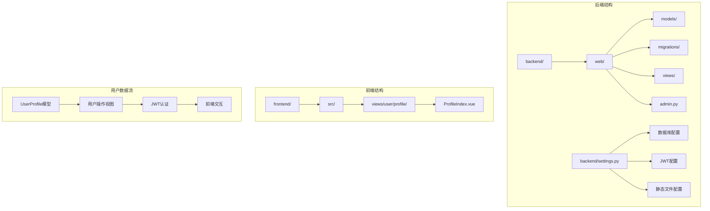
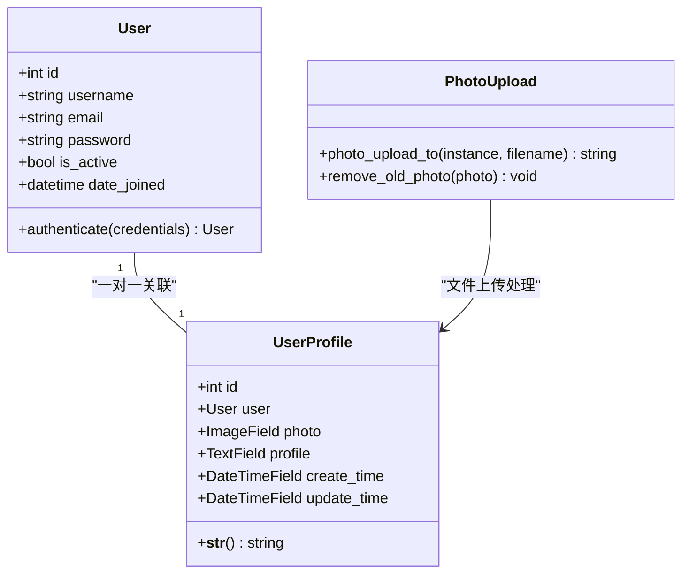
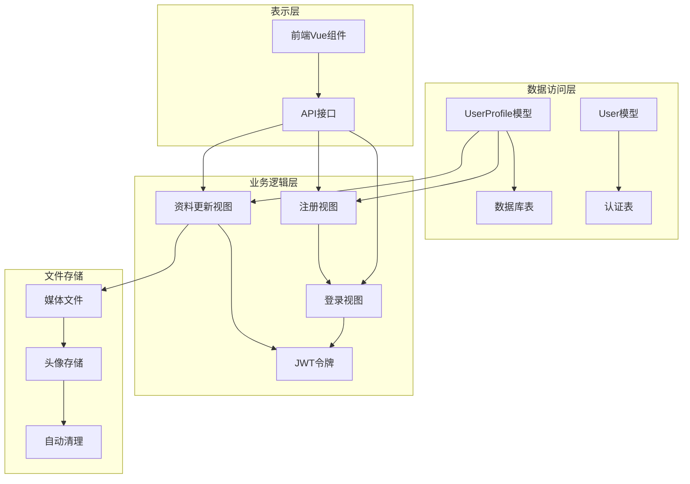
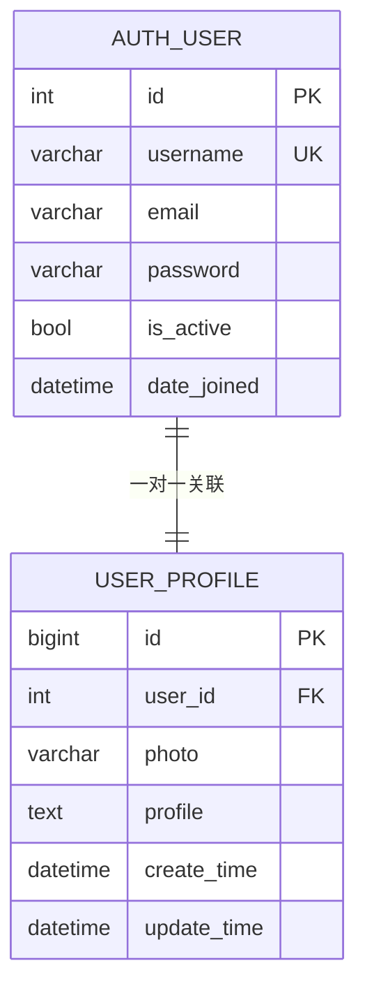
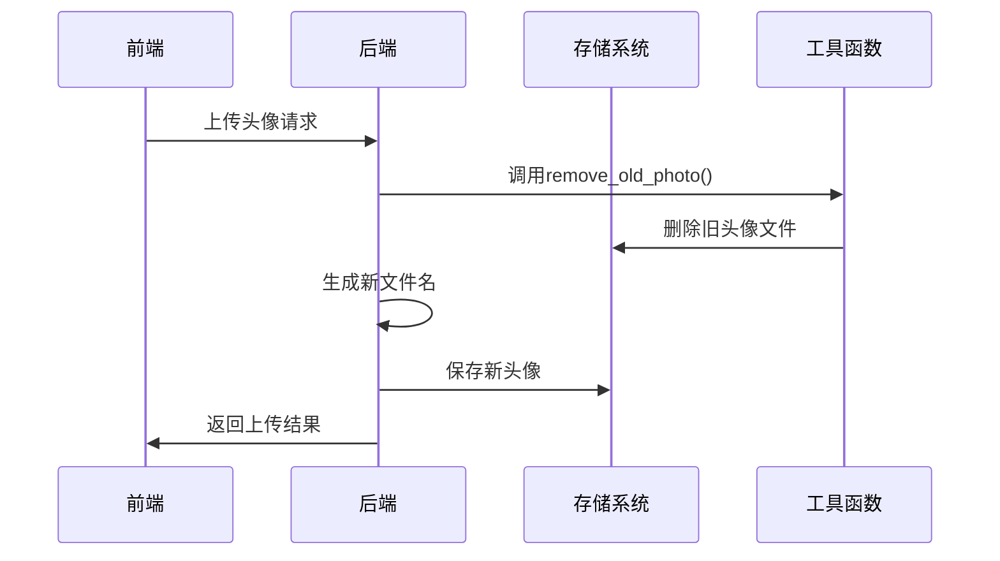
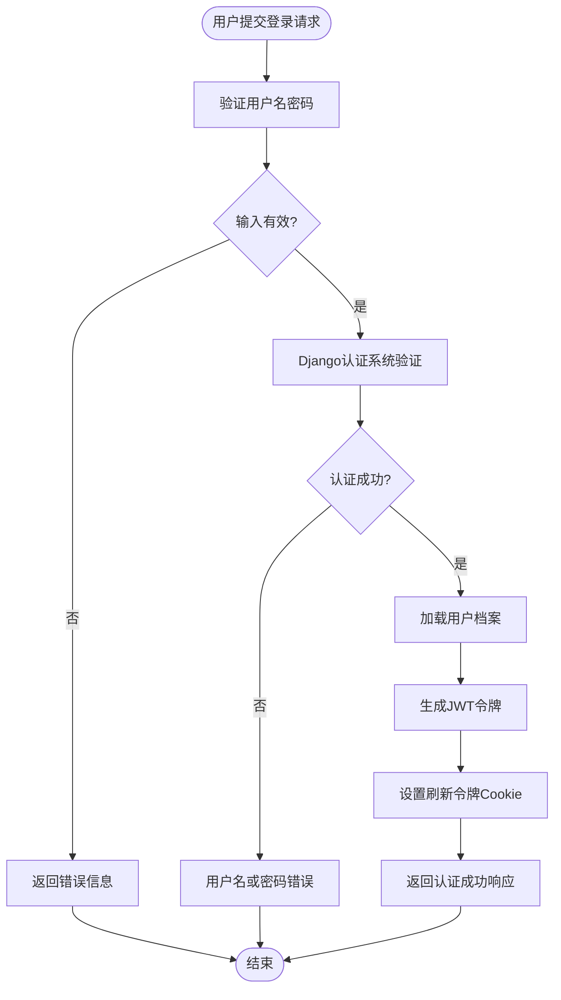
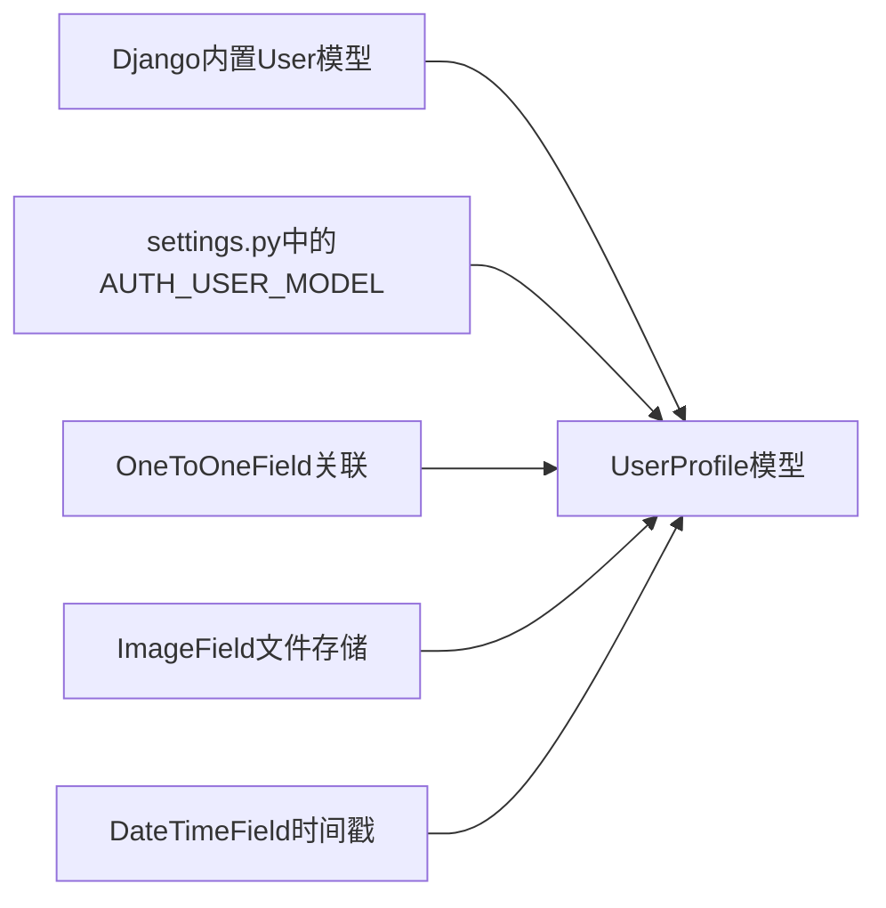
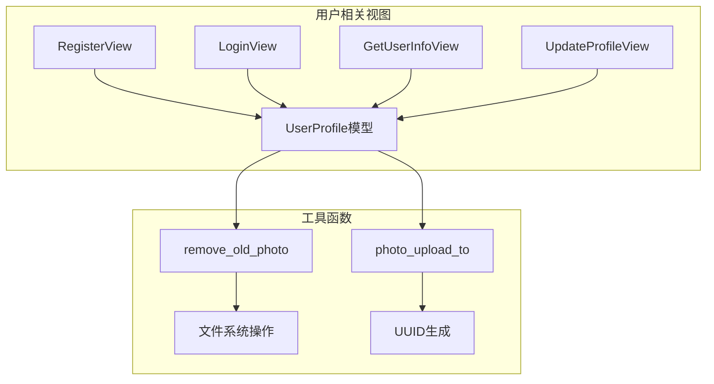
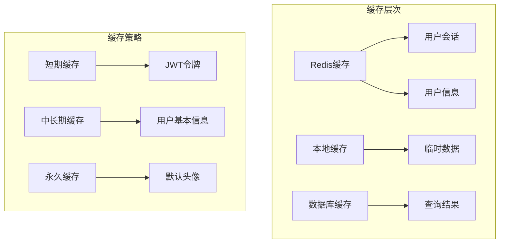

# 数据模型

<cite>
**本文档引用的文件**
- [user.py](file://backend/web/models/user.py)
- [0001_initial.py](file://backend/web/migrations/0001_initial.py)
- [admin.py](file://backend/web/admin.py)
- [get_user_info.py](file://backend/web/views/user/account/get_user_info.py)
- [register.py](file://backend/web/views/user/account/register.py)
- [login.py](file://backend/web/views/user/account/login.py)
- [update.py](file://backend/web/views/user/profile/update.py)
- [photo.py](file://backend/web/views/utils/photo.py)
- [settings.py](file://backend/backend/settings.py)
- [ProfileIndex.vue](file://frontend/src/views/user/profile/ProfileIndex.vue)
</cite>

## 目录
1. [简介](#简介)
2. [项目结构](#项目结构)
3. [核心组件](#核心组件)
4. [架构概览](#架构概览)
5. [详细组件分析](#详细组件分析)
6. [依赖关系分析](#依赖关系分析)
7. [性能考虑](#性能考虑)
8. [故障排除指南](#故障排除指南)
9. [结论](#结论)

## 简介

LLM_AIfriends项目采用Django框架构建，专注于AI朋友社交平台的用户数据管理。本项目实现了基于Django内置User模型的扩展用户档案系统，通过UserProfile模型实现一对一关联，提供完整的用户注册、登录、资料管理和头像上传功能。

项目采用SQLite作为默认数据库，支持JWT令牌认证，实现了前后端分离的现代化Web应用架构。用户数据模型设计简洁高效，满足社交平台的核心需求。

## 项目结构

项目采用标准的Django项目结构，用户相关的核心文件分布如下：

**图表来源**
- [user.py:15-23](file://backend/web/models/user.py#L15-L23)
- [settings.py:79-84](file://backend/backend/settings.py#L79-L84)

**章节来源**
- [user.py:1-23](file://backend/web/models/user.py#L1-L23)
- [settings.py:1-158](file://backend/backend/settings.py#L1-L158)

## 核心组件

### 用户模型体系

项目实现了基于Django内置User模型的扩展架构，通过UserProfile模型实现一对一关联关系。这种设计充分利用了Django的安全认证机制，同时提供了灵活的用户扩展信息存储能力。

**图表来源**
- [user.py:15-23](file://backend/web/models/user.py#L15-L23)
- [user.py:10-13](file://backend/web/models/user.py#L10-L13)
- [photo.py:9-13](file://backend/web/views/utils/photo.py#L9-L13)

**章节来源**
- [user.py:15-23](file://backend/web/models/user.py#L15-L23)
- [photo.py:1-13](file://backend/web/views/utils/photo.py#L1-L13)

## 架构概览

用户数据模型的整体架构采用分层设计，确保了数据的一致性和安全性：

**图表来源**
- [register.py:24-25](file://backend/web/views/user/account/register.py#L24-L25)
- [login.py:21-22](file://backend/web/views/user/account/login.py#L21-L22)
- [update.py:19-48](file://backend/web/views/user/profile/update.py#L19-L48)

## 详细组件分析

### UserProfile模型详解

UserProfile模型是用户数据的核心载体，实现了用户扩展信息的完整存储：

#### 数据表结构

| 字段名 | 数据类型 | 默认值 | 约束条件 | 描述 |
|--------|----------|--------|----------|------|
| id | BigAutoField | 自增 | 主键 | 用户档案唯一标识符 |
| user | OneToOneField | 外键 | 关联User模型 | 与Django内置User的一对一关联 |
| photo | ImageField | default.png | 图片文件限制 | 用户头像存储路径 |
| profile | TextField | "谢谢你的关注" | 最大长度500字符 | 用户个人简介 |
| create_time | DateTimeField | 当前时间 | 时间戳记录 | 用户档案创建时间 |
| update_time | DateTimeField | 当前时间 | 时间戳记录 | 用户档案最后更新时间 |

#### 关系映射分析

**图表来源**
- [0001_initial.py:21-26](file://backend/web/migrations/0001_initial.py#L21-L26)
- [user.py:16](file://backend/web/models/user.py#L16)

#### 字段验证规则

1. **用户名验证**：通过Django内置User模型的唯一性约束保证
2. **头像验证**：通过ImageField的文件类型和大小验证
3. **简介验证**：最大500字符限制，前端和后端双重验证
4. **时间戳验证**：自动维护创建和更新时间

**章节来源**
- [user.py:15-23](file://backend/web/models/user.py#L15-L23)
- [0001_initial.py:20-27](file://backend/web/migrations/0001_initial.py#L20-L27)

### 文件上传处理机制

项目实现了智能的头像上传和管理机制：

#### 上传流程

**图表来源**
- [update.py:39-41](file://backend/web/views/user/profile/update.py#L39-L41)
- [photo.py:9-13](file://backend/web/views/utils/photo.py#L9-L13)

#### 文件命名策略

系统采用UUID生成器确保文件名的唯一性：
- 新文件名格式：`{uuid前10位}.{原始扩展名}`
- 存储路径：`user/photos/{user_id}_{文件名}`
- 避免文件冲突和安全风险

**章节来源**
- [user.py:10-13](file://backend/web/models/user.py#L10-L13)
- [photo.py:1-13](file://backend/web/views/utils/photo.py#L1-L13)

### 认证与授权机制

项目采用JWT（JSON Web Token）进行用户认证，结合Django的权限系统：

#### 登录流程

**图表来源**
- [login.py:10-46](file://backend/web/views/user/account/login.py#L10-L46)
- [register.py:9-42](file://backend/web/views/user/account/register.py#L9-L42)

#### 权限控制

- 所有用户操作API都要求`IsAuthenticated`权限
- JWT令牌配置支持2小时有效期
- 刷新令牌支持7天有效期
- 支持令牌轮换和黑名单机制

**章节来源**
- [login.py:9-46](file://backend/web/views/user/account/login.py#L9-L46)
- [register.py:9-42](file://backend/web/views/user/account/register.py#L9-L42)
- [get_user_info.py:8-25](file://backend/web/views/user/account/get_user_info.py#L8-L25)

## 依赖关系分析

### 数据模型依赖

**图表来源**
- [user.py:4](file://backend/web/models/user.py#L4)
- [user.py:16](file://backend/web/models/user.py#L16)
- [0001_initial.py:14](file://backend/web/migrations/0001_initial.py#L14)

### 视图层依赖

**图表来源**
- [register.py:1-46](file://backend/web/views/user/account/register.py#L1-L46)
- [login.py:1-92](file://backend/web/views/user/account/login.py#L1-L92)
- [update.py:1-63](file://backend/web/views/user/profile/update.py#L1-L63)

**章节来源**
- [admin.py:6-9](file://backend/web/admin.py#L6-L9)
- [settings.py:133-151](file://backend/backend/settings.py#L133-L151)

## 性能考虑

### 数据库优化策略

1. **索引设计**
   - UserProfile的user字段自动建立索引
   - 建议为频繁查询的字段添加复合索引
   - 考虑profile字段的全文搜索索引

2. **查询优化**
   - 使用select_related减少数据库查询次数
   - 实现缓存策略避免重复查询
   - 考虑分页处理大量用户数据

3. **文件存储优化**
   - 实现CDN加速头像访问
   - 添加图片压缩功能
   - 定期清理无效文件

### 缓存策略

**图表来源**
- [settings.py:143-151](file://backend/backend/settings.py#L143-L151)

### 性能监控

- 监控数据库查询执行时间
- 跟踪API响应延迟
- 分析文件上传带宽使用
- 监控内存使用情况

## 故障排除指南

### 常见问题及解决方案

#### 用户名重复错误
**问题描述**：注册时提示用户名已存在
**解决方法**：
- 检查用户名唯一性验证
- 确认数据库索引正常
- 验证前端防重复提交机制

#### 头像上传失败
**问题描述**：头像无法上传或显示错误
**解决方法**：
- 检查MEDIA_ROOT目录权限
- 验证文件类型和大小限制
- 确认文件存储空间充足

#### 认证失败
**问题描述**：登录后无法访问受保护资源
**解决方法**：
- 检查JWT配置和密钥
- 验证令牌有效期设置
- 确认CORS跨域配置

**章节来源**
- [register.py:18-22](file://backend/web/views/user/account/register.py#L18-L22)
- [update.py:35-38](file://backend/web/views/user/profile/update.py#L35-L38)
- [login.py:18-20](file://backend/web/views/user/account/login.py#L18-L20)

## 结论

LLM_AIfriends项目的用户数据模型设计体现了现代Web应用的最佳实践：

### 设计优势
- **安全性**：基于Django内置认证系统，确保用户凭据安全
- **可扩展性**：一对一关联设计便于功能扩展
- **性能**：合理的数据结构和文件存储策略
- **易维护**：清晰的代码结构和完善的错误处理

### 技术亮点
- 智能文件命名和存储机制
- 完整的JWT认证流程
- 前后端双重验证机制
- 自动化的文件清理功能

### 改进建议
- 添加数据库索引优化查询性能
- 实现更完善的错误日志记录
- 考虑添加用户数据备份机制
- 增强文件类型和大小的动态验证

该项目为类似社交平台的用户数据管理提供了优秀的参考实现，其设计思路和架构模式值得在其他项目中借鉴和应用。