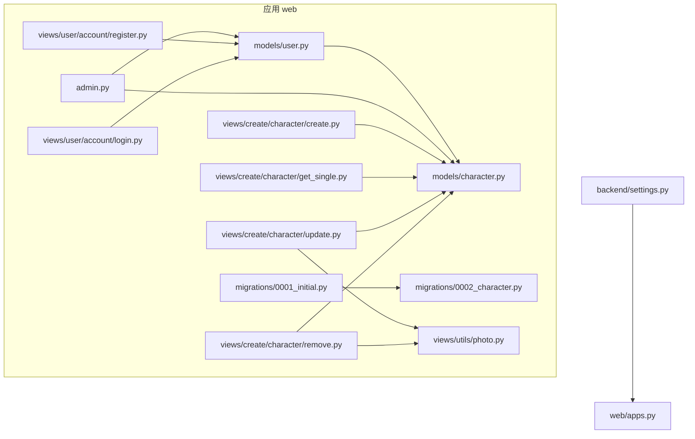
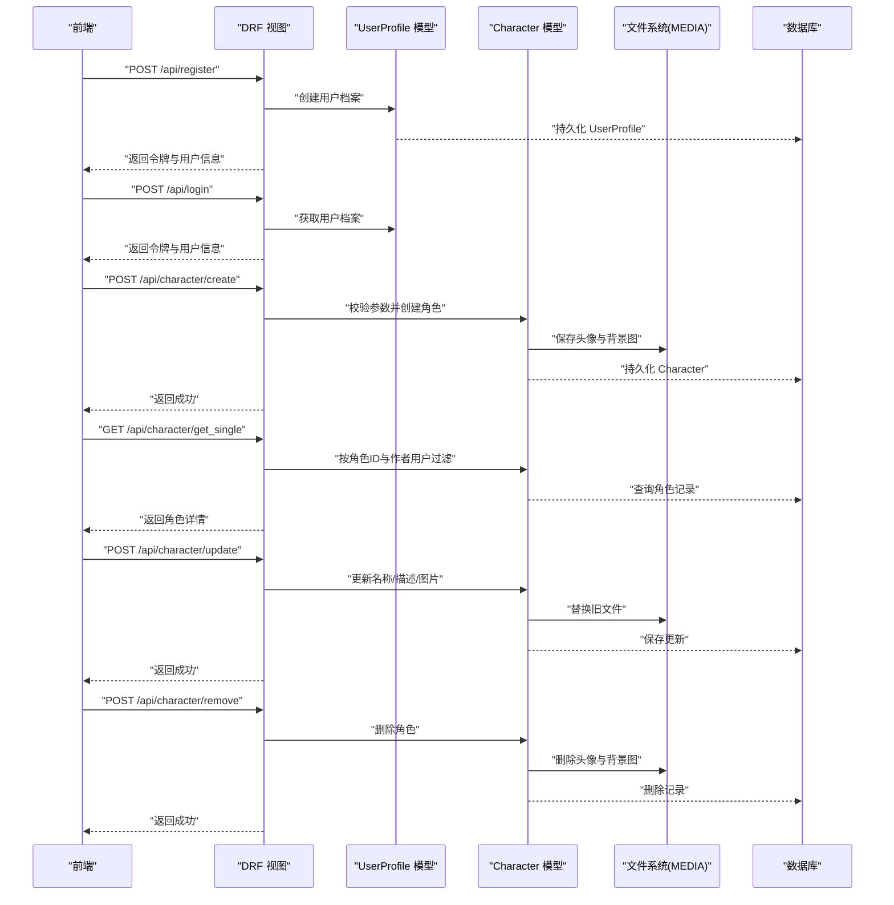
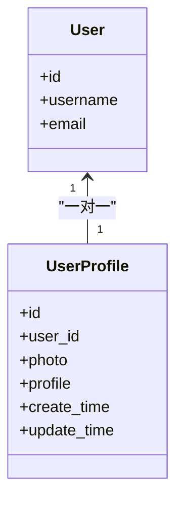
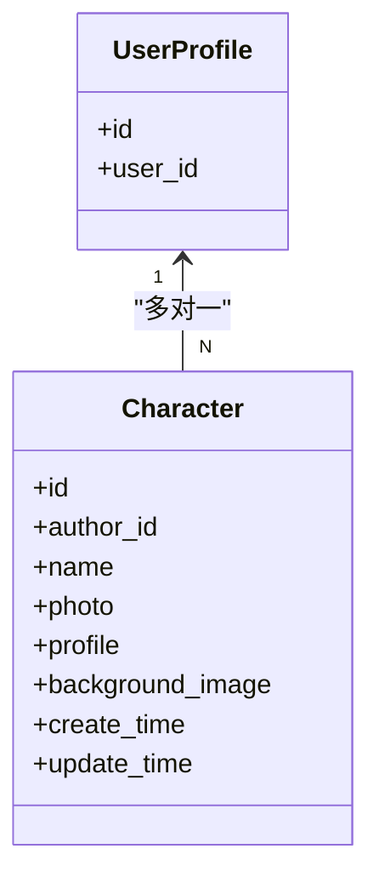
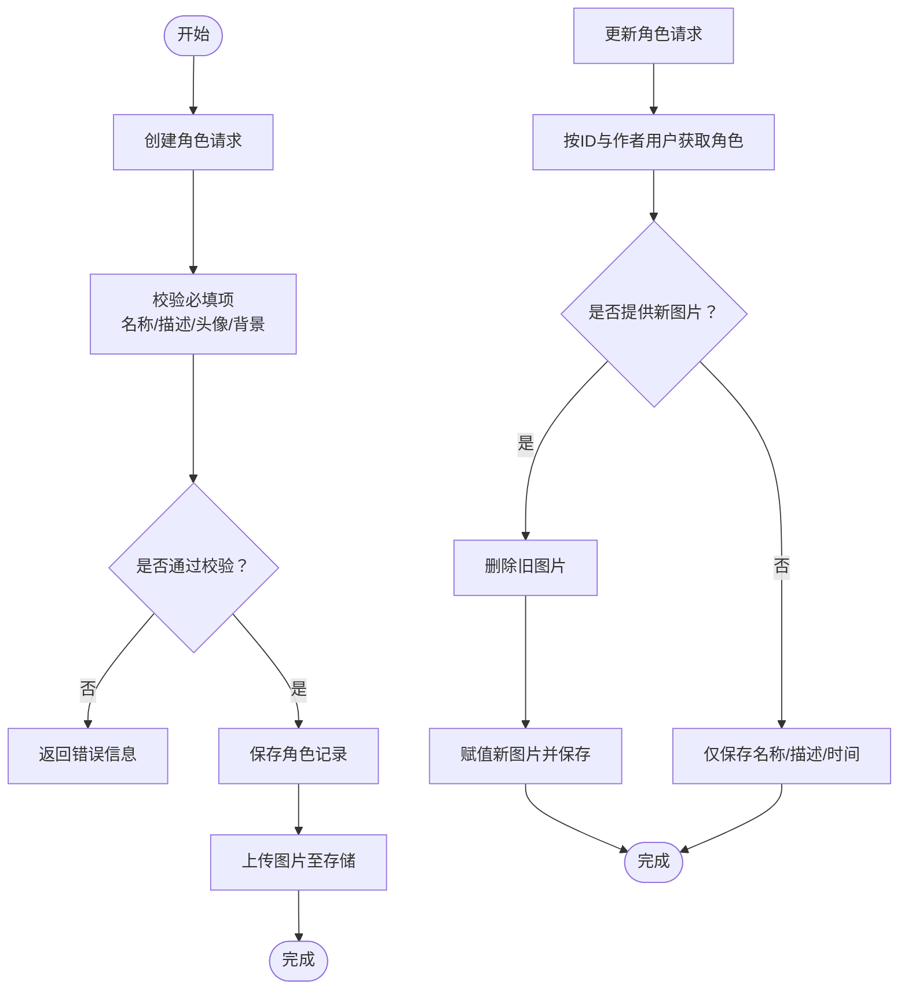
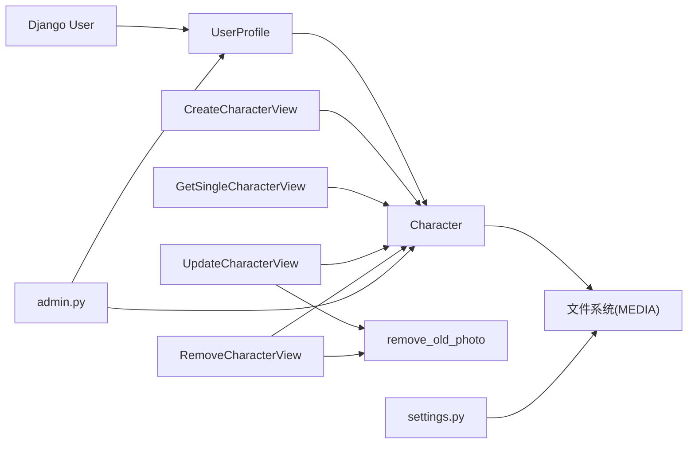
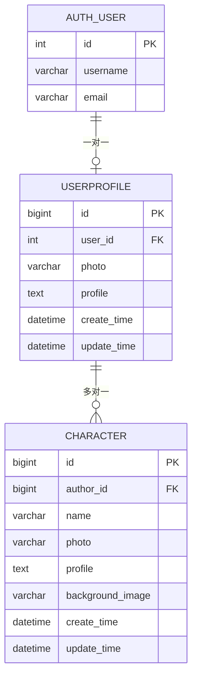

# 数据模型

<cite>
**本文引用的文件**
- [backend/web/models/user.py](file://backend/web/models/user.py)
- [backend/web/models/character.py](file://backend/web/models/character.py)
- [backend/web/migrations/0001_initial.py](file://backend/web/migrations/0001_initial.py)
- [backend/web/migrations/0002_character.py](file://backend/web/migrations/0002_character.py)
- [backend/web/admin.py](file://backend/web/admin.py)
- [backend/web/views/create/character/create.py](file://backend/web/views/create/character/create.py)
- [backend/web/views/create/character/get_single.py](file://backend/web/views/create/character/get_single.py)
- [backend/web/views/create/character/update.py](file://backend/web/views/create/character/update.py)
- [backend/web/views/create/character/remove.py](file://backend/web/views/create/character/remove.py)
- [backend/web/views/utils/photo.py](file://backend/web/views/utils/photo.py)
- [backend/web/views/user/account/register.py](file://backend/web/views/user/account/register.py)
- [backend/web/views/user/account/login.py](file://backend/web/views/user/account/login.py)
- [backend/backend/settings.py](file://backend/backend/settings.py)
- [backend/web/apps.py](file://backend/web/apps.py)
</cite>

## 目录
1. [简介](#简介)
2. [项目结构](#项目结构)
3. [核心组件](#核心组件)
4. [架构总览](#架构总览)
5. [详细组件分析](#详细组件分析)
6. [依赖分析](#依赖分析)
7. [性能考虑](#性能考虑)
8. [故障排查指南](#故障排查指南)
9. [结论](#结论)
10. [附录](#附录)

## 简介
本文件面向 LLM_AIfriends 的 Django ORM 数据模型，聚焦于用户模型（UserProfile）与角色模型（Character）的设计与实现，涵盖字段定义、关系映射、约束规则、索引与查询优化、数据验证与业务约束、数据完整性保障、ER 图与模型关系图、数据字典、迁移策略与版本管理、以及备份恢复建议。内容基于仓库中实际代码进行分析，确保可追溯性与准确性。

## 项目结构
本项目采用 Django 应用分层组织：应用名为 web，核心模型位于 models 子目录，数据库迁移位于 migrations 子目录；后台管理在 admin.py 中注册；视图层通过 DRF 提供 REST 接口，用于角色的增删改查与用户登录注册等操作；设置文件 backend/settings.py 定义了数据库、静态资源、媒体资源、认证与跨域等全局配置。

图表来源
- [backend/web/models/user.py:14-23](file://backend/web/models/user.py#L14-L23)
- [backend/web/models/character.py:21-32](file://backend/web/models/character.py#L21-L32)
- [backend/web/migrations/0001_initial.py:10-31](file://backend/web/migrations/0001_initial.py#L10-L31)
- [backend/web/migrations/0002_character.py:9-30](file://backend/web/migrations/0002_character.py#L9-L30)
- [backend/web/admin.py:1-14](file://backend/web/admin.py#L1-L14)
- [backend/web/views/create/character/create.py:1-51](file://backend/web/views/create/character/create.py#L1-L51)
- [backend/web/views/create/character/get_single.py:1-28](file://backend/web/views/create/character/get_single.py#L1-L28)
- [backend/web/views/create/character/update.py:1-46](file://backend/web/views/create/character/update.py#L1-L46)
- [backend/web/views/create/character/remove.py:1-25](file://backend/web/views/create/character/remove.py#L1-L25)
- [backend/web/views/utils/photo.py:1-11](file://backend/web/views/utils/photo.py#L1-L11)
- [backend/web/views/user/account/register.py:1-45](file://backend/web/views/user/account/register.py#L1-L45)
- [backend/web/views/user/account/login.py:1-46](file://backend/web/views/user/account/login.py#L1-L46)
- [backend/backend/settings.py:129-131](file://backend/backend/settings.py#L129-L131)
- [backend/web/apps.py:1-6](file://backend/web/apps.py#L1-L6)

章节来源
- [backend/web/apps.py:1-6](file://backend/web/apps.py#L1-L6)
- [backend/backend/settings.py:129-131](file://backend/backend/settings.py#L129-L131)

## 核心组件
本节对两个核心模型进行深入解析：UserProfile 与 Character。重点说明字段语义、类型、默认值、上传路径策略、时间戳更新机制、以及与 Django 内置 User 的一对一关系。

- 用户档案模型（UserProfile）
  - 关系：与 Django 内置 User 为一对一关系，删除用户时级联删除档案。
  - 字段要点：
    - 头像 photo：ImageField，默认路径与动态上传路径策略，上传目录按用户 ID 前缀组织。
    - 个人简介 profile：TextField，最大长度限制。
    - 时间字段：create_time、update_time 默认为当前时间，支持后续更新。
  - 上传路径策略：上传函数根据文件扩展名生成唯一短文件名，避免冲突并便于按作者归档。

- 角色模型（Character）
  - 关系：与 UserProfile 为多对一关系（外键），删除作者档案时级联删除其所有角色。
  - 字段要点：
    - 名称 name：字符长度上限。
    - 头像 photo、背景图 background_image：均使用独立上传路径策略，路径包含作者用户 ID 前缀。
    - 角色描述 profile：长文本字段，支持较大篇幅描述。
    - 时间字段：create_time、update_time 默认为当前时间，更新时可手动刷新。
  - 业务约束：视图层对必填项进行校验，防止空值写入。

章节来源
- [backend/web/models/user.py:14-23](file://backend/web/models/user.py#L14-L23)
- [backend/web/models/character.py:21-32](file://backend/web/models/character.py#L21-L32)

## 架构总览
下图展示数据模型与关键视图之间的交互关系，体现从用户注册/登录到角色创建、读取、更新与删除的完整流程。

图表来源
- [backend/web/views/user/account/register.py:9-45](file://backend/web/views/user/account/register.py#L9-L45)
- [backend/web/views/user/account/login.py:9-46](file://backend/web/views/user/account/login.py#L9-L46)
- [backend/web/views/create/character/create.py:9-51](file://backend/web/views/create/character/create.py#L9-L51)
- [backend/web/views/create/character/get_single.py:8-28](file://backend/web/views/create/character/get_single.py#L8-L28)
- [backend/web/views/create/character/update.py:10-46](file://backend/web/views/create/character/update.py#L10-L46)
- [backend/web/views/create/character/remove.py:9-25](file://backend/web/views/create/character/remove.py#L9-L25)
- [backend/web/views/utils/photo.py:6-11](file://backend/web/views/utils/photo.py#L6-L11)
- [backend/web/models/user.py:14-23](file://backend/web/models/user.py#L14-L23)
- [backend/web/models/character.py:21-32](file://backend/web/models/character.py#L21-L32)

## 详细组件分析

### 用户模型（UserProfile）分析
- 关系映射
  - 一对一关联 Django 内置 User，on_delete=CASCADE，确保用户删除时同步清理档案。
- 字段与约束
  - 头像 photo：ImageField，提供默认路径与自定义上传路径函数，上传路径包含用户标识，便于按用户归档与清理。
  - 个人简介 profile：TextField，带最大长度限制，防止过长文本占用存储。
  - 时间字段：create_time、update_time 默认为当前时间，便于审计与排序。
- 查询与优化
  - 后台管理 raw_id_fields 指定 user 字段，减少大对象渲染开销。
- 数据完整性
  - 与 User 的一对一关系天然保证“一个用户仅有一个档案”。
- 业务逻辑
  - 注册接口在创建 User 后自动创建 UserProfile，确保用户体系与档案体系一致。

图表来源
- [backend/web/models/user.py:14-23](file://backend/web/models/user.py#L14-L23)
- [backend/web/admin.py:6-9](file://backend/web/admin.py#L6-L9)
- [backend/web/views/user/account/register.py:22-23](file://backend/web/views/user/account/register.py#L22-L23)

章节来源
- [backend/web/models/user.py:14-23](file://backend/web/models/user.py#L14-L23)
- [backend/web/admin.py:6-9](file://backend/web/admin.py#L6-L9)
- [backend/web/views/user/account/register.py:22-23](file://backend/web/views/user/account/register.py#L22-L23)

### 角色模型（Character）分析
- 关系映射
  - 外键关联 UserProfile，on_delete=CASCADE，作者档案删除时级联删除其全部角色。
- 字段与约束
  - 名称 name：字符长度上限，保证名称规范。
  - 头像 photo、背景图 background_image：ImageField，上传路径包含作者用户 ID 前缀，避免跨用户文件冲突。
  - 角色描述 profile：长文本字段，支持较大篇幅描述。
  - 时间字段：create_time、update_time 默认为当前时间。
- 查询与优化
  - 视图层在读取单个角色时，同时按 author__user 进行过滤，确保仅能访问自身角色，避免越权。
  - 更新与删除时，先清理旧文件再写入新文件，保持存储一致性。
- 数据完整性
  - 外键约束保证角色归属有效；视图层必填校验防止空值写入。

图表来源
- [backend/web/models/character.py:21-32](file://backend/web/models/character.py#L21-L32)
- [backend/web/views/create/character/get_single.py:13](file://backend/web/views/create/character/get_single.py#L13)
- [backend/web/views/create/character/update.py:15](file://backend/web/views/create/character/update.py#L15)
- [backend/web/views/create/character/remove.py:14](file://backend/web/views/create/character/remove.py#L14)

章节来源
- [backend/web/models/character.py:21-32](file://backend/web/models/character.py#L21-L32)
- [backend/web/views/create/character/get_single.py:13](file://backend/web/views/create/character/get_single.py#L13)
- [backend/web/views/create/character/update.py:15](file://backend/web/views/create/character/update.py#L15)
- [backend/web/views/create/character/remove.py:14](file://backend/web/views/create/character/remove.py#L14)

### 数据验证与业务约束
- 角色创建
  - 必填项校验：名称、角色描述、头像、聊天背景均需提供，否则返回错误提示。
  - 截断策略：角色描述按最大长度截断，避免超出字段上限。
- 角色读取
  - 通过 author__user 限定当前用户，防止越权读取他人角色。
- 角色更新
  - 可选更新头像与背景图：若提供新文件则替换旧文件并删除旧文件；名称与描述同样进行必填与长度控制。
  - 更新时间统一刷新，便于排序与审计。
- 角色删除
  - 删除前先删除旧头像与背景图，避免垃圾文件残留。
- 用户注册/登录
  - 注册：用户名与密码非空检查、重复用户名检测；创建用户后自动创建档案并发放 JWT。
  - 登录：用户名与密码非空检查、认证失败处理、成功后发放 JWT 并返回用户档案信息。

图表来源
- [backend/web/views/create/character/create.py:11-46](file://backend/web/views/create/character/create.py#L11-L46)
- [backend/web/views/create/character/get_single.py:10-23](file://backend/web/views/create/character/get_single.py#L10-L23)
- [backend/web/views/create/character/update.py:12-38](file://backend/web/views/create/character/update.py#L12-L38)
- [backend/web/views/create/character/remove.py:11-17](file://backend/web/views/create/character/remove.py#L11-L17)
- [backend/web/views/user/account/register.py:10-32](file://backend/web/views/user/account/register.py#L10-L32)
- [backend/web/views/user/account/login.py:9-38](file://backend/web/views/user/account/login.py#L9-L38)

章节来源
- [backend/web/views/create/character/create.py:11-46](file://backend/web/views/create/character/create.py#L11-L46)
- [backend/web/views/create/character/get_single.py:10-23](file://backend/web/views/create/character/get_single.py#L10-L23)
- [backend/web/views/create/character/update.py:12-38](file://backend/web/views/create/character/update.py#L12-L38)
- [backend/web/views/create/character/remove.py:11-17](file://backend/web/views/create/character/remove.py#L11-L17)
- [backend/web/views/user/account/register.py:10-32](file://backend/web/views/user/account/register.py#L10-L32)
- [backend/web/views/user/account/login.py:9-38](file://backend/web/views/user/account/login.py#L9-L38)

### 数据字典
- 表：UserProfile
  - 字段
    - id：主键
    - user：与 User 的一对一关联
    - photo：头像，ImageField
    - profile：个人简介，TextField，最大长度受约束
    - create_time：创建时间
    - update_time：更新时间
- 表：Character
  - 字段
    - id：主键
    - author：与 UserProfile 的外键关联
    - name：角色名称，字符长度上限
    - photo：头像，ImageField
    - profile：角色描述，长文本
    - background_image：聊天背景，ImageField
    - create_time：创建时间
    - update_time：更新时间

章节来源
- [backend/web/migrations/0001_initial.py:19-28](file://backend/web/migrations/0001_initial.py#L19-L28)
- [backend/web/migrations/0002_character.py:16-27](file://backend/web/migrations/0002_character.py#L16-L27)
- [backend/web/models/user.py:14-23](file://backend/web/models/user.py#L14-L23)
- [backend/web/models/character.py:21-32](file://backend/web/models/character.py#L21-L32)

## 依赖分析
- 模型间依赖
  - Character 依赖 UserProfile（外键），UserProfile 依赖 Django 内置 User（一对一）。
- 视图层依赖
  - 角色 CRUD 视图依赖 Character 模型；更新/删除视图依赖文件清理工具；注册/登录视图依赖 UserProfile。
- 后台管理依赖
  - admin.py 注册模型并启用 raw_id_fields 以提升列表页性能。
- 配置依赖
  - settings.py 中的 MEDIA 配置决定图片上传路径与访问 URL；REST_FRAMEWORK 与 SIMPLE_JWT 配置影响认证流程。

图表来源
- [backend/web/models/user.py:14-23](file://backend/web/models/user.py#L14-L23)
- [backend/web/models/character.py:21-32](file://backend/web/models/character.py#L21-L32)
- [backend/web/views/create/character/create.py:9-51](file://backend/web/views/create/character/create.py#L9-L51)
- [backend/web/views/create/character/get_single.py:8-28](file://backend/web/views/create/character/get_single.py#L8-L28)
- [backend/web/views/create/character/update.py:10-46](file://backend/web/views/create/character/update.py#L10-L46)
- [backend/web/views/create/character/remove.py:9-25](file://backend/web/views/create/character/remove.py#L9-L25)
- [backend/web/views/utils/photo.py:6-11](file://backend/web/views/utils/photo.py#L6-L11)
- [backend/web/admin.py:6-14](file://backend/web/admin.py#L6-L14)
- [backend/backend/settings.py:129-131](file://backend/backend/settings.py#L129-L131)

章节来源
- [backend/web/admin.py:6-14](file://backend/web/admin.py#L6-L14)
- [backend/backend/settings.py:129-131](file://backend/backend/settings.py#L129-L131)

## 性能考虑
- 查询优化
  - 在读取单个角色时，通过 author__user 进行过滤，避免全表扫描与越权风险。
  - 后台管理启用 raw_id_fields，减少外键字段的下拉渲染成本。
- 存储与IO
  - 图片上传采用唯一短文件名与按作者前缀归档，降低文件冲突概率与清理难度。
  - 更新/删除时先清理旧文件，避免磁盘碎片与冗余文件积累。
- 认证与缓存
  - 使用 JWT 短期访问令牌与刷新令牌轮换，结合黑名单与旋转策略，平衡安全与性能。
- 数据库层面
  - 当前模型未显式声明索引；如需按作者、名称、时间等字段高频查询，可在迁移中添加相应索引以提升查询效率。

章节来源
- [backend/web/views/create/character/get_single.py:13](file://backend/web/views/create/character/get_single.py#L13)
- [backend/web/admin.py:8](file://backend/web/admin.py#L8)
- [backend/web/views/utils/photo.py:6-11](file://backend/web/views/utils/photo.py#L6-L11)
- [backend/backend/settings.py:136-151](file://backend/backend/settings.py#L136-L151)

## 故障排查指南
- 常见问题与定位
  - 创建角色时报错：检查必填项是否为空、文件是否上传成功、描述长度是否超过上限。
  - 读取角色失败：确认请求参数中的角色ID与当前用户是否匹配；检查 author__user 过滤条件。
  - 更新/删除失败：确认当前用户是否为角色作者；检查旧文件是否存在且可删除。
  - 注册/登录异常：检查用户名与密码是否为空、用户名是否重复、JWT 生成与 Cookie 设置是否正常。
- 日志与调试
  - 所有视图均包含异常捕获与统一错误响应，便于快速定位问题。
  - 建议在开发环境开启 DEBUG 并结合 Django 日志输出进行问题复现。
- 数据一致性
  - 更新/删除流程中，务必先清理旧文件再写入新文件，避免出现悬空引用或磁盘空间浪费。

章节来源
- [backend/web/views/create/character/create.py:47-50](file://backend/web/views/create/character/create.py#L47-L50)
- [backend/web/views/create/character/get_single.py:24-27](file://backend/web/views/create/character/get_single.py#L24-L27)
- [backend/web/views/create/character/update.py:42-45](file://backend/web/views/create/character/update.py#L42-L45)
- [backend/web/views/create/character/remove.py:21-24](file://backend/web/views/create/character/remove.py#L21-L24)
- [backend/web/views/user/account/register.py:42-45](file://backend/web/views/user/account/register.py#L42-L45)
- [backend/web/views/user/account/login.py:42-45](file://backend/web/views/user/account/login.py#L42-L45)

## 结论
本数据模型围绕用户与角色两大实体构建，通过清晰的一对一与多对一关系，配合严格的字段约束与视图层校验，实现了良好的数据完整性与业务可控性。上传路径策略与文件生命周期管理进一步提升了系统的可维护性。建议在生产环境中补充索引、完善错误日志与监控，并制定标准化的迁移与备份策略以保障长期稳定运行。

## 附录

### ER 图

图表来源
- [backend/web/migrations/0001_initial.py:19-28](file://backend/web/migrations/0001_initial.py#L19-L28)
- [backend/web/migrations/0002_character.py:16-27](file://backend/web/migrations/0002_character.py#L16-L27)
- [backend/web/models/user.py:14-23](file://backend/web/models/user.py#L14-L23)
- [backend/web/models/character.py:21-32](file://backend/web/models/character.py#L21-L32)

### 迁移策略与版本管理
- 初始迁移
  - 0001_initial：创建 UserProfile 表，包含与 User 的一对一关系及基础字段。
  - 0002_character：创建 Character 表，包含与 UserProfile 的外键关系及角色相关字段。
- 版本演进
  - 新增字段时建议新增迁移文件，避免直接修改现有迁移，确保历史可回溯。
  - 对外键、索引、字段类型变更应谨慎评估兼容性与性能影响。
- 回滚与修复
  - 可使用迁移命令进行回滚与重建，建议在测试环境先行验证。
  - 若需修复历史数据，应在迁移中编写数据修复逻辑并保留幂等性。

章节来源
- [backend/web/migrations/0001_initial.py:10-31](file://backend/web/migrations/0001_initial.py#L10-L31)
- [backend/web/migrations/0002_character.py:9-30](file://backend/web/migrations/0002_character.py#L9-L30)

### 数据备份与恢复方案
- 数据库备份
  - SQLite 场景可直接复制 db.sqlite3 文件作为备份；生产环境建议使用数据库导出/导入工具进行周期性备份。
- 媒体文件备份
  - 媒体根目录（MEDIA_ROOT）下的图片文件需单独备份，建议按作者前缀归档以便恢复。
- 恢复流程
  - 先恢复数据库，再恢复媒体文件，最后验证角色与用户关联是否一致。
  - 恢复后执行迁移以确保表结构与版本一致。

章节来源
- [backend/backend/settings.py:129-131](file://backend/backend/settings.py#L129-L131)