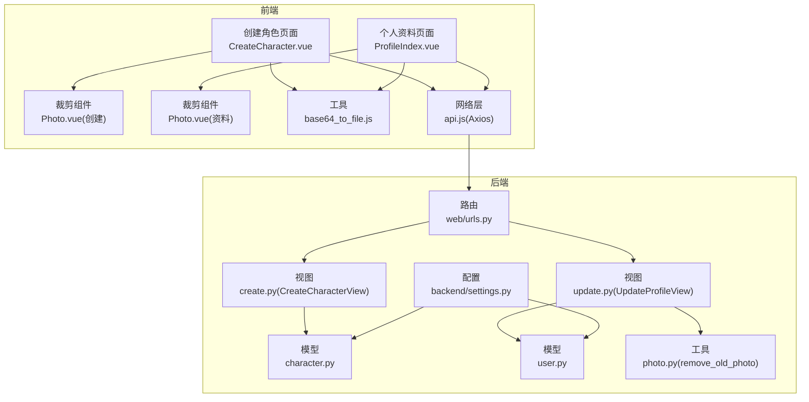
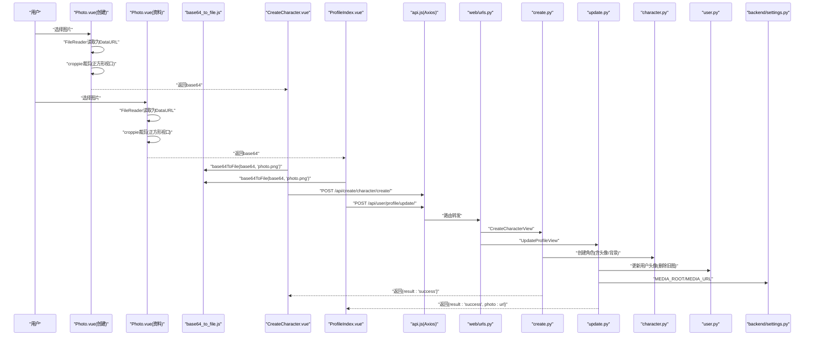
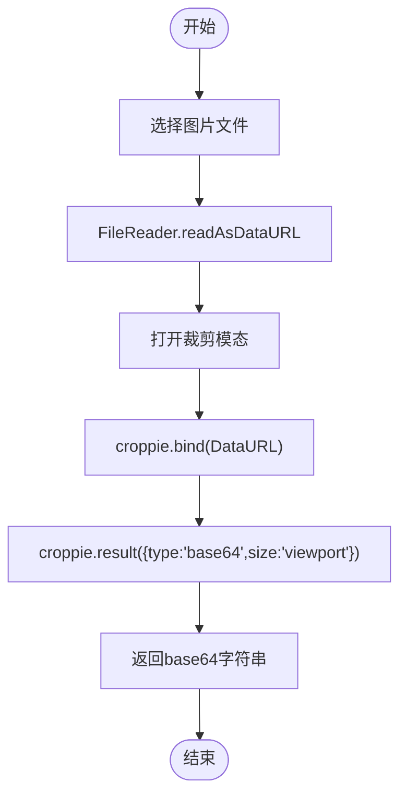
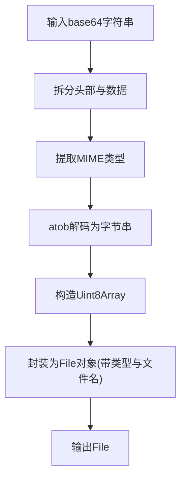
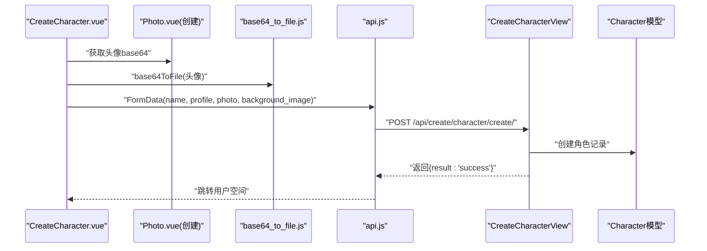
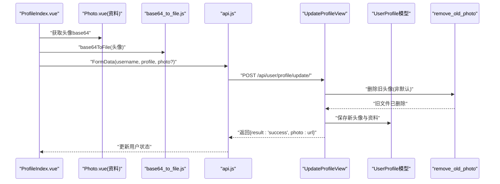
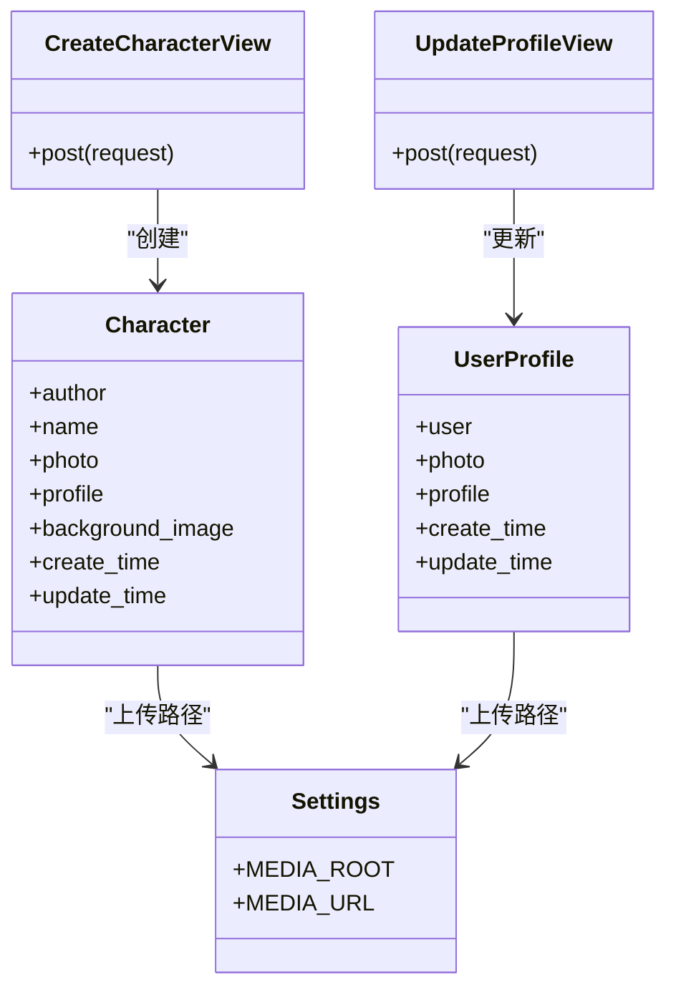
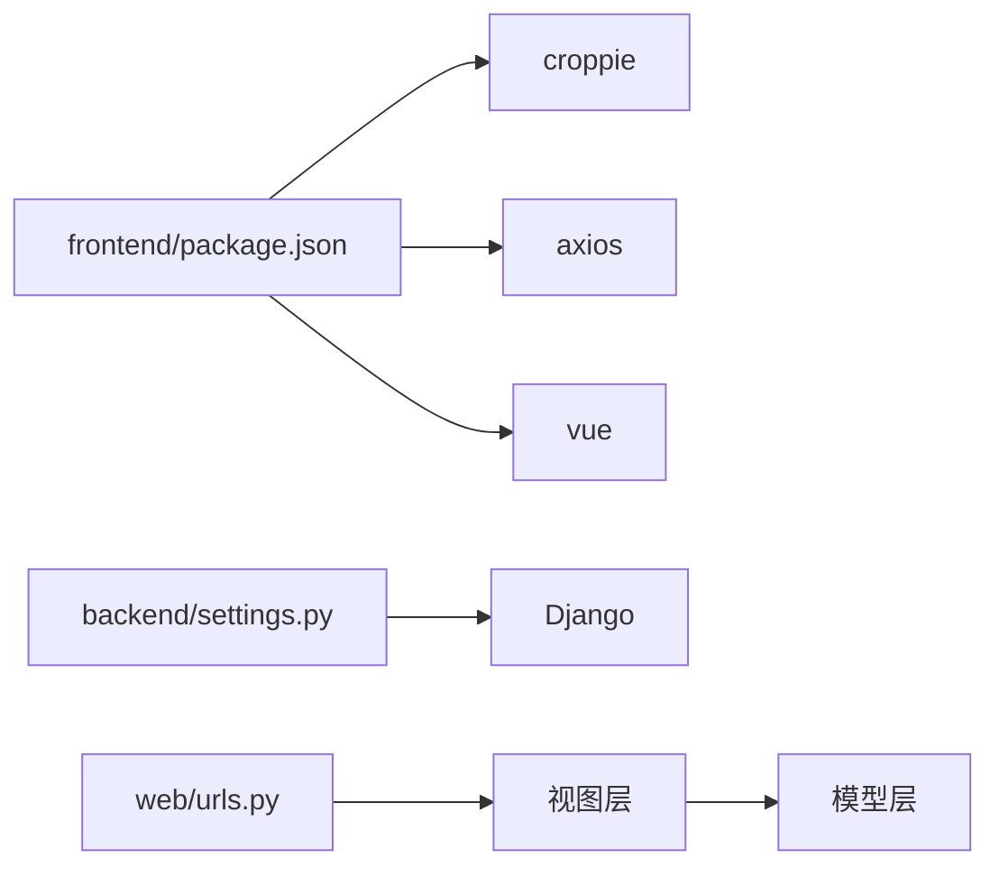
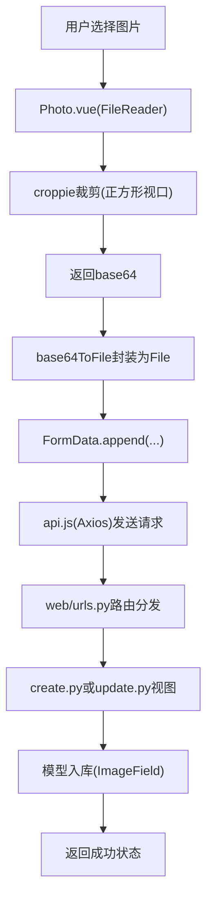

# 文件上传与处理

<cite>
**本文引用的文件**
- [backend/web/views/utils/photo.py](file://backend/web/views/utils/photo.py)
- [frontend/src/js/utils/base64_to_file.js](file://frontend/src/js/utils/base64_to_file.js)
- [frontend/src/views/create/character/components/Photo.vue](file://frontend/src/views/create/character/components/Photo.vue)
- [frontend/src/views/user/profile/components/Photo.vue](file://frontend/src/views/user/profile/components/Photo.vue)
- [backend/web/models/character.py](file://backend/web/models/character.py)
- [backend/web/views/create/character/create.py](file://backend/web/views/create/character/create.py)
- [backend/web/views/user/profile/update.py](file://backend/web/views/user/profile/update.py)
- [backend/backend/settings.py](file://backend/backend/settings.py)
- [frontend/src/js/http/api.js](file://frontend/src/js/http/api.js)
- [frontend/src/views/create/character/CreateCharacter.vue](file://frontend/src/views/create/character/CreateCharacter.vue)
- [frontend/src/views/user/profile/ProfileIndex.vue](file://frontend/src/views/user/profile/ProfileIndex.vue)
- [backend/web/models/user.py](file://backend/web/models/user.py)
- [backend/web/urls.py](file://backend/web/urls.py)
- [backend/backend/urls.py](file://backend/backend/urls.py)
- [frontend/package.json](file://frontend/package.json)
</cite>

## 目录
1. [引言](#引言)
2. [项目结构](#项目结构)
3. [核心组件](#核心组件)
4. [架构总览](#架构总览)
5. [详细组件分析](#详细组件分析)
6. [依赖分析](#依赖分析)
7. [性能考虑](#性能考虑)
8. [故障排查指南](#故障排查指南)
9. [结论](#结论)
10. [附录](#附录)

## 引言
本技术文档围绕 LLM_AIfriends 的“文件上传与处理”能力展开，重点覆盖以下方面：
- 图片上传流程：从前端 croppie 裁剪到后端文件入库的完整链路
- 前端裁剪功能实现：基于 croppie 的图片裁剪交互与 Base64 编码转换
- 后端文件处理机制：模型字段、上传路径策略、旧图清理与安全校验
- 安全与合规：格式验证、大小限制建议与潜在风险点
- 错误处理与性能优化：请求拦截、重试与缓存策略
- 存储与分发：本地存储配置、CDN 集成思路与缓存策略

## 项目结构
该功能涉及前后端协作的关键模块如下：
- 前端
  - 组件层：用户头像裁剪 Photo.vue（两个复用组件）
  - 工具层：Base64 转 File 工具
  - 页面层：创建角色与个人资料编辑页面
  - 网络层：统一 Axios 实例与 JWT 自动注入
- 后端
  - 模型层：用户与角色的图片字段及上传路径策略
  - 视图层：创建角色与更新用户资料的接口
  - 配置层：Django MEDIA 配置、路由与静态资源映射

图表来源
- [frontend/src/views/create/character/CreateCharacter.vue:1-84](file://frontend/src/views/create/character/CreateCharacter.vue#L1-L84)
- [frontend/src/views/user/profile/ProfileIndex.vue:1-71](file://frontend/src/views/user/profile/ProfileIndex.vue#L1-L71)
- [frontend/src/views/create/character/components/Photo.vue:1-99](file://frontend/src/views/create/character/components/Photo.vue#L1-L99)
- [frontend/src/views/user/profile/components/Photo.vue:1-100](file://frontend/src/views/user/profile/components/Photo.vue#L1-L100)
- [frontend/src/js/utils/base64_to_file.js:1-10](file://frontend/src/js/utils/base64_to_file.js#L1-L10)
- [frontend/src/js/http/api.js:1-93](file://frontend/src/js/http/api.js#L1-L93)
- [backend/web/urls.py:1-33](file://backend/web/urls.py#L1-L33)
- [backend/backend/settings.py:129-131](file://backend/backend/settings.py#L129-L131)
- [backend/web/models/character.py:9-28](file://backend/web/models/character.py#L9-L28)
- [backend/web/models/user.py:8-22](file://backend/web/models/user.py#L8-L22)
- [backend/web/views/create/character/create.py:1-51](file://backend/web/views/create/character/create.py#L1-L51)
- [backend/web/views/user/profile/update.py:1-53](file://backend/web/views/user/profile/update.py#L1-L53)
- [backend/web/views/utils/photo.py:1-11](file://backend/web/views/utils/photo.py#L1-L11)

章节来源
- [backend/backend/settings.py:129-131](file://backend/backend/settings.py#L129-L131)
- [backend/web/urls.py:1-33](file://backend/web/urls.py#L1-L33)
- [frontend/package.json:14-21](file://frontend/package.json#L14-L21)

## 核心组件
- 前端裁剪组件（Photo.vue）
  - 使用 croppie 进行图片裁剪，支持正方形视口与边界约束
  - 通过 FileReader 将选择的图片转为 DataURL 打开裁剪模态
  - 裁剪完成后以 base64 返回，供后续提交
- Base64 转 File 工具
  - 解析 base64 头部提取 MIME 类型，再转为 Blob 并封装为 File 对象
  - 用于将 croppie 输出的 base64 注入到 FormData 中提交
- 创建角色页面（CreateCharacter.vue）
  - 收集头像、名称、角色介绍与背景图
  - 将 base64 通过工具转换为 File 后提交到后端
- 个人资料编辑页面（ProfileIndex.vue）
  - 支持头像裁剪与更新用户名、简介
  - 仅当头像发生变化时才提交新文件
- 后端视图
  - 创建角色：接收 name、profile、photo、background_image，进行非空校验并入库
  - 更新用户资料：接收 username、profile、photo；若提供新头像则删除旧图并保存新图
- 模型与存储
  - 用户头像与角色头像、背景图均使用 ImageField
  - 上传路径采用动态生成策略，避免同名冲突
- 工具函数
  - 删除旧头像：仅当非默认头像时执行磁盘删除

章节来源
- [frontend/src/views/create/character/components/Photo.vue:1-99](file://frontend/src/views/create/character/components/Photo.vue#L1-L99)
- [frontend/src/views/user/profile/components/Photo.vue:1-100](file://frontend/src/views/user/profile/components/Photo.vue#L1-L100)
- [frontend/src/js/utils/base64_to_file.js:1-10](file://frontend/src/js/utils/base64_to_file.js#L1-L10)
- [frontend/src/views/create/character/CreateCharacter.vue:1-84](file://frontend/src/views/create/character/CreateCharacter.vue#L1-L84)
- [frontend/src/views/user/profile/ProfileIndex.vue:1-71](file://frontend/src/views/user/profile/ProfileIndex.vue#L1-L71)
- [backend/web/views/create/character/create.py:1-51](file://backend/web/views/create/character/create.py#L1-L51)
- [backend/web/views/user/profile/update.py:1-53](file://backend/web/views/user/profile/update.py#L1-L53)
- [backend/web/models/character.py:9-28](file://backend/web/models/character.py#L9-L28)
- [backend/web/models/user.py:8-22](file://backend/web/models/user.py#L8-L22)
- [backend/web/views/utils/photo.py:1-11](file://backend/web/views/utils/photo.py#L1-L11)

## 架构总览
下图展示了从用户选择图片到后端入库的整体流程，包括前端裁剪、Base64 转换、表单提交与后端校验。

图表来源
- [frontend/src/views/create/character/components/Photo.vue:19-57](file://frontend/src/views/create/character/components/Photo.vue#L19-L57)
- [frontend/src/views/user/profile/components/Photo.vue:19-58](file://frontend/src/views/user/profile/components/Photo.vue#L19-L58)
- [frontend/src/js/utils/base64_to_file.js:1-10](file://frontend/src/js/utils/base64_to_file.js#L1-L10)
- [frontend/src/views/create/character/CreateCharacter.vue:21-59](file://frontend/src/views/create/character/CreateCharacter.vue#L21-L59)
- [frontend/src/views/user/profile/ProfileIndex.vue:17-47](file://frontend/src/views/user/profile/ProfileIndex.vue#L17-L47)
- [frontend/src/js/http/api.js:16-27](file://frontend/src/js/http/api.js#L16-L27)
- [backend/web/urls.py:16-32](file://backend/web/urls.py#L16-L32)
- [backend/web/views/create/character/create.py:9-50](file://backend/web/views/create/character/create.py#L9-L50)
- [backend/web/views/user/profile/update.py:11-52](file://backend/web/views/user/profile/update.py#L11-L52)
- [backend/web/models/character.py:21-32](file://backend/web/models/character.py#L21-L32)
- [backend/web/models/user.py:14-22](file://backend/web/models/user.py#L14-L22)
- [backend/backend/settings.py:129-131](file://backend/backend/settings.py#L129-L131)

## 详细组件分析

### 前端裁剪组件（Photo.vue）
- croppie 初始化参数
  - 视口：正方形，尺寸固定
  - 边界：限定裁剪区域
  - 方向矫正：支持图片方向信息
  - 边界强制：防止越界
- 数据流
  - 选择文件 -> FileReader.readAsDataURL -> 打开模态 -> croppie.bind -> crop -> 返回 base64
- 生命周期
  - 组件卸载时销毁 croppie 实例，释放资源

图表来源
- [frontend/src/views/create/character/components/Photo.vue:19-57](file://frontend/src/views/create/character/components/Photo.vue#L19-L57)
- [frontend/src/views/user/profile/components/Photo.vue:19-58](file://frontend/src/views/user/profile/components/Photo.vue#L19-L58)

章节来源
- [frontend/src/views/create/character/components/Photo.vue:1-99](file://frontend/src/views/create/character/components/Photo.vue#L1-L99)
- [frontend/src/views/user/profile/components/Photo.vue:1-100](file://frontend/src/views/user/profile/components/Photo.vue#L1-L100)

### Base64 转 File 工具
- 功能要点
  - 解析 base64 头部提取 MIME 类型
  - 使用 atob 解码，逐字节构建 Uint8Array
  - 以指定文件名与类型封装为 File 对象
- 使用场景
  - 将 croppie 输出的 base64 注入到 FormData，随表单一起提交

图表来源
- [frontend/src/js/utils/base64_to_file.js:1-10](file://frontend/src/js/utils/base64_to_file.js#L1-L10)

章节来源
- [frontend/src/js/utils/base64_to_file.js:1-10](file://frontend/src/js/utils/base64_to_file.js#L1-L10)

### 创建角色页面（CreateCharacter.vue）
- 表单收集
  - 头像、名称、角色介绍、背景图
- 提交逻辑
  - 将 base64 通过工具转换为 File
  - 构造 FormData 并 POST 到后端
  - 成功后跳转至用户空间
- 错误提示
  - 任一必填项为空时显示错误信息

图表来源
- [frontend/src/views/create/character/CreateCharacter.vue:21-59](file://frontend/src/views/create/character/CreateCharacter.vue#L21-L59)
- [frontend/src/views/create/character/components/Photo.vue:36-45](file://frontend/src/views/create/character/components/Photo.vue#L36-L45)
- [frontend/src/js/utils/base64_to_file.js:1-10](file://frontend/src/js/utils/base64_to_file.js#L1-L10)
- [frontend/src/js/http/api.js:16-27](file://frontend/src/js/http/api.js#L16-L27)
- [backend/web/views/create/character/create.py:9-50](file://backend/web/views/create/character/create.py#L9-L50)
- [backend/web/models/character.py:21-32](file://backend/web/models/character.py#L21-L32)

章节来源
- [frontend/src/views/create/character/CreateCharacter.vue:1-84](file://frontend/src/views/create/character/CreateCharacter.vue#L1-L84)

### 个人资料编辑页面（ProfileIndex.vue）
- 表单收集
  - 头像、用户名、简介
- 条件提交
  - 仅当头像与当前不同才提交新头像
- 提交逻辑
  - 将 base64 转换为 File 后提交
  - 成功后更新用户状态与头像 URL

图表来源
- [frontend/src/views/user/profile/ProfileIndex.vue:17-47](file://frontend/src/views/user/profile/ProfileIndex.vue#L17-L47)
- [frontend/src/views/user/profile/components/Photo.vue:37-45](file://frontend/src/views/user/profile/components/Photo.vue#L37-L45)
- [frontend/src/js/utils/base64_to_file.js:1-10](file://frontend/src/js/utils/base64_to_file.js#L1-L10)
- [frontend/src/js/http/api.js:16-27](file://frontend/src/js/http/api.js#L16-L27)
- [backend/web/views/user/profile/update.py:11-52](file://backend/web/views/user/profile/update.py#L11-L52)
- [backend/web/views/utils/photo.py:6-11](file://backend/web/views/utils/photo.py#L6-L11)
- [backend/web/models/user.py:14-22](file://backend/web/models/user.py#L14-L22)

章节来源
- [frontend/src/views/user/profile/ProfileIndex.vue:1-71](file://frontend/src/views/user/profile/ProfileIndex.vue#L1-L71)
- [backend/web/views/user/profile/update.py:1-53](file://backend/web/views/user/profile/update.py#L1-L53)
- [backend/web/views/utils/photo.py:1-11](file://backend/web/views/utils/photo.py#L1-L11)

### 后端视图与模型
- CreateCharacterView
  - 校验必填字段（名称、角色介绍、头像、背景图）
  - 创建角色记录并返回成功状态
- UpdateProfileView
  - 校验用户名唯一性与必填字段
  - 若提供新头像，先删除旧头像再保存新头像
- 模型字段与上传路径
  - 用户头像与角色头像、背景图均为 ImageField
  - 上传路径采用动态命名，避免同名冲突
- 配置与静态资源
  - MEDIA_ROOT/MEDIA_URL 指定媒体文件根目录与访问 URL
  - 开发环境通过路由将 /media/ 映射到实际目录

图表来源
- [backend/web/models/character.py:21-32](file://backend/web/models/character.py#L21-L32)
- [backend/web/models/user.py:14-22](file://backend/web/models/user.py#L14-L22)
- [backend/web/views/create/character/create.py:9-50](file://backend/web/views/create/character/create.py#L9-L50)
- [backend/web/views/user/profile/update.py:11-52](file://backend/web/views/user/profile/update.py#L11-L52)
- [backend/backend/settings.py:129-131](file://backend/backend/settings.py#L129-L131)

章节来源
- [backend/web/views/create/character/create.py:1-51](file://backend/web/views/create/character/create.py#L1-L51)
- [backend/web/views/user/profile/update.py:1-53](file://backend/web/views/user/profile/update.py#L1-L53)
- [backend/web/models/character.py:1-32](file://backend/web/models/character.py#L1-L32)
- [backend/web/models/user.py:1-23](file://backend/web/models/user.py#L1-L23)
- [backend/backend/settings.py:129-131](file://backend/backend/settings.py#L129-L131)

## 依赖分析
- 前端依赖
  - croppie：图片裁剪
  - axios：HTTP 请求与拦截器
  - vue：组件化与响应式
- 后端依赖
  - Django REST Framework：接口视图
  - Django ImageField：文件字段
  - Django 静态资源映射：开发环境 /media/ 路由

图表来源
- [frontend/package.json:14-21](file://frontend/package.json#L14-L21)
- [backend/backend/settings.py:33-43](file://backend/backend/settings.py#L33-L43)
- [backend/web/urls.py:16-32](file://backend/web/urls.py#L16-L32)

章节来源
- [frontend/package.json:14-21](file://frontend/package.json#L14-L21)
- [backend/backend/settings.py:33-43](file://backend/backend/settings.py#L33-L43)
- [backend/web/urls.py:1-33](file://backend/web/urls.py#L1-L33)

## 性能考虑
- 前端
  - croppie 在移动端可能较重，建议在进入裁剪前对大图进行预压缩或提示尺寸上限
  - base64ToFile 会复制字节，大图会占用较多内存，建议控制图片尺寸
- 后端
  - SQLite 默认不擅长高并发写入，建议在生产环境使用高性能数据库
  - 图片入库前可增加尺寸与格式校验，减少无效写入
- 缓存与分发
  - 建议接入 CDN，结合 ETag/Last-Modified 实现缓存命中
  - 对头像与背景图设置合理的缓存头与缩略图策略

## 故障排查指南
- 常见错误与定位
  - 401 未授权：检查前端是否正确注入 Bearer Token，以及刷新令牌流程是否成功
  - 400 参数缺失：确认 FormData 是否包含 name、profile、photo、background_image
  - 500 系统异常：查看后端异常捕获分支返回的通用错误信息
- 旧图未删除
  - 确认更新接口传入了新头像且非默认头像
  - 检查 MEDIA_ROOT 路径与权限
- 裁剪无响应
  - 检查 croppie 实例是否被提前销毁
  - 确保 FileReader 正常触发 DataURL 回调

章节来源
- [frontend/src/js/http/api.js:46-90](file://frontend/src/js/http/api.js#L46-L90)
- [backend/web/views/create/character/create.py:20-35](file://backend/web/views/create/character/create.py#L20-L35)
- [backend/web/views/user/profile/update.py:34-36](file://backend/web/views/user/profile/update.py#L34-L36)
- [backend/web/views/utils/photo.py:6-11](file://backend/web/views/utils/photo.py#L6-L11)
- [frontend/src/views/create/character/components/Photo.vue:59-61](file://frontend/src/views/create/character/components/Photo.vue#L59-L61)
- [frontend/src/views/user/profile/components/Photo.vue:61-63](file://frontend/src/views/user/profile/components/Photo.vue#L61-L63)

## 结论
本功能通过前端 croppie 裁剪与 base64 转 File 的组合，实现了便捷的图片上传体验；后端以模型字段与动态上传路径保障了文件的稳定存储与可维护性。建议在生产环境中补充格式与大小校验、接入 CDN 与缓存策略，并优化大图处理与并发写入性能。

## 附录

### 文件上传流程图（代码级）

图表来源
- [frontend/src/views/create/character/components/Photo.vue:47-57](file://frontend/src/views/create/character/components/Photo.vue#L47-L57)
- [frontend/src/views/user/profile/components/Photo.vue:48-58](file://frontend/src/views/user/profile/components/Photo.vue#L48-L58)
- [frontend/src/js/utils/base64_to_file.js:1-10](file://frontend/src/js/utils/base64_to_file.js#L1-L10)
- [frontend/src/js/http/api.js:16-27](file://frontend/src/js/http/api.js#L16-L27)
- [backend/web/urls.py:16-32](file://backend/web/urls.py#L16-L32)
- [backend/web/views/create/character/create.py:11-43](file://backend/web/views/create/character/create.py#L11-L43)
- [backend/web/views/user/profile/update.py:13-39](file://backend/web/views/user/profile/update.py#L13-L39)
- [backend/web/models/character.py:24-26](file://backend/web/models/character.py#L24-L26)
- [backend/web/models/user.py:16-16](file://backend/web/models/user.py#L16-L16)

### 安全检查与格式验证建议
- 前端
  - 限制文件类型为 image/*，并提示尺寸建议
  - 对超大文件进行预压缩或拒绝
- 后端
  - 校验 Content-Type 与扩展名一致性
  - 限制文件大小（如 5MB），超过则拒绝
  - 使用 Pillow 或第三方库进行二次校验（格式、尺寸）

### 文件存储配置与 CDN 集成
- 本地存储
  - MEDIA_ROOT 指向项目根目录下的 media 文件夹
  - MEDIA_URL 为对外访问地址
- CDN 集成
  - 将静态资源与媒体资源指向 CDN 域名
  - 为头像与背景图设置独立域名与缓存策略
- 缓存策略
  - 使用 ETag/Last-Modified 控制强缓存
  - 对高频访问的头像设置短缓存，背景图可长缓存

章节来源
- [backend/backend/settings.py:129-131](file://backend/backend/settings.py#L129-L131)
- [backend/backend/urls.py:29-37](file://backend/backend/urls.py#L29-L37)