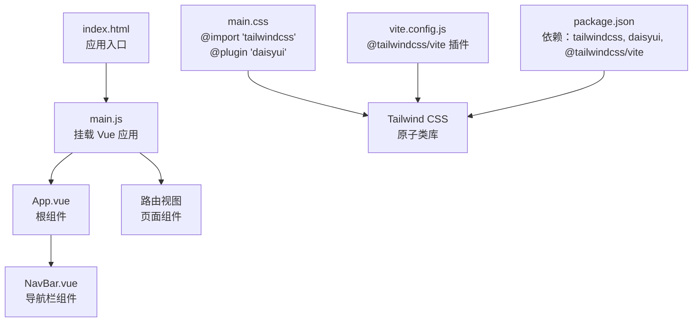
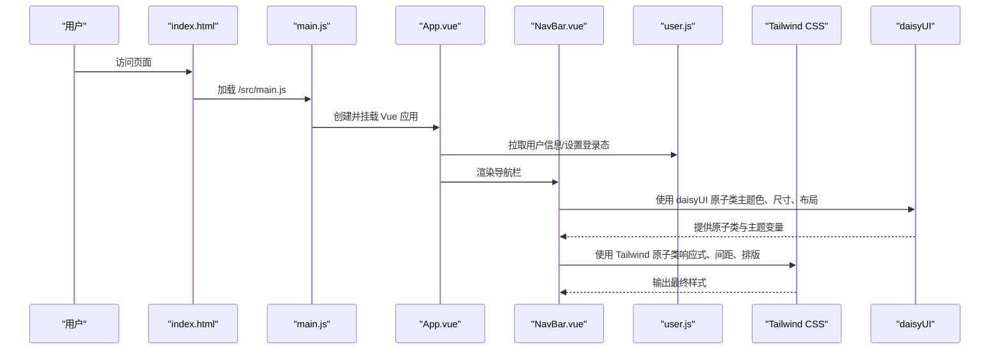
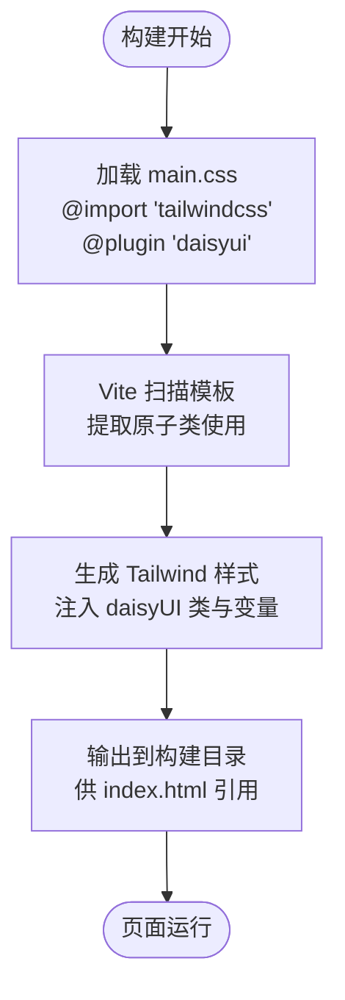
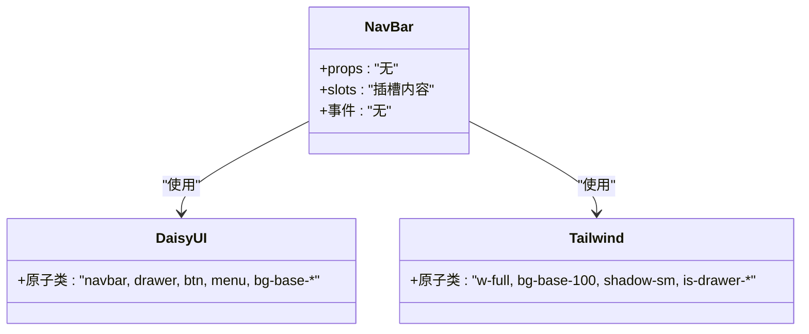
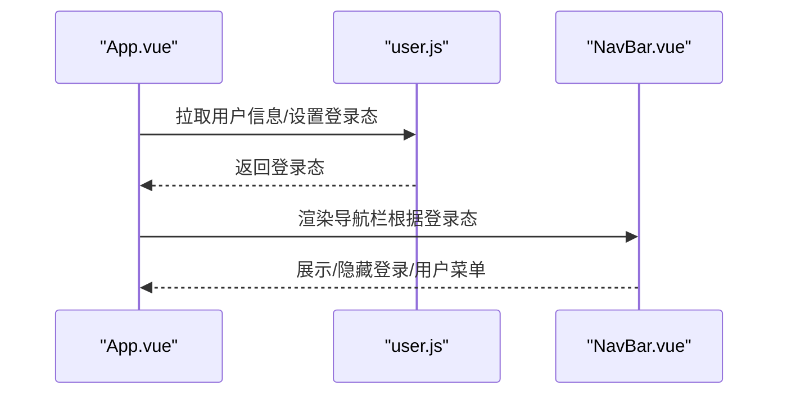
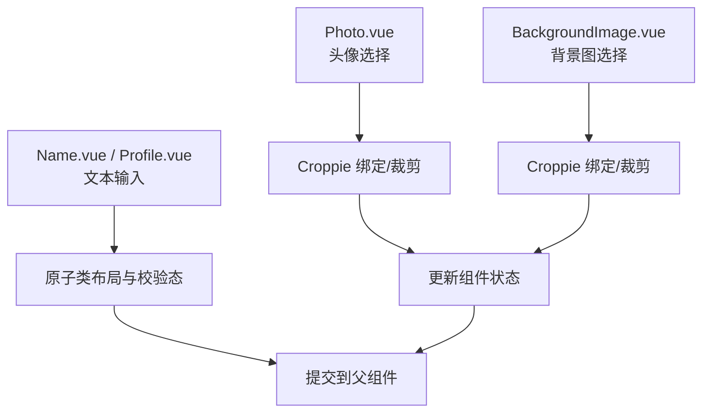
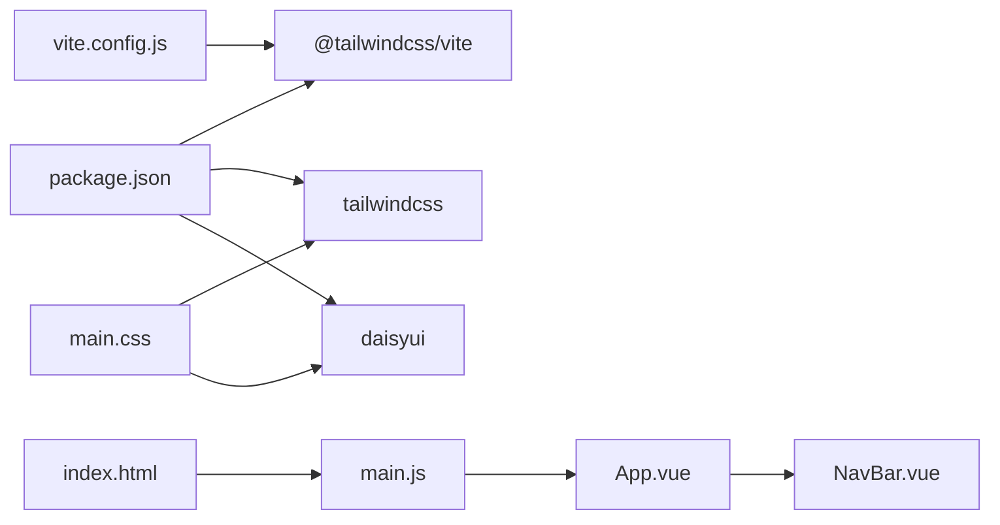

# 样式与主题

<cite>
**本文引用的文件**
- [main.css](file://frontend/src/assets/main.css)
- [package.json](file://frontend/package.json)
- [vite.config.js](file://frontend/vite.config.js)
- [main.js](file://frontend/src/main.js)
- [index.html](file://frontend/index.html)
- [App.vue](file://frontend/src/App.vue)
- [NavBar.vue](file://frontend/src/components/navbar/NavBar.vue)
- [user.js](file://frontend/src/stores/user.js)
- [BackgroundImage.vue](file://frontend/src/views/create/character/components/BackgroundImage.vue)
- [Photo.vue](file://frontend/src/views/create/character/components/Photo.vue)
- [Name.vue](file://frontend/src/views/create/character/components/Name.vue)
- [Profile.vue](file://frontend/src/views/create/character/components/Profile.vue)
</cite>

## 目录
1. [简介](#简介)
2. [项目结构](#项目结构)
3. [核心组件](#核心组件)
4. [架构总览](#架构总览)
5. [详细组件分析](#详细组件分析)
6. [依赖分析](#依赖分析)
7. [性能考虑](#性能考虑)
8. [故障排查指南](#故障排查指南)
9. [结论](#结论)
10. [附录](#附录)

## 简介
本文件面向 LLM_AIfriends 的样式与主题系统，聚焦于 Tailwind CSS 与 daisyUI 在 Vite + Vue 3 构建链路中的集成方式，系统性阐述原子化 CSS 设计、响应式断点与主题配置、全局样式管理、组件样式隔离、主题切换机制、CSS 变量与动画/过渡效果、样式架构图、设计系统规范与品牌色管理，以及样式扩展指南与最佳实践。由于当前仓库未包含独立的 Tailwind 配置文件与 daisyUI 主题配置文件，本文在“现状”基础上提供可落地的实施建议与架构蓝图。

## 项目结构
前端采用 Vite + Vue 3 + Tailwind CSS + daisyUI 的组合：
- 入口脚本引入全局样式，随后挂载 Vue 应用。
- Vite 配置启用 @tailwindcss/vite 插件，构建时自动扫描模板并生成样式。
- daisyUI 通过 @plugin 引入，提供组件化 UI 原子类与主题能力。
- 组件内普遍使用 scoped 样式，配合 Tailwind 原子类实现样式隔离与复用。

**图表来源**
- [index.html:1-14](file://frontend/index.html#L1-L14)
- [main.js:1-15](file://frontend/src/main.js#L1-L15)
- [App.vue:1-41](file://frontend/src/App.vue#L1-L41)
- [NavBar.vue:1-77](file://frontend/src/components/navbar/NavBar.vue#L1-L77)
- [main.css:1-3](file://frontend/src/assets/main.css#L1-L3)
- [vite.config.js:1-26](file://frontend/vite.config.js#L1-L26)
- [package.json:1-30](file://frontend/package.json#L1-L30)

**章节来源**
- [index.html:1-14](file://frontend/index.html#L1-L14)
- [main.js:1-15](file://frontend/src/main.js#L1-L15)
- [main.css:1-3](file://frontend/src/assets/main.css#L1-L3)
- [vite.config.js:1-26](file://frontend/vite.config.js#L1-L26)
- [package.json:1-30](file://frontend/package.json#L1-L30)

## 核心组件
- 全局样式入口：通过 main.css 引入 Tailwind 与 daisyUI，确保全站原子类与组件样式可用。
- 根组件 App.vue：负责用户状态拉取与登录态控制，为样式层提供条件渲染基础（如导航按钮显隐）。
- 导航栏 NavBar.vue：大量使用 daisyUI 原子类（如 navbar、drawer、btn、menu、bg-base-* 等），体现主题色与布局原子化。
- 用户状态存储 user.js：提供登录态与用户信息，影响界面交互与样式展示（如登录后显示用户菜单）。
- 视图组件：如 CreateCharacter 页面下的 Photo、BackgroundImage、Name、Profile 等，均以原子类组织布局与交互态。

**章节来源**
- [main.css:1-3](file://frontend/src/assets/main.css#L1-L3)
- [App.vue:1-41](file://frontend/src/App.vue#L1-L41)
- [NavBar.vue:1-77](file://frontend/src/components/navbar/NavBar.vue#L1-L77)
- [user.js:1-53](file://frontend/src/stores/user.js#L1-L53)
- [Photo.vue:1-99](file://frontend/src/views/create/character/components/Photo.vue#L1-L99)
- [BackgroundImage.vue:1-99](file://frontend/src/views/create/character/components/BackgroundImage.vue#L1-L99)
- [Name.vue:1-25](file://frontend/src/views/create/character/components/Name.vue#L1-L25)
- [Profile.vue:1-25](file://frontend/src/views/create/character/components/Profile.vue#L1-L25)

## 架构总览
下图展示了从入口到样式生效的关键路径，以及 daisyUI 主题与原子类在组件中的使用关系。

**图表来源**
- [index.html:1-14](file://frontend/index.html#L1-L14)
- [main.js:1-15](file://frontend/src/main.js#L1-L15)
- [App.vue:1-41](file://frontend/src/App.vue#L1-L41)
- [NavBar.vue:1-77](file://frontend/src/components/navbar/NavBar.vue#L1-L77)
- [user.js:1-53](file://frontend/src/stores/user.js#L1-L53)
- [main.css:1-3](file://frontend/src/assets/main.css#L1-L3)

## 详细组件分析

### 全局样式入口与主题加载
- main.css 通过 @import 引入 Tailwind 核心，并通过 @plugin 启用 daisyUI 插件，使 daisyUI 组件类与主题变量在全局生效。
- vite.config.js 中注册 @tailwindcss/vite 插件，构建时扫描模板并生成样式，确保按需输出。
- package.json 中声明 tailwindcss、daisyui、@tailwindcss/vite 等依赖，保证工具链一致。

**图表来源**
- [main.css:1-3](file://frontend/src/assets/main.css#L1-L3)
- [vite.config.js:1-26](file://frontend/vite.config.js#L1-L26)
- [package.json:1-30](file://frontend/package.json#L1-L30)

**章节来源**
- [main.css:1-3](file://frontend/src/assets/main.css#L1-L3)
- [vite.config.js:1-26](file://frontend/vite.config.js#L1-L26)
- [package.json:1-30](file://frontend/package.json#L1-L30)

### 导航栏组件样式隔离与主题使用
- NavBar.vue 大量使用 daisyUI 原子类（如 navbar、drawer、btn、menu、bg-base-* 等）与 Tailwind 原子类（如 w-full、bg-base-100、shadow-sm、is-drawer-* 等），形成统一的主题风格与响应式布局。
- 通过 scoped 样式避免对全局样式污染，同时利用 daisyUI 的主题变量实现明暗主题切换的基础能力。

**图表来源**
- [NavBar.vue:1-77](file://frontend/src/components/navbar/NavBar.vue#L1-L77)

**章节来源**
- [NavBar.vue:1-77](file://frontend/src/components/navbar/NavBar.vue#L1-L77)

### 用户状态驱动的样式行为
- user.js 提供登录态判断与用户信息存储，App.vue 在挂载时根据登录态决定是否跳转至登录页或渲染页面内容。
- 登录态变化会影响 NavBar 中的按钮显隐与交互，从而间接影响样式布局与视觉权重。

**图表来源**
- [App.vue:1-41](file://frontend/src/App.vue#L1-L41)
- [user.js:1-53](file://frontend/src/stores/user.js#L1-L53)
- [NavBar.vue:1-77](file://frontend/src/components/navbar/NavBar.vue#L1-L77)

**章节来源**
- [App.vue:1-41](file://frontend/src/App.vue#L1-L41)
- [user.js:1-53](file://frontend/src/stores/user.js#L1-L53)
- [NavBar.vue:1-77](file://frontend/src/components/navbar/NavBar.vue#L1-L77)

### 视图组件的原子化样式组织
- Photo、BackgroundImage、Name、Profile 等组件均以原子类组织输入框、按钮、对话框与占位元素，结合 Croppie 实现图片裁剪交互。
- 组件内部使用 scoped 样式，避免跨组件污染；同时通过 daisyUI 原子类实现统一的输入、按钮与模态框风格。

**图表来源**
- [Photo.vue:1-99](file://frontend/src/views/create/character/components/Photo.vue#L1-L99)
- [BackgroundImage.vue:1-99](file://frontend/src/views/create/character/components/BackgroundImage.vue#L1-L99)
- [Name.vue:1-25](file://frontend/src/views/create/character/components/Name.vue#L1-L25)
- [Profile.vue:1-25](file://frontend/src/views/create/character/components/Profile.vue#L1-L25)

**章节来源**
- [Photo.vue:1-99](file://frontend/src/views/create/character/components/Photo.vue#L1-L99)
- [BackgroundImage.vue:1-99](file://frontend/src/views/create/character/components/BackgroundImage.vue#L1-L99)
- [Name.vue:1-25](file://frontend/src/views/create/character/components/Name.vue#L1-L25)
- [Profile.vue:1-25](file://frontend/src/views/create/character/components/Profile.vue#L1-L25)

## 依赖分析
- 构建链路：Vite 通过 @tailwindcss/vite 插件扫描模板并生成样式；Tailwind 与 daisyUI 作为依赖由 package.json 管理。
- 运行链路：index.html 引入 main.js，main.js 引入全局样式，随后挂载 Vue 应用，组件按需使用原子类与 daisyUI 类。

**图表来源**
- [package.json:1-30](file://frontend/package.json#L1-L30)
- [vite.config.js:1-26](file://frontend/vite.config.js#L1-L26)
- [main.css:1-3](file://frontend/src/assets/main.css#L1-L3)
- [index.html:1-14](file://frontend/index.html#L1-L14)
- [main.js:1-15](file://frontend/src/main.js#L1-L15)
- [App.vue:1-41](file://frontend/src/App.vue#L1-L41)
- [NavBar.vue:1-77](file://frontend/src/components/navbar/NavBar.vue#L1-L77)

**章节来源**
- [package.json:1-30](file://frontend/package.json#L1-L30)
- [vite.config.js:1-26](file://frontend/vite.config.js#L1-L26)
- [main.css:1-3](file://frontend/src/assets/main.css#L1-L3)
- [index.html:1-14](file://frontend/index.html#L1-L14)
- [main.js:1-15](file://frontend/src/main.js#L1-L15)
- [App.vue:1-41](file://frontend/src/App.vue#L1-L41)
- [NavBar.vue:1-77](file://frontend/src/components/navbar/NavBar.vue#L1-L77)

## 性能考虑
- 按需生成：通过 @tailwindcss/vite 插件仅生成实际使用的原子类，减少体积。
- 组件隔离：scoped 样式避免全局污染，降低样式冲突带来的重绘成本。
- 动画与过渡：组件中已出现 transition-none 等类名，建议在需要时使用合适的过渡类并限制动画复杂度，避免影响滚动性能。
- 图片处理：Croppie 裁剪后以 base64 形式回传，注意内存占用与大图场景的优化策略。

[本节为通用指导，不直接分析具体文件]

## 故障排查指南
- 样式未生效
  - 检查 main.css 是否正确引入 Tailwind 与 daisyUI。
  - 确认 vite.config.js 已启用 @tailwindcss/vite 插件且构建输出目录正确。
  - 确保 index.html 正确加载 main.js 与构建产物。
- daisyUI 类无效
  - 确认 main.css 中存在 @plugin "daisyui"。
  - 检查组件是否使用了正确的 daisyUI 原子类（如 btn、modal、menu 等）。
- 响应式断点异常
  - 确认 Tailwind 默认断点配置未被覆盖；如需自定义，应在配置文件中调整。
- 主题切换问题
  - 当前仓库未提供独立的 Tailwind 配置与 daisyUI 主题配置文件，无法直接进行主题切换。请参考“附录”的实施建议以实现主题切换与品牌色管理。

**章节来源**
- [main.css:1-3](file://frontend/src/assets/main.css#L1-L3)
- [vite.config.js:1-26](file://frontend/vite.config.js#L1-L26)
- [index.html:1-14](file://frontend/index.html#L1-L14)
- [main.js:1-15](file://frontend/src/main.js#L1-L15)

## 结论
本项目已完整接入 Tailwind CSS 与 daisyUI，并通过 Vite 插件实现按需构建。组件广泛采用原子类与 daisyUI 类，形成一致的视觉与交互体验。当前仓库未包含独立的 Tailwind 配置与 daisyUI 主题配置文件，因此无法直接进行主题切换与品牌色管理。建议在后续迭代中补充配置文件与主题变量，以实现更完善的样式架构与主题体系。

[本节为总结性内容，不直接分析具体文件]

## 附录

### Tailwind CSS 与 daisyUI 集成现状与建议
- 现状
  - main.css 已引入 Tailwind 与 daisyUI。
  - vite.config.js 已启用 @tailwindcss/vite 插件。
  - package.json 已声明相关依赖。
- 建议
  - 新增 tailwind.config.js 与 daisyui 配置文件，集中管理主题、断点、插件与组件定制。
  - 定义品牌色与语义色变量，统一用于 daisyUI 主题与业务组件。
  - 通过 CSS 变量与 daisyUI 主题映射，实现明/暗主题切换。
  - 对常用组件（如按钮、输入框、卡片）建立样式规范与原子类组合约定。

### 响应式断点与布局策略
- 使用 Tailwind 默认断点（sm、md、lg、xl、2xl）进行移动端优先的布局适配。
- 在组件中优先使用空间、宽度、对齐等原子类，避免硬编码像素值。
- 导航栏与抽屉组件已体现响应式折叠逻辑，可进一步细化不同屏幕下的交互细节。

### 主题切换机制与品牌色管理
- 当前未提供独立配置文件，无法直接切换主题。
- 建议在新增配置文件中：
  - 定义主题色板（主色、辅助色、语义色）。
  - 映射到 daisyUI 主题变量，实现明/暗主题一键切换。
  - 将品牌色固化为 CSS 变量，贯穿全局与组件。

### 样式扩展指南与最佳实践
- 原子化优先：优先使用 Tailwind 与 daisyUI 原子类，减少自定义样式。
- 组件隔离：保持 scoped 样式最小化，必要时通过类名组合实现复用。
- 一致性：统一字号、间距、圆角、阴影等设计令牌，提升视觉一致性。
- 可维护性：为常用布局与交互态建立命名规范与注释，便于团队协作。

[本节为通用指导，不直接分析具体文件]