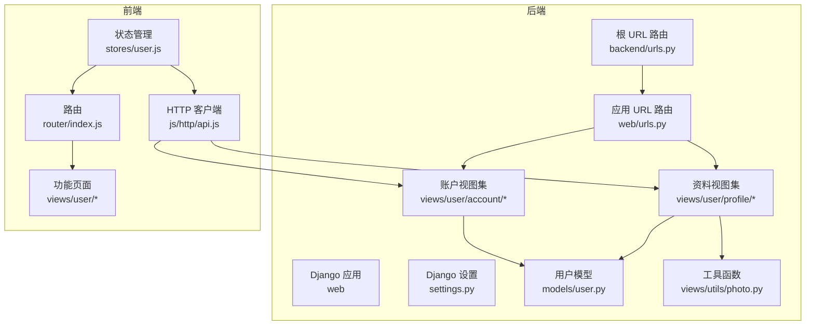
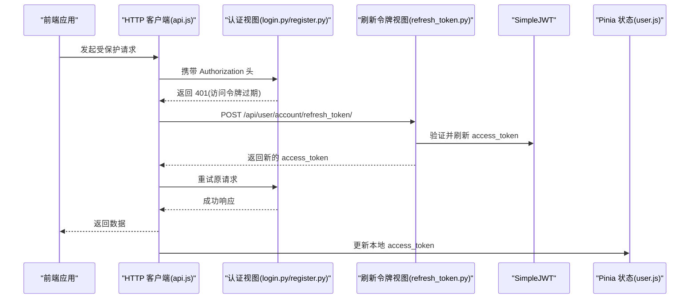
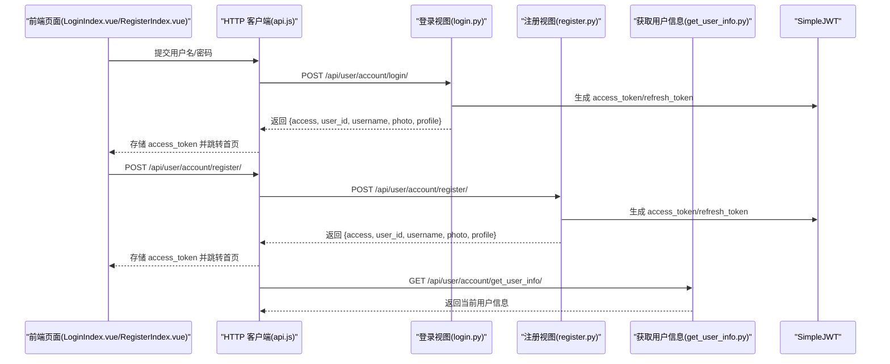
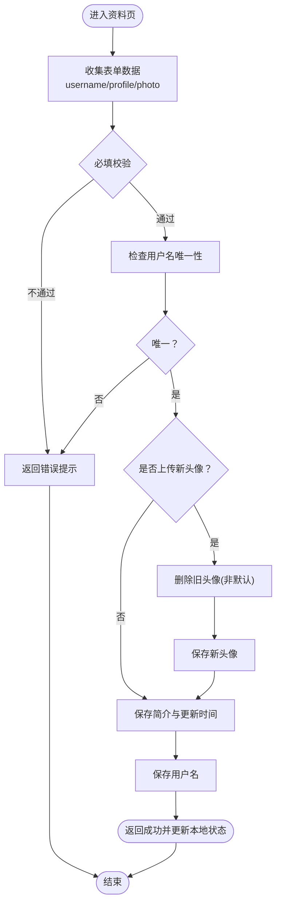
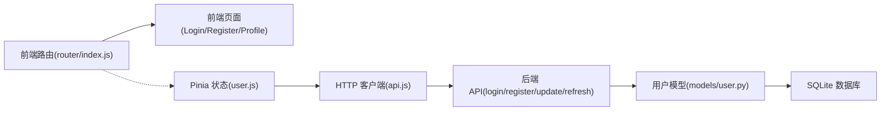
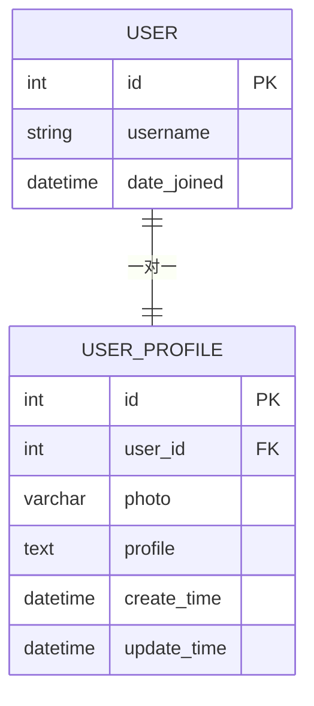

# 核心功能

<cite>
**本文引用的文件**
- [settings.py](file://backend/backend/settings.py)
- [urls.py](file://backend/web/urls.py)
- [urls.py](file://backend/backend/urls.py)
- [user.py](file://backend/web/models/user.py)
- [login.py](file://backend/web/views/user/account/login.py)
- [register.py](file://backend/web/views/user/account/register.py)
- [logout.py](file://backend/web/views/user/account/logout.py)
- [refresh_token.py](file://backend/web/views/user/account/refresh_token.py)
- [get_user_info.py](file://backend/web/views/user/account/get_user_info.py)
- [update.py](file://backend/web/views/user/profile/update.py)
- [photo.py](file://backend/web/views/utils/photo.py)
- [user.js](file://frontend/src/stores/user.js)
- [api.js](file://frontend/src/js/http/api.js)
- [index.js](file://frontend/src/router/index.js)
- [LoginIndex.vue](file://frontend/src/views/user/account/LoginIndex.vue)
- [RegisterIndex.vue](file://frontend/src/views/user/account/RegisterIndex.vue)
- [ProfileIndex.vue](file://frontend/src/views/user/profile/ProfileIndex.vue)
</cite>

## 目录
1. [引言](#引言)
2. [项目结构](#项目结构)
3. [核心组件](#核心组件)
4. [架构总览](#架构总览)
5. [详细组件分析](#详细组件分析)
6. [依赖分析](#依赖分析)
7. [性能考虑](#性能考虑)
8. [故障排查指南](#故障排查指南)
9. [结论](#结论)
10. [附录](#附录)

## 引言
本文件聚焦于 LLM_AIfriends 的核心功能：用户认证系统（登录、注册、令牌管理）、个人资料管理（头像上传与信息编辑）以及社交功能（个人空间）。文档从系统架构、数据模型、API 接口规范、前端组件设计、用户工作流、依赖关系与集成方式等方面进行全面阐述，并提供可追溯的源码路径以便进一步查阅。

## 项目结构
后端基于 Django 与 Django REST Framework，采用 SQLite 作为默认数据库，使用 SimpleJWT 实现 JWT 认证与刷新机制；前端基于 Vue 3 + Pinia + Vue Router，通过 Axios 封装统一的 HTTP 客户端并内置令牌刷新拦截器。

图表来源
- [urls.py](file://backend/backend/urls.py)
- [urls.py](file://backend/web/urls.py)
- [settings.py](file://backend/backend/settings.py)
- [user.py](file://backend/web/models/user.py)
- [login.py](file://backend/web/views/user/account/login.py)
- [register.py](file://backend/web/views/user/account/register.py)
- [update.py](file://backend/web/views/user/profile/update.py)
- [photo.py](file://backend/web/views/utils/photo.py)
- [index.js](file://frontend/src/router/index.js)
- [user.js](file://frontend/src/stores/user.js)
- [api.js](file://frontend/src/js/http/api.js)

章节来源
- [settings.py:136-151](file://backend/backend/settings.py#L136-L151)
- [urls.py](file://backend/backend/urls.py)
- [urls.py](file://backend/web/urls.py)

## 核心组件
- 认证与令牌管理：登录、注册、登出、刷新令牌、获取当前用户信息
- 个人资料管理：头像上传、用户名与简介更新
- 社交功能：个人空间展示（通过路由参数 user_id 访问）

章节来源
- [login.py:9-46](file://backend/web/views/user/account/login.py#L9-L46)
- [register.py:9-42](file://backend/web/views/user/account/register.py#L9-L42)
- [logout.py:7-16](file://backend/web/views/user/account/logout.py#L7-L16)
- [refresh_token.py:7-36](file://backend/web/views/user/account/refresh_token.py#L7-L36)
- [get_user_info.py:8-24](file://backend/web/views/user/account/get_user_info.py#L8-L24)
- [update.py:12-57](file://backend/web/views/user/profile/update.py#L12-L57)
- [user.py:15-23](file://backend/web/models/user.py#L15-L23)

## 架构总览
系统采用前后端分离架构，后端提供 REST API，前端通过 Axios 统一发起请求并在响应拦截器中处理 401 未授权情况，自动使用 Cookie 中的刷新令牌换取新的访问令牌，确保用户体验连贯。

图表来源
- [api.js:46-90](file://frontend/src/js/http/api.js#L46-L90)
- [login.py:9-46](file://backend/web/views/user/account/login.py#L9-L46)
- [register.py:9-42](file://backend/web/views/user/account/register.py#L9-L42)
- [refresh_token.py:7-36](file://backend/web/views/user/account/refresh_token.py#L7-L36)
- [user.js:1-59](file://frontend/src/stores/user.js#L1-L59)

## 详细组件分析

### 用户认证系统
- 登录
  - 输入：用户名、密码
  - 流程：校验必填 → 认证用户 → 查询用户资料 → 生成 JWT → 写入 Cookie refresh_token → 返回 access_token 与用户信息
  - 关键点：后端设置 HttpOnly、SameSite、Secure 的 refresh_token Cookie；返回值包含 access_token、user_id、username、photo、profile
- 注册
  - 输入：用户名、密码
  - 流程：校验必填 → 检查用户名唯一性 → 创建 User 与 UserProfile → 生成 JWT → 写入 refresh_token Cookie → 返回 access_token 与用户信息
- 登出
  - 流程：删除 refresh_token Cookie，返回成功
- 刷新令牌
  - 输入：Cookie 中的 refresh_token
  - 流程：校验是否存在 → 验证有效性 → 生成新的 access_token（可选轮换 refresh_token）→ 写回 Cookie → 返回 access_token
- 获取当前用户信息
  - 权限：已认证用户
  - 流程：查询当前用户与其资料 → 返回用户信息

图表来源
- [LoginIndex.vue:15-41](file://frontend/src/views/user/account/LoginIndex.vue#L15-L41)
- [RegisterIndex.vue:16-45](file://frontend/src/views/user/account/RegisterIndex.vue#L16-L45)
- [login.py:9-46](file://backend/web/views/user/account/login.py#L9-L46)
- [register.py:9-42](file://backend/web/views/user/account/register.py#L9-L42)
- [get_user_info.py:8-24](file://backend/web/views/user/account/get_user_info.py#L8-L24)
- [api.js:16-27](file://frontend/src/js/http/api.js#L16-L27)

章节来源
- [login.py:9-46](file://backend/web/views/user/account/login.py#L9-L46)
- [register.py:9-42](file://backend/web/views/user/account/register.py#L9-L42)
- [logout.py:7-16](file://backend/web/views/user/account/logout.py#L7-L16)
- [refresh_token.py:7-36](file://backend/web/views/user/account/refresh_token.py#L7-L36)
- [get_user_info.py:8-24](file://backend/web/views/user/account/get_user_info.py#L8-L24)
- [LoginIndex.vue:15-41](file://frontend/src/views/user/account/LoginIndex.vue#L15-L41)
- [RegisterIndex.vue:16-45](file://frontend/src/views/user/account/RegisterIndex.vue#L16-L45)

### 个人资料管理
- 头像上传与清理
  - 上传：前端将 Base64 转换为文件后通过 FormData 上传；后端接收文件并替换旧头像
  - 清理：若非默认头像且存在旧文件，则删除旧文件以节省存储
- 用户名与简介更新
  - 输入：username、profile（后端限制最大长度）
  - 校验：用户名唯一性、必填项
  - 更新：同时更新 User 与 UserProfile，并记录更新时间

图表来源
- [ProfileIndex.vue:17-52](file://frontend/src/views/user/profile/ProfileIndex.vue#L17-L52)
- [update.py:12-57](file://backend/web/views/user/profile/update.py#L12-L57)
- [photo.py:9-13](file://backend/web/views/utils/photo.py#L9-L13)

章节来源
- [ProfileIndex.vue:17-52](file://frontend/src/views/user/profile/ProfileIndex.vue#L17-L52)
- [update.py:12-57](file://backend/web/views/user/profile/update.py#L12-L57)
- [photo.py:9-13](file://backend/web/views/utils/photo.py#L9-L13)

### 社交功能：个人空间
- 访问路径：/user/space/:user_id/
- 设计要点：允许匿名访问他人空间；通过路由参数 user_id 读取目标用户资料并渲染内容
- 集成方式：路由配置中声明该路径与元信息；后端通过 GetUserInfo 视图或直接查询用户资料提供数据

章节来源
- [index.js:64-71](file://frontend/src/router/index.js#L64-L71)
- [get_user_info.py:8-24](file://backend/web/views/user/account/get_user_info.py#L8-L24)

## 依赖分析
- 后端依赖
  - Django + Django REST Framework + SimpleJWT：提供认证、序列化与令牌管理
  - SQLite：默认开发数据库
  - CORS：允许前端域名访问
- 前端依赖
  - Vue 3 + Pinia：状态管理
  - Vue Router：路由与导航守卫
  - Axios：HTTP 请求封装与拦截器
- 关键耦合点
  - 前端通过 Authorization 头携带 access_token 调用后端 API
  - 刷新令牌依赖后端写入的 refresh_token Cookie
  - 用户资料模型与用户模型一对一关联，更新时需同时维护两者

图表来源
- [index.js:12-101](file://frontend/src/router/index.js#L12-L101)
- [api.js:16-90](file://frontend/src/js/http/api.js#L16-L90)
- [user.js:1-59](file://frontend/src/stores/user.js#L1-L59)
- [login.py:9-46](file://backend/web/views/user/account/login.py#L9-L46)
- [register.py:9-42](file://backend/web/views/user/account/register.py#L9-L42)
- [update.py:12-57](file://backend/web/views/user/profile/update.py#L12-L57)
- [user.py:15-23](file://backend/web/models/user.py#L15-L23)

章节来源
- [settings.py:136-151](file://backend/backend/settings.py#L136-L151)
- [user.py:15-23](file://backend/web/models/user.py#L15-L23)

## 性能考虑
- 令牌生命周期
  - 访问令牌有效期短（默认 2 小时），刷新令牌长期有效（默认 7 天），支持轮换与黑名单，提升安全性与可用性
- 文件存储
  - 头像上传采用 UUID 化命名与按用户分目录存储，避免冲突；更新头像时清理旧文件，减少冗余
- 前端缓存
  - 登录成功后立即写入 access_token，后续请求无需额外交互；401 时自动刷新，降低用户感知延迟

章节来源
- [settings.py:143-151](file://backend/backend/settings.py#L143-L151)
- [photo.py:9-13](file://backend/web/views/utils/photo.py#L9-L13)
- [api.js:46-90](file://frontend/src/js/http/api.js#L46-L90)

## 故障排查指南
- 登录/注册失败
  - 检查用户名与密码是否为空；确认用户名唯一性；核对后端返回的错误消息
- 401 未授权
  - 确认前端是否正确携带 Authorization 头；检查刷新令牌是否仍有效；必要时清除 Cookie 后重新登录
- 刷新令牌无效
  - 若返回 401，表示刷新令牌过期或无效；前端将自动登出并清空本地状态
- 头像更新失败
  - 确认前端已转换为文件并正确提交；后端仅接受图片类型；检查旧头像清理逻辑是否执行

章节来源
- [login.py:14-17](file://backend/web/views/user/account/login.py#L14-L17)
- [register.py:14-22](file://backend/web/views/user/account/register.py#L14-L22)
- [refresh_token.py:10-14](file://backend/web/views/user/account/refresh_token.py#L10-L14)
- [api.js:46-90](file://frontend/src/js/http/api.js#L46-L90)
- [update.py:35-38](file://backend/web/views/user/profile/update.py#L35-L38)

## 结论
本系统围绕“认证—资料—社交”三大模块构建，后端以 JWT 为核心实现安全的令牌管理，前端通过统一拦截器与状态管理实现流畅的用户体验。模块间职责清晰、耦合度低，具备良好的扩展性与可维护性。

## 附录

### API 接口规范（摘要）
- 登录
  - 方法：POST
  - 路径：/api/user/account/login/
  - 请求体：username, password
  - 响应：access, user_id, username, photo, profile；设置 refresh_token Cookie
- 注册
  - 方法：POST
  - 路径：/api/user/account/register/
  - 请求体：username, password
  - 响应：access, user_id, username, photo, profile；设置 refresh_token Cookie
- 登出
  - 方法：POST
  - 路径：/api/user/account/logout/
  - 响应：result=success；删除 refresh_token Cookie
- 刷新令牌
  - 方法：POST
  - 路径：/api/user/account/refresh_token/
  - 请求：Cookie refresh_token
  - 响应：access；可选更新 refresh_token Cookie
- 获取当前用户信息
  - 方法：GET
  - 路径：/api/user/account/get_user_info/
  - 权限：已认证
  - 响应：user_id, username, photo, profile
- 更新个人资料
  - 方法：POST
  - 路径：/api/user/profile/update/
  - 权限：已认证
  - 请求体：username, profile, photo(File，可选)
  - 响应：user_id, username, profile, photo(url)

章节来源
- [login.py:9-46](file://backend/web/views/user/account/login.py#L9-L46)
- [register.py:9-42](file://backend/web/views/user/account/register.py#L9-L42)
- [logout.py:7-16](file://backend/web/views/user/account/logout.py#L7-L16)
- [refresh_token.py:7-36](file://backend/web/views/user/account/refresh_token.py#L7-L36)
- [get_user_info.py:8-24](file://backend/web/views/user/account/get_user_info.py#L8-L24)
- [update.py:12-57](file://backend/web/views/user/profile/update.py#L12-L57)

### 数据模型关系

图表来源
- [user.py:15-23](file://backend/web/models/user.py#L15-L23)

### 前端组件与路由映射
- 登录页：views/user/account/LoginIndex.vue → /user/account/login/
- 注册页：views/user/account/RegisterIndex.vue → /user/account/register/
- 个人资料页：views/user/profile/ProfileIndex.vue → /user/profile/
- 个人空间：/user/space/:user_id/
- 路由守卫：根据 meta.needLogin 控制访问权限

章节来源
- [index.js:12-101](file://frontend/src/router/index.js#L12-L101)
- [LoginIndex.vue:1-69](file://frontend/src/views/user/account/LoginIndex.vue#L1-L69)
- [RegisterIndex.vue:1-76](file://frontend/src/views/user/account/RegisterIndex.vue#L1-L76)
- [ProfileIndex.vue:1-77](file://frontend/src/views/user/profile/ProfileIndex.vue#L1-L77)