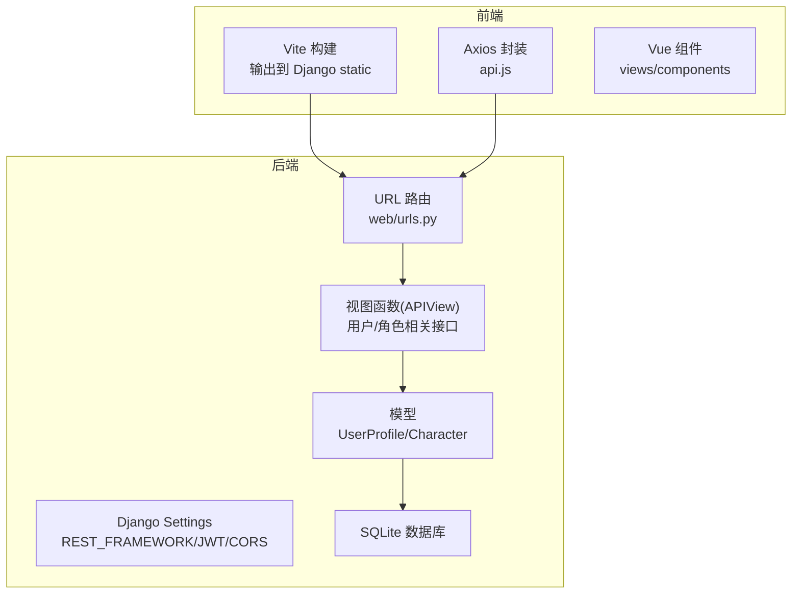
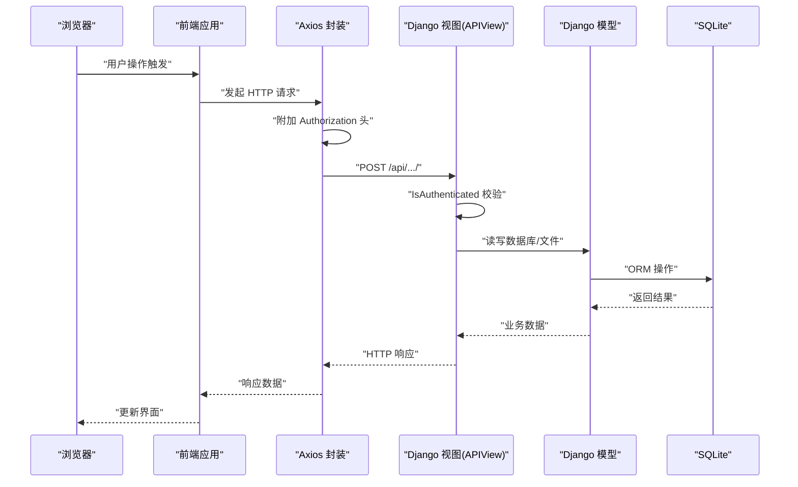
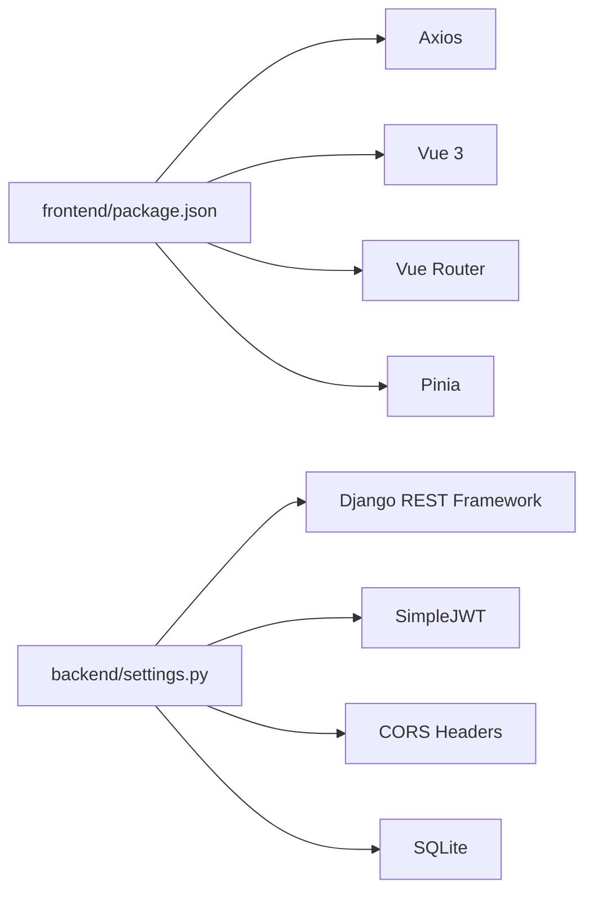

# 测试策略

<cite>
**本文引用的文件**
- [backend/web/tests.py](file://backend/web/tests.py)
- [backend/manage.py](file://backend/manage.py)
- [backend/backend/settings.py](file://backend/backend/settings.py)
- [backend/web/views/index.py](file://backend/web/views/index.py)
- [backend/web/models/user.py](file://backend/web/models/user.py)
- [backend/web/models/character.py](file://backend/web/models/character.py)
- [backend/web/views/user/account/login.py](file://backend/web/views/user/account/login.py)
- [backend/web/views/user/account/register.py](file://backend/web/views/user/account/register.py)
- [backend/web/views/create/character/create.py](file://backend/web/views/create/character/create.py)
- [backend/web/views/utils/photo.py](file://backend/web/views/utils/photo.py)
- [backend/web/urls.py](file://backend/web/urls.py)
- [frontend/src/js/http/api.js](file://frontend/src/js/http/api.js)
- [frontend/package.json](file://frontend/package.json)
- [frontend/vite.config.js](file://frontend/vite.config.js)
</cite>

## 目录
1. [引言](#引言)
2. [项目结构](#项目结构)
3. [核心组件](#核心组件)
4. [架构总览](#架构总览)
5. [详细组件分析](#详细组件分析)
6. [依赖分析](#依赖分析)
7. [性能考虑](#性能考虑)
8. [故障排查指南](#故障排查指南)
9. [结论](#结论)
10. [附录](#附录)

## 引言
本文件面向 LLM_AIfriends 的测试策略，系统化阐述单元测试、集成测试与端到端测试的实施方法，覆盖 Django 后端测试框架、Vue 前端组件与 API 接口测试、测试数据管理与模拟对象使用、测试覆盖率目标、持续测试集成与性能测试方案，并给出测试环境配置、自动化测试脚本建议与缺陷跟踪流程。

## 项目结构
项目采用前后端分离架构：前端基于 Vue 3 + Vite，通过 Axios 发起 API 请求；后端基于 Django + Django REST Framework，使用 SQLite 作为默认数据库，SimpleJWT 进行认证，CORS 支持跨域。静态资源由 Vite 构建后输出至 Django 的 static 目录，以便后端统一托管。

图表来源
- [frontend/vite.config.js:1-26](file://frontend/vite.config.js#L1-L26)
- [frontend/src/js/http/api.js:1-93](file://frontend/src/js/http/api.js#L1-L93)
- [backend/backend/settings.py:136-159](file://backend/backend/settings.py#L136-L159)
- [backend/web/urls.py:16-32](file://backend/web/urls.py#L16-L32)
- [backend/web/models/user.py:14-23](file://backend/web/models/user.py#L14-L23)
- [backend/web/models/character.py:21-32](file://backend/web/models/character.py#L21-L32)

章节来源
- [frontend/vite.config.js:1-26](file://frontend/vite.config.js#L1-L26)
- [frontend/src/js/http/api.js:14-19](file://frontend/src/js/http/api.js#L14-L19)
- [backend/backend/settings.py:79-84](file://backend/backend/settings.py#L79-L84)
- [backend/web/urls.py:16-32](file://backend/web/urls.py#L16-L32)

## 核心组件
- 认证与会话
  - JWT 认证：后端启用 SimpleJWT，默认认证类为 JWTAuthentication，支持 Access/Refresh Token 生命周期与轮换。
  - CORS：允许本地开发源，支持凭据传递。
- 用户与角色模型
  - UserProfile：一对一关联 Django User，扩展头像、简介等字段。
  - Character：多对一关联 UserProfile，存储角色信息与图片资源。
- 视图层
  - 登录/注册：基于 APIView，返回 JWT 并设置 HttpOnly Refresh Cookie。
  - 角色创建：基于 APIView，IsAuthenticated 权限控制，处理文件上传。
- 前端 HTTP 层
  - Axios 实例封装：自动注入 Authorization 头，拦截 401 自动刷新 Access Token，失败则登出清理状态。

章节来源
- [backend/backend/settings.py:136-159](file://backend/backend/settings.py#L136-L159)
- [backend/web/models/user.py:14-23](file://backend/web/models/user.py#L14-L23)
- [backend/web/models/character.py:21-32](file://backend/web/models/character.py#L21-L32)
- [backend/web/views/user/account/login.py:9-46](file://backend/web/views/user/account/login.py#L9-L46)
- [backend/web/views/user/account/register.py:9-45](file://backend/web/views/user/account/register.py#L9-L45)
- [backend/web/views/create/character/create.py:9-51](file://backend/web/views/create/character/create.py#L9-L51)
- [frontend/src/js/http/api.js:16-90](file://frontend/src/js/http/api.js#L16-L90)

## 架构总览
下图展示从浏览器到后端的典型请求链路，包括认证、权限校验与资源访问。

图表来源
- [frontend/src/js/http/api.js:21-27](file://frontend/src/js/http/api.js#L21-L27)
- [backend/web/views/create/character/create.py:10-11](file://backend/web/views/create/character/create.py#L10-L11)
- [backend/web/models/character.py:21-32](file://backend/web/models/character.py#L21-L32)
- [backend/backend/settings.py:79-84](file://backend/backend/settings.py#L79-L84)

## 详细组件分析

### Django 单元测试策略
- 测试框架与入口
  - 使用 Django TestCase，测试入口通过 manage.py 调用。
  - 当前仓库仅包含空的 tests.py 文件，需补充具体用例。
- 建议的测试范围
  - 视图层：登录/注册/角色创建等 API 的状态码、响应体字段、Cookie 设置、权限拒绝。
  - 模型层：UserProfile/Character 字段约束、文件上传路径规则、字符串表示。
  - 工具函数：图片清理逻辑 remove_old_photo 的文件存在性判断。
- 测试数据管理
  - 使用 Django 的测试数据库（每测试运行隔离），避免污染真实数据。
  - 对于文件上传场景，建议在 setUp 中创建临时媒体目录与占位文件。
- 模拟对象
  - 对外部依赖（如第三方认证服务）使用 unittest.mock 进行替换。
  - 对文件上传使用 SimpleUploadedFile 或 BytesIO。
- 覆盖率要求
  - 建议核心业务路径覆盖率不低于 80%，关键分支不低于 70%。

章节来源
- [backend/web/tests.py:1-4](file://backend/web/tests.py#L1-L4)
- [backend/manage.py:1-23](file://backend/manage.py#L1-L23)
- [backend/web/views/user/account/login.py:9-46](file://backend/web/views/user/account/login.py#L9-L46)
- [backend/web/views/user/account/register.py:9-45](file://backend/web/views/user/account/register.py#L9-L45)
- [backend/web/views/create/character/create.py:9-51](file://backend/web/views/create/character/create.py#L9-L51)
- [backend/web/views/utils/photo.py:6-11](file://backend/web/views/utils/photo.py#L6-L11)
- [backend/web/models/user.py:14-23](file://backend/web/models/user.py#L14-L23)
- [backend/web/models/character.py:21-32](file://backend/web/models/character.py#L21-L32)

### Django 集成测试策略
- 测试目标
  - 验证 URL 路由到视图的完整链路，确保中间件（CORS、CSRF、Session）与认证流程协同工作。
  - 验证文件上传与媒体文件路径生成是否符合预期。
- 关键场景
  - 未登录访问受保护接口：返回 401 或 403。
  - 登录后访问：返回 200 且包含期望字段。
  - 上传缺失字段：返回错误提示与 400/业务错误码。
- 测试工具
  - 使用 APIClient 或 Requests 直接访问 /api/* 路径。
  - 使用 override_settings 在测试中切换 DEBUG、JWT 参数与 MEDIA_ROOT。

章节来源
- [backend/web/urls.py:16-32](file://backend/web/urls.py#L16-L32)
- [backend/backend/settings.py:136-159](file://backend/backend/settings.py#L136-L159)
- [backend/web/views/create/character/create.py:10-11](file://backend/web/views/create/character/create.py#L10-L11)

### 端到端测试策略（E2E）
- 测试目标
  - 覆盖真实用户路径：注册 → 登录 → 创建角色（含头像与背景图）→ 查看/更新 → 登出。
- 技术选型
  - 前端：可选用 Cypress/Puppeteer/Vitest + Vue Test Utils（组件级）。
  - 后端：可结合 Django LiveServerTestCase 或独立 E2E 服务。
- 关键步骤
  - 启动后端开发服务器与前端 Vite 开发服务器。
  - 使用浏览器自动化执行用户操作，断言页面行为与网络请求。
- 注意事项
  - 严格控制时钟与时区，避免 JWT 过期导致的误判。
  - 使用独立测试数据库与媒体目录，避免并发冲突。

章节来源
- [frontend/vite.config.js:16-19](file://frontend/vite.config.js#L16-L19)
- [frontend/src/js/http/api.js:14-19](file://frontend/src/js/http/api.js#L14-L19)
- [backend/web/views/user/account/register.py:9-45](file://backend/web/views/user/account/register.py#L9-L45)
- [backend/web/views/user/account/login.py:9-46](file://backend/web/views/user/account/login.py#L9-L46)
- [backend/web/views/create/character/create.py:9-51](file://backend/web/views/create/character/create.py#L9-L51)

### Vue 组件测试方法
- 测试目标
  - 验证组件渲染、用户交互（点击、输入）、与 Pinia 状态联动。
- 技术栈
  - Vue Test Utils + Vitest（推荐）或 Jest。
- 关键点
  - 使用 Memory Router 注入，避免真实路由影响。
  - 使用 Mock Store 替换真实 Pinia 状态，断言派发与状态变化。
  - 对图片上传组件，使用 Blob/FormData 模拟文件选择与预览。
- 示例场景
  - 登录/注册表单：必填项校验、错误提示显示。
  - 角色创建页：字段校验、文件上传按钮、提交按钮状态。

章节来源
- [frontend/src/stores/user.js](file://frontend/src/stores/user.js)
- [frontend/src/router/index.js](file://frontend/src/router/index.js)
- [frontend/package.json:23-28](file://frontend/package.json#L23-L28)

### API 接口测试方法
- 测试目标
  - 验证接口契约：请求参数、响应格式、状态码、鉴权与权限。
- 工具与流程
  - 使用 Django APIClient 或 Postman/Newman 进行接口回归。
  - 对 JWT：验证 Access/Refresh 生命周期、刷新失败后的登出行为。
  - 对文件上传：验证文件类型、大小限制、存储路径与清理逻辑。
- 典型断言
  - 登录：返回 access、refresh cookie、用户信息字段。
  - 创建角色：返回 result=success，数据库记录存在，文件路径正确。
  - 刷新令牌：401 时自动刷新并重试原请求，失败则清除本地状态。

章节来源
- [frontend/src/js/http/api.js:46-90](file://frontend/src/js/http/api.js#L46-L90)
- [backend/web/views/user/account/login.py:9-46](file://backend/web/views/user/account/login.py#L9-L46)
- [backend/web/views/user/account/register.py:9-45](file://backend/web/views/user/account/register.py#L9-L45)
- [backend/web/views/create/character/create.py:9-51](file://backend/web/views/create/character/create.py#L9-L51)

### 测试数据管理与模拟对象
- 测试数据
  - 使用 Django fixtures 或在 setUp 中创建最小化测试数据集。
  - 对媒体文件，使用临时目录与占位文件，避免磁盘污染。
- 模拟对象
  - 对外部服务（如第三方认证）进行 mock。
  - 对文件上传使用 SimpleUploadedFile，对时间使用 freezegun 控制。
- 清理策略
  - 每个测试结束后清理数据库与媒体文件，确保可重复性。

章节来源
- [backend/web/views/utils/photo.py:6-11](file://backend/web/views/utils/photo.py#L6-L11)
- [backend/web/models/user.py:8-11](file://backend/web/models/user.py#L8-L11)
- [backend/web/models/character.py:9-18](file://backend/web/models/character.py#L9-L18)

### 测试覆盖率要求
- 目标
  - 语句覆盖率 ≥ 80%，分支覆盖率 ≥ 70%，行覆盖率 ≥ 80%。
- 落地手段
  - 使用 coverage.py 或 pytest-cov，结合 CI 执行。
  - 对关键路径（认证、文件上传、权限控制）单独统计并设阈值。

章节来源
- [backend/web/views/user/account/login.py:9-46](file://backend/web/views/user/account/login.py#L9-L46)
- [backend/web/views/user/account/register.py:9-45](file://backend/web/views/user/account/register.py#L9-L45)
- [backend/web/views/create/character/create.py:9-51](file://backend/web/views/create/character/create.py#L9-L51)

### 持续测试集成（CTI）
- CI 配置建议
  - 前端：安装 Node 20/22，执行 npm run build，运行 Vitest 测试。
  - 后端：安装 Python 依赖，迁移数据库，执行 Django 测试。
- 覆盖率报告
  - 生成覆盖率报告并在 PR 中展示，失败阈值触发阻断。
- 性能测试
  - 使用 Locust/JMeter 对关键接口进行压力测试，设定 P95 延迟阈值。

章节来源
- [frontend/package.json:9-13](file://frontend/package.json#L9-L13)
- [backend/manage.py:10-18](file://backend/manage.py#L10-L18)

### 缺陷跟踪流程
- 分类
  - 功能缺陷：接口行为不符、权限错误、文件上传失败。
  - 性能缺陷：高负载下的延迟与吞吐。
  - 兼容性缺陷：不同浏览器/Node 版本问题。
- 流程
  - 提交测试报告与日志，定位到具体用例与源码路径。
  - 修复后回归测试，关闭缺陷并更新测试用例。

章节来源
- [frontend/src/js/http/api.js:46-90](file://frontend/src/js/http/api.js#L46-L90)
- [backend/web/views/create/character/create.py:9-51](file://backend/web/views/create/character/create.py#L9-L51)

## 依赖分析
- 前端依赖
  - Vue 3、Vue Router、Pinia、Axios、TailwindCSS、Vite。
- 后端依赖
  - Django、djangorestframework、djangorestframework-simplejwt、django-cors-headers、sqlite3。
- 关键耦合点
  - 前端 Axios 与后端 JWT/CORS 配置强相关，需保持一致的 BaseURL、凭据与头部格式。

图表来源
- [frontend/package.json:14-28](file://frontend/package.json#L14-L28)
- [backend/backend/settings.py:40-43](file://backend/backend/settings.py#L40-L43)
- [backend/backend/settings.py:136-159](file://backend/backend/settings.py#L136-L159)

章节来源
- [frontend/package.json:14-28](file://frontend/package.json#L14-L28)
- [backend/backend/settings.py:40-43](file://backend/backend/settings.py#L40-L43)
- [backend/backend/settings.py:136-159](file://backend/backend/settings.py#L136-L159)

## 性能考虑
- 接口性能
  - 对文件上传接口进行限流与超时控制，避免大文件拖垮服务。
  - 使用 CDN 或静态资源优化减少带宽压力。
- 前端性能
  - 图片懒加载与压缩，避免一次性加载过多资源。
- 压测建议
  - 使用 Locust 对 /api/user/account/login/ 与 /api/create/character/create/ 进行并发压测，监控 CPU、内存与数据库连接数。

章节来源
- [frontend/src/js/http/api.js:70-74](file://frontend/src/js/http/api.js#L70-L74)
- [backend/web/views/create/character/create.py:15-18](file://backend/web/views/create/character/create.py#L15-L18)

## 故障排查指南
- 常见问题
  - 401 未授权：检查前端是否正确附加 Authorization 头，后端是否正确解析 Bearer Token。
  - 刷新失败：确认刷新接口可用、Cookie 设置与 SameSite/Secure 配置。
  - 文件上传失败：检查 MEDIA_ROOT 权限、文件大小与类型限制、路径生成逻辑。
- 定位手段
  - 启用 Django 日志与前端拦截器日志，捕获请求与响应详情。
  - 使用独立测试用例复现，逐步缩小范围。

章节来源
- [frontend/src/js/http/api.js:46-90](file://frontend/src/js/http/api.js#L46-L90)
- [backend/web/views/utils/photo.py:6-11](file://backend/web/views/utils/photo.py#L6-L11)

## 结论
本测试策略以 Django 与 Vue 为核心，围绕认证、权限与文件上传三大关键路径构建单元、集成与端到端测试体系。通过明确的覆盖率目标、CI 集成与性能测试方案，确保系统在功能正确性、稳定性与可维护性方面达到工程化标准。

## 附录
- 测试环境配置要点
  - 前端：Node 版本满足 engines 要求，安装依赖后可直接 dev/build。
  - 后端：确保 SQLite 可写，DEBUG=True 便于调试，JWT 与 CORS 配置与前端一致。
- 自动化脚本建议
  - 前端：npm test/npm run build。
  - 后端：python manage.py test --parallel。
- 缺陷跟踪
  - 使用 Issue 模板分类问题，关联具体用例与源码路径，形成闭环。

章节来源
- [frontend/package.json:6-8](file://frontend/package.json#L6-L8)
- [frontend/package.json:9-13](file://frontend/package.json#L9-L13)
- [backend/manage.py:10-18](file://backend/manage.py#L10-L18)
- [backend/backend/settings.py:25-28](file://backend/backend/settings.py#L25-L28)
- [backend/backend/settings.py:154-159](file://backend/backend/settings.py#L154-L159)