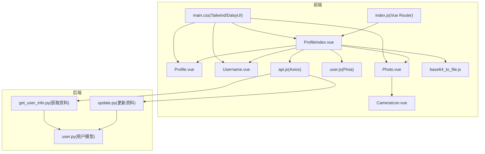
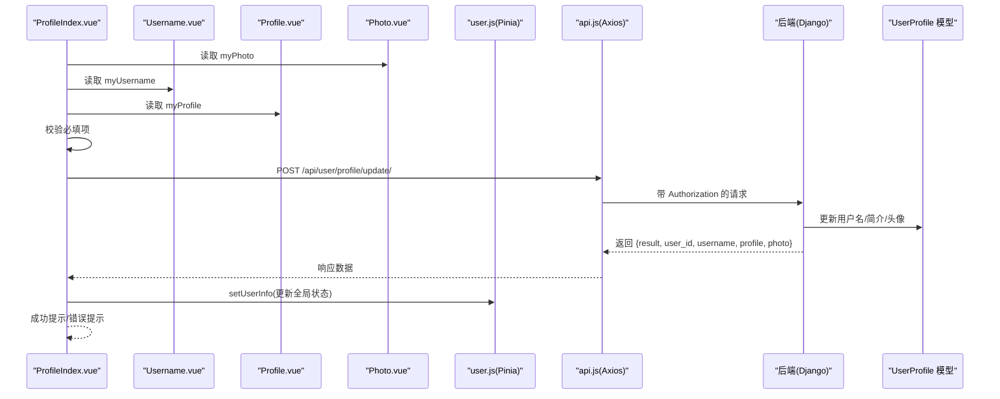
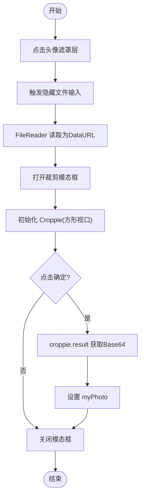
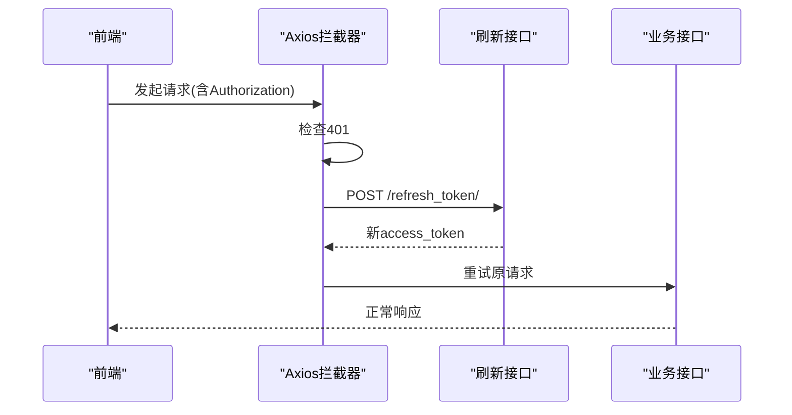
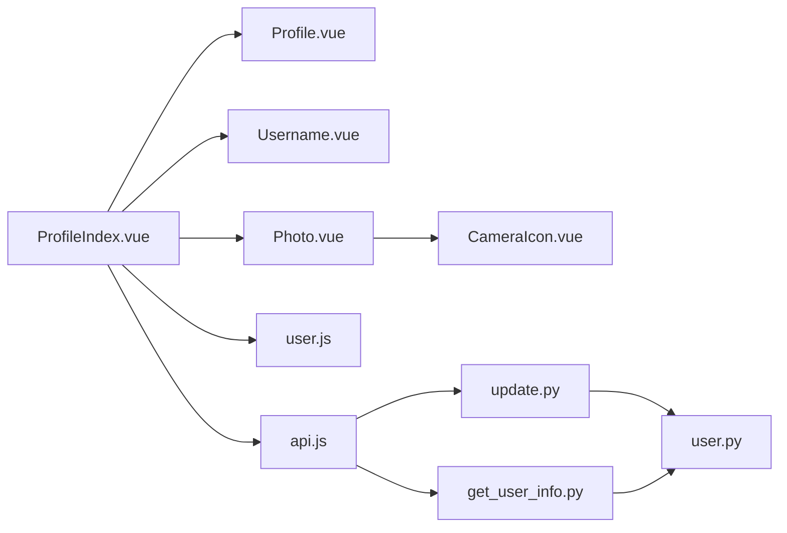

# 个人资料组件

<cite>
**本文引用的文件**
- [ProfileIndex.vue](file://frontend/src/views/user/profile/ProfileIndex.vue)
- [Profile.vue](file://frontend/src/views/user/profile/components/Profile.vue)
- [Photo.vue](file://frontend/src/views/user/profile/components/Photo.vue)
- [Username.vue](file://frontend/src/views/user/profile/components/Username.vue)
- [CameraIcon.vue](file://frontend/src/views/user/profile/components/icon/CameraIcon.vue)
- [user.js](file://frontend/src/stores/user.js)
- [api.js](file://frontend/src/js/http/api.js)
- [index.js](file://frontend/src/router/index.js)
- [base64_to_file.js](file://frontend/src/js/utils/base64_to_file.js)
- [update.py](file://backend/web/views/user/profile/update.py)
- [get_user_info.py](file://backend/web/views/user/account/get_user_info.py)
- [user.py](file://backend/web/models/user.py)
- [main.css](file://frontend/src/assets/main.css)
</cite>

## 目录
1. [引言](#引言)
2. [项目结构](#项目结构)
3. [核心组件](#核心组件)
4. [架构总览](#架构总览)
5. [详细组件分析](#详细组件分析)
6. [依赖分析](#依赖分析)
7. [性能考量](#性能考量)
8. [故障排查指南](#故障排查指南)
9. [结论](#结论)
10. [附录](#附录)

## 引言
本技术文档围绕 LLM_AIfriends 的“个人资料”功能展开，聚焦前端 Vue 组件与后端 Django 接口的协作方式，系统阐述以下内容：
- ProfileIndex.vue 的整体布局、数据加载与状态管理策略
- Profile.vue 的资料展示、编辑模式切换与数据同步机制
- Photo.vue 的头像裁剪流程、交互反馈与视觉效果
- CameraIcon.vue 的图标设计与可访问性
- 个人资料组件的数据流、API 集成、错误处理与加载状态控制
- 使用示例、权限控制与安全考虑
- 响应式设计、无障碍访问支持与跨设备兼容性

## 项目结构
个人资料相关代码主要分布在前端 views/user/profile 及其子目录，配合 Pinia 状态管理、Axios 封装的 HTTP 客户端、路由守卫与后端用户资料接口。

图表来源
- [ProfileIndex.vue:1-71](file://frontend/src/views/user/profile/ProfileIndex.vue#L1-L71)
- [Profile.vue:1-25](file://frontend/src/views/user/profile/components/Profile.vue#L1-L25)
- [Photo.vue:1-100](file://frontend/src/views/user/profile/components/Photo.vue#L1-L100)
- [Username.vue:1-25](file://frontend/src/views/user/profile/components/Username.vue#L1-L25)
- [CameraIcon.vue:1-16](file://frontend/src/views/user/profile/components/icon/CameraIcon.vue#L1-L16)
- [user.js:1-53](file://frontend/src/stores/user.js#L1-L53)
- [api.js:1-93](file://frontend/src/js/http/api.js#L1-L93)
- [index.js:1-110](file://frontend/src/router/index.js#L1-L110)
- [base64_to_file.js:1-10](file://frontend/src/js/utils/base64_to_file.js#L1-L10)
- [update.py:1-53](file://backend/web/views/user/profile/update.py#L1-L53)
- [get_user_info.py:1-24](file://backend/web/views/user/account/get_user_info.py#L1-L24)
- [user.py:1-23](file://backend/web/models/user.py#L1-L23)
- [main.css:1-3](file://frontend/src/assets/main.css#L1-L3)

章节来源
- [ProfileIndex.vue:1-71](file://frontend/src/views/user/profile/ProfileIndex.vue#L1-L71)
- [index.js:80-87](file://frontend/src/router/index.js#L80-L87)

## 核心组件
- ProfileIndex.vue：个人资料编辑页的容器组件，负责收集三个子组件的状态、校验输入、构造 FormData 并提交到后端；同时通过 Pinia 更新全局用户信息。
- Profile.vue：文本域组件，用于编辑用户简介，具备响应式 props 同步与暴露内部状态的能力。
- Username.vue：输入框组件，用于编辑用户名，同样具备响应式 props 同步与暴露内部状态的能力。
- Photo.vue：头像上传与裁剪组件，基于 croppie 实现方形裁剪，支持点击遮罩层触发文件选择、预览与二次确认裁剪。
- CameraIcon.vue：纯 SVG 图标组件，作为 Photo.vue 中的覆盖层点击区域，提供视觉反馈。
- user.js：Pinia 用户状态存储，统一管理用户 ID、用户名、头像、简介、令牌与登录态。
- api.js：Axios 实例封装，自动注入 Bearer 令牌、处理 401 自动刷新、拦截器统一处理。
- 路由与权限：路由 meta 标记需登录，前置守卫根据用户登录状态进行跳转控制。

章节来源
- [ProfileIndex.vue:1-71](file://frontend/src/views/user/profile/ProfileIndex.vue#L1-L71)
- [Profile.vue:1-25](file://frontend/src/views/user/profile/components/Profile.vue#L1-L25)
- [Username.vue:1-25](file://frontend/src/views/user/profile/components/Username.vue#L1-L25)
- [Photo.vue:1-100](file://frontend/src/views/user/profile/components/Photo.vue#L1-L100)
- [CameraIcon.vue:1-16](file://frontend/src/views/user/profile/components/icon/CameraIcon.vue#L1-L16)
- [user.js:1-53](file://frontend/src/stores/user.js#L1-L53)
- [api.js:1-93](file://frontend/src/js/http/api.js#L1-L93)
- [index.js:99-107](file://frontend/src/router/index.js#L99-L107)

## 架构总览
下图展示了从前端组件到后端接口的完整调用链路，包括鉴权、数据校验、文件上传与状态回写。

图表来源
- [ProfileIndex.vue:17-47](file://frontend/src/views/user/profile/ProfileIndex.vue#L17-L47)
- [Username.vue:1-25](file://frontend/src/views/user/profile/components/Username.vue#L1-L25)
- [Profile.vue:1-25](file://frontend/src/views/user/profile/components/Profile.vue#L1-L25)
- [Photo.vue:1-100](file://frontend/src/views/user/profile/components/Photo.vue#L1-L100)
- [user.js:20-25](file://frontend/src/stores/user.js#L20-L25)
- [api.js:16-27](file://frontend/src/js/http/api.js#L16-L27)
- [update.py:11-52](file://backend/web/views/user/profile/update.py#L11-L52)
- [user.py:14-22](file://backend/web/models/user.py#L14-L22)

## 详细组件分析

### ProfileIndex.vue：编辑页容器与状态协调
- 布局与职责
  - 使用卡片容器承载三个子组件：头像(Photo)、用户名(Username)、简介(Profile)，并在底部提供“更新”按钮。
  - 通过模板引用收集子组件暴露的内部状态，避免直接操作子组件内部状态。
- 数据加载与状态管理
  - 从 Pinia 用户存储读取初始值，作为各子组件的 props 输入。
  - 在提交时，仅当头像、用户名、简介均非空时才发起请求；若头像变更则附加文件字段。
- 提交流程与错误处理
  - 构造 FormData，调用 api.post 提交至后端。
  - 若后端返回 result 为 success，则调用 user.setUserInfo 更新全局状态；否则显示后端返回的错误消息。
  - 未捕获异常时保持静默，建议补充通用错误提示或日志上报。
- 交互与可访问性
  - 使用语义化标签与 Tailwind/DaisyUI 类名保证基础样式一致性。
  - 建议在按钮与表单元素上增加 aria-label 或提示文案，提升可访问性。

章节来源
- [ProfileIndex.vue:1-71](file://frontend/src/views/user/profile/ProfileIndex.vue#L1-L71)
- [user.js:20-25](file://frontend/src/stores/user.js#L20-L25)
- [api.js:16-27](file://frontend/src/js/http/api.js#L16-L27)
- [base64_to_file.js:1-10](file://frontend/src/js/utils/base64_to_file.js#L1-L10)
- [update.py:11-52](file://backend/web/views/user/profile/update.py#L11-L52)

### Profile.vue：简介编辑组件
- 设计要点
  - 接收 profile 作为只读 props，并在内部维护 myProfile 的本地响应式副本。
  - 通过 watch 监听外部 props 的变化，确保与父组件传入的最新值保持一致。
  - 通过 defineExpose 暴露 myProfile，供父组件在提交时读取。
- 编辑模式与数据同步
  - 采用 v-model 双向绑定，用户输入即时反映到 myProfile。
  - 当父组件从后端拉取新数据时，watch 会将 myProfile 同步为最新值，避免脏读。
- 交互反馈
  - 文本域具有固定行数，适配移动端与桌面端输入体验。
  - 建议在空值或超长时提供实时校验与字数提示。

章节来源
- [Profile.vue:1-25](file://frontend/src/views/user/profile/components/Profile.vue#L1-L25)

### Username.vue：用户名编辑组件
- 设计要点
  - 与 Profile.vue 类似，接收 username 作为只读 props，内部维护 myUsername。
  - 通过 watch 同步外部变更，通过 defineExpose 暴露 myUsername。
- 编辑模式与数据同步
  - 支持即时输入与校验，父组件在提交前可读取最新值。
- 交互反馈
  - 输入框具备基础样式与占位提示，建议结合后端用户名唯一性校验给出即时反馈。

章节来源
- [Username.vue:1-25](file://frontend/src/views/user/profile/components/Username.vue#L1-L25)

### Photo.vue：头像上传与裁剪组件
- 设计要点
  - 头像以圆形展示，覆盖一层半透明遮罩层，点击遮罩层触发隐藏的文件选择输入。
  - 使用 FileReader 将所选图片转为 URL，打开模态对话框并初始化 croppie 进行方形裁剪。
  - 点击“确定”后，croppie 返回 base64，赋值给 myPhoto 并关闭模态框。
- 交互反馈与视觉效果
  - 遮罩层居中对齐，CameraIcon 居中显示，提供明确的点击区域。
  - 模态框内包含裁剪视图与操作按钮，操作按钮采用 daisyUI 样式。
- 生命周期与资源释放
  - 在组件卸载前销毁 croppie 实例，避免内存泄漏。
- 与父组件的数据同步
  - 通过 defineExpose 暴露 myPhoto，父组件在提交时判断是否变更，决定是否上传新头像。

图表来源
- [Photo.vue:19-67](file://frontend/src/views/user/profile/components/Photo.vue#L19-L67)
- [CameraIcon.vue:1-16](file://frontend/src/views/user/profile/components/icon/CameraIcon.vue#L1-L16)

章节来源
- [Photo.vue:1-100](file://frontend/src/views/user/profile/components/Photo.vue#L1-L100)

### CameraIcon.vue：图标组件
- 设计要点
  - 纯 SVG 图标，尺寸适中，颜色与主题一致，作为 Photo.vue 的点击触发器。
  - 通过绝对定位覆盖在头像上，提供直观的交互提示。
- 可访问性
  - 建议在父级容器添加 aria-label 或 role="button" 以增强可访问性。

章节来源
- [CameraIcon.vue:1-16](file://frontend/src/views/user/profile/components/icon/CameraIcon.vue#L1-L16)

### 数据流与状态管理
- 全局状态
  - user.js 统一管理用户信息与登录态，ProfileIndex.vue 在成功更新后调用 setUserInfo 写回全局状态。
- 组件间通信
  - 子组件通过 defineExpose 暴露内部状态，父组件通过模板引用读取，避免跨层级传递导致的复杂度上升。
- 表单数据构建
  - ProfileIndex.vue 将用户名、简介与头像（如有变更）组装为 FormData，减少不必要的网络传输。

章节来源
- [user.js:20-25](file://frontend/src/stores/user.js#L20-L25)
- [ProfileIndex.vue:17-47](file://frontend/src/views/user/profile/ProfileIndex.vue#L17-L47)
- [base64_to_file.js:1-10](file://frontend/src/js/utils/base64_to_file.js#L1-L10)

### API 集成与后端交互
- 请求拦截与鉴权
  - api.js 在请求头注入 Bearer 令牌；当后端返回 401 且未重试时，自动通过刷新接口获取新 access_token，并重试原请求。
- 更新资料接口
  - 后端对用户名与简介进行非空校验与长度限制；若提供新头像则替换旧头像并删除旧文件；最终返回标准化结果。
- 获取资料接口
  - 用于拉取当前用户资料，作为初始渲染数据源之一。

图表来源
- [api.js:46-90](file://frontend/src/js/http/api.js#L46-L90)
- [update.py:11-52](file://backend/web/views/user/profile/update.py#L11-L52)
- [get_user_info.py:8-23](file://backend/web/views/user/account/get_user_info.py#L8-L23)

章节来源
- [api.js:1-93](file://frontend/src/js/http/api.js#L1-L93)
- [update.py:1-53](file://backend/web/views/user/profile/update.py#L1-L53)
- [get_user_info.py:1-24](file://backend/web/views/user/account/get_user_info.py#L1-L24)

### 错误处理与加载状态控制
- 前端错误处理
  - ProfileIndex.vue 对必填项进行前端校验，显示错误消息；对网络异常保持静默，建议补充统一错误提示。
  - api.js 对 401 自动刷新令牌，刷新失败则登出并阻止请求。
- 后端错误处理
  - update.py 对用户名重复、非空与异常情况进行统一返回，便于前端展示。
- 加载状态
  - 当前实现未显式展示加载指示器，建议在提交按钮增加 loading 状态与禁用逻辑，提升用户体验。

章节来源
- [ProfileIndex.vue:17-47](file://frontend/src/views/user/profile/ProfileIndex.vue#L17-L47)
- [api.js:46-90](file://frontend/src/js/http/api.js#L46-L90)
- [update.py:21-32](file://backend/web/views/user/profile/update.py#L21-L32)

## 依赖分析
- 组件耦合
  - ProfileIndex.vue 与三个子组件松耦合，通过模板引用与 props/expose 通信，降低耦合度。
  - Photo.vue 依赖 croppie 与 CameraIcon，需注意第三方库的版本与体积。
- 外部依赖
  - Axios 与拦截器负责统一鉴权与错误处理。
  - TailwindCSS 与 daisyUI 提供一致的 UI 基础样式。
- 后端依赖
  - UserProfile 模型负责存储头像、简介与时间戳；更新接口依赖该模型完成持久化。

图表来源
- [ProfileIndex.vue:1-71](file://frontend/src/views/user/profile/ProfileIndex.vue#L1-L71)
- [Photo.vue:1-100](file://frontend/src/views/user/profile/components/Photo.vue#L1-L100)
- [user.js:1-53](file://frontend/src/stores/user.js#L1-L53)
- [api.js:1-93](file://frontend/src/js/http/api.js#L1-L93)
- [update.py:1-53](file://backend/web/views/user/profile/update.py#L1-L53)
- [get_user_info.py:1-24](file://backend/web/views/user/account/get_user_info.py#L1-L24)
- [user.py:1-23](file://backend/web/models/user.py#L1-L23)

章节来源
- [ProfileIndex.vue:1-71](file://frontend/src/views/user/profile/ProfileIndex.vue#L1-L71)
- [Photo.vue:1-100](file://frontend/src/views/user/profile/components/Photo.vue#L1-L100)
- [user.js:1-53](file://frontend/src/stores/user.js#L1-L53)
- [api.js:1-93](file://frontend/src/js/http/api.js#L1-L93)
- [update.py:1-53](file://backend/web/views/user/profile/update.py#L1-L53)
- [get_user_info.py:1-24](file://backend/web/views/user/account/get_user_info.py#L1-L24)
- [user.py:1-23](file://backend/web/models/user.py#L1-L23)

## 性能考量
- 文件上传优化
  - 仅在头像变更时上传文件，避免不必要的网络开销。
  - 建议在裁剪前对图片大小进行预检查，减少大图带来的内存与渲染压力。
- 组件渲染
  - 子组件通过 watch 同步 props，避免不必要的重渲染；保持响应式变量粒度合理。
- 网络请求
  - 401 自动刷新令牌策略减少用户感知的登录中断；建议对刷新接口设置超时与重试上限。

## 故障排查指南
- 提交后状态未更新
  - 检查后端返回的 result 是否为 success，以及前端是否调用了 setUserInfo。
  - 章节来源
    - [ProfileIndex.vue:39-43](file://frontend/src/views/user/profile/ProfileIndex.vue#L39-L43)
    - [user.js:20-25](file://frontend/src/stores/user.js#L20-L25)
- 无法裁剪头像
  - 确认 croppie 已正确初始化，且 modal 打开后再绑定 URL。
  - 章节来源
    - [Photo.vue:19-35](file://frontend/src/views/user/profile/components/Photo.vue#L19-L35)
- 401 未自动刷新
  - 检查刷新接口是否可达、Cookie 设置与 withCredentials 配置。
  - 章节来源
    - [api.js:68-84](file://frontend/src/js/http/api.js#L68-L84)
- 用户名重复或为空
  - 后端会对用户名唯一性与非空进行校验，前端应展示具体错误信息。
  - 章节来源
    - [update.py:21-32](file://backend/web/views/user/profile/update.py#L21-L32)

## 结论
个人资料组件通过清晰的分层设计与 Pinia 状态管理，实现了从数据采集、校验、上传到状态回写的完整闭环。Photo.vue 的裁剪能力与 CameraIcon 的交互提示提升了用户体验；api.js 的拦截器与 401 自动刷新机制增强了系统的健壮性。后续可在错误提示、加载状态与可访问性方面进一步完善。

## 附录

### 使用示例
- 进入个人资料编辑页
  - 访问路由 /user/profile/，需登录态。
  - 章节来源
    - [index.js:80-87](file://frontend/src/router/index.js#L80-L87)
- 修改资料并保存
  - 在用户名、简介与头像区域进行修改，点击“更新”按钮提交。
  - 章节来源
    - [ProfileIndex.vue:55-62](file://frontend/src/views/user/profile/ProfileIndex.vue#L55-L62)

### 权限控制与安全考虑
- 登录态校验
  - 路由 meta 标记 needLogin=true，前置守卫在未登录时跳转到登录页。
  - 章节来源
    - [index.js:99-107](file://frontend/src/router/index.js#L99-L107)
- 鉴权头信息
  - Axios 自动注入 Bearer 令牌，后端接口要求 IsAuthenticated。
  - 章节来源
    - [api.js:21-27](file://frontend/src/js/http/api.js#L21-L27)
    - [update.py:5-12](file://backend/web/views/user/profile/update.py#L5-L12)
- 数据安全
  - 后端对用户名唯一性与简介长度进行限制，防止恶意或冗余数据。
  - 章节来源
    - [update.py:17-18](file://backend/web/views/user/profile/update.py#L17-L18)
    - [user.py:14-22](file://backend/web/models/user.py#L14-L22)

### 响应式设计与无障碍访问
- 响应式设计
  - 使用 TailwindCSS 与 daisyUI 提供的基础类名，组件在不同屏幕尺寸下保持良好布局。
  - 章节来源
    - [main.css:1-3](file://frontend/src/assets/main.css#L1-L3)
- 无障碍访问
  - 建议为按钮与输入框添加 aria-label 或标题属性，为 Photo.vue 的遮罩层添加 role="button" 与键盘可访问性。
  - 章节来源
    - [Photo.vue:76-78](file://frontend/src/views/user/profile/components/Photo.vue#L76-L78)