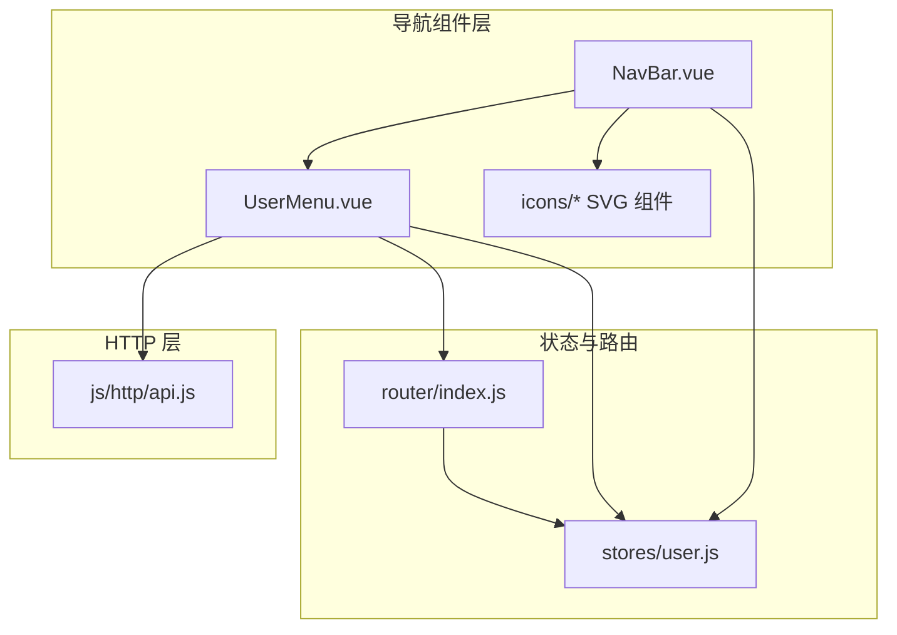
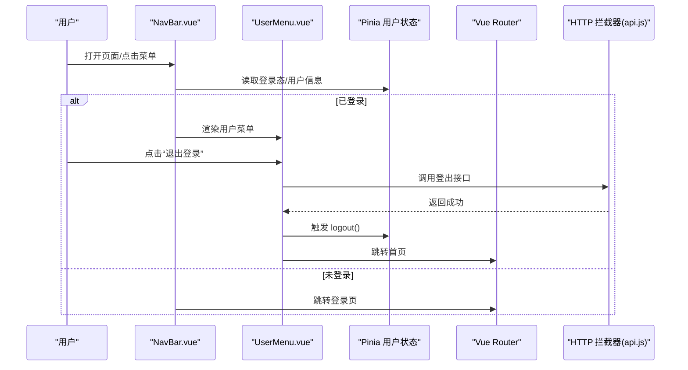
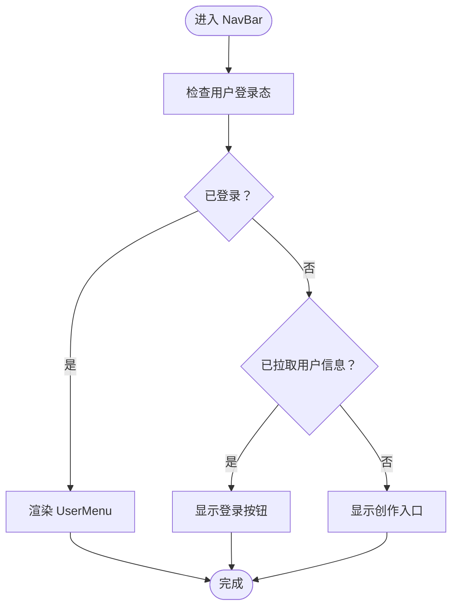
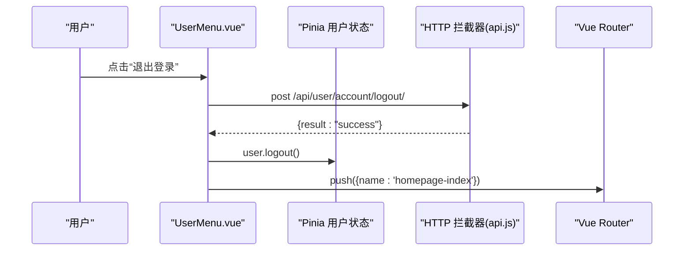
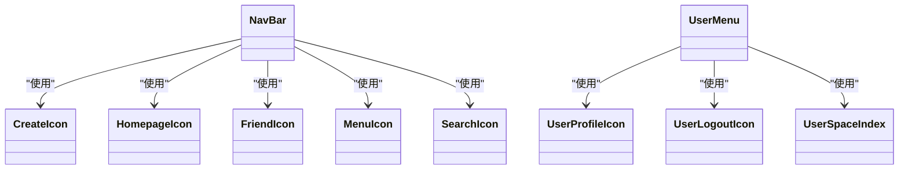
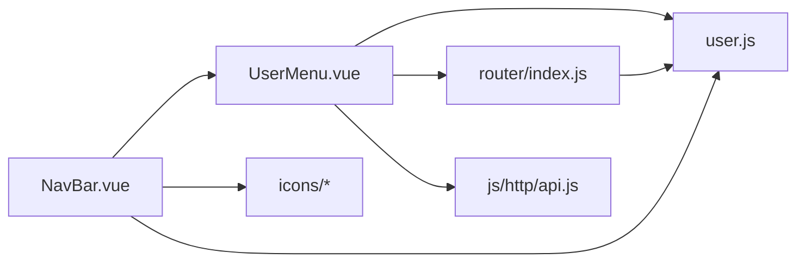

# 导航组件

<cite>
**本文引用的文件**
- [NavBar.vue](file://frontend/src/components/navbar/NavBar.vue)
- [UserMenu.vue](file://frontend/src/components/navbar/UserMenu.vue)
- [CreateIcon.vue](file://frontend/src/components/navbar/icons/CreateIcon.vue)
- [HomepageIcon.vue](file://frontend/src/components/navbar/icons/HomepageIcon.vue)
- [FriendIcon.vue](file://frontend/src/components/navbar/icons/FriendIcon.vue)
- [MenuIcon.vue](file://frontend/src/components/navbar/icons/MenuIcon.vue)
- [SearchIcon.vue](file://frontend/src/components/navbar/icons/SearchIcon.vue)
- [UserProfileIcon.vue](file://frontend/src/components/navbar/icons/UserProfileIcon.vue)
- [UserLogoutIcon.vue](file://frontend/src/components/navbar/icons/UserLogoutIcon.vue)
- [UserSpaceIndex.vue](file://frontend/src/components/navbar/icons/UserSpaceIndex.vue)
- [user.js](file://frontend/src/stores/user.js)
- [index.js](file://frontend/src/router/index.js)
- [api.js](file://frontend/src/js/http/api.js)
- [SpaceIndex.vue](file://frontend/src/views/user/space/SpaceIndex.vue)
- [HomepageIndex.vue](file://frontend/src/views/homepage/HomepageIndex.vue)
- [package.json](file://frontend/package.json)
</cite>

## 目录
1. [简介](#简介)
2. [项目结构](#项目结构)
3. [核心组件](#核心组件)
4. [架构总览](#架构总览)
5. [组件详解](#组件详解)
6. [依赖关系分析](#依赖关系分析)
7. [性能与可访问性](#性能与可访问性)
8. [故障排查](#故障排查)
9. [结论](#结论)
10. [附录：使用示例与最佳实践](#附录使用示例与最佳实践)

## 简介
本技术文档聚焦于 LLM_AIfriends 前端导航组件体系，涵盖导航栏组件 NavBar.vue 的设计架构、图标组件系统以及用户菜单 UserMenu.vue 的交互与权限控制。文档从组件职责、数据流、事件处理、样式与主题适配、可访问性支持等方面进行深入解析，并提供使用示例、扩展指南与最佳实践，帮助开发者快速理解与维护导航子系统。

## 项目结构
导航相关代码集中于前端 src/components/navbar 目录，配合 Pinia 用户状态存储、Vue Router 路由与 daisyUI/Tailwind 样式框架，形成统一的导航体验。

图表来源
- [NavBar.vue:1-77](file://frontend/src/components/navbar/NavBar.vue#L1-L77)
- [UserMenu.vue:1-74](file://frontend/src/components/navbar/UserMenu.vue#L1-L74)
- [user.js:1-53](file://frontend/src/stores/user.js#L1-L53)
- [index.js:1-110](file://frontend/src/router/index.js#L1-L110)
- [api.js:1-93](file://frontend/src/js/http/api.js#L1-L93)

章节来源
- [NavBar.vue:1-77](file://frontend/src/components/navbar/NavBar.vue#L1-L77)
- [UserMenu.vue:1-74](file://frontend/src/components/navbar/UserMenu.vue#L1-L74)
- [user.js:1-53](file://frontend/src/stores/user.js#L1-L53)
- [index.js:1-110](file://frontend/src/router/index.js#L1-L110)
- [api.js:1-93](file://frontend/src/js/http/api.js#L1-L93)

## 核心组件
- 导航栏 NavBar.vue：负责主导航布局、移动端抽屉式侧边栏、搜索输入与登录/创作入口切换、用户菜单挂载点。
- 用户菜单 UserMenu.vue：负责用户头像下拉菜单、个人空间跳转、编辑资料入口、退出登录流程。
- 图标组件系统：以纯 SVG 组件形式提供统一尺寸、描边风格一致的图标，便于主题适配与复用。

章节来源
- [NavBar.vue:1-77](file://frontend/src/components/navbar/NavBar.vue#L1-L77)
- [UserMenu.vue:1-74](file://frontend/src/components/navbar/UserMenu.vue#L1-L74)

## 架构总览
导航组件通过 Pinia 用户状态驱动 UI 行为，结合 Vue Router 的 meta 元信息实现权限控制；HTTP 层通过 axios 拦截器自动注入令牌并处理刷新逻辑，确保导航与业务模块的一致性。

图表来源
- [NavBar.vue:33-42](file://frontend/src/components/navbar/NavBar.vue#L33-L42)
- [UserMenu.vue:17-28](file://frontend/src/components/navbar/UserMenu.vue#L17-L28)
- [user.js:27-33](file://frontend/src/stores/user.js#L27-L33)
- [index.js:99-107](file://frontend/src/router/index.js#L99-L107)
- [api.js:46-89](file://frontend/src/js/http/api.js#L46-L89)

## 组件详解

### 导航栏 NavBar.vue
- 主要职责
  - 移动端抽屉式侧边栏：通过 drawer 开关控制展开/收起，支持工具提示与宽度自适应。
  - 顶部导航区：左侧菜单按钮（MenuIcon）、品牌名；中部搜索区域（SearchIcon + 输入+按钮）；右侧根据登录态显示“创作”入口或“登录”按钮，否则渲染 UserMenu。
  - 侧边菜单项：首页、好友、创作，均使用对应图标组件，支持 active-class 样式联动。
- 响应式与移动端适配
  - 使用 daisyUI drawer 类与条件类名实现不同断点下的宽度与提示展示策略。
  - 侧边栏在关闭时仅保留图标与窄宽度，打开时显示完整文本与更宽面板。
- 条件渲染与权限
  - 依据用户登录态与是否已拉取用户信息决定显示内容。
  - “创作”入口仅在已登录且路由允许时显示。
- 可访问性
  - 抽屉开关标签包含 aria-label，提升屏幕阅读器可用性。

图表来源
- [NavBar.vue:10-42](file://frontend/src/components/navbar/NavBar.vue#L10-L42)

章节来源
- [NavBar.vue:1-77](file://frontend/src/components/navbar/NavBar.vue#L1-L77)

### 用户菜单 UserMenu.vue
- 用户状态管理
  - 通过 Pinia 用户状态获取头像、用户名、ID 等信息，用于下拉菜单头部展示与跳转参数。
- 下拉菜单交互
  - 使用 dropdown-end 定位，内含头像、用户名、个人空间、编辑资料、退出登录等条目。
  - 点击任一菜单项时尝试关闭当前焦点元素，保证交互一致性。
- 权限控制与路由跳转
  - 个人空间与资料编辑均基于路由名称与参数生成链接。
  - 退出登录通过 HTTP 接口调用后触发用户状态 logout，并跳转首页。
- 事件处理
  - handleLogout：异步调用登出接口，成功后清理本地状态并路由跳转。
  - closeMenu：主动失焦，避免菜单项被键盘操作误触。

图表来源
- [UserMenu.vue:17-28](file://frontend/src/components/navbar/UserMenu.vue#L17-L28)
- [api.js:46-89](file://frontend/src/js/http/api.js#L46-L89)
- [index.js:99-107](file://frontend/src/router/index.js#L99-L107)

章节来源
- [UserMenu.vue:1-74](file://frontend/src/components/navbar/UserMenu.vue#L1-L74)
- [user.js:27-33](file://frontend/src/stores/user.js#L27-L33)
- [api.js:1-93](file://frontend/src/js/http/api.js#L1-L93)
- [index.js:1-110](file://frontend/src/router/index.js#L1-L110)

### 图标组件系统
- 设计模式
  - 每个图标均为独立的单文件组件，内部以 SVG 描述图形，保持尺寸与描边风格一致，便于主题适配。
  - 统一使用 inline-block 与 size-* 类控制尺寸，stroke-width、stroke-linecap/join 控制视觉风格。
- SVG 集成与主题适配
  - 图标继承父容器的 color，通过 daisyUI/tailwind 的颜色类可轻松切换主题色。
  - 部分图标采用 stroke="currentColor"，确保与文本色一致。
- 典型图标
  - CreateIcon：圆角外框 + 加号，常用于“创作”入口。
  - HomepageIcon：房屋轮廓，用于“首页”入口。
  - FriendIcon：头像 + 身体，用于“好友”入口。
  - MenuIcon：三条线，用于抽屉开关。
  - SearchIcon：放大镜，用于搜索按钮。
  - UserProfileIcon：人头像，用于“编辑资料”入口。
  - UserLogoutIcon：设备 + 箭头，用于“退出登录”入口。
  - UserSpaceIndex：房屋，用于“个人空间”入口。

图表来源
- [NavBar.vue:2-6](file://frontend/src/components/navbar/NavBar.vue#L2-L6)
- [UserMenu.vue:3-5](file://frontend/src/components/navbar/UserMenu.vue#L3-L5)
- [CreateIcon.vue:1-26](file://frontend/src/components/navbar/icons/CreateIcon.vue#L1-L26)
- [HomepageIcon.vue:1-22](file://frontend/src/components/navbar/icons/HomepageIcon.vue#L1-L22)
- [FriendIcon.vue:1-25](file://frontend/src/components/navbar/icons/FriendIcon.vue#L1-L25)
- [MenuIcon.vue:1-17](file://frontend/src/components/navbar/icons/MenuIcon.vue#L1-L17)
- [SearchIcon.vue:1-22](file://frontend/src/components/navbar/icons/SearchIcon.vue#L1-L22)
- [UserProfileIcon.vue:1-29](file://frontend/src/components/navbar/icons/UserProfileIcon.vue#L1-L29)
- [UserLogoutIcon.vue:1-39](file://frontend/src/components/navbar/icons/UserLogoutIcon.vue#L1-L39)
- [UserSpaceIndex.vue:1-39](file://frontend/src/components/navbar/icons/UserSpaceIndex.vue#L1-L39)

章节来源
- [CreateIcon.vue:1-26](file://frontend/src/components/navbar/icons/CreateIcon.vue#L1-L26)
- [HomepageIcon.vue:1-22](file://frontend/src/components/navbar/icons/HomepageIcon.vue#L1-L22)
- [FriendIcon.vue:1-25](file://frontend/src/components/navbar/icons/FriendIcon.vue#L1-L25)
- [MenuIcon.vue:1-17](file://frontend/src/components/navbar/icons/MenuIcon.vue#L1-L17)
- [SearchIcon.vue:1-22](file://frontend/src/components/navbar/icons/SearchIcon.vue#L1-L22)
- [UserProfileIcon.vue:1-29](file://frontend/src/components/navbar/icons/UserProfileIcon.vue#L1-L29)
- [UserLogoutIcon.vue:1-39](file://frontend/src/components/navbar/icons/UserLogoutIcon.vue#L1-L39)
- [UserSpaceIndex.vue:1-39](file://frontend/src/components/navbar/icons/UserSpaceIndex.vue#L1-L39)

## 依赖关系分析
- 组件耦合
  - NavBar 依赖 UserMenu 与多个图标组件；UserMenu 依赖用户状态与路由。
  - 图标组件彼此独立，无直接耦合，便于替换与扩展。
- 状态与路由
  - 用户状态通过 Pinia 管理，路由 meta 控制权限，二者共同影响 NavBar 的显示逻辑。
- HTTP 与鉴权
  - axios 拦截器统一注入 Authorization，处理 401 并自动刷新令牌；UserMenu 的登出流程依赖该拦截器链路。

图表来源
- [NavBar.vue:1-11](file://frontend/src/components/navbar/NavBar.vue#L1-L11)
- [UserMenu.vue:1-11](file://frontend/src/components/navbar/UserMenu.vue#L1-L11)
- [user.js:1-53](file://frontend/src/stores/user.js#L1-L53)
- [index.js:1-110](file://frontend/src/router/index.js#L1-L110)
- [api.js:1-93](file://frontend/src/js/http/api.js#L1-L93)

章节来源
- [NavBar.vue:1-11](file://frontend/src/components/navbar/NavBar.vue#L1-L11)
- [UserMenu.vue:1-11](file://frontend/src/components/navbar/UserMenu.vue#L1-L11)
- [user.js:1-53](file://frontend/src/stores/user.js#L1-L53)
- [index.js:1-110](file://frontend/src/router/index.js#L1-L110)
- [api.js:1-93](file://frontend/src/js/http/api.js#L1-L93)

## 性能与可访问性
- 性能
  - 图标为轻量 SVG 组件，按需渲染，避免额外资源加载。
  - 抽屉侧边栏宽度切换通过 Tailwind 条件类实现，无 JS 计算开销。
- 可访问性
  - 抽屉开关包含 aria-label，便于屏幕阅读器识别。
  - 下拉菜单使用 role="button" 与 tabindex 管理焦点，点击条目时主动失焦，减少键盘导航干扰。
- 主题适配
  - 图标继承父级 color，可通过 daisyUI 主题类快速切换颜色方案。

章节来源
- [NavBar.vue:19-21](file://frontend/src/components/navbar/NavBar.vue#L19-L21)
- [UserMenu.vue:32-37](file://frontend/src/components/navbar/UserMenu.vue#L32-L37)

## 故障排查
- 登录后仍显示“登录”按钮
  - 检查用户状态是否已设置登录态与用户信息，确认 hasPulledUserInfo 状态更新。
  - 参考路径：[NavBar.vue:33-42](file://frontend/src/components/navbar/NavBar.vue#L33-L42)，[user.js:12-14](file://frontend/src/stores/user.js#L12-L14)，[index.js:99-107](file://frontend/src/router/index.js#L99-L107)
- 退出登录无效
  - 确认 HTTP 拦截器返回的登出结果与用户状态清理流程。
  - 参考路径：[UserMenu.vue:17-28](file://frontend/src/components/navbar/UserMenu.vue#L17-L28)，[api.js:46-89](file://frontend/src/js/http/api.js#L46-L89)，[user.js:27-33](file://frontend/src/stores/user.js#L27-L33)
- 侧边栏无法收起
  - 检查 drawer checkbox 与 label 的 for 属性是否正确绑定。
  - 参考路径：[NavBar.vue:14-21](file://frontend/src/components/navbar/NavBar.vue#L14-L21)

章节来源
- [NavBar.vue:14-42](file://frontend/src/components/navbar/NavBar.vue#L14-L42)
- [UserMenu.vue:17-28](file://frontend/src/components/navbar/UserMenu.vue#L17-L28)
- [user.js:12-33](file://frontend/src/stores/user.js#L12-L33)
- [index.js:99-107](file://frontend/src/router/index.js#L99-L107)
- [api.js:46-89](file://frontend/src/js/http/api.js#L46-L89)

## 结论
导航组件体系以清晰的职责分离与简洁的 SVG 图标系统为基础，结合 Pinia 状态与 Vue Router 权限控制，实现了良好的可维护性与可扩展性。通过 daisyUI 的主题能力与可访问性设计，满足多端一致的用户体验需求。

## 附录：使用示例与最佳实践
- 在页面中引入导航栏
  - 将 NavBar 组件置于应用根布局，作为全局导航容器。
  - 参考路径：[NavBar.vue:13-72](file://frontend/src/components/navbar/NavBar.vue#L13-L72)
- 自定义图标
  - 新增图标组件时，遵循现有 SVG 结构与尺寸规范，确保与 daisyUI 主题一致。
  - 参考路径：[CreateIcon.vue:5-21](file://frontend/src/components/navbar/icons/CreateIcon.vue#L5-L21)，[HomepageIcon.vue:5-17](file://frontend/src/components/navbar/icons/HomepageIcon.vue#L5-L17)
- 扩展用户菜单
  - 新增菜单项时，使用 RouterLink 并传入必要的参数；如涉及退出登录，确保调用正确的接口与状态清理。
  - 参考路径：[UserMenu.vue:31-69](file://frontend/src/components/navbar/UserMenu.vue#L31-L69)，[api.js:46-89](file://frontend/src/js/http/api.js#L46-L89)
- 权限控制
  - 在路由 meta 中设置 needLogin 字段，结合用户状态与 hasPulledUserInfo 实现登录拦截。
  - 参考路径：[index.js:19-22](file://frontend/src/router/index.js#L19-L22)，[index.js:99-107](file://frontend/src/router/index.js#L99-L107)
- 最佳实践
  - 图标尺寸与间距保持一致，避免视觉跳跃。
  - 使用 aria-label 与 role 提升可访问性。
  - 通过条件类名实现响应式布局，减少媒体查询复杂度。
  - 将用户状态与路由权限解耦，便于测试与维护。

章节来源
- [NavBar.vue:13-72](file://frontend/src/components/navbar/NavBar.vue#L13-L72)
- [UserMenu.vue:31-69](file://frontend/src/components/navbar/UserMenu.vue#L31-L69)
- [index.js:19-22](file://frontend/src/router/index.js#L19-L22)
- [index.js:99-107](file://frontend/src/router/index.js#L99-L107)
- [api.js:46-89](file://frontend/src/js/http/api.js#L46-L89)