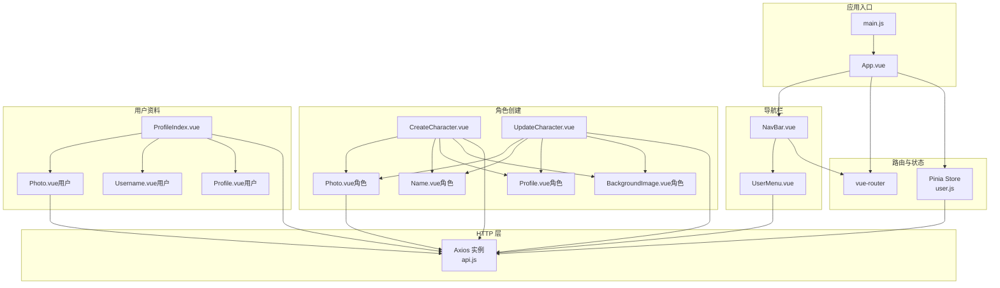
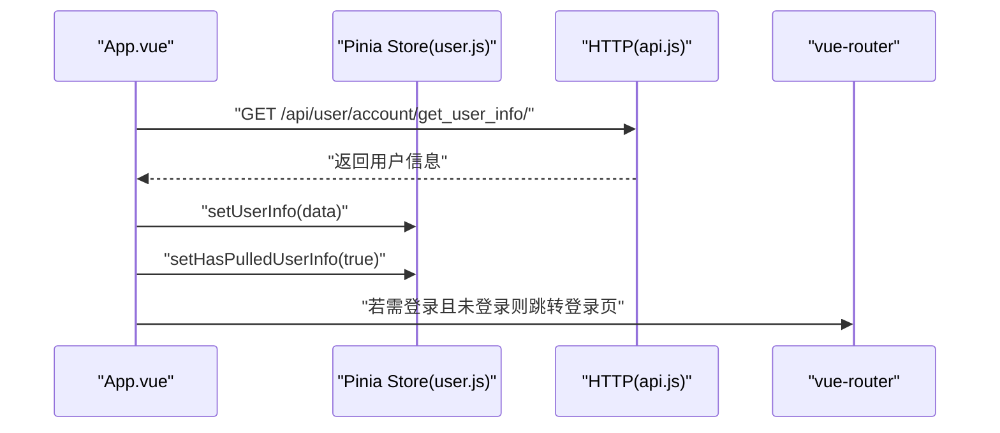
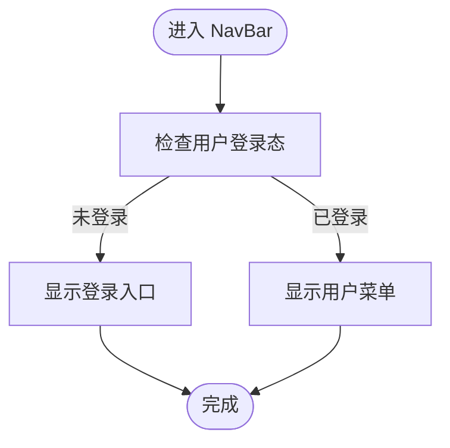
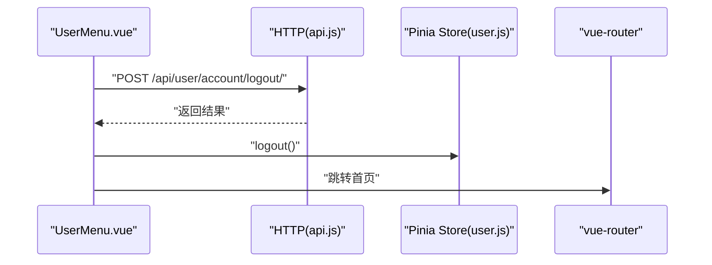
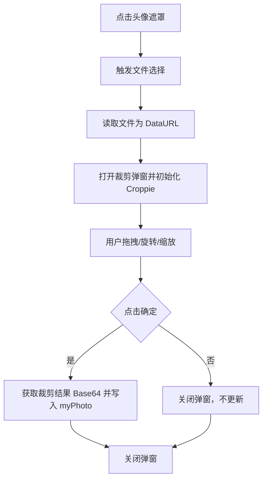
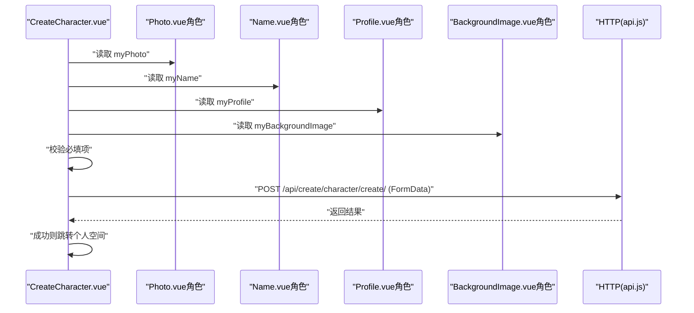
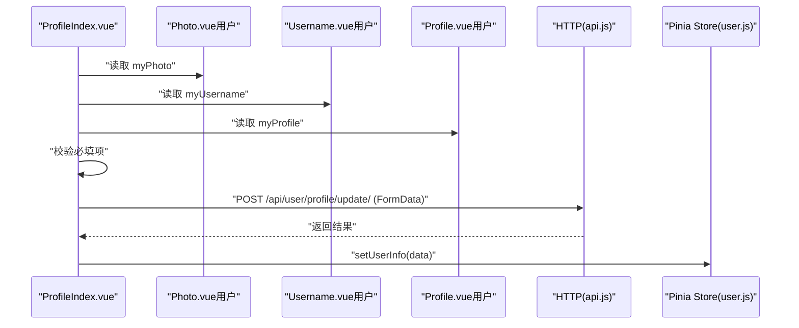
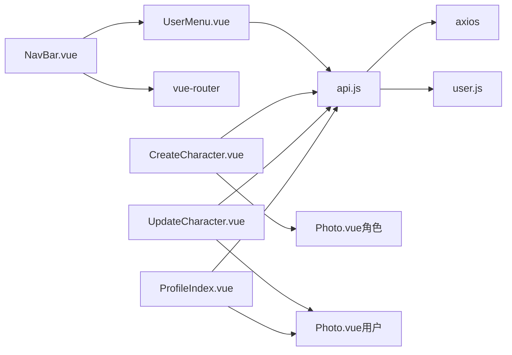

# 组件库

<cite>
**本文引用的文件**
- [App.vue](file://frontend/src/App.vue)
- [main.js](file://frontend/src/main.js)
- [NavBar.vue](file://frontend/src/components/navbar/NavBar.vue)
- [UserMenu.vue](file://frontend/src/components/navbar/UserMenu.vue)
- [user.js](file://frontend/src/stores/user.js)
- [api.js](file://frontend/src/js/http/api.js)
- [CreateCharacter.vue](file://frontend/src/views/create/character/CreateCharacter.vue)
- [UpdateCharacter.vue](file://frontend/src/views/create/character/UpdateCharacter.vue)
- [Photo.vue（角色创建）](file://frontend/src/views/create/character/components/Photo.vue)
- [Name.vue（角色创建）](file://frontend/src/views/create/character/components/Name.vue)
- [Profile.vue（角色创建）](file://frontend/src/views/create/character/components/Profile.vue)
- [BackgroundImage.vue（角色创建）](file://frontend/src/views/create/character/components/BackgroundImage.vue)
- [ProfileIndex.vue](file://frontend/src/views/user/profile/ProfileIndex.vue)
- [Photo.vue（用户资料）](file://frontend/src/views/user/profile/components/Photo.vue)
- [Username.vue（用户资料）](file://frontend/src/views/user/profile/components/Username.vue)
- [Profile.vue（用户资料）](file://frontend/src/views/user/profile/components/Profile.vue)
- [base64_to_file.js](file://frontend/src/js/utils/base64_to_file.js)
- [package.json](file://frontend/package.json)
- [README.md](file://frontend/README.md)
</cite>

## 目录
1. [引言](#引言)
2. [项目结构](#项目结构)
3. [核心组件](#核心组件)
4. [架构总览](#架构总览)
5. [详细组件分析](#详细组件分析)
6. [依赖关系分析](#依赖关系分析)
7. [性能考虑](#性能考虑)
8. [故障排查指南](#故障排查指南)
9. [结论](#结论)
10. [附录](#附录)

## 引言
本技术文档面向 LLM_AIfriends 前端组件库，系统化梳理可复用 Vue 组件的设计理念、实现方式与使用模式。重点覆盖导航栏组件、角色创建组件族、用户资料组件族以及图片上传组件，并阐述组件间通信机制、生命周期管理、性能优化策略、响应式与无障碍支持、跨浏览器兼容性建议，以及扩展与最佳实践。

## 项目结构
前端采用 Vue 3 + Vite + Pinia + vue-router 架构，TailwindCSS 作为样式基础，配合 daisyUI 提供组件样式；后端通过 Axios 发起请求并内置 Token 自动刷新与重试逻辑。

图表来源
- [main.js:1-15](file://frontend/src/main.js#L1-L15)
- [App.vue:1-41](file://frontend/src/App.vue#L1-L41)
- [NavBar.vue:1-77](file://frontend/src/components/navbar/NavBar.vue#L1-L77)
- [UserMenu.vue:1-74](file://frontend/src/components/navbar/UserMenu.vue#L1-L74)
- [user.js:1-53](file://frontend/src/stores/user.js#L1-L53)
- [api.js:1-93](file://frontend/src/js/http/api.js#L1-L93)
- [CreateCharacter.vue:1-84](file://frontend/src/views/create/character/CreateCharacter.vue#L1-L84)
- [UpdateCharacter.vue:1-109](file://frontend/src/views/create/character/UpdateCharacter.vue#L1-L109)
- [Photo.vue（角色创建）:1-99](file://frontend/src/views/create/character/components/Photo.vue#L1-L99)
- [Photo.vue（用户资料）:1-100](file://frontend/src/views/user/profile/components/Photo.vue#L1-L100)
- [ProfileIndex.vue:1-71](file://frontend/src/views/user/profile/ProfileIndex.vue#L1-L71)

章节来源
- [main.js:1-15](file://frontend/src/main.js#L1-L15)
- [package.json:1-30](file://frontend/package.json#L1-L30)
- [README.md:1-39](file://frontend/README.md#L1-L39)

## 核心组件
- 导航栏组件：提供移动端抽屉式侧边栏、搜索框、登录/创作入口与用户菜单联动。
- 用户菜单组件：展示头像、用户名、跳转到个人空间与资料页、退出登录。
- 角色创建组件族：头像裁剪、名称输入、简介输入、背景图选择，统一暴露内部状态供父级收集。
- 用户资料组件族：头像裁剪、用户名输入、简介输入，支持更新用户信息。
- 全局状态：用户信息、登录态、头像、昵称、简介、Token 等。
- HTTP 封装：统一请求头注入、401 自动刷新 Token、失败回退与重试队列。

章节来源
- [NavBar.vue:1-77](file://frontend/src/components/navbar/NavBar.vue#L1-L77)
- [UserMenu.vue:1-74](file://frontend/src/components/navbar/UserMenu.vue#L1-L74)
- [user.js:1-53](file://frontend/src/stores/user.js#L1-L53)
- [api.js:1-93](file://frontend/src/js/http/api.js#L1-L93)

## 架构总览
应用启动时初始化 Pinia 与路由，App 在挂载阶段拉取用户信息并设置“已拉取”标记，随后根据路由元信息判断是否需要登录并进行页面跳转。导航栏根据用户登录态显示不同入口；用户菜单负责登出流程与页面跳转；角色创建与用户资料页通过子组件暴露的状态值收集表单数据，统一以 FormData 形式提交至后端。

图表来源
- [App.vue:12-29](file://frontend/src/App.vue#L12-L29)
- [user.js:20-37](file://frontend/src/stores/user.js#L20-L37)
- [api.js:16-19](file://frontend/src/js/http/api.js#L16-L19)

## 详细组件分析

### 导航栏组件（NavBar）
- 设计理念
  - 移动优先：左侧抽屉开关，右侧为搜索区与登录/创作入口或用户菜单。
  - 响应式：侧边栏在大屏下常驻，小屏下抽屉展开。
  - 可组合：通过插槽承载主内容区域。
- 关键功能
  - 抽屉开关控制侧边栏显隐。
  - 搜索框与按钮（占位交互）。
  - 登录/创作入口与用户菜单的条件渲染。
- 依赖与通信
  - 使用用户状态决定显示逻辑。
  - 与 UserMenu 联动，共享用户信息与路由跳转。
- 样式与主题
  - Tailwind/Turbo + daisyUI 主题类名控制外观。
- 无障碍与兼容性
  - label for 绑定抽屉开关，提供可访问的 ARIA 标签。
  - 建议为搜索输入提供键盘快捷键提示。

图表来源
- [NavBar.vue:34-42](file://frontend/src/components/navbar/NavBar.vue#L34-L42)
- [user.js:12-14](file://frontend/src/stores/user.js#L12-L14)

章节来源
- [NavBar.vue:1-77](file://frontend/src/components/navbar/NavBar.vue#L1-L77)

### 用户菜单组件（UserMenu）
- 设计理念
  - 下拉菜单承载用户操作入口，包含头像、用户名、个人空间、资料页与退出登录。
- 关键功能
  - 头像点击关闭当前焦点元素，避免失焦异常。
  - 退出登录：调用后端接口，成功后清空本地登录状态并跳转首页。
- 依赖与通信
  - 读取用户头像与用户名，触发路由跳转。
  - 与全局状态与 HTTP 层协作完成登出流程。
- 样式与主题
  - daisyUI dropdown-end 与 menu 组件样式。
- 无障碍与兼容性
  - 按钮具备 role 与 tabindex，确保键盘可达。
  - 建议为菜单项提供键盘导航支持。

图表来源
- [UserMenu.vue:17-28](file://frontend/src/components/navbar/UserMenu.vue#L17-L28)
- [api.js:68-84](file://frontend/src/js/http/api.js#L68-L84)
- [user.js:27-33](file://frontend/src/stores/user.js#L27-L33)

章节来源
- [UserMenu.vue:1-74](file://frontend/src/components/navbar/UserMenu.vue#L1-L74)

### 图片上传组件（Photo.vue）
- 设计理念
  - 基于 Croppie 的图片裁剪与预览，支持方形视口与旋转。
  - 通过隐藏 file input 触发选择，弹窗内进行裁剪确认。
  - 通过 defineExpose 暴露出 myPhoto，供父组件读取裁剪后的 Base64。
- 关键功能
  - 文件选择 -> 预览弹窗 -> 裁剪 -> 写回 myPhoto -> 关闭弹窗。
  - 组件销毁时释放 Croppie 实例，避免内存泄漏。
- 依赖与通信
  - 依赖 croppie 与 croppie.css。
  - 与父组件通过模板引用与暴露属性协同。
- 样式与主题
  - Tailwind 控制布局与尺寸，daisyUI modal 行为。
- 性能与体验
  - 首次绑定时初始化 Croppie，避免重复开销。
  - 使用 nextTick 确保 DOM 更新后再初始化裁剪器（用户资料版本）。
- 无障碍与兼容性
  - 为遮罩层提供点击触发，确保触控设备可用。
  - 建议为裁剪器容器提供可访问的标题与描述。

图表来源
- [Photo.vue（角色创建）:19-45](file://frontend/src/views/create/character/components/Photo.vue#L19-L45)
- [Photo.vue（用户资料）:19-46](file://frontend/src/views/user/profile/components/Photo.vue#L19-L46)

章节来源
- [Photo.vue（角色创建）:1-99](file://frontend/src/views/create/character/components/Photo.vue#L1-L99)
- [Photo.vue（用户资料）:1-100](file://frontend/src/views/user/profile/components/Photo.vue#L1-L100)

### 角色创建组件族（CreateCharacter / UpdateCharacter）
- 设计理念
  - 通过多个子组件分别负责头像、名称、简介、背景图，父组件统一收集并提交。
  - 创建与更新流程相似，但更新页额外加载已有角色数据。
- 关键功能
  - 子组件通过 defineExpose 暴露内部状态，父组件使用模板引用读取。
  - 收集字段校验：必填项为空时提示错误信息。
  - 使用 FormData 传输 Base64 转 File 后的二进制资源。
- 依赖与通信
  - 依赖 base64ToFile 工具函数转换 Base64。
  - 依赖 HTTP 层进行网络请求与 Token 管理。
  - 依赖路由进行成功后的页面跳转。
- 样式与主题
  - 卡片布局与 daisyUI 按钮、输入框样式。
- 性能与体验
  - 仅在变更时上传头像与背景图，减少不必要的网络传输。
  - 错误信息即时反馈，避免无效提交。
- 无障碍与兼容性
  - 输入框具备标签与占位符，提升可读性。
  - 建议为按钮提供禁用态与加载态反馈。

图表来源
- [CreateCharacter.vue:21-59](file://frontend/src/views/create/character/CreateCharacter.vue#L21-L59)
- [Photo.vue（角色创建）:63-65](file://frontend/src/views/create/character/components/Photo.vue#L63-L65)
- [Name.vue（角色创建）:11-13](file://frontend/src/views/create/character/components/Name.vue#L11-L13)
- [Profile.vue（角色创建）:1-20](file://frontend/src/views/create/character/components/Profile.vue#L1-L20)
- [BackgroundImage.vue（角色创建）:1-20](file://frontend/src/views/create/character/components/BackgroundImage.vue#L1-L20)
- [base64_to_file.js:1-10](file://frontend/src/js/utils/base64_to_file.js#L1-L10)

章节来源
- [CreateCharacter.vue:1-84](file://frontend/src/views/create/character/CreateCharacter.vue#L1-L84)
- [UpdateCharacter.vue:1-109](file://frontend/src/views/create/character/UpdateCharacter.vue#L1-L109)
- [Name.vue（角色创建）:1-25](file://frontend/src/views/create/character/components/Name.vue#L1-L25)
- [Profile.vue（角色创建）:1-20](file://frontend/src/views/create/character/components/Profile.vue#L1-L20)
- [BackgroundImage.vue（角色创建）:1-20](file://frontend/src/views/create/character/components/BackgroundImage.vue#L1-L20)
- [base64_to_file.js:1-10](file://frontend/src/js/utils/base64_to_file.js#L1-L10)

### 用户资料组件族（ProfileIndex）
- 设计理念
  - 与角色创建组件一致的分治思想：头像、用户名、简介分别由独立子组件维护。
  - 更新成功后同步 Pinia 中的用户信息，保证全局状态一致性。
- 关键功能
  - 仅在头像或用户名、简介有变化时才上传对应字段。
  - 成功后调用 setUserInfo 更新全局状态。
- 依赖与通信
  - 依赖 base64ToFile 工具函数与 HTTP 层。
  - 依赖 Pinia 用户状态进行信息回写。
- 样式与主题
  - 卡片布局与 daisyUI 表单组件。
- 无障碍与兼容性
  - 输入框具备清晰标签，建议提供实时校验提示。

图表来源
- [ProfileIndex.vue:17-47](file://frontend/src/views/user/profile/ProfileIndex.vue#L17-L47)
- [Photo.vue（用户资料）:65-67](file://frontend/src/views/user/profile/components/Photo.vue#L65-L67)
- [Username.vue（用户资料）:11-13](file://frontend/src/views/user/profile/components/Username.vue#L11-L13)
- [Profile.vue（用户资料）:1-20](file://frontend/src/views/user/profile/components/Profile.vue#L1-L20)
- [user.js:20-25](file://frontend/src/stores/user.js#L20-L25)

章节来源
- [ProfileIndex.vue:1-71](file://frontend/src/views/user/profile/ProfileIndex.vue#L1-L71)
- [Username.vue（用户资料）:1-25](file://frontend/src/views/user/profile/components/Username.vue#L1-L25)
- [Profile.vue（用户资料）:1-20](file://frontend/src/views/user/profile/components/Profile.vue#L1-L20)

## 依赖关系分析
- 运行时依赖
  - Vue 3、vue-router、Pinia、Axios、TailwindCSS、daisyUI、croppie。
- 组件耦合
  - 导航栏与用户菜单强依赖用户状态；角色创建与用户资料页依赖图片裁剪组件与 HTTP 层。
- 外部集成点
  - 后端接口：用户信息、登录/注册、登出、刷新 Token、角色创建/更新、用户资料更新。
- 循环依赖
  - 未发现直接循环依赖；状态与 HTTP 层通过工具函数解耦。

图表来源
- [NavBar.vue:1-11](file://frontend/src/components/navbar/NavBar.vue#L1-L11)
- [UserMenu.vue:1-10](file://frontend/src/components/navbar/UserMenu.vue#L1-L10)
- [CreateCharacter.vue:1-10](file://frontend/src/views/create/character/CreateCharacter.vue#L1-L10)
- [UpdateCharacter.vue:1-10](file://frontend/src/views/create/character/UpdateCharacter.vue#L1-L10)
- [ProfileIndex.vue:1-9](file://frontend/src/views/user/profile/ProfileIndex.vue#L1-L9)
- [api.js:11-19](file://frontend/src/js/http/api.js#L11-L19)
- [user.js:1-10](file://frontend/src/stores/user.js#L1-L10)

章节来源
- [package.json:14-28](file://frontend/package.json#L14-L28)

## 性能考虑
- 组件性能
  - 图片裁剪：仅在首次打开弹窗时初始化 Croppie，组件卸载时销毁实例，避免重复创建与内存泄漏。
  - 表单提交：仅在字段变更时上传对应资源，减少网络与存储压力。
- 状态与缓存
  - 用户信息一次性拉取并标记“已拉取”，避免重复请求。
  - Token 自动刷新：401 时串行刷新，订阅重试队列，避免并发风暴。
- 样式与构建
  - Tailwind/Turbo 按需生成样式，结合 daisyUI 减少自定义样式成本。
- 可访问性与兼容性
  - 为关键交互元素提供 ARIA 标签与键盘可达性。
  - 建议在生产环境开启压缩与懒加载，确保跨浏览器稳定性。

[本节为通用指导，无需特定文件引用]

## 故障排查指南
- 登录态失效
  - 现象：接口返回 401。
  - 处理：自动触发刷新 Token 流程；若刷新失败则清空登录状态并中断重试队列。
  - 参考路径：[api.js:46-89](file://frontend/src/js/http/api.js#L46-L89)
- 图片裁剪异常
  - 现象：裁剪弹窗无法打开或裁剪失败。
  - 排查：确认 croppie 实例已初始化、DOM 已就绪、文件类型正确。
  - 参考路径：[Photo.vue（角色创建）:19-45](file://frontend/src/views/create/character/components/Photo.vue#L19-L45)、[Photo.vue（用户资料）:19-46](file://frontend/src/views/user/profile/components/Photo.vue#L19-L46)
- 表单提交失败
  - 现象：提示字段为空或后端返回错误。
  - 排查：检查子组件是否正确暴露 myXxx，父组件是否读取并校验，FormData 是否包含必要字段。
  - 参考路径：[CreateCharacter.vue:21-59](file://frontend/src/views/create/character/CreateCharacter.vue#L21-L59)、[ProfileIndex.vue:17-47](file://frontend/src/views/user/profile/ProfileIndex.vue#L17-L47)
- 导航跳转异常
  - 现象：登录/创作入口未按预期显示。
  - 排查：确认用户登录态与“已拉取”状态，检查路由命名与权限元信息。
  - 参考路径：[App.vue:23-27](file://frontend/src/App.vue#L23-L27)、[NavBar.vue:34-42](file://frontend/src/components/navbar/NavBar.vue#L34-L42)

章节来源
- [api.js:46-89](file://frontend/src/js/http/api.js#L46-L89)
- [Photo.vue（角色创建）:19-45](file://frontend/src/views/create/character/components/Photo.vue#L19-L45)
- [Photo.vue（用户资料）:19-46](file://frontend/src/views/user/profile/components/Photo.vue#L19-L46)
- [CreateCharacter.vue:21-59](file://frontend/src/views/create/character/CreateCharacter.vue#L21-L59)
- [ProfileIndex.vue:17-47](file://frontend/src/views/user/profile/ProfileIndex.vue#L17-L47)
- [App.vue:23-27](file://frontend/src/App.vue#L23-L27)
- [NavBar.vue:34-42](file://frontend/src/components/navbar/NavBar.vue#L34-L42)

## 结论
该组件库以模块化与可复用为核心，通过子组件暴露内部状态、父组件统一收集与校验、Pinia 管理用户状态、Axios 封装统一处理 Token 与错误，形成清晰的数据流与职责边界。图片裁剪组件在易用性与性能之间取得平衡，导航栏与用户菜单提供良好的移动端体验。建议后续完善可访问性与国际化支持，并持续优化首屏与交互反馈。

[本节为总结，无需特定文件引用]

## 附录
- 使用示例与最佳实践
  - 在父组件中使用模板引用读取子组件暴露的 myXxx 字段，集中校验后再组装 FormData。
  - 对于可选字段，仅在值发生实际变化时才上传，减少网络与存储消耗。
  - 为关键按钮提供禁用态与加载态，提升用户体验。
- 扩展指南
  - 新增子组件时遵循“接收 props -> 内部 ref -> watch 同步 -> defineExpose 暴露”的模式。
  - 新增路由页面时，利用 App 的登录态判断与路由守卫策略，保持一致的权限控制。
- 响应式与无障碍
  - 使用 Tailwind 断点类适配移动端与桌面端；为交互元素提供 ARIA 标签与键盘可达性。
- 跨浏览器兼容性
  - 建议在 CI 中测试主流浏览器；对较老浏览器补充 polyfill（如需要）。

[本节为通用指导，无需特定文件引用]