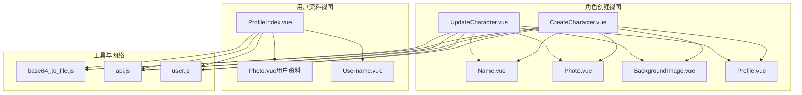
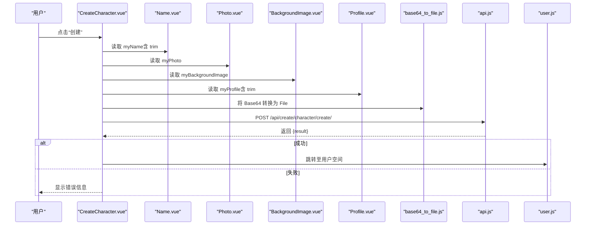
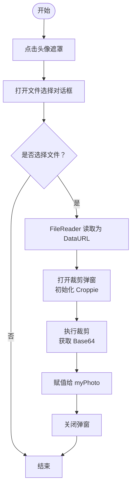
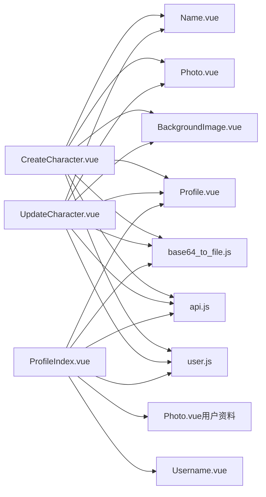

# 表单组件

<cite>
**本文引用的文件列表**
- [Name.vue](file://frontend/src/views/create/character/components/Name.vue)
- [Photo.vue](file://frontend/src/views/create/character/components/Photo.vue)
- [BackgroundImage.vue](file://frontend/src/views/create/character/components/BackgroundImage.vue)
- [Profile.vue](file://frontend/src/views/create/character/components/Profile.vue)
- [CreateCharacter.vue](file://frontend/src/views/create/character/CreateCharacter.vue)
- [UpdateCharacter.vue](file://frontend/src/views/create/character/UpdateCharacter.vue)
- [base64_to_file.js](file://frontend/src/js/utils/base64_to_file.js)
- [api.js](file://frontend/src/js/http/api.js)
- [user.js](file://frontend/src/stores/user.js)
- [CameraIcon.vue](file://frontend/src/views/user/profile/components/icon/CameraIcon.vue)
- [Photo.vue（用户资料）](file://frontend/src/views/user/profile/components/Photo.vue)
- [Username.vue](file://frontend/src/views/user/profile/components/Username.vue)
- [ProfileIndex.vue](file://frontend/src/views/user/profile/ProfileIndex.vue)
- [package.json](file://frontend/package.json)
</cite>

## 目录
1. [引言](#引言)
2. [项目结构](#项目结构)
3. [核心组件](#核心组件)
4. [架构总览](#架构总览)
5. [组件详细分析](#组件详细分析)
6. [依赖关系分析](#依赖关系分析)
7. [性能与安全考量](#性能与安全考量)
8. [故障排查指南](#故障排查指南)
9. [结论](#结论)
10. [附录](#附录)

## 引言
本技术文档聚焦于 LLM_AIfriends 前端表单组件体系，重点覆盖“角色创建表单”与“用户资料表单”的设计与实现。文档从数据绑定、输入验证、错误处理到用户体验优化进行系统化梳理，并给出使用示例、可定制配置与扩展建议。同时，针对图片上传、裁剪、Base64 转换与文件处理流程进行深入解析，涵盖安全、性能与兼容性方面的实践要点。

## 项目结构
前端采用 Vue 3 + Vite 架构，表单组件主要位于以下路径：
- 角色创建视图：frontend/src/views/create/character/components/
- 用户资料视图：frontend/src/views/user/profile/components/
- 工具与网络层：frontend/src/js/utils/、frontend/src/js/http/、frontend/src/stores/

图表来源
- [CreateCharacter.vue:1-84](file://frontend/src/views/create/character/CreateCharacter.vue#L1-L84)
- [UpdateCharacter.vue:1-109](file://frontend/src/views/create/character/UpdateCharacter.vue#L1-L109)
- [Name.vue:1-25](file://frontend/src/views/create/character/components/Name.vue#L1-L25)
- [Photo.vue:1-99](file://frontend/src/views/create/character/components/Photo.vue#L1-L99)
- [BackgroundImage.vue:1-99](file://frontend/src/views/create/character/components/BackgroundImage.vue#L1-L99)
- [Profile.vue:1-25](file://frontend/src/views/create/character/components/Profile.vue#L1-L25)
- [ProfileIndex.vue:1-71](file://frontend/src/views/user/profile/ProfileIndex.vue#L1-L71)
- [Photo.vue（用户资料）:1-100](file://frontend/src/views/user/profile/components/Photo.vue#L1-L100)
- [Username.vue:1-25](file://frontend/src/views/user/profile/components/Username.vue#L1-L25)
- [base64_to_file.js:1-10](file://frontend/src/js/utils/base64_to_file.js#L1-L10)
- [api.js:1-93](file://frontend/src/js/http/api.js#L1-L93)
- [user.js:1-53](file://frontend/src/stores/user.js#L1-L53)

章节来源
- [CreateCharacter.vue:1-84](file://frontend/src/views/create/character/CreateCharacter.vue#L1-L84)
- [UpdateCharacter.vue:1-109](file://frontend/src/views/create/character/UpdateCharacter.vue#L1-L109)
- [ProfileIndex.vue:1-71](file://frontend/src/views/user/profile/ProfileIndex.vue#L1-L71)

## 核心组件
本节概述三个关键表单组件及其职责：
- Name.vue：文本输入组件，支持双向绑定与外部值同步。
- Photo.vue：头像上传与裁剪组件，基于 Croppie 实现方形裁剪与 Base64 输出。
- BackgroundImage.vue：背景图上传与裁剪组件，基于 Croppie 实现指定宽高比裁剪与 Base64 输出。
- Profile.vue：多行文本输入组件，用于角色或用户简介。
- 用户资料 Photo.vue：与角色创建 Photo.vue 相同逻辑，但无裁剪弹窗，直接显示头像。

章节来源
- [Name.vue:1-25](file://frontend/src/views/create/character/components/Name.vue#L1-L25)
- [Photo.vue:1-99](file://frontend/src/views/create/character/components/Photo.vue#L1-L99)
- [BackgroundImage.vue:1-99](file://frontend/src/views/create/character/components/BackgroundImage.vue#L1-L99)
- [Profile.vue:1-25](file://frontend/src/views/create/character/components/Profile.vue#L1-L25)
- [Photo.vue（用户资料）:1-100](file://frontend/src/views/user/profile/components/Photo.vue#L1-L100)

## 架构总览
下图展示角色创建与用户资料编辑的表单数据流与交互链路。

图表来源
- [CreateCharacter.vue:21-59](file://frontend/src/views/create/character/CreateCharacter.vue#L21-L59)
- [Name.vue:4-13](file://frontend/src/views/create/character/components/Name.vue#L4-L13)
- [Photo.vue:63-65](file://frontend/src/views/create/character/components/Photo.vue#L63-L65)
- [BackgroundImage.vue:62-64](file://frontend/src/views/create/character/components/BackgroundImage.vue#L62-L64)
- [Profile.vue:4-13](file://frontend/src/views/create/character/components/Profile.vue#L4-L13)
- [base64_to_file.js:1-10](file://frontend/src/js/utils/base64_to_file.js#L1-L10)
- [api.js:14-19](file://frontend/src/js/http/api.js#L14-L19)

## 组件详细分析

### Name.vue：输入验证、字符限制与实时反馈
- 数据绑定与同步
  - 使用响应式 ref 暴露 myName，并通过 watch 监听父组件传入的 name 属性变化，确保外部值变更时组件内部能同步更新。
  - 通过 defineExpose 暴露 myName，供父组件通过模板引用读取当前值。
- 输入行为
  - 使用 v-model 双向绑定，便于实时输入与校验。
- 验证与反馈
  - 在父组件（CreateCharacter.vue、UpdateCharacter.vue、ProfileIndex.vue）中对 myName 进行非空校验与 trim 处理；若为空，设置错误消息并阻止提交。
- 字符限制
  - 当前组件未内置字符长度限制；如需限制，可在父组件中增加 maxLength 校验与提示。
- 实时反馈
  - 通过父组件的错误消息区域进行即时反馈，提升用户体验。

章节来源
- [Name.vue:1-25](file://frontend/src/views/create/character/components/Name.vue#L1-L25)
- [CreateCharacter.vue:23-25](file://frontend/src/views/create/character/CreateCharacter.vue#L23-L25)
- [UpdateCharacter.vue:40-43](file://frontend/src/views/create/character/UpdateCharacter.vue#L40-L43)
- [ProfileIndex.vue:17-20](file://frontend/src/views/user/profile/ProfileIndex.vue#L17-L20)

### Photo.vue：图片上传、裁剪、Base64 转换与文件处理
- 文件选择与读取
  - 通过隐藏的 input[type=file] 接收图片文件，使用 FileReader 将图片读取为 DataURL 并打开裁剪弹窗。
- 裁剪与预览
  - 使用 Croppie 初始化方形视口（200x200），绑定 DataURL 并允许旋转与边界约束。
- 结果输出
  - 调用 croppie.result 获取 Base64 图片，赋值给 myPhoto 并关闭弹窗。
- 生命周期与资源释放
  - 在 onBeforeUnmount 中销毁 Croppie 实例，避免内存泄漏。
- 用户交互
  - 点击头像遮罩触发文件选择；遮罩内嵌入 CameraIcon 提升可发现性。
- 文件处理
  - 父组件通过 base64ToFile 将 Base64 转换为 File 后再通过 FormData 提交到后端。

图表来源
- [Photo.vue:19-65](file://frontend/src/views/create/character/components/Photo.vue#L19-L65)
- [base64_to_file.js:1-10](file://frontend/src/js/utils/base64_to_file.js#L1-L10)

章节来源
- [Photo.vue:1-99](file://frontend/src/views/create/character/components/Photo.vue#L1-L99)
- [base64_to_file.js:1-10](file://frontend/src/js/utils/base64_to_file.js#L1-L10)
- [CameraIcon.vue:1-16](file://frontend/src/views/user/profile/components/icon/CameraIcon.vue#L1-L16)

### BackgroundImage.vue：背景图片选择、预览与尺寸适配
- 功能特性
  - 与 Photo.vue 类似，但裁剪视口为 300x500（纵向背景），边界为 600x600，确保大图可充分缩放。
  - 支持旋转与边界约束，保证裁剪质量。
- 用户体验
  - 通过占位样式与 CameraIcon 提示用户点击选择图片。
- 数据输出
  - 裁剪完成后以 Base64 形式赋值给 myBackgroundImage，供父组件使用。

章节来源
- [BackgroundImage.vue:1-99](file://frontend/src/views/create/character/components/BackgroundImage.vue#L1-L99)

### Profile.vue：简介输入与数据绑定
- 数据绑定
  - 使用 textarea v-model 双向绑定 myProfile，支持多行输入。
- 父组件校验
  - 在提交时对 myProfile 进行非空与 trim 校验，防止空内容提交。

章节来源
- [Profile.vue:1-25](file://frontend/src/views/create/character/components/Profile.vue#L1-L25)
- [CreateCharacter.vue:24-25](file://frontend/src/views/create/character/CreateCharacter.vue#L24-L25)
- [UpdateCharacter.vue:42-43](file://frontend/src/views/create/character/UpdateCharacter.vue#L42-L43)
- [ProfileIndex.vue:17-20](file://frontend/src/views/user/profile/ProfileIndex.vue#L17-L20)

### 用户资料 Photo.vue：简化版头像组件
- 与角色创建 Photo.vue 相同的裁剪逻辑，但未使用弹窗，直接在页面内显示裁剪结果。
- 适用于用户资料编辑场景，减少交互层级。

章节来源
- [Photo.vue（用户资料）:1-100](file://frontend/src/views/user/profile/components/Photo.vue#L1-L100)

## 依赖关系分析
- 组件间依赖
  - CreateCharacter.vue/UpdateCharacter.vue/ProfileIndex.vue 作为容器组件，组合多个子表单组件并通过模板引用读取其内部状态。
  - Photo.vue/BackgroundImage.vue 依赖 Croppie 进行裁剪，依赖 base64_to_file.js 将 Base64 转换为 File。
- 网络与状态
  - api.js 统一管理请求与 Token 刷新逻辑，user.js 管理用户状态。
- 第三方库
  - package.json 显示依赖 croppie、vue、vue-router、pinia、axios 等。

图表来源
- [CreateCharacter.vue:1-11](file://frontend/src/views/create/character/CreateCharacter.vue#L1-L11)
- [UpdateCharacter.vue:1-11](file://frontend/src/views/create/character/UpdateCharacter.vue#L1-L11)
- [ProfileIndex.vue:1-9](file://frontend/src/views/user/profile/ProfileIndex.vue#L1-L9)
- [base64_to_file.js:1-10](file://frontend/src/js/utils/base64_to_file.js#L1-L10)
- [api.js:1-93](file://frontend/src/js/http/api.js#L1-L93)
- [user.js:1-53](file://frontend/src/stores/user.js#L1-L53)

章节来源
- [package.json:14-22](file://frontend/package.json#L14-L22)

## 性能与安全考量
- 性能优化
  - 图片裁剪在前端完成，避免大图直接上传，降低网络开销与后端压力。
  - Croppie 实例在组件卸载时销毁，防止内存泄漏。
  - 使用 FormData 传输文件，避免 Base64 的额外编码开销。
- 安全考虑
  - 前端仅做基础校验，后端仍需进行严格的文件类型、大小与内容检查。
  - 通过 axios 拦截器统一注入 Authorization，配合后端 Token 刷新机制保障会话安全。
- 兼容性处理
  - Croppie 依赖现代浏览器的 FileReader 与 Canvas API；在旧环境需提供降级方案或提示。
  - 通过 accept="image/*" 限制文件类型，减少无效文件带来的处理成本。

章节来源
- [Photo.vue:59-61](file://frontend/src/views/create/character/components/Photo.vue#L59-L61)
- [BackgroundImage.vue:58-60](file://frontend/src/views/create/character/components/BackgroundImage.vue#L58-L60)
- [api.js:21-89](file://frontend/src/js/http/api.js#L21-L89)

## 故障排查指南
- 常见问题与定位
  - 无法打开裁剪弹窗：检查 Croppie 初始化参数与 DOM 渲染时机，必要时在 openModal 中加入 nextTick。
  - 裁剪结果为空：确认 croppie 实例已正确绑定 DataURL，且裁剪操作已完成。
  - 提交失败：查看父组件错误消息区域，确认必填项校验与后端返回的错误信息。
  - Token 过期：api.js 已内置刷新逻辑，若仍失败，检查刷新接口与 Cookie 设置。
- 建议的日志与调试
  - 在 onFileChange、crop、handleCreate 等关键函数中添加日志，便于定位问题。
  - 对 FileReader 与 Croppie 的异常进行捕获与提示。

章节来源
- [Photo.vue:19-65](file://frontend/src/views/create/character/components/Photo.vue#L19-L65)
- [BackgroundImage.vue:18-64](file://frontend/src/views/create/character/components/BackgroundImage.vue#L18-L64)
- [CreateCharacter.vue:21-59](file://frontend/src/views/create/character/CreateCharacter.vue#L21-L59)
- [api.js:46-89](file://frontend/src/js/http/api.js#L46-L89)

## 结论
本表单组件体系围绕“角色创建”与“用户资料”两大场景构建，通过轻量的子组件组合与统一的父组件校验，实现了清晰的数据流与良好的用户体验。Photo.vue 与 BackgroundImage.vue 以 Croppie 为核心，提供了直观的图片裁剪能力；Name.vue、Profile.vue 与用户资料 Photo.vue/Username.vue 则分别满足文本输入与头像编辑需求。结合 api.js 的 Token 管理与 user.js 的状态存储，整体具备较好的可维护性与扩展性。

## 附录

### 使用示例与自定义配置
- 角色创建
  - 在 CreateCharacter.vue 中组合 Name、Photo、Profile、BackgroundImage 四个子组件，通过模板引用读取其内部状态并进行校验与提交。
  - 若需调整裁剪尺寸，可在 Photo.vue/BackgroundImage.vue 的 Croppie 初始化参数中修改 viewport/boundary。
- 用户资料编辑
  - 在 ProfileIndex.vue 中组合 Photo（用户资料）、Username、Profile 三个子组件，按相同方式读取与校验状态。
- 自定义配置
  - 可在父组件中增加 maxLength、pattern 等校验规则，或引入更复杂的正则表达式与国际化提示。
  - 可在 Photo.vue/BackgroundImage.vue 中增加预设裁剪比例或禁用旋转等选项。

章节来源
- [CreateCharacter.vue:61-80](file://frontend/src/views/create/character/CreateCharacter.vue#L61-L80)
- [UpdateCharacter.vue:87-105](file://frontend/src/views/create/character/UpdateCharacter.vue#L87-L105)
- [ProfileIndex.vue:50-71](file://frontend/src/views/user/profile/ProfileIndex.vue#L50-L71)

### 扩展方法
- 新增字段
  - 在对应父组件中新增模板引用与校验逻辑，并在后端接口中同步新增字段。
- 图片格式与大小
  - 在父组件中增加文件类型与大小校验，或在 Croppie 初始化时限制输入格式。
- 多语言与主题
  - 将文案抽取为 i18n 资源，结合 Tailwind 主题变量实现主题切换。

章节来源
- [package.json:14-22](file://frontend/package.json#L14-L22)