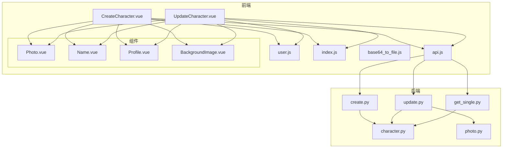
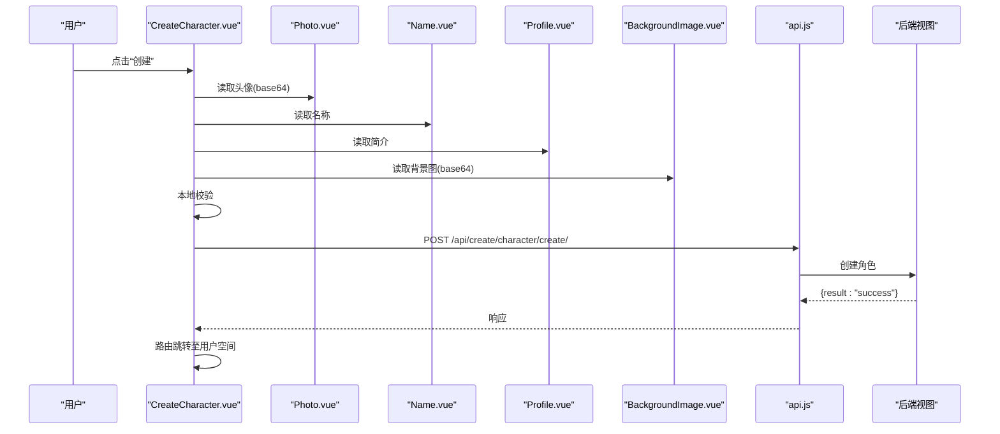
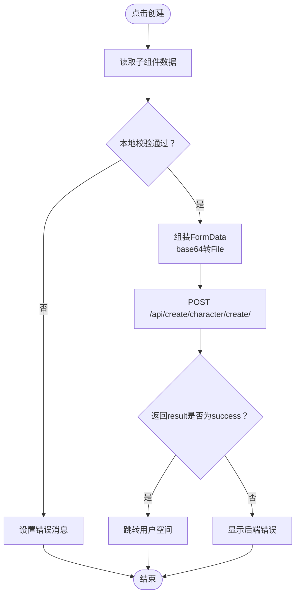
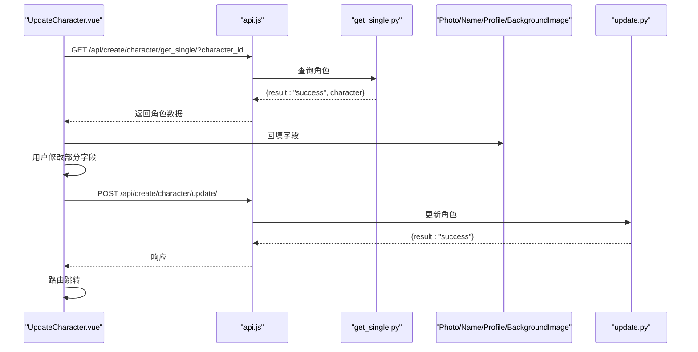
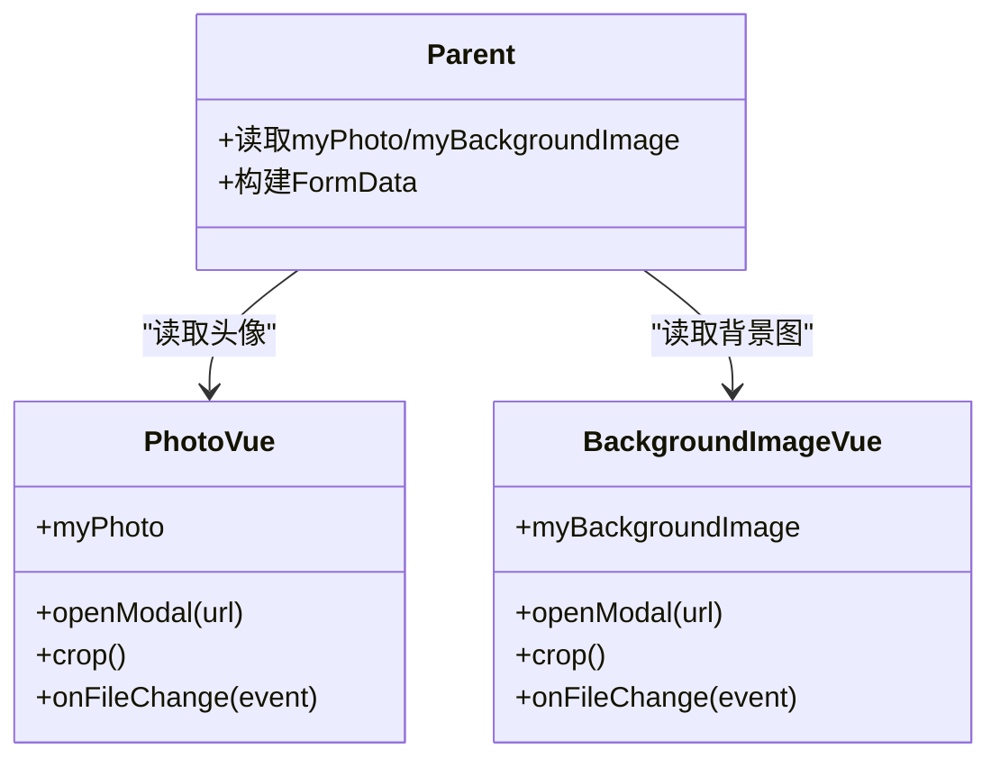
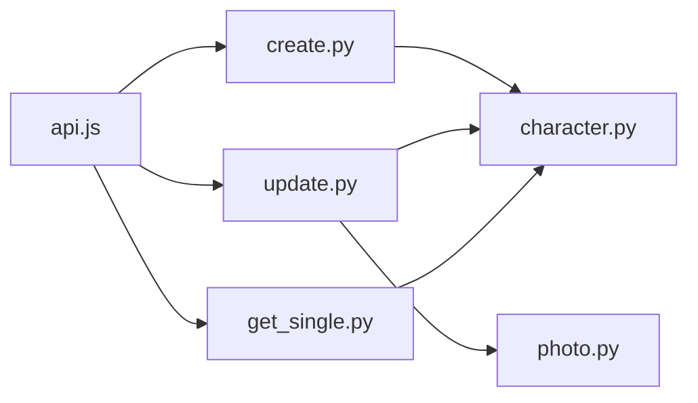

# 角色管理组件

<cite>
**本文引用的文件**
- [CreateCharacter.vue](file://frontend/src/views/create/character/CreateCharacter.vue)
- [UpdateCharacter.vue](file://frontend/src/views/create/character/UpdateCharacter.vue)
- [Photo.vue](file://frontend/src/views/create/character/components/Photo.vue)
- [Name.vue](file://frontend/src/views/create/character/components/Name.vue)
- [Profile.vue](file://frontend/src/views/create/character/components/Profile.vue)
- [BackgroundImage.vue](file://frontend/src/views/create/character/components/BackgroundImage.vue)
- [api.js](file://frontend/src/js/http/api.js)
- [base64_to_file.js](file://frontend/src/js/utils/base64_to_file.js)
- [user.js](file://frontend/src/stores/user.js)
- [index.js](file://frontend/src/router/index.js)
- [character.py](file://backend/web/models/character.py)
- [create.py](file://backend/web/views/create/character/create.py)
- [update.py](file://backend/web/views/create/character/update.py)
- [get_single.py](file://backend/web/views/create/character/get_single.py)
- [photo.py](file://backend/web/views/utils/photo.py)
</cite>

## 目录
1. [简介](#简介)
2. [项目结构](#项目结构)
3. [核心组件](#核心组件)
4. [架构总览](#架构总览)
5. [详细组件分析](#详细组件分析)
6. [依赖分析](#依赖分析)
7. [性能考虑](#性能考虑)
8. [故障排查指南](#故障排查指南)
9. [结论](#结论)
10. [附录](#附录)

## 简介
本技术文档围绕 LLM_AIfriends 的“角色管理”前端组件与后端接口进行系统化梳理，重点覆盖以下方面：
- 角色创建与更新页面的设计与实现
- CreateCharacter.vue 的创建流程、表单校验与提交处理
- UpdateCharacter.vue 的编辑模式、数据回填与变更追踪机制
- Profile.vue 的角色信息展示、状态管理与交互逻辑
- 角色数据的完整生命周期管理、API 调用策略与错误恢复机制
- 权限控制、数据一致性保证与用户体验优化策略

## 项目结构
前端采用 Vue 3 + Vite 架构，路由基于 vue-router；后端采用 Django + Django REST Framework。角色管理涉及的前端视图与组件位于 frontend/src/views/create/character 及其子目录，后端模型与视图位于 backend/web/models 和 backend/web/views。

图表来源
- [CreateCharacter.vue:1-84](file://frontend/src/views/create/character/CreateCharacter.vue#L1-L84)
- [UpdateCharacter.vue:1-109](file://frontend/src/views/create/character/UpdateCharacter.vue#L1-L109)
- [Photo.vue:1-99](file://frontend/src/views/create/character/components/Photo.vue#L1-L99)
- [Name.vue:1-25](file://frontend/src/views/create/character/components/Name.vue#L1-L25)
- [Profile.vue:1-25](file://frontend/src/views/create/character/components/Profile.vue#L1-L25)
- [BackgroundImage.vue:1-99](file://frontend/src/views/create/character/components/BackgroundImage.vue#L1-L99)
- [api.js:1-93](file://frontend/src/js/http/api.js#L1-L93)
- [user.js:1-53](file://frontend/src/stores/user.js#L1-L53)
- [index.js:1-110](file://frontend/src/router/index.js#L1-L110)
- [character.py:1-32](file://backend/web/models/character.py#L1-L32)
- [create.py:1-51](file://backend/web/views/create/character/create.py#L1-L51)
- [update.py:1-46](file://backend/web/views/create/character/update.py#L1-L46)
- [get_single.py:1-28](file://backend/web/views/create/character/get_single.py#L1-L28)
- [photo.py:1-11](file://backend/web/views/utils/photo.py#L1-L11)

章节来源
- [CreateCharacter.vue:1-84](file://frontend/src/views/create/character/CreateCharacter.vue#L1-L84)
- [UpdateCharacter.vue:1-109](file://frontend/src/views/create/character/UpdateCharacter.vue#L1-L109)
- [Photo.vue:1-99](file://frontend/src/views/create/character/components/Photo.vue#L1-L99)
- [Name.vue:1-25](file://frontend/src/views/create/character/components/Name.vue#L1-L25)
- [Profile.vue:1-25](file://frontend/src/views/create/character/components/Profile.vue#L1-L25)
- [BackgroundImage.vue:1-99](file://frontend/src/views/create/character/components/BackgroundImage.vue#L1-L99)
- [api.js:1-93](file://frontend/src/js/http/api.js#L1-L93)
- [user.js:1-53](file://frontend/src/stores/user.js#L1-L53)
- [index.js:1-110](file://frontend/src/router/index.js#L1-L110)
- [character.py:1-32](file://backend/web/models/character.py#L1-L32)
- [create.py:1-51](file://backend/web/views/create/character/create.py#L1-L51)
- [update.py:1-46](file://backend/web/views/create/character/update.py#L1-L46)
- [get_single.py:1-28](file://backend/web/views/create/character/get_single.py#L1-L28)
- [photo.py:1-11](file://backend/web/views/utils/photo.py#L1-L11)

## 核心组件
- CreateCharacter.vue：负责角色创建流程，聚合 Photo、Name、Profile、BackgroundImage 子组件，执行本地校验与远程提交，并在成功后跳转至用户空间。
- UpdateCharacter.vue：负责角色编辑流程，通过路由参数加载目标角色，回填各子组件，仅对变更字段上传文件，避免不必要的资源替换。
- Photo.vue / BackgroundImage.vue：提供图片裁剪与预览功能，内部维护 base64 数据并通过 expose 暴漏给父组件读取。
- Name.vue / Profile.vue：分别维护名称与简介的双向绑定，支持父组件传入初始值。
- api.js：封装 axios 实例，统一注入 Authorization 头，处理 401 自动刷新令牌与重试。
- user.js：Pinia 用户状态存储，保存登录态与用户信息。
- index.js：路由配置，定义角色更新页路由与登录守卫。

章节来源
- [CreateCharacter.vue:1-84](file://frontend/src/views/create/character/CreateCharacter.vue#L1-L84)
- [UpdateCharacter.vue:1-109](file://frontend/src/views/create/character/UpdateCharacter.vue#L1-L109)
- [Photo.vue:1-99](file://frontend/src/views/create/character/components/Photo.vue#L1-L99)
- [BackgroundImage.vue:1-99](file://frontend/src/views/create/character/components/BackgroundImage.vue#L1-L99)
- [Name.vue:1-25](file://frontend/src/views/create/character/components/Name.vue#L1-L25)
- [Profile.vue:1-25](file://frontend/src/views/create/character/components/Profile.vue#L1-L25)
- [api.js:1-93](file://frontend/src/js/http/api.js#L1-L93)
- [user.js:1-53](file://frontend/src/stores/user.js#L1-L53)
- [index.js:1-110](file://frontend/src/router/index.js#L1-L110)

## 架构总览
从前端到后端的数据流如下：
- 前端组件收集用户输入，经 base64ToFile 转换为二进制文件，组装 FormData 提交。
- 后端视图接收表单数据，进行权限校验与业务校验，持久化到数据库。
- 成功响应后，前端根据路由规则跳转至用户空间或保持当前页面并提示错误。

图表来源
- [CreateCharacter.vue:21-59](file://frontend/src/views/create/character/CreateCharacter.vue#L21-L59)
- [Photo.vue:63-65](file://frontend/src/views/create/character/components/Photo.vue#L63-L65)
- [Name.vue:11-13](file://frontend/src/views/create/character/components/Name.vue#L11-L13)
- [Profile.vue:11-13](file://frontend/src/views/create/character/components/Profile.vue#L11-L13)
- [BackgroundImage.vue:62-64](file://frontend/src/views/create/character/components/BackgroundImage.vue#L62-L64)
- [api.js:16-27](file://frontend/src/js/http/api.js#L16-L27)
- [create.py:9-50](file://backend/web/views/create/character/create.py#L9-L50)

## 详细组件分析

### CreateCharacter.vue：创建流程、表单验证与提交处理
- 组件职责
  - 聚合四个子组件，读取其暴露的响应式数据。
  - 执行本地必填项校验（头像、名称、简介、背景图）。
  - 将 base64 图片转换为 File 对象，组装 FormData 并提交。
  - 根据后端返回结果进行路由跳转或错误提示。
- 关键点
  - 使用 useTemplateRef 获取子组件实例，通过 defineExpose 暴露的属性读取数据。
  - 本地校验失败时设置错误消息；成功后通过 api.post 发送请求。
  - 成功后跳转至用户空间，携带当前用户 ID 参数。
- 错误恢复
  - 后端返回非成功状态码时，前端显示返回的错误信息。
  - 未捕获异常时，当前实现不会显式提示，建议补充错误分支以提升可观察性。

图表来源
- [CreateCharacter.vue:21-59](file://frontend/src/views/create/character/CreateCharacter.vue#L21-L59)
- [base64_to_file.js:1-9](file://frontend/src/js/utils/base64_to_file.js#L1-L9)

章节来源
- [CreateCharacter.vue:1-84](file://frontend/src/views/create/character/CreateCharacter.vue#L1-L84)
- [base64_to_file.js:1-9](file://frontend/src/js/utils/base64_to_file.js#L1-L9)

### UpdateCharacter.vue：编辑模式、数据回填与变更追踪
- 组件职责
  - 在挂载时通过路由参数 character_id 调用 get_single 接口拉取角色详情。
  - 将返回的字段回填至 Photo、Name、Profile、BackgroundImage 子组件。
  - 在提交时仅对发生变化的字段上传新文件，避免重复写入。
- 关键点
  - 本地校验与创建类似，但提交前会比较当前值与原始值，仅在变更时附加文件字段。
  - 成功后同样跳转至用户空间。
- 数据一致性
  - 后端在更新接口中对 author.user 进行过滤，确保只有角色作者可修改。
  - 更新时若提供新文件，会先删除旧文件，再写入新文件，避免磁盘冗余。

图表来源
- [UpdateCharacter.vue:18-31](file://frontend/src/views/create/character/UpdateCharacter.vue#L18-L31)
- [get_single.py:8-27](file://backend/web/views/create/character/get_single.py#L8-L27)
- [update.py:10-45](file://backend/web/views/create/character/update.py#L10-L45)

章节来源
- [UpdateCharacter.vue:1-109](file://frontend/src/views/create/character/UpdateCharacter.vue#L1-L109)
- [get_single.py:1-28](file://backend/web/views/create/character/get_single.py#L1-L28)
- [update.py:1-46](file://backend/web/views/create/character/update.py#L1-L46)

### Photo.vue 与 BackgroundImage.vue：图片裁剪与回填
- 组件职责
  - 提供文件选择与 Croppie 裁剪弹窗，支持方形裁剪（头像）与宽高比裁剪（背景图）。
  - 通过 FileReader 读取本地图片，绑定 Croppie 并生成 base64。
  - 通过 defineExpose 暴露 myPhoto/myBackgroundImage，供父组件读取。
- 交互逻辑
  - 未传入初始值时显示占位样式；传入后渲染实际图片。
  - 销毁时释放 Croppie 实例，避免内存泄漏。
- 与后端协作
  - 父组件将 base64 通过 base64ToFile 转为 File，随 FormData 上传。

图表来源
- [Photo.vue:1-99](file://frontend/src/views/create/character/components/Photo.vue#L1-L99)
- [BackgroundImage.vue:1-99](file://frontend/src/views/create/character/components/BackgroundImage.vue#L1-L99)

章节来源
- [Photo.vue:1-99](file://frontend/src/views/create/character/components/Photo.vue#L1-L99)
- [BackgroundImage.vue:1-99](file://frontend/src/views/create/character/components/BackgroundImage.vue#L1-L99)

### Name.vue 与 Profile.vue：状态管理与双向绑定
- 组件职责
  - 维护本地响应式变量 myName/myProfile，并在 props 变更时同步。
  - 通过 defineExpose 将内部状态暴露给父组件，便于统一读取。
- 交互逻辑
  - 输入框双向绑定，父组件可直接读取最新值。
  - 支持空格清理与长度截断（在后端接口层限制最大长度）。

章节来源
- [Name.vue:1-25](file://frontend/src/views/create/character/components/Name.vue#L1-L25)
- [Profile.vue:1-25](file://frontend/src/views/create/character/components/Profile.vue#L1-L25)

### Profile.vue：角色信息展示与交互
- 组件职责
  - 作为角色简介展示组件，支持从父组件接收 profile 字段并进行双向绑定。
  - 适合在只读场景下展示角色描述，或在编辑场景下作为输入域使用。
- 适用场景
  - 在用户空间或角色详情页中展示角色简介。
  - 与 Name.vue、Photo.vue、BackgroundImage.vue 组合形成完整的角色资料卡片。

章节来源
- [Profile.vue:1-25](file://frontend/src/views/create/character/components/Profile.vue#L1-L25)

## 依赖分析
- 前端依赖
  - api.js：集中处理鉴权与令牌刷新，统一拦截器增强请求可靠性。
  - user.js：保存访问令牌与用户信息，驱动路由守卫与页面渲染。
  - base64_to_file.js：将 base64 转换为 File，满足后端文件上传要求。
  - vue-router：路由守卫保障需要登录的页面访问安全。
- 后端依赖
  - character.py：定义角色模型，含作者外键、名称、简介、图片与时间戳。
  - create.py / update.py / get_single.py：分别处理创建、更新与查询单个角色。
  - photo.py：提供删除旧文件的工具方法，配合更新流程清理冗余资源。

图表来源
- [api.js:1-93](file://frontend/src/js/http/api.js#L1-L93)
- [create.py:1-51](file://backend/web/views/create/character/create.py#L1-L51)
- [update.py:1-46](file://backend/web/views/create/character/update.py#L1-L46)
- [get_single.py:1-28](file://backend/web/views/create/character/get_single.py#L1-L28)
- [character.py:1-32](file://backend/web/models/character.py#L1-L32)
- [photo.py:1-11](file://backend/web/views/utils/photo.py#L1-L11)

章节来源
- [api.js:1-93](file://frontend/src/js/http/api.js#L1-L93)
- [create.py:1-51](file://backend/web/views/create/character/create.py#L1-L51)
- [update.py:1-46](file://backend/web/views/create/character/update.py#L1-L46)
- [get_single.py:1-28](file://backend/web/views/create/character/get_single.py#L1-L28)
- [character.py:1-32](file://backend/web/models/character.py#L1-L32)
- [photo.py:1-11](file://backend/web/views/utils/photo.py#L1-L11)

## 性能考虑
- 文件上传优化
  - 仅在字段发生变更时上传新文件，减少 IO 与网络开销。
  - 建议在前端对文件大小与类型进行预校验，降低无效请求比例。
- 请求与缓存
  - api.js 已内置 401 自动刷新与重试，建议在高频操作中增加防抖与节流。
- 渲染与内存
  - Croppie 实例在组件销毁时释放，避免内存泄漏。
  - 大量图片预览时建议延迟加载与懒渲染。

## 故障排查指南
- 常见问题与定位
  - 401 未授权：检查用户登录状态与访问令牌是否有效；确认 api.js 的拦截器是否正确注入 Authorization。
  - 无法上传文件：确认父组件已将 base64 转换为 File；检查后端接口是否接收 FILES。
  - 更新失败：确认 character_id 是否正确传递；检查后端 author.user 过滤条件是否匹配当前用户。
- 错误恢复建议
  - 在前端 handleCreate/handleUpdate 中补充 try/catch 的错误分支，统一提示用户。
  - 对网络异常与服务端异常分别处理，避免静默失败。
  - 在路由守卫中对未登录用户进行友好引导。

章节来源
- [api.js:46-89](file://frontend/src/js/http/api.js#L46-L89)
- [index.js:99-107](file://frontend/src/router/index.js#L99-L107)
- [update.py:14-15](file://backend/web/views/create/character/update.py#L14-L15)

## 结论
该角色管理组件通过清晰的分层设计与前后端协同，实现了从创建到更新的完整生命周期管理。前端组件职责明确、交互直观，后端接口具备严格的权限控制与数据一致性保障。建议在现有基础上进一步完善错误处理与用户体验细节，以提升系统的健壮性与可用性。

## 附录

### 数据模型映射
- 角色模型（后端）
  - 字段：作者、名称、头像、简介、聊天背景、创建时间、更新时间
  - 上传路径：头像与背景图分别按作者与 UUID 生成唯一路径
- 前端表单字段
  - 名称、简介、头像(base64)、聊天背景(base64)

章节来源
- [character.py:21-31](file://backend/web/models/character.py#L21-L31)
- [Photo.vue:63-65](file://frontend/src/views/create/character/components/Photo.vue#L63-L65)
- [BackgroundImage.vue:62-64](file://frontend/src/views/create/character/components/BackgroundImage.vue#L62-L64)
- [Name.vue:11-13](file://frontend/src/views/create/character/components/Name.vue#L11-L13)
- [Profile.vue:11-13](file://frontend/src/views/create/character/components/Profile.vue#L11-L13)

### API 定义概览
- 创建角色
  - 方法：POST
  - 路径：/api/create/character/create/
  - 认证：需要登录
  - 表单字段：name、profile、photo、background_image
- 更新角色
  - 方法：POST
  - 路径：/api/create/character/update/
  - 认证：需要登录
  - 表单字段：character_id、name、profile、photo(可选)、background_image(可选)
- 获取单个角色
  - 方法：GET
  - 路径：/api/create/character/get_single/
  - 认证：需要登录
  - 查询参数：character_id

章节来源
- [create.py:9-50](file://backend/web/views/create/character/create.py#L9-L50)
- [update.py:10-45](file://backend/web/views/create/character/update.py#L10-L45)
- [get_single.py:8-27](file://backend/web/views/create/character/get_single.py#L8-L27)