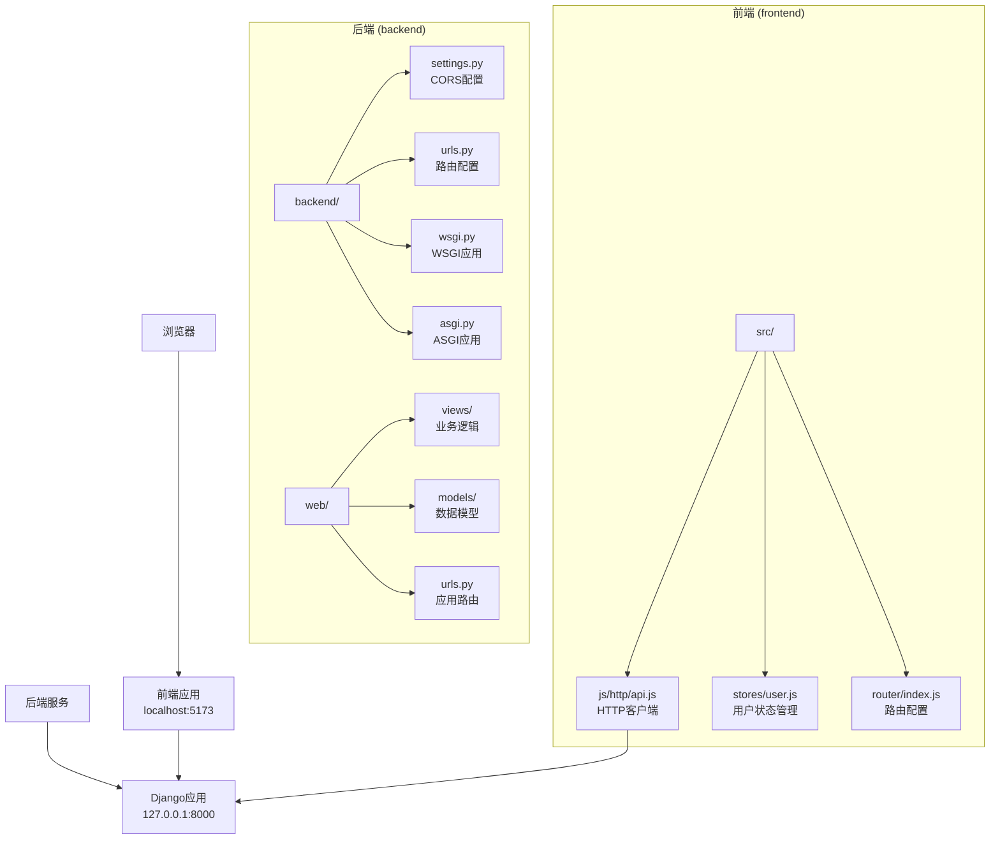
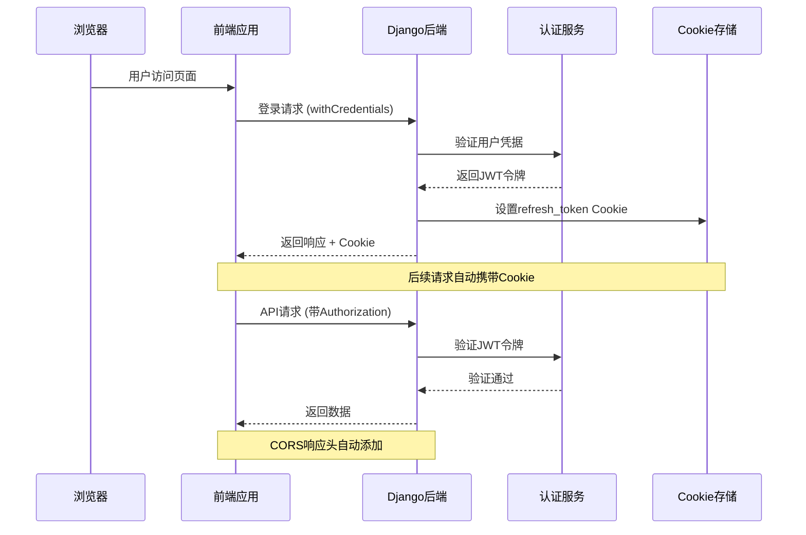
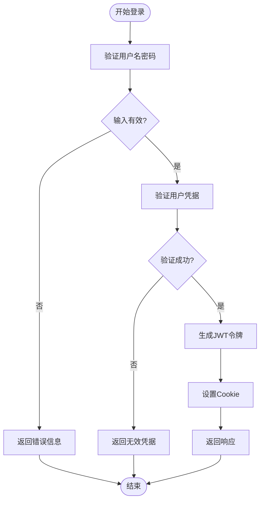
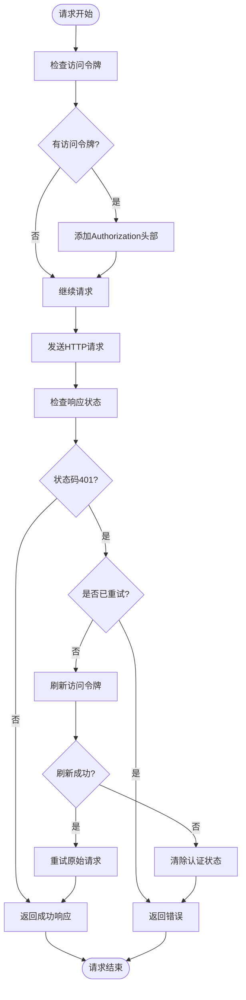

# CORS跨域配置

<cite>
**本文档引用的文件**
- [settings.py](file://backend/backend/settings.py)
- [api.js](file://frontend/src/js/http/api.js)
- [login.py](file://backend/web/views/user/account/login.py)
- [register.py](file://backend/web/views/user/account/register.py)
- [refresh_token.py](file://backend/web/views/user/account/refresh_token.py)
- [logout.py](file://backend/web/views/user/account/logout.py)
- [urls.py](file://backend/web/urls.py)
- [manage.py](file://backend/manage.py)
- [wsgi.py](file://backend/backend/wsgi.py)
- [asgi.py](file://backend/backend/asgi.py)
</cite>

## 目录
1. [简介](#简介)
2. [项目结构概览](#项目结构概览)
3. [核心组件分析](#核心组件分析)
4. [架构概览](#架构概览)
5. [详细组件分析](#详细组件分析)
6. [CORS配置详解](#cors配置详解)
7. [预检请求处理](#预检请求处理)
8. [Cookie跨域传递机制](#cookie跨域传递机制)
9. [最佳实践指南](#最佳实践指南)
10. [常见问题排查](#常见问题排查)
11. [生产环境部署](#生产环境部署)
12. [结论](#结论)

## 简介

本技术文档深入解析LLM_AIfriends项目中的CORS（跨域资源共享）跨域配置，重点说明django-cors-headers中间件的工作原理、配置选项以及在前后端分离架构下的应用。该文档涵盖了CORS_ALLOWED_ORIGINS的设置规则、CORS_ALLOW_CREDENTIALS的作用与安全考虑、预检请求处理机制、Cookie跨域传递方案，以及不同环境下的配置示例和调试方法。

## 项目结构概览

LLM_AIfriends采用典型的前后端分离架构，后端使用Django框架，前端使用Vue.js配合Vite构建工具。项目的核心目录结构如下：



**图表来源**
- [settings.py:153-158](file://backend/backend/settings.py#L153-L158)
- [urls.py:17-33](file://backend/web/urls.py#L17-L33)
- [api.js:14-19](file://frontend/src/js/http/api.js#L14-L19)

## 核心组件分析

### CORS中间件配置

项目在Django设置中启用了django-cors-headers中间件，并将其置于中间件列表的首位，这是确保CORS响应能够正确处理的关键配置。

**章节来源**
- [settings.py:45-54](file://backend/backend/settings.py#L45-L54)
- [settings.py:153-158](file://backend/backend/settings.py#L153-L158)

### 前后端通信架构

前端通过Axios客户端向后端发起HTTP请求，关键特性包括：
- 使用withCredentials: true启用Cookie跨域传递
- 自动添加Authorization头部
- 实现JWT令牌刷新机制

**章节来源**
- [api.js:16-19](file://frontend/src/js/http/api.js#L16-L19)
- [api.js:21-27](file://frontend/src/js/http/api.js#L21-L27)

## 架构概览



**图表来源**
- [login.py:30-37](file://backend/web/views/user/account/login.py#L30-L37)
- [api.js:18](file://frontend/src/js/http/api.js#L18)
- [api.js:23-25](file://frontend/src/js/http/api.js#L23-L25)

## 详细组件分析

### JWT认证流程

项目采用JWT（JSON Web Token）进行用户认证，结合Cookie存储refresh_token实现持久化登录。



**图表来源**
- [login.py:10-45](file://backend/web/views/user/account/login.py#L10-L45)
- [register.py:9-41](file://backend/web/views/user/account/register.py#L9-L41)

**章节来源**
- [login.py:10-45](file://backend/web/views/user/account/login.py#L10-L45)
- [register.py:9-41](file://backend/web/views/user/account/register.py#L9-L41)
- [refresh_token.py:7-38](file://backend/web/views/user/account/refresh_token.py#L7-L38)

### 请求拦截器机制

前端实现了智能的请求拦截器，用于处理JWT令牌的自动添加和刷新机制。



**图表来源**
- [api.js:46-90](file://frontend/src/js/http/api.js#L46-L90)

**章节来源**
- [api.js:46-90](file://frontend/src/js/http/api.js#L46-L90)

## CORS配置详解

### CORS中间件工作原理

django-cors-headers中间件在Django请求处理管道中扮演关键角色，它负责：

1. **拦截请求**：在中间件链中尽早执行
2. **检查来源**：验证请求的Origin是否在允许列表中
3. **设置响应头**：动态添加CORS相关响应头
4. **处理预检请求**：自动响应OPTIONS预检请求

**章节来源**
- [settings.py:45-54](file://backend/backend/settings.py#L45-L54)

### CORS_ALLOWED_ORIGINS配置规则

在当前项目中，CORS_ALLOWED_ORIGINS配置为：
```python
CORS_ALLOWED_ORIGINS = [
    "http://localhost:5173",
]
```

这个配置遵循以下规则：
- **协议匹配**：必须完全匹配请求的协议（http/https）
- **域名精确匹配**：不允许通配符，必须是精确的域名
- **端口匹配**：端口号必须完全一致
- **顺序重要性**：列表中的顺序不影响匹配，但建议按优先级排列

**章节来源**
- [settings.py:156-158](file://backend/backend/settings.py#L156-L158)

### CORS_ALLOW_CREDENTIALS作用与安全考虑

项目启用了CORS_ALLOW_CREDENTIALS = True，这具有重要意义：

**功能作用**：
- 允许跨域请求携带Cookie
- 支持基于Cookie的认证机制
- 实现持久化登录状态

**安全考虑**：
- **仅对特定来源开放**：避免对所有来源开放
- **HTTPS要求**：生产环境中必须使用HTTPS
- **Cookie安全属性**：正确设置secure、httponly、sameSite等属性
- **最小权限原则**：只允许必要的来源

**章节来源**
- [settings.py:154](file://backend/backend/settings.py#L154)
- [login.py:30-37](file://backend/web/views/user/account/login.py#L30-L37)

## 预检请求处理

### 预检请求机制

当满足以下条件时，浏览器会发送预检请求（OPTIONS）：

1. **复杂请求**：使用自定义头部
2. **非简单方法**：PUT、DELETE、PATCH等
3. **非简单内容类型**：application/json以外
4. **携带Cookie**：当withCredentials为true时

**章节来源**
- [api.js:18](file://frontend/src/js/http/api.js#L18)

### Django-Cors-Headers自动处理

django-cors-headers中间件会自动处理预检请求：
- 检测OPTIONS方法
- 验证预检请求的有效性
- 返回适当的CORS响应头
- 跳过后续处理逻辑

## Cookie跨域传递机制

### Cookie设置策略

后端在用户登录时设置refresh_token Cookie，关键参数包括：

```python
response.set_cookie(
    key='refresh_token',
    value=str(refresh),
    httponly=True,      # 防止XSS攻击
    samesite='Lax',     # CSRF保护
    secure=True,        # HTTPS传输
    max_age=86400 * 7,  # 7天有效期
)
```

**章节来源**
- [login.py:30-37](file://backend/web/views/user/account/login.py#L30-L37)
- [register.py:33-40](file://backend/web/views/user/account/register.py#L33-L40)

### 前端Cookie处理

前端通过withCredentials: true配置实现Cookie跨域传递：

**章节来源**
- [api.js:18](file://frontend/src/js/http/api.js#L18)

## 最佳实践指南

### 开发环境配置

```python
# settings.py - 开发环境
DEBUG = True
ALLOWED_HOSTS = ['localhost', '127.0.0.1']

CORS_ALLOWED_ORIGINS = [
    "http://localhost:5173",  # Vite开发服务器
    "http://localhost:3000",  # 其他前端端口
]

CORS_ALLOW_CREDENTIALS = True
```

### 生产环境配置

```python
# settings.py - 生产环境
DEBUG = False
ALLOWED_HOSTS = ['yourdomain.com', 'www.yourdomain.com']

CORS_ALLOWED_ORIGINS = [
    "https://yourdomain.com",
    "https://www.yourdomain.com",
]

CORS_ALLOW_CREDENTIALS = True

# 安全增强
CORS_ALLOWED_HEADERS = [
    'accept',
    'authorization',
    'content-type',
    'user-agent',
    'cache-control',
    'x-requested-with',
]
```

### 安全配置要点

1. **最小化允许来源**：只允许必要的域名
2. **HTTPS强制**：生产环境必须使用HTTPS
3. **Cookie安全**：正确设置安全属性
4. **CORS头限制**：避免过度宽松的配置

## 常见问题排查

### 问题1：CORS错误 "Access to fetch at '...' from origin '...' has been blocked by CORS policy"

**可能原因**：
- CORS_ALLOWED_ORIGINS未包含前端地址
- 协议不匹配（http vs https）
- 端口不匹配

**解决方法**：
```python
# 确保包含正确的前端地址
CORS_ALLOWED_ORIGINS = [
    "http://localhost:5173",  # Vite默认端口
    "http://127.0.0.1:5173",  # IP地址形式
    "https://yourdomain.com",  # 生产域名
]
```

**章节来源**
- [settings.py:156-158](file://backend/backend/settings.py#L156-L158)

### 问题2：Cookie未随请求发送

**可能原因**：
- 前端未设置withCredentials: true
- 后端未启用CORS_ALLOW_CREDENTIALS
- Cookie安全属性不匹配

**解决方法**：
```javascript
// 前端axios配置
const api = axios.create({
    baseURL: 'http://127.0.0.1:8000',
    withCredentials: true,  // 关键配置
})

// 后端设置
CORS_ALLOW_CREDENTIALS = True
```

**章节来源**
- [api.js:18](file://frontend/src/js/http/api.js#L18)
- [settings.py:154](file://backend/backend/settings.py#L154)

### 问题3：预检请求失败

**可能原因**：
- 复杂请求未正确处理
- CORS头配置不完整

**解决方法**：
```python
# 确保CORS头配置完整
CORS_ALLOWED_HEADERS = [
    'accept',
    'authorization',
    'content-type',
    'user-agent',
    'cache-control',
    'x-requested-with',
]

CORS_ALLOWED_METHODS = [
    'DELETE',
    'GET',
    'OPTIONS',
    'PATCH',
    'POST',
    'PUT',
]
```

## 生产环境部署

### Nginx反向代理配置

```nginx
server {
    listen 80;
    server_name yourdomain.com www.yourdomain.com;
    return 301 https://$server_name$request_uri;
}

server {
    listen 443 ssl http2;
    server_name yourdomain.com www.yourdomain.com;

    ssl_certificate /path/to/certificate.crt;
    ssl_certificate_key /path/to/private.key;

    location / {
        proxy_pass http://127.0.0.1:8000;
        proxy_set_header Host $host;
        proxy_set_header X-Real-IP $remote_addr;
        proxy_set_header X-Forwarded-For $proxy_add_x_forwarded_for;
        proxy_set_header X-Forwarded-Proto $scheme;
    }
}
```

### Docker部署配置

```dockerfile
FROM python:3.9-slim

WORKDIR /app
COPY requirements.txt .
RUN pip install -r requirements.txt

COPY . .

EXPOSE 8000

CMD ["gunicorn", "--bind", "0.0.0.0:8000", "backend.wsgi:application"]
```

```yaml
version: '3.8'
services:
  backend:
    build: .
    ports:
      - "8000:8000"
    environment:
      - DEBUG=False
      - ALLOWED_HOSTS=yourdomain.com,www.yourdomain.com
    volumes:
      - ./logs:/app/logs
```

## 结论

LLM_AIfriends项目的CORS配置展现了现代Web应用的最佳实践。通过合理配置django-cors-headers中间件、精心设计的JWT认证体系以及完善的Cookie跨域传递机制，项目实现了安全高效的前后端分离架构。

关键要点总结：
- CORS中间件必须置于中间件列表首位
- 开发环境使用精确的本地地址配置
- 生产环境必须启用HTTPS并限制允许来源
- 正确配置Cookie安全属性确保认证安全
- 实现智能的请求拦截器处理令牌刷新

这些配置为类似项目的CORS跨域问题提供了可靠的参考模板，既保证了功能完整性，又确保了安全性。