# JWT认证机制

<cite>
**本文档引用的文件**
- [settings.py](file://backend/backend/settings.py)
- [urls.py](file://backend/web/urls.py)
- [login.py](file://backend/web/views/user/account/login.py)
- [register.py](file://backend/web/views/user/account/register.py)
- [refresh_token.py](file://backend/web/views/user/account/refresh_token.py)
- [logout.py](file://backend/web/views/user/account/logout.py)
- [get_user_info.py](file://backend/web/views/user/account/get_user_info.py)
- [user.js](file://frontend/src/stores/user.js)
- [api.js](file://frontend/src/js/http/api.js)
- [user.py](file://backend/web/models/user.py)
</cite>

## 目录
1. [简介](#简介)
2. [项目结构](#项目结构)
3. [核心组件](#核心组件)
4. [架构概览](#架构概览)
5. [详细组件分析](#详细组件分析)
6. [依赖关系分析](#依赖关系分析)
7. [性能考虑](#性能考虑)
8. [故障排除指南](#故障排除指南)
9. [结论](#结论)

## 简介

LLM_AIfriends项目采用JWT（JSON Web Token）作为主要的身份认证机制，基于Django REST Framework和Django SimpleJWT库实现。该系统提供了完整的用户认证、授权和令牌管理功能，包括ACCESS_TOKEN和REFRESH_TOKEN的双重认证体系。

JWT认证机制通过以下核心特性确保系统的安全性：
- 双令牌模型：ACCESS_TOKEN用于短期访问，REFRESH_TOKEN用于长期刷新
- 自动轮换：启用令牌轮换和黑名单机制
- 安全存储：REFRESH_TOKEN通过HTTP-only Cookie存储
- 智能刷新：前端自动处理令牌过期和刷新逻辑

## 项目结构

JWT认证相关的代码分布在后端和前端两个部分：

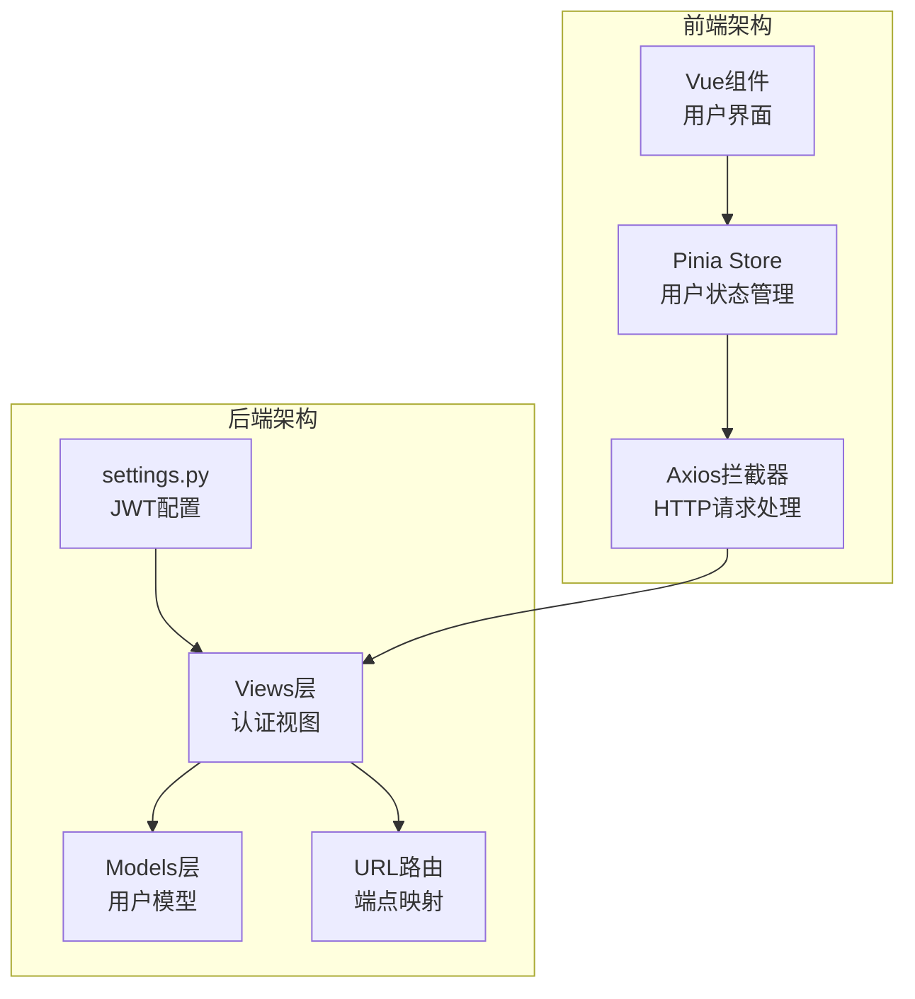

**图表来源**
- [settings.py:133-151](file://backend/backend/settings.py#L133-L151)
- [urls.py:17-33](file://backend/web/urls.py#L17-L33)

**章节来源**
- [settings.py:133-151](file://backend/backend/settings.py#L133-L151)
- [urls.py:17-33](file://backend/web/urls.py#L17-L33)

## 核心组件

### JWT配置参数

系统采用以下JWT配置参数：

| 参数名称 | 值 | 说明 |
|---------|----|------|
| ACCESS_TOKEN_LIFETIME | 2小时 | 访问令牌有效期 |
| REFRESH_TOKEN_LIFETIME | 7天 | 刷新令牌有效期 |
| ROTATE_REFRESH_TOKENS | True | 启用刷新令牌轮换 |
| BLACKLIST_AFTER_ROTATION | True | 轮换后加入黑名单 |
| AUTH_HEADER_TYPES | ('Bearer',) | 授权头类型 |

### 令牌类型定义

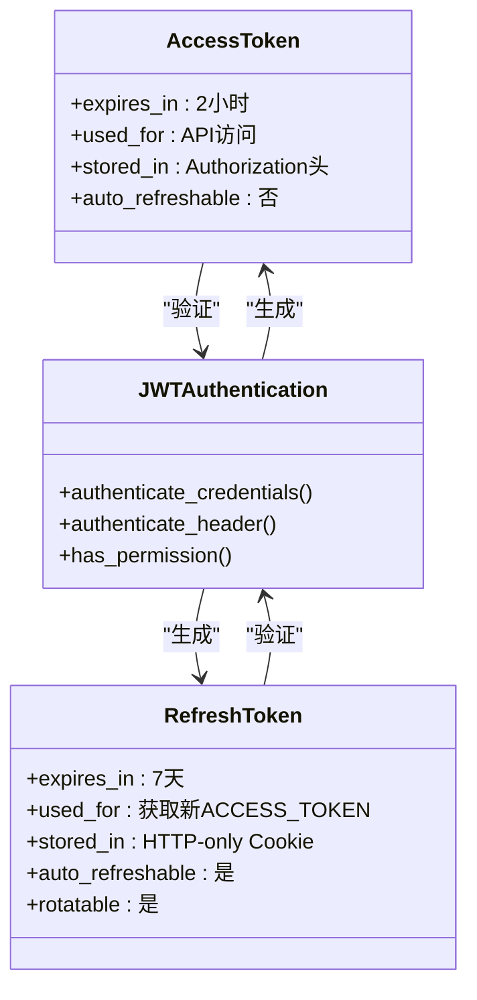

**图表来源**
- [settings.py:143-151](file://backend/backend/settings.py#L143-L151)
- [login.py:21](file://backend/web/views/user/account/login.py#L21)

**章节来源**
- [settings.py:143-151](file://backend/backend/settings.py#L143-L151)
- [login.py:21](file://backend/web/views/user/account/login.py#L21)

## 架构概览

JWT认证系统采用客户端-服务器分离架构，通过HTTP-only Cookie存储REFRESH_TOKEN，通过Authorization头存储ACCESS_TOKEN。

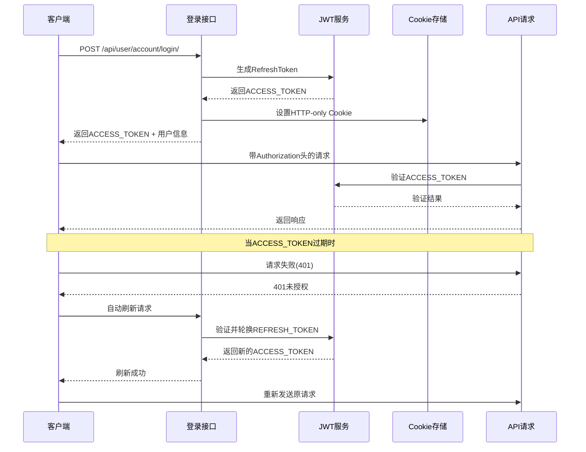

**图表来源**
- [login.py:9-46](file://backend/web/views/user/account/login.py#L9-L46)
- [refresh_token.py:7-39](file://backend/web/views/user/account/refresh_token.py#L7-L39)
- [api.js:46-90](file://frontend/src/js/http/api.js#L46-L90)

## 详细组件分析

### 登录认证流程

登录流程实现了标准的JWT认证模式，包含用户验证、令牌生成和安全存储。

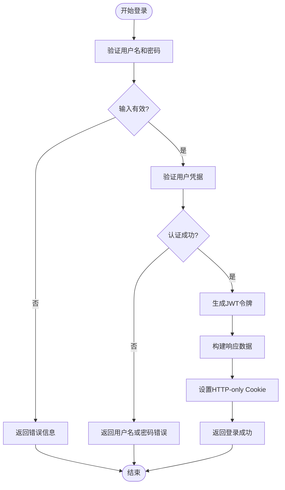

**图表来源**
- [login.py:9-46](file://backend/web/views/user/account/login.py#L9-L46)

#### 登录视图实现要点

登录视图的关键实现包括：
- 用户凭据验证：使用Django内置的authenticate函数
- 令牌生成：通过RefreshToken.for_user()生成完整令牌套件
- 安全存储：ACCESS_TOKEN直接返回，REFRESH_TOKEN通过HTTP-only Cookie存储
- 错误处理：统一的异常捕获和错误响应

**章节来源**
- [login.py:9-46](file://backend/web/views/user/account/login.py#L9-L46)

### 注册认证流程

注册流程与登录类似，但不需要用户验证步骤。

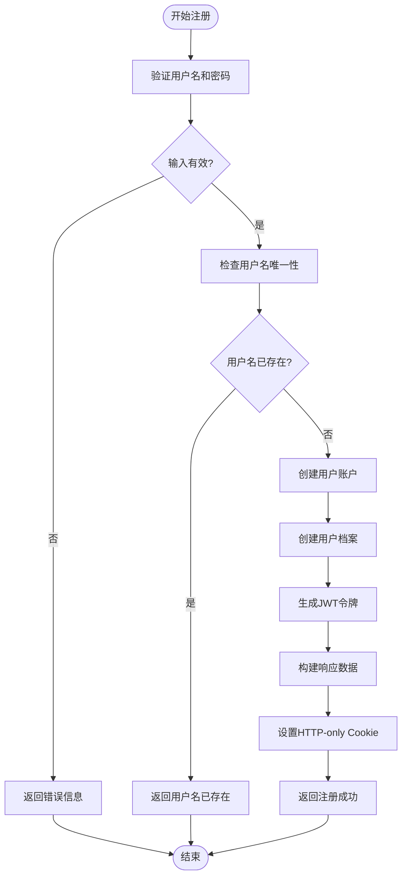

**图表来源**
- [register.py:9-45](file://backend/web/views/user/account/register.py#L9-L45)

**章节来源**
- [register.py:9-45](file://backend/web/views/user/account/register.py#L9-L45)

### 刷新令牌机制

刷新令牌机制实现了智能的令牌轮换和过期处理。

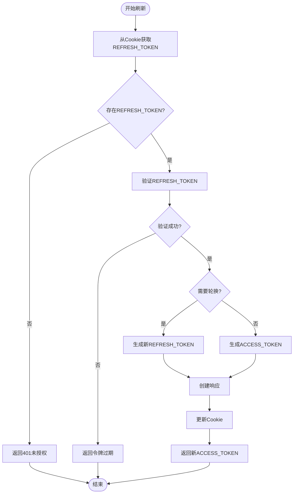

**图表来源**
- [refresh_token.py:7-39](file://backend/web/views/user/account/refresh_token.py#L7-L39)

#### 刷新令牌的安全特性

刷新令牌机制包含以下安全特性：
- 自动轮换：每次刷新都会生成新的REFRESH_TOKEN
- 黑名单机制：轮换后的旧令牌会被加入黑名单
- Cookie安全：REFRESH_TOKEN通过HTTP-only、Secure、SameSite属性保护
- 过期处理：统一的异常处理和状态码返回

**章节来源**
- [refresh_token.py:7-39](file://backend/web/views/user/account/refresh_token.py#L7-L39)

### 前端令牌管理

前端使用Pinia进行状态管理和Axios拦截器实现自动刷新。

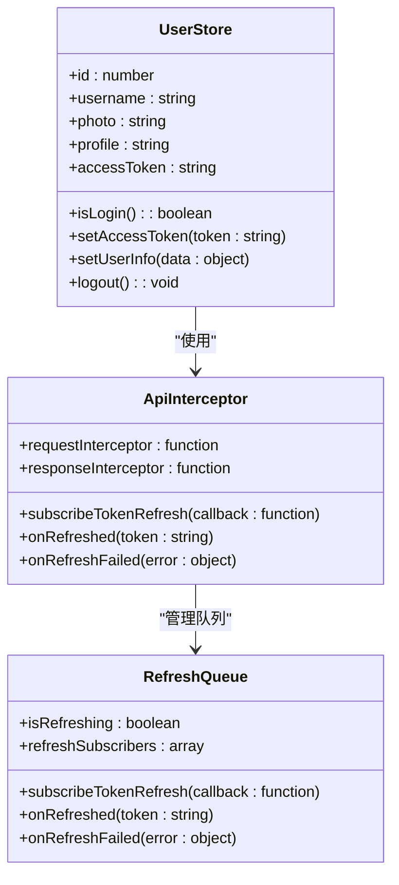

**图表来源**
- [user.js:4-52](file://frontend/src/stores/user.js#L4-L52)
- [api.js:29-44](file://frontend/src/js/http/api.js#L29-L44)

#### 前端认证流程

前端实现了智能的令牌管理策略：

1. **请求拦截**：自动在Authorization头添加ACCESS_TOKEN
2. **响应拦截**：监听401错误并触发自动刷新
3. **刷新队列**：避免重复刷新请求
4. **状态同步**：刷新成功后重新发送原请求

**章节来源**
- [user.js:4-52](file://frontend/src/stores/user.js#L4-L52)
- [api.js:46-90](file://frontend/src/js/http/api.js#L46-L90)

### 用户信息获取

用户信息获取接口展示了JWT认证在实际业务中的应用。

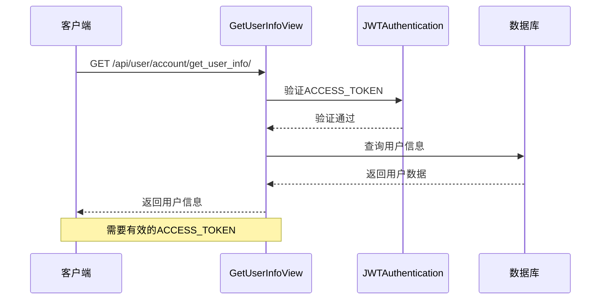

**图表来源**
- [get_user_info.py:8-24](file://backend/web/views/user/account/get_user_info.py#L8-L24)

**章节来源**
- [get_user_info.py:8-24](file://backend/web/views/user/account/get_user_info.py#L8-L24)

## 依赖关系分析

JWT认证系统的依赖关系体现了清晰的分层架构：

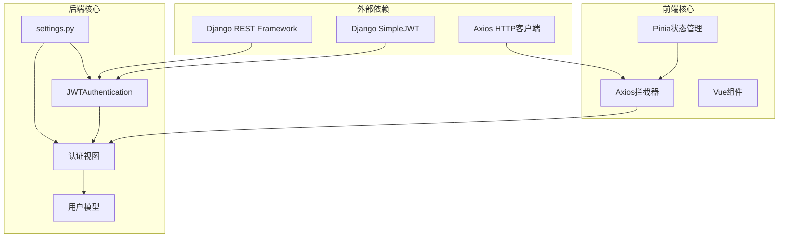

**图表来源**
- [settings.py:136-151](file://backend/backend/settings.py#L136-L151)
- [api.js:11-19](file://frontend/src/js/http/api.js#L11-L19)

### 关键依赖关系

1. **认证依赖**：所有视图都依赖JWTAuthentication进行用户验证
2. **配置依赖**：JWT行为完全由settings.py中的SIMPLE_JWT配置控制
3. **前端依赖**：Axios拦截器依赖Pinia状态管理
4. **模型依赖**：用户信息获取依赖UserProfile模型

**章节来源**
- [settings.py:136-151](file://backend/backend/settings.py#L136-L151)
- [urls.py:17-33](file://backend/web/urls.py#L17-L33)

## 性能考虑

### 令牌生命周期优化

系统采用的令牌生命周期设计平衡了安全性与用户体验：

- **ACCESS_TOKEN (2小时)**：适合短期频繁访问，减少刷新频率
- **REFRESH_TOKEN (7天)**：提供较长的登录保持时间
- **智能刷新**：仅在401错误时触发，避免不必要的网络请求

### 缓存策略

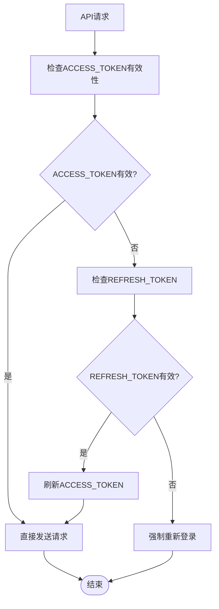

**图表来源**
- [api.js:46-90](file://frontend/src/js/http/api.js#L46-L90)

## 故障排除指南

### 常见错误及解决方案

| 错误类型 | 症状 | 原因 | 解决方案 |
|---------|------|------|----------|
| 401未授权 | API请求失败 | ACCESS_TOKEN过期 | 自动刷新或重新登录 |
| 刷新失败 | 401错误持续出现 | REFRESH_TOKEN过期 | 强制重新登录 |
| Cookie问题 | 登录后无法保持状态 | HTTP-only Cookie限制 | 检查CORS配置 |
| 权限错误 | 无权限访问资源 | 未登录或权限不足 | 检查用户认证状态 |

### 错误处理流程

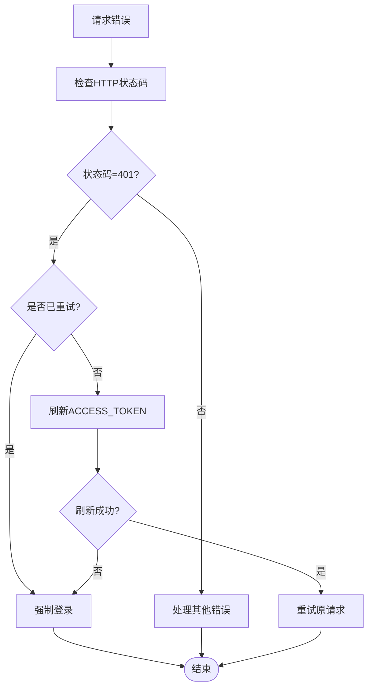

**图表来源**
- [api.js:46-90](file://frontend/src/js/http/api.js#L46-L90)

### 最佳实践建议

1. **安全存储**：始终使用HTTP-only Cookie存储REFRESH_TOKEN
2. **令牌轮换**：启用ROTATE_REFRESH_TOKENS确保安全性
3. **错误处理**：实现统一的错误处理和用户提示
4. **性能优化**：合理设置令牌有效期，避免过度刷新
5. **日志记录**：记录关键认证事件便于审计

**章节来源**
- [refresh_token.py:16-38](file://backend/web/views/user/account/refresh_token.py#L16-L38)
- [api.js:46-90](file://frontend/src/js/http/api.js#L46-L90)

## 结论

LLM_AIfriends项目的JWT认证机制实现了现代Web应用的标准安全实践。通过双令牌模型、智能刷新和完善的错误处理，系统在保证安全性的同时提供了良好的用户体验。

关键优势包括：
- **安全性**：HTTP-only Cookie存储敏感令牌，支持令牌轮换和黑名单
- **可用性**：自动刷新机制减少用户干预，提升用户体验
- **可维护性**：清晰的代码结构和配置分离，便于维护和扩展
- **性能**：合理的令牌生命周期和智能缓存策略

建议在生产环境中进一步完善：
- 使用HTTPS确保传输安全
- 实施更严格的CORS配置
- 添加令牌监控和审计日志
- 考虑多设备登录管理
- 实现令牌撤销机制