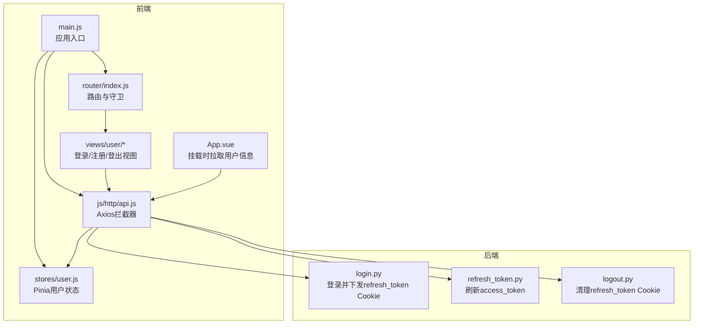
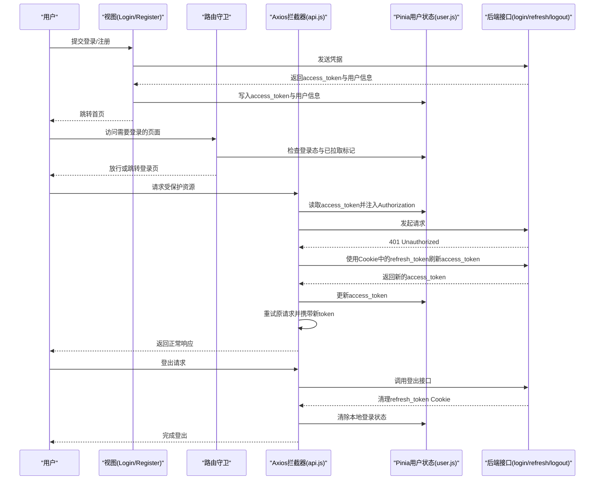
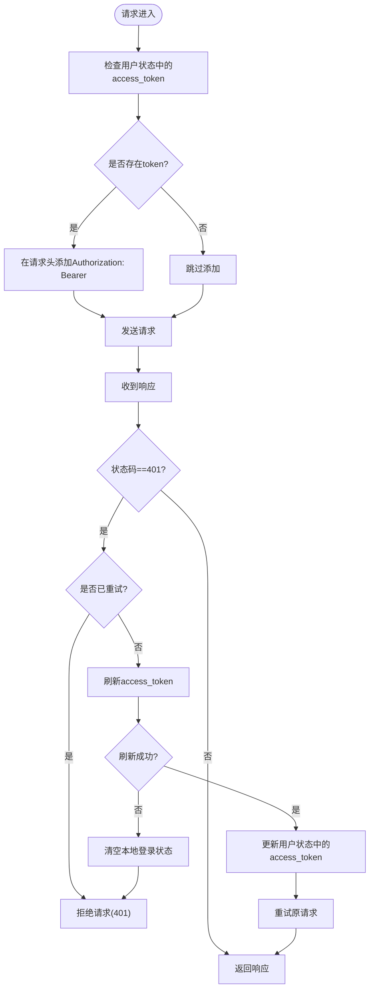
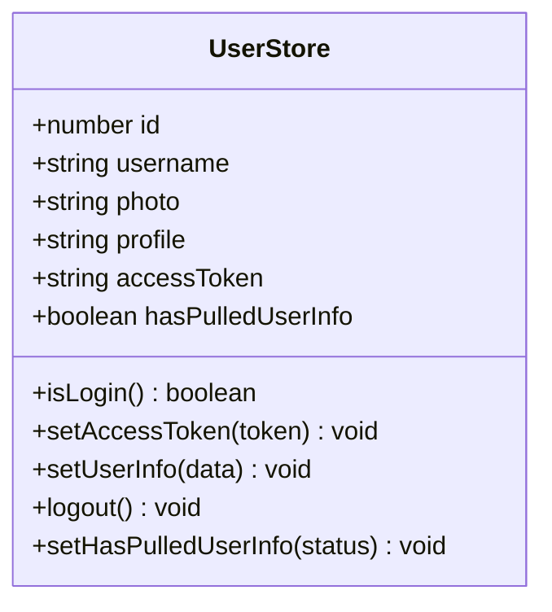
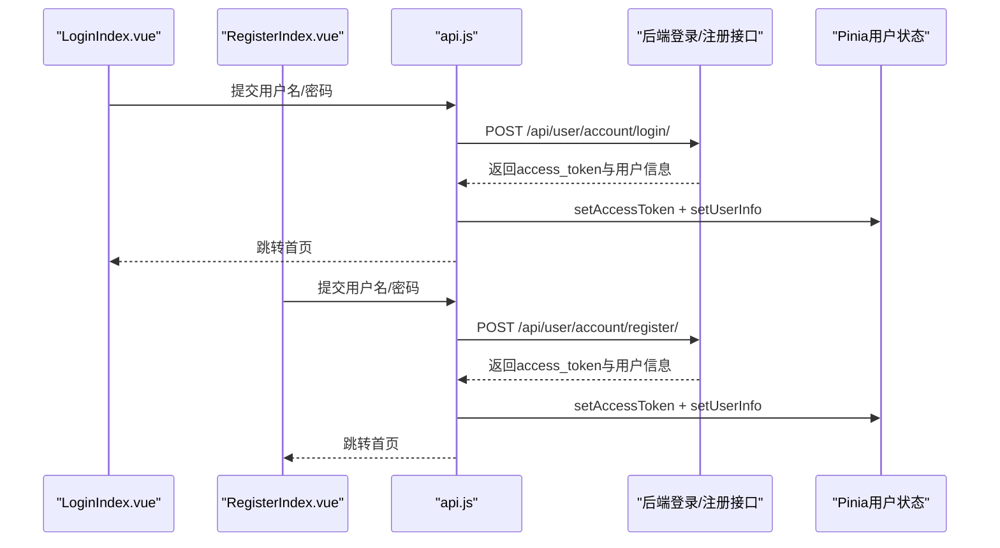
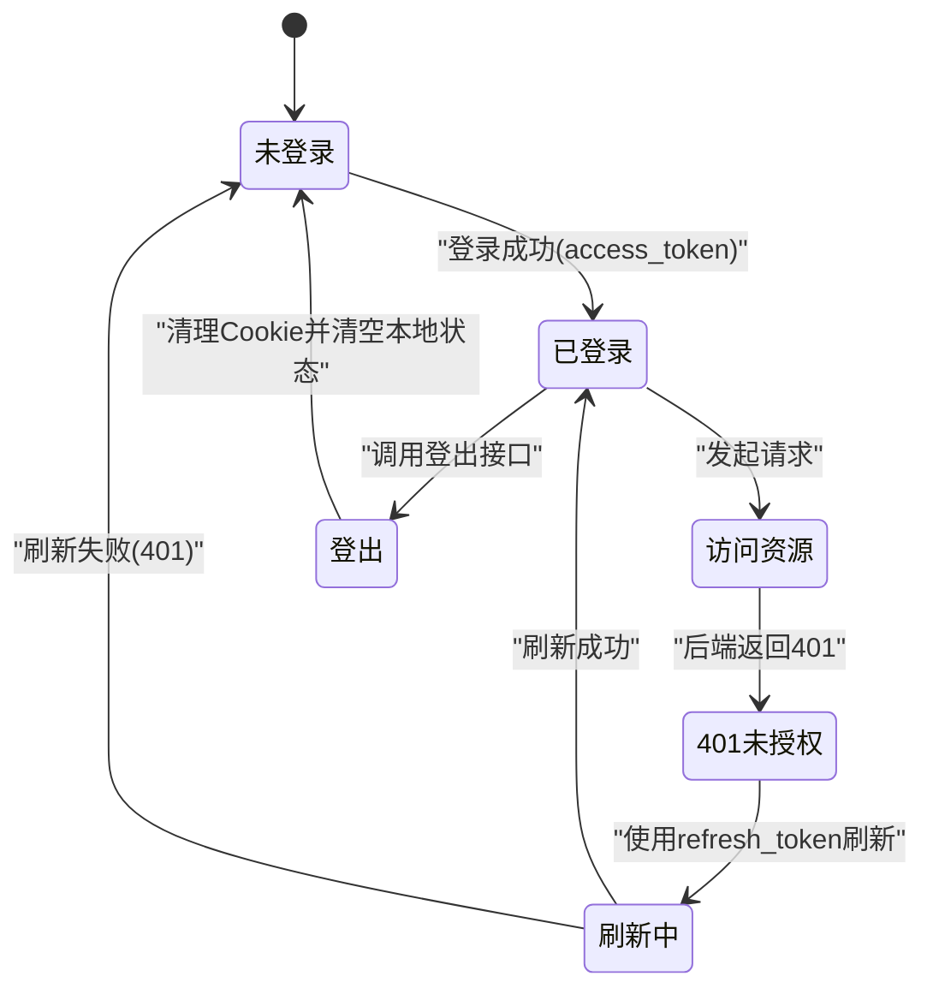
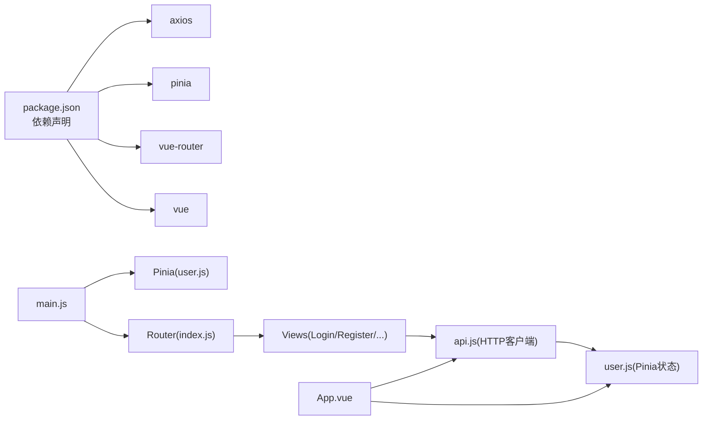

# Token管理

<cite>
**本文引用的文件**
- [frontend/src/stores/user.js](file://frontend/src/stores/user.js)
- [frontend/src/js/http/api.js](file://frontend/src/js/http/api.js)
- [frontend/src/main.js](file://frontend/src/main.js)
- [frontend/package.json](file://frontend/package.json)
- [frontend/src/views/user/account/LoginIndex.vue](file://frontend/src/views/user/account/LoginIndex.vue)
- [frontend/src/router/index.js](file://frontend/src/router/index.js)
- [frontend/src/App.vue](file://frontend/src/App.vue)
- [frontend/src/components/navbar/UserMenu.vue](file://frontend/src/components/navbar/UserMenu.vue)
- [frontend/src/views/user/account/RegisterIndex.vue](file://frontend/src/views/user/account/RegisterIndex.vue)
- [backend/web/views/user/account/login.py](file://backend/web/views/user/account/login.py)
- [backend/web/views/user/account/refresh_token.py](file://backend/web/views/user/account/refresh_token.py)
- [backend/web/views/user/account/logout.py](file://backend/web/views/user/account/logout.py)
</cite>

## 目录
1. [简介](#简介)
2. [项目结构](#项目结构)
3. [核心组件](#核心组件)
4. [架构总览](#架构总览)
5. [详细组件分析](#详细组件分析)
6. [依赖分析](#依赖分析)
7. [性能考虑](#性能考虑)
8. [故障排除指南](#故障排除指南)
9. [结论](#结论)
10. [附录](#附录)

## 简介
本文件面向LLM_AIfriends前端的Token管理机制，系统性阐述以下内容：
- Axios拦截器如何在请求前自动注入Bearer Token，并在401时触发Token刷新与重试。
- Pinia状态管理中用户认证状态的维护、Token存储策略与会话持久化方案。
- Token自动刷新机制、过期检测与重新登录流程。
- Token生命周期管理图、错误处理策略与用户体验优化建议。
- 调试技巧与常见问题排查方法。

## 项目结构
前端采用Vue 3 + Vite + Pinia + Vue Router + Axios的典型SPA架构。Token管理的关键位置包括：
- 全局HTTP客户端：封装Axios拦截器与统一错误处理。
- 全局用户状态：集中管理用户信息与访问令牌。
- 路由守卫：控制页面访问权限。
- 登录/注册/登出视图：触发认证与状态更新。
- 后端接口：提供登录、刷新、登出等JWT相关能力。

图表来源
- [frontend/src/main.js:1-15](file://frontend/src/main.js#L1-L15)
- [frontend/src/router/index.js:1-110](file://frontend/src/router/index.js#L1-L110)
- [frontend/src/stores/user.js:1-53](file://frontend/src/stores/user.js#L1-L53)
- [frontend/src/js/http/api.js:1-93](file://frontend/src/js/http/api.js#L1-L93)
- [frontend/src/views/user/account/LoginIndex.vue:1-65](file://frontend/src/views/user/account/LoginIndex.vue#L1-L65)
- [frontend/src/App.vue:1-41](file://frontend/src/App.vue#L1-L41)
- [backend/web/views/user/account/login.py:1-46](file://backend/web/views/user/account/login.py#L1-L46)
- [backend/web/views/user/account/refresh_token.py:1-39](file://backend/web/views/user/account/refresh_token.py#L1-L39)
- [backend/web/views/user/account/logout.py:1-14](file://backend/web/views/user/account/logout.py#L1-L14)

章节来源
- [frontend/src/main.js:1-15](file://frontend/src/main.js#L1-L15)
- [frontend/src/router/index.js:1-110](file://frontend/src/router/index.js#L1-L110)
- [frontend/src/stores/user.js:1-53](file://frontend/src/stores/user.js#L1-L53)
- [frontend/src/js/http/api.js:1-93](file://frontend/src/js/http/api.js#L1-L93)
- [frontend/src/views/user/account/LoginIndex.vue:1-65](file://frontend/src/views/user/account/LoginIndex.vue#L1-L65)
- [frontend/src/App.vue:1-41](file://frontend/src/App.vue#L1-L41)
- [backend/web/views/user/account/login.py:1-46](file://backend/web/views/user/account/login.py#L1-L46)
- [backend/web/views/user/account/refresh_token.py:1-39](file://backend/web/views/user/account/refresh_token.py#L1-L39)
- [backend/web/views/user/account/logout.py:1-14](file://backend/web/views/user/account/logout.py#L1-L14)

## 核心组件
- Pinia用户状态仓库：集中保存用户ID、用户名、头像、个人简介、访问令牌以及“是否已拉取用户信息”的布尔标记；提供登录态判断、设置访问令牌、设置用户信息、登出与状态切换等方法。
- Axios全局HTTP客户端：创建带基础URL与凭证的实例；在请求拦截器中读取用户状态中的访问令牌并注入Authorization头；在响应拦截器中捕获401未授权，使用Cookie中的refresh_token进行刷新，若刷新成功则重试原请求，否则清空本地登录状态并拒绝请求。
- 路由守卫：根据路由元信息needLogin控制访问权限；在应用挂载时拉取用户信息并设置“已拉取”标记，避免重复请求。
- 登录/注册/登出视图：提交凭据获取JWT，写入访问令牌与用户信息；登出时调用后端接口并清除本地状态。

章节来源
- [frontend/src/stores/user.js:1-53](file://frontend/src/stores/user.js#L1-L53)
- [frontend/src/js/http/api.js:1-93](file://frontend/src/js/http/api.js#L1-L93)
- [frontend/src/router/index.js:1-110](file://frontend/src/router/index.js#L1-L110)
- [frontend/src/views/user/account/LoginIndex.vue:1-65](file://frontend/src/views/user/account/LoginIndex.vue#L1-L65)
- [frontend/src/views/user/account/RegisterIndex.vue:1-71](file://frontend/src/views/user/account/RegisterIndex.vue#L1-L71)
- [frontend/src/components/navbar/UserMenu.vue:1-74](file://frontend/src/components/navbar/UserMenu.vue#L1-L74)
- [frontend/src/App.vue:1-41](file://frontend/src/App.vue#L1-L41)

## 架构总览
下图展示从用户操作到后端接口的完整Token管理流程，包括登录、访问受保护资源、401自动刷新与重试、登出清理等环节。

图表来源
- [frontend/src/js/http/api.js:1-93](file://frontend/src/js/http/api.js#L1-L93)
- [frontend/src/stores/user.js:1-53](file://frontend/src/stores/user.js#L1-L53)
- [frontend/src/router/index.js:1-110](file://frontend/src/router/index.js#L1-L110)
- [frontend/src/views/user/account/LoginIndex.vue:1-65](file://frontend/src/views/user/account/LoginIndex.vue#L1-L65)
- [frontend/src/views/user/account/RegisterIndex.vue:1-71](file://frontend/src/views/user/account/RegisterIndex.vue#L1-L71)
- [frontend/src/components/navbar/UserMenu.vue:1-74](file://frontend/src/components/navbar/UserMenu.vue#L1-L74)
- [backend/web/views/user/account/login.py:1-46](file://backend/web/views/user/account/login.py#L1-L46)
- [backend/web/views/user/account/refresh_token.py:1-39](file://backend/web/views/user/account/refresh_token.py#L1-L39)
- [backend/web/views/user/account/logout.py:1-14](file://backend/web/views/user/account/logout.py#L1-L14)

## 详细组件分析

### Axios拦截器与Token自动注入
- 请求拦截器：每次发起请求前读取Pinia中的访问令牌，若存在则在请求头中添加Authorization: Bearer <token>，确保所有受保护接口均携带认证信息。
- 响应拦截器：捕获401未授权错误；通过订阅队列在刷新期间排队并发请求；首次刷新时调用后端刷新接口，成功则更新令牌并重试原请求，失败则清空本地登录状态并拒绝请求。

图表来源
- [frontend/src/js/http/api.js:21-90](file://frontend/src/js/http/api.js#L21-L90)
- [frontend/src/stores/user.js:16-33](file://frontend/src/stores/user.js#L16-L33)

章节来源
- [frontend/src/js/http/api.js:1-93](file://frontend/src/js/http/api.js#L1-L93)
- [frontend/src/stores/user.js:1-53](file://frontend/src/stores/user.js#L1-L53)

### Pinia状态管理与会话持久化
- 用户状态字段：id、username、photo、profile、accessToken、hasPulledUserInfo。
- 登录态判断：基于accessToken是否存在。
- 会话持久化策略：
  - 前端：仅在内存中保存访问令牌与用户信息，不直接持久化到localStorage/sessionStorage，降低本地被窃取风险。
  - 后端：登录成功下发HttpOnly、Secure、SameSite=Lax的refresh_token Cookie，有效期7天；刷新接口可选择轮换refresh_token并回写Cookie。
- 应用挂载时拉取用户信息：在App组件挂载阶段调用后端接口填充用户信息，并设置“已拉取”标记，避免后续重复请求。

图表来源
- [frontend/src/stores/user.js:4-52](file://frontend/src/stores/user.js#L4-L52)

章节来源
- [frontend/src/stores/user.js:1-53](file://frontend/src/stores/user.js#L1-L53)
- [frontend/src/App.vue:12-29](file://frontend/src/App.vue#L12-L29)
- [backend/web/views/user/account/login.py:30-37](file://backend/web/views/user/account/login.py#L30-L37)
- [backend/web/views/user/account/refresh_token.py:16-30](file://backend/web/views/user/account/refresh_token.py#L16-L30)

### 路由守卫与访问控制
- 路由元信息needLogin：为true的页面需登录态且已完成用户信息拉取才允许访问。
- 导航前置守卫：在进入目标路由时检查用户状态，若未登录且已拉取信息，则重定向至登录页。
- 应用挂载时校验：在App组件挂载完成后，若目标路由需要登录但当前未登录，则替换导航至登录页。

章节来源
- [frontend/src/router/index.js:99-107](file://frontend/src/router/index.js#L99-L107)
- [frontend/src/App.vue:12-29](file://frontend/src/App.vue#L12-L29)

### 登录/注册/登出流程
- 登录/注册：
  - 视图层收集表单数据并调用HTTP客户端提交。
  - 成功后写入访问令牌与用户信息，随后跳转首页。
- 登出：
  - 调用后端登出接口，后端清理refresh_token Cookie。
  - 前端清空本地用户状态并跳转首页。

图表来源
- [frontend/src/views/user/account/LoginIndex.vue:14-39](file://frontend/src/views/user/account/LoginIndex.vue#L14-L39)
- [frontend/src/views/user/account/RegisterIndex.vue:15-42](file://frontend/src/views/user/account/RegisterIndex.vue#L15-L42)
- [frontend/src/js/http/api.js:16-19](file://frontend/src/js/http/api.js#L16-L19)
- [backend/web/views/user/account/login.py:9-45](file://backend/web/views/user/account/login.py#L9-L45)

章节来源
- [frontend/src/views/user/account/LoginIndex.vue:1-65](file://frontend/src/views/user/account/LoginIndex.vue#L1-L65)
- [frontend/src/views/user/account/RegisterIndex.vue:1-71](file://frontend/src/views/user/account/RegisterIndex.vue#L1-L71)
- [frontend/src/components/navbar/UserMenu.vue:17-28](file://frontend/src/components/navbar/UserMenu.vue#L17-L28)
- [backend/web/views/user/account/logout.py:6-13](file://backend/web/views/user/account/logout.py#L6-L13)

### Token生命周期管理
- 登录：后端颁发access_token与refresh_token Cookie；前端仅保存access_token于内存。
- 访问受保护资源：请求前自动附加Bearer Token。
- 过期检测：响应401触发刷新流程。
- 自动刷新：使用refresh_token向后端请求新access_token；若刷新成功，更新内存令牌并重试原请求；若刷新失败，清空本地状态并拒绝请求。
- 登出：调用后端登出接口清理Cookie，前端清空本地状态。

图表来源
- [frontend/src/js/http/api.js:46-90](file://frontend/src/js/http/api.js#L46-L90)
- [backend/web/views/user/account/refresh_token.py:8-38](file://backend/web/views/user/account/refresh_token.py#L8-L38)
- [backend/web/views/user/account/logout.py:6-13](file://backend/web/views/user/account/logout.py#L6-L13)

章节来源
- [frontend/src/js/http/api.js:1-93](file://frontend/src/js/http/api.js#L1-L93)
- [backend/web/views/user/account/refresh_token.py:1-39](file://backend/web/views/user/account/refresh_token.py#L1-L39)
- [backend/web/views/user/account/logout.py:1-14](file://backend/web/views/user/account/logout.py#L1-L14)

## 依赖分析
- 外部库依赖：axios、pinia、vue、vue-router。
- 前端内部依赖关系：main.js初始化Pinia与路由；router依赖user.js进行守卫判断；views依赖api.js发起HTTP请求；api.js依赖user.js读取/更新令牌；App.vue在挂载时拉取用户信息。

图表来源
- [frontend/package.json:14-22](file://frontend/package.json#L14-L22)
- [frontend/src/main.js:1-15](file://frontend/src/main.js#L1-L15)
- [frontend/src/router/index.js:1-110](file://frontend/src/router/index.js#L1-L110)
- [frontend/src/stores/user.js:1-53](file://frontend/src/stores/user.js#L1-L53)
- [frontend/src/js/http/api.js:1-93](file://frontend/src/js/http/api.js#L1-L93)
- [frontend/src/App.vue:1-41](file://frontend/src/App.vue#L1-L41)

章节来源
- [frontend/package.json:1-30](file://frontend/package.json#L1-L30)
- [frontend/src/main.js:1-15](file://frontend/src/main.js#L1-L15)
- [frontend/src/router/index.js:1-110](file://frontend/src/router/index.js#L1-L110)
- [frontend/src/stores/user.js:1-53](file://frontend/src/stores/user.js#L1-L53)
- [frontend/src/js/http/api.js:1-93](file://frontend/src/js/http/api.js#L1-L93)
- [frontend/src/App.vue:1-41](file://frontend/src/App.vue#L1-L41)

## 性能考虑
- 并发请求的刷新去重：通过isRefreshing标志与订阅队列避免同一时间多次刷新，减少网络与服务器压力。
- 刷新超时控制：刷新请求设置超时，防止长时间阻塞其他请求。
- 减少不必要的重复请求：应用挂载时一次性拉取用户信息并设置标记，避免后续路由切换重复请求。
- Cookie安全属性：后端refresh_token使用HttpOnly、Secure、SameSite=Lax，降低XSS与CSRF风险。

章节来源
- [frontend/src/js/http/api.js:29-44](file://frontend/src/js/http/api.js#L29-L44)
- [frontend/src/js/http/api.js:70-74](file://frontend/src/js/http/api.js#L70-L74)
- [frontend/src/App.vue:12-29](file://frontend/src/App.vue#L12-L29)
- [backend/web/views/user/account/login.py:30-37](file://backend/web/views/user/account/login.py#L30-L37)

## 故障排除指南
- 症状：401频繁出现
  - 可能原因：access_token过期；刷新接口失败；后端未正确下发/识别refresh_token Cookie。
  - 排查步骤：
    - 检查请求头Authorization是否正确注入Bearer Token。
    - 查看刷新接口返回与Cookie是否更新。
    - 确认后端刷新逻辑与SIMPLE_JWT配置一致。
- 症状：刷新后仍401
  - 可能原因：refresh_token过期或被撤销。
  - 排查步骤：确认Cookie中refresh_token存在且未过期；查看后端刷新接口返回状态。
- 症状：登录后无法访问受保护页面
  - 可能原因：路由守卫未检测到登录态或未完成用户信息拉取。
  - 排查步骤：确认App挂载时已拉取用户信息并设置标记；检查Pinia中accessToken与用户信息是否正确。
- 症状：登出后仍显示登录态
  - 可能原因：前端未清空状态或后端未清理Cookie。
  - 排查步骤：确认调用了后端登出接口并清理Cookie；前端执行logout方法清空状态。

章节来源
- [frontend/src/js/http/api.js:46-90](file://frontend/src/js/http/api.js#L46-L90)
- [frontend/src/router/index.js:99-107](file://frontend/src/router/index.js#L99-L107)
- [frontend/src/App.vue:12-29](file://frontend/src/App.vue#L12-L29)
- [backend/web/views/user/account/refresh_token.py:8-38](file://backend/web/views/user/account/refresh_token.py#L8-L38)
- [backend/web/views/user/account/logout.py:6-13](file://backend/web/views/user/account/logout.py#L6-L13)

## 结论
本Token管理方案以Axios拦截器为核心，结合Pinia状态管理与路由守卫，实现了：
- 自动注入Bearer Token与401自动刷新重试；
- 前端内存态与后端Cookie态的协同（仅内存保存access_token，refresh_token由后端严格控制）；
- 路由级访问控制与应用挂载时的用户信息拉取；
- 明确的错误处理与用户体验优化（避免重复刷新、超时控制、登录态校验）。
该设计在安全性与可用性之间取得平衡，适合中小型项目的认证场景。

## 附录
- 关键实现路径参考：
  - [frontend/src/js/http/api.js 请求/响应拦截器与刷新逻辑:21-90](file://frontend/src/js/http/api.js#L21-L90)
  - [frontend/src/stores/user.js 用户状态定义与方法:4-52](file://frontend/src/stores/user.js#L4-L52)
  - [frontend/src/router/index.js 路由守卫与meta配置:99-107](file://frontend/src/router/index.js#L99-L107)
  - [frontend/src/App.vue 应用挂载时拉取用户信息:12-29](file://frontend/src/App.vue#L12-L29)
  - [frontend/src/views/user/account/LoginIndex.vue 登录视图:14-39](file://frontend/src/views/user/account/LoginIndex.vue#L14-L39)
  - [frontend/src/views/user/account/RegisterIndex.vue 注册视图:15-42](file://frontend/src/views/user/account/RegisterIndex.vue#L15-L42)
  - [frontend/src/components/navbar/UserMenu.vue 登出视图:17-28](file://frontend/src/components/navbar/UserMenu.vue#L17-L28)
  - [backend/web/views/user/account/login.py 登录接口与Cookie下发:9-45](file://backend/web/views/user/account/login.py#L9-L45)
  - [backend/web/views/user/account/refresh_token.py 刷新接口与Cookie更新:8-38](file://backend/web/views/user/account/refresh_token.py#L8-L38)
  - [backend/web/views/user/account/logout.py 登出接口清理Cookie:6-13](file://backend/web/views/user/account/logout.py#L6-L13)