# 认证流程

<cite>
**本文引用的文件**
- [backend/web/views/user/account/login.py](file://backend/web/views/user/account/login.py)
- [backend/web/views/user/account/register.py](file://backend/web/views/user/account/register.py)
- [backend/web/views/user/account/logout.py](file://backend/web/views/user/account/logout.py)
- [backend/web/views/user/account/get_user_info.py](file://backend/web/views/user/account/get_user_info.py)
- [backend/web/views/user/account/refresh_token.py](file://backend/web/views/user/account/refresh_token.py)
- [backend/web/models/user.py](file://backend/web/models/user.py)
- [backend/web/urls.py](file://backend/web/urls.py)
- [backend/backend/settings.py](file://backend/backend/settings.py)
- [frontend/src/js/http/api.js](file://frontend/src/js/http/api.js)
- [frontend/src/router/index.js](file://frontend/src/router/index.js)
- [frontend/src/stores/user.js](file://frontend/src/stores/user.js)
- [frontend/src/views/user/account/LoginIndex.vue](file://frontend/src/views/user/account/LoginIndex.vue)
- [frontend/src/views/user/account/RegisterIndex.vue](file://frontend/src/views/user/account/RegisterIndex.vue)
- [frontend/src/components/navbar/UserMenu.vue](file://frontend/src/components/navbar/UserMenu.vue)
- [backend/web/views/index.py](file://backend/web/views/index.py)
- [frontend/src/main.js](file://frontend/src/main.js)
</cite>

## 目录
1. [简介](#简介)
2. [项目结构](#项目结构)
3. [核心组件](#核心组件)
4. [架构总览](#架构总览)
5. [详细组件分析](#详细组件分析)
6. [依赖分析](#依赖分析)
7. [性能考虑](#性能考虑)
8. [故障排查指南](#故障排查指南)
9. [结论](#结论)
10. [附录](#附录)

## 简介
本文件面向 LLM_AIfriends 的用户认证子系统，系统性梳理从“登录/注册/登出”到“状态检查、路由守卫与权限控制”的端到端实现，并给出认证失败处理策略、用户体验优化建议、性能优化与安全加固要点，以及监控告警配置建议。文档同时提供时序图、状态机图与用户旅程地图，帮助开发者与产品人员快速理解与落地。

## 项目结构
认证相关能力由前后端协同完成：
- 后端采用 Django + Django REST Framework + djangorestframework-simplejwt 实现 JWT 登录、注册、登出、刷新与用户信息查询。
- 前端使用 Vue 3 + Pinia + Vue Router + Axios 构建，通过全局 HTTP 拦截器实现 Token 自动注入与自动刷新，配合路由守卫进行权限控制。

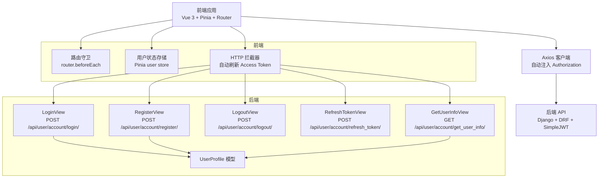

图表来源
- [backend/web/views/user/account/login.py:1-46](file://backend/web/views/user/account/login.py#L1-L46)
- [backend/web/views/user/account/register.py:1-45](file://backend/web/views/user/account/register.py#L1-L45)
- [backend/web/views/user/account/logout.py:1-14](file://backend/web/views/user/account/logout.py#L1-L14)
- [backend/web/views/user/account/refresh_token.py:1-39](file://backend/web/views/user/account/refresh_token.py#L1-L39)
- [backend/web/views/user/account/get_user_info.py:1-24](file://backend/web/views/user/account/get_user_info.py#L1-L24)
- [backend/web/models/user.py:1-23](file://backend/web/models/user.py#L1-L23)
- [frontend/src/js/http/api.js:1-93](file://frontend/src/js/http/api.js#L1-L93)
- [frontend/src/router/index.js:1-110](file://frontend/src/router/index.js#L1-L110)
- [frontend/src/stores/user.js:1-53](file://frontend/src/stores/user.js#L1-L53)

章节来源
- [backend/web/urls.py:1-34](file://backend/web/urls.py#L1-L34)
- [backend/backend/settings.py:133-159](file://backend/backend/settings.py#L133-L159)
- [frontend/src/main.js:1-15](file://frontend/src/main.js#L1-L15)

## 核心组件
- 登录接口：接收用户名/密码，校验通过后签发 Access Token，并以 HttpOnly Cookie 形式下发 Refresh Token，同时返回用户基础信息。
- 注册接口：校验用户名唯一性与必填项，创建用户与用户档案，签发 Access/Refresh Token 并下发 Cookie。
- 登出接口：基于 IsAuthenticated 权限类，删除 Refresh Cookie，使服务端无法再签发新的 Access Token。
- 刷新接口：从前端 Cookie 读取 Refresh Token，校验并签发新 Access Token；支持轮换与黑名单策略。
- 用户信息接口：基于 IsAuthenticated 权限类，返回当前用户信息。
- 前端拦截器：统一注入 Authorization 头；当 401 时自动刷新 Access Token；失败则清空本地登录态并回退登录页。
- 路由守卫：根据路由 meta.needLogin 控制是否放行；结合用户登录态与拉取状态决定跳转登录页。
- 用户状态存储：集中管理用户 ID、用户名、头像、签名、Access Token 与“是否已拉取用户信息”的布尔位。

章节来源
- [backend/web/views/user/account/login.py:9-46](file://backend/web/views/user/account/login.py#L9-L46)
- [backend/web/views/user/account/register.py:9-45](file://backend/web/views/user/account/register.py#L9-L45)
- [backend/web/views/user/account/logout.py:6-14](file://backend/web/views/user/account/logout.py#L6-L14)
- [backend/web/views/user/account/refresh_token.py:7-39](file://backend/web/views/user/account/refresh_token.py#L7-L39)
- [backend/web/views/user/account/get_user_info.py:8-24](file://backend/web/views/user/account/get_user_info.py#L8-L24)
- [frontend/src/js/http/api.js:1-93](file://frontend/src/js/http/api.js#L1-L93)
- [frontend/src/router/index.js:99-107](file://frontend/src/router/index.js#L99-L107)
- [frontend/src/stores/user.js:1-53](file://frontend/src/stores/user.js#L1-L53)

## 架构总览
认证体系采用“Cookie + JWT”的组合模式：
- Access Token：短期有效，用于 API 请求的身份验证。
- Refresh Token：长期有效但受控（可轮换、可黑名单），用于刷新 Access Token。
- HttpOnly Cookie：存放 Refresh Token，降低 XSS 风险。
- 前端拦截器：自动处理 401 与刷新流程，提升用户体验。
- 路由守卫：在导航阶段阻断未授权访问。

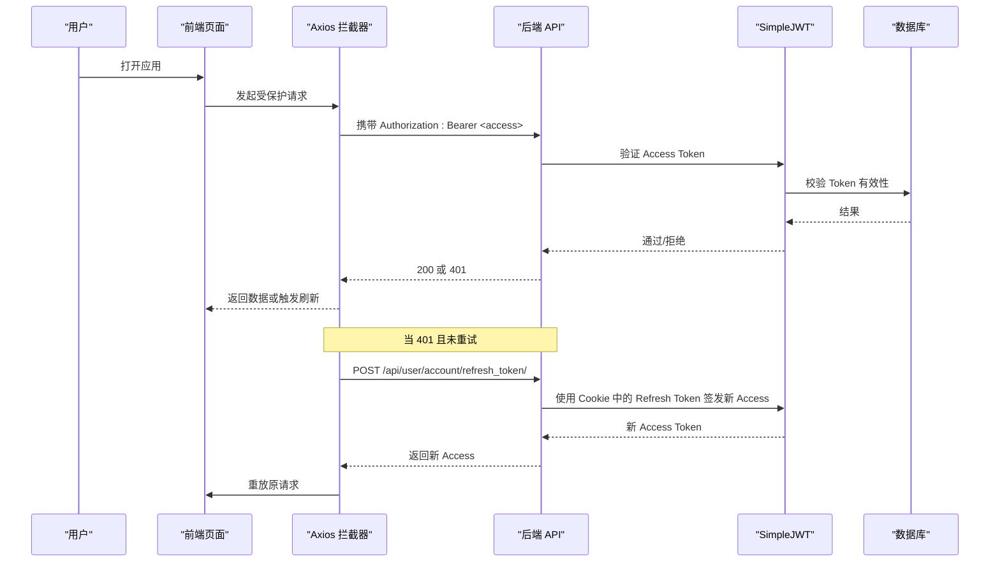

图表来源
- [frontend/src/js/http/api.js:46-90](file://frontend/src/js/http/api.js#L46-L90)
- [backend/web/views/user/account/refresh_token.py:7-39](file://backend/web/views/user/account/refresh_token.py#L7-L39)
- [backend/backend/settings.py:143-151](file://backend/backend/settings.py#L143-L151)

## 详细组件分析

### 登录流程
- 输入校验：用户名/密码非空。
- 认证：使用 Django 内置 authenticate 校验凭据。
- 成功：生成 Refresh Token，签发 Access Token，设置 HttpOnly Cookie，返回用户信息。
- 失败：返回明确错误提示；异常兜底返回系统异常提示。

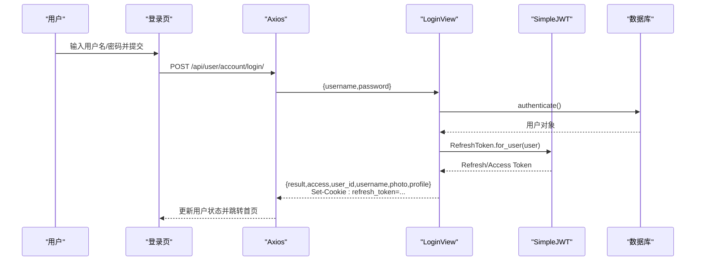

图表来源
- [frontend/src/views/user/account/LoginIndex.vue:14-39](file://frontend/src/views/user/account/LoginIndex.vue#L14-L39)
- [backend/web/views/user/account/login.py:9-46](file://backend/web/views/user/account/login.py#L9-L46)
- [frontend/src/js/http/api.js:16-27](file://frontend/src/js/http/api.js#L16-L27)

章节来源
- [backend/web/views/user/account/login.py:9-46](file://backend/web/views/user/account/login.py#L9-L46)
- [frontend/src/views/user/account/LoginIndex.vue:14-39](file://frontend/src/views/user/account/LoginIndex.vue#L14-L39)

### 注册流程
- 输入校验：用户名/密码非空，且用户名唯一。
- 创建：创建 User 与 UserProfile。
- 成功：签发 Access/Refresh Token，设置 HttpOnly Cookie，返回用户信息。
- 失败：返回相应错误提示；异常兜底返回系统异常提示。

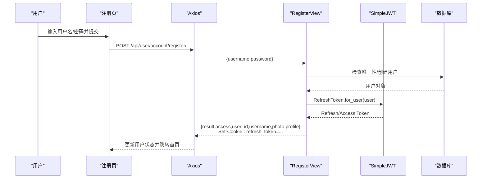

图表来源
- [frontend/src/views/user/account/RegisterIndex.vue:15-42](file://frontend/src/views/user/account/RegisterIndex.vue#L15-L42)
- [backend/web/views/user/account/register.py:9-45](file://backend/web/views/user/account/register.py#L9-L45)
- [frontend/src/js/http/api.js:16-27](file://frontend/src/js/http/api.js#L16-L27)

章节来源
- [backend/web/views/user/account/register.py:9-45](file://backend/web/views/user/account/register.py#L9-L45)
- [frontend/src/views/user/account/RegisterIndex.vue:15-42](file://frontend/src/views/user/account/RegisterIndex.vue#L15-L42)

### 登出流程
- 登出接口强制要求已登录，删除 Refresh Cookie，使后续无法刷新 Access Token。
- 前端调用后清理本地状态并跳转首页。

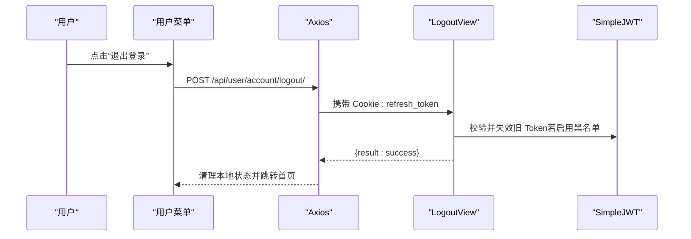

图表来源
- [frontend/src/components/navbar/UserMenu.vue:17-28](file://frontend/src/components/navbar/UserMenu.vue#L17-L28)
- [backend/web/views/user/account/logout.py:6-14](file://backend/web/views/user/account/logout.py#L6-L14)
- [frontend/src/js/http/api.js:16-19](file://frontend/src/js/http/api.js#L16-L19)

章节来源
- [backend/web/views/user/account/logout.py:6-14](file://backend/web/views/user/account/logout.py#L6-L14)
- [frontend/src/components/navbar/UserMenu.vue:17-28](file://frontend/src/components/navbar/UserMenu.vue#L17-L28)

### 访问令牌刷新流程
- 前端拦截器检测 401 且未重试时，携带 Cookie 中的 Refresh Token 调用刷新接口。
- 若刷新成功，更新本地 Access Token 并重放原请求；若失败，清空本地状态并中断请求。

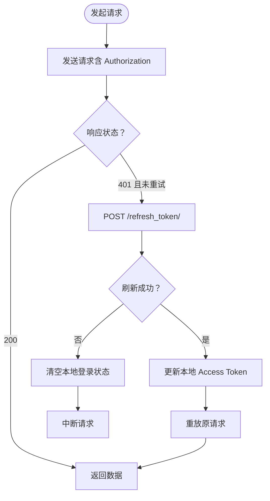

图表来源
- [frontend/src/js/http/api.js:46-90](file://frontend/src/js/http/api.js#L46-L90)
- [backend/web/views/user/account/refresh_token.py:7-39](file://backend/web/views/user/account/refresh_token.py#L7-L39)

章节来源
- [frontend/src/js/http/api.js:46-90](file://frontend/src/js/http/api.js#L46-L90)
- [backend/web/views/user/account/refresh_token.py:7-39](file://backend/web/views/user/account/refresh_token.py#L7-L39)

### 路由守卫与权限控制
- 路由元信息 needLogin 标记哪些页面需要登录。
- 导航前置守卫：若目标路由需登录且用户未登录，跳转至登录页。
- 用户状态：hasPulledUserInfo 标识是否已从后端拉取过用户信息，避免误判。

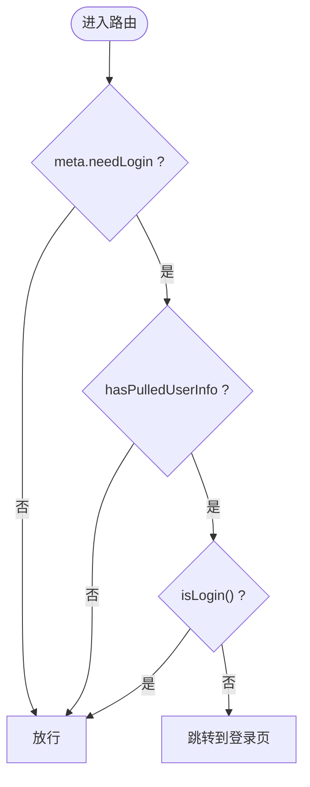

图表来源
- [frontend/src/router/index.js:99-107](file://frontend/src/router/index.js#L99-L107)
- [frontend/src/stores/user.js:12-14](file://frontend/src/stores/user.js#L12-L14)

章节来源
- [frontend/src/router/index.js:99-107](file://frontend/src/router/index.js#L99-L107)
- [frontend/src/stores/user.js:12-14](file://frontend/src/stores/user.js#L12-L14)

### 认证状态检查与用户信息拉取
- 用户信息接口仅对已登录用户开放，返回用户基础信息。
- 前端在登录成功后调用该接口，确保本地状态与后端一致。

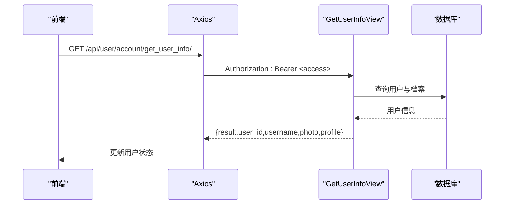

图表来源
- [frontend/src/js/http/api.js:16-27](file://frontend/src/js/http/api.js#L16-L27)
- [backend/web/views/user/account/get_user_info.py:8-24](file://backend/web/views/user/account/get_user_info.py#L8-L24)

章节来源
- [backend/web/views/user/account/get_user_info.py:8-24](file://backend/web/views/user/account/get_user_info.py#L8-L24)
- [frontend/src/js/http/api.js:16-27](file://frontend/src/js/http/api.js#L16-L27)

## 依赖分析
- 后端依赖
  - Django + DRF：提供视图、序列化、权限类与中间件。
  - djangorestframework-simplejwt：提供 JWT 认证、Access/Refresh Token 签发与校验。
  - CORS：允许前端域名跨域访问。
- 前端依赖
  - Axios：HTTP 客户端，配置 withCredentials 与拦截器。
  - Vue Router：路由定义与导航守卫。
  - Pinia：集中式状态管理，保存用户登录态与信息。

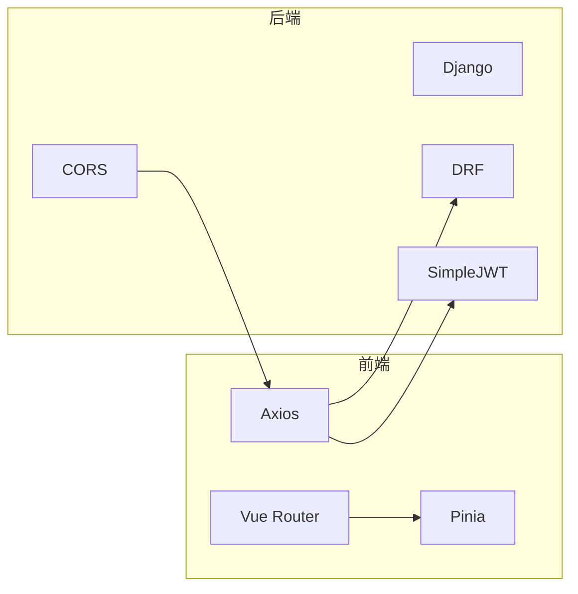

图表来源
- [backend/backend/settings.py:133-159](file://backend/backend/settings.py#L133-L159)
- [frontend/src/js/http/api.js:16-19](file://frontend/src/js/http/api.js#L16-L19)
- [frontend/src/router/index.js:1-110](file://frontend/src/router/index.js#L1-L110)
- [frontend/src/stores/user.js:1-53](file://frontend/src/stores/user.js#L1-L53)

章节来源
- [backend/backend/settings.py:133-159](file://backend/backend/settings.py#L133-L159)
- [frontend/src/js/http/api.js:16-19](file://frontend/src/js/http/api.js#L16-L19)
- [frontend/src/router/index.js:1-110](file://frontend/src/router/index.js#L1-L110)
- [frontend/src/stores/user.js:1-53](file://frontend/src/stores/user.js#L1-L53)

## 性能考虑
- Access Token 生命周期：短期有效，减少频繁鉴权成本。
- Refresh Token 轮换与黑名单：降低泄露风险，避免长期滥用。
- 前端拦截器幂等：避免并发刷新导致的重复请求风暴。
- 路由守卫轻量判断：仅基于内存状态与路由元信息，避免额外网络请求。
- 建议
  - 将刷新接口超时设为合理值，避免阻塞主流程。
  - 对频繁访问的受保护资源，考虑在前端做缓存与去抖。
  - 在网关层限制每 IP 的刷新频率，防止暴力破解。

## 故障排查指南
- 常见错误与处理
  - 用户名或密码为空：前端表单校验直接提示，避免无效请求。
  - 用户名或密码错误：后端返回明确提示，前端展示错误信息。
  - 用户名已存在：注册接口返回提示，前端引导用户更换用户名。
  - 系统异常：捕获异常并提示稍后重试。
  - 401 未授权：前端自动刷新 Access Token；若刷新失败则清空本地状态并回退登录页。
  - Refresh Token 不存在或过期：后端返回 401，前端清空状态并回退登录页。
- 排查步骤
  - 检查浏览器 Cookie 是否包含 refresh_token 且未过期。
  - 确认 Authorization 头是否正确注入 Bearer Token。
  - 查看后端日志与 SimpleJWT 配置，确认 ACCESS_TOKEN_LIFETIME 与 REFRESH_TOKEN_LIFETIME。
  - 核对 CORS 配置与 withCredentials 设置。

章节来源
- [backend/web/views/user/account/login.py:14-17](file://backend/web/views/user/account/login.py#L14-L17)
- [backend/web/views/user/account/register.py:14-21](file://backend/web/views/user/account/register.py#L14-L21)
- [frontend/src/js/http/api.js:46-90](file://frontend/src/js/http/api.js#L46-L90)
- [backend/web/views/user/account/refresh_token.py:10-14](file://backend/web/views/user/account/refresh_token.py#L10-L14)

## 结论
本认证方案以“Cookie + JWT”为核心，结合前端拦截器与路由守卫，实现了自动化、低侵入的认证体验。通过 Access/Refresh Token 分离、轮换与黑名单策略，兼顾安全性与可用性。建议在生产环境进一步完善安全加固与监控告警，持续优化用户体验。

## 附录

### 用户旅程地图
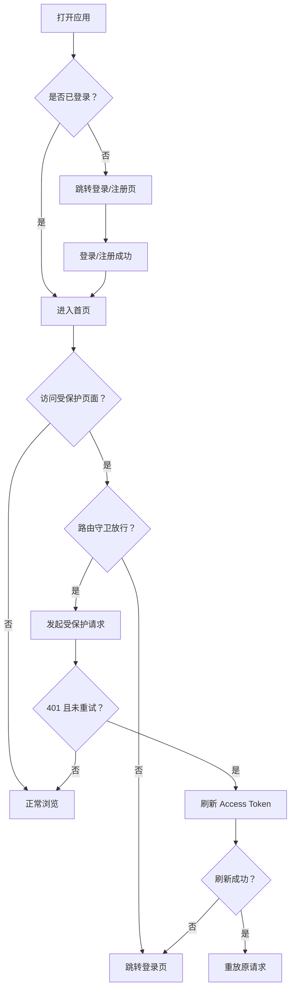

图表来源
- [frontend/src/router/index.js:99-107](file://frontend/src/router/index.js#L99-L107)
- [frontend/src/js/http/api.js:46-90](file://frontend/src/js/http/api.js#L46-L90)

### 认证状态机
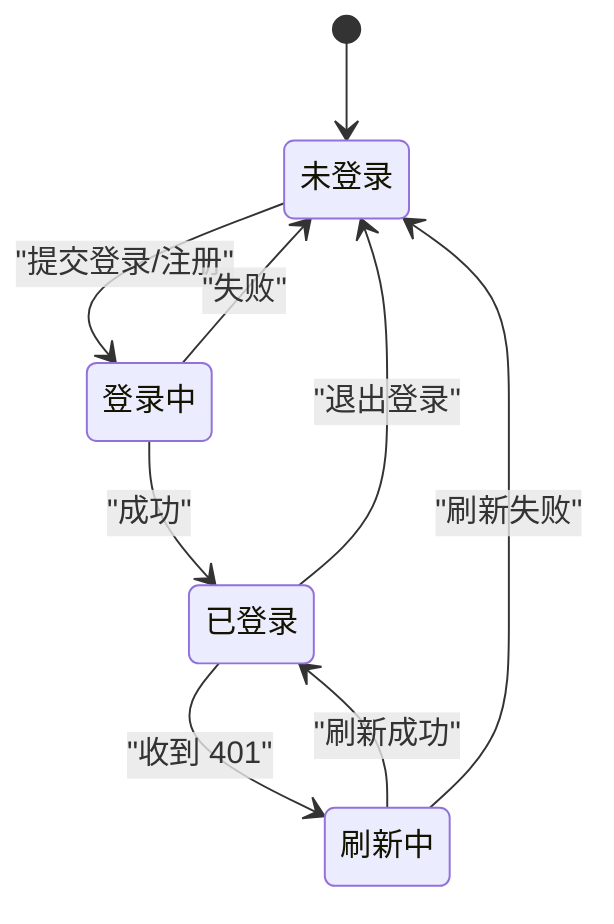

图表来源
- [frontend/src/js/http/api.js:46-90](file://frontend/src/js/http/api.js#L46-L90)
- [frontend/src/stores/user.js:27-33](file://frontend/src/stores/user.js#L27-L33)