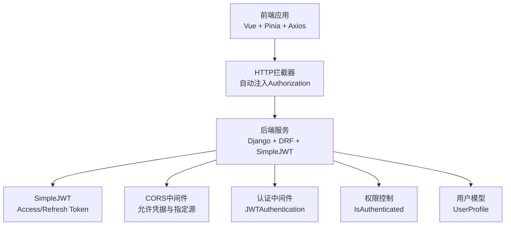
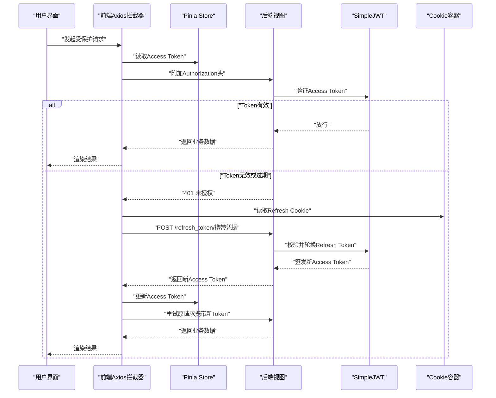
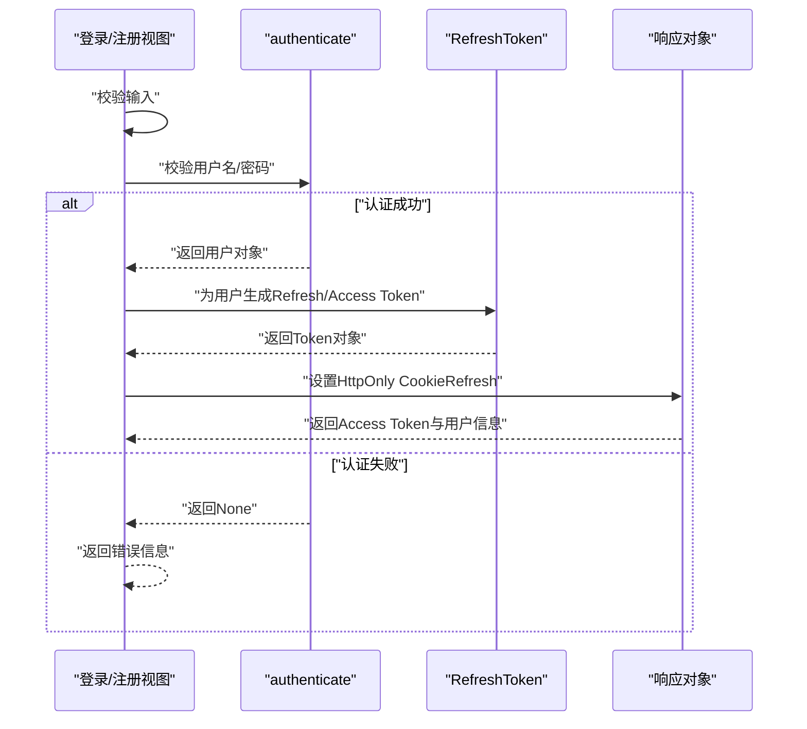
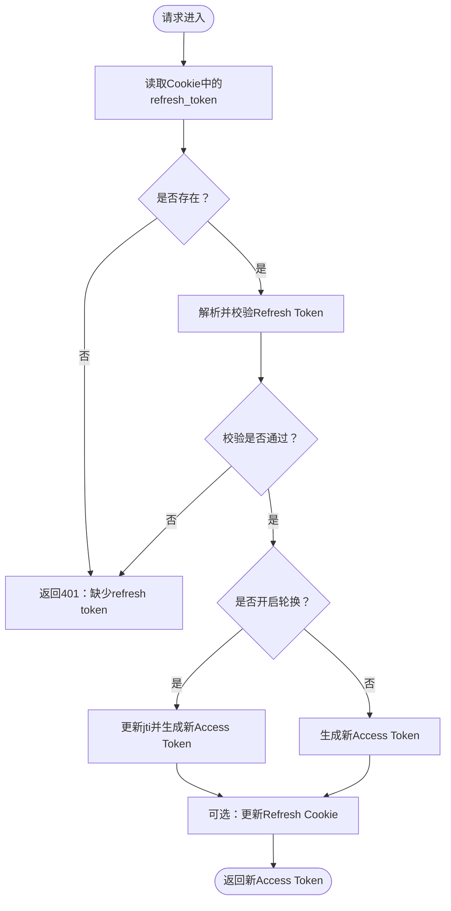
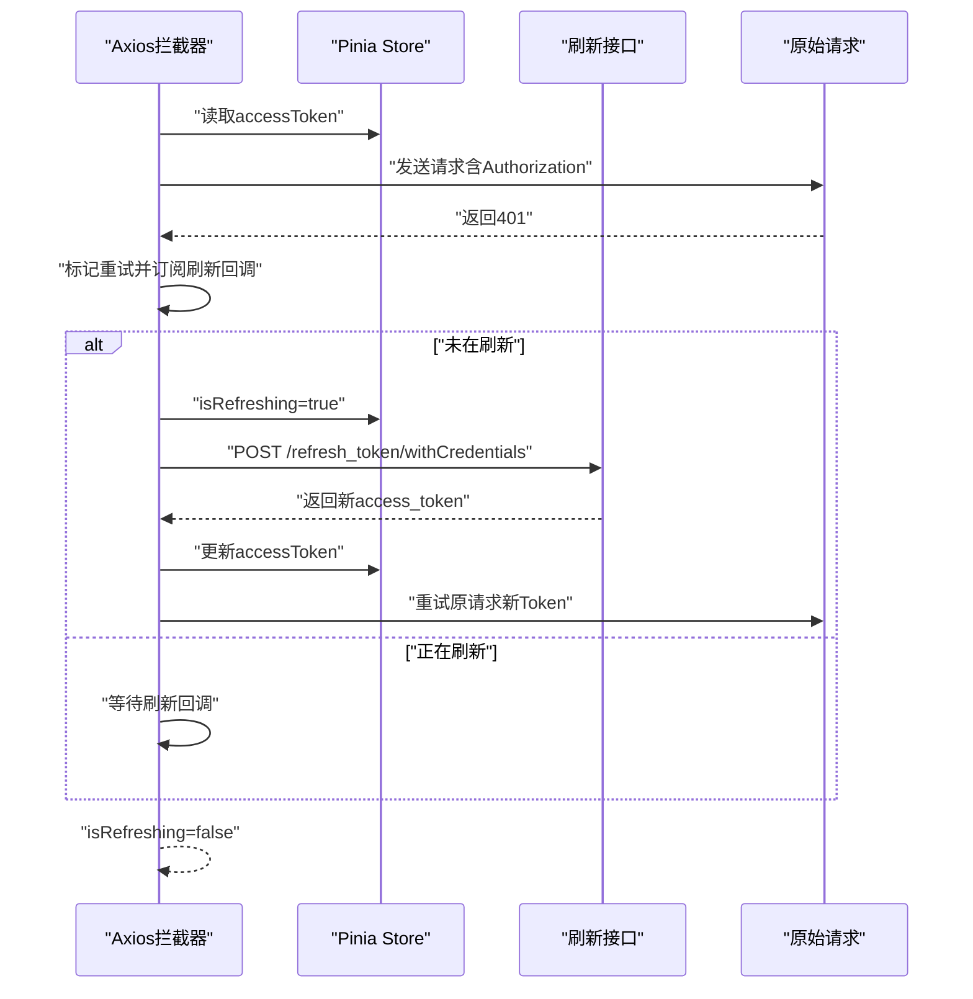
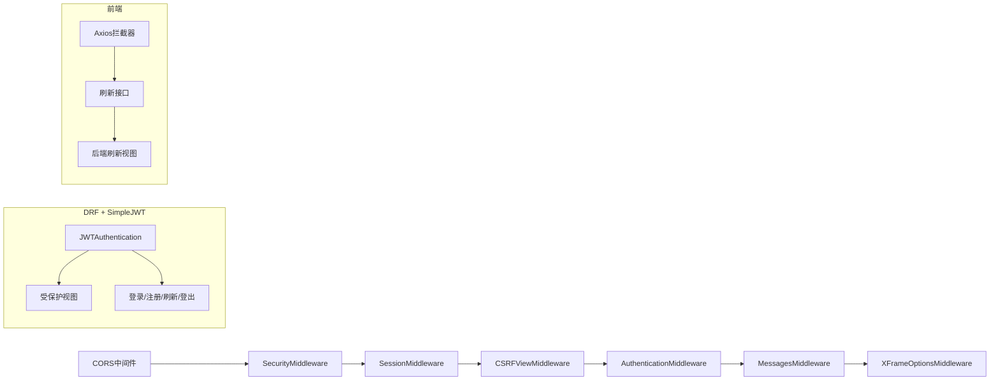

# 认证系统

<cite>
**本文引用的文件**
- [settings.py](file://backend/backend/settings.py)
- [urls.py](file://backend/backend/urls.py)
- [urls.py](file://backend/web/urls.py)
- [login.py](file://backend/web/views/user/account/login.py)
- [register.py](file://backend/web/views/user/account/register.py)
- [refresh_token.py](file://backend/web/views/user/account/refresh_token.py)
- [logout.py](file://backend/web/views/user/account/logout.py)
- [get_user_info.py](file://backend/web/views/user/account/get_user_info.py)
- [update.py](file://backend/web/views/user/profile/update.py)
- [user.py](file://backend/web/models/user.py)
- [api.js](file://frontend/src/js/http/api.js)
- [user.js](file://frontend/src/stores/user.js)
- [LoginIndex.vue](file://frontend/src/views/user/account/LoginIndex.vue)
- [RegisterIndex.vue](file://frontend/src/views/user/account/RegisterIndex.vue)
</cite>

## 目录
1. [引言](#引言)
2. [项目结构](#项目结构)
3. [核心组件](#核心组件)
4. [架构总览](#架构总览)
5. [详细组件分析](#详细组件分析)
6. [依赖分析](#依赖分析)
7. [性能考虑](#性能考虑)
8. [故障排查指南](#故障排查指南)
9. [结论](#结论)
10. [附录](#附录)

## 引言
本文件面向LLM_AIfriends项目的认证系统，围绕JWT（JSON Web Token）认证机制、CORS跨域配置、认证中间件与权限控制、前端Token管理与自动刷新、会话持久化等主题进行系统化技术说明。文档同时提供认证流程图、安全考虑与最佳实践、错误处理与重试机制以及用户体验优化建议，帮助开发者快速理解并维护该认证体系。

## 项目结构
认证系统由后端Django应用与前端Vue应用协同完成：
- 后端负责用户认证、JWT签发与刷新、CORS与安全中间件、权限控制与模型数据。
- 前端负责HTTP拦截器注入Authorization头、401自动刷新、状态存储与路由跳转。

图表来源
- [settings.py:45-54](file://backend/backend/settings.py#L45-L54)
- [settings.py:136-151](file://backend/backend/settings.py#L136-L151)
- [settings.py:153-159](file://backend/backend/settings.py#L153-L159)
- [urls.py:16-32](file://backend/web/urls.py#L16-L32)
- [api.js:16-27](file://frontend/src/js/http/api.js#L16-L27)

章节来源
- [urls.py:22-25](file://backend/backend/urls.py#L22-L25)
- [urls.py:16-32](file://backend/web/urls.py#L16-L32)

## 核心组件
- 后端认证配置
  - 默认认证类：REST_FRAMEWORK启用了JWTAuthentication。
  - JWT生命周期：ACCESS_TOKEN_LIFETIME为2小时；REFRESH_TOKEN_LIFETIME为7天；开启轮换与黑名单。
  - 头部类型：AUTH_HEADER_TYPES为Bearer。
- CORS配置
  - 允许凭据（Cookie）跨域。
  - 指定允许的前端源为本地Vite开发服务器。
- 认证视图
  - 登录/注册：生成Access Token与Refresh Token，并通过HttpOnly Cookie持久化Refresh Token。
  - 刷新：从Cookie读取Refresh Token，校验并签发新Access Token，必要时更新Cookie。
  - 登出：删除Refresh Cookie。
  - 受保护接口：通过IsAuthenticated权限控制。
- 前端组件
  - Axios拦截器：统一注入Authorization头；拦截401并触发刷新流程。
  - Pinia Store：保存用户信息与Access Token；提供登录态判断与登出清理。
  - 登录/注册页面：提交表单后接收Token并写入Store与Cookie。

章节来源
- [settings.py:136-151](file://backend/backend/settings.py#L136-L151)
- [settings.py:153-159](file://backend/backend/settings.py#L153-L159)
- [login.py:9-46](file://backend/web/views/user/account/login.py#L9-L46)
- [register.py:9-45](file://backend/web/views/user/account/register.py#L9-L45)
- [refresh_token.py:7-39](file://backend/web/views/user/account/refresh_token.py#L7-L39)
- [logout.py:6-14](file://backend/web/views/user/account/logout.py#L6-L14)
- [get_user_info.py:8-24](file://backend/web/views/user/account/get_user_info.py#L8-L24)
- [update.py:11-53](file://backend/web/views/user/profile/update.py#L11-L53)
- [user.js:4-53](file://frontend/src/stores/user.js#L4-L53)
- [api.js:16-93](file://frontend/src/js/http/api.js#L16-L93)

## 架构总览
下图展示认证系统的关键交互：前端发起请求，后端通过JWTAuthentication解析Authorization头，受保护接口依赖IsAuthenticated；当Access Token失效时，前端通过携带Cookie的刷新接口获取新Token并重试原请求。

图表来源
- [api.js:46-90](file://frontend/src/js/http/api.js#L46-L90)
- [refresh_token.py:7-39](file://backend/web/views/user/account/refresh_token.py#L7-L39)
- [login.py:9-46](file://backend/web/views/user/account/login.py#L9-L46)
- [register.py:9-45](file://backend/web/views/user/account/register.py#L9-L45)
- [settings.py:136-151](file://backend/backend/settings.py#L136-L151)

## 详细组件分析

### 后端认证配置与中间件
- 认证类
  - DEFAULT_AUTHENTICATION_CLASSES启用JWTAuthentication，使所有视图默认使用JWT校验。
- JWT参数
  - ACCESS_TOKEN_LIFETIME与REFRESH_TOKEN_LIFETIME定义了Token有效期。
  - ROTATE_REFRESH_TOKENS与BLACKLIST_AFTER_ROTATION确保刷新后旧Refresh Token失效，提升安全性。
  - AUTH_HEADER_TYPES限制为Bearer，避免混淆其他头部格式。
- 中间件顺序
  - CORS中间件需置于Session等中间件之前，以确保预检请求能正确处理凭据。
- CORS
  - CORS_ALLOW_CREDENTIALS为True，允许前端携带Cookie。
  - CORS_ALLOWED_ORIGINS限定为前端开发服务器地址，生产环境应按实际域名调整。

章节来源
- [settings.py:45-54](file://backend/backend/settings.py#L45-L54)
- [settings.py:136-151](file://backend/backend/settings.py#L136-L151)
- [settings.py:153-159](file://backend/backend/settings.py#L153-L159)

### 登录与注册流程
- 输入校验
  - 用户名与密码非空校验，防止空值导致异常。
- 用户认证
  - authenticate根据用户名与密码校验用户。
- Token签发
  - 使用RefreshToken.for_user生成Refresh Token及对应Access Token。
  - 将Refresh Token以HttpOnly Cookie形式下发，设置安全标志、SameSite与过期时间。
- 返回数据
  - 返回Access Token、用户标识、头像URL与个人简介等信息。
- 错误处理
  - 对异常进行捕获并返回统一提示，避免泄露内部细节。

图表来源
- [login.py:9-46](file://backend/web/views/user/account/login.py#L9-L46)
- [register.py:9-45](file://backend/web/views/user/account/register.py#L9-L45)

章节来源
- [login.py:9-46](file://backend/web/views/user/account/login.py#L9-L46)
- [register.py:9-45](file://backend/web/views/user/account/register.py#L9-L45)

### 刷新Token流程
- Cookie读取
  - 从请求Cookie中读取refresh_token。
- 校验与轮换
  - 若开启ROTATE_REFRESH_TOKENS，会更新jti并签发新的Access Token；否则直接签发新Access Token。
- 响应更新
  - 返回新Access Token，并可选择性地更新Cookie中的Refresh Token。
- 异常处理
  - 无法解析或过期时返回401与错误信息。

图表来源
- [refresh_token.py:7-39](file://backend/web/views/user/account/refresh_token.py#L7-L39)
- [settings.py:143-151](file://backend/backend/settings.py#L143-L151)

章节来源
- [refresh_token.py:7-39](file://backend/web/views/user/account/refresh_token.py#L7-L39)
- [settings.py:143-151](file://backend/backend/settings.py#L143-L151)

### 登出流程
- 权限要求
  - 使用IsAuthenticated确保只有登录用户可登出。
- 清理Cookie
  - 删除refresh_token Cookie，使后续刷新请求失效。
- 返回结果
  - 返回成功状态码与消息。

章节来源
- [logout.py:6-14](file://backend/web/views/user/account/logout.py#L6-L14)

### 受保护接口与权限控制
- 接口示例
  - 获取用户信息与更新个人资料均使用IsAuthenticated权限装饰器。
- 安全要点
  - 所有敏感操作均需有效Access Token，避免未授权访问。
- 数据一致性
  - 用户信息与头像URL来自UserProfile模型，保证返回字段一致可靠。

章节来源
- [get_user_info.py:8-24](file://backend/web/views/user/account/get_user_info.py#L8-L24)
- [update.py:11-53](file://backend/web/views/user/profile/update.py#L11-L53)
- [user.py:14-23](file://backend/web/models/user.py#L14-L23)

### 前端Token管理与自动刷新
- 请求拦截
  - 在请求头中附加Authorization: Bearer <access_token>。
- 响应拦截
  - 拦截401未授权：若首次遇到401且未重试标记，则发起刷新请求。
  - 刷新成功：更新Store中的access_token并重试原请求。
  - 刷新失败：清空登录状态并拒绝原请求。
- 并发控制
  - 使用isRefreshing与订阅队列避免并发重复刷新。
- 存储与登录态
  - Pinia Store保存用户id、username、photo、profile与accessToken。
  - isLogin基于accessToken是否存在判断登录态。

图表来源
- [api.js:46-90](file://frontend/src/js/http/api.js#L46-L90)
- [user.js:4-53](file://frontend/src/stores/user.js#L4-L53)

章节来源
- [api.js:16-93](file://frontend/src/js/http/api.js#L16-L93)
- [user.js:4-53](file://frontend/src/stores/user.js#L4-L53)

### 页面与路由集成
- 登录页
  - 表单校验用户名与密码非空；提交后写入Store并跳转首页。
- 注册页
  - 校验两次密码一致；提交后写入Store并跳转首页。
- 路由守卫
  - 可结合isLogin在路由层进行前置校验（当前仓库未提供路由守卫代码，建议在router中补充）。

章节来源
- [LoginIndex.vue:14-39](file://frontend/src/views/user/account/LoginIndex.vue#L14-L39)
- [RegisterIndex.vue:15-42](file://frontend/src/views/user/account/RegisterIndex.vue#L15-L42)
- [user.js:12-14](file://frontend/src/stores/user.js#L12-L14)

## 依赖分析
- 后端依赖
  - Django中间件链：CORS -> Security -> Session -> CSRF -> Authentication -> Messages -> XFrameOptions。
  - DRF与SimpleJWT：提供JWT认证与令牌配置。
  - 视图依赖：登录/注册/刷新/登出/受保护接口。
- 前端依赖
  - Axios拦截器依赖Pinia Store与后端刷新接口。
  - 组件依赖Store与路由。

图表来源
- [settings.py:45-54](file://backend/backend/settings.py#L45-L54)
- [settings.py:136-151](file://backend/backend/settings.py#L136-L151)
- [urls.py:16-32](file://backend/web/urls.py#L16-L32)
- [api.js:16-93](file://frontend/src/js/http/api.js#L16-L93)

章节来源
- [settings.py:45-54](file://backend/backend/settings.py#L45-L54)
- [settings.py:136-151](file://backend/backend/settings.py#L136-L151)
- [urls.py:16-32](file://backend/web/urls.py#L16-L32)
- [api.js:16-93](file://frontend/src/js/http/api.js#L16-L93)

## 性能考虑
- Token有效期
  - Access Token较短（2小时），降低泄露风险；Refresh Token较长（7天），减少频繁登录。
- 刷新策略
  - 采用并发控制避免重复刷新；仅在401时触发刷新，降低不必要的网络开销。
- Cookie策略
  - HttpOnly + Secure + SameSite=Lax，兼顾安全与可用性。
- 前端缓存
  - Store中缓存用户信息与Token，避免重复拉取与二次渲染。

## 故障排查指南
- 401未授权
  - 检查前端是否正确注入Authorization头。
  - 检查后端JWT配置与请求头类型是否匹配。
- 刷新失败
  - 检查Cookie中refresh_token是否存在与是否过期。
  - 检查后端是否开启ROTATE_REFRESH_TOKENS与BLACKLIST设置。
- 跨域问题
  - 确认CORS_ALLOW_CREDENTIALS为True且CORS_ALLOWED_ORIGINS包含前端地址。
- 登录后仍提示未登录
  - 检查前端Store是否正确写入access_token与用户信息。
  - 检查后端是否正确下发Refresh Cookie。

章节来源
- [api.js:46-90](file://frontend/src/js/http/api.js#L46-L90)
- [refresh_token.py:7-39](file://backend/web/views/user/account/refresh_token.py#L7-L39)
- [settings.py:153-159](file://backend/backend/settings.py#L153-L159)
- [user.js:12-14](file://frontend/src/stores/user.js#L12-L14)

## 结论
本认证系统基于Django + DRF + SimpleJWT实现了标准的前后端分离认证模式：后端通过JWTAuthentication与权限控制保障接口安全，前端通过Axios拦截器与自动刷新机制提升用户体验。CORS与Cookie策略兼顾安全与易用性。建议在生产环境中进一步完善路由守卫、日志审计与更严格的CORS白名单配置。

## 附录
- 最佳实践清单
  - 生产环境关闭DEBUG，严格设置ALLOWED_HOSTS与CORS_ALLOWED_ORIGINS。
  - 使用HTTPS部署，确保Cookie的Secure标志生效。
  - 对敏感操作增加速率限制与风控策略。
  - 前端对401场景进行明确的用户提示与引导重新登录。
  - 定期轮换密钥与监控异常登录行为。