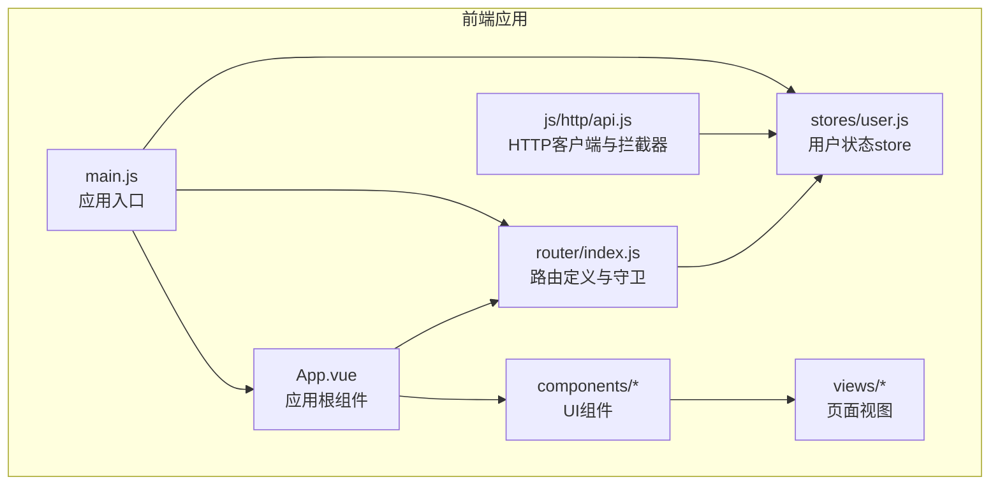
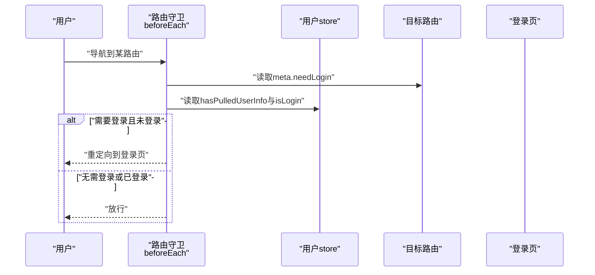
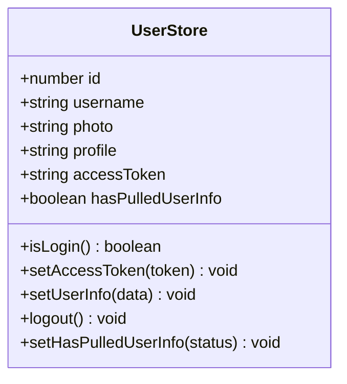
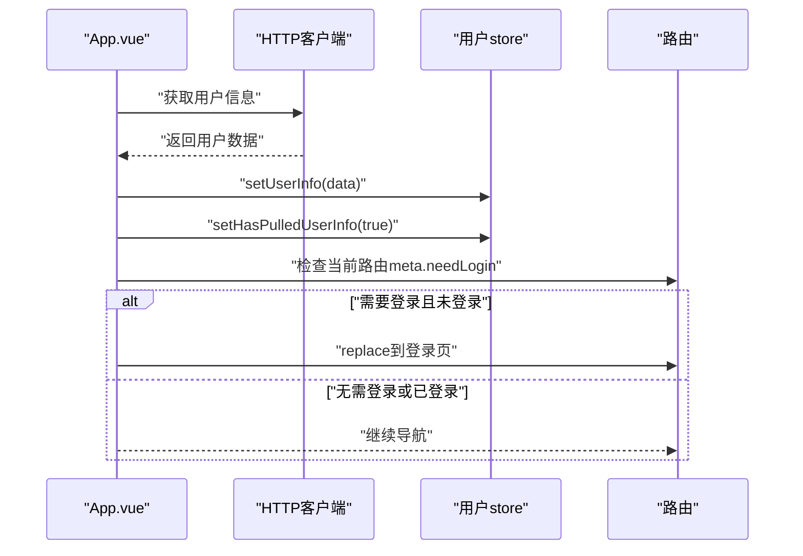
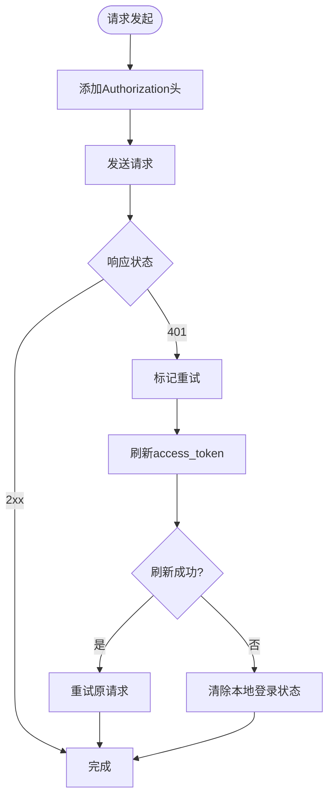
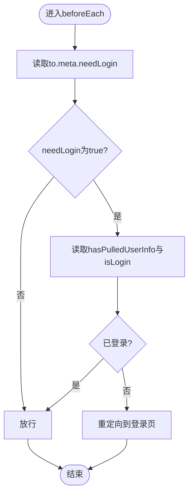
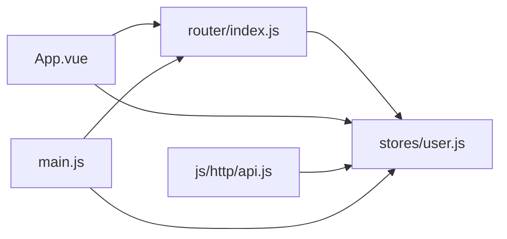

# 导航守卫

<cite>
**本文引用的文件**
- [router/index.js](file://frontend/src/router/index.js)
- [stores/user.js](file://frontend/src/stores/user.js)
- [main.js](file://frontend/src/main.js)
- [App.vue](file://frontend/src/App.vue)
- [js/http/api.js](file://frontend/src/js/http/api.js)
- [views/user/account/LoginIndex.vue](file://frontend/src/views/user/account/LoginIndex.vue)
- [components/navbar/NavBar.vue](file://frontend/src/components/navbar/NavBar.vue)
- [components/navbar/UserMenu.vue](file://frontend/src/components/navbar/UserMenu.vue)
- [package.json](file://frontend/package.json)
</cite>

## 目录
1. [简介](#简介)
2. [项目结构](#项目结构)
3. [核心组件](#核心组件)
4. [架构总览](#架构总览)
5. [详细组件分析](#详细组件分析)
6. [依赖关系分析](#依赖关系分析)
7. [性能考虑](#性能考虑)
8. [故障排除指南](#故障排除指南)
9. [结论](#结论)

## 简介
本文件面向LLM_AIfriends项目的前端导航守卫系统，重点解析全局前置守卫beforeEach的实现原理与使用方法，涵盖用户认证状态检查、权限验证逻辑、路由跳转控制、needLogin元信息的作用机制，以及用户store在导航守卫中的集成方式。文档提供导航流程图、权限控制示例与常见问题解决方案，帮助开发者快速理解并维护该系统的导航安全与用户体验。

## 项目结构
前端采用Vue 3 + Vue Router 4 + Pinia的状态管理方案，导航守卫集中于路由模块，用户状态通过Pinia store统一管理，HTTP请求通过axios封装并注入鉴权头与自动刷新逻辑。

图表来源
- [main.js:1-15](file://frontend/src/main.js#L1-L15)
- [router/index.js:1-110](file://frontend/src/router/index.js#L1-L110)
- [stores/user.js:1-53](file://frontend/src/stores/user.js#L1-L53)
- [App.vue:1-41](file://frontend/src/App.vue#L1-L41)
- [js/http/api.js:1-93](file://frontend/src/js/http/api.js#L1-L93)

章节来源
- [package.json:1-30](file://frontend/package.json#L1-L30)

## 核心组件
- 全局前置守卫：在路由切换前执行，依据目标路由的meta.needLogin与用户store状态决定是否放行或重定向至登录页。
- 用户store：集中管理用户id、username、photo、profile、accessToken、hasPulledUserInfo等状态，并提供isLogin、setAccessToken、setUserInfo、logout等方法。
- HTTP客户端：自动在请求头添加Authorization，拦截401错误并尝试使用refresh_token刷新access_token，失败则清除本地登录状态。
- 应用根组件：在挂载时拉取用户信息并设置hasPulledUserInfo标志，随后根据needLogin与isLogin进行二次校验与跳转。

章节来源
- [router/index.js:99-107](file://frontend/src/router/index.js#L99-L107)
- [stores/user.js:4-52](file://frontend/src/stores/user.js#L4-L52)
- [App.vue:12-29](file://frontend/src/App.vue#L12-L29)
- [js/http/api.js:21-89](file://frontend/src/js/http/api.js#L21-L89)

## 架构总览
导航守卫的整体工作流如下：
- 路由切换触发beforeEach
- 读取目标路由meta.needLogin
- 读取用户store的hasPulledUserInfo与isLogin
- 若需要登录且未登录，则重定向到登录页
- 否则放行

图表来源
- [router/index.js:99-107](file://frontend/src/router/index.js#L99-L107)
- [stores/user.js:12-14](file://frontend/src/stores/user.js#L12-L14)

## 详细组件分析

### 全局前置守卫 beforeEach 实现
- 触发时机：每次路由切换前
- 核心逻辑：
  - 从用户store读取hasPulledUserInfo与isLogin
  - 当目标路由meta.needLogin为true且用户未登录时，重定向到登录页
  - 否则返回true放行
- 关键点：
  - needLogin元信息由路由表统一声明
  - isLogin基于accessToken是否存在判断
  - hasPulledUserInfo用于避免重复拉取用户信息导致的重复跳转

章节来源
- [router/index.js:99-107](file://frontend/src/router/index.js#L99-L107)
- [stores/user.js:12-14](file://frontend/src/stores/user.js#L12-L14)

### 用户store与认证状态
- 状态字段：
  - id、username、photo、profile、accessToken、hasPulledUserInfo
- 方法：
  - isLogin：判断accessToken是否存在
  - setAccessToken：设置访问令牌
  - setUserInfo：设置用户信息
  - logout：清空用户信息与令牌
  - setHasPulledUserInfo：标记用户信息已拉取
- 使用场景：
  - 导航守卫中判断是否需要登录
  - 登录成功后写入令牌与用户信息
  - 退出登录时清除状态并跳转首页

图表来源
- [stores/user.js:4-52](file://frontend/src/stores/user.js#L4-L52)

章节来源
- [stores/user.js:4-52](file://frontend/src/stores/user.js#L4-L52)

### needLogin元信息的作用机制
- 定义位置：各路由的meta.needLogin字段
- 作用范围：影响全局前置守卫的行为
- 常见值：
  - true：需要登录才可访问
  - false：无需登录即可访问
- 影响路径：
  - 受导航守卫影响的路由（如好友、创作、个人资料）
  - 不受导航守卫影响的公开路由（如首页、登录、注册、404）

章节来源
- [router/index.js:20-22](file://frontend/src/router/index.js#L20-L22)
- [router/index.js:28-30](file://frontend/src/router/index.js#L28-L30)
- [router/index.js:36-38](file://frontend/src/router/index.js#L36-L38)
- [router/index.js:84-86](file://frontend/src/router/index.js#L84-L86)

### 应用根组件的二次校验与用户信息拉取
- 挂载阶段：
  - 调用后端接口获取用户信息
  - 成功后写入用户store并设置hasPulledUserInfo为true
- 二次校验：
  - 若当前路由meta.needLogin为true且用户未登录，则跳转到登录页
- 作用：
  - 避免重复拉取用户信息
  - 在用户信息拉取完成后进行最终校验

图表来源
- [App.vue:12-29](file://frontend/src/App.vue#L12-L29)
- [js/http/api.js:14-19](file://frontend/src/js/http/api.js#L14-L19)

章节来源
- [App.vue:12-29](file://frontend/src/App.vue#L12-L29)

### HTTP客户端与令牌刷新
- 请求拦截：
  - 自动在Authorization头添加Bearer token
- 响应拦截：
  - 拦截401未授权错误
  - 使用refresh_token刷新access_token
  - 刷新成功则重试原请求；失败则清除本地登录状态
- 与导航守卫的关系：
  - 令牌刷新失败会触发logout，使后续导航守卫判定为未登录并重定向到登录页

图表来源
- [js/http/api.js:21-89](file://frontend/src/js/http/api.js#L21-L89)

章节来源
- [js/http/api.js:21-89](file://frontend/src/js/http/api.js#L21-L89)

### 登录流程与导航联动
- 登录视图：
  - 输入用户名与密码
  - 调用后端登录接口
  - 登录成功后写入令牌与用户信息，并跳转首页
- 导航联动：
  - 登录成功后，后续路由切换将不再被导航守卫拦截

章节来源
- [views/user/account/LoginIndex.vue:14-39](file://frontend/src/views/user/account/LoginIndex.vue#L14-L39)
- [js/http/api.js:70-84](file://frontend/src/js/http/api.js#L70-L84)

### 导航守卫决策流程图

图表来源
- [router/index.js:99-107](file://frontend/src/router/index.js#L99-L107)

## 依赖关系分析
- 组件耦合：
  - router依赖stores/user.js提供的isLogin与hasPulledUserInfo
  - App.vue依赖router与store，在挂载时进行二次校验
  - HTTP客户端依赖store以注入Authorization头并处理刷新
- 外部依赖：
  - Vue Router 4：提供路由与导航守卫能力
  - Pinia：提供状态管理
  - Axios：提供HTTP请求与拦截器

图表来源
- [router/index.js:10-10](file://frontend/src/router/index.js#L10)
- [App.vue:4-10](file://frontend/src/App.vue#L4-L10)
- [js/http/api.js:12-12](file://frontend/src/js/http/api.js#L12)
- [main.js:11-12](file://frontend/src/main.js#L11-L12)

章节来源
- [package.json:14-22](file://frontend/package.json#L14-L22)

## 性能考虑
- 避免重复拉取用户信息：通过hasPulledUserInfo标志减少不必要的网络请求与重复跳转
- 令牌刷新去重：使用isRefreshing与订阅队列避免并发刷新
- 导航守卫轻量：仅做布尔判断与必要重定向，不阻塞主线程
- 建议优化：
  - 将用户信息拉取与导航守卫解耦，确保只在必要时触发
  - 对频繁访问的公开路由缓存meta.needLogin结果（若业务需要）

## 故障排除指南
- 症状：已登录仍被重定向到登录页
  - 排查：确认store中accessToken是否正确设置；检查导航守卫条件与meta.needLogin
  - 参考：[router/index.js:99-107](file://frontend/src/router/index.js#L99-L107)、[stores/user.js:16-18](file://frontend/src/stores/user.js#L16-L18)
- 症状：登录后仍无法访问受保护路由
  - 排查：确认登录成功后是否调用了setAccessToken与setUserInfo；检查App.vue二次校验逻辑
  - 参考：[views/user/account/LoginIndex.vue:27-32](file://frontend/src/views/user/account/LoginIndex.vue#L27-L32)、[App.vue:12-29](file://frontend/src/App.vue#L12-L29)
- 症状：401错误频繁出现
  - 排查：检查refresh_token刷新流程；确认刷新失败时是否正确调用logout
  - 参考：[js/http/api.js:70-84](file://frontend/src/js/http/api.js#L70-L84)
- 症状：导航守卫未生效
  - 排查：确认main.js中是否正确安装router与pinia；检查路由meta.needLogin是否正确设置
  - 参考：[main.js:11-12](file://frontend/src/main.js#L11-L12)、[router/index.js:20-22](file://frontend/src/router/index.js#L20-L22)

## 结论
LLM_AIfriends的导航守卫系统通过meta.needLogin与用户store实现了简洁而可靠的权限控制：公开路由无需登录，受保护路由在未登录时自动重定向到登录页。配合应用根组件的二次校验与HTTP客户端的令牌刷新机制，系统在保证安全性的同时提升了用户体验。建议在后续迭代中进一步优化用户信息拉取策略与导航守卫的边界条件，以应对更复杂的权限场景。