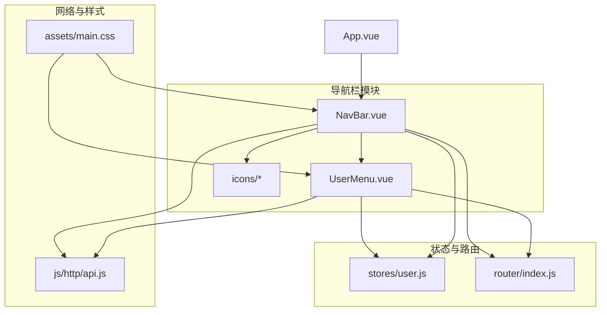
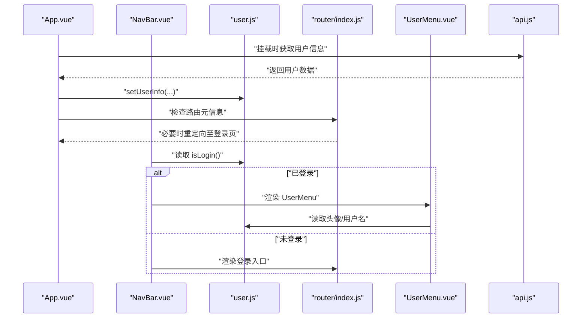
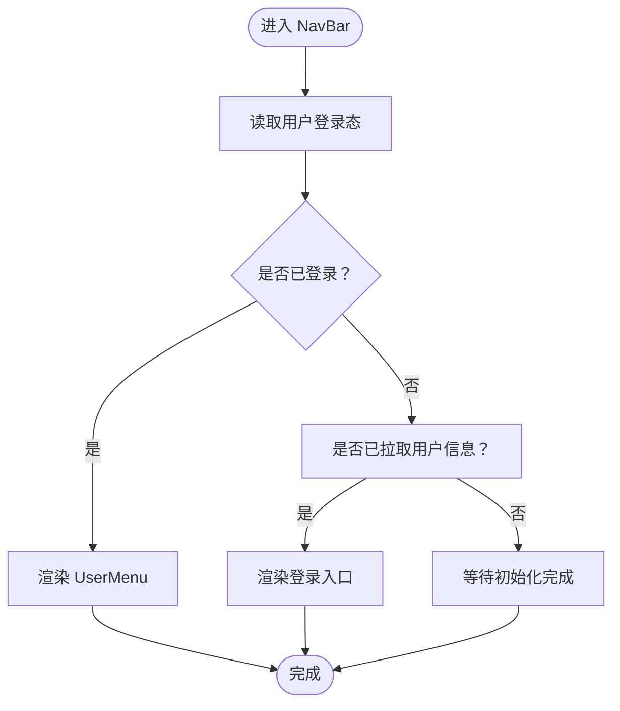
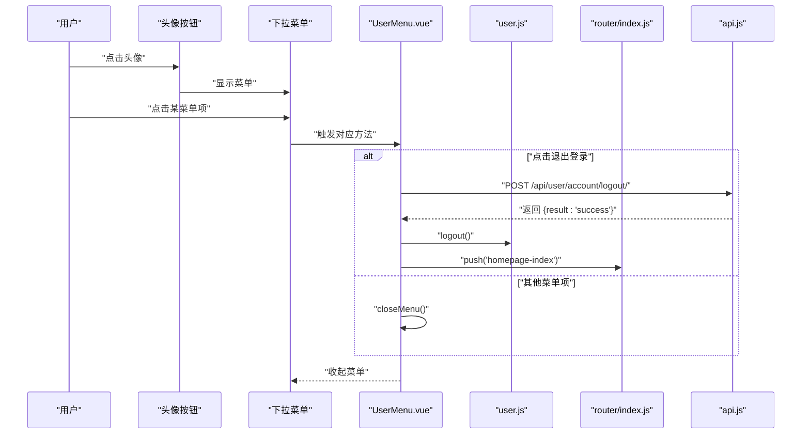
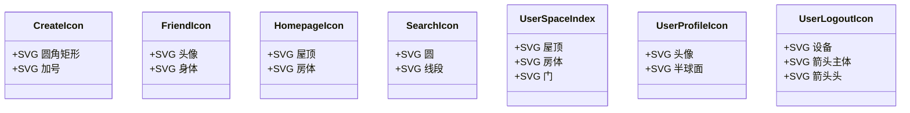
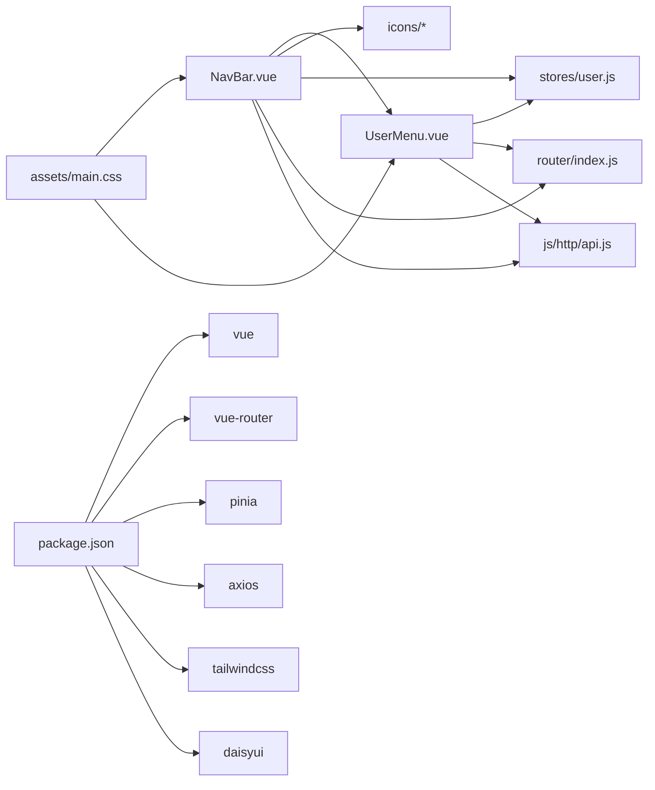

# 导航栏组件

<cite>
**本文引用的文件**
- [NavBar.vue](file://frontend/src/components/navbar/NavBar.vue)
- [UserMenu.vue](file://frontend/src/components/navbar/UserMenu.vue)
- [CreateIcon.vue](file://frontend/src/components/navbar/icons/CreateIcon.vue)
- [FriendIcon.vue](file://frontend/src/components/navbar/icons/FriendIcon.vue)
- [HomepageIcon.vue](file://frontend/src/components/navbar/icons/HomepageIcon.vue)
- [SearchIcon.vue](file://frontend/src/components/navbar/icons/SearchIcon.vue)
- [UserLogoutIcon.vue](file://frontend/src/components/navbar/icons/UserLogoutIcon.vue)
- [UserProfileIcon.vue](file://frontend/src/components/navbar/icons/UserProfileIcon.vue)
- [UserSpaceIndex.vue](file://frontend/src/components/navbar/icons/UserSpaceIndex.vue)
- [user.js](file://frontend/src/stores/user.js)
- [index.js](file://frontend/src/router/index.js)
- [api.js](file://frontend/src/js/http/api.js)
- [main.css](file://frontend/src/assets/main.css)
- [App.vue](file://frontend/src/App.vue)
- [package.json](file://frontend/package.json)
- [vite.config.js](file://frontend/vite.config.js)
</cite>

## 目录
1. [简介](#简介)
2. [项目结构](#项目结构)
3. [核心组件](#核心组件)
4. [架构总览](#架构总览)
5. [详细组件分析](#详细组件分析)
6. [依赖关系分析](#依赖关系分析)
7. [性能考虑](#性能考虑)
8. [故障排查指南](#故障排查指南)
9. [结论](#结论)
10. [附录](#附录)

## 简介
本文件面向 LLM_AIfriends 的前端导航栏组件系统，聚焦 NavBar 组件的整体架构与布局设计，涵盖 Logo 区域、功能导航与用户菜单的实现；深入解析 UserMenu 下拉菜单的功能、用户信息展示、菜单项管理与点击事件处理；阐述导航图标的视觉规范、响应式布局策略与交互状态管理；并提供组件结构图、样式定制指南与可访问性优化建议。

## 项目结构
导航栏组件位于前端 src/components/navbar 目录，采用按功能分层的组织方式：
- 容器组件：NavBar.vue
- 用户菜单：UserMenu.vue
- 图标集合：icons 子目录下的各 SVG 图标组件
- 状态管理：Pinia 用户存储 user.js
- 路由配置：router/index.js
- HTTP 客户端：js/http/api.js
- 样式基础：assets/main.css（Tailwind + daisyUI）
- 应用入口：App.vue

图表来源
- [NavBar.vue:1-77](file://frontend/src/components/navbar/NavBar.vue#L1-L77)
- [UserMenu.vue:1-74](file://frontend/src/components/navbar/UserMenu.vue#L1-L74)
- [user.js:1-53](file://frontend/src/stores/user.js#L1-L53)
- [index.js:1-110](file://frontend/src/router/index.js#L1-L110)
- [api.js:1-93](file://frontend/src/js/http/api.js#L1-L93)
- [main.css:1-3](file://frontend/src/assets/main.css#L1-L3)
- [App.vue:1-41](file://frontend/src/App.vue#L1-L41)

章节来源
- [NavBar.vue:1-77](file://frontend/src/components/navbar/NavBar.vue#L1-L77)
- [UserMenu.vue:1-74](file://frontend/src/components/navbar/UserMenu.vue#L1-L74)
- [user.js:1-53](file://frontend/src/stores/user.js#L1-L53)
- [index.js:1-110](file://frontend/src/router/index.js#L1-L110)
- [api.js:1-93](file://frontend/src/js/http/api.js#L1-L93)
- [main.css:1-3](file://frontend/src/assets/main.css#L1-L3)
- [App.vue:1-41](file://frontend/src/App.vue#L1-L41)

## 核心组件
- NavBar：主导航容器，负责抽屉式侧边栏、顶部导航区（Logo、搜索、功能按钮）与右侧用户菜单的协调。
- UserMenu：用户下拉菜单，展示头像、用户名与菜单项，处理登出等操作。
- 图标组件：统一使用 SVG，遵循一致的尺寸与描边规范，便于主题化与响应式适配。
- Pinia 用户存储：集中管理用户登录态、头像、昵称等信息。
- 路由：定义页面与权限元信息，控制导航可见性与跳转。
- HTTP 客户端：统一注入 Authorization 头，处理 401 自动刷新与重试。

章节来源
- [NavBar.vue:1-77](file://frontend/src/components/navbar/NavBar.vue#L1-L77)
- [UserMenu.vue:1-74](file://frontend/src/components/navbar/UserMenu.vue#L1-L74)
- [user.js:1-53](file://frontend/src/stores/user.js#L1-L53)
- [index.js:1-110](file://frontend/src/router/index.js#L1-L110)
- [api.js:1-93](file://frontend/src/js/http/api.js#L1-L93)

## 架构总览
导航栏系统通过 App.vue 挂载 NavBar，NavBar 内部根据用户登录态动态渲染不同内容：
- 未登录时显示“创作”入口（仅登录后可见）与“登录”按钮
- 已登录时显示 UserMenu
- 侧边栏抽屉通过 drawer-toggle 控制开关，支持移动端与桌面端的响应式行为

图表来源
- [App.vue:12-29](file://frontend/src/App.vue#L12-L29)
- [NavBar.vue:10-42](file://frontend/src/components/navbar/NavBar.vue#L10-L42)
- [user.js:12-14](file://frontend/src/stores/user.js#L12-L14)
- [index.js:99-107](file://frontend/src/router/index.js#L99-L107)
- [UserMenu.vue:9-10](file://frontend/src/components/navbar/UserMenu.vue#L9-L10)
- [api.js:14-19](file://frontend/src/js/http/api.js#L14-L19)

## 详细组件分析

### NavBar 组件
- 布局结构
  - 抽屉容器：使用 drawer-toggle 控制侧边栏开合，结合 drawer-side 实现滑入式菜单
  - 顶部导航区：左侧为菜单按钮与品牌名；中部为搜索输入与按钮；右侧为功能入口与用户菜单
  - 侧边栏菜单：包含首页、好友、创作三个入口，支持 tooltip 提示与激活态样式
- 条件渲染
  - “创作”入口仅在用户已登录时显示
  - “登录”入口在用户信息已拉取但未登录时显示
  - 已登录时渲染 UserMenu
- 响应式设计
  - 使用 Tailwind/daisyUI 的断点类与工具类实现不同屏幕下的布局切换
  - 侧边栏在关闭时以图标+tooltip 形式呈现，打开时显示完整文本

图表来源
- [NavBar.vue:10-42](file://frontend/src/components/navbar/NavBar.vue#L10-L42)
- [user.js:12-14](file://frontend/src/stores/user.js#L12-L14)
- [App.vue:12-29](file://frontend/src/App.vue#L12-L29)

章节来源
- [NavBar.vue:1-77](file://frontend/src/components/navbar/NavBar.vue#L1-L77)
- [App.vue:12-29](file://frontend/src/App.vue#L12-L29)
- [user.js:12-14](file://frontend/src/stores/user.js#L12-L14)

### UserMenu 组件
- 结构组成
  - 触发元素：圆形头像按钮，点击展开下拉菜单
  - 下拉菜单：包含用户头像与昵称、个人空间、编辑资料、退出登录等条目
- 数据来源
  - 从 Pinia 用户存储读取头像与用户名
- 行为逻辑
  - 关闭菜单：通过 blur 当前活动元素，确保键盘/焦点可预期
  - 登出流程：调用后端登出接口，成功后清空本地登录态并跳转首页
- 交互细节
  - 菜单项点击时调用 closeMenu，保证点击后菜单收起
  - 退出登录使用异步处理，错误时静默忽略，避免阻塞

图表来源
- [UserMenu.vue:12-28](file://frontend/src/components/navbar/UserMenu.vue#L12-L28)
- [UserMenu.vue:32-69](file://frontend/src/components/navbar/UserMenu.vue#L32-L69)
- [user.js:27-33](file://frontend/src/stores/user.js#L27-L33)
- [index.js:72-87](file://frontend/src/router/index.js#L72-L87)
- [api.js:16-19](file://frontend/src/js/http/api.js#L16-L19)

章节来源
- [UserMenu.vue:1-74](file://frontend/src/components/navbar/UserMenu.vue#L1-L74)
- [user.js:27-33](file://frontend/src/stores/user.js#L27-L33)
- [index.js:72-87](file://frontend/src/router/index.js#L72-L87)
- [api.js:16-19](file://frontend/src/js/http/api.js#L16-L19)

### 导航图标设计规范
- 统一规范
  - 所有图标均为 SVG，使用一致的 viewBox 与描边属性，确保缩放清晰
  - 尺寸约定：inline-block size-6 或 w-5/h-5，便于与文字对齐
  - 描边：stroke="currentColor"，配合 daisyUI 主题色实现风格一致
- 典型图标
  - CreateIcon：圆角矩形容器与十字加号，传达“新增/创作”
  - FriendIcon：头像与身体组合，表达“好友”概念
  - HomepageIcon：房屋轮廓，代表“首页”
  - SearchIcon：放大镜与线条，强调“搜索”
  - UserSpaceIndex：房屋与门，指向“个人空间”
  - UserProfileIcon：头像与半球面，表示“资料”
  - UserLogoutIcon：箭头与设备轮廓，示意“退出”

图表来源
- [CreateIcon.vue:6-21](file://frontend/src/components/navbar/icons/CreateIcon.vue#L6-L21)
- [FriendIcon.vue:6-20](file://frontend/src/components/navbar/icons/FriendIcon.vue#L6-L20)
- [HomepageIcon.vue:6-17](file://frontend/src/components/navbar/icons/HomepageIcon.vue#L6-L17)
- [SearchIcon.vue:6-17](file://frontend/src/components/navbar/icons/SearchIcon.vue#L6-L17)
- [UserSpaceIndex.vue:6-33](file://frontend/src/components/navbar/icons/UserSpaceIndex.vue#L6-L33)
- [UserProfileIcon.vue:6-23](file://frontend/src/components/navbar/icons/UserProfileIcon.vue#L6-L23)
- [UserLogoutIcon.vue:6-33](file://frontend/src/components/navbar/icons/UserLogoutIcon.vue#L6-L33)

章节来源
- [CreateIcon.vue:1-26](file://frontend/src/components/navbar/icons/CreateIcon.vue#L1-L26)
- [FriendIcon.vue:1-25](file://frontend/src/components/navbar/icons/FriendIcon.vue#L1-L25)
- [HomepageIcon.vue:1-22](file://frontend/src/components/navbar/icons/HomepageIcon.vue#L1-L22)
- [SearchIcon.vue:1-22](file://frontend/src/components/navbar/icons/SearchIcon.vue#L1-L22)
- [UserSpaceIndex.vue:1-39](file://frontend/src/components/navbar/icons/UserSpaceIndex.vue#L1-L39)
- [UserProfileIcon.vue:1-29](file://frontend/src/components/navbar/icons/UserProfileIcon.vue#L1-L29)
- [UserLogoutIcon.vue:1-39](file://frontend/src/components/navbar/icons/UserLogoutIcon.vue#L1-L39)

### 响应式布局与交互状态
- 抽屉与侧边栏
  - drawer-toggle 控制抽屉开关；drawer-side 在关闭时宽度收窄，仅显示图标与 tooltip
  - 打开时显示完整菜单项与文本，提升可读性
- 顶部导航
  - 中部搜索区域在大屏下保持宽度，小屏下自适应
  - 右侧功能入口与用户菜单在小屏下仍保持紧凑
- 交互状态
  - RouterLink 的 active-class 用于高亮当前页面
  - menu-focus 用于侧边栏菜单的激活态
  - tooltip 在关闭状态下通过工具类隐藏文本，仅保留图标提示

章节来源
- [NavBar.vue:14-72](file://frontend/src/components/navbar/NavBar.vue#L14-L72)
- [index.js:15-96](file://frontend/src/router/index.js#L15-L96)

## 依赖关系分析
- 组件耦合
  - NavBar 依赖 UserMenu 与多个图标组件；依赖 Pinia 用户存储与路由
  - UserMenu 依赖 Pinia 用户存储、路由与 HTTP 客户端
- 外部依赖
  - Vue 3、Vue Router、Pinia、Axios、TailwindCSS、daisyUI
- 构建与打包
  - Vite 打包输出至 Django static 目录，便于后端统一托管

图表来源
- [NavBar.vue:1-11](file://frontend/src/components/navbar/NavBar.vue#L1-L11)
- [UserMenu.vue:1-10](file://frontend/src/components/navbar/UserMenu.vue#L1-L10)
- [user.js:1-53](file://frontend/src/stores/user.js#L1-L53)
- [index.js:1-110](file://frontend/src/router/index.js#L1-L110)
- [api.js:1-93](file://frontend/src/js/http/api.js#L1-L93)
- [main.css:1-3](file://frontend/src/assets/main.css#L1-L3)
- [package.json:14-28](file://frontend/package.json#L14-L28)

章节来源
- [package.json:14-28](file://frontend/package.json#L14-L28)
- [vite.config.js:10-25](file://frontend/vite.config.js#L10-L25)

## 性能考虑
- 渲染优化
  - 条件渲染减少不必要的 DOM 节点生成（如未登录时不渲染 UserMenu）
  - 图标为轻量 SVG，避免额外资源加载
- 状态管理
  - Pinia 存储集中管理用户信息，避免跨组件重复请求
- 网络请求
  - Axios 自动注入 Authorization，减少重复代码
  - 401 自动刷新机制降低手动处理复杂度
- 样式与构建
  - Tailwind 与 daisyUI 按需使用，避免全量引入导致体积膨胀
  - Vite 构建输出至后端静态目录，减少前后端分离部署复杂度

## 故障排查指南
- 登录态异常
  - 现象：导航未正确显示“创作”或“登录”
  - 排查：确认 App.vue 初始化时是否成功设置用户信息与 hasPulledUserInfo 状态
  - 参考路径：[App.vue:12-29](file://frontend/src/App.vue#L12-L29)，[user.js:20-37](file://frontend/src/stores/user.js#L20-L37)
- 登出后未跳转
  - 现象：点击退出登录无反应或仍在当前页面
  - 排查：检查 api.js 的登出接口返回值与 UserMenu 的路由跳转逻辑
  - 参考路径：[UserMenu.vue:17-28](file://frontend/src/components/navbar/UserMenu.vue#L17-L28)，[api.js:16-19](file://frontend/src/js/http/api.js#L16-L19)
- 侧边栏无法关闭
  - 现象：抽屉无法通过遮罩层关闭
  - 排查：确认 drawer-overlay 的 label 与 for 属性绑定是否正确
  - 参考路径：[NavBar.vue:47-49](file://frontend/src/components/navbar/NavBar.vue#L47-L49)
- 图标显示异常
  - 现象：图标模糊或颜色不一致
  - 排查：确认 SVG 的 stroke、fill 与 daisyUI 主题色一致
  - 参考路径：[HomepageIcon.vue:6-17](file://frontend/src/components/navbar/icons/HomepageIcon.vue#L6-L17)，[main.css:1-3](file://frontend/src/assets/main.css#L1-L3)

章节来源
- [App.vue:12-29](file://frontend/src/App.vue#L12-L29)
- [user.js:20-37](file://frontend/src/stores/user.js#L20-L37)
- [UserMenu.vue:17-28](file://frontend/src/components/navbar/UserMenu.vue#L17-L28)
- [api.js:16-19](file://frontend/src/js/http/api.js#L16-L19)
- [NavBar.vue:47-49](file://frontend/src/components/navbar/NavBar.vue#L47-L49)
- [HomepageIcon.vue:6-17](file://frontend/src/components/navbar/icons/HomepageIcon.vue#L6-L17)
- [main.css:1-3](file://frontend/src/assets/main.css#L1-L3)

## 结论
导航栏组件通过清晰的职责划分与一致的图标规范，实现了良好的可维护性与可扩展性。UserMenu 提供了完整的用户操作入口，NavBar 则承担了布局与状态协调的核心角色。结合 Pinia、Vue Router 与 daisyUI，系统在功能与体验上达到了较好的平衡。后续可在可访问性、国际化与主题切换方面进一步增强。

## 附录

### 样式定制指南
- 主题色
  - 通过 daisyUI 的主题变量覆盖全局主色与背景色，确保图标与按钮与主题一致
  - 参考路径：[main.css:1-3](file://frontend/src/assets/main.css#L1-L3)
- 尺寸与间距
  - 使用 Tailwind 的尺寸与间距工具类统一图标、按钮与菜单项的大小与间距
- 响应式断点
  - 使用 is-drawer-close 与 is-drawer-open 类在不同状态切换显示内容
  - 参考路径：[NavBar.vue:49-54](file://frontend/src/components/navbar/NavBar.vue#L49-L54)

章节来源
- [main.css:1-3](file://frontend/src/assets/main.css#L1-L3)
- [NavBar.vue:49-54](file://frontend/src/components/navbar/NavBar.vue#L49-L54)

### 可访问性优化建议
- 键盘导航
  - 为下拉菜单与抽屉添加键盘焦点管理，支持 Tab/Shift+Tab 切换与 Esc 关闭
- 屏幕阅读器
  - 为图标添加 aria-label 或 role="img" 与描述，确保语义清晰
  - 参考路径：[SearchIcon.vue:10-11](file://frontend/src/components/navbar/icons/SearchIcon.vue#L10-L11)
- 对比度与颜色
  - 确保文本与背景满足对比度要求，避免仅依赖颜色传达状态
- 点击区域
  - 适当增大按钮与菜单项的可点击区域，提升移动端可用性

章节来源
- [SearchIcon.vue:10-11](file://frontend/src/components/navbar/icons/SearchIcon.vue#L10-L11)