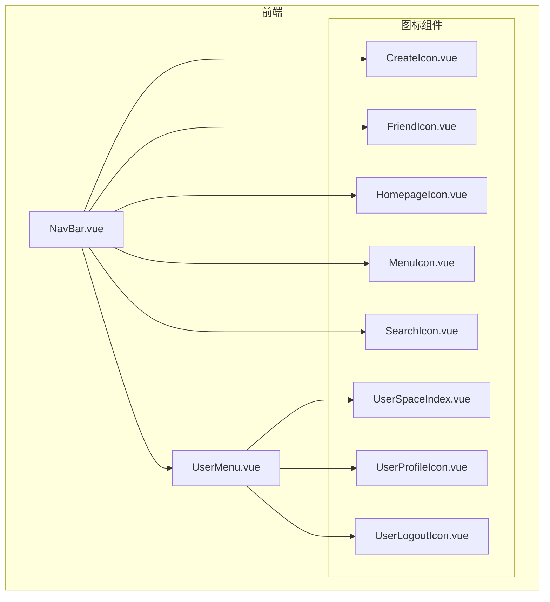
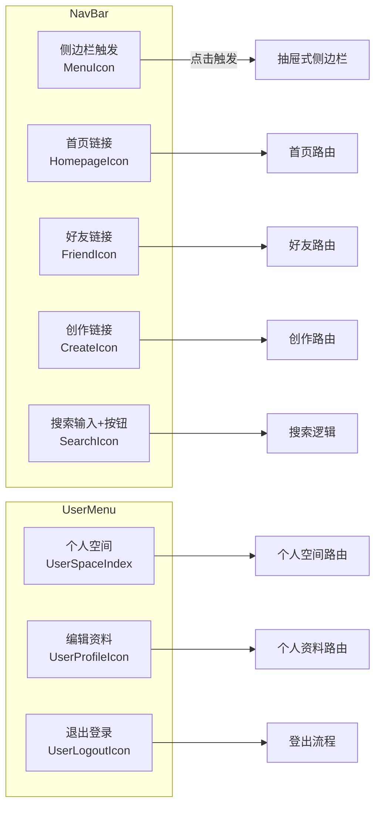
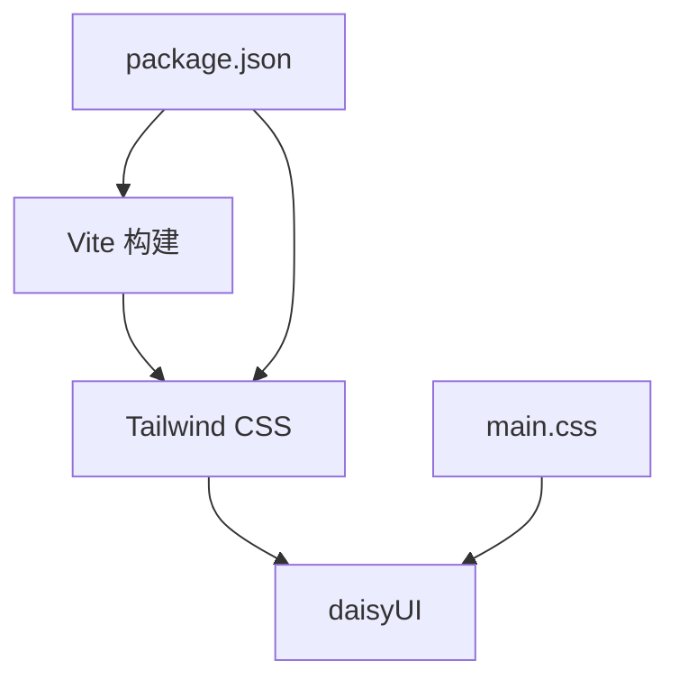

# 菜单图标

<cite>
**本文引用的文件**
- [frontend/src/components/navbar/icons/CreateIcon.vue](file://frontend/src/components/navbar/icons/CreateIcon.vue)
- [frontend/src/components/navbar/icons/FriendIcon.vue](file://frontend/src/components/navbar/icons/FriendIcon.vue)
- [frontend/src/components/navbar/icons/HomepageIcon.vue](file://frontend/src/components/navbar/icons/HomepageIcon.vue)
- [frontend/src/components/navbar/icons/MenuIcon.vue](file://frontend/src/components/navbar/icons/MenuIcon.vue)
- [frontend/src/components/navbar/icons/SearchIcon.vue](file://frontend/src/components/navbar/icons/SearchIcon.vue)
- [frontend/src/components/navbar/icons/UserLogoutIcon.vue](file://frontend/src/components/navbar/icons/UserLogoutIcon.vue)
- [frontend/src/components/navbar/icons/UserProfileIcon.vue](file://frontend/src/components/navbar/icons/UserProfileIcon.vue)
- [frontend/src/components/navbar/icons/UserSpaceIndex.vue](file://frontend/src/components/navbar/icons/UserSpaceIndex.vue)
- [frontend/src/components/navbar/NavBar.vue](file://frontend/src/components/navbar/NavBar.vue)
- [frontend/src/components/navbar/UserMenu.vue](file://frontend/src/components/navbar/UserMenu.vue)
- [frontend/src/assets/main.css](file://frontend/src/assets/main.css)
- [frontend/package.json](file://frontend/package.json)
- [frontend/vite.config.js](file://frontend/vite.config.js)
</cite>

## 目录
1. [简介](#简介)
2. [项目结构](#项目结构)
3. [核心组件](#核心组件)
4. [架构总览](#架构总览)
5. [详细组件分析](#详细组件分析)
6. [依赖关系分析](#依赖关系分析)
7. [性能考虑](#性能考虑)
8. [故障排查指南](#故障排查指南)
9. [结论](#结论)
10. [附录](#附录)

## 简介
本文件面向 LLM_AIfriends 的菜单图标系统，聚焦于前端导航与用户菜单中使用的 SVG 图标组件，包括 CreateIcon、FriendIcon、HomepageIcon、MenuIcon、SearchIcon、UserLogoutIcon、UserProfileIcon、UserSpaceIndex 等。文档从设计规范（尺寸、颜色主题）、实现方式（SVG 基本形状组合、语义化属性）、交互行为（悬停、激活态）以及在 NavBar 与 UserMenu 中的集成方式展开，并提供自定义图标添加指南与性能优化建议。

## 项目结构
图标组件集中位于导航栏模块的 icons 子目录，配合 NavBar 与 UserMenu 组件共同完成菜单渲染与交互；样式由 Tailwind CSS 与 daisyUI 提供基础能力，构建打包通过 Vite 配置输出至后端静态资源目录。

图表来源
- [frontend/src/components/navbar/NavBar.vue:1-77](file://frontend/src/components/navbar/NavBar.vue#L1-L77)
- [frontend/src/components/navbar/UserMenu.vue:1-74](file://frontend/src/components/navbar/UserMenu.vue#L1-L74)
- [frontend/src/components/navbar/icons/CreateIcon.vue:1-26](file://frontend/src/components/navbar/icons/CreateIcon.vue#L1-L26)
- [frontend/src/components/navbar/icons/FriendIcon.vue:1-25](file://frontend/src/components/navbar/icons/FriendIcon.vue#L1-L25)
- [frontend/src/components/navbar/icons/HomepageIcon.vue:1-22](file://frontend/src/components/navbar/icons/HomepageIcon.vue#L1-L22)
- [frontend/src/components/navbar/icons/MenuIcon.vue:1-17](file://frontend/src/components/navbar/icons/MenuIcon.vue#L1-L17)
- [frontend/src/components/navbar/icons/SearchIcon.vue:1-22](file://frontend/src/components/navbar/icons/SearchIcon.vue#L1-L22)
- [frontend/src/components/navbar/icons/UserLogoutIcon.vue:1-39](file://frontend/src/components/navbar/icons/UserLogoutIcon.vue#L1-L39)
- [frontend/src/components/navbar/icons/UserProfileIcon.vue:1-29](file://frontend/src/components/navbar/icons/UserProfileIcon.vue#L1-L29)
- [frontend/src/components/navbar/icons/UserSpaceIndex.vue:1-39](file://frontend/src/components/navbar/icons/UserSpaceIndex.vue#L1-L39)

章节来源
- [frontend/src/components/navbar/NavBar.vue:1-77](file://frontend/src/components/navbar/NavBar.vue#L1-L77)
- [frontend/src/components/navbar/UserMenu.vue:1-74](file://frontend/src/components/navbar/UserMenu.vue#L1-L74)

## 核心组件
- CreateIcon：用于“创作”入口，采用圆角矩形容器与十字加号构成，适配导航按钮尺寸。
- FriendIcon：以圆形头像与曲线身体表示“好友”，简洁表达社交关系。
- HomepageIcon：以房屋与台阶路径表达“首页”，强调站点入口。
- MenuIcon：三条横线构成汉堡菜单，用于移动端抽屉式侧边栏触发。
- SearchIcon：放大镜与箭头元素组合，强调搜索意图。
- UserLogoutIcon：左侧设备与右侧箭头组合，表达登出动作。
- UserProfileIcon：头像与半环轮廓，表达“个人资料”。
- UserSpaceIndex：房屋屋顶、墙体与门的组合，表达“个人空间”。

章节来源
- [frontend/src/components/navbar/icons/CreateIcon.vue:1-26](file://frontend/src/components/navbar/icons/CreateIcon.vue#L1-L26)
- [frontend/src/components/navbar/icons/FriendIcon.vue:1-25](file://frontend/src/components/navbar/icons/FriendIcon.vue#L1-L25)
- [frontend/src/components/navbar/icons/HomepageIcon.vue:1-22](file://frontend/src/components/navbar/icons/HomepageIcon.vue#L1-L22)
- [frontend/src/components/navbar/icons/MenuIcon.vue:1-17](file://frontend/src/components/navbar/icons/MenuIcon.vue#L1-L17)
- [frontend/src/components/navbar/icons/SearchIcon.vue:1-22](file://frontend/src/components/navbar/icons/SearchIcon.vue#L1-L22)
- [frontend/src/components/navbar/icons/UserLogoutIcon.vue:1-39](file://frontend/src/components/navbar/icons/UserLogoutIcon.vue#L1-L39)
- [frontend/src/components/navbar/icons/UserProfileIcon.vue:1-29](file://frontend/src/components/navbar/icons/UserProfileIcon.vue#L1-L29)
- [frontend/src/components/navbar/icons/UserSpaceIndex.vue:1-39](file://frontend/src/components/navbar/icons/UserSpaceIndex.vue#L1-L39)

## 架构总览
图标系统遵循“组件即 SVG”的轻量设计：每个图标为独立 Vue 单文件组件，内部以 SVG 元素绘制矢量图形，通过类名控制尺寸与对齐，继承父容器的颜色与主题。NavBar 与 UserMenu 在不同场景下按需引入图标，形成统一的视觉语言与交互体验。

图表来源
- [frontend/src/components/navbar/NavBar.vue:13-72](file://frontend/src/components/navbar/NavBar.vue#L13-L72)
- [frontend/src/components/navbar/UserMenu.vue:31-69](file://frontend/src/components/navbar/UserMenu.vue#L31-L69)

## 详细组件分析

### 设计规范与实现要点
- 尺寸与对齐
  - 大多数图标通过类名控制尺寸，如 inline-block size-6 或 w-5 h-5，确保在按钮与菜单项中保持一致的视觉密度。
  - 部分图标使用固定宽高属性（如 SearchIcon 的 width/height），需注意与类名尺寸的一致性。
- 颜色主题
  - 所有图标默认继承父元素的 color 或使用 stroke-current，从而自动适配 daisyUI 主题与悬停状态。
  - 若需要强调或区分，可在父级容器上设置文本或描边颜色类，避免硬编码颜色值。
- 可访问性
  - SearchIcon 显式设置了 role 与 aria-label，便于屏幕阅读器识别。
- 视觉一致性
  - stroke-width、stroke-linecap、stroke-linejoin 在多个图标中保持一致，保证线条风格统一。

章节来源
- [frontend/src/components/navbar/icons/CreateIcon.vue:6-21](file://frontend/src/components/navbar/icons/CreateIcon.vue#L6-L21)
- [frontend/src/components/navbar/icons/FriendIcon.vue:6-20](file://frontend/src/components/navbar/icons/FriendIcon.vue#L6-L20)
- [frontend/src/components/navbar/icons/HomepageIcon.vue:6-17](file://frontend/src/components/navbar/icons/HomepageIcon.vue#L6-L17)
- [frontend/src/components/navbar/icons/MenuIcon.vue:6-12](file://frontend/src/components/navbar/icons/MenuIcon.vue#L6-L12)
- [frontend/src/components/navbar/icons/SearchIcon.vue:6-17](file://frontend/src/components/navbar/icons/SearchIcon.vue#L6-L17)
- [frontend/src/components/navbar/icons/UserLogoutIcon.vue:6-34](file://frontend/src/components/navbar/icons/UserLogoutIcon.vue#L6-L34)
- [frontend/src/components/navbar/icons/UserProfileIcon.vue:6-24](file://frontend/src/components/navbar/icons/UserProfileIcon.vue#L6-L24)
- [frontend/src/components/navbar/icons/UserSpaceIndex.vue:6-34](file://frontend/src/components/navbar/icons/UserSpaceIndex.vue#L6-L34)

### 交互行为与状态
- 悬停与激活
  - NavBar 中的 RouterLink 通过 active-class 控制激活态样式；daisyUI 的按钮与菜单项在 hover/focus 状态下会改变前景色与背景色，图标随父元素继承当前主题色。
  - UserMenu 的菜单项在 hover 时呈现阴影与背景色变化，图标同步获得主题色。
- 抽屉式侧边栏
  - MenuIcon 作为抽屉触发器，点击后侧边栏展开；在收起状态下，菜单项文字隐藏，仅保留图标与工具提示，图标尺寸与布局由响应式类控制。

章节来源
- [frontend/src/components/navbar/NavBar.vue:17-72](file://frontend/src/components/navbar/NavBar.vue#L17-L72)
- [frontend/src/components/navbar/UserMenu.vue:32-69](file://frontend/src/components/navbar/UserMenu.vue#L32-L69)

### 特殊图标功能与交互
- MenuIcon：作为汉堡菜单触发器，承载抽屉开关逻辑；其路径由三条水平线组成，简洁明确。
- SearchIcon：在搜索按钮中作为装饰与语义化元素，配合输入框与搜索逻辑使用。
- UserLogoutIcon、UserProfileIcon、UserSpaceIndex：在用户菜单中分别对应“个人空间”、“编辑资料”、“退出登录”，与路由跳转和 API 请求结合。

章节来源
- [frontend/src/components/navbar/icons/MenuIcon.vue:6-12](file://frontend/src/components/navbar/icons/MenuIcon.vue#L6-L12)
- [frontend/src/components/navbar/icons/SearchIcon.vue:6-17](file://frontend/src/components/navbar/icons/SearchIcon.vue#L6-L17)
- [frontend/src/components/navbar/UserMenu.vue:31-69](file://frontend/src/components/navbar/UserMenu.vue#L31-L69)

### 使用示例与集成
- 在 NavBar 中引入并使用图标：
  - 侧边栏触发：MenuIcon 放置于 label 内，配合 drawer-toggle 实现抽屉切换。
  - 导航链接：HomepageIcon、FriendIcon、CreateIcon 分别绑定到对应路由。
  - 搜索按钮：SearchIcon 与文字组合，配合输入框进行搜索。
- 在 UserMenu 中引入并使用图标：
  - 个人空间、编辑资料、退出登录分别使用 UserSpaceIndex、UserProfileIcon、UserLogoutIcon，并绑定相应路由与事件处理。

章节来源
- [frontend/src/components/navbar/NavBar.vue:1-77](file://frontend/src/components/navbar/NavBar.vue#L1-L77)
- [frontend/src/components/navbar/UserMenu.vue:1-74](file://frontend/src/components/navbar/UserMenu.vue#L1-L74)

### 自定义图标添加指南
- 新建图标组件
  - 在 icons 目录下创建新的 .vue 文件，使用 SVG 元素绘制图形，保持 stroke-width、stroke-linecap、stroke-linejoin 一致。
  - 通过类名控制尺寸（如 size-6、w-5 h-5），并在父容器中设置颜色类以适配主题。
- 集成到页面
  - 在 NavBar 或 UserMenu 中导入新图标组件，并将其嵌入到对应的 RouterLink 或菜单项中。
  - 如需响应式显示，可参考现有类名组合（如 is-drawer-close:tooltip、hidden 文字等）。
- 可访问性
  - 对于非装饰性图标，建议添加 role 与 aria-label，提升可访问性。

章节来源
- [frontend/src/components/navbar/icons/CreateIcon.vue:6-21](file://frontend/src/components/navbar/icons/CreateIcon.vue#L6-L21)
- [frontend/src/components/navbar/icons/SearchIcon.vue:6-17](file://frontend/src/components/navbar/icons/SearchIcon.vue#L6-L17)
- [frontend/src/components/navbar/NavBar.vue:1-77](file://frontend/src/components/navbar/NavBar.vue#L1-L77)
- [frontend/src/components/navbar/UserMenu.vue:1-74](file://frontend/src/components/navbar/UserMenu.vue#L1-L74)

## 依赖关系分析
- 构建与样式
  - 项目使用 Vite 进行构建，Tailwind CSS 与 daisyUI 作为样式框架，main.css 引入 daisyui 插件。
  - package.json 指定依赖版本，确保图标主题与按钮、菜单等 UI 组件协同工作。
- 组件间耦合
  - NavBar 与 UserMenu 通过路由与状态管理（Pinia）解耦，图标作为纯展示组件，耦合度低，易于维护与扩展。

图表来源
- [frontend/vite.config.js:10-15](file://frontend/vite.config.js#L10-L15)
- [frontend/src/assets/main.css:1-3](file://frontend/src/assets/main.css#L1-L3)
- [frontend/package.json:14-29](file://frontend/package.json#L14-L29)

章节来源
- [frontend/vite.config.js:1-26](file://frontend/vite.config.js#L1-L26)
- [frontend/src/assets/main.css:1-3](file://frontend/src/assets/main.css#L1-L3)
- [frontend/package.json:1-30](file://frontend/package.json#L1-L30)

## 性能考虑
- 图标体积与加载
  - 所有图标为内联 SVG，无额外网络请求，减少 HTTP 开销。
  - 建议保持路径简洁，避免过度复杂的路径与过多分组，以降低渲染复杂度。
- 渲染与主题
  - 使用 stroke-current 与 daisyUI 类，避免重复计算颜色，提升主题切换时的渲染效率。
- 响应式与布局
  - 合理使用尺寸类与响应式类，避免在小屏时出现不必要的重排与重绘。
- 打包与缓存
  - 通过 Vite 构建输出到后端静态目录，配合浏览器缓存策略，提升二次加载性能。

## 故障排查指南
- 图标颜色异常
  - 检查父容器是否正确设置颜色类，确认未被局部样式覆盖。
- 图标尺寸不一致
  - 统一使用 size-* 或 w-/h- 类，避免混用 width/height 属性与类名。
- 可访问性问题
  - 对非装饰性图标补充 role 与 aria-label，确保辅助技术可读取。
- 交互无效
  - 确认 RouterLink 的 to 与命名路由一致，检查 active-class 是否生效。
- 主题不匹配
  - 确保 daisyUI 已正确引入，且未被自定义样式覆盖。

章节来源
- [frontend/src/components/navbar/icons/SearchIcon.vue:6-17](file://frontend/src/components/navbar/icons/SearchIcon.vue#L6-L17)
- [frontend/src/components/navbar/NavBar.vue:17-72](file://frontend/src/components/navbar/NavBar.vue#L17-L72)
- [frontend/src/assets/main.css:1-3](file://frontend/src/assets/main.css#L1-L3)

## 结论
本菜单图标系统以“组件即 SVG”的方式实现，具备良好的可维护性与可扩展性。通过统一的尺寸、颜色与可访问性规范，结合 NavBar 与 UserMenu 的集成，形成一致的用户体验。建议在新增图标时遵循现有规范，确保主题与交互的一致性，并关注性能与可访问性细节。

## 附录
- 关键实现位置索引
  - CreateIcon：[frontend/src/components/navbar/icons/CreateIcon.vue:1-26](file://frontend/src/components/navbar/icons/CreateIcon.vue#L1-L26)
  - FriendIcon：[frontend/src/components/navbar/icons/FriendIcon.vue:1-25](file://frontend/src/components/navbar/icons/FriendIcon.vue#L1-L25)
  - HomepageIcon：[frontend/src/components/navbar/icons/HomepageIcon.vue:1-22](file://frontend/src/components/navbar/icons/HomepageIcon.vue#L1-L22)
  - MenuIcon：[frontend/src/components/navbar/icons/MenuIcon.vue:1-17](file://frontend/src/components/navbar/icons/MenuIcon.vue#L1-L17)
  - SearchIcon：[frontend/src/components/navbar/icons/SearchIcon.vue:1-22](file://frontend/src/components/navbar/icons/SearchIcon.vue#L1-L22)
  - UserLogoutIcon：[frontend/src/components/navbar/icons/UserLogoutIcon.vue:1-39](file://frontend/src/components/navbar/icons/UserLogoutIcon.vue#L1-L39)
  - UserProfileIcon：[frontend/src/components/navbar/icons/UserProfileIcon.vue:1-29](file://frontend/src/components/navbar/icons/UserProfileIcon.vue#L1-L29)
  - UserSpaceIndex：[frontend/src/components/navbar/icons/UserSpaceIndex.vue:1-39](file://frontend/src/components/navbar/icons/UserSpaceIndex.vue#L1-L39)
  - NavBar：[frontend/src/components/navbar/NavBar.vue:1-77](file://frontend/src/components/navbar/NavBar.vue#L1-L77)
  - UserMenu：[frontend/src/components/navbar/UserMenu.vue:1-74](file://frontend/src/components/navbar/UserMenu.vue#L1-L74)
  - 样式与构建：[frontend/src/assets/main.css:1-3](file://frontend/src/assets/main.css#L1-L3)，[frontend/package.json:1-30](file://frontend/package.json#L1-L30)，[frontend/vite.config.js:1-26](file://frontend/vite.config.js#L1-L26)