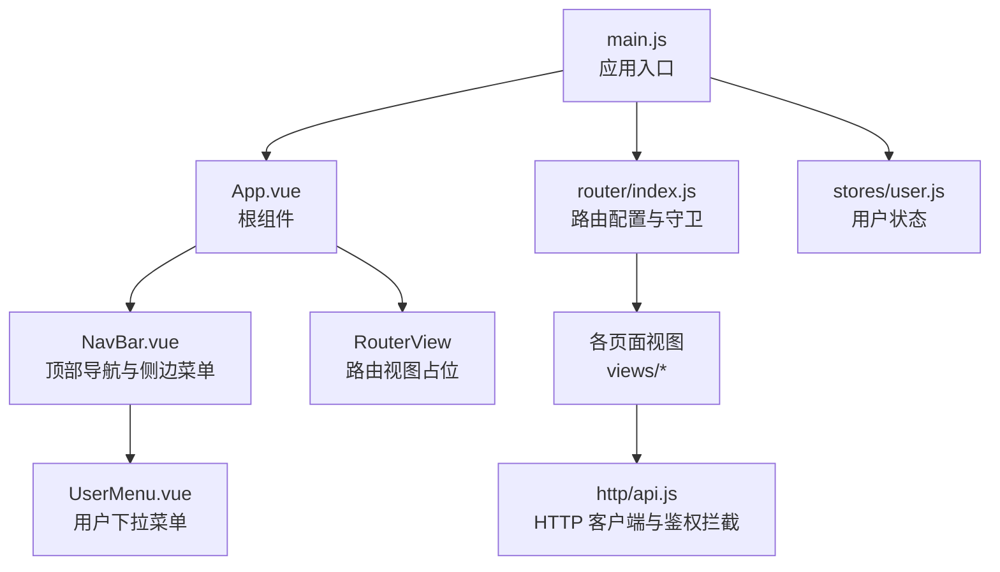
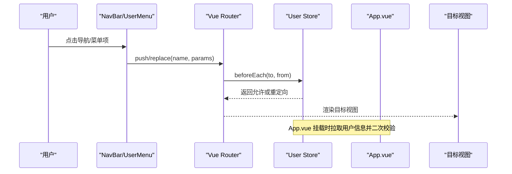
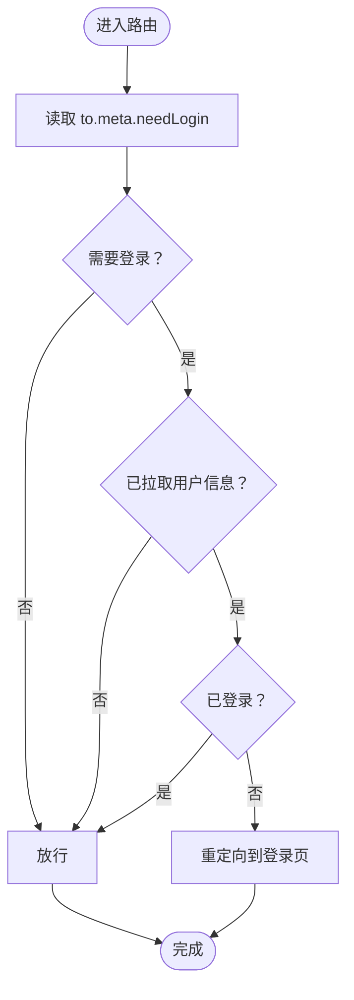
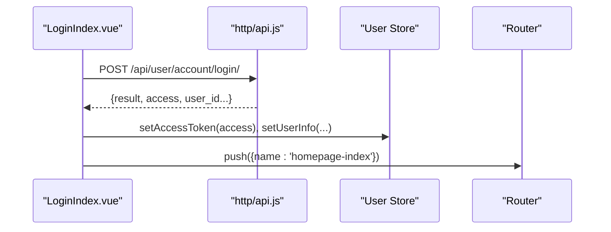
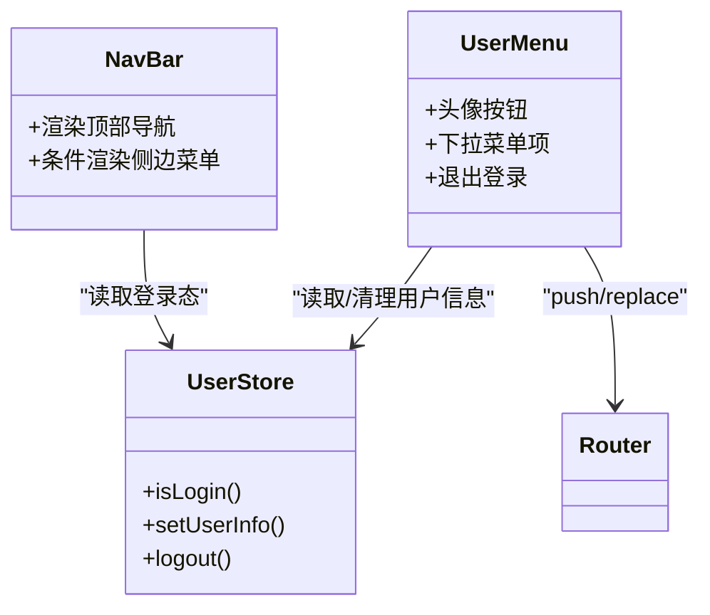
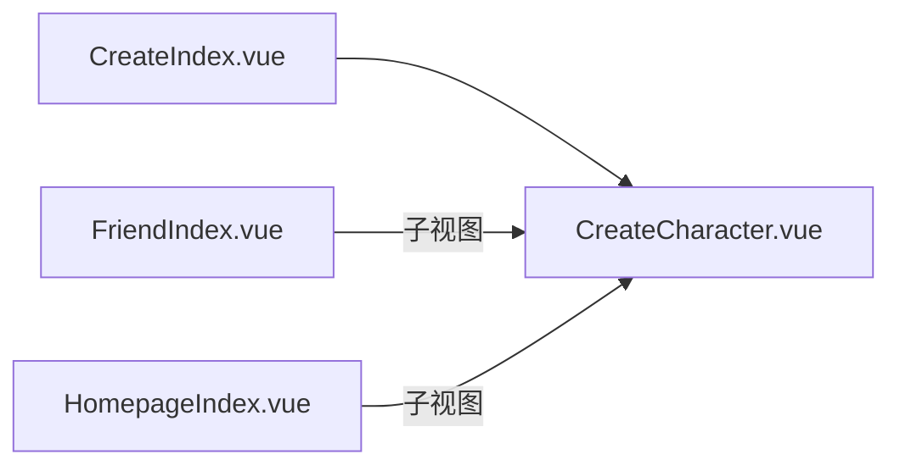
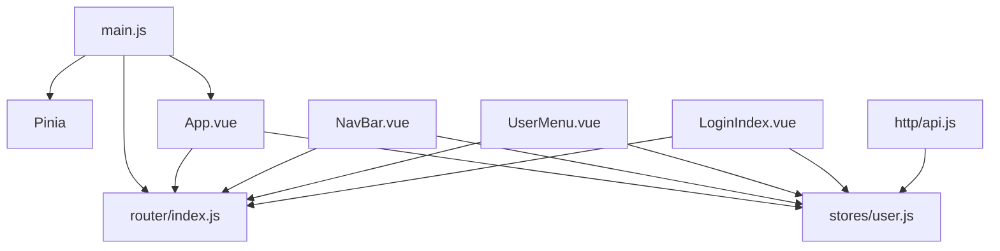
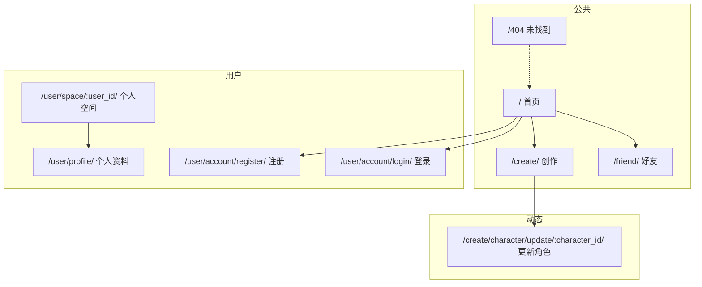

# 路由与导航

<cite>
**本文引用的文件**
- [frontend/src/router/index.js](file://frontend/src/router/index.js)
- [frontend/src/main.js](file://frontend/src/main.js)
- [frontend/src/App.vue](file://frontend/src/App.vue)
- [frontend/package.json](file://frontend/package.json)
- [frontend/vite.config.js](file://frontend/vite.config.js)
- [frontend/src/stores/user.js](file://frontend/src/stores/user.js)
- [frontend/src/components/navbar/NavBar.vue](file://frontend/src/components/navbar/NavBar.vue)
- [frontend/src/components/navbar/UserMenu.vue](file://frontend/src/components/navbar/UserMenu.vue)
- [frontend/src/views/user/account/LoginIndex.vue](file://frontend/src/views/user/account/LoginIndex.vue)
- [frontend/src/views/user/account/RegisterIndex.vue](file://frontend/src/views/user/account/RegisterIndex.vue)
- [frontend/src/js/http/api.js](file://frontend/src/js/http/api.js)
- [frontend/src/views/homepage/HomepageIndex.vue](file://frontend/src/views/homepage/HomepageIndex.vue)
- [frontend/src/views/friend/FriendIndex.vue](file://frontend/src/views/friend/FriendIndex.vue)
- [frontend/src/views/create/CreateIndex.vue](file://frontend/src/views/create/CreateIndex.vue)
- [frontend/src/views/error/NotFoundIndex.vue](file://frontend/src/views/error/NotFoundIndex.vue)
</cite>

## 目录
1. [简介](#简介)
2. [项目结构](#项目结构)
3. [核心组件](#核心组件)
4. [架构总览](#架构总览)
5. [详细组件分析](#详细组件分析)
6. [依赖关系分析](#依赖关系分析)
7. [性能考虑](#性能考虑)
8. [故障排查指南](#故障排查指南)
9. [结论](#结论)
10. [附录](#附录)

## 简介
本文件面向 LLM_AIfriends 的前端路由与导航系统，围绕 Vue Router 4 的配置与使用展开，重点覆盖以下方面：
- 路由定义与嵌套路由组织
- 导航守卫与页面权限控制
- 动态路由参数与路径匹配
- 导航菜单生成与面包屑思路
- 路由懒加载与预加载策略建议
- SEO 优化与可访问性建议
- 用户体验优化与扩展指南

## 项目结构
前端采用 Vite + Vue 3 + Pinia + Vue Router 的组合，路由集中于 router/index.js，应用入口在 main.js 中挂载，全局状态通过 Pinia 的 user store 管理登录态，导航栏组件负责菜单与用户操作入口。

图表来源
- [frontend/src/main.js:1-15](file://frontend/src/main.js#L1-L15)
- [frontend/src/App.vue:1-41](file://frontend/src/App.vue#L1-L41)
- [frontend/src/router/index.js:1-110](file://frontend/src/router/index.js#L1-L110)
- [frontend/src/stores/user.js:1-53](file://frontend/src/stores/user.js#L1-L53)
- [frontend/src/components/navbar/NavBar.vue:1-77](file://frontend/src/components/navbar/NavBar.vue#L1-L77)
- [frontend/src/components/navbar/UserMenu.vue:1-74](file://frontend/src/components/navbar/UserMenu.vue#L1-L74)
- [frontend/src/js/http/api.js:1-93](file://frontend/src/js/http/api.js#L1-L93)

章节来源
- [frontend/src/main.js:1-15](file://frontend/src/main.js#L1-L15)
- [frontend/src/router/index.js:1-110](file://frontend/src/router/index.js#L1-L110)
- [frontend/src/App.vue:1-41](file://frontend/src/App.vue#L1-L41)

## 核心组件
- 路由器与路由表：在 router/index.js 中定义历史模式、路由表与全局前置守卫，统一管理页面权限与跳转。
- 应用入口：main.js 将 Pinia 与 Router 注入应用实例。
- 根组件：App.vue 在挂载时拉取用户信息并进行二次校验，避免重复登录导致的跳转循环。
- 用户状态：stores/user.js 提供登录态、用户信息与登出逻辑。
- 导航组件：NavBar.vue 与 UserMenu.vue 组成顶部导航与侧边菜单，根据登录态显示不同入口。
- 认证与拦截：http/api.js 为所有请求注入 Bearer Token，并处理 401 自动刷新与失败回退。

章节来源
- [frontend/src/router/index.js:1-110](file://frontend/src/router/index.js#L1-L110)
- [frontend/src/main.js:1-15](file://frontend/src/main.js#L1-L15)
- [frontend/src/App.vue:1-41](file://frontend/src/App.vue#L1-L41)
- [frontend/src/stores/user.js:1-53](file://frontend/src/stores/user.js#L1-L53)
- [frontend/src/components/navbar/NavBar.vue:1-77](file://frontend/src/components/navbar/NavBar.vue#L1-L77)
- [frontend/src/components/navbar/UserMenu.vue:1-74](file://frontend/src/components/navbar/UserMenu.vue#L1-L74)
- [frontend/src/js/http/api.js:1-93](file://frontend/src/js/http/api.js#L1-L93)

## 架构总览
下图展示从用户交互到路由切换、权限校验与视图渲染的整体流程。

图表来源
- [frontend/src/components/navbar/NavBar.vue:1-77](file://frontend/src/components/navbar/NavBar.vue#L1-L77)
- [frontend/src/components/navbar/UserMenu.vue:1-74](file://frontend/src/components/navbar/UserMenu.vue#L1-L74)
- [frontend/src/router/index.js:99-107](file://frontend/src/router/index.js#L99-L107)
- [frontend/src/App.vue:12-29](file://frontend/src/App.vue#L12-L29)

## 详细组件分析

### 路由配置与导航守卫
- 历史模式与基础路径：使用 createWebHistory 并基于 import.meta.env.BASE_URL。
- 路由表结构：包含首页、好友、创作、用户空间、个人资料、登录、注册以及通配符 404。
- 权限标记：每个路由 meta.needLogin 控制是否需要登录；全局 beforeEach 对需要登录的路由进行校验。
- 动态路由：用户空间路由携带 user_id 参数；角色更新路由携带 character_id 参数。
- 通配符兜底：将未匹配路径统一导向 404 视图。

图表来源
- [frontend/src/router/index.js:99-107](file://frontend/src/router/index.js#L99-L107)
- [frontend/src/App.vue:23-27](file://frontend/src/App.vue#L23-L27)

章节来源
- [frontend/src/router/index.js:13-97](file://frontend/src/router/index.js#L13-L97)
- [frontend/src/router/index.js:99-107](file://frontend/src/router/index.js#L99-L107)
- [frontend/src/App.vue:12-29](file://frontend/src/App.vue#L12-L29)

### 页面权限控制与登录流程
- 登录视图：收集用户名/密码，调用后端接口，成功后设置 token 与用户信息并跳转首页。
- 注册视图：校验两次密码一致性，成功后同上。
- 用户登出：调用后端登出接口，清空本地状态并回到首页。
- 全局拦截：http/api.js 在请求头注入 Bearer Token，并对 401 进行刷新与重试，失败则清空状态。

图表来源
- [frontend/src/views/user/account/LoginIndex.vue:14-39](file://frontend/src/views/user/account/LoginIndex.vue#L14-L39)
- [frontend/src/js/http/api.js:21-27](file://frontend/src/js/http/api.js#L21-L27)
- [frontend/src/js/http/api.js:46-89](file://frontend/src/js/http/api.js#L46-L89)

章节来源
- [frontend/src/views/user/account/LoginIndex.vue:1-65](file://frontend/src/views/user/account/LoginIndex.vue#L1-L65)
- [frontend/src/views/user/account/RegisterIndex.vue:1-71](file://frontend/src/views/user/account/RegisterIndex.vue#L1-L71)
- [frontend/src/components/navbar/UserMenu.vue:17-28](file://frontend/src/components/navbar/UserMenu.vue#L17-L28)
- [frontend/src/js/http/api.js:1-93](file://frontend/src/js/http/api.js#L1-L93)

### 导航菜单生成与用户态联动
- 顶部导航：根据登录态显示“创作”、“登录”或用户头像下拉菜单。
- 侧边菜单：固定包含首页、好友、创作三项，图标与文字按断点隐藏/显示。
- 下拉菜单：包含个人空间、编辑资料、退出登录等入口，支持点击后关闭菜单焦点。

图表来源
- [frontend/src/components/navbar/NavBar.vue:1-77](file://frontend/src/components/navbar/NavBar.vue#L1-L77)
- [frontend/src/components/navbar/UserMenu.vue:1-74](file://frontend/src/components/navbar/UserMenu.vue#L1-L74)
- [frontend/src/stores/user.js:1-53](file://frontend/src/stores/user.js#L1-L53)

章节来源
- [frontend/src/components/navbar/NavBar.vue:1-77](file://frontend/src/components/navbar/NavBar.vue#L1-L77)
- [frontend/src/components/navbar/UserMenu.vue:1-74](file://frontend/src/components/navbar/UserMenu.vue#L1-L74)
- [frontend/src/stores/user.js:1-53](file://frontend/src/stores/user.js#L1-L53)

### 动态路由与嵌套路由
- 动态路由：用户空间路由携带 user_id；角色更新路由携带 character_id。
- 嵌套路由：CreateIndex 内部包含 CreateCharacter 子视图，形成父子视图关系，适合在父容器内渲染子视图。

图表来源
- [frontend/src/views/create/CreateIndex.vue:1-12](file://frontend/src/views/create/CreateIndex.vue#L1-L12)
- [frontend/src/views/friend/FriendIndex.vue:1-11](file://frontend/src/views/friend/FriendIndex.vue#L1-L11)
- [frontend/src/views/homepage/HomepageIndex.vue:1-11](file://frontend/src/views/homepage/HomepageIndex.vue#L1-L11)

章节来源
- [frontend/src/router/index.js:72-87](file://frontend/src/router/index.js#L72-L87)
- [frontend/src/views/create/CreateIndex.vue:1-12](file://frontend/src/views/create/CreateIndex.vue#L1-L12)

### 错误与兜底处理
- 404 与通配符：未匹配路径统一导向 NotFoundIndex。
- 登录态缺失：全局守卫与 App.vue 的二次校验共同保证未登录用户无法访问受保护页面。

章节来源
- [frontend/src/router/index.js:48-95](file://frontend/src/router/index.js#L48-L95)
- [frontend/src/App.vue:23-27](file://frontend/src/App.vue#L23-L27)
- [frontend/src/views/error/NotFoundIndex.vue:1-11](file://frontend/src/views/error/NotFoundIndex.vue#L1-L11)

## 依赖关系分析
- 路由依赖：router/index.js 依赖各页面视图组件与用户状态。
- 应用依赖：main.js 启用 Pinia 与 Router；App.vue 依赖用户状态与路由工具。
- 导航依赖：NavBar 与 UserMenu 依赖用户状态与路由跳转。
- 认证依赖：http/api.js 依赖用户状态与后端接口。

图表来源
- [frontend/src/main.js:1-15](file://frontend/src/main.js#L1-L15)
- [frontend/src/router/index.js:1-110](file://frontend/src/router/index.js#L1-L110)
- [frontend/src/App.vue:1-41](file://frontend/src/App.vue#L1-L41)
- [frontend/src/stores/user.js:1-53](file://frontend/src/stores/user.js#L1-L53)
- [frontend/src/components/navbar/NavBar.vue:1-77](file://frontend/src/components/navbar/NavBar.vue#L1-L77)
- [frontend/src/components/navbar/UserMenu.vue:1-74](file://frontend/src/components/navbar/UserMenu.vue#L1-L74)
- [frontend/src/views/user/account/LoginIndex.vue:1-65](file://frontend/src/views/user/account/LoginIndex.vue#L1-L65)
- [frontend/src/js/http/api.js:1-93](file://frontend/src/js/http/api.js#L1-L93)

章节来源
- [frontend/src/main.js:1-15](file://frontend/src/main.js#L1-L15)
- [frontend/src/router/index.js:1-110](file://frontend/src/router/index.js#L1-L110)
- [frontend/src/App.vue:1-41](file://frontend/src/App.vue#L1-L41)
- [frontend/src/stores/user.js:1-53](file://frontend/src/stores/user.js#L1-L53)
- [frontend/src/components/navbar/NavBar.vue:1-77](file://frontend/src/components/navbar/NavBar.vue#L1-L77)
- [frontend/src/components/navbar/UserMenu.vue:1-74](file://frontend/src/components/navbar/UserMenu.vue#L1-L74)
- [frontend/src/views/user/account/LoginIndex.vue:1-65](file://frontend/src/views/user/account/LoginIndex.vue#L1-L65)
- [frontend/src/js/http/api.js:1-93](file://frontend/src/js/http/api.js#L1-L93)

## 性能考虑
- 路由懒加载（建议）
  - 将大型视图组件改为动态导入，减少首屏体积与初次渲染时间。
  - 示例路径参考：[frontend/src/router/index.js:1-12](file://frontend/src/router/index.js#L1-L12)
- 预加载策略（建议）
  - 对高频访问的路由使用 <link rel="prefetch"> 或在路由守卫中预取必要数据。
  - 可结合 keep-alive 缓存中间态视图，降低重复渲染成本。
- 打包与部署
  - Vite 构建输出至 Django static 目录，便于后端统一托管静态资源。
  - 参考：[frontend/vite.config.js:16-19](file://frontend/vite.config.js#L16-L19)

章节来源
- [frontend/src/router/index.js:1-12](file://frontend/src/router/index.js#L1-L12)
- [frontend/vite.config.js:16-19](file://frontend/vite.config.js#L16-L19)

## 故障排查指南
- 401 未授权
  - 现象：接口返回 401，页面无权限。
  - 处理：http/api.js 已内置刷新逻辑；若刷新失败会触发登出并中断请求。
  - 参考：[frontend/src/js/http/api.js:46-89](file://frontend/src/js/http/api.js#L46-L89)
- 登录后仍被重定向到登录页
  - 检查 App.vue 挂载时的二次校验逻辑与全局守卫是否冲突。
  - 参考：[frontend/src/App.vue:23-27](file://frontend/src/App.vue#L23-L27)，[frontend/src/router/index.js:99-107](file://frontend/src/router/index.js#L99-L107)
- 动态路由参数无效
  - 确认路由定义与 RouterLink params 是否一致。
  - 参考：[frontend/src/router/index.js:72-87](file://frontend/src/router/index.js#L72-L87)
- 404 页面未显示
  - 检查通配符路由是否位于路由表末尾且 meta.needLogin=false。
  - 参考：[frontend/src/router/index.js:88-95](file://frontend/src/router/index.js#L88-L95)

章节来源
- [frontend/src/js/http/api.js:46-89](file://frontend/src/js/http/api.js#L46-L89)
- [frontend/src/App.vue:23-27](file://frontend/src/App.vue#L23-L27)
- [frontend/src/router/index.js:72-95](file://frontend/src/router/index.js#L72-L95)

## 结论
本路由与导航体系以 Vue Router 为核心，结合 Pinia 用户状态与 Axios 拦截器，实现了清晰的权限控制与良好的用户体验。当前已具备：
- 明确的路由表与权限标记
- 全局前置守卫与应用级二次校验
- 动态路由与嵌套路由支持
- 登录/注册/登出闭环与 Token 自动刷新

建议后续在性能与可维护性方面进一步完善：引入路由懒加载、预加载策略与更完善的面包屑生成机制。

## 附录

### 路由配置图（概览）

图表来源
- [frontend/src/router/index.js:15-96](file://frontend/src/router/index.js#L15-L96)

### 面包屑导航实现思路（建议）
- 基于路由元信息：在路由 meta 中增加 breadcrumb 字段，记录显示名称与链接。
- 在导航组件中遍历当前路由的 matched 数组，生成层级链接。
- 对动态参数路由，可在 beforeEnter 中解析并注入面包屑数据。
- 与 KeepAlive 结合，缓存中间层视图，提升切换体验。

### SEO 优化建议（建议）
- 使用 <head> 标签动态注入标题与描述，结合路由 meta.title 与 meta.description。
- 为重要页面提供结构化数据（如 JSON-LD），增强搜索引擎理解。
- 静态站点生成（SSG）或服务端渲染（SSR）可选方案，提升首屏与 SEO 表现。

### 扩展指南与最佳实践
- 新增路由
  - 在 router/index.js 中新增路由条目，设置 meta.needLogin。
  - 如需权限细化，配合后端接口与用户角色字段。
- 权限细化
  - 在 beforeEach 中读取用户角色与路由所需权限，进行细粒度判断。
- 菜单与权限
  - 在 NavBar 中根据用户角色动态渲染菜单项，避免暴露无权限入口。
- 错误处理
  - 对 401/403 场景统一拦截并引导至登录或提示页面。
- 性能优化
  - 对大型视图启用懒加载；对高频路由启用预加载；合理使用 keep-alive。
- 可访问性
  - 为导航按钮提供 aria-label；确保键盘可操作；为图片提供替代文本。