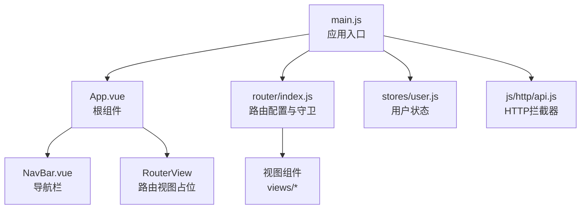
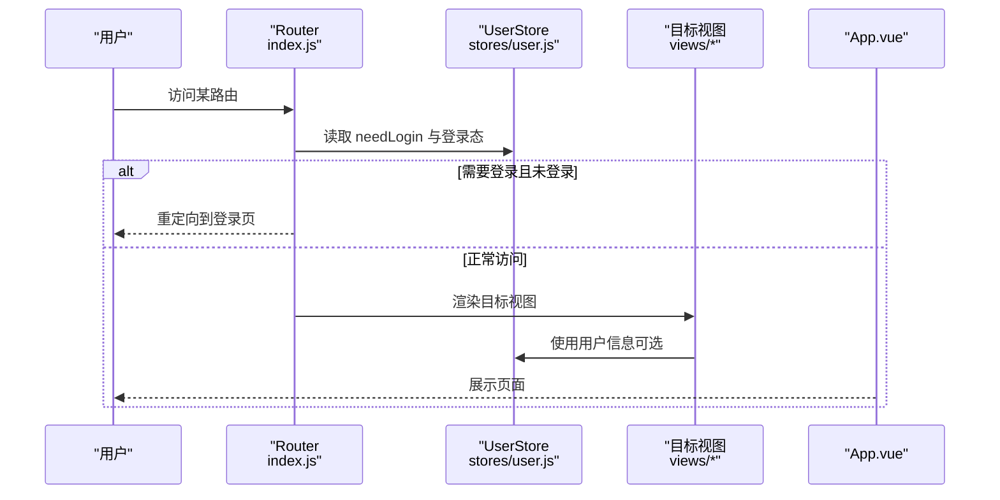
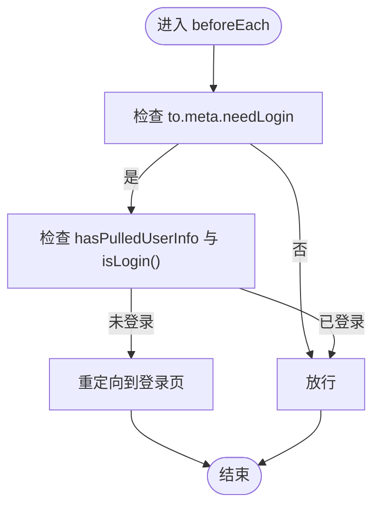
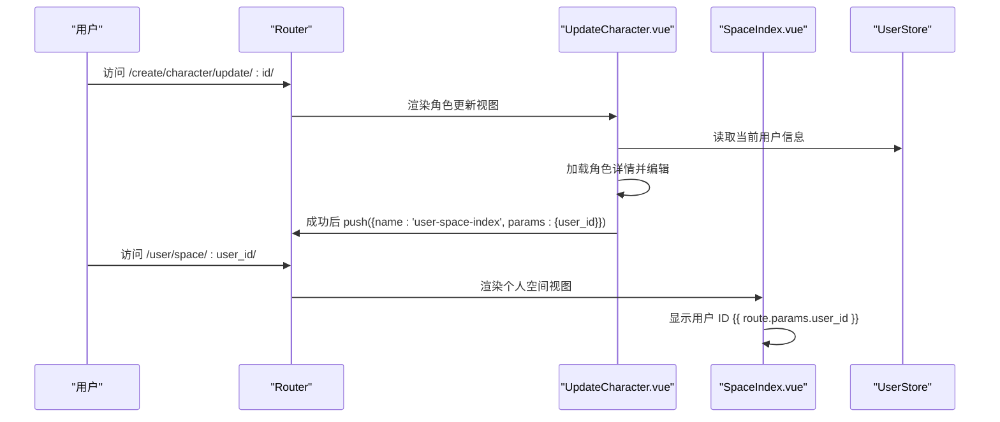
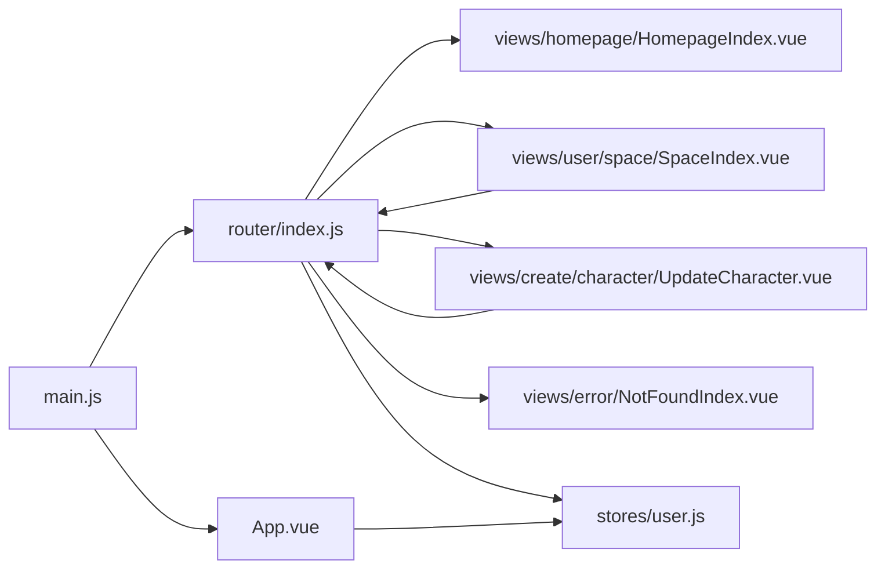
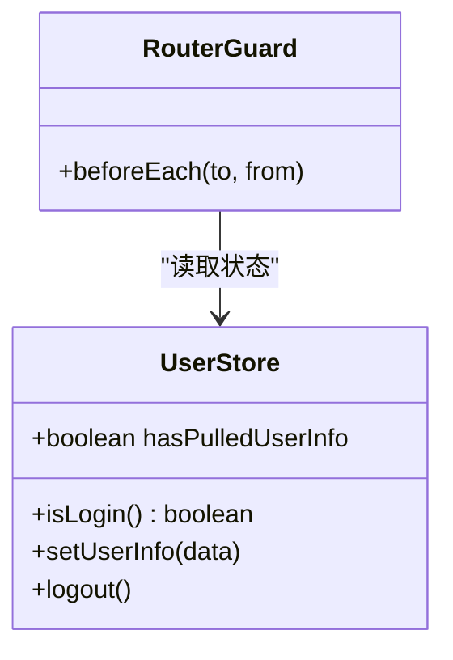
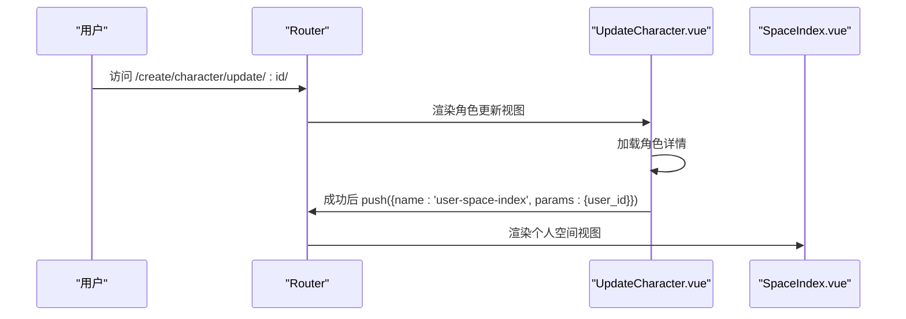

# 路由配置

<cite>
**本文引用的文件**
- [frontend/src/router/index.js](file://frontend/src/router/index.js)
- [frontend/src/App.vue](file://frontend/src/App.vue)
- [frontend/src/stores/user.js](file://frontend/src/stores/user.js)
- [frontend/src/views/error/NotFoundIndex.vue](file://frontend/src/views/error/NotFoundIndex.vue)
- [frontend/src/views/homepage/HomepageIndex.vue](file://frontend/src/views/homepage/HomepageIndex.vue)
- [frontend/src/views/user/space/SpaceIndex.vue](file://frontend/src/views/user/space/SpaceIndex.vue)
- [frontend/src/views/create/character/UpdateCharacter.vue](file://frontend/src/views/create/character/UpdateCharacter.vue)
- [frontend/src/components/navbar/NavBar.vue](file://frontend/src/components/navbar/NavBar.vue)
- [frontend/src/js/http/api.js](file://frontend/src/js/http/api.js)
- [frontend/src/main.js](file://frontend/src/main.js)
- [frontend/vite.config.js](file://frontend/vite.config.js)
- [frontend/package.json](file://frontend/package.json)
</cite>

## 目录
1. [简介](#简介)
2. [项目结构](#项目结构)
3. [核心组件](#核心组件)
4. [架构总览](#架构总览)
5. [详细组件分析](#详细组件分析)
6. [依赖关系分析](#依赖关系分析)
7. [性能考量](#性能考量)
8. [故障排查指南](#故障排查指南)
9. [结论](#结论)
10. [附录](#附录)

## 简介
本文件面向 LLM_AIfriends 的前端路由配置系统，围绕 Vue Router 的配置结构进行深入解析，涵盖：
- 路由定义与路径匹配规则
- 元信息（meta）配置与鉴权控制
- 静态路由与动态路由的实现方式（含参数传递）
- 路由重定向与 404 处理机制
- 历史模式选择与部署注意事项
- 路由配置图、路径匹配示例与最佳实践

## 项目结构
前端采用 Vite + Vue 3 + Pinia + Vue Router 的现代单页应用架构。路由集中于 router/index.js，通过全局前置守卫实现登录态校验；应用入口 main.js 安装路由与状态管理；App.vue 作为根组件挂载导航栏与 RouterView；各业务视图位于 views 下，按功能模块组织。

图表来源
- [frontend/src/main.js:1-15](file://frontend/src/main.js#L1-L15)
- [frontend/src/App.vue:1-41](file://frontend/src/App.vue#L1-L41)
- [frontend/src/router/index.js:1-110](file://frontend/src/router/index.js#L1-L110)
- [frontend/src/stores/user.js:1-53](file://frontend/src/stores/user.js#L1-L53)
- [frontend/src/js/http/api.js:1-93](file://frontend/src/js/http/api.js#L1-L93)

章节来源
- [frontend/src/main.js:1-15](file://frontend/src/main.js#L1-L15)
- [frontend/src/App.vue:1-41](file://frontend/src/App.vue#L1-L41)
- [frontend/src/router/index.js:1-110](file://frontend/src/router/index.js#L1-L110)

## 核心组件
- 路由器实例与历史模式：使用 createWebHistory 并基于 BASE_URL 构建，支持前端路由历史模式。
- 全局前置守卫：beforeEach 统一校验 to.meta.needLogin 与用户登录态，未登录时重定向至登录页。
- 视图组件：首页、好友、创作、用户账户、个人空间、角色更新等，覆盖静态与动态路由场景。
- 用户状态管理：Pinia Store 提供 isLogin、hasPulledUserInfo、setUserInfo 等能力，支撑路由守卫与导航逻辑。
- 404 处理：显式定义 /404 路由与通配符路由，统一兜底。

章节来源
- [frontend/src/router/index.js:13-107](file://frontend/src/router/index.js#L13-L107)
- [frontend/src/stores/user.js:1-53](file://frontend/src/stores/user.js#L1-L53)
- [frontend/src/views/error/NotFoundIndex.vue:1-11](file://frontend/src/views/error/NotFoundIndex.vue#L1-L11)

## 架构总览
下图展示路由配置、守卫、视图与状态管理之间的交互关系。

图表来源
- [frontend/src/router/index.js:99-107](file://frontend/src/router/index.js#L99-L107)
- [frontend/src/stores/user.js:1-53](file://frontend/src/stores/user.js#L1-L53)
- [frontend/src/App.vue:12-29](file://frontend/src/App.vue#L12-L29)

## 详细组件分析

### 路由配置与路径匹配
- 历史模式：history: createWebHistory(import.meta.env.BASE_URL)，确保构建产物部署到子路径时仍能正确工作。
- 路由表结构：routes 数组包含多个对象，每个对象定义 path、component、name、meta 等字段。
- 路径匹配规则：
  - 静态路由：如 “/”、“/friend/”、“/create/”、“/user/account/login/”、“/user/account/register/”、“/user/profile/” 等。
  - 动态路由：如 “/user/space/:user_id/”、“/create/character/update/:character_id/”，通过 params 获取动态参数。
  - 通配符路由：("/:pathMatch(.*)*") 放置于末尾，用于兜底 404。
- 元信息（meta）：
  - needLogin：true 表示需要登录态，false 表示无需登录。
  - 作用：全局前置守卫据此决定是否放行或重定向。

章节来源
- [frontend/src/router/index.js:13-97](file://frontend/src/router/index.js#L13-L97)

### 全局前置守卫与鉴权控制
- beforeEach(to, from)：在每次路由切换前执行。
- 校验逻辑：
  - 若 to.meta.needLogin 为真，且用户 hasPulledUserInfo 已拉取但未登录，则重定向到登录页。
  - 否则放行。
- 与 App.vue 的互补逻辑：
  - App.vue 在挂载阶段尝试拉取用户信息，并在必要时重定向到登录页，避免白屏或重复跳转。

图表来源
- [frontend/src/router/index.js:99-107](file://frontend/src/router/index.js#L99-L107)
- [frontend/src/App.vue:23-27](file://frontend/src/App.vue#L23-L27)
- [frontend/src/stores/user.js:12-14](file://frontend/src/stores/user.js#L12-L14)

章节来源
- [frontend/src/router/index.js:99-107](file://frontend/src/router/index.js#L99-L107)
- [frontend/src/App.vue:12-29](file://frontend/src/App.vue#L12-L29)
- [frontend/src/stores/user.js:1-53](file://frontend/src/stores/user.js#L1-L53)

### 静态路由与动态路由实现
- 静态路由示例：首页、好友、创作、登录、注册、个人资料等。
- 动态路由示例：
  - 个人空间：/user/space/:user_id/，在 SpaceIndex.vue 中通过 route.params.user_id 获取用户 ID。
  - 角色更新：/create/character/update/:character_id/，在 UpdateCharacter.vue 中通过 route.params.character_id 获取角色 ID，并在提交成功后重定向到个人空间。

图表来源
- [frontend/src/views/create/character/UpdateCharacter.vue:13-31](file://frontend/src/views/create/character/UpdateCharacter.vue#L13-L31)
- [frontend/src/views/user/space/SpaceIndex.vue:1-13](file://frontend/src/views/user/space/SpaceIndex.vue#L1-L13)
- [frontend/src/router/index.js:41-47](file://frontend/src/router/index.js#L41-L47)
- [frontend/src/router/index.js:73-79](file://frontend/src/router/index.js#L73-L79)

章节来源
- [frontend/src/views/create/character/UpdateCharacter.vue:13-31](file://frontend/src/views/create/character/UpdateCharacter.vue#L13-L31)
- [frontend/src/views/user/space/SpaceIndex.vue:1-13](file://frontend/src/views/user/space/SpaceIndex.vue#L1-L13)
- [frontend/src/router/index.js:41-47](file://frontend/src/router/index.js#L41-L47)
- [frontend/src/router/index.js:73-79](file://frontend/src/router/index.js#L73-L79)

### 404 错误页面与通配符路由
- 显式 404 路由：/404/，便于直接访问或手动跳转。
- 通配符兜底：/:pathMatch(.*)*，确保未匹配到任何路由时统一跳转到 404。
- NotFoundIndex.vue 作为兜底视图组件，内容简洁，可扩展为更丰富的提示与引导。

章节来源
- [frontend/src/router/index.js:49-95](file://frontend/src/router/index.js#L49-L95)
- [frontend/src/views/error/NotFoundIndex.vue:1-11](file://frontend/src/views/error/NotFoundIndex.vue#L1-L11)

### 导航栏与路由联动
- NavBar.vue 使用 RouterLink 与路由名称绑定，实现无路径硬编码的导航。
- 根据用户登录态显示不同菜单项（创作、登录、用户菜单）。

章节来源
- [frontend/src/components/navbar/NavBar.vue:1-77](file://frontend/src/components/navbar/NavBar.vue#L1-L77)

### 应用入口与状态初始化
- main.js 安装 Pinia 与 Router，挂载应用。
- App.vue 在 onMounted 阶段拉取用户信息并设置 hasPulledUserInfo，随后根据 needLogin 与 isLogin 决定是否重定向到登录页。

章节来源
- [frontend/src/main.js:1-15](file://frontend/src/main.js#L1-L15)
- [frontend/src/App.vue:12-29](file://frontend/src/App.vue#L12-L29)

### HTTP 拦截与鉴权
- api.js 通过 axios 拦截器在请求头注入 Authorization，并处理 401 重试与令牌刷新。
- 该机制与路由守卫配合，保证用户态一致性和请求安全性。

章节来源
- [frontend/src/js/http/api.js:1-93](file://frontend/src/js/http/api.js#L1-L93)

## 依赖关系分析
- 路由依赖：router/index.js 依赖各视图组件与用户状态管理。
- 视图依赖：视图组件依赖路由提供的 params、query、路由方法（push/replace），以及用户状态。
- 全局守卫依赖：守卫依赖用户状态的 isLogin 与 hasPulledUserInfo 字段。
- 构建与部署：vite.config.js 将打包产物输出到后端静态资源目录，便于 Django 部署。

图表来源
- [frontend/src/router/index.js:1-110](file://frontend/src/router/index.js#L1-L110)
- [frontend/src/stores/user.js:1-53](file://frontend/src/stores/user.js#L1-L53)
- [frontend/src/App.vue:1-41](file://frontend/src/App.vue#L1-L41)
- [frontend/src/main.js:1-15](file://frontend/src/main.js#L1-L15)

章节来源
- [frontend/src/router/index.js:1-110](file://frontend/src/router/index.js#L1-L110)
- [frontend/src/stores/user.js:1-53](file://frontend/src/stores/user.js#L1-L53)
- [frontend/src/App.vue:1-41](file://frontend/src/App.vue#L1-L41)
- [frontend/src/main.js:1-15](file://frontend/src/main.js#L1-L15)

## 性能考量
- 路由懒加载：当前路由表直接引入组件，未见动态导入。建议对大型视图采用动态导入以减少首屏体积。
- 前置守卫复杂度：守卫逻辑简单，时间复杂度 O(1)，性能开销极低。
- 404 路由位置：通配符路由置于末尾，避免影响其他路由匹配效率。
- 构建优化：Vite 默认优化策略与 Tree-shaking 已启用，结合动态导入可进一步提升性能。

[本节提供通用建议，不直接分析具体文件]

## 故障排查指南
- 访问受保护路由被重定向到登录页
  - 检查用户登录态：确认 hasPulledUserInfo 已设置为 true，且 isLogin() 返回 true。
  - 检查 meta.needLogin：确认目标路由 meta.needLogin 是否为 true。
  - 参考：[frontend/src/router/index.js:99-107](file://frontend/src/router/index.js#L99-L107)、[frontend/src/stores/user.js:1-53](file://frontend/src/stores/user.js#L1-L53)
- 动态路由参数为空
  - 确认导航时传入了正确的 params，例如 push({ name: 'user-space-index', params: { user_id } })。
  - 参考：[frontend/src/views/create/character/UpdateCharacter.vue:72-77](file://frontend/src/views/create/character/UpdateCharacter.vue#L72-L77)、[frontend/src/views/user/space/SpaceIndex.vue](file://frontend/src/views/user/space/SpaceIndex.vue#L8)
- 404 页面未显示
  - 确认通配符路由存在且位于路由表末尾。
  - 参考：[frontend/src/router/index.js:89-95](file://frontend/src/router/index.js#L89-L95)
- 历史模式部署问题
  - 确认 BASE_URL 设置正确，构建产物部署到子路径时仍能正常工作。
  - 参考：[frontend/src/router/index.js](file://frontend/src/router/index.js#L14)、[frontend/vite.config.js:16-19](file://frontend/vite.config.js#L16-L19)
- 请求 401 未自动刷新
  - 检查 api.js 的拦截器逻辑与刷新流程，确认刷新接口可用且返回新 access token。
  - 参考：[frontend/src/js/http/api.js:46-90](file://frontend/src/js/http/api.js#L46-L90)

章节来源
- [frontend/src/router/index.js:89-107](file://frontend/src/router/index.js#L89-L107)
- [frontend/src/stores/user.js:1-53](file://frontend/src/stores/user.js#L1-L53)
- [frontend/src/views/create/character/UpdateCharacter.vue:72-77](file://frontend/src/views/create/character/UpdateCharacter.vue#L72-L77)
- [frontend/src/views/user/space/SpaceIndex.vue](file://frontend/src/views/user/space/SpaceIndex.vue#L8)
- [frontend/vite.config.js:16-19](file://frontend/vite.config.js#L16-L19)
- [frontend/src/js/http/api.js:46-90](file://frontend/src/js/http/api.js#L46-L90)

## 结论
本路由配置系统以 Vue Router 为核心，通过明确的 meta.needLogin 控制与全局前置守卫实现统一的鉴权策略；静态与动态路由清晰分离，参数传递与重定向逻辑直观可靠；404 兜底与通配符路由保障用户体验。结合 Pinia 状态管理与 axios 拦截器，形成从路由到数据层的一致性安全与体验保障。建议后续引入路由懒加载与更完善的 404 页面引导，持续优化首屏性能与可维护性。

[本节为总结性内容，不直接分析具体文件]

## 附录

### 路由配置图（代码级）

```mermaid
graph TB
subgraph "路由表"
H["'/' -> HomepageIndex<br/>needLogin:false"]
F["'/friend/' -> FriendIndex<br/>needLogin:true"]
C["'/create/' -> CreateIndex<br/>needLogin:true"]
UC["'/create/character/update/:character_id/' -> UpdateCharacter<br/>needLogin:true"]
L["'/user/account/login/' -> LoginIndex<br/>needLogin:false"]
R["'/user/account/register/' -> RegisterIndex<br/>needLogin:false"]
S["'/user/space/:user_id/' -> SpaceIndex<br/>needLogin:false"]
P["'/user/profile/' -> ProfileIndex<br/>needLogin:true"]
N404["'/404/' -> NotFoundIndex<br/>needLogin:false"]
W["'/:pathMatch(.*)*' -> NotFoundIndex<br/>needLogin:false"]
end
H --> F --> C --> UC --> L --> R --> S --> P --> N404 --> W
```

图表来源
- [frontend/src/router/index.js:15-97](file://frontend/src/router/index.js#L15-L97)

### 路由守卫与用户状态类图

图表来源
- [frontend/src/router/index.js:99-107](file://frontend/src/router/index.js#L99-L107)
- [frontend/src/stores/user.js:1-53](file://frontend/src/stores/user.js#L1-L53)

### 路由与视图交互序列图（角色更新）

图表来源
- [frontend/src/views/create/character/UpdateCharacter.vue:68-77](file://frontend/src/views/create/character/UpdateCharacter.vue#L68-L77)
- [frontend/src/router/index.js:73-79](file://frontend/src/router/index.js#L73-L79)