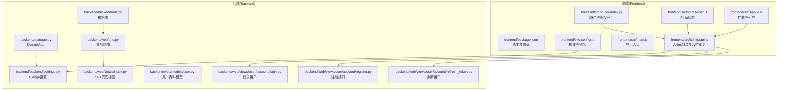
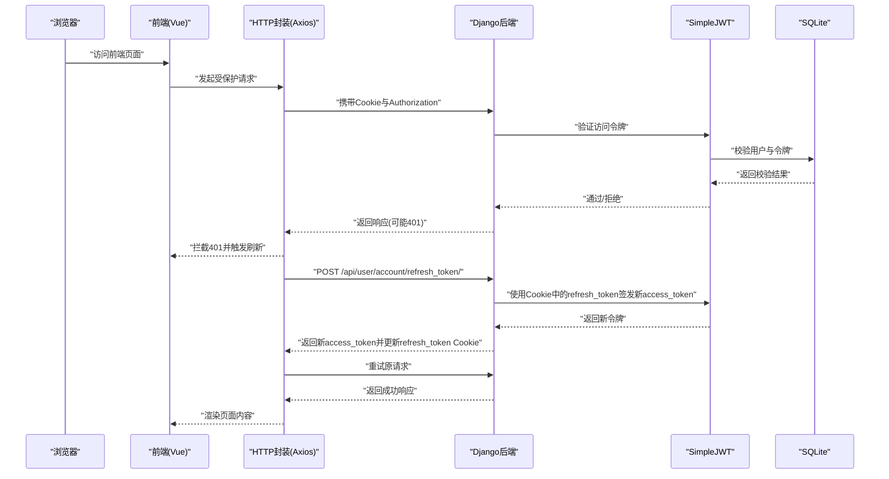
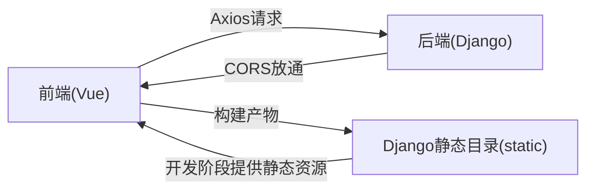

# 开发环境部署

<cite>
**本文引用的文件**
- [README.md](file://README.md)
- [backend/manage.py](file://backend/manage.py)
- [backend/backend/settings.py](file://backend/backend/settings.py)
- [backend/backend/urls.py](file://backend/backend/urls.py)
- [backend/web/urls.py](file://backend/web/urls.py)
- [backend/web/views/index.py](file://backend/web/views/index.py)
- [backend/web/models/user.py](file://backend/web/models/user.py)
- [backend/web/views/user/account/login.py](file://backend/web/views/user/account/login.py)
- [backend/web/views/user/account/register.py](file://backend/web/views/user/account/register.py)
- [backend/web/views/user/account/refresh_token.py](file://backend/web/views/user/account/refresh_token.py)
- [frontend/package.json](file://frontend/package.json)
- [frontend/vite.config.js](file://frontend/vite.config.js)
- [frontend/src/main.js](file://frontend/src/main.js)
- [frontend/src/router/index.js](file://frontend/src/router/index.js)
- [frontend/src/js/http/api.js](file://frontend/src/js/http/api.js)
- [frontend/src/stores/user.js](file://frontend/src/stores/user.js)
- [frontend/src/App.vue](file://frontend/src/App.vue)
</cite>

## 目录
1. [简介](#简介)
2. [项目结构](#项目结构)
3. [核心组件](#核心组件)
4. [架构总览](#架构总览)
5. [详细组件分析](#详细组件分析)
6. [依赖关系分析](#依赖关系分析)
7. [性能考虑](#性能考虑)
8. [故障排查指南](#故障排查指南)
9. [结论](#结论)
10. [附录](#附录)

## 简介
本指南面向参与 LLM_AIfriends 项目的开发者，提供从零搭建本地开发环境的完整流程，涵盖 Node.js 与 Python 环境准备、依赖安装、前后端启动顺序与联调、Vite 热重载与开发工具链、Django 开发服务器与数据库初始化、环境变量与跨域配置、以及常见问题排查方法。文档同时给出关键配置文件的定位与作用说明，帮助你快速上手并高效迭代。

## 项目结构
项目采用前后端分离架构：
- 前端基于 Vue 3 + Vite，通过 Vite 插件体系集成 Vue DevTools 与 TailwindCSS，并将构建产物输出至 Django 的 static 目录，供 Django 在开发阶段直接提供静态资源。
- 后端基于 Django + Django REST Framework，使用 SQLite 作为默认数据库，SimpleJWT 实现认证与令牌刷新，CORS 放通前端开发域名，提供用户登录、注册、令牌刷新等接口。

图表来源
- [frontend/package.json:1-30](file://frontend/package.json#L1-L30)
- [frontend/vite.config.js:1-26](file://frontend/vite.config.js#L1-L26)
- [frontend/src/main.js:1-15](file://frontend/src/main.js#L1-L15)
- [frontend/src/router/index.js:1-104](file://frontend/src/router/index.js#L1-L104)
- [frontend/src/js/http/api.js:1-92](file://frontend/src/js/http/api.js#L1-L92)
- [frontend/src/stores/user.js:1-59](file://frontend/src/stores/user.js#L1-L59)
- [frontend/src/App.vue:1-43](file://frontend/src/App.vue#L1-L43)
- [backend/manage.py:1-23](file://backend/manage.py#L1-L23)
- [backend/backend/settings.py:1-158](file://backend/backend/settings.py#L1-L158)
- [backend/backend/urls.py:1-38](file://backend/backend/urls.py#L1-L38)
- [backend/web/urls.py:1-24](file://backend/web/urls.py#L1-L24)
- [backend/web/views/index.py:1-4](file://backend/web/views/index.py#L1-L4)
- [backend/web/models/user.py:1-23](file://backend/web/models/user.py#L1-L23)
- [backend/web/views/user/account/login.py:1-92](file://backend/web/views/user/account/login.py#L1-L92)
- [backend/web/views/user/account/register.py:1-46](file://backend/web/views/user/account/register.py#L1-L46)
- [backend/web/views/user/account/refresh_token.py:1-41](file://backend/web/views/user/account/refresh_token.py#L1-L41)

章节来源
- [README.md:1-1](file://README.md#L1-L1)
- [frontend/package.json:1-30](file://frontend/package.json#L1-L30)
- [frontend/vite.config.js:1-26](file://frontend/vite.config.js#L1-L26)
- [backend/backend/settings.py:1-158](file://backend/backend/settings.py#L1-L158)
- [backend/backend/urls.py:1-38](file://backend/backend/urls.py#L1-L38)
- [backend/web/urls.py:1-24](file://backend/web/urls.py#L1-L24)

## 核心组件
- 前端应用入口与状态管理
  - 应用入口负责挂载 Vue 应用、注册 Pinia 与路由，随后挂载到 DOM。
  - 路由模块定义页面级路由与“需登录”元信息，并在导航前进行登录态校验。
  - HTTP 封装统一设置基础地址、携带 Cookie 与 Authorization 头，拦截 401 并自动刷新访问令牌。
  - 用户状态 Store 维护登录态、用户信息与访问令牌，配合路由守卫完成登录拦截。
- 后端服务与认证
  - Django 设置启用 CORS、SQLite 默认数据库、SimpleJWT 认证与令牌生命周期配置。
  - 登录/注册接口返回访问令牌与用户信息，并写入刷新令牌 Cookie。
  - 刷新接口读取 Cookie 中的刷新令牌，签发新的访问令牌并可轮换刷新令牌。
  - SPA 兜底路由确保前端路由在开发阶段可直接访问，避免 404。

章节来源
- [frontend/src/main.js:1-15](file://frontend/src/main.js#L1-L15)
- [frontend/src/router/index.js:1-104](file://frontend/src/router/index.js#L1-L104)
- [frontend/src/js/http/api.js:1-92](file://frontend/src/js/http/api.js#L1-L92)
- [frontend/src/stores/user.js:1-59](file://frontend/src/stores/user.js#L1-L59)
- [backend/backend/settings.py:1-158](file://backend/backend/settings.py#L1-L158)
- [backend/web/views/user/account/login.py:1-92](file://backend/web/views/user/account/login.py#L1-L92)
- [backend/web/views/user/account/register.py:1-46](file://backend/web/views/user/account/register.py#L1-L46)
- [backend/web/views/user/account/refresh_token.py:1-41](file://backend/web/views/user/account/refresh_token.py#L1-L41)
- [backend/web/views/index.py:1-4](file://backend/web/views/index.py#L1-L4)

## 架构总览
下图展示开发阶段的请求流：前端通过 Axios 发起请求，后端 JWT 接口返回访问令牌与刷新令牌 Cookie；前端拦截 401 自动刷新访问令牌，最终渲染页面。

图表来源
- [frontend/src/js/http/api.js:1-92](file://frontend/src/js/http/api.js#L1-L92)
- [backend/web/views/user/account/refresh_token.py:1-41](file://backend/web/views/user/account/refresh_token.py#L1-L41)
- [backend/web/views/user/account/login.py:1-92](file://backend/web/views/user/account/login.py#L1-L92)
- [backend/backend/settings.py:1-158](file://backend/backend/settings.py#L1-L158)

## 详细组件分析

### 前端开发服务器与热重载
- 启动命令
  - 在前端目录执行开发命令以启动 Vite 开发服务器，默认监听本地端口。
- 热重载机制
  - Vite 通过内置 HMR 与 Vue 插件实现组件级热替换，修改源码后浏览器自动刷新。
- 开发工具链
  - Vue DevTools 插件在开发模式下启用，便于调试组件与状态。
  - TailwindCSS 插件按需注入样式，支持原子化样式开发。
- 构建与静态资源
  - Vite 构建产物输出到 Django 的 static 目录，开发阶段由 Django 提供静态资源与媒体文件。

章节来源
- [frontend/package.json:1-30](file://frontend/package.json#L1-L30)
- [frontend/vite.config.js:1-26](file://frontend/vite.config.js#L1-L26)

### 前端路由与鉴权守卫
- 路由设计
  - 定义多页面路由，部分路由声明需要登录方可访问。
- 导航守卫
  - 在跳转前检查用户登录态与“需登录”元信息，未登录则重定向至登录页。
- 页面挂载与用户信息拉取
  - 应用挂载时尝试拉取当前用户信息，完成后根据路由需求决定是否跳转登录。

章节来源
- [frontend/src/router/index.js:1-104](file://frontend/src/router/index.js#L1-L104)
- [frontend/src/App.vue:1-43](file://frontend/src/App.vue#L1-L43)

### 前端 HTTP 封装与 JWT 刷新
- 基础配置
  - 统一设置后端地址与允许携带 Cookie 的跨域请求。
- 请求拦截
  - 自动在请求头中附加访问令牌。
- 响应拦截
  - 拦截 401 未授权：若首次遇到，订阅刷新流程；使用 Cookie 中的刷新令牌向后端申请新访问令牌；刷新成功后重试原请求；刷新失败则清除本地登录状态。
- 与后端接口协作
  - 登录/注册接口返回访问令牌与用户信息，并写入刷新令牌 Cookie。
  - 刷新接口读取 Cookie 中的刷新令牌，签发新的访问令牌并可轮换刷新令牌。

章节来源
- [frontend/src/js/http/api.js:1-92](file://frontend/src/js/http/api.js#L1-L92)
- [frontend/src/stores/user.js:1-59](file://frontend/src/stores/user.js#L1-L59)
- [backend/web/views/user/account/login.py:1-92](file://backend/web/views/user/account/login.py#L1-L92)
- [backend/web/views/user/account/register.py:1-46](file://backend/web/views/user/account/register.py#L1-L46)
- [backend/web/views/user/account/refresh_token.py:1-41](file://backend/web/views/user/account/refresh_token.py#L1-L41)

### 后端开发服务器与数据库初始化
- 启动命令
  - 在后端目录通过管理脚本启动开发服务器。
- 数据库初始化
  - 默认使用 SQLite，首次运行时无需额外初始化；如需迁移，可使用管理脚本执行迁移流程。
- 静态资源与媒体文件
  - 开发阶段由 Django 提供静态资源与媒体文件服务，便于前端联调。
- 跨域与认证
  - CORS 已放通前端开发域名；JWT 认证与令牌生命周期在设置中配置。

章节来源
- [backend/manage.py:1-23](file://backend/manage.py#L1-L23)
- [backend/backend/settings.py:1-158](file://backend/backend/settings.py#L1-L158)
- [backend/backend/urls.py:1-38](file://backend/backend/urls.py#L1-L38)

### SPA 兜底路由与模板
- 兜底路由
  - 当请求路径不匹配静态资源或后端 API 时，返回前端首页模板，交由前端路由接管。
- 模板位置
  - 前端首页模板位于后端模板目录，便于在开发阶段直接渲染。

章节来源
- [backend/web/urls.py:1-24](file://backend/web/urls.py#L1-L24)
- [backend/web/views/index.py:1-4](file://backend/web/views/index.py#L1-L4)

## 依赖关系分析
- 前端对后端的依赖
  - 前端通过 Axios 调用后端登录、注册、刷新等接口；后端返回访问令牌与用户信息，并写入刷新令牌 Cookie。
- 后端对前端的依赖
  - 后端通过 CORS 放通前端开发域名；前端路由与状态管理依赖后端提供的接口与数据结构。
- 构建与打包
  - Vite 将前端构建产物输出到 Django 的 static 目录，开发阶段由 Django 提供静态资源服务。

图表来源
- [frontend/src/js/http/api.js:1-92](file://frontend/src/js/http/api.js#L1-L92)
- [backend/backend/settings.py:1-158](file://backend/backend/settings.py#L1-L158)
- [frontend/vite.config.js:1-26](file://frontend/vite.config.js#L1-L26)

章节来源
- [frontend/src/js/http/api.js:1-92](file://frontend/src/js/http/api.js#L1-L92)
- [backend/backend/settings.py:1-158](file://backend/backend/settings.py#L1-L158)
- [frontend/vite.config.js:1-26](file://frontend/vite.config.js#L1-L26)

## 性能考虑
- 前端开发阶段
  - 使用 Vite 的按需编译与 HMR，减少等待时间；TailwindCSS 按需注入避免无谓体积。
- 后端开发阶段
  - SQLite 适合本地开发；建议仅在 DEBUG 下开启静态资源与媒体文件服务，避免生产环境误用。
- 资源加载
  - 将构建产物置于 Django static 目录，统一由 Django 提供，减少跨域与代理复杂度。

## 故障排查指南
- 前端无法访问后端接口
  - 检查后端 CORS 配置是否放通前端开发域名。
  - 确认前端 Axios 基础地址与后端实际监听地址一致。
- 登录后仍提示未登录
  - 检查登录接口是否正确返回访问令牌与用户信息。
  - 确认刷新接口是否能从 Cookie 中读取刷新令牌并返回新访问令牌。
  - 查看浏览器 Cookie 是否被正确设置与携带。
- 401 未授权频繁出现
  - 检查访问令牌是否过期；确认刷新流程是否正常执行。
  - 确认后端 SimpleJWT 的令牌生命周期与轮换策略配置。
- 静态资源 404 或页面空白
  - 确认 Vite 构建产物已输出到 Django static 目录。
  - 检查开发阶段静态资源与媒体文件服务是否启用。
- SPA 路由 404
  - 确认后端兜底路由已生效，且未被其他路由覆盖。
- 数据库相关
  - 首次运行无需手动初始化；如需迁移，使用管理脚本执行迁移流程。

章节来源
- [backend/backend/settings.py:1-158](file://backend/backend/settings.py#L1-L158)
- [frontend/src/js/http/api.js:1-92](file://frontend/src/js/http/api.js#L1-L92)
- [backend/web/views/user/account/login.py:1-92](file://backend/web/views/user/account/login.py#L1-L92)
- [backend/web/views/user/account/refresh_token.py:1-41](file://backend/web/views/user/account/refresh_token.py#L1-L41)
- [backend/backend/urls.py:1-38](file://backend/backend/urls.py#L1-L38)
- [backend/web/urls.py:1-24](file://backend/web/urls.py#L1-L24)

## 结论
通过以上步骤，你可以完成 LLM_AIfriends 的本地开发环境搭建与联调。建议遵循“先启动后端、再启动前端”的顺序，利用 Vite 的热重载与 Vue DevTools 提升开发效率；在后端设置中确保 CORS 与 JWT 配置正确，前端通过 Axios 的拦截器实现自动刷新与统一错误处理。遇到问题时，优先检查跨域、Cookie、令牌生命周期与静态资源服务。

## 附录

### 环境要求与安装步骤
- Node.js
  - 版本要求：参见前端引擎配置。
  - 安装方式：使用包管理器或官方安装包安装指定版本。
- Python
  - 版本要求：使用与项目兼容的 Python 版本。
  - 安装方式：使用包管理器或官方安装包安装。
- 依赖安装
  - 前端：在前端目录安装依赖。
  - 后端：在后端目录安装依赖（Django、DRF、SimpleJWT、CORS 等）。
- 项目启动
  - 后端：在后端目录启动开发服务器。
  - 前端：在前端目录启动开发服务器。
  - 联调：确保前端 Axios 基础地址与后端监听地址一致，CORS 放通前端域名。

章节来源
- [frontend/package.json:1-30](file://frontend/package.json#L1-L30)
- [backend/manage.py:1-23](file://backend/manage.py#L1-L23)
- [backend/backend/settings.py:1-158](file://backend/backend/settings.py#L1-L158)