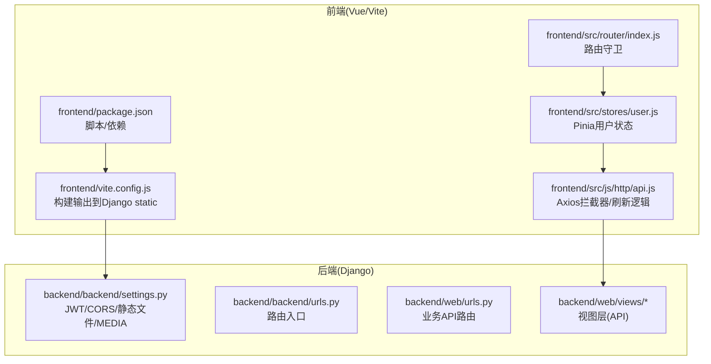
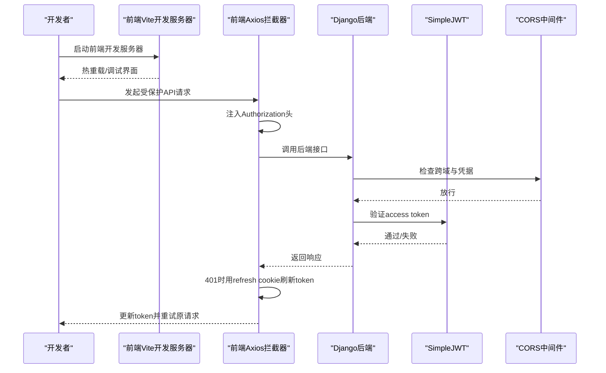
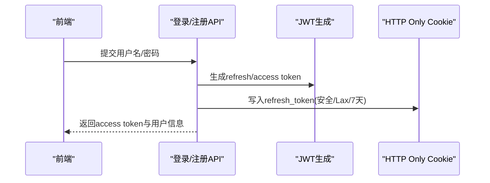
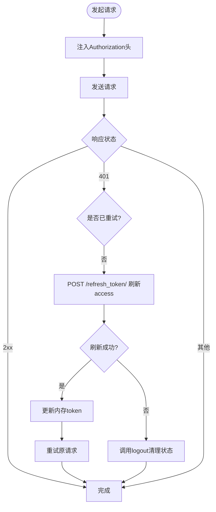
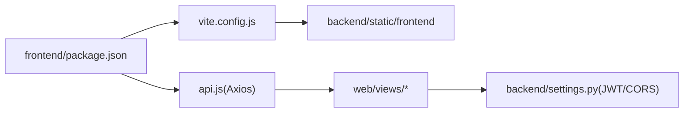

# 开发环境部署

<cite>
**本文引用的文件**
- [backend/backend/settings.py](file://backend/backend/settings.py)
- [backend/manage.py](file://backend/manage.py)
- [backend/backend/urls.py](file://backend/backend/urls.py)
- [backend/web/urls.py](file://backend/web/urls.py)
- [backend/web/views/index.py](file://backend/web/views/index.py)
- [backend/web/models/user.py](file://backend/web/models/user.py)
- [backend/web/views/user/account/login.py](file://backend/web/views/user/account/login.py)
- [backend/web/views/user/account/register.py](file://backend/web/views/user/account/register.py)
- [backend/web/views/user/account/refresh_token.py](file://backend/web/views/user/account/refresh_token.py)
- [frontend/package.json](file://frontend/package.json)
- [frontend/vite.config.js](file://frontend/vite.config.js)
- [frontend/src/js/http/api.js](file://frontend/src/js/http/api.js)
- [frontend/src/stores/user.js](file://frontend/src/stores/user.js)
- [frontend/src/router/index.js](file://frontend/src/router/index.js)
</cite>

## 目录
1. [简介](#简介)
2. [项目结构](#项目结构)
3. [核心组件](#核心组件)
4. [架构总览](#架构总览)
5. [详细组件分析](#详细组件分析)
6. [依赖分析](#依赖分析)
7. [性能考虑](#性能考虑)
8. [故障排查指南](#故障排查指南)
9. [结论](#结论)
10. [附录](#附录)

## 简介
本文件面向LLM_AIfriends项目的本地开发环境部署与运行，覆盖以下主题：
- Python虚拟环境创建与激活
- Django后端依赖安装与数据库初始化
- Vue前端依赖安装与构建输出目录配置
- 开发服务器启动流程、热重载与调试模式
- JWT认证、CORS跨域与静态/媒体资源处理
- 常用开发命令与IDE建议
- 常见问题与性能优化建议

## 项目结构
项目采用前后端分离架构：
- 后端：Django应用位于backend目录，包含DRF、JWT、CORS、SQLite数据库等配置
- 前端：Vue 3 + Vite应用位于frontend目录，通过Vite插件集成开发工具与TailwindCSS，并将打包产物输出至Django的static目录供开发时直接访问

图表来源
- [backend/backend/settings.py:118-159](file://backend/backend/settings.py#L118-L159)
- [backend/backend/urls.py:17-38](file://backend/backend/urls.py#L17-L38)
- [backend/web/urls.py:1-33](file://backend/web/urls.py#L1-33)
- [frontend/vite.config.js:10-26](file://frontend/vite.config.js#L10-L26)
- [frontend/src/js/http/api.js:14-93](file://frontend/src/js/http/api.js#L14-L93)
- [frontend/src/stores/user.js:1-53](file://frontend/src/stores/user.js#L1-L53)
- [frontend/src/router/index.js:1-110](file://frontend/src/router/index.js#L1-L110)

章节来源
- [backend/backend/settings.py:1-159](file://backend/backend/settings.py#L1-159)
- [backend/backend/urls.py:17-38](file://backend/backend/urls.py#L17-L38)
- [backend/web/urls.py:1-33](file://backend/web/urls.py#L1-33)
- [frontend/package.json:1-30](file://frontend/package.json#L1-L30)
- [frontend/vite.config.js:1-26](file://frontend/vite.config.js#L1-L26)

## 核心组件
- Django后端
  - 认证与令牌：使用DRF + SimpleJWT进行JWT认证，支持access/refresh令牌轮换与黑名单
  - 跨域：启用CORS并允许凭据，限定前端开发源
  - 静态与媒体：开发阶段通过Django服务静态资源与媒体资源
  - 路由：根路由映射到web应用；web应用定义用户与角色相关API
- Vue前端
  - 构建：Vite将产物输出到Django static目录，便于开发时直接访问
  - 请求拦截：Axios统一注入Authorization头，自动刷新access token
  - 状态管理：Pinia存储用户信息与登录态
  - 路由：基于meta字段控制页面是否需要登录

章节来源
- [backend/backend/settings.py:133-159](file://backend/backend/settings.py#L133-L159)
- [backend/web/urls.py:16-32](file://backend/web/urls.py#L16-L32)
- [frontend/vite.config.js:16-19](file://frontend/vite.config.js#L16-L19)
- [frontend/src/js/http/api.js:16-93](file://frontend/src/js/http/api.js#L16-L93)
- [frontend/src/stores/user.js:1-53](file://frontend/src/stores/user.js#L1-L53)
- [frontend/src/router/index.js:99-107](file://frontend/src/router/index.js#L99-L107)

## 架构总览
下图展示开发环境启动与交互流程：前端通过Vite开发服务器提供界面与热重载；Axios请求经拦截器统一携带JWT；后端通过CORS允许前端跨域；静态与媒体资源由Django在DEBUG模式下提供。

图表来源
- [frontend/src/js/http/api.js:16-93](file://frontend/src/js/http/api.js#L16-L93)
- [backend/backend/settings.py:45-54](file://backend/backend/settings.py#L45-L54)
- [backend/web/views/user/account/refresh_token.py:7-39](file://backend/web/views/user/account/refresh_token.py#L7-L39)

## 详细组件分析

### 后端设置与JWT/CORS/静态资源
- 认证与令牌
  - 默认认证类为JWT，SimpleJWT配置包含有效期、轮换与黑名单策略
- CORS
  - 允许凭据，开发源为前端Vite默认端口
- 静态与媒体
  - 开发阶段通过Django服务静态与媒体资源，静态目录指向项目根static
  - 媒体URL为固定地址，指向项目根media
- 中间件顺序
  - CORS中间件需尽量靠前以确保跨域头正确设置

章节来源
- [backend/backend/settings.py:133-159](file://backend/backend/settings.py#L133-L159)
- [backend/backend/settings.py:45-54](file://backend/backend/settings.py#L45-L54)
- [backend/backend/settings.py:118-131](file://backend/backend/settings.py#L118-L131)

### Django路由与首页模板
- 根路由包含admin与web应用
- 开发阶段通过正则匹配兜底到index视图，使前端单页路由生效
- 视图index渲染模板index.html

章节来源
- [backend/backend/urls.py:22-38](file://backend/backend/urls.py#L22-L38)
- [backend/web/urls.py:29-32](file://backend/web/urls.py#L29-L32)
- [backend/web/views/index.py:4-6](file://backend/web/views/index.py#L4-L6)

### 用户认证API（登录/注册/刷新）
- 登录
  - 校验用户名与密码，成功后生成JWT并下发access token与refresh cookie
- 注册
  - 创建用户与用户档案，随后发放JWT与refresh cookie
- 刷新
  - 从Cookie读取refresh token，按配置轮换并返回新的access token

图表来源
- [backend/web/views/user/account/login.py:9-46](file://backend/web/views/user/account/login.py#L9-L46)
- [backend/web/views/user/account/register.py:9-45](file://backend/web/views/user/account/register.py#L9-L45)

章节来源
- [backend/web/views/user/account/login.py:9-46](file://backend/web/views/user/account/login.py#L9-L46)
- [backend/web/views/user/account/register.py:9-45](file://backend/web/views/user/account/register.py#L9-L45)
- [backend/web/views/user/account/refresh_token.py:7-39](file://backend/web/views/user/account/refresh_token.py#L7-L39)

### 前端HTTP拦截与令牌刷新
- 统一基地址与凭据
- 请求头自动附加Authorization: Bearer
- 响应拦截器处理401：使用refresh cookie刷新access token
- 刷新成功后重试原请求，失败则登出并清空本地状态

图表来源
- [frontend/src/js/http/api.js:16-93](file://frontend/src/js/http/api.js#L16-L93)

章节来源
- [frontend/src/js/http/api.js:16-93](file://frontend/src/js/http/api.js#L16-L93)

### 前端状态与路由守卫
- Pinia用户状态
  - 存储id/username/photo/profile/accessToken/isLogin等
- 路由守卫
  - 对需要登录的页面，在未登录且已拉取过用户信息时跳转登录页

章节来源
- [frontend/src/stores/user.js:1-53](file://frontend/src/stores/user.js#L1-L53)
- [frontend/src/router/index.js:99-107](file://frontend/src/router/index.js#L99-L107)

### 媒体资源模型
- 用户头像上传路径规则与默认值
- 上传文件名使用UUID避免冲突

章节来源
- [backend/web/models/user.py:8-23](file://backend/web/models/user.py#L8-L23)

## 依赖分析
- 前端依赖
  - Vue 3、Vue Router、Pinia、Axios、TailwindCSS、Vite及其插件
- 构建输出
  - Vite将打包产物写入backend/static/frontend，开发时由Django静态文件服务提供
- 后端依赖
  - Django、djangorestframework、django-cors-headers、SimpleJWT、SQLite

图表来源
- [frontend/package.json:9-28](file://frontend/package.json#L9-L28)
- [frontend/vite.config.js:16-19](file://frontend/vite.config.js#L16-L19)
- [frontend/src/js/http/api.js:16-19](file://frontend/src/js/http/api.js#L16-L19)
- [backend/backend/settings.py:133-159](file://backend/backend/settings.py#L133-L159)

章节来源
- [frontend/package.json:1-30](file://frontend/package.json#L1-L30)
- [frontend/vite.config.js:1-26](file://frontend/vite.config.js#L1-L26)
- [backend/backend/settings.py:33-43](file://backend/backend/settings.py#L33-L43)

## 性能考虑
- 开发阶段
  - 前端热重载与按需模块加载提升迭代效率
  - 将构建产物置于Django static可减少跨域与代理复杂度
- 认证与网络
  - 合理设置JWT有效期与刷新策略，避免频繁登录
  - 在拦截器中合并并发刷新请求，减少重复刷新
- 静态资源
  - 开发阶段由Django serve静态/媒体；生产阶段建议由Nginx提供静态资源并配置缓存

## 故障排查指南
- 启动后端报“无法导入Django”
  - 检查是否在虚拟环境中执行，确认PYTHONPATH与Django版本一致
- 前端无法访问后端接口
  - 确认CORS允许开发源，检查前端基地址与后端端口一致
- 登录后仍提示未登录
  - 检查Cookie是否被设置为HTTP Only且同站策略是否正确
  - 确认后端JWT配置与前端拦截器一致
- 图片/媒体资源无法显示
  - 确认MEDIA配置与Django开发路由已包含/media/路径
- 刷新令牌失败
  - 检查Cookie中refresh_token是否存在与有效；确认后端刷新接口返回状态码

章节来源
- [backend/manage.py:7-18](file://backend/manage.py#L7-L18)
- [backend/backend/settings.py:153-159](file://backend/backend/settings.py#L153-L159)
- [backend/web/views/user/account/refresh_token.py:10-14](file://backend/web/views/user/account/refresh_token.py#L10-L14)
- [backend/backend/urls.py:28-37](file://backend/backend/urls.py#L28-L37)

## 结论
本项目采用“Django + DRF + SimpleJWT + Vue + Vite”的开发栈，通过将前端构建产物放置于Django静态目录，简化了开发期的资源访问与跨域处理。遵循本文档的环境搭建与运行步骤，可在本地快速启动并调试全栈功能。

## 附录

### 开发环境搭建步骤
- Python虚拟环境
  - 建议使用Python 3.10+，创建并激活虚拟环境
- 安装后端依赖
  - 在backend目录执行安装命令
- 初始化数据库
  - 运行迁移与创建超级用户
- 安装前端依赖
  - 在frontend目录执行安装命令
- 启动后端
  - 在backend目录执行管理命令启动开发服务器
- 启动前端
  - 在frontend目录执行开发脚本启动Vite

章节来源
- [backend/manage.py:7-18](file://backend/manage.py#L7-L18)
- [backend/backend/urls.py:28-37](file://backend/backend/urls.py#L28-L37)
- [frontend/package.json:9-13](file://frontend/package.json#L9-L13)

### 开发服务器与热重载
- 后端
  - 使用Django自带开发服务器，DEBUG开启时自动提供静态与媒体资源
- 前端
  - Vite提供热重载与Vue DevTools支持，构建产物写入Django static

章节来源
- [backend/backend/urls.py:28-37](file://backend/backend/urls.py#L28-L37)
- [frontend/vite.config.js:10-26](file://frontend/vite.config.js#L10-L26)

### JWT与CORS配置要点
- JWT
  - 默认认证类为JWT，SimpleJWT配置包含有效期、轮换与黑名单策略
- CORS
  - 允许凭据，开发源为前端Vite默认端口

章节来源
- [backend/backend/settings.py:133-159](file://backend/backend/settings.py#L133-L159)

### 静态文件与媒体资源
- 静态文件
  - 开发阶段由Django服务，静态目录指向项目根static
- 媒体资源
  - 媒体URL为固定地址，根目录为项目根media

章节来源
- [backend/backend/settings.py:118-131](file://backend/backend/settings.py#L118-L131)

### 常用开发命令
- 后端
  - 运行管理命令
- 前端
  - 启动开发服务器
  - 构建生产包
  - 预览生产包

章节来源
- [backend/manage.py:7-18](file://backend/manage.py#L7-L18)
- [frontend/package.json:9-13](file://frontend/package.json#L9-L13)