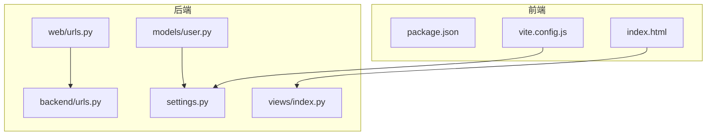
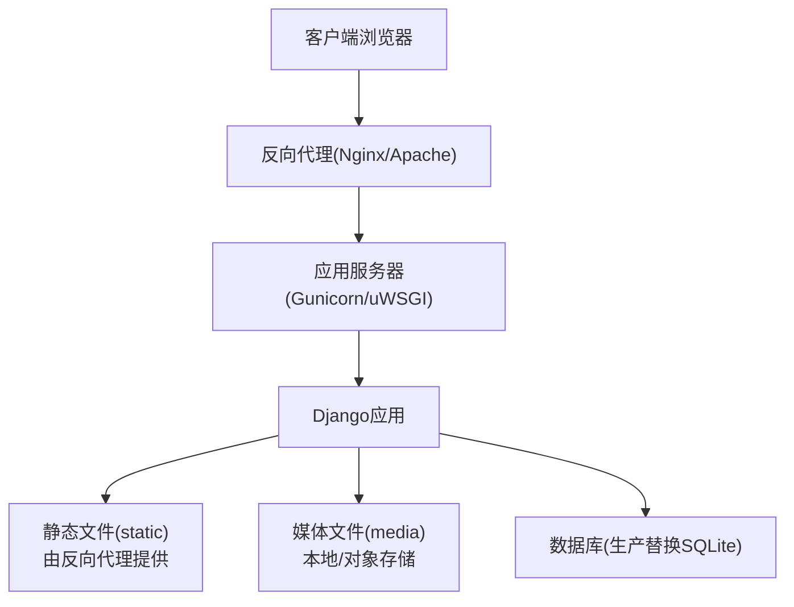
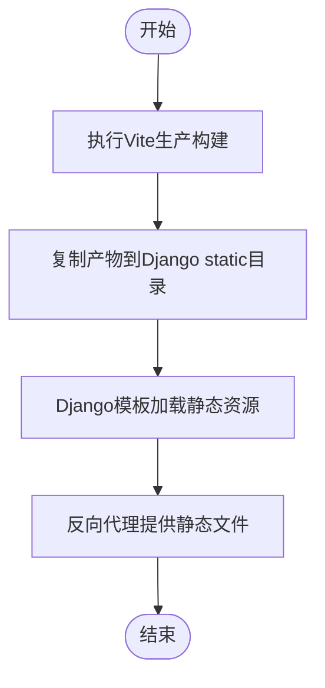
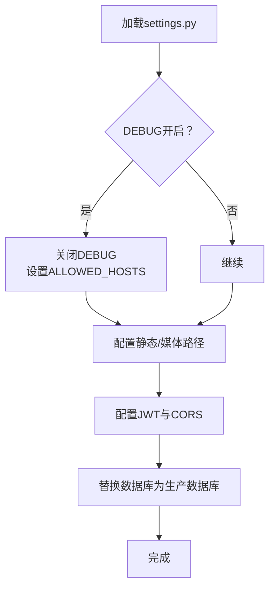
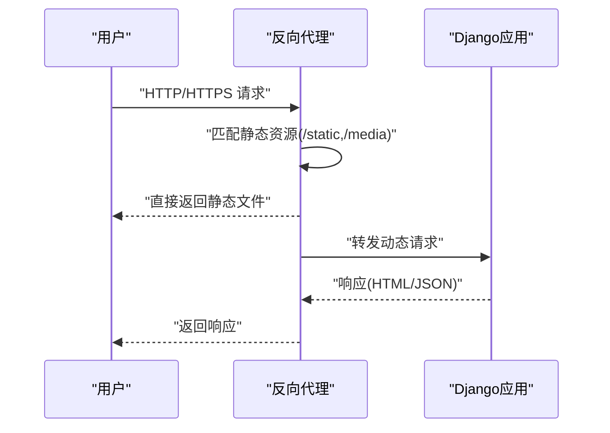
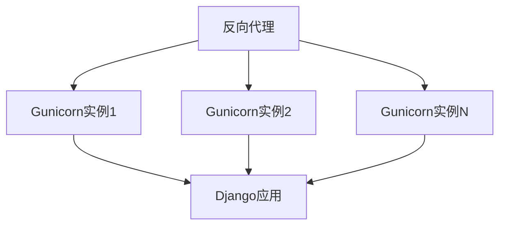
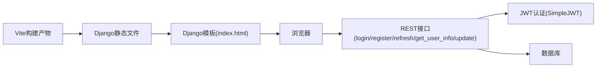

# 生产环境部署

<cite>
**本文引用的文件**
- [settings.py](file://backend/backend/settings.py)
- [urls.py](file://backend/web/urls.py)
- [urls.py](file://backend/backend/urls.py)
- [index.py](file://backend/web/views/index.py)
- [index.html](file://backend/web/templates/index.html)
- [vite.config.js](file://frontend/vite.config.js)
- [package.json](file://frontend/package.json)
- [login.py](file://backend/web/views/user/account/login.py)
- [register.py](file://backend/web/views/user/account/register.py)
- [refresh_token.py](file://backend/web/views/user/account/refresh_token.py)
- [logout.py](file://backend/web/views/user/account/logout.py)
- [get_user_info.py](file://backend/web/views/user/account/get_user_info.py)
- [update.py](file://backend/web/views/user/profile/update.py)
- [user.py](file://backend/web/models/user.py)
- [manage.py](file://backend/manage.py)
</cite>

## 目录
1. [简介](#简介)
2. [项目结构](#项目结构)
3. [核心组件](#核心组件)
4. [架构总览](#架构总览)
5. [详细组件分析](#详细组件分析)
6. [依赖分析](#依赖分析)
7. [性能考虑](#性能考虑)
8. [故障排查指南](#故障排查指南)
9. [结论](#结论)
10. [附录](#附录)

## 简介
本指南面向LLM_AIfriends项目的生产环境部署，覆盖以下关键主题：
- 前端静态文件构建与交付策略
- Django项目生产配置优化（安全、静态/媒体文件、认证与跨域）
- 反向代理与静态资源服务（Nginx/Apache）
- 应用服务器部署与进程管理（Gunicorn/uWSGI）
- 数据库生产配置、备份与性能优化
- 环境变量管理、日志与监控
- 部署脚本模板与自动化部署方案

## 项目结构
项目采用前后端分离架构：前端基于Vite构建，输出到Django的static目录；后端为Django + Django REST Framework，提供REST接口与单页应用入口。

图表来源
- [vite.config.js:1-26](file://frontend/vite.config.js#L1-L26)
- [settings.py:119-158](file://backend/backend/settings.py#L119-L158)
- [urls.py:1-24](file://backend/web/urls.py#L1-L24)
- [urls.py:1-38](file://backend/backend/urls.py#L1-L38)
- [index.py:1-4](file://backend/web/views/index.py#L1-L4)
- [index.html:1-17](file://backend/web/templates/index.html#L1-L17)
- [user.py:1-23](file://backend/web/models/user.py#L1-L23)

章节来源
- [vite.config.js:1-26](file://frontend/vite.config.js#L1-L26)
- [settings.py:119-158](file://backend/backend/settings.py#L119-L158)
- [urls.py:1-24](file://backend/web/urls.py#L1-L24)
- [urls.py:1-38](file://backend/backend/urls.py#L1-L38)
- [index.py:1-4](file://backend/web/views/index.py#L1-L4)
- [index.html:1-17](file://backend/web/templates/index.html#L1-L17)
- [user.py:1-23](file://backend/web/models/user.py#L1-L23)

## 核心组件
- 前端构建与交付
  - Vite在开发时提供热更新；生产构建将产物输出至Django的static目录，由Django模板在运行时加载。
- 后端服务
  - Django应用通过WSGI对外提供服务；路由包含REST接口与SPA入口。
  - 认证采用JWT（SimpleJWT），配合Cookie存储refresh_token。
  - 静态与媒体文件路径在settings中配置；开发阶段Django内置静态文件服务，生产需由反向代理处理。
- 模型与业务
  - 用户资料模型支持头像上传与简介字段；部分视图对输入进行严格校验。

章节来源
- [vite.config.js:16-19](file://frontend/vite.config.js#L16-L19)
- [settings.py:119-158](file://backend/backend/settings.py#L119-L158)
- [urls.py:10-23](file://backend/web/urls.py#L10-L23)
- [login.py:31-38](file://backend/web/views/user/account/login.py#L31-L38)
- [user.py:15-21](file://backend/web/models/user.py#L15-L21)

## 架构总览
下图展示生产环境典型拓扑：客户端请求经反向代理分发至Django应用，静态资源由反向代理直接提供，媒体文件由应用读写本地磁盘或对象存储。

## 详细组件分析

### 前端静态文件构建与交付
- 构建目标
  - Vite生产构建输出到Django的static目录，模板通过Django的静态资源标签加载。
- 关键点
  - 构建目录映射与清理策略由Vite配置决定。
  - 模板中静态资源路径需与实际部署路径一致。
- 建议
  - 生产构建后，将静态产物交由反向代理托管，减少Django负担。
  - 对静态资源启用缓存与版本化策略（可结合反向代理缓存与文件指纹）。

图表来源
- [vite.config.js:16-19](file://frontend/vite.config.js#L16-L19)
- [index.html:7-11](file://backend/web/templates/index.html#L7-L11)

章节来源
- [vite.config.js:1-26](file://frontend/vite.config.js#L1-L26)
- [index.html:1-17](file://backend/web/templates/index.html#L1-L17)

### Django生产配置优化
- 安全与调试
  - 关闭DEBUG，设置ALLOWED_HOSTS，配置安全中间件与CSRF保护。
- 静态与媒体文件
  - 明确STATIC_URL/STATIC_ROOT，开发阶段的静态文件服务仅用于开发。
  - 媒体文件路径与访问URL需与反向代理规则一致。
- 认证与跨域
  - JWT访问令牌生命周期与刷新策略；CORS允许来源与凭证。
- 数据库
  - SQLite仅适用于开发；生产应迁移到PostgreSQL/MySQL等。

图表来源
- [settings.py:25-28](file://backend/backend/settings.py#L25-L28)
- [settings.py:119-158](file://backend/backend/settings.py#L119-L158)
- [settings.py:79-84](file://backend/backend/settings.py#L79-L84)

章节来源
- [settings.py:25-28](file://backend/backend/settings.py#L25-L28)
- [settings.py:119-158](file://backend/backend/settings.py#L119-L158)
- [settings.py:79-84](file://backend/backend/settings.py#L79-L84)

### 反向代理与静态资源服务
- Nginx/Apache职责
  - 提供静态资源（/static、/media）直出，提升性能与并发能力。
  - 将动态请求转发至应用服务器（Gunicorn/uWSGI）。
- SSL/TLS
  - 使用Let’s Encrypt或其他CA签发证书，启用HTTPS与安全HTTP头。
- 跨域与Cookie
  - CORS与SameSite/Lax策略需与前端与后端配置一致，确保Cookie在HTTPS下传输。

### 应用服务器部署与进程管理
- Gunicorn
  - 绑定反向代理上游地址；设置worker数量与类型（sync/eventlet/gevent）；配置日志与进程数。
- uWSGI
  - 通过ini配置文件定义socket、模块、进程与线程；结合systemd管理。
- 负载均衡
  - 多实例部署时，使用Nginx upstream实现健康检查与轮询。

### 数据库生产配置、备份与性能优化
- 生产数据库
  - 替换SQLite为PostgreSQL/MySQL，配置连接池、只读副本与主从同步。
- 备份策略
  - 定时逻辑备份与增量备份；异地容灾；验证恢复流程。
- 性能优化
  - 索引优化、查询分析、慢查询日志、连接池参数调优。
- 媒体文件
  - 媒体文件建议使用对象存储（如S3），并配置CDN加速与缩略图策略。

章节来源
- [settings.py:79-84](file://backend/backend/settings.py#L79-L84)

### 环境变量管理、日志与监控
- 环境变量
  - SECRET_KEY、DEBUG、ALLOWED_HOSTS、数据库连接、JWT密钥与过期时间、CORS来源、反向代理域名等。
- 日志
  - 应用日志输出到标准输出/文件；反向代理访问与错误日志独立记录。
- 监控
  - 指标：请求延迟、错误率、队列长度、数据库连接数；告警阈值与通知渠道。

### 部署脚本模板与自动化部署
- 构建与发布
  - 前端：安装依赖 → 生产构建 → 复制静态产物到Django static。
  - 后端：安装依赖 → 迁移数据库 → 生成静态文件 → 启动/重启应用服务器。
- 自动化
  - CI/CD流水线：代码提交触发测试与构建；制品部署到目标主机；回滚策略。
- 零停机
  - 使用多实例与优雅重启；蓝绿/金丝雀发布。

## 依赖分析
- 前端到后端的静态资源依赖
  - Vite构建产物被Django模板通过静态资源标签加载，形成“构建→交付→渲染”的链路。
- 路由与入口
  - SPA入口路由兜底，确保前端路由在后端统一处理。
- 认证链路
  - 登录/注册/刷新/登出/获取用户信息构成完整的JWT认证闭环。

图表来源
- [vite.config.js:16-19](file://frontend/vite.config.js#L16-L19)
- [index.html:7-11](file://backend/web/templates/index.html#L7-L11)
- [urls.py:10-23](file://backend/web/urls.py#L10-L23)
- [login.py:9-46](file://backend/web/views/user/account/login.py#L9-L46)
- [register.py:9-46](file://backend/web/views/user/account/register.py#L9-L46)
- [refresh_token.py:7-41](file://backend/web/views/user/account/refresh_token.py#L7-L41)
- [get_user_info.py:8-24](file://backend/web/views/user/account/get_user_info.py#L8-L24)
- [update.py:12-63](file://backend/web/views/user/profile/update.py#L12-L63)

章节来源
- [urls.py:10-23](file://backend/web/urls.py#L10-L23)
- [login.py:9-46](file://backend/web/views/user/account/login.py#L9-L46)
- [register.py:9-46](file://backend/web/views/user/account/register.py#L9-L46)
- [refresh_token.py:7-41](file://backend/web/views/user/account/refresh_token.py#L7-L41)
- [get_user_info.py:8-24](file://backend/web/views/user/account/get_user_info.py#L8-L24)
- [update.py:12-63](file://backend/web/views/user/profile/update.py#L12-L63)

## 性能考虑
- 静态资源
  - 反向代理缓存与压缩；CDN分发；资源版本化与长期缓存。
- 应用层
  - 连接池与超时配置；异步任务与队列；数据库索引与查询优化。
- 安全与合规
  - HTTPS与安全头；CORS与Cookie安全属性；速率限制与WAF。

## 故障排查指南
- 常见问题定位
  - 静态资源404：确认反向代理静态路径与Django静态配置一致。
  - 登录失败：检查JWT过期与CORS/Cookie安全属性；核对refresh_token是否存在且未过期。
  - 媒体文件访问异常：确认MEDIA_URL/MEDIA_ROOT与反向代理规则一致。
- 日志与监控
  - 查看反向代理访问/错误日志；应用服务器日志；数据库慢查询日志。
- 快速恢复
  - 回滚至上一稳定版本；切换到备用实例；临时关闭高风险功能。

章节来源
- [login.py:31-38](file://backend/web/views/user/account/login.py#L31-L38)
- [refresh_token.py:10-14](file://backend/web/views/user/account/refresh_token.py#L10-L14)
- [urls.py:28-37](file://backend/backend/urls.py#L28-L37)

## 结论
生产部署需从前端构建、后端配置、反向代理、应用服务器、数据库与运维监控全链路协同。遵循本指南的配置要点与最佳实践，可显著提升系统的稳定性、安全性与可维护性。

## 附录
- 部署清单
  - 前端：Node版本、依赖安装、生产构建、产物交付。
  - 后端：Python虚拟环境、依赖安装、数据库迁移、静态收集、应用启动。
  - 反向代理：静态资源直出、动态请求转发、SSL证书、CORS与Cookie策略。
  - 运维：日志、监控、备份与回滚策略。
- 参考文件路径
  - [settings.py:1-158](file://backend/backend/settings.py#L1-L158)
  - [urls.py:1-24](file://backend/web/urls.py#L1-L24)
  - [urls.py:1-38](file://backend/backend/urls.py#L1-L38)
  - [index.py:1-4](file://backend/web/views/index.py#L1-L4)
  - [index.html:1-17](file://backend/web/templates/index.html#L1-L17)
  - [vite.config.js:1-26](file://frontend/vite.config.js#L1-L26)
  - [package.json:1-30](file://frontend/package.json#L1-L30)
  - [login.py:1-92](file://backend/web/views/user/account/login.py#L1-L92)
  - [register.py:1-46](file://backend/web/views/user/account/register.py#L1-L46)
  - [refresh_token.py:1-41](file://backend/web/views/user/account/refresh_token.py#L1-L41)
  - [logout.py:1-16](file://backend/web/views/user/account/logout.py#L1-L16)
  - [get_user_info.py:1-25](file://backend/web/views/user/account/get_user_info.py#L1-L25)
  - [update.py:1-63](file://backend/web/views/user/profile/update.py#L1-L63)
  - [user.py:1-23](file://backend/web/models/user.py#L1-L23)
  - [manage.py:1-23](file://backend/manage.py#L1-L23)