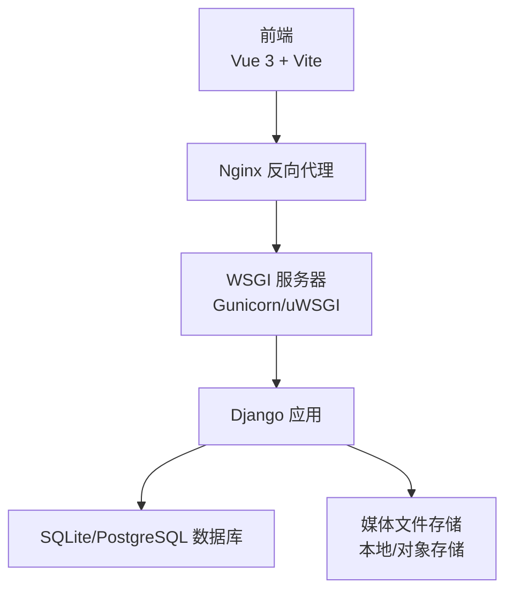
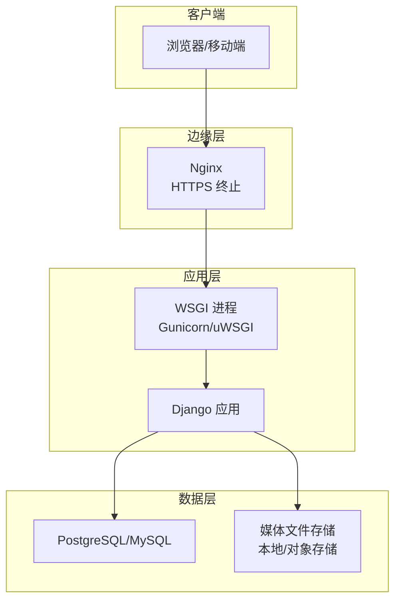
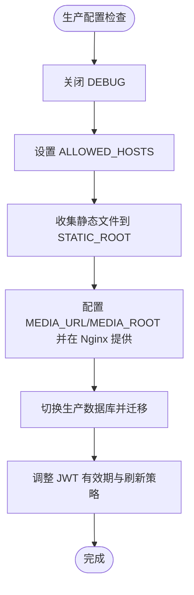
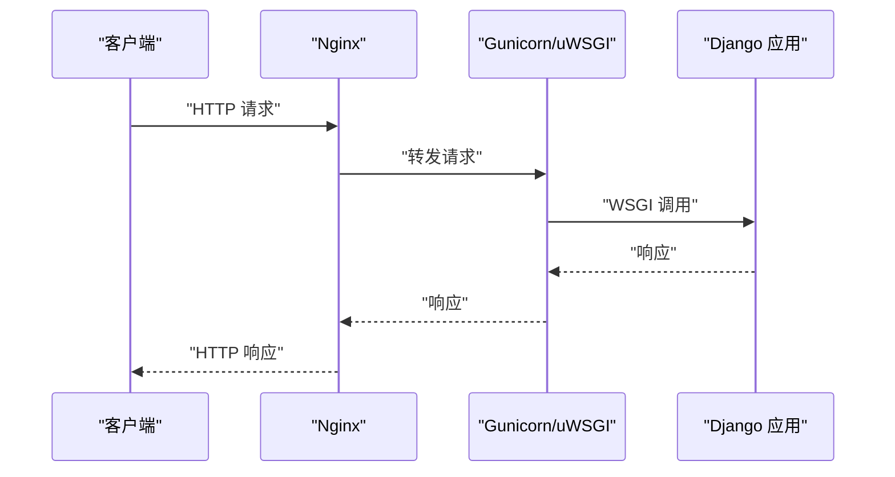
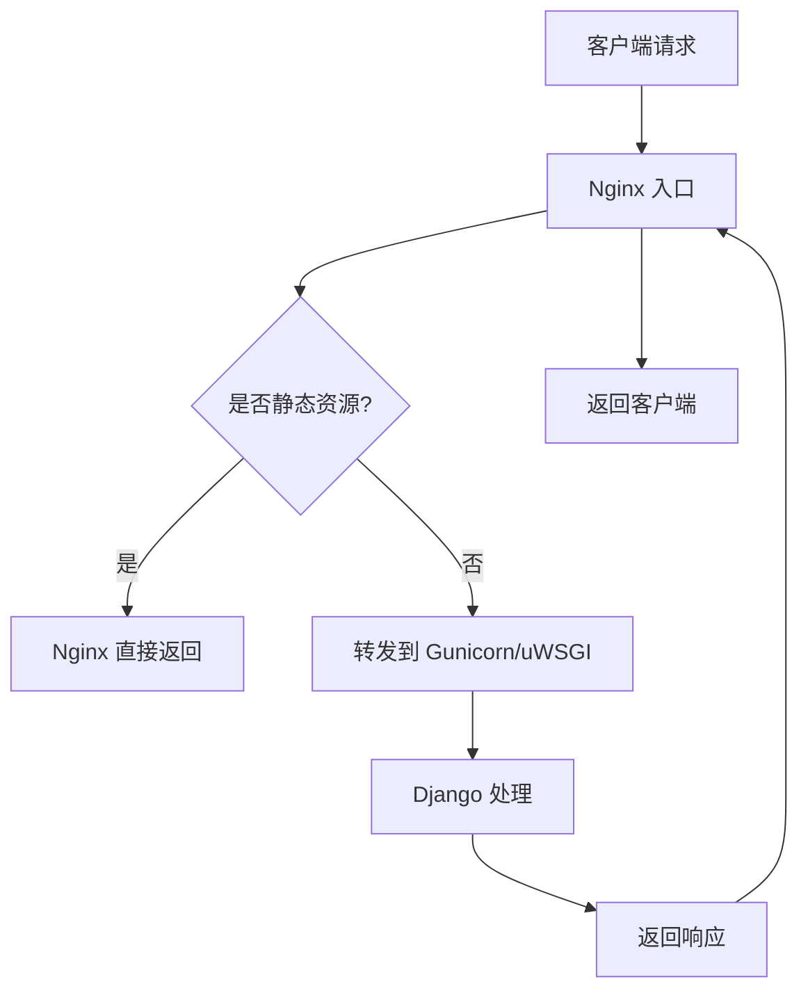
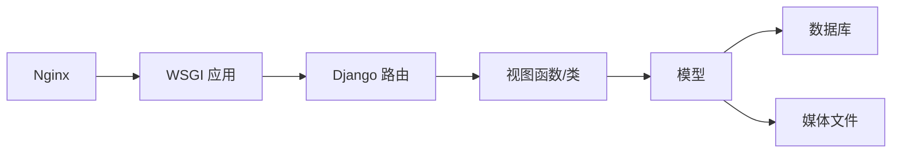

# 生产环境部署

<cite>
**本文引用的文件**
- [settings.py](file://backend/backend/settings.py)
- [wsgi.py](file://backend/backend/wsgi.py)
- [asgi.py](file://backend/backend/asgi.py)
- [urls.py](file://backend/backend/urls.py)
- [urls.py](file://backend/web/urls.py)
- [user.py](file://backend/web/models/user.py)
- [character.py](file://backend/web/models/character.py)
- [login.py](file://backend/web/views/user/account/login.py)
- [register.py](file://backend/web/views/user/account/register.py)
- [create.py](file://backend/web/views/create/character/create.py)
- [photo.py](file://backend/web/views/utils/photo.py)
- [admin.py](file://backend/web/admin.py)
- [manage.py](file://backend/manage.py)
- [package.json](file://frontend/package.json)
</cite>

## 目录
1. [简介](#简介)
2. [项目结构](#项目结构)
3. [核心组件](#核心组件)
4. [架构总览](#架构总览)
5. [详细组件分析](#详细组件分析)
6. [依赖分析](#依赖分析)
7. [性能考虑](#性能考虑)
8. [故障排查指南](#故障排查指南)
9. [结论](#结论)
10. [附录](#附录)

## 简介
本文件面向LLM_AIfriends项目的生产环境部署，围绕服务器准备、域名与SSL配置、Django应用生产配置、WSGI服务器（Gunicorn/uWSGI）、Nginx反向代理与负载均衡、数据库生产配置、安全加固与性能优化、部署脚本与自动化流程、监控告警等方面进行系统化说明。文档同时结合仓库中的实际配置文件，给出可操作的落地建议与最佳实践。

## 项目结构
项目采用前后端分离架构：前端基于Vue 3与Vite构建，后端基于Django，提供REST API与少量模板渲染；静态资源由前端构建产出，通过Nginx提供服务；Django负责业务逻辑与数据持久化。

**章节来源**
- [package.json:1-30](file://frontend/package.json#L1-L30)
- [urls.py:1-38](file://backend/backend/urls.py#L1-L38)
- [urls.py:1-33](file://backend/web/urls.py#L1-L33)

## 核心组件
- Django后端：提供REST接口、用户认证（JWT）、角色管理、图片上传与存储等能力。
- 媒体文件：用户头像、角色头像与背景图，统一存储于MEDIA_ROOT目录。
- 静态资源：前端构建产物，由Nginx直接提供。
- 认证体系：基于DRF SimpleJWT的访问令牌与刷新令牌机制，配合Cookie存储刷新令牌。

**章节来源**
- [settings.py:79-84](file://backend/backend/settings.py#L79-L84)
- [settings.py:136-151](file://backend/backend/settings.py#L136-L151)
- [user.py:14-23](file://backend/web/models/user.py#L14-L23)
- [character.py:21-32](file://backend/web/models/character.py#L21-L32)

## 架构总览
生产环境典型拓扑如下：
- Nginx作为入口，负责HTTPS终止、静态资源分发、反向代理到WSGI进程。
- Gunicorn/uWSGI承载Django应用，多进程/多线程运行以提升并发。
- 数据库存储在生产数据库（推荐PostgreSQL），媒体文件可使用本地磁盘或对象存储。
- 前端构建产物放置于Nginx静态目录，通过CDN加速更佳。

## 详细组件分析

### Django生产配置要点
- 关闭DEBUG与调整ALLOWED_HOSTS
  - 将DEBUG设为False，避免泄露敏感信息。
  - 明确设置ALLOWED_HOSTS为生产域名列表，防止Host头攻击。
- 安全中间件与CORS
  - 确保SecurityMiddleware、CSRF、XFrameOptions等中间件顺序正确。
  - CORS允许来源应限定为生产前端域名，且开启凭据支持。
- 静态文件与媒体文件
  - 生产阶段需收集静态文件至STATIC_ROOT，Nginx直接提供静态资源。
  - 媒体文件路径与访问URL需与Nginx配置一致，避免404。
- 数据库
  - SQLite适合开发测试，生产建议迁移到PostgreSQL/MySQL，启用连接池与只读副本。
- JWT与认证
  - 调整令牌有效期与刷新策略，确保安全与体验平衡。
  - 登录/注册接口返回访问令牌与刷新令牌，刷新令牌通过安全HttpOnly Cookie存储。

**图表来源**
- [settings.py:25-28](file://backend/backend/settings.py#L25-L28)
- [settings.py:121-131](file://backend/backend/settings.py#L121-L131)
- [settings.py:79-84](file://backend/backend/settings.py#L79-L84)
- [settings.py:136-151](file://backend/backend/settings.py#L136-L151)

**章节来源**
- [settings.py:25-28](file://backend/backend/settings.py#L25-L28)
- [settings.py:121-131](file://backend/backend/settings.py#L121-L131)
- [settings.py:79-84](file://backend/backend/settings.py#L79-L84)
- [settings.py:136-151](file://backend/backend/settings.py#L136-L151)

### WSGI服务器（Gunicorn/uWSGI）配置
- Gunicorn
  - 进程数与线程数：根据CPU核数与业务特性配置worker数量与threads。
  - 绑定地址：监听Unix Socket或内网IP:端口，避免直接暴露公网。
  - 日志：分离access/error日志，便于问题定位。
  - 进程管理：使用systemd或Supervisor托管，实现自动重启与健康检查。
- uWSGI
  - 使用ini配置文件，定义socket、processes、threads、logto等参数。
  - 与Nginx通过uwsgi_pass通信，注意传输编码与超时设置。

**图表来源**
- [wsgi.py:10-17](file://backend/backend/wsgi.py#L10-L17)
- [urls.py:1-38](file://backend/backend/urls.py#L1-L38)

**章节来源**
- [wsgi.py:10-17](file://backend/backend/wsgi.py#L10-L17)
- [urls.py:1-38](file://backend/backend/urls.py#L1-L38)

### Nginx反向代理与负载均衡
- HTTPS终止
  - 使用Let’s Encrypt或商业证书，启用TLS 1.3与现代加密套件。
  - 强制HTTP重定向HTTPS，开启HSTS。
- 静态资源
  - 前端构建产物放置于Nginx静态目录，设置长期缓存与压缩。
- 反向代理
  - 将/api/*代理到WSGI进程，静态资源/*.js/*.css/*.png等由Nginx直返。
  - 启用gzip/HTTP/2，合理设置client_max_body_size以适配大文件上传。
- 负载均衡
  - 多实例Gunicorn/uWSGI横向扩展，Nginx upstream轮询或健康检查。
  - 结合Keepalived/VRRP实现高可用。

**图表来源**
- [urls.py:28-38](file://backend/backend/urls.py#L28-L38)
- [urls.py:16-32](file://backend/web/urls.py#L16-L32)

**章节来源**
- [urls.py:28-38](file://backend/backend/urls.py#L28-L38)
- [urls.py:16-32](file://backend/web/urls.py#L16-L32)

### 数据库生产配置
- 存储引擎与版本
  - 推荐PostgreSQL 14+或MySQL 8+，启用外键约束与事务隔离。
- 连接池与只读副本
  - 使用pgBouncer/MySQL Router等连接池，主从分离，读写分离。
- 备份与恢复
  - 定期逻辑备份与物理快照，验证恢复流程。
- 性能调优
  - 合理索引、慢查询日志、统计信息更新、连接数上限。

**章节来源**
- [settings.py:79-84](file://backend/backend/settings.py#L79-L84)

### 安全加固措施
- Django层面
  - 设置安全Cookie标志（secure、httponly、samesite），强制HTTPS。
  - 严格CORS配置，限制来源与方法。
  - 限制文件上传类型与大小，校验文件内容。
- Nginx层面
  - 禁止列出目录，隐藏版本号，限制请求速率。
- WAF/DDoS防护
  - 集成Cloudflare或阿里云WAF，开启DDoS防护与CC攻击拦截。
- 审计与日志
  - 记录登录、敏感操作、异常错误，定期审计。

**章节来源**
- [login.py:30-40](file://backend/web/views/user/account/login.py#L30-L40)
- [register.py:33-40](file://backend/web/views/user/account/register.py#L33-L40)
- [settings.py:154-159](file://backend/backend/settings.py#L154-L159)

### 性能优化方案
- 静态资源
  - CDN分发、Gzip/Brotli压缩、缓存控制、按需加载。
- 数据库
  - 查询优化、索引优化、连接池、读写分离、分表分库。
- 应用层
  - 缓存（Redis/Memcached）、异步任务（Celery）、并发模型选择。
- Nginx
  - keepalive、sendfile、tcp_nodelay、限流与队列长度。

**章节来源**
- [urls.py:28-38](file://backend/backend/urls.py#L28-L38)
- [settings.py:121-131](file://backend/backend/settings.py#L121-L131)

### 部署脚本与自动化流程
- 构建与发布
  - 前端：npm run build 产出静态资源，拷贝至Nginx目录。
  - 后端：pip安装依赖，迁移数据库，收集静态文件，重启WSGI。
- 自动化
  - CI/CD流水线：GitLab CI/Jenkins/Azure DevOps，触发构建、测试、打包、部署。
  - 蓝绿/金丝雀发布：逐步替换实例，健康检查失败回滚。
- 配置管理
  - 环境变量注入（如数据库连接、密钥、域名），避免硬编码。

**章节来源**
- [manage.py:1-23](file://backend/manage.py#L1-L23)
- [package.json:9-13](file://frontend/package.json#L9-L13)

### 监控告警配置
- 指标采集
  - 应用：QPS、响应时间、错误率、内存/CPU使用率。
  - 数据库：连接数、锁等待、慢查询、缓冲池命中率。
  - 基础设施：磁盘空间、网络带宽、负载。
- 告警策略
  - 错误率阈值、响应时间上限、资源使用率峰值、服务不可用。
- 工具选型
  - Prometheus + Grafana、ELK、DataDog/NewRelic、Sentry。

## 依赖分析
Django应用的核心依赖链路如下：请求经Nginx进入，交由WSGI（Gunicorn/uWSGI）执行，Django路由到具体视图，视图访问模型与存储，最终返回响应。

**图表来源**
- [urls.py:1-38](file://backend/backend/urls.py#L1-L38)
- [urls.py:1-33](file://backend/web/urls.py#L1-L33)
- [wsgi.py:10-17](file://backend/backend/wsgi.py#L10-L17)

**章节来源**
- [urls.py:1-38](file://backend/backend/urls.py#L1-L38)
- [urls.py:1-33](file://backend/web/urls.py#L1-L33)
- [wsgi.py:10-17](file://backend/backend/wsgi.py#L10-L17)

## 性能考虑
- 上传与存储
  - 图片上传建议限制尺寸与格式，使用缩略图与CDN加速。
  - 媒体文件可迁移至对象存储（OSS/COS/S3），降低单机压力。
- 缓存策略
  - 对热点接口与模板片段进行缓存，合理设置TTL。
- 并发与伸缩
  - 根据QPS与RT动态扩缩容，结合自动伸缩组与负载均衡。

## 故障排查指南
- 常见问题
  - 404/403：检查Nginx静态资源路径与权限、ALLOWED_HOSTS配置。
  - 502/504：检查WSGI进程状态、超时配置、上游健康。
  - 500错误：查看Django日志与异常堆栈，确认数据库连通性与迁移状态。
  - 文件上传失败：检查MEDIA_ROOT权限、Nginx client_max_body_size、CSRF与CORS。
- 定位手段
  - Nginx access/error日志、WSGI日志、Django日志、数据库慢查询日志。
  - 使用curl/ab/wrk进行压测，定位瓶颈。

**章节来源**
- [urls.py:28-38](file://backend/backend/urls.py#L28-L38)
- [login.py:30-40](file://backend/web/views/user/account/login.py#L30-L40)
- [register.py:33-40](file://backend/web/views/user/account/register.py#L33-L40)
- [photo.py:6-11](file://backend/web/views/utils/photo.py#L6-L11)

## 结论
生产环境部署需要从前端构建、Nginx配置、WSGI进程、数据库与存储、安全与性能优化、自动化与监控告警等多个维度协同推进。本文基于仓库现有配置，给出了可落地的实施清单与最佳实践，建议在上线前完成端到端演练与压测，确保稳定性与可维护性。

## 附录
- 关键配置项速查
  - Django：DEBUG、ALLOWED_HOSTS、DATABASES、STATIC_ROOT、MEDIA_URL/MEDIA_ROOT、REST_FRAMEWORK、SIMPLE_JWT、CORS_ALLOWED_ORIGINS
  - Nginx：server_name、listen、ssl_certificate、location /static、location /media、proxy_pass、client_max_body_size
  - WSGI：workers、threads、bind、accesslog、errorlog、max_requests