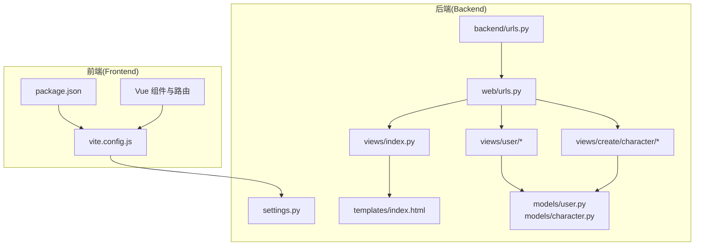
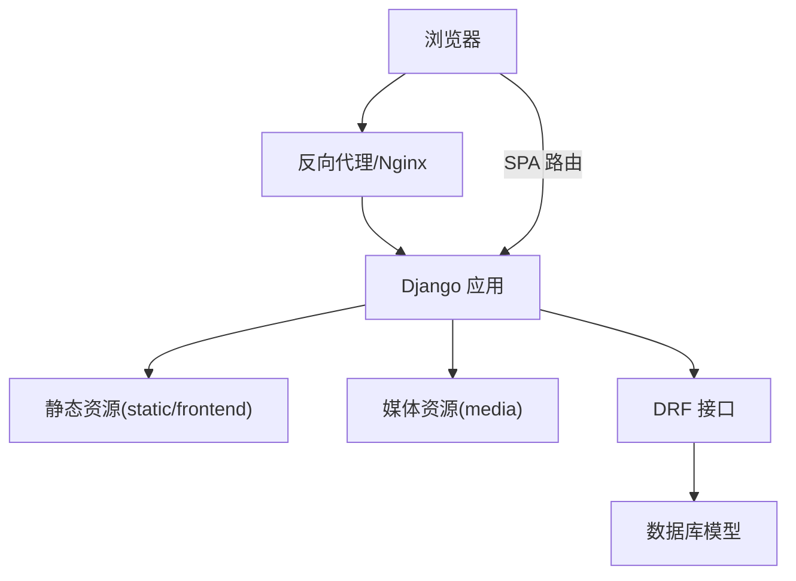
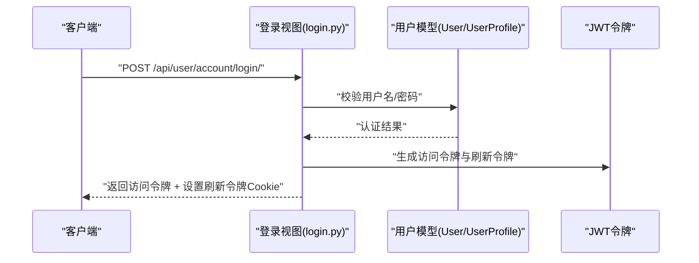
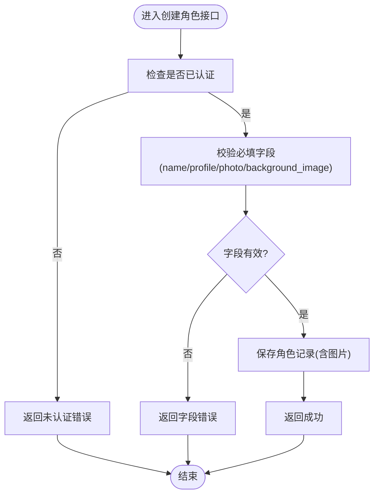
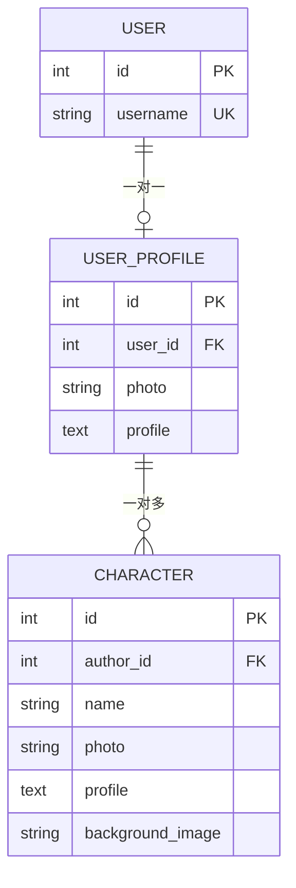
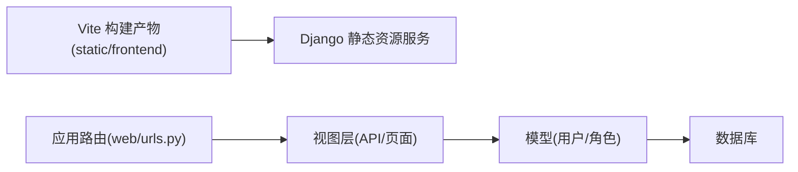

# 部署指南

<cite>
**本文引用的文件**
- [backend/backend/settings.py](file://backend/backend/settings.py)
- [backend/backend/urls.py](file://backend/backend/urls.py)
- [backend/manage.py](file://backend/manage.py)
- [backend/web/urls.py](file://backend/web/urls.py)
- [backend/web/views/index.py](file://backend/web/views/index.py)
- [backend/web/templates/index.html](file://backend/web/templates/index.html)
- [backend/web/models/character.py](file://backend/web/models/character.py)
- [backend/web/models/user.py](file://backend/web/models/user.py)
- [backend/web/views/user/account/login.py](file://backend/web/views/user/account/login.py)
- [backend/web/views/user/account/register.py](file://backend/web/views/user/account/register.py)
- [backend/web/views/create/character/create.py](file://backend/web/views/create/character/create.py)
- [frontend/package.json](file://frontend/package.json)
- [frontend/vite.config.js](file://frontend/vite.config.js)
</cite>

## 目录
1. [简介](#简介)
2. [项目结构](#项目结构)
3. [核心组件](#核心组件)
4. [架构总览](#架构总览)
5. [详细组件分析](#详细组件分析)
6. [依赖分析](#依赖分析)
7. [性能考虑](#性能考虑)
8. [故障排查指南](#故障排查指南)
9. [结论](#结论)
10. [附录](#附录)

## 简介
本指南面向 LLM_AIfriends 的部署与运维，覆盖开发与生产环境的准备、服务器与网络配置（域名与 SSL）、Django 应用部署、静态文件与媒体文件处理、数据库迁移策略、前端构建与分发、CDN 与缓存策略、容器化与负载均衡、监控告警、部署脚本、回滚策略与运维最佳实践。内容基于仓库中现有配置与代码进行提炼与扩展，确保可操作性与可追溯性。

## 项目结构
项目采用前后端分离架构：前端使用 Vue 3 + Vite 构建，打包产物输出至 Django 的 static 目录；后端为 Django + Django REST Framework，提供用户认证、角色管理等接口，并通过模板渲染 SPA 入口页面。

图表来源
- [frontend/package.json:1-30](file://frontend/package.json#L1-L30)
- [frontend/vite.config.js:1-26](file://frontend/vite.config.js#L1-L26)
- [backend/backend/urls.py:17-37](file://backend/backend/urls.py#L17-L37)
- [backend/web/urls.py:1-33](file://backend/web/urls.py#L1-L33)
- [backend/web/views/index.py:1-6](file://backend/web/views/index.py#L1-L6)
- [backend/web/templates/index.html:1-17](file://backend/web/templates/index.html#L1-L17)
- [backend/web/models/user.py:1-23](file://backend/web/models/user.py#L1-L23)
- [backend/web/models/character.py:1-32](file://backend/web/models/character.py#L1-L32)

章节来源
- [frontend/package.json:1-30](file://frontend/package.json#L1-L30)
- [frontend/vite.config.js:1-26](file://frontend/vite.config.js#L1-L26)
- [backend/backend/urls.py:17-37](file://backend/backend/urls.py#L17-L37)
- [backend/web/urls.py:1-33](file://backend/web/urls.py#L1-L33)
- [backend/web/views/index.py:1-6](file://backend/web/views/index.py#L1-L6)
- [backend/web/templates/index.html:1-17](file://backend/web/templates/index.html#L1-L17)
- [backend/web/models/user.py:1-23](file://backend/web/models/user.py#L1-L23)
- [backend/web/models/character.py:1-32](file://backend/web/models/character.py#L1-L32)

## 核心组件
- 前端构建与分发
  - 使用 Vite 进行开发与生产构建，打包目录输出到 Django 的 static 目录，便于由 Django 统一提供静态资源服务。
  - 参考路径：[frontend/vite.config.js:16-19](file://frontend/vite.config.js#L16-L19)
- 后端应用与路由
  - Django 项目入口与根路由定义，包含后台管理、应用路由与开发阶段的静态文件映射。
  - 参考路径：[backend/backend/urls.py:22-37](file://backend/backend/urls.py#L22-L37)
- 认证与会话
  - 使用 JWT（SimpleJWT）进行认证，登录/注册接口返回访问令牌与刷新令牌，并通过 Cookie 存储刷新令牌。
  - 参考路径：[backend/web/views/user/account/login.py:9-46](file://backend/web/views/user/account/login.py#L9-L46)，[backend/web/views/user/account/register.py:9-45](file://backend/web/views/user/account/register.py#L9-L45)
- 数据模型
  - 用户资料与角色模型，支持头像与背景图上传，文件存储路径按作者与类型组织。
  - 参考路径：[backend/web/models/user.py:14-23](file://backend/web/models/user.py#L14-L23)，[backend/web/models/character.py:21-32](file://backend/web/models/character.py#L21-L32)
- SPA 入口与模板
  - 后端模板渲染 Vue SPA 入口页面，静态资源由 Django 模板标签加载。
  - 参考路径：[backend/web/views/index.py:1-6](file://backend/web/views/index.py#L1-L6)，[backend/web/templates/index.html:1-17](file://backend/web/templates/index.html#L1-L17)

章节来源
- [frontend/vite.config.js:16-19](file://frontend/vite.config.js#L16-L19)
- [backend/backend/urls.py:22-37](file://backend/backend/urls.py#L22-L37)
- [backend/web/views/user/account/login.py:9-46](file://backend/web/views/user/account/login.py#L9-L46)
- [backend/web/views/user/account/register.py:9-45](file://backend/web/views/user/account/register.py#L9-L45)
- [backend/web/models/user.py:14-23](file://backend/web/models/user.py#L14-L23)
- [backend/web/models/character.py:21-32](file://backend/web/models/character.py#L21-L32)
- [backend/web/views/index.py:1-6](file://backend/web/views/index.py#L1-L6)
- [backend/web/templates/index.html:1-17](file://backend/web/templates/index.html#L1-L17)

## 架构总览
下图展示从浏览器到后端接口与静态资源的整体交互流程，以及开发与生产阶段的差异点。

图表来源
- [backend/backend/urls.py:28-37](file://backend/backend/urls.py#L28-L37)
- [backend/web/urls.py:16-32](file://backend/web/urls.py#L16-L32)
- [backend/web/templates/index.html:10-11](file://backend/web/templates/index.html#L10-L11)

## 详细组件分析

### 前端构建与静态资源
- 构建目标
  - Vite 将构建产物输出到 Django 的 static 目录，以便统一由 Django 提供静态资源服务。
  - 参考路径：[frontend/vite.config.js:16-19](file://frontend/vite.config.js#L16-L19)
- 开发与生产差异
  - 开发阶段由 Vite Dev Server 提供资源；生产阶段由 Django 提供静态资源。
  - 参考路径：[backend/backend/urls.py:28-37](file://backend/backend/urls.py#L28-L37)
- 依赖与脚本
  - 前端依赖与构建脚本定义于 package.json。
  - 参考路径：[frontend/package.json:9-13](file://frontend/package.json#L9-L13)

章节来源
- [frontend/vite.config.js:16-19](file://frontend/vite.config.js#L16-L19)
- [backend/backend/urls.py:28-37](file://backend/backend/urls.py#L28-L37)
- [frontend/package.json:9-13](file://frontend/package.json#L9-L13)

### Django 应用与路由
- 根路由
  - 根路径包含后台管理与应用路由；开发阶段额外挂载静态资源映射。
  - 参考路径：[backend/backend/urls.py:22-37](file://backend/backend/urls.py#L22-L37)
- 应用路由
  - 用户账户、个人资料、角色创建等 API 路由集中于应用路由模块。
  - 参考路径：[backend/web/urls.py:16-32](file://backend/web/urls.py#L16-L32)
- SPA 入口
  - 未匹配到 API 的请求交由后端模板渲染 SPA 入口页面。
  - 参考路径：[backend/web/urls.py:29-32](file://backend/web/urls.py#L29-L32)，[backend/web/views/index.py:1-6](file://backend/web/views/index.py#L1-L6)，[backend/web/templates/index.html:1-17](file://backend/web/templates/index.html#L1-L17)

章节来源
- [backend/backend/urls.py:22-37](file://backend/backend/urls.py#L22-L37)
- [backend/web/urls.py:16-32](file://backend/web/urls.py#L16-L32)
- [backend/web/views/index.py:1-6](file://backend/web/views/index.py#L1-L6)
- [backend/web/templates/index.html:1-17](file://backend/web/templates/index.html#L1-L17)

### 认证与会话（JWT）
- 登录/注册流程
  - 校验用户名与密码，成功后签发 JWT 访问令牌与刷新令牌，并通过 Cookie 存储刷新令牌。
  - 参考路径：[backend/web/views/user/account/login.py:9-46](file://backend/web/views/user/account/login.py#L9-L46)，[backend/web/views/user/account/register.py:9-45](file://backend/web/views/user/account/register.py#L9-L45)
- 安全参数
  - 刷新令牌 Cookie 设置 httponly、sameSite、secure 等安全属性。
  - 参考路径：[backend/web/views/user/account/login.py:30-39](file://backend/web/views/user/account/login.py#L30-L39)，[backend/web/views/user/account/register.py:33-40](file://backend/web/views/user/account/register.py#L33-L40)
- 令牌生命周期
  - 访问令牌与刷新令牌的生命周期与轮换策略在设置中定义。
  - 参考路径：[backend/backend/settings.py:142-151](file://backend/backend/settings.py#L142-L151)

图表来源
- [backend/web/views/user/account/login.py:9-46](file://backend/web/views/user/account/login.py#L9-L46)
- [backend/web/models/user.py:14-23](file://backend/web/models/user.py#L14-L23)

章节来源
- [backend/web/views/user/account/login.py:9-46](file://backend/web/views/user/account/login.py#L9-L46)
- [backend/web/views/user/account/register.py:9-45](file://backend/web/views/user/account/register.py#L9-L45)
- [backend/backend/settings.py:142-151](file://backend/backend/settings.py#L142-L151)
- [backend/web/models/user.py:14-23](file://backend/web/models/user.py#L14-L23)

### 角色创建与媒体上传
- 权限控制
  - 创建角色接口要求已认证用户。
  - 参考路径：[backend/web/views/create/character/create.py:9-11](file://backend/web/views/create/character/create.py#L9-L11)
- 文件上传
  - 头像与背景图上传，文件路径按作者与类型生成唯一名称。
  - 参考路径：[backend/web/models/character.py:9-18](file://backend/web/models/character.py#L9-L18)，[backend/web/models/character.py:21-32](file://backend/web/models/character.py#L21-L32)

图表来源
- [backend/web/views/create/character/create.py:9-51](file://backend/web/views/create/character/create.py#L9-L51)
- [backend/web/models/character.py:9-18](file://backend/web/models/character.py#L9-L18)

章节来源
- [backend/web/views/create/character/create.py:9-51](file://backend/web/views/create/character/create.py#L9-L51)
- [backend/web/models/character.py:9-18](file://backend/web/models/character.py#L9-L18)

### 数据模型与文件存储
- 用户资料模型
  - 关联 Django 内置用户，支持头像上传与个人简介。
  - 参考路径：[backend/web/models/user.py:14-23](file://backend/web/models/user.py#L14-L23)
- 角色模型
  - 角色与作者关联，支持头像与背景图上传。
  - 参考路径：[backend/web/models/character.py:21-32](file://backend/web/models/character.py#L21-L32)

图表来源
- [backend/web/models/user.py:14-23](file://backend/web/models/user.py#L14-L23)
- [backend/web/models/character.py:21-32](file://backend/web/models/character.py#L21-L32)

章节来源
- [backend/web/models/user.py:14-23](file://backend/web/models/user.py#L14-L23)
- [backend/web/models/character.py:21-32](file://backend/web/models/character.py#L21-L32)

## 依赖分析
- 前端到后端
  - 前端通过 Vite 构建产物由 Django 提供；路由层面由后端统一处理 API 与 SPA 入口。
- 后端内部
  - 应用路由聚合各功能视图；模板渲染入口页面；模型负责数据与文件存储。

图表来源
- [frontend/vite.config.js:16-19](file://frontend/vite.config.js#L16-L19)
- [backend/web/urls.py:16-32](file://backend/web/urls.py#L16-L32)
- [backend/web/models/user.py:14-23](file://backend/web/models/user.py#L14-L23)
- [backend/web/models/character.py:21-32](file://backend/web/models/character.py#L21-L32)

章节来源
- [frontend/vite.config.js:16-19](file://frontend/vite.config.js#L16-L19)
- [backend/web/urls.py:16-32](file://backend/web/urls.py#L16-L32)
- [backend/web/models/user.py:14-23](file://backend/web/models/user.py#L14-L23)
- [backend/web/models/character.py:21-32](file://backend/web/models/character.py#L21-L32)

## 性能考虑
- 静态资源
  - 生产环境建议由反向代理（如 Nginx）直接提供静态资源，减少 Django 压力。
  - 参考路径：[backend/backend/urls.py:28-37](file://backend/backend/urls.py#L28-L37)
- 媒体文件
  - 媒体文件建议单独由反向代理提供或接入对象存储 CDN，降低应用服务器 IO 压力。
  - 参考路径：[backend/backend/settings.py:129-131](file://backend/backend/settings.py#L129-L131)
- 缓存策略
  - 对于不常变动的静态资源，可在反向代理或 CDN 层设置长缓存；对动态接口可结合缓存中间件或 CDN 缓存策略。
  - 参考路径：[backend/backend/settings.py:118-131](file://backend/backend/settings.py#L118-L131)
- 数据库
  - 在高并发场景下，建议使用独立数据库实例并开启连接池与读写分离。
  - 参考路径：[backend/backend/settings.py:79-84](file://backend/backend/settings.py#L79-L84)

## 故障排查指南
- 认证失败
  - 检查用户名/密码是否为空，确认用户是否存在且密码正确。
  - 参考路径：[backend/web/views/user/account/login.py:10-18](file://backend/web/views/user/account/login.py#L10-L18)
- 注册失败
  - 检查用户名是否重复，注册流程是否抛出异常。
  - 参考路径：[backend/web/views/user/account/register.py:10-22](file://backend/web/views/user/account/register.py#L10-L22)
- 角色创建失败
  - 检查必填字段是否完整，图片是否上传成功。
  - 参考路径：[backend/web/views/create/character/create.py:11-36](file://backend/web/views/create/character/create.py#L11-L36)
- 静态资源 404
  - 确认前端已构建并将产物放入 Django static 目录；生产环境需由反向代理提供静态资源。
  - 参考路径：[frontend/vite.config.js:16-19](file://frontend/vite.config.js#L16-L19)，[backend/backend/urls.py:28-37](file://backend/backend/urls.py#L28-L37)
- 媒体资源 404
  - 确认 MEDIA_URL/MEDIA_ROOT 配置正确，且反向代理已映射媒体目录。
  - 参考路径：[backend/backend/settings.py:129-131](file://backend/backend/settings.py#L129-L131)

章节来源
- [backend/web/views/user/account/login.py:10-18](file://backend/web/views/user/account/login.py#L10-L18)
- [backend/web/views/user/account/register.py:10-22](file://backend/web/views/user/account/register.py#L10-L22)
- [backend/web/views/create/character/create.py:11-36](file://backend/web/views/create/character/create.py#L11-L36)
- [frontend/vite.config.js:16-19](file://frontend/vite.config.js#L16-L19)
- [backend/backend/urls.py:28-37](file://backend/backend/urls.py#L28-L37)
- [backend/backend/settings.py:129-131](file://backend/backend/settings.py#L129-L131)

## 结论
本指南基于仓库现有配置与代码，给出了从开发到生产的部署要点与实施建议。建议在生产环境中完善反向代理、SSL、CDN、缓存与监控告警体系，并制定标准化的部署脚本与回滚策略以保障稳定性与可维护性。

## 附录

### 开发环境与生产环境配置要点
- 开发环境
  - 使用 Django 默认开发服务器与 Vite Dev Server；静态资源由 Django 开发阶段的静态映射提供。
  - 参考路径：[backend/backend/urls.py:28-37](file://backend/backend/urls.py#L28-L37)
- 生产环境
  - 前端构建产物放入 Django static 目录；由反向代理统一提供静态与媒体资源；数据库切换为生产数据库。
  - 参考路径：[frontend/vite.config.js:16-19](file://frontend/vite.config.js#L16-L19)，[backend/backend/settings.py:79-84](file://backend/backend/settings.py#L79-L84)

章节来源
- [backend/backend/urls.py:28-37](file://backend/backend/urls.py#L28-L37)
- [frontend/vite.config.js:16-19](file://frontend/vite.config.js#L16-L19)
- [backend/backend/settings.py:79-84](file://backend/backend/settings.py#L79-L84)

### 服务器环境准备、域名与 SSL
- 反向代理与域名
  - 建议使用 Nginx/Apache 作为反向代理，配置域名解析与 HTTPS。
- SSL 证书
  - 使用 Let’s Encrypt 或商业证书，启用 HSTS 与现代加密套件。
- 静态与媒体
  - 将静态与媒体目录交由反向代理提供，或接入 CDN 与对象存储。

[本节为通用运维建议，不直接分析具体文件，故无“章节来源”]

### Django 应用部署、静态文件与数据库迁移
- 部署步骤
  - 安装依赖、收集静态文件、执行数据库迁移、启动应用服务。
  - 参考路径：[backend/manage.py:7-18](file://backend/manage.py#L7-L18)
- 静态文件
  - 生产环境建议由反向代理提供静态资源，避免 Django 处理静态请求。
  - 参考路径：[backend/backend/urls.py:28-37](file://backend/backend/urls.py#L28-L37)
- 数据库迁移
  - 使用 Django 管理命令执行迁移，确保生产数据库版本一致。
  - 参考路径：[backend/manage.py:11-12](file://backend/manage.py#L11-L12)

章节来源
- [backend/manage.py:7-18](file://backend/manage.py#L7-L18)
- [backend/backend/urls.py:28-37](file://backend/backend/urls.py#L28-L37)

### 前端构建优化、CDN 与缓存
- 构建优化
  - 使用 Vite 生产模式构建，启用压缩与 Tree-shaking。
  - 参考路径：[frontend/package.json:9-13](file://frontend/package.json#L9-L13)
- CDN 与缓存
  - 将静态资源托管至 CDN，设置合适的缓存策略与版本号。
  - 参考路径：[frontend/vite.config.js:16-19](file://frontend/vite.config.js#L16-L19)

章节来源
- [frontend/package.json:9-13](file://frontend/package.json#L9-L13)
- [frontend/vite.config.js:16-19](file://frontend/vite.config.js#L16-L19)

### 容器化部署、负载均衡与监控告警
- 容器化
  - 建议将 Django 应用与数据库分别容器化，使用 Docker Compose 编排。
- 负载均衡
  - 使用反向代理实现多实例负载均衡与健康检查。
- 监控告警
  - 部署日志采集、指标监控与告警系统，覆盖应用、数据库与静态资源。

[本节为通用运维建议，不直接分析具体文件，故无“章节来源”]

### 部署脚本、回滚策略与运维最佳实践
- 部署脚本
  - 建议编写自动化脚本完成依赖安装、静态收集、数据库迁移与服务重启。
- 回滚策略
  - 保留上一版本静态资源与数据库备份，快速回退。
- 最佳实践
  - 分离开发/测试/生产配置；严格权限与密钥管理；定期备份与演练。

[本节为通用运维建议，不直接分析具体文件，故无“章节来源”]