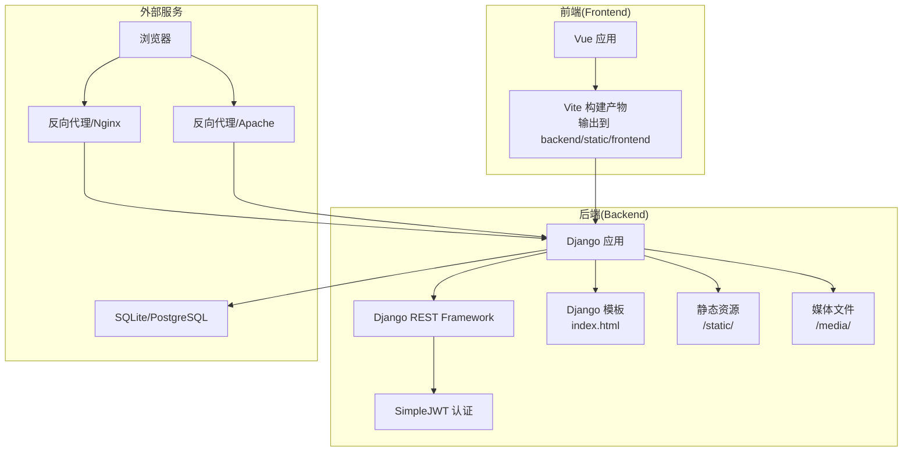
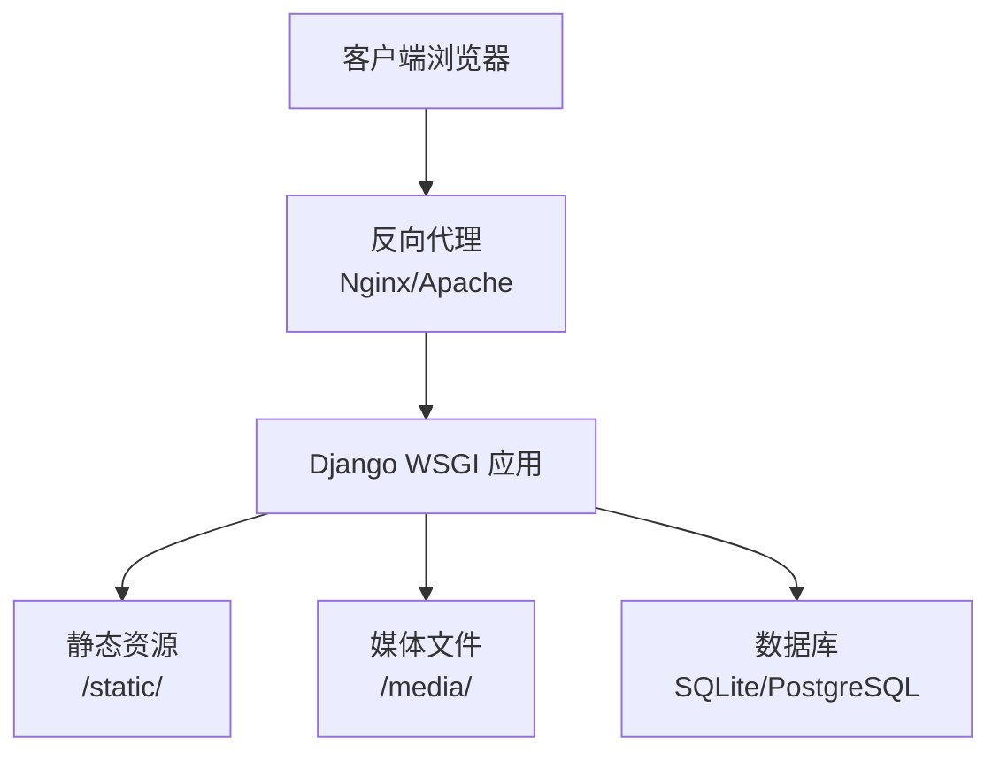
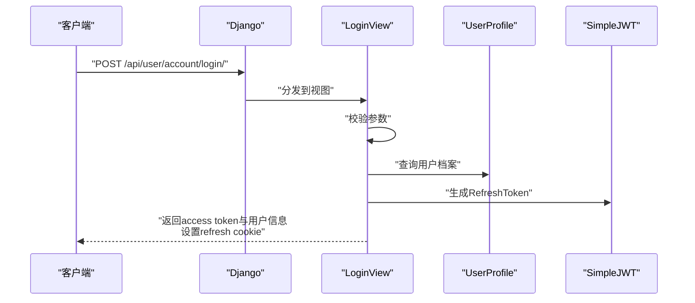

# 部署指南

<cite>
**本文引用的文件**
- [backend/backend/settings.py](file://backend/backend/settings.py)
- [backend/backend/urls.py](file://backend/backend/urls.py)
- [backend/manage.py](file://backend/manage.py)
- [backend/web/urls.py](file://backend/web/urls.py)
- [backend/web/views/index.py](file://backend/web/views/index.py)
- [backend/web/templates/index.html](file://backend/web/templates/index.html)
- [backend/web/models/user.py](file://backend/web/models/user.py)
- [backend/web/views/utils/photo.py](file://backend/web/views/utils/photo.py)
- [backend/web/views/user/account/login.py](file://backend/web/views/user/account/login.py)
- [backend/web/views/user/account/register.py](file://backend/web/views/user/account/register.py)
- [backend/web/views/user/profile/update.py](file://backend/web/views/user/profile/update.py)
- [frontend/package.json](file://frontend/package.json)
- [frontend/vite.config.js](file://frontend/vite.config.js)
</cite>

## 目录
1. [简介](#简介)
2. [项目结构](#项目结构)
3. [核心组件](#核心组件)
4. [架构总览](#架构总览)
5. [详细组件分析](#详细组件分析)
6. [依赖分析](#依赖分析)
7. [性能考虑](#性能考虑)
8. [故障排除指南](#故障排除指南)
9. [结论](#结论)
10. [附录](#附录)

## 简介
本指南面向LLM_AIfriends项目的运维与开发团队，提供从开发到生产的完整部署流程，涵盖前端构建、后端Django服务、静态资源与媒体文件处理、数据库部署、环境变量管理、反向代理（Nginx/Apache）与SSL配置、容器化（Docker）与Kubernetes部署策略，以及监控、日志与故障排除建议。文档严格基于仓库现有配置文件进行分析与总结，避免臆测。

## 项目结构
项目采用前后端分离架构：前端使用Vite + Vue 3，后端使用Django + Django REST Framework，静态资源通过Vite构建后输出至Django的static目录，模板渲染入口由Django统一接管，媒体文件（如用户头像）存储于MEDIA_ROOT。

图表来源
- [frontend/vite.config.js:16-19](file://frontend/vite.config.js#L16-L19)
- [backend/backend/urls.py:23-37](file://backend/backend/urls.py#L23-L37)
- [backend/web/urls.py:10-23](file://backend/web/urls.py#L10-L23)
- [backend/web/templates/index.html:1-17](file://backend/web/templates/index.html#L1-L17)
- [backend/backend/settings.py:122-132](file://backend/backend/settings.py#L122-L132)

章节来源
- [frontend/vite.config.js:1-26](file://frontend/vite.config.js#L1-L26)
- [backend/backend/urls.py:1-38](file://backend/backend/urls.py#L1-L38)
- [backend/web/urls.py:1-24](file://backend/web/urls.py#L1-L24)
- [backend/web/templates/index.html:1-17](file://backend/web/templates/index.html#L1-L17)
- [backend/backend/settings.py:122-132](file://backend/backend/settings.py#L122-L132)

## 核心组件
- 前端构建与打包
  - 使用Vite进行开发与生产构建，构建产物输出到Django的static目录，供Django模板直接引用。
  - 关键配置参考：[frontend/vite.config.js:16-19](file://frontend/vite.config.js#L16-L19)
- 后端Web框架与路由
  - Django作为主应用，统一处理API与模板渲染；根路由包含API子路由与前端SPA兜底路由。
  - 关键配置参考：[backend/backend/urls.py:23-37](file://backend/backend/urls.py#L23-L37)、[backend/web/urls.py:10-23](file://backend/web/urls.py#L10-L23)
- 模板与静态资源
  - Django模板index.html加载Vite构建产物；开发阶段通过Django内置静态服务；生产阶段由Nginx/Apache提供静态与媒体文件。
  - 关键配置参考：[backend/web/templates/index.html:1-17](file://backend/web/templates/index.html#L1-L17)、[backend/backend/urls.py:28-37](file://backend/backend/urls.py#L28-L37)、[backend/backend/settings.py:122-132](file://backend/backend/settings.py#L122-L132)
- 认证与权限
  - 使用DRF + SimpleJWT实现认证；登录接口返回access token与refresh cookie；更新资料接口要求已认证。
  - 关键配置参考：[backend/backend/settings.py:136-151](file://backend/backend/settings.py#L136-L151)、[backend/web/views/user/account/login.py:9-46](file://backend/web/views/user/account/login.py#L9-L46)、[backend/web/views/user/profile/update.py:12-13](file://backend/web/views/user/profile/update.py#L12-L13)
- 数据模型与媒体文件
  - 用户档案模型支持头像上传与默认头像；提供旧头像清理逻辑以节省空间。
  - 关键配置参考：[backend/web/models/user.py:15-23](file://backend/web/models/user.py#L15-L23)、[backend/web/views/utils/photo.py:9-13](file://backend/web/views/utils/photo.py#L9-L13)

章节来源
- [frontend/vite.config.js:1-26](file://frontend/vite.config.js#L1-L26)
- [backend/backend/urls.py:1-38](file://backend/backend/urls.py#L1-L38)
- [backend/web/urls.py:1-24](file://backend/web/urls.py#L1-L24)
- [backend/web/templates/index.html:1-17](file://backend/web/templates/index.html#L1-L17)
- [backend/backend/settings.py:122-151](file://backend/backend/settings.py#L122-L151)
- [backend/web/views/user/account/login.py:1-92](file://backend/web/views/user/account/login.py#L1-L92)
- [backend/web/views/user/profile/update.py:1-63](file://backend/web/views/user/profile/update.py#L1-L63)
- [backend/web/models/user.py:1-23](file://backend/web/models/user.py#L1-L23)
- [backend/web/views/utils/photo.py:1-13](file://backend/web/views/utils/photo.py#L1-L13)

## 架构总览
下图展示生产环境典型拓扑：浏览器请求经Nginx/Apache反向代理转发至Django WSGI进程；静态与媒体文件由Nginx/Apache直接提供；数据库可选SQLite或PostgreSQL。

图表来源
- [backend/backend/urls.py:28-37](file://backend/backend/urls.py#L28-L37)
- [backend/backend/settings.py:122-132](file://backend/backend/settings.py#L122-L132)

## 详细组件分析

### 前端构建与集成
- 构建目标
  - Vite生产构建将产物输出到Django的static目录，确保模板可直接引用。
- 关键点
  - 输出目录需与Django的STATICFILES_DIRS或STATIC_ROOT保持一致，便于模板加载。
  - 开发阶段可直接访问Vite Dev Server；生产阶段由Nginx/Apache提供静态文件。
- 参考路径
  - [frontend/vite.config.js:16-19](file://frontend/vite.config.js#L16-L19)
  - [frontend/package.json:6-10](file://frontend/package.json#L6-L10)

章节来源
- [frontend/vite.config.js:1-26](file://frontend/vite.config.js#L1-L26)
- [frontend/package.json:1-30](file://frontend/package.json#L1-L30)

### 后端路由与模板渲染
- 路由设计
  - 根URL包含管理后台与业务API；SPA入口由Django模板index.html提供，配合前端路由实现单页应用。
- 静态与媒体服务
  - 开发模式下Django内置静态服务；生产模式由Nginx/Apache提供静态与媒体文件。
- 参考路径
  - [backend/backend/urls.py:23-37](file://backend/backend/urls.py#L23-L37)
  - [backend/web/urls.py:10-23](file://backend/web/urls.py#L10-L23)
  - [backend/web/views/index.py:1-4](file://backend/web/views/index.py#L1-L4)
  - [backend/web/templates/index.html:1-17](file://backend/web/templates/index.html#L1-L17)

章节来源
- [backend/backend/urls.py:1-38](file://backend/backend/urls.py#L1-L38)
- [backend/web/urls.py:1-24](file://backend/web/urls.py#L1-L24)
- [backend/web/views/index.py:1-4](file://backend/web/views/index.py#L1-L4)
- [backend/web/templates/index.html:1-17](file://backend/web/templates/index.html#L1-L17)

### 认证与会话（JWT）
- 认证流程
  - 登录成功返回access token与refresh cookie；注册成功同样返回令牌与cookie；更新资料需已认证。
- 安全要点
  - refresh cookie设置为httponly、secure且带samesite策略；令牌有效期与刷新策略在settings中配置。
- 参考路径
  - [backend/backend/settings.py:136-151](file://backend/backend/settings.py#L136-L151)
  - [backend/web/views/user/account/login.py:9-46](file://backend/web/views/user/account/login.py#L9-L46)
  - [backend/web/views/user/account/register.py:9-46](file://backend/web/views/user/account/register.py#L9-L46)

章节来源
- [backend/backend/settings.py:136-151](file://backend/backend/settings.py#L136-L151)
- [backend/web/views/user/account/login.py:1-92](file://backend/web/views/user/account/login.py#L1-L92)
- [backend/web/views/user/account/register.py:1-46](file://backend/web/views/user/account/register.py#L1-L46)

### 媒体文件与头像管理
- 存储策略
  - 头像上传至MEDIA_ROOT下的指定目录；默认头像不删除；更新资料时自动清理旧头像。
- 参考路径
  - [backend/web/models/user.py:15-23](file://backend/web/models/user.py#L15-L23)
  - [backend/web/views/utils/photo.py:9-13](file://backend/web/views/utils/photo.py#L9-L13)

章节来源
- [backend/web/models/user.py:1-23](file://backend/web/models/user.py#L1-L23)
- [backend/web/views/utils/photo.py:1-13](file://backend/web/views/utils/photo.py#L1-L13)

### API序列流程（以登录为例）

图表来源
- [backend/web/urls.py:12-16](file://backend/web/urls.py#L12-L16)
- [backend/web/views/user/account/login.py:9-46](file://backend/web/views/user/account/login.py#L9-L46)
- [backend/web/models/user.py:15-23](file://backend/web/models/user.py#L15-L23)
- [backend/backend/settings.py:136-151](file://backend/backend/settings.py#L136-L151)

## 依赖分析
- 组件耦合
  - 前端构建产物与Django静态目录耦合，需保证输出路径与Django配置一致。
  - 视图层依赖认证中间件与SimpleJWT配置，权限控制依赖IsAuthenticated。
- 外部依赖
  - Django、DRF、SimpleJWT、CORS中间件、SQLite（默认）。
- 参考路径
  - [backend/backend/settings.py:33-54](file://backend/backend/settings.py#L33-L54)
  - [backend/backend/settings.py:136-151](file://backend/backend/settings.py#L136-L151)
  - [backend/web/views/user/profile/update.py:12-13](file://backend/web/views/user/profile/update.py#L12-L13)

章节来源
- [backend/backend/settings.py:33-54](file://backend/backend/settings.py#L33-L54)
- [backend/backend/settings.py:136-151](file://backend/backend/settings.py#L136-L151)
- [backend/web/views/user/profile/update.py:1-63](file://backend/web/views/user/profile/update.py#L1-L63)

## 性能考虑
- 静态资源
  - 生产环境由Nginx/Apache提供静态与媒体文件，减少Django负载。
- 缓存与压缩
  - 建议开启Gzip/HTTP/2与浏览器缓存策略，提升首屏速度。
- 数据库
  - SQLite适合开发/小规模场景；生产建议迁移到PostgreSQL并启用连接池与索引优化。
- 并发
  - 使用WSGI服务器（如gunicorn/uwsgi）承载Django，合理配置worker数量与超时时间。

## 故障排除指南
- 前端资源404
  - 确认Vite构建产物已输出至Django静态目录；检查模板中的静态资源引用路径。
  - 参考路径：[frontend/vite.config.js:16-19](file://frontend/vite.config.js#L16-L19)、[backend/web/templates/index.html:10-11](file://backend/web/templates/index.html#L10-L11)
- 登录失败或Cookie问题
  - 检查CORS配置与Cookie安全标志（httponly、secure、samesite）；确认域名与端口一致。
  - 参考路径：[backend/backend/settings.py:154-158](file://backend/backend/settings.py#L154-L158)、[backend/web/views/user/account/login.py:31-38](file://backend/web/views/user/account/login.py#L31-L38)
- 媒体文件无法访问
  - 确认Nginx/Apache已映射/media/到MEDIA_ROOT；检查文件权限与路径拼接。
  - 参考路径：[backend/backend/settings.py:130-131](file://backend/backend/settings.py#L130-L131)、[backend/backend/urls.py:34-37](file://backend/backend/urls.py#L34-L37)
- SPA路由回退
  - 确保Django兜底路由未被其他规则覆盖；检查URL前缀与API前缀避免冲突。
  - 参考路径：[backend/web/urls.py:19-23](file://backend/web/urls.py#L19-L23)

章节来源
- [frontend/vite.config.js:1-26](file://frontend/vite.config.js#L1-L26)
- [backend/web/templates/index.html:1-17](file://backend/web/templates/index.html#L1-L17)
- [backend/backend/settings.py:130-158](file://backend/backend/settings.py#L130-L158)
- [backend/web/views/user/account/login.py:1-92](file://backend/web/views/user/account/login.py#L1-L92)
- [backend/backend/urls.py:28-37](file://backend/backend/urls.py#L28-L37)
- [backend/web/urls.py:19-23](file://backend/web/urls.py#L19-L23)

## 结论
本指南基于仓库现有配置，给出了从开发到生产的部署要点：前端Vite构建产物接入Django静态目录、Django统一路由与模板渲染、JWT认证与权限控制、媒体文件存储与清理、以及生产环境的静态/媒体文件托管与反向代理建议。建议在生产环境中替换SQLite为PostgreSQL，并完善Nginx/Apache的静态/媒体文件映射与SSL配置，以获得更稳定与高性能的服务体验。

## 附录

### 开发环境部署步骤
- 安装依赖
  - 后端：安装Django、DRF、SimpleJWT、CORS等依赖。
  - 前端：安装Node.js与npm/yarn，执行依赖安装脚本。
- 启动后端
  - 通过manage.py运行Django开发服务器。
  - 参考路径：[backend/manage.py:7-18](file://backend/manage.py#L7-L18)
- 启动前端
  - 使用Vite开发服务器进行本地调试。
  - 参考路径：[frontend/package.json:6-10](file://frontend/package.json#L6-L10)
- 构建前端
  - 执行生产构建，产物写入Django静态目录。
  - 参考路径：[frontend/vite.config.js:16-19](file://frontend/vite.config.js#L16-L19)

章节来源
- [backend/manage.py:1-23](file://backend/manage.py#L1-L23)
- [frontend/package.json:1-30](file://frontend/package.json#L1-L30)
- [frontend/vite.config.js:1-26](file://frontend/vite.config.js#L1-L26)

### 生产环境部署步骤
- 数据库
  - SQLite适合开发；生产建议迁移至PostgreSQL并配置连接参数。
- 静态与媒体文件
  - 将构建产物置于Django静态目录；配置Nginx/Apache映射/static/与/media/。
  - 参考路径：[backend/backend/settings.py:122-132](file://backend/backend/settings.py#L122-L132)、[backend/backend/urls.py:28-37](file://backend/backend/urls.py#L28-L37)
- 反向代理与SSL
  - Nginx/Apache反向代理至Django WSGI；启用HTTPS与安全响应头。
- 监控与日志
  - 配置Django日志输出至文件；结合系统日志与Web服务器日志进行聚合分析。

章节来源
- [backend/backend/settings.py:79-84](file://backend/backend/settings.py#L79-L84)
- [backend/backend/settings.py:122-132](file://backend/backend/settings.py#L122-L132)
- [backend/backend/urls.py:28-37](file://backend/backend/urls.py#L28-L37)

### 容器化与Kubernetes部署策略
- Docker镜像
  - 基于Python镜像构建后端镜像，安装依赖并复制代码；基于Node镜像构建前端镜像或在后端镜像内完成Vite构建。
- 容器编排
  - 使用Docker Compose编排：后端容器、数据库容器、Nginx反向代理容器。
- Kubernetes
  - 创建Deployment与Service暴露Django；使用ConfigMap管理环境变量；使用PersistentVolume存储媒体文件；使用Ingress提供TLS终止与路由。

[本节为通用实践建议，不直接对应具体源码文件]