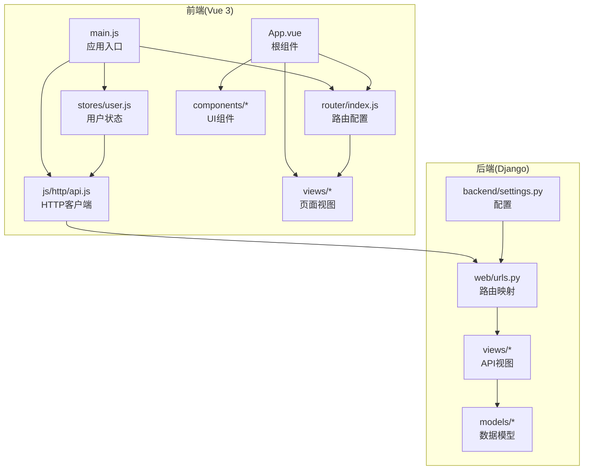
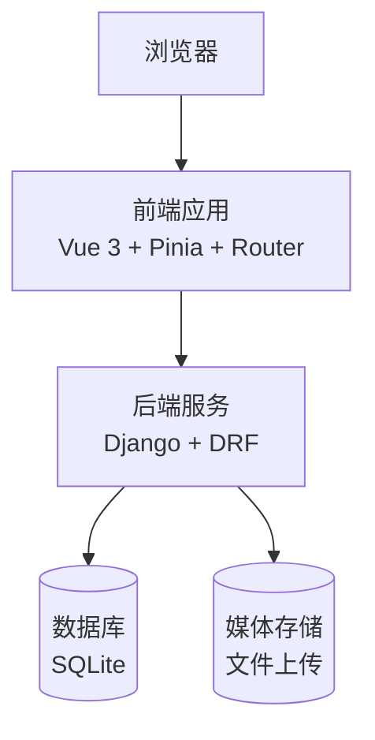
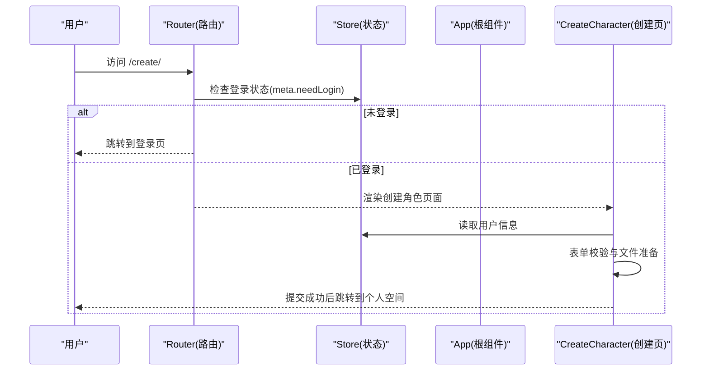
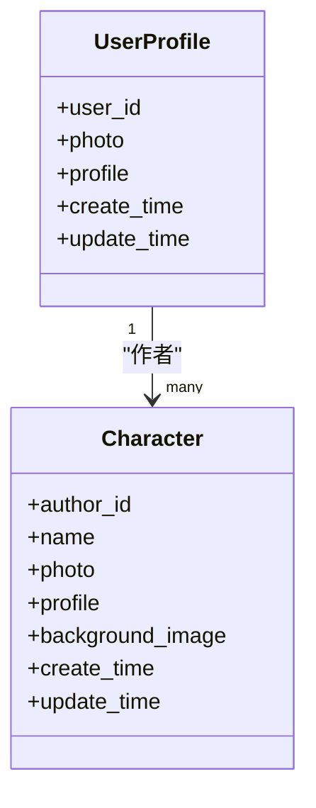
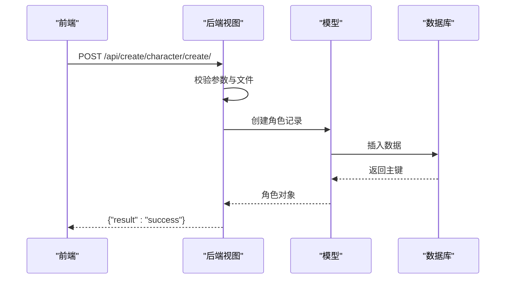
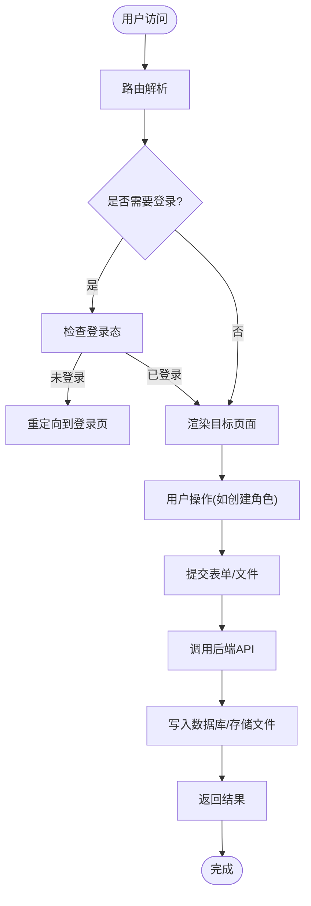
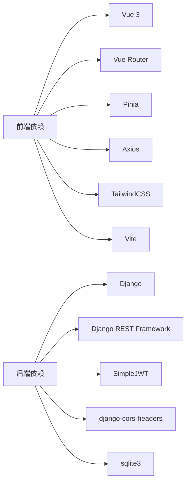

# 项目概述

<cite>
**本文档引用的文件**
- [README.md](file://README.md)
- [backend/backend/settings.py](file://backend/backend/settings.py)
- [backend/web/models/character.py](file://backend/web/models/character.py)
- [backend/web/models/user.py](file://backend/web/models/user.py)
- [backend/web/views/create/character/create.py](file://backend/web/views/create/character/create.py)
- [backend/web/views/user/account/register.py](file://backend/web/views/user/account/register.py)
- [backend/web/urls.py](file://backend/web/urls.py)
- [frontend/package.json](file://frontend/package.json)
- [frontend/src/main.js](file://frontend/src/main.js)
- [frontend/src/router/index.js](file://frontend/src/router/index.js)
- [frontend/src/stores/user.js](file://frontend/src/stores/user.js)
- [frontend/src/js/http/api.js](file://frontend/src/js/http/api.js)
- [frontend/src/App.vue](file://frontend/src/App.vue)
- [frontend/src/views/create/character/CreateCharacter.vue](file://frontend/src/views/create/character/CreateCharacter.vue)
- [frontend/src/components/navbar/NavBar.vue](file://frontend/src/components/navbar/NavBar.vue)
</cite>

## 目录
1. [引言](#引言)
2. [项目结构](#项目结构)
3. [核心组件](#核心组件)
4. [架构总览](#架构总览)
5. [详细组件分析](#详细组件分析)
6. [依赖分析](#依赖分析)
7. [性能考虑](#性能考虑)
8. [故障排除指南](#故障排除指南)
9. [结论](#结论)
10. [附录](#附录)

## 引言
本项目是一个基于 Vue 3 + Django 的全栈 Web 应用，旨在为用户提供创建、管理和分享 AI 角色的平台。系统通过前后端分离的设计，结合 JWT 认证、文件上传、路由守卫与 Pinia 状态管理，构建出从用户注册登录到角色创建与个人空间展示的完整闭环。

- 项目目标：提供一个易用、可扩展的 AI 角色创作与分享平台，支持用户以角色卡片的形式进行个性化展示与交互。
- 主要功能特性：
  - 用户账户体系：注册、登录、登出、信息拉取与令牌刷新。
  - 角色管理：创建、更新、删除、查看单个角色。
  - 文件上传：头像与聊天背景图的上传与存储。
  - 前端导航与路由守卫：根据登录状态动态显示菜单与页面访问控制。
  - 状态管理：使用 Pinia 进行全局用户状态管理。
- 技术选型理由：
  - Vue 3：组合式 API 提升开发体验与逻辑复用；配合 Vite 构建工具提升开发效率。
  - Django + DRF：成熟的后端框架，提供 ORM、认证、序列化与 RESTful 接口能力。
  - JWT：无状态认证，便于跨域与移动端集成；SimpleJWT 提供便捷的令牌生命周期管理。
  - SQLite：开发阶段轻量数据库，便于本地快速迭代。
  - Axios + 自定义拦截器：统一处理鉴权头与刷新流程，简化前端请求逻辑。
- 系统边界：
  - 后端边界：提供 RESTful API，负责用户与角色数据模型、文件上传与存储、JWT 颁发与校验。
  - 前端边界：提供 SPA 页面、路由导航、表单组件与状态管理，调用后端接口完成业务操作。
- 应用场景与目标用户：
  - 场景：创作者分享自己的 AI 角色、用户浏览与互动、个人空间集中展示。
  - 用户：对 AI 角色创作感兴趣的个人用户、内容创作者、社交分享者。

## 项目结构
项目采用前后端分离架构，目录组织清晰，职责明确：
- 后端（Django）
  - 配置与入口：settings.py、urls.py、wsgi.py、asgi.py
  - 应用模块：web（包含 models、views、templates、admin、apps、tests、urls）
  - 数据库迁移：web/migrations
- 前端（Vue 3 + Vite）
  - 入口与挂载：main.js
  - 路由：router/index.js
  - 状态管理：stores/user.js
  - HTTP 客户端：js/http/api.js
  - 视图与组件：views/*、components/*
  - 样式与资源：assets/main.css、public/*

**图表来源**
- [frontend/src/main.js:1-15](file://frontend/src/main.js#L1-L15)
- [frontend/src/router/index.js:1-110](file://frontend/src/router/index.js#L1-L110)
- [frontend/src/stores/user.js:1-53](file://frontend/src/stores/user.js#L1-L53)
- [frontend/src/js/http/api.js:1-93](file://frontend/src/js/http/api.js#L1-L93)
- [frontend/src/App.vue:1-41](file://frontend/src/App.vue#L1-L41)
- [backend/backend/settings.py:1-159](file://backend/backend/settings.py#L1-L159)
- [backend/web/urls.py:1-33](file://backend/web/urls.py#L1-L33)

**章节来源**
- [frontend/package.json:1-30](file://frontend/package.json#L1-L30)
- [backend/backend/settings.py:1-159](file://backend/backend/settings.py#L1-L159)
- [backend/web/urls.py:1-33](file://backend/web/urls.py#L1-L33)

## 核心组件
- 前端核心组件
  - 应用入口与挂载：初始化 Vue 实例、注册路由与状态管理。
  - 路由系统：定义页面路由、登录守卫与未匹配页面处理。
  - 用户状态：Pinia Store 维护用户登录态、令牌与个人信息。
  - HTTP 客户端：Axios 封装，自动注入 Authorization 头，处理 401 与令牌刷新。
  - 根组件：在挂载时拉取用户信息，确保导航与页面渲染一致。
  - 导航栏组件：响应式侧边栏、搜索框、登录/创作入口切换。
  - 创建角色页面：表单组件聚合、参数校验、文件转 FormData 并提交。
- 后端核心组件
  - 配置：Django 设置、中间件、静态/媒体文件、JWT 认证与跨域。
  - URL 映射：将前端路由与后端视图函数绑定。
  - 数据模型：用户档案与角色模型，含文件字段与上传路径策略。
  - 视图：用户注册、登录、登出、令牌刷新、用户信息获取、角色 CRUD。

**章节来源**
- [frontend/src/main.js:1-15](file://frontend/src/main.js#L1-L15)
- [frontend/src/router/index.js:1-110](file://frontend/src/router/index.js#L1-L110)
- [frontend/src/stores/user.js:1-53](file://frontend/src/stores/user.js#L1-L53)
- [frontend/src/js/http/api.js:1-93](file://frontend/src/js/http/api.js#L1-L93)
- [frontend/src/App.vue:1-41](file://frontend/src/App.vue#L1-L41)
- [frontend/src/components/navbar/NavBar.vue:1-77](file://frontend/src/components/navbar/NavBar.vue#L1-L77)
- [frontend/src/views/create/character/CreateCharacter.vue:1-84](file://frontend/src/views/create/character/CreateCharacter.vue#L1-L84)
- [backend/backend/settings.py:1-159](file://backend/backend/settings.py#L1-L159)
- [backend/web/urls.py:1-33](file://backend/web/urls.py#L1-L33)
- [backend/web/models/user.py:1-23](file://backend/web/models/user.py#L1-L23)
- [backend/web/models/character.py:1-32](file://backend/web/models/character.py#L1-L32)
- [backend/web/views/create/character/create.py:1-51](file://backend/web/views/create/character/create.py#L1-L51)
- [backend/web/views/user/account/register.py:1-45](file://backend/web/views/user/account/register.py#L1-L45)

## 架构总览
系统采用前后端分离的三层架构：
- 前端层：Vue 3 SPA，负责页面渲染、用户交互与状态管理。
- 接入层：Django 路由与视图，提供 RESTful API。
- 数据层：SQLite 数据库，配合 Django ORM 与文件存储。

**图表来源**
- [frontend/src/main.js:1-15](file://frontend/src/main.js#L1-L15)
- [frontend/src/js/http/api.js:1-93](file://frontend/src/js/http/api.js#L1-L93)
- [backend/backend/settings.py:79-84](file://backend/backend/settings.py#L79-L84)
- [backend/web/urls.py:1-33](file://backend/web/urls.py#L1-L33)

## 详细组件分析

### 前端组件分析
- 应用入口与挂载
  - 初始化 Vue、注册 Pinia 与 Router，挂载到 DOM。
- 路由系统
  - 定义多页面路由，设置 meta 字段控制是否需要登录。
  - 全局前置守卫：若目标路由需登录且用户未登录，跳转至登录页。
- 用户状态管理
  - 存储用户 ID、用户名、头像、签名、访问令牌等。
  - 提供登录态判断、设置令牌、设置用户信息与登出方法。
- HTTP 客户端
  - 自动在请求头添加 Bearer Token。
  - 拦截 401 错误：使用 Cookie 中的刷新令牌换取新访问令牌，成功后重试原请求。
- 根组件
  - 首次加载拉取用户信息，设置“已拉取”标志位，避免重复请求。
- 导航栏组件
  - 响应式抽屉菜单，根据登录状态显示“创作”或“登录”入口。
- 创建角色页面
  - 聚合头像、名称、简介、背景图组件，表单校验后构造 FormData 提交。

**图表来源**
- [frontend/src/router/index.js:99-107](file://frontend/src/router/index.js#L99-L107)
- [frontend/src/stores/user.js:1-53](file://frontend/src/stores/user.js#L1-L53)
- [frontend/src/App.vue:12-29](file://frontend/src/App.vue#L12-L29)
- [frontend/src/views/create/character/CreateCharacter.vue:21-59](file://frontend/src/views/create/character/CreateCharacter.vue#L21-L59)

**章节来源**
- [frontend/src/main.js:1-15](file://frontend/src/main.js#L1-L15)
- [frontend/src/router/index.js:1-110](file://frontend/src/router/index.js#L1-L110)
- [frontend/src/stores/user.js:1-53](file://frontend/src/stores/user.js#L1-L53)
- [frontend/src/js/http/api.js:1-93](file://frontend/src/js/http/api.js#L1-L93)
- [frontend/src/App.vue:1-41](file://frontend/src/App.vue#L1-L41)
- [frontend/src/components/navbar/NavBar.vue:1-77](file://frontend/src/components/navbar/NavBar.vue#L1-L77)
- [frontend/src/views/create/character/CreateCharacter.vue:1-84](file://frontend/src/views/create/character/CreateCharacter.vue#L1-L84)

### 后端组件分析
- 配置与中间件
  - INSTALLED_APPS 包含 DRF 与 corsheaders，启用跨域与 JWT。
  - MIDDLEWARE 中 CORS 放置靠前，保证跨域预检优先处理。
  - REST_FRAMEWORK 使用 SimpleJWT，配置令牌有效期与头类型。
- URL 映射
  - 将用户账户、用户资料与角色相关 API 映射到对应视图类。
  - 通配符路由用于支持前端 SPA 的历史模式。
- 数据模型
  - 用户档案：一对一关联 Django 内置 User，含头像与简介字段。
  - 角色：外键关联用户档案，含名称、头像、简介与背景图字段。
- 视图类
  - 注册：校验用户名与密码，创建用户与用户档案，颁发访问与刷新令牌。
  - 创建角色：校验必填字段与文件，创建角色记录。
  - 其他：登录、登出、刷新令牌、获取用户信息、更新用户资料等。

**图表来源**
- [backend/web/models/user.py:14-23](file://backend/web/models/user.py#L14-L23)
- [backend/web/models/character.py:21-32](file://backend/web/models/character.py#L21-L32)

**图表来源**
- [backend/web/views/create/character/create.py:9-51](file://backend/web/views/create/character/create.py#L9-L51)
- [backend/web/models/character.py:21-32](file://backend/web/models/character.py#L21-L32)

**章节来源**
- [backend/backend/settings.py:33-54](file://backend/backend/settings.py#L33-L54)
- [backend/backend/settings.py:136-151](file://backend/backend/settings.py#L136-L151)
- [backend/web/urls.py:1-33](file://backend/web/urls.py#L1-L33)
- [backend/web/models/user.py:1-23](file://backend/web/models/user.py#L1-L23)
- [backend/web/models/character.py:1-32](file://backend/web/models/character.py#L1-L32)
- [backend/web/views/create/character/create.py:1-51](file://backend/web/views/create/character/create.py#L1-L51)
- [backend/web/views/user/account/register.py:1-45](file://backend/web/views/user/account/register.py#L1-L45)

### 概念性总览
以下为系统运行的概念性流程，帮助初学者理解从用户访问到数据持久化的整体过程。

[此图为概念性流程图，不直接映射具体源码文件，故不提供图表来源]

## 依赖分析
- 前端依赖
  - Vue 3、Vue Router、Pinia：构建响应式 UI 与状态管理。
  - Axios：HTTP 请求封装与拦截器。
  - TailwindCSS：样式工具集。
  - Vite：构建与开发服务器。
- 后端依赖
  - Django、djangorestframework：Web 框架与 DRF。
  - djangorestframework-simplejwt：JWT 认证。
  - django-cors-headers：跨域支持。
  - sqlite3：默认数据库引擎。

**图表来源**
- [frontend/package.json:14-28](file://frontend/package.json#L14-L28)
- [backend/backend/settings.py:40-43](file://backend/backend/settings.py#L40-L43)

**章节来源**
- [frontend/package.json:1-30](file://frontend/package.json#L1-L30)
- [backend/backend/settings.py:1-159](file://backend/backend/settings.py#L1-L159)

## 性能考虑
- 前端
  - 使用 Vite 构建，开发热更新与按需打包提升开发体验。
  - Axios 拦截器减少重复代码，统一处理错误与刷新逻辑。
  - Pinia 状态仅保存必要字段，避免不必要的响应式开销。
- 后端
  - SQLite 适合开发与小规模数据，生产建议迁移到 PostgreSQL/MySQL。
  - 文件上传路径采用 UUID 截断命名，避免路径冲突与过长文件名问题。
  - JWT 令牌短生命周期，降低泄露风险；刷新令牌安全存储于 HttpOnly Cookie。
- 可优化点
  - 前端：对图片上传增加压缩与尺寸限制，减少带宽与存储压力。
  - 后端：对热点接口增加缓存层，对文件存储引入 CDN。

[本节为通用性能建议，不直接分析具体文件，故不提供章节来源]

## 故障排除指南
- 常见问题与定位
  - 登录后仍被重定向到登录页：检查路由守卫条件与用户状态是否正确设置。
  - 401 未授权：确认访问令牌是否过期，刷新令牌是否有效，Cookie 是否携带。
  - 图片上传失败：检查上传路径策略与文件大小限制，确认后端 MEDIA 配置。
  - 跨域问题：确认 CORS 配置与前端请求地址一致。
- 关键排查点
  - 前端：路由守卫、状态管理、HTTP 拦截器。
  - 后端：JWT 配置、CORS、URL 映射、模型字段与文件上传路径。

**章节来源**
- [frontend/src/router/index.js:99-107](file://frontend/src/router/index.js#L99-L107)
- [frontend/src/stores/user.js:1-53](file://frontend/src/stores/user.js#L1-L53)
- [frontend/src/js/http/api.js:46-90](file://frontend/src/js/http/api.js#L46-L90)
- [backend/backend/settings.py:153-159](file://backend/backend/settings.py#L153-L159)
- [backend/web/urls.py:1-33](file://backend/web/urls.py#L1-L33)
- [backend/web/models/character.py:9-18](file://backend/web/models/character.py#L9-L18)

## 结论
本项目以 Vue 3 与 Django 为核心，构建了一个功能完备的 AI 角色创建与管理平台。通过清晰的前后端分层、完善的路由与状态管理、以及基于 JWT 的认证与文件上传机制，系统在开发效率与用户体验之间取得了良好平衡。后续可在性能优化、安全加固与部署方案方面持续演进，以满足更大规模的应用需求。

[本节为总结性内容，不直接分析具体文件，故不提供章节来源]

## 附录
- 快速启动建议
  - 后端：安装依赖后执行数据库迁移，启动 Django 开发服务器。
  - 前端：安装依赖后启动 Vite 开发服务器，访问前端地址。
- 开发规范
  - 前端：组件命名与目录结构保持一致，API 调用集中在 http 目录。
  - 后端：视图函数职责单一，模型字段约束明确，URL 命名规范。

[本节为通用指导内容，不直接分析具体文件，故不提供章节来源]