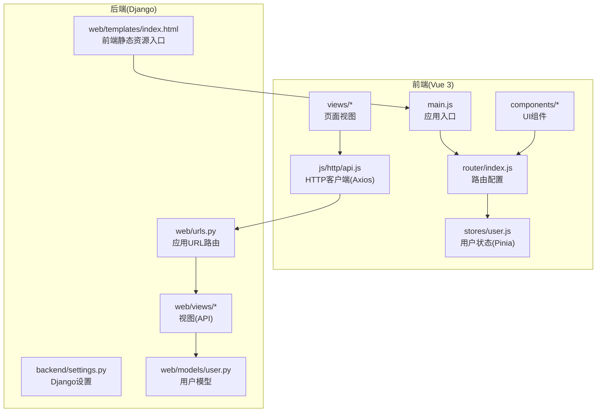
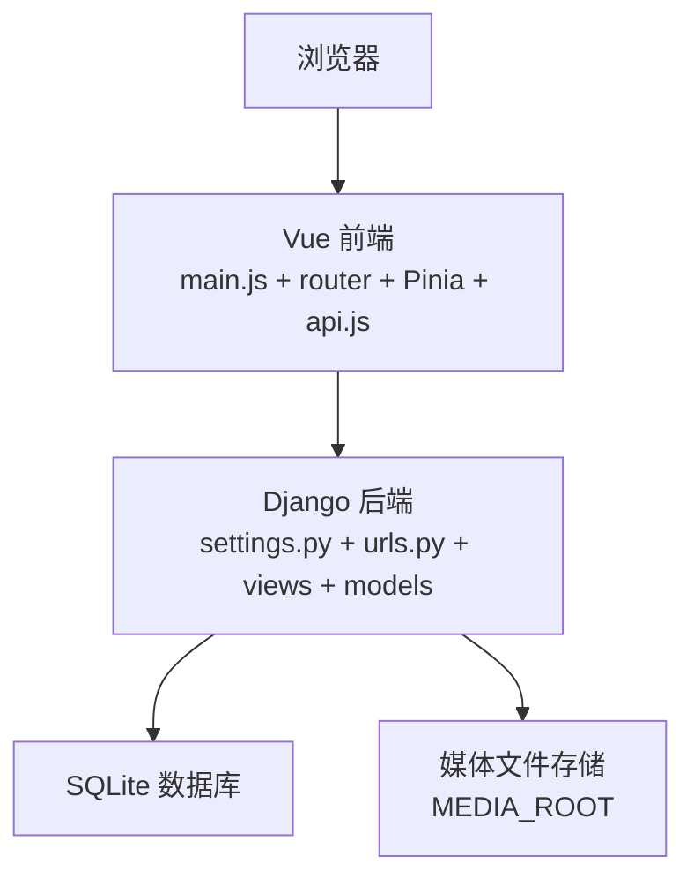
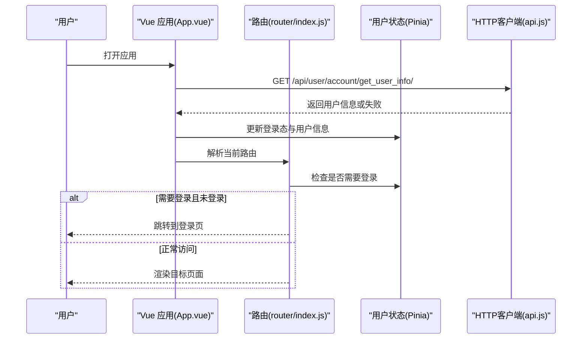
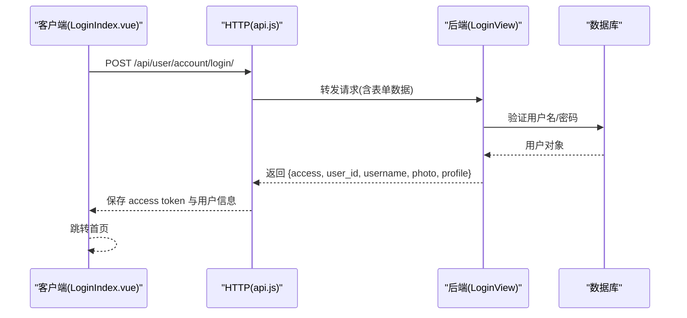
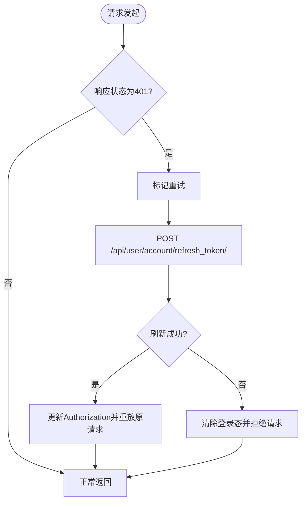
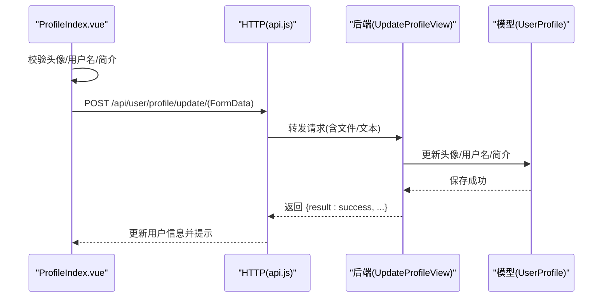
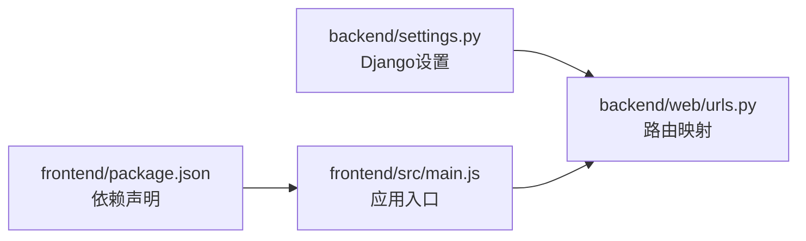

# 项目概述

<cite>
**本文引用的文件**
- [README.md](file://README.md)
- [settings.py](file://backend/backend/settings.py)
- [urls.py](file://backend/web/urls.py)
- [index.py](file://backend/web/views/index.py)
- [index.html](file://backend/web/templates/index.html)
- [login.py](file://backend/web/views/user/account/login.py)
- [register.py](file://backend/web/views/user/account/register.py)
- [user.py](file://backend/web/models/user.py)
- [package.json](file://frontend/package.json)
- [main.js](file://frontend/src/main.js)
- [router/index.js](file://frontend/src/router/index.js)
- [user.js](file://frontend/src/stores/user.js)
- [api.js](file://frontend/src/js/http/api.js)
- [App.vue](file://frontend/src/App.vue)
- [LoginIndex.vue](file://frontend/src/views/user/account/LoginIndex.vue)
- [ProfileIndex.vue](file://frontend/src/views/user/profile/ProfileIndex.vue)
- [NavBar.vue](file://frontend/src/components/navbar/NavBar.vue)
</cite>

## 目录
1. [引言](#引言)
2. [项目结构](#项目结构)
3. [核心组件](#核心组件)
4. [架构总览](#架构总览)
5. [详细组件分析](#详细组件分析)
6. [依赖分析](#依赖分析)
7. [性能考虑](#性能考虑)
8. [故障排除指南](#故障排除指南)
9. [结论](#结论)

## 引言
本项目是一个基于 Vue 3 + Django 的全栈社交应用，目标是为用户提供用户认证、个人资料管理与基础社交功能体验。项目采用前后端分离架构：前端使用 Vue 3 + Pinia + Vue Router 构建单页应用（SPA），后端使用 Django + Django REST Framework 提供 REST API，并通过 JWT 实现认证与会话管理。整体设计理念强调“开箱即用”的开发体验与清晰的模块边界，便于初学者快速上手，同时为有经验的开发者提供可扩展的技术栈。

## 项目结构
项目采用典型的前后端分离目录组织方式：
- 后端（Django）位于 backend/，包含 Django 项目配置、应用 web、数据库模型、视图与模板等。
- 前端（Vue 3）位于 frontend/，包含构建工具配置、路由、状态管理、HTTP 客户端、组件与视图等。
- 根目录包含仓库级 .gitignore 与顶层 README。

图表来源
- [main.js:1-15](file://frontend/src/main.js#L1-L15)
- [router/index.js:1-104](file://frontend/src/router/index.js#L1-L104)
- [user.js:1-59](file://frontend/src/stores/user.js#L1-L59)
- [api.js:1-92](file://frontend/src/js/http/api.js#L1-L92)
- [settings.py:1-158](file://backend/backend/settings.py#L1-L158)
- [urls.py:1-24](file://backend/web/urls.py#L1-L24)
- [user.py:1-23](file://backend/web/models/user.py#L1-L23)
- [index.html:1-17](file://backend/web/templates/index.html#L1-L17)

章节来源
- [README.md:1-1](file://README.md#L1-L1)
- [package.json:1-30](file://frontend/package.json#L1-L30)
- [settings.py:1-158](file://backend/backend/settings.py#L1-L158)

## 核心组件
- 前端应用入口与依赖注入
  - 应用通过 main.js 初始化 Vue、Pinia、Vue Router，并挂载到 DOM。
- 路由与导航
  - router/index.js 定义页面路由与登录守卫，控制访问权限。
- 状态管理
  - stores/user.js 维护用户登录态、头像、简介、访问令牌等。
- HTTP 客户端
  - js/http/api.js 封装 Axios，统一注入 Authorization 头，处理 401 与 Token 刷新。
- 后端服务
  - backend/settings.py 配置 REST Framework、JWT、CORS、静态/媒体文件路径。
  - web/urls.py 映射用户账户与资料相关 API。
  - web/views/user/account/* 提供登录、注册、登出、刷新 Token、获取用户信息。
  - web/models/user.py 定义用户资料模型（头像、简介、时间戳）。
  - web/templates/index.html 将前端构建产物嵌入 Django 模板，作为 SPA 入口。

章节来源
- [main.js:1-15](file://frontend/src/main.js#L1-L15)
- [router/index.js:1-104](file://frontend/src/router/index.js#L1-L104)
- [user.js:1-59](file://frontend/src/stores/user.js#L1-L59)
- [api.js:1-92](file://frontend/src/js/http/api.js#L1-L92)
- [settings.py:136-151](file://backend/backend/settings.py#L136-L151)
- [urls.py:1-24](file://backend/web/urls.py#L1-L24)
- [user.py:1-23](file://backend/web/models/user.py#L1-L23)
- [index.html:1-17](file://backend/web/templates/index.html#L1-L17)

## 架构总览
系统采用“前端 SPA + 后端 REST API”模式，前后端通过 HTTP 通信，后端提供 JWT 认证与用户资料管理能力。Django 负责用户认证、权限控制、数据模型与静态资源托管；Vue 前端负责路由、状态、UI 与 API 调用。

图表来源
- [main.js:1-15](file://frontend/src/main.js#L1-L15)
- [router/index.js:1-104](file://frontend/src/router/index.js#L1-L104)
- [api.js:1-92](file://frontend/src/js/http/api.js#L1-L92)
- [settings.py:79-84](file://backend/backend/settings.py#L79-L84)
- [urls.py:1-24](file://backend/web/urls.py#L1-L24)
- [user.py:15-23](file://backend/web/models/user.py#L15-L23)

## 详细组件分析

### 前端应用启动与路由守卫
- 应用入口 main.js 创建并挂载 Vue 应用，注册 Pinia 与路由。
- App.vue 在挂载时拉取当前用户信息，完成登录态初始化，并根据路由元信息决定是否跳转至登录页。
- router/index.js 定义多条路由，含主页、好友、创作、登录、注册、个人空间与资料页；beforeEach 守卫对需登录的路由进行校验。

图表来源
- [App.vue:13-31](file://frontend/src/App.vue#L13-L31)
- [router/index.js:92-101](file://frontend/src/router/index.js#L92-L101)
- [user.js:18-20](file://frontend/src/stores/user.js#L18-L20)
- [api.js:16-27](file://frontend/src/js/http/api.js#L16-L27)

章节来源
- [main.js:1-15](file://frontend/src/main.js#L1-L15)
- [App.vue:1-43](file://frontend/src/App.vue#L1-L43)
- [router/index.js:1-104](file://frontend/src/router/index.js#L1-L104)
- [user.js:1-59](file://frontend/src/stores/user.js#L1-L59)

### 用户认证流程（登录/注册）
- 登录流程
  - 前端 LoginIndex.vue 收集用户名与密码，调用 api.js 发送 POST 请求至 /api/user/account/login/。
  - 后端 LoginView 接收凭据，使用 Django 认证系统验证，成功后生成 JWT 并下发 access token，同时写入 refresh token Cookie。
  - 前端保存 access token 与用户信息，跳转到首页。
- 注册流程
  - 前端 RegisterIndex.vue 发送注册请求至 /api/user/account/register/。
  - 后端 RegisterView 创建 User 与 UserProfile，生成 JWT 并下发 access token 与 refresh token Cookie。
  - 前端保存 access token 与用户信息。

图表来源
- [LoginIndex.vue:15-41](file://frontend/src/views/user/account/LoginIndex.vue#L15-L41)
- [api.js:16-27](file://frontend/src/js/http/api.js#L16-L27)
- [login.py:9-46](file://backend/web/views/user/account/login.py#L9-L46)

章节来源
- [login.py:1-92](file://backend/web/views/user/account/login.py#L1-L92)
- [register.py:1-46](file://backend/web/views/user/account/register.py#L1-L46)
- [LoginIndex.vue:1-69](file://frontend/src/views/user/account/LoginIndex.vue#L1-L69)

### 令牌刷新与 401 自动恢复
- 当后端返回 401 时，api.js 会使用 Cookie 中的 refresh token 调用 /api/user/account/refresh_token/ 刷新 access token。
- 成功刷新后重放原始请求；若刷新失败则清除本地登录状态并中断请求链路。

图表来源
- [api.js:46-90](file://frontend/src/js/http/api.js#L46-L90)
- [urls.py:12-16](file://backend/web/urls.py#L12-L16)

章节来源
- [api.js:1-92](file://frontend/src/js/http/api.js#L1-L92)
- [urls.py:1-24](file://backend/web/urls.py#L1-L24)

### 个人资料管理
- ProfileIndex.vue 负责展示与更新用户资料，包括头像、用户名与简介。
- 前端对必填字段进行即时校验，必要时将头像转换为文件并提交至 /api/user/profile/update/。
- 后端 UpdateProfileView 接收表单数据，更新 UserProfile 并返回最新用户信息。

图表来源
- [ProfileIndex.vue:17-52](file://frontend/src/views/user/profile/ProfileIndex.vue#L17-L52)
- [api.js:16-19](file://frontend/src/js/http/api.js#L16-L19)
- [urls.py:17-17](file://backend/web/urls.py#L17-L17)

章节来源
- [ProfileIndex.vue:1-77](file://frontend/src/views/user/profile/ProfileIndex.vue#L1-L77)
- [urls.py:1-24](file://backend/web/urls.py#L1-L24)

### 导航与菜单
- NavBar.vue 提供顶部导航与左侧抽屉式菜单，根据登录态显示不同入口（创作、登录、用户菜单）。
- 通过 RouterLink 与图标组件组合，形成一致的交互体验。

章节来源
- [NavBar.vue:1-83](file://frontend/src/components/navbar/NavBar.vue#L1-L83)

## 依赖分析
- 前端依赖
  - Vue 3、Vue Router、Pinia、Axios、TailwindCSS、Vite 等，满足现代前端开发需求。
- 后端依赖
  - Django、Django REST Framework、SimpleJWT、CORS 头支持，提供认证、序列化与跨域能力。
- 静态资源与模板
  - Django 模板 index.html 引入前端构建产物，实现 SPA 与后端的无缝集成。

图表来源
- [package.json:11-25](file://frontend/package.json#L11-L25)
- [settings.py:33-43](file://backend/backend/settings.py#L33-L43)
- [main.js:1-15](file://frontend/src/main.js#L1-L15)
- [urls.py:1-24](file://backend/web/urls.py#L1-L24)

章节来源
- [package.json:1-30](file://frontend/package.json#L1-L30)
- [settings.py:1-158](file://backend/backend/settings.py#L1-L158)

## 性能考虑
- 前端
  - 使用 Pinia 管理轻量状态，避免不必要的响应式开销。
  - Axios 统一拦截器减少重复逻辑，提升请求/响应处理效率。
- 后端
  - SQLite 适合开发与小规模测试；生产建议迁移到高性能数据库并启用缓存层。
  - JWT 访问令牌短生命周期配合刷新令牌，降低鉴权成本。
- 静态资源
  - 前端构建产物由 Django 模板加载，确保资源路径与版本控制一致。

## 故障排除指南
- 登录后仍被重定向到登录页
  - 检查 App.vue 是否成功拉取用户信息并设置登录态。
  - 确认 router/index.js 的登录守卫逻辑与用户状态一致。
- 401 未自动刷新
  - 检查 api.js 的拦截器是否正确注入 Authorization 头。
  - 确认后端 /api/user/account/refresh_token/ 能正常返回新的 access token。
- 头像上传失败
  - 确认前端将头像转换为文件并随表单提交。
  - 检查后端 UpdateProfileView 对文件字段的接收与保存逻辑。
- CORS 或跨域问题
  - 确认 settings.py 中 CORS 配置允许前端源地址。

章节来源
- [App.vue:13-31](file://frontend/src/App.vue#L13-L31)
- [router/index.js:92-101](file://frontend/src/router/index.js#L92-L101)
- [api.js:46-90](file://frontend/src/js/http/api.js#L46-L90)
- [urls.py:12-16](file://backend/web/urls.py#L12-L16)
- [settings.py:153-158](file://backend/backend/settings.py#L153-L158)

## 结论
本项目以 Vue 3 + Django 为基础，提供了完整的用户认证、个人资料管理与基础社交功能入口。通过清晰的前后端职责划分、JWT 认证与自动令牌刷新机制，以及 Pinia 状态管理与 Axios 拦截器，项目在易用性与可维护性之间取得良好平衡。建议后续在生产环境完善数据库与缓存、接入更严格的权限控制与安全策略，并持续优化前端交互与后端接口性能。